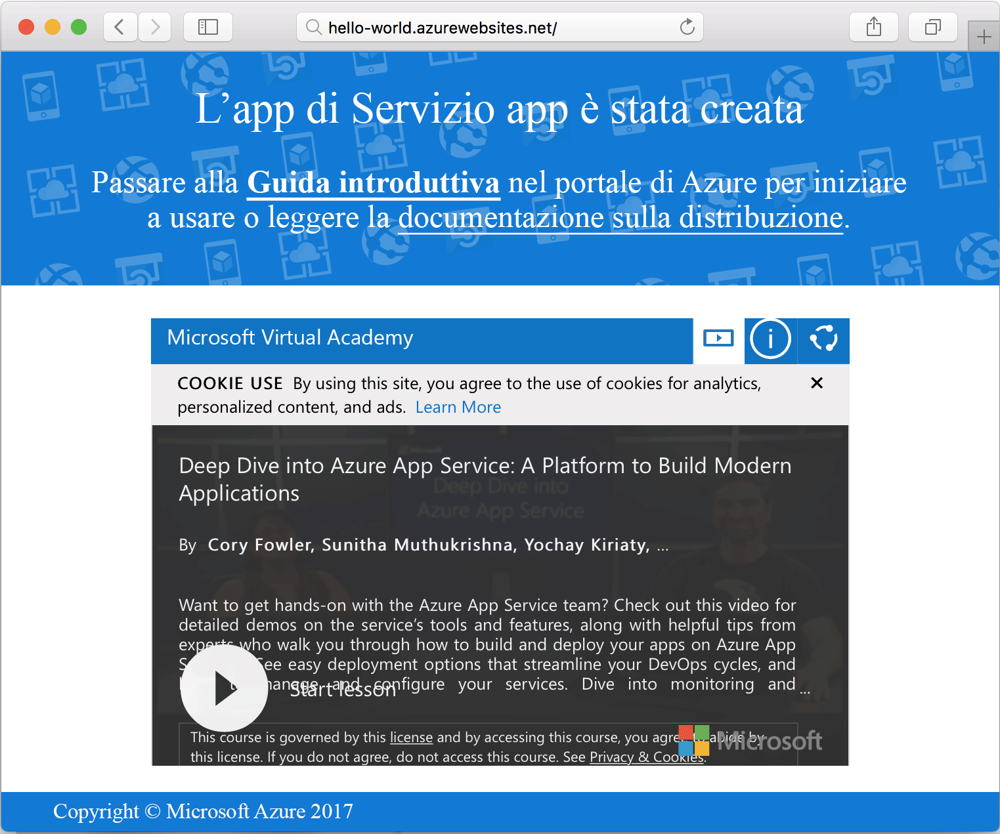

# <a name="create-a-ruby-app-in-app-service-on-linux"></a>Creare un'app Ruby nel Servizio app in Linux

Il [Servizio app in Linux](app-service-linux-intro.md) fornisce un servizio di hosting Web ad alta scalabilità e con funzioni di auto-correzione. In questa guida introduttiva viene illustrato come creare un'applicazione Ruby on Rails di base e quindi distribuirla in App Web di Azure in Linux.


## <a name="prerequisites"></a>prerequisiti

* <a href="https://www.ruby-lang.org/en/documentation/installation/#rubyinstaller" target="_blank">Installare Ruby 2.4.1 o versione successiva</a>
* <a href="https://git-scm.com/" target="_blank">Installare Git</a>

[!INCLUDE [quickstarts-free-trial-note](../../../includes/quickstarts-free-trial-note.md)]

## <a name="download-the-sample"></a>Scaricare l'esempio

In una finestra del terminale eseguire il comando seguente per clonare il repository dell'app di esempio nel computer locale:

```bash
git clone https://github.com/Azure-Samples/ruby-docs-hello-world
```

## <a name="run-the-application-locally"></a>Eseguire l'applicazione in locale

Eseguire il server della barra di scorrimento per il funzionamento dell'applicazione. Passare alla directory *hello-world* e il comando `rails server` avvia il server.

```bash
cd hello-world\bin
rails server
```

Tramite il Web browser, passare a `http://localhost:3000` per testare l'app in locale.


## <a name="modify-app-to-display-welcome-message"></a>Modificare l'app per visualizzare il messaggio di benvenuto

Modificare l'applicazione in modo da visualizzare un messaggio di benvenuto. Prima di tutto, è necessario configurare una route modificando il file *~/workspace/ruby-docs-hello-world/config/routes.rb* in modo da includere una route denominata `hello`.

  ```ruby
  Rails.application.routes.draw do
      #For details on the DSL available within this file, see http://guides.rubyonrails.org/routing.html
      root 'application#hello'
  end
  ```

Modificare il controller dell'applicazione in modo che restituisca il messaggio in formato HTML nel browser. 

Aprire *~/workspace/hello-world/app/controllers/application_controller.rb* per la modifica. Modificare la classe `ApplicationController` per avere l'aspetto dell'esempio di codice seguente:

  ```ruby
  class ApplicationController > ActionController :: base
    protect_from_forgery with: :exception
    def hello
      render html: "Hello, world from Azure Web App on Linux!"
    end
  end
  ```

Ora l'app è configurata. Tramite il Web browser, passare a `http://localhost:3000` per confermare la pagina di destinazione principale.


[!INCLUDE [Try Cloud Shell](../../../includes/cloud-shell-try-it.md)]

[!INCLUDE [Configure deployment user](../../../includes/configure-deployment-user.md)]

## <a name="create-a-ruby-web-app-on-azure"></a>Creare una app web Ruby in Azure

Deve essere presente un gruppo di risorse in cui includere gli asset necessari per l'app Web. Per creare un gruppo di risorse, usare il comando [az group create]().

```azurecli-interactive
az group create --location westeurope --name myResourceGroup
```

Usare il comando [az appservice plan create](/cli/azure/appservice/plan?view=azure-cli-latest#az_appservice_plan_create) per creare un piano di servizio app per l'app web.

```azurecli-interactive
az appservice plan create --name myAppServicePlan --resource-group myResourceGroup --is-linux
```

Eseguire quindi il comando [az webapp create](/cli/azure/webapp?view=azure-cli-latest#az_webapp_create) per creare l'app web che usa il piano di servizio appena creato. Si noti che il runtime è impostato su `ruby|2.3`. Non dimenticare di sostituire `<app name>` con un nome univoco dell'app.

```azurecli-interactive
az webapp create --resource-group myResourceGroup --plan myAppServicePlan --name <app name> \
--runtime "ruby|2.3" --deployment-local-git
```

L'output del comando visualizza informazioni sulla nuova app Web creata e sull'URL di distribuzione. L'output dovrebbe essere simile all'esempio seguente. Copiare l'URL, che dovrà essere usato più avanti in questa esercitazione.

```bash
https://<deployment user name>@<app name>.scm.azurewebsites.net/<app name>.git
```

Una volta creato l'app web, è disponibile una pagina **Panoramica** per la visualizzazione. Passare ad essa. Viene visualizzata la pagina iniziale seguente:




## <a name="deploy-your-application"></a>Distribuire l'applicazione

Eseguire i comandi seguenti per distribuire l'applicazione locale al sito Web di Azure:

```bash
git remote add azure <Git deployment URL from above>
git add -A
git commit -m "Initial deployment commit"
git push azure master
```

Verificare che per le operazioni di distribuzione in remoto venga segnalato l'esito positivo. I comandi generano un output simile al testo seguente:

```bash
remote: Using sass-rails 5.0.6
remote: Updating files in vendor/cache
remote: Bundle gems are installed into ./vendor/bundle
remote: Updating files in vendor/cache
remote: ~site/repository
remote: Finished successfully.
remote: Running post deployment command(s)...
remote: Deployment successful.
To https://<your web app name>.scm.azurewebsites.net/<your web app name>.git
  579ccb....2ca5f31  master -> master
myuser@ubuntu1234:~workspace/<app name>$
```

Dopo aver completato la distribuzione, riavviare l'app Web affinché la distribuzione venga applicata tramite il comando [az webapp restart](/cli/azure/webapp?view=azure-cli-latest#az_webapp_restart), come mostrato di seguito:

```azurecli-interactive
az webapp restart --name <app name> --resource-group myResourceGroup
```

Passare al sito e verificare i risultati.

```bash
http://<app name>.azurewebsites.net
```


> [!NOTE]
> Mentre l'app viene riavviata, il tentativo di aprire il sito genera un codice di stato HTTP `Error 503 Server unavailable`. Il completamento del riavvio potrebbe richiedere alcuni minuti.
>

[!INCLUDE [Clean-up section](../../../includes/cli-script-clean-up.md)]

## <a name="next-steps"></a>Passaggi successivi

> [!div class="nextstepaction"]
> [Ruby on Rails con MySQL](tutorial-ruby-mysql-app.md)
