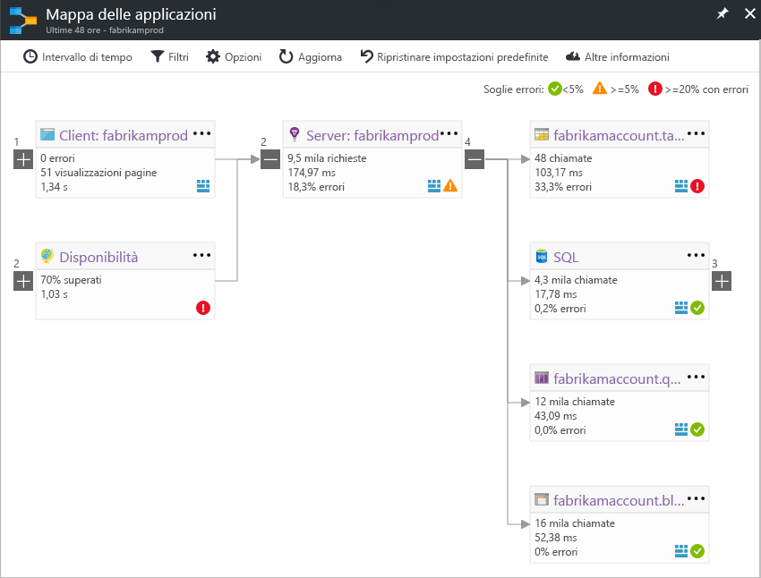

# Mappa delle applicazioni in Application InsightsApplication Map in Application Insights
In [Azure Application Insights](app-insights-overview.md), Mappa delle applicazioni è un layout visivo delle relazioni di dipendenza dei componenti dell'applicazione.In [Azure Application Insights](app-insights-overview.md), Application Map is a visual layout of the dependency relationships of your application components. Ogni componente mostra gli indicatori KPI, ad esempio carico, prestazioni, errori e avvisi per individuare eventuali componenti che generano un errore o un problema di prestazioni.Each component shows KPIs such as load, performance, failures, and alerts, to help you discover any component causing a performance issue or failure. È possibile fare clic da qualsiasi componente per ottenere una diagnostica più dettagliata, ad esempio sugli eventi di Application Insights.You can click through from any component to more detailed diagnostics, such as Application Insights events. Se l'app usa i servizi di Azure, è possibile anche fare clic sulla diagnostica di Azure, ad esempio per consigli di Advisor su database SQL.If your app uses Azure services, you can also click through to Azure diagnostics, such as SQL Database Advisor recommendations.

Come altri tipi di grafico, è possibile aggiungere una mappa delle applicazioni al dashboard di Azure, in cui è completamente funzionale.Like other charts, you can pin an application map to the Azure dashboard, where it is fully functional. 

## Aprire la mappa delle applicazioniOpen the application map
Aprire la mappa nel pannello di panoramica dell'applicazione:Open the map from the overview blade for your application:

La mappa mostra:The map shows:

* Test della disponibilitàAvailability tests
* Componente lato client (monitorato con JavaScript SDK)Client-side component (monitored with the JavaScript SDK)
* Componente lato serverServer-side component
* Dipendenze dei componenti client e serverDependencies of the client and server components

È possibile espandere e comprimere i gruppi di collegamento di dipendenza:You can expand and collapse dependency link groups:

Se si dispone di numerose dipendenze di un tipo (SQL, HTTP e così via), possono essere visualizzate raggruppate.If you have many dependencies of one type (SQL, HTTP etc.), they may appear grouped. 

## Individuazione di problemiSpot problems
Ogni nodo dispone di indicatori di prestazioni rilevanti, ad esempio tassi di carico, prestazioni ed errori per il componente.Each node has relevant performance indicators, such as the load, performance, and failure rates for that component. 

Le icone di avviso evidenziano possibili problemi.Warning icons highlight possible problems. Un avviso di colore arancione indica che si verificano errori nelle richieste, visualizzazioni di pagina o chiamate di dipendenza.An orange warning means there are failures in requests, page views or dependency calls. Il rosso indica una percentuale di errore superiore al 5%.Red means a failure rate above 5%. Se si vuole modificare queste soglie, aprire Opzioni.If you want to adjust these thresholds, open Options.

Vengono visualizzati anche avvisi attivi:Active alerts also show up: 

Se si usa SQL Azure, è presente un'icona che indica quando sono disponibili consigli su come è possibile migliorare le prestazioni.If you use SQL Azure, there's an icon that shows when there are recommendations on how you can improve performance. 

Per ottenere altri dettagli, fare clic su qualsiasi icona:Click any icon to get more details:

## Diagnostica tramite clicDiagnostic click through
Ciascun nodo della mappa permette una diagnostica tramite clic mirati.Each of the nodes on the map offers targeted click through for diagnostics. Le opzioni variano a seconda del tipo del nodo.The options vary depending on the type of the node.

Per i componenti ospitati in Azure, le opzioni includono collegamenti diretti a essi.For components that are hosted in Azure, the options include direct links to them.

## Filtri e intervallo di tempoFilters and time range
Per impostazione predefinita, la mappa riepiloga tutti i dati disponibili per l'intervallo di tempo scelto.By default, the map summarizes all the data available for the chosen time range. è possibile filtrarlo in modo da includere solo i nomi di operazioni o dipendenze specifici.But you can filter it to include only specific operation names or dependencies.

* Nome dell'operazione: include sia le visualizzazioni pagina che i tipi di richiesta lato server.Operation name: This includes both page views and server-side request types. Con questa opzione, la mappa mostra l'indicatore KPI nel nodo lato server/client solo per le operazioni selezionate.With this option, the map shows the KPI on the server/client-side node for the selected operations only. Mostra le dipendenze chiamate nel contesto di tali operazioni specifiche.It shows the dependencies called in the context of those specific operations.
* Nome di base delle dipendenze: include le dipendenze del browser AJAX e lato server.Dependency base name: This includes the AJAX browser dependencies and server-side dependencies. Se si segnalano dati di telemetria di dipendenza personalizzati con l'API TrackDependency, questi vengono visualizzati anche qui.If you report custom dependency telemetry with the TrackDependency API, they also appear here. È possibile selezionare le dipendenze da mostrare sulla mappa.You can select the dependencies to show on the map. Attualmente, questa selezione non filtra le richieste lato server o le visualizzazioni di pagina lato client.Currently this selection does not filter the server-side requests, or the client-side page views.

## Salvare i filtriSave filters
Per salvare i filtri applicati, bloccare la visualizzazione filtrata su un [dashboard](app-insights-dashboards.md).To save the filters you have applied, pin the filtered view onto a [dashboard](app-insights-dashboards.md).

## Riquadro dell'erroreError pane
Quando si fa clic su un nodo nella mappa, viene visualizzato un riquadro dell'errore sul lato destro che riassume i problemi relativi a tale nodo.When you click a node in the map, an error pane is displayed on the right-hand side summarizing failures for that node. Gli errori vengono prima raggruppati per ID operazione e quindi per ID del problema.Failures are grouped first by operation ID and then grouped by problem ID.

Per passare all'istanza più recente dell'errore fare clic sull'errore stesso.Clicking on a failure takes you to the most recent instance of that failure.

## Integrità delle risorseResource health
Per alcuni tipi di risorsa, l'integrità delle risorse viene visualizzata nella parte superiore del riquadro dell'errore.For some resource types, resource health is displayed at the top of the error pane. Ad esempio, facendo clic su un nodo SQL verranno visualizzati l'integrità del database ed eventuali avvisi che sono stati attivati.For example, clicking a SQL node will show the database health and any alerts that have fired.

È possibile fare clic sul nome della risorsa per visualizzare le metriche di panoramica standard per la risorsa.You can click the resource name to view standard overview metrics for that resource.

## Mappe delle app del sistema end-to-endEnd-to-end system app maps

*È necessaria la versione 2.3 o successive di SDK**Requires SDK version 2.3 or higher*

Se l'applicazione include diversi componenti, ad esempio un servizio back-end oltre all'App Web, è anche possibile visualizzarli tutti in una mappa integrata delle app.If your application has several components - for example, a back-end service in addition to the web app - then you can show them all on one integrated app map.

La mappa dell'app consente di trovare i nodi del server seguendo le chiamate di dipendenza HTTP inviate tra i server con Application Insights SDK installato.The app map finds server nodes by following any HTTP dependency calls made between servers with the Application Insights SDK installed. Si presuppone che ogni risorsa di Application Insights contenga un server.Each Application Insights resource is assumed to contain one server.

### Mappa con app multi-ruolo (anteprima)Multi-role app map (preview)

La funzionalità di anteprima della mappa dell'app multi-ruolo consente di usare la mappa dell'app con più server che inviano dati alla stessa risorsa o alla stessa chiave di strumentazione di Application Insights.The preview multi-role app map feature allows you to use the app map with multiple servers sending data to the same Application Insights resource  / instrumentation key. I server nella mappa vengono segmentati in base alla proprietà cloud_RoleName negli elementi di telemetria.Servers in the map are segmented by the cloud_RoleName property on telemetry items. Impostare *Multi-role Application Map* (Mappa dell'applicazione multi-ruolo) su *On* (Attivo) nel pannello Anteprime per abilitare questa configurazione.Set *Multi-role Application Map* to *On* from the Previews blade to enable this configuration.

Questo approccio potrebbe essere necessario in un'applicazione di micro-servizi o in altri scenari in cui si desidera correlare gli eventi tra più server all'interno di una singola risorsa di Application Insights.This approach may be desired in a micro-services application, or in other scenarios where you want to correlate events across multiple servers within a single Application Insights resource.

## VideoVideo

> [!VIDEO https://channel9.msdn.com/events/Connect/2016/112/player] 

## Commenti e suggerimentiFeedback
Inviare commenti e suggerimenti tramite l'apposita opzione del portale.Please provide feedback through the portal feedback option.

## Passaggi successiviNext steps

* [Portale di AzureAzure portal](https://portal.azure.com)
