# Panoramica di Application Insights per DevOpsOverview of Application Insights for DevOps

Con [Application Insights](app-insights-overview.md) è possibile capire velocemente le prestazioni dell'app e come viene usata quando è attiva.With [Application Insights](app-insights-overview.md), you can quickly find out how your app is performing and being used when it's live. Se è presente un problema, consente di scoprirlo, aiuta a valutarne l'impatto e a determinarne la causa.If there's a problem, it lets you know about it, helps you assess the impact, and helps you determine the cause.

Ecco un account da un team che sviluppa applicazioni web:Here's an account from a team that develops web applications:

* *"Un paio di giorni fa, è stato distribuito un 'piccolo' aggiornamento rapido. Non è stato eseguito un superamento test esteso, ma purtroppo alcune modifiche impreviste sono state unite nel payload, a causa di incompatibilità tra il front-end e il back-end. Immediatamente si è verificato un incremento delle eccezioni del server, sono stati generati avvisi e si è venuti a conoscenza della situazione. Con pochi clic nel portale di Application Insights si ottengono informazioni sufficienti dagli stack di chiamate delle eccezioni per circoscrivere il problema. È stato eseguito immediatamente il rollback e i danni sono stati limitati. Application Insights ha reso questa parte del ciclo DevOps molto semplice e utilizzabile."**"A couple of days ago, we deployed a 'minor' hotfix. We didn't run a broad test pass, but unfortunately some unexpected change got merged into the payload, causing incompatibility between the front and back ends. Immediately, server exceptions surged, our alert fired, and we were made aware of the situation. A few clicks away on the Application Insights portal, we got enough information from exception callstacks to narrow down the problem. We rolled back immediately and limited the damage. Application Insights has made this part of the devops cycle very easy and actionable."*

In questo articolo si seguirà un team di Fabrikam Bank che sviluppa il sistema di servizi bancari online (OBS) per vedere come viene usato Application Insights per rispondere ai clienti e apportare aggiornamenti velocemente.In this article we follow a team in Fabrikam Bank that develops the online banking system (OBS) to see how they use Application Insights to quickly respond to customers and make updates.  

Il team lavora con un ciclo DevOps illustrato nella figura seguente:The team works on a DevOps cycle depicted in the following illustration:

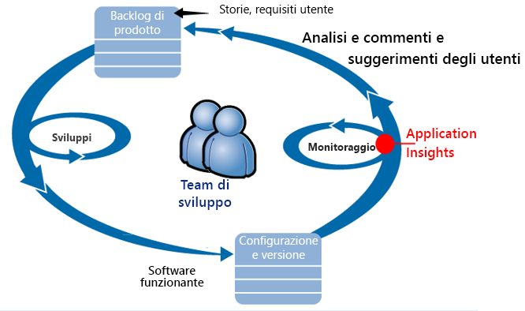

I requisiti passano nel backlog di sviluppo (elenco attività).Requirements feed into their development backlog (task list). Lavorano per brevi sprint, in cui spesso viene distribuito il software funzionante - in genere sotto forma di miglioramenti ed estensioni per l'applicazione esistente.They work in short sprints, which often deliver working software - usually in the form of improvements and extensions to the existing application. L'app attiva viene aggiornata di frequente con le nuove funzionalità.The live app is frequently updated with new features. Mentre è attiva, il team ne esegue il monitoraggio per le prestazioni e l'uso con l'aiuto di Application Insights.While it's live, the team monitors it for performance and usage with the help of Application Insights. Questi dati APM riconducono al loro backlog di sviluppo.This APM data feeds back into their development backlog.

Il team usa Application Insights per monitorare attentamente l'applicazione web attiva per gli elementi seguenti:The team uses Application Insights to monitor the live web application closely for:

* Prestazioni.Performance. Il team vuole capire come variano i tempi di risposta in base al numero di richieste; la quantità usata di CPU, la rete, il disco e altre risorse, e dove sono i colli di bottiglia.They want to understand how response times vary with request count; how much CPU, network, disk, and other resources are being used; and where the bottlenecks are.
* Errori.Failures. Se esistono eccezioni o richieste non riuscite, o se un contatore delle prestazioni non rientra nell'intervallo noto, il team deve esserne informato rapidamente in modo che sia possibile intraprendere l'azione.If there are exceptions or failed requests, or if a performance counter goes outside its comfortable range, the team needs to know rapidly so that they can take action.
* Utilizzo.Usage. Ogni volta che viene rilasciata una nuova funzionalità, il team desidera sapere in quale misura viene usata e se gli utenti hanno difficoltà con essa.Whenever a new feature is released, the team want to know to what extent it is used, and whether users have any difficulties with it.

Ci si concentra ora parte del ciclo dedicata ai commenti e suggerimenti:Let's focus on the feedback part of the cycle:

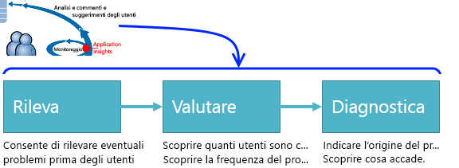

## Rilevare scarsa disponibilitàDetect poor availability
Marcela Markova è un senior developer del team di OBS e accetta di essere responsabile del monitoraggio delle prestazioni online.Marcela Markova is a senior developer on the OBS team, and takes the lead on monitoring online performance. Imposta alcuni [test di disponibilità](app-insights-monitor-web-app-availability.md):She sets up several [availability tests](app-insights-monitor-web-app-availability.md):

* Un test con singolo URL per la pagina di destinazione principale per l'app, http://fabrikambank.com/onlinebanking/.A single-URL test for the main landing page for the app, http://fabrikambank.com/onlinebanking/. Imposta i criteri del codice HTTP 200 e il testo 'Benvenuto'.She sets criteria of HTTP code 200 and text 'Welcome!'. Se il test ha esito negativo, è presente un grave problema relativo alla rete o ai server o forse un problema di distribuzione,If this test fails, there's something seriously wrong with the network or the servers, or maybe a deployment issue. oppure un utente ha modificato il messaggio di benvenuto(Or someone has changed the Welcome! nella pagina senza comunicarlo a lei.message on the page without letting her know.)
* Un test più approfondito in più passaggi, che registra e ottiene un elenco di account corrente, che verifica alcuni dettagli chiave in ogni pagina.A deeper multi-step test, which logs in and gets a current account listing, checking a few key details on each page. Questo test verifica che il collegamento al database degli account sia funzionante.This test verifies that the link to the accounts database is working. Usa un id cliente fittizio: alcuni vengono mantenuti a scopo di test.She uses a fictitious customer id: a few of them are maintained for test purposes.

Con questi test impostati, Marcela è certa che il team verrà rapidamente a conoscenza di ogni interruzione.With these tests set up, Marcela is confident that the team will quickly know about any outage.  

Gli errori vengono visualizzati come punti rossi nel grafico del test Web:Failures show up as red dots on the web test chart:

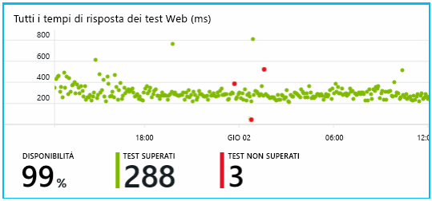

Ma soprattutto viene inviato al team di sviluppo un avviso su eventuali errori mediante posta elettronica.But more importantly, an alert about any failure is emailed to the development team. In questo modo ne verranno a conoscenza prima quasi tutti i clienti.In that way, they know about it before nearly all the customers.

## Monitorare le prestazioniMonitor Performance
Nella pagina Panoramica in Application Insights è presente un grafico che mostra una serie di [metriche chiave](app-insights-web-monitor-performance.md).On the overview page in Application Insights, there's a chart that shows a variety of [key metrics](app-insights-web-monitor-performance.md).

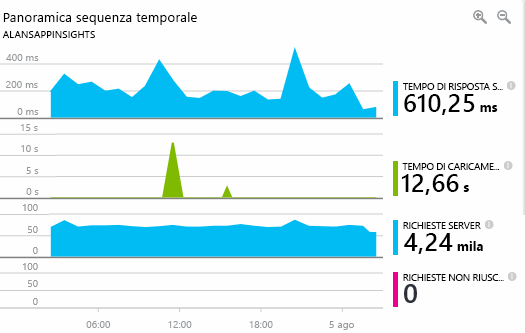

Il tempo di caricamento della pagina del browser deriva dai dati di telemetria inviati direttamente dalle pagine Web.Browser page load time is derived from telemetry sent directly from web pages. Il tempo di risposta del server, il numero di richieste al server e il numero di richieste non riuscite sono tutti misurati nel server Web e inviati direttamente ad Application Insights.Server response time, server request count, and failed request count are all measured in the web server and sent to Application Insights from there.

Marcela è un po' in apprensione riguardo al grafico di risposta del server,Marcela is slightly concerned with the server response graph. che mostra il tempo medio che intercorre tra il momento in cui il server riceve una richiesta HTTP dal browser di un utente al momento in cui viene inviata la risposta.This graph shows the average time between when the server receives an HTTP request from a user's browser, and when it returns the response. Non è raro vedere una variazione all'interno del grafico, in ragione della variazione del carico sul sistema.It isn't unusual to see a variation in this chart, as load on the system varies. Tuttavia, nel caso specifico sembra che vi sia una correlazione tra gli incrementi minimi nel conteggio delle risposte e quelli rilevanti nel tempo di risposta.But in this case, there seems to be a correlation between small rises in the count of requests, and big rises in the response time. Questa correlazione potrebbe indicare che il funzionamento del sistema è al limite.That could indicate that the system is operating just at its limits.

Apre i grafici dei server:She opens the Servers charts:

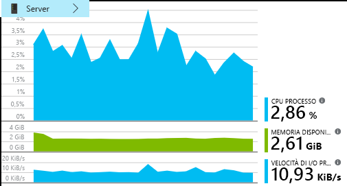

Apparentemente non si rilevano limitazioni delle risorse, quindi magari i salti nei grafici di risposta del server sono solo una coincidenza.There seems to be no sign of resource limitation there, so maybe the bumps in the server response charts are just a coincidence.

## Impostare avvisi per soddisfare gli obiettiviSet alerts to meet goals
Marcela, ad ogni modo, vuole monitorare i tempi di risposta.Nevertheless, she'd like to keep an eye on the response times. Se aumentano in modo eccessivo, vuole esserne informata.If they go too high, she wants to know about it immediately.

Quindi imposta un [avviso](app-insights-metrics-explorer.md) se i tempi di risposta sono superiori alla soglia tipica.So she sets an [alert](app-insights-metrics-explorer.md), for response times greater than a typical threshold. Questo le consentirà di conoscere la velocità dei tempi di risposta.This gives her confidence that she'll know about it if response times are slow.

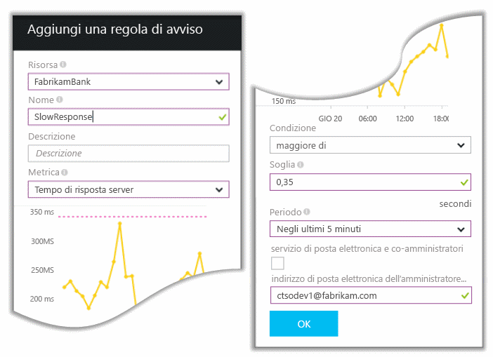

È possibile impostare avvisi su svariate altre metriche.Alerts can be set on a wide variety of other metrics. Ad esempio, è possibile ricevere messaggi di posta elettronica se il numero di eccezioni risulta elevato o la memoria disponibile è insufficiente o se è presente un picco nelle richieste del client.For example, you can receive emails if the exception count becomes high, or the available memory goes low, or if there is a peak in client requests.

## Rimanere aggiornati con gli avvisi di rilevamento intelligenteStay informed with Smart Detection Alerts
Il giorno successivo arriva un avviso in posta elettronica da Application Insights.Next day, an alert email does arrive from Application Insights. Tuttavia, quando lo apre, vede che non si tratta dell'avviso sul tempo di risposta che aveva impostato.But when she opens it, she finds it isn't the response time alert that she set. Al contrario, indica che c'è stato un aumento improvviso delle richieste non riuscite, ovvero, delle richieste che hanno restituito 500 o più codici di errore.Instead, it tells her there's been a sudden rise in failed requests - that is, requests that have returned failure codes of 500 or more.

Le richieste non riuscite sono quelle richieste in cui gli utenti hanno individuato un errore, in genere dopo un'eccezione generata nel codice.Failed requests are where users have seen an error - typically following an exception thrown in the code. Forse viene visualizzato il messaggio "Sorry we couldn't update your details right now" (Non è possibile aggiornare i dettagli adesso).Maybe they see a message saying "Sorry we couldn't update your details right now." Oppure, nella peggiore delle ipotesi, viene visualizzato un dump dello stack sullo schermo dell'utente concesso dal server web.Or, at absolute embarrassing worst, a stack dump appears on the user's screen, courtesy of the web server.

L'avviso la lascia stupita perché l'ultima volta il numero delle richieste non riuscite era particolarmente basso.This alert is a surprise, because the last time she looked at it, the failed request count was encouragingly low. In un server occupato, un numero esiguo di errori è un evento prevedibile.A small number of failures is to be expected in a busy server.

Lo stupore nasceva anche dal fatto che non era necessario configurare l'avviso.It was also a bit of a surprise for her because she didn't have to configure this alert. Application Insights include il rilevamento intelligente.Application Insights include Smart Detection. Si adatta automaticamente al consueto modello di errore dell'app "abituandosi" agli errori di una particolare pagina o un carico elevato, o collegato ad altre metriche.It automatically adjusts to your app's usual failure pattern, and "gets used to" failures on a particular page, or under high load, or linked to other metrics. Genera l'avviso solo in caso di un aumento prevedibile.It raises the alarm only if there's a rise above what it comes to expect.

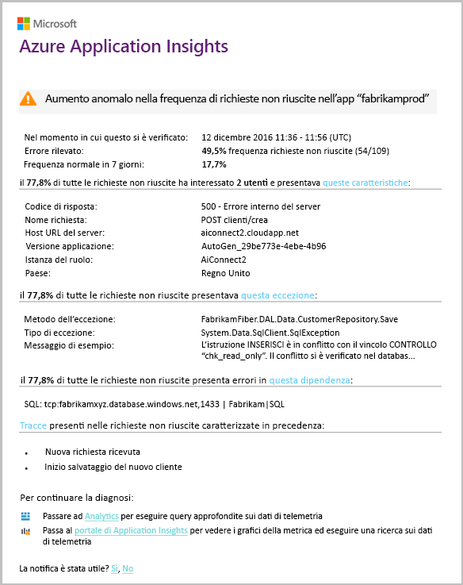

Si tratta di un messaggio di posta elettronica molto utile.This is a very useful email. Non si limita a generare un avviso,It doesn't just raise an alarm. ma esegue anche valutazioni e diagnosi.It does a lot of the triage and diagnostic work, too.

Mostra il numero di clienti coinvolti e le pagine Web o le operazioni.It shows how many customers are affected, and which web pages or operations. Marcela può decidere se è necessario ottenere l'impegno dell'intero team come esercitazione, o se può essere ignorato fino alla settimana successiva.Marcela can decide whether she needs to get the whole team working on this as a fire drill, or whether it can be ignored until next week.

Il messaggio di posta elettronica mostra inoltre il verificarsi di una particolare eccezione e, cosa ancora più interessante, che l'errore è associato a chiamate non riuscite a un particolare database.The email also shows that a particular exception occurred, and - even more interesting - that the failure is associated with failed calls to a particular database. Questo spiega come mai si è generato improvvisamente l'errore anche se il team di Marcela non ha distribuito aggiornamenti di recente.This explains why the fault suddenly appeared even though Marcela's team has not deployed any updates recently.

Marcella contatta il responsabile del team di database in merito a questo messaggio di posta elettronica.Marcella pings the leader of the database team based on this email. Apprende che è stato rilasciato un aggiornamento rapido nell'ultima mezz'ora; forse può essere stato eseguito un piccolo cambiamento di schema...She learns that they released a hot fix in the past half hour; and Oops, maybe there might have been a minor schema change....

In definitiva, il problema sta per essere risolto anche prima di esaminare i log, e dopo soli 15 minuti dal momento in cui si è generato l'errore.So the problem is on the way to being fixed, even before investigating logs, and within 15 minutes of it arising. Tuttavia, Marcela seleziona il collegamento per aprire Application Insights.However, Marcela clicks the link to open Application Insights. Si apre direttamente su una richiesta non riuscita in cui è possibile visualizzare la chiamata al database non riuscita nell'elenco delle chiamate di dipendenza associato.It opens straight onto a failed request, and she can see the failed database call in the associated list of dependency calls.

## Rilevare le eccezioniDetect exceptions
Con una configurazione minima, le [eccezioni](app-insights-asp-net-exceptions.md) vengono segnalate automaticamente ad Application Insights.With a little bit of setup, [exceptions](app-insights-asp-net-exceptions.md) are reported to Application Insights automatically. Possono anche essere acquisite in modo esplicito con l'inserimento di chiamate a [TrackException()](app-insights-api-custom-events-metrics.md#trackexception) nel codice:They can also be captured explicitly by inserting calls to [TrackException()](app-insights-api-custom-events-metrics.md#trackexception) into the code:  

    var telemetry = new TelemetryClient();
    ...
    try
    { ...
    }
    catch (Exception ex)
    {
       // Set up some properties:
       var properties = new Dictionary <string, string>
         {{"Game", currentGame.Name}};

       var measurements = new Dictionary <string, double>
         {{"Users", currentGame.Users.Count}};

       // Send the exception telemetry:
       telemetry.TrackException(ex, properties, measurements);
    }

Il team della banca Fabrikam ha sviluppato la pratica di inviare sempre i dati di telemetria di un'eccezione, a meno che non vi sia un ripristino ovvio.The Fabrikam Bank team has evolved the practice of always sending telemetry on an exception, unless there's an obvious recovery.  

In effetti, la strategia usata è persino più ampia: vengono inviati i dati di telemetria in tutti i casi in cui il cliente sia frustrato riguardo a ciò che voleva fare, che corrisponda o meno a un'eccezione del codice.In fact, their strategy is even broader than that: They send telemetry in every case where the customer is frustrated in what they wanted to do, whether it corresponds to an exception in the code or not. Ad esempio, se il sistema esterno di bonifico interbancario restituisce un messaggio che indica che non è possibile completare l'operazione per qualche ragione operativa (nessun errore del cliente), allora si tiene traccia di quell'evento.For example, if the external inter-bank transfer system returns a "can't complete this transaction" message for some operational reason (no fault of the customer) then they track that event.

    var successCode = AttemptTransfer(transferAmount, ...);
    if (successCode < 0)
    {
       var properties = new Dictionary <string, string>
            {{ "Code", returnCode, ... }};
       var measurements = new Dictionary <string, double>
         {{"Value", transferAmount}};
       telemetry.TrackEvent("transfer failed", properties, measurements);
    }

TrackException viene usato per segnalare le eccezioni perché invia una copia dello stack.TrackException is used to report exceptions because it sends a copy of the stack. TrackEvent viene usato per segnalare altri eventi.TrackEvent is used to report other events. È possibile collegare le proprietà che potrebbero essere utili nella diagnosi.You can attach any properties that might be useful in diagnosis.

Eccezioni ed eventi vengono visualizzati nel pannello [Ricerca diagnostica](app-insights-diagnostic-search.md).Exceptions and events show up in the [Diagnostic Search](app-insights-diagnostic-search.md) blade. È possibile esaminarli per visualizzare le proprietà aggiuntive e l'analisi dello stack.You can drill into them to see the additional properties and stack trace.

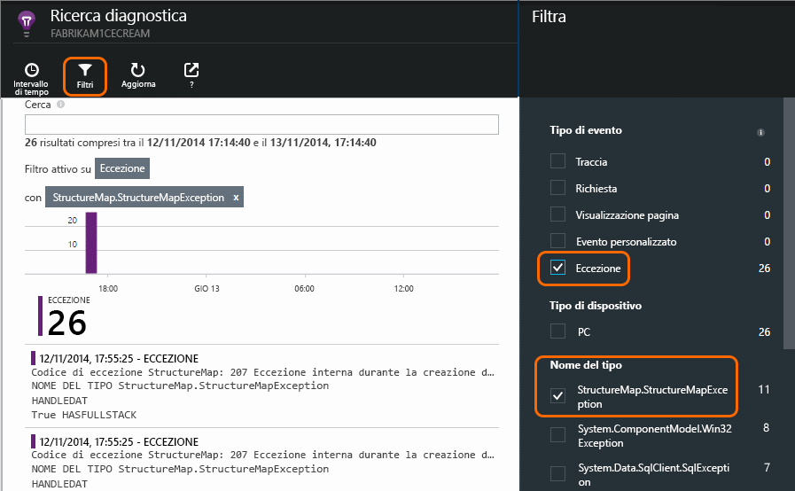

## Monitorare in modo proattivoMonitor proactively
Marcela non resta ferma in attesa di avvisi.Marcela doesn't just sit around waiting for alerts. Subito dopo ogni ridistribuzione, esamina i [tempi di risposta](app-insights-web-monitor-performance.md), sia la figura nel suo complesso che la tabella delle richieste più lente, nonché il numero di eccezioni.Soon after every redeployment, she takes a look at [response times](app-insights-web-monitor-performance.md) - both the overall figure and the table of slowest requests, as well as exception counts.  

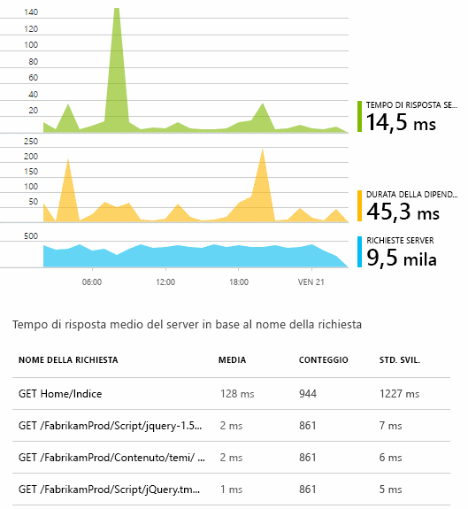

Marcela riesce a valutare l'impatto sulle prestazioni di ogni distribuzione, in genere confrontando ogni settimana con l'ultima.She can assess the performance effect of every deployment, typically comparing each week with the last. Se si verifica un improvviso peggioramento, lo segnala agli sviluppatori rilevanti.If there's a sudden worsening, she raises that with the relevant developers.

## Problemi di valutazioneTriage issues
Valutazione: consente di valutare la gravità e l'estensione di un problema.Triage - assessing the severity and extent of a problem - is the first step after detection. È il primo passaggio dopo il rilevamento.Should we call out the team at midnight? Si dovrebbe chiamare il team a mezzanotte oppure è possibile soprassedere fino al successivo divario utile nel backlog?Or can it be left until the next convenient gap in the backlog? Esistono alcune domande fondamentali nella valutazione.There are some key questions in triage.

Con quale frequenza succede?How often is it happening? I grafici nel pannello Panoramica offrono nuove prospettive per risolvere un problema.The charts on the Overview blade give some perspective to a problem. Ad esempio, l'applicazione di Fabrikam ha generato quattro avvisi di test Web una notte.For example, the Fabrikam application generated four web test alerts one night. Osservando il grafico il mattino successivo, il team ha potuto vedere che vi erano infatti alcuni punti rossi, anche se la maggior parte dei test erano in verde.Looking at the chart in the morning, the team could see that there were indeed some red dots, though still most of the tests were green. Esaminando il grafico di disponibilità, era chiaro che tutti questi problemi intermittenti provenivano da un'unica posizione di test.Drilling into the availability chart, it was clear that all of these intermittent problems were from one test location. La situazione era ovviamente dovuta a un problema di rete che interessava solo una route e molto probabilmente si sarebbe risolta automaticamente da sola.This was obviously a network issue affecting only one route, and would most likely clear itself.  

Al contrario, un aumento significativo e stabile nel grafico del numero di eccezioni e dei tempi di risposta è ovviamente qualcosa di cui preoccuparsi seriamente.By contrast, a dramatic and stable rise in the graph of exception counts or response times is obviously something to panic about.

Una tattica di valutazione utile è fare una prova in prima persona.A useful triage tactic is Try It Yourself. Se si rileva lo stesso problema, risulta chiaro che è reale.If you run into the same problem, you know it's real.

Quale parte di utenti è interessata?What fraction of users are affected? Per ottenere una risposta approssimativa, dividere la percentuale di errori per il numero di sessioni.To obtain a rough answer, divide the failure rate by the session count.

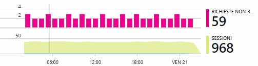

Quando le risposte sono lente, confrontare la tabella delle richieste che rispondono più lentamente con la frequenza d'uso di ogni pagina.When there are slow responses, compare the table of slowest-responding requests with the usage frequency of each page.

Quanto è importante lo scenario bloccato?How important is the blocked scenario? Se si tratta di un problema funzionale che blocca una storia utente specifica, chiedersi quanto è importante.If this is a functional problem blocking a particular user story, does it matter much? Se i clienti non possono pagare le fatture, si tratta di un problema grave. Se non è possibile modificare le preferenze di colore dello schermo, è un problema non urgente.If customers can't pay their bills, this is serious; if they can't change their screen color preferences, maybe it can wait. I dettagli dell'evento o dell'eccezione o l'identità della pagina lenta consentono di individuare dove i clienti riscontrano problemi.The detail of the event or exception, or the identity of the slow page, tells you where customers are having trouble.

## Diagnosticare i problemiDiagnose issues
La diagnosi non è proprio uguale al debug.Diagnosis isn't quite the same as debugging. Prima di iniziare l'analisi del codice, si deve avere un'idea approssimativa del motivo, del luogo e del momento in cui si verifica il problema.Before you start tracing through the code, you should have a rough idea of why, where and when the issue is occurring.

**Quando si verifica?****When does it happen?** La visualizzazione cronologica fornita dai grafici di eventi e di metriche consente di correlare gli effetti alle possibili cause.The historical view provided by the event and metric charts makes it easy to correlate effects with possible causes. Se sono presenti picchi intermittenti nel tempo di risposta e nella frequenza delle eccezioni, esaminare il numero di richieste: se i picchi si presentano contemporaneamente, sembrerebbe un problema di risorse.If there are intermittent peaks in response time or exception rates, look at the request count: if it peaks at the same time, then it looks like a resource problem. È necessario assegnare più CPU o memoriaDo you need to assign more CPU or memory? oppure è una dipendenza che non riesce a gestire il carico?Or is it a dependency that can't manage the load?

**Dipende da chi?****Is it us?**  Se si verifica una riduzione improvvisa delle prestazioni di un particolare tipo di richiesta, ad esempio quando il cliente desidera un estratto conto, potrebbe essere dovuto a un sottosistema esterno invece che all'applicazione Web.If you have a sudden drop in performance of a particular type of request - for example when the customer wants an account statement - then there's a possibility it might be an external subsystem rather than your web application. In Esplora metriche, selezionare la percentuale di errori di dipendenza e la frequenza della durata delle dipendenze e confrontare le cronologie delle ultime ore o giorni con il problema rilevato.In Metrics Explorer, select the Dependency Failure rate and Dependency Duration rates and compare their histories over the past few hours or days with the problem you detected. Se vi sono variazioni di correlazione, il problema potrebbe essere dovuto a un sottosistema esterno.If there are correlating changes, then an external subsystem might be to blame.  

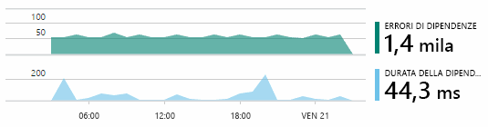

Alcuni problemi di dipendenza lenta sono problemi di georilevazione.Some slow dependency issues are geolocation problems. La banca Fabrikam usa macchine virtuali di Azure e ha scoperto che aveva inavvertitamente posizionato i server Web e di account in paesi diversi.Fabrikam Bank uses Azure virtual machines, and discovered that they had inadvertently located their web server and account server in different countries. Si è avuto un notevole miglioramento con la migrazione di uno dei server.A dramatic improvement was brought about by migrating one of them.

**Che cosa è successo?****What did we do?** Se il problema non sembra essere una dipendenza e se non è sempre presente, è probabilmente causato da una modifica recente.If the issue doesn't appear to be in a dependency, and if it wasn't always there, it's probably caused by a recent change. La prospettiva storica offerta dai grafici di metriche e di eventi semplifica la correlazione di eventuali modifiche improvvise con le distribuzioni.The historical perspective provided by the metric and event charts makes it easy to correlate any sudden changes with deployments. Ciò consente di limitare l'ambito della ricerca del problema.That narrows down the search for the problem.

**Cosa sta succedendo?****What's going on?** Alcuni problemi si verificano solo raramente e possono essere difficili da rilevare mediante il test offline.Some problems occur only rarely and can be difficult to track down by testing offline. È possibile solo tentare di acquisire il bug quando si verifica in tempo reale.All we can do is to try to capture the bug when it occurs live. È possibile esaminare i dump dello stack nei report di eccezione.You can inspect the stack dumps in exception reports. Inoltre, è possibile scrivere le chiamate di traccia, con il framework di registrazione preferito o con TrackTrace() o TrackEvent().In addition, you can write tracing calls, either with your favorite logging framework or with TrackTrace() or TrackEvent().  

Fabrikam ha un problema intermittente con i trasferimenti tra conti, ma solo con determinati tipi di conti.Fabrikam had an intermittent problem with inter-account transfers, but only with certain account types. Per comprendere meglio la situazione, sono state inserite chiamate TrackTrace() in punti chiave nel codice, associando il tipo di conto come una proprietà a ogni chiamata.To understand better what was happening, they inserted TrackTrace() calls at key points in the code, attaching the account type as a property to each call. In tal modo è facile filtrare solo quelle tracce in Ricerca diagnostica.That made it easy to filter out just those traces in Diagnostic Search. Sono stati associati anche i valori dei parametri come proprietà e misure alle chiamate di traccia.They also attached parameter values as properties and measures to the trace calls.

## Rispondere ai problemi individuatiRespond to discovered issues
Una volta che è stato diagnosticato il problema, è possibile creare un piano per risolverlo.Once you've diagnosed the issue, you can make a plan to fix it. Potrebbe essere necessario eseguire il rollback di una modifica recente o forse è sufficiente andare avanti per risolvere il problema.Maybe you need to roll back a recent change, or maybe you can just go ahead and fix it. Dopo aver eseguito la correzione, Application Insights indicherà se ha avuto esito positivo.Once the fix is done, Application Insights tells you whether you succeeded.  

Il team di sviluppo della banca Fabrikam adotta un approccio più strutturato per la misurazione delle prestazioni rispetto a quello usato prima di Application Insights.Fabrikam Bank's development team take a more structured approach to performance measurement than they used to before they used Application Insights.

* Gli obiettivi delle prestazioni erano impostati in termini di misure specifiche nella pagina di panoramica di Application Insights.They set performance targets in terms of specific measures in the Application Insights overview page.
* Progettano le misurazioni di prestazioni nell'applicazione fin dall'inizio, ad esempio le metriche che misurano l'avanzamento utente tramite 'grafici'.They design performance measures into the application from the start, such as the metrics that measure user progress through 'funnels.'  

## Monitorare l'attività dell'utenteMonitor user activity
Quando il tempo di risposta è coerentemente adeguato e sono presenti poche eccezioni, il team di sviluppo può passare all'usabilità.When response time is consistently good and there are few exceptions, the dev team can move on to usability. Si può pensare a come migliorare l'esperienza degli utenti e a incoraggiare più utenti affinché raggiungano gli obiettivi desiderati.They can think about how to improve the users' experience, and how to encourage more users to achieve the desired goals.

Application Insights consente anche di essere usato per informazioni sulle operazioni che gli utenti possono eseguire con un'app.Application Insights can also be used to learn what users do with an app. Dopo che è stato eseguito senza problemi, il team desidera sapere quali funzionalità sono più diffuse, quali sono quelle preferite dagli utenti o quali presentano problemi e quali sono visitate più frequentemente.Once it's running smoothly, the team would like to know which features are the most popular, what users like or have difficulty with, and how often they come back. Tali informazioni consentiranno di stabilire le priorità relative al lavoro imminente.That will help them prioritize their upcoming work. E sarà possibile valutare l'esito di ogni funzionalità come parte del ciclo di sviluppo.And they can plan to measure the success of each feature as part of the development cycle. 

Ad esempio, un tipico percorso utente nel sito Web presenta chiaramente un "imbuto."For example, a typical user journey through the web site has a clear "funnel." Molti clienti esaminano le frequenze dei diversi tipi di prestito.Many customers look at the rates of different types of loan. Un numero inferiore compila il modulo delle offerte.A smaller number go on to fill in the quotation form. Tra quelli che ricevono un'offerta, alcuni proseguono per avere il prestito.Of those who get a quotation, a few go ahead and take out the loan.

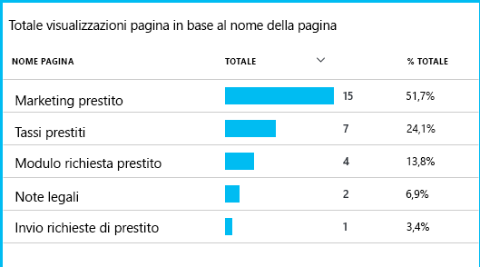

Considerando il punto in cui la maggior parte degli utenti abbandona, l'azienda può valutare come fare in modo che più utenti completino il percorso fino alla fine.By considering where the greatest numbers of customers drop out, the business can work out how to get more users through to the bottom of the funnel. In alcuni casi potrebbe trattarsi di un errore dell'esperienza utente, ad esempio, è difficile trovare il pulsante "Avanti" o le istruzioni non sono intuitive.In some cases, there might be a user experience (UX) failure - for example, the 'next' button is hard to find, or the instructions aren't obvious. Più probabilmente, esistono motivi aziendali più significativi per gli abbandoni: forse i tassi di prestito sono troppo alti.More likely, there are more significant business reasons for drop-outs: maybe the loan rates are too high.

Qualunque sia il motivo, i dati consentono al team di valutare l'attività degli utenti.Whatever the reasons, the data helps the team work out what users are doing. È possibile inserire più chiamate di rilevamento per scoprire altri dettagli.More tracking calls can be inserted to work out more detail. Si può usare TrackEvent() per contare tutte le azioni utente, dai piccoli dettagli come i singoli clic sui pulsanti, ai risultati più significativi come il pagamento di un prestito.TrackEvent() can be used to count any user actions, from the fine detail of individual button clicks, to significant achievements such as paying off a loan.

Il team si sta abituando ad avere informazioni sull'attività degli utenti.The team is getting used to having information about user activity. Attualmente, quando progetta una nuova funzionalità, valuta in che modo potrà ricevere commenti e suggerimenti sull'utilizzo.Nowadays, whenever they design a new feature, they work out how they will get feedback about its usage. Progetta quindi chiamate di rilevamento che vengono incorporate nella funzionalità fin dall'inizio.They design tracking calls into the feature from the start. I commenti e suggerimenti saranno usati per migliorare la funzionalità in ogni ciclo di sviluppo.They use the feedback to improve the feature in each development cycle.

[Altre informazioni sul monitoraggio dell'utilizzo](app-insights-usage-overview.md).[Read more about tracking usage](app-insights-usage-overview.md).

## Applicare il ciclo DevOpsApply the DevOps cycle
Ecco come un solo team usa Application Insights non solo per risolvere singoli problemi, ma per migliorare il ciclo di vita dello sviluppo.So that's how one team use Application Insights not just to fix individual issues, but to improve their development lifecycle. Si tratta di suggerimenti e idee su come Application Insights può aiutare a gestire le prestazioni delle proprie applicazioni.I hope it has given you some ideas about how Application Insights can help you with application performance management in your own applications.

## VideoVideo

> [!VIDEO https://channel9.msdn.com/events/Connect/2016/112/player]

## Passaggi successiviNext steps
È possibile iniziare in diversi modi, a seconda delle caratteristiche dell'applicazione.You can get started in several ways, depending on the characteristics of your application. Scegliere l'opzione più adatta:Pick what suits you best:

* [Applicazione Web ASP.NETASP.NET web application](app-insights-asp-net.md)
* [Applicazione Web JavaJava web application](app-insights-java-get-started.md)
* [Applicazione Web Node.jsNode.js web application](app-insights-nodejs.md)
* App già distribuite, ospitate in [IIS](app-insights-monitor-web-app-availability.md), [J2EE](app-insights-java-live.md) o [Azure](app-insights-azure.md).Already deployed apps, hosted on [IIS](app-insights-monitor-web-app-availability.md), [J2EE](app-insights-java-live.md), or [Azure](app-insights-azure.md).
* [Pagine Web](app-insights-javascript.md): app a singola pagina o pagina Web ordinaria da usare autonomamente o in combinazione con una delle opzioni del server.[Web pages](app-insights-javascript.md) - Single Page App or ordinary web page - use this on its own or in addition to any of the server options.
* [Test di disponibilità](app-insights-monitor-web-app-availability.md) per testare l'applicazione dalla rete internet pubblica.[Availability tests](app-insights-monitor-web-app-availability.md) to test your app from the public internet.
