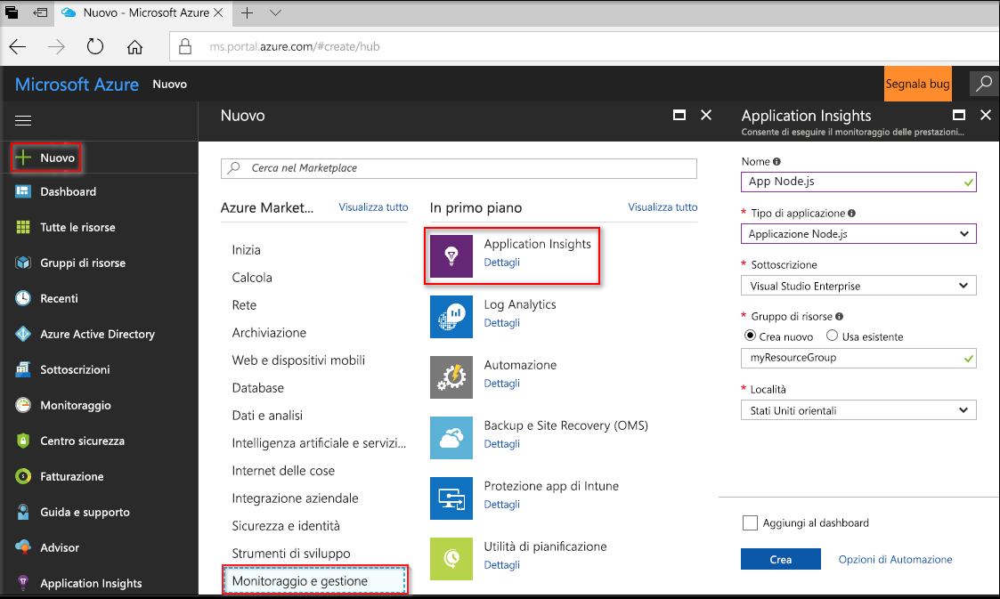
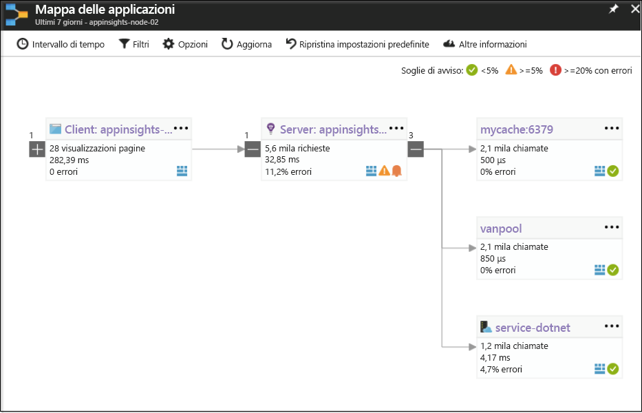
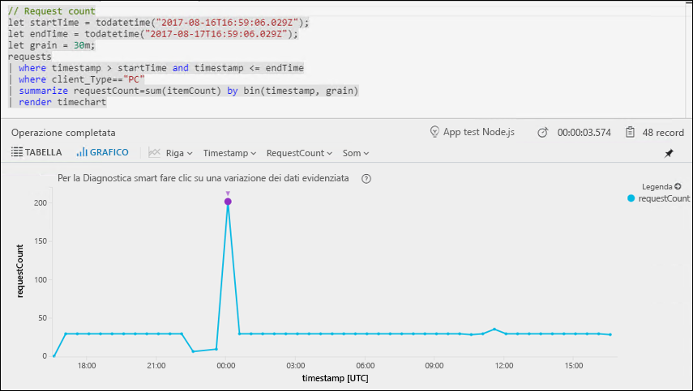
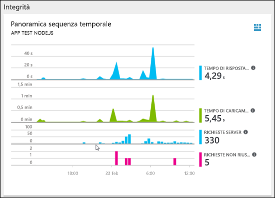
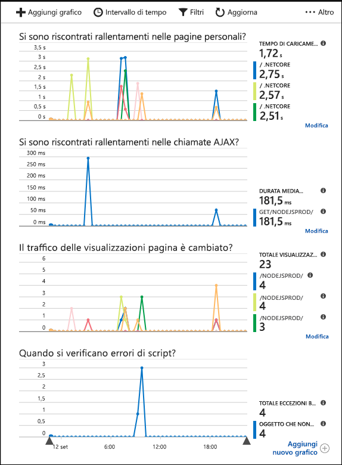

# <a name="start-monitoring-your-nodejs-web-application"></a>Iniziare a monitorare l'applicazione Web Node.js

Con Azure Application Insights, è possibile monitorare facilmente la disponibilità, le prestazioni e l'uso dell'applicazione Web. È anche possibile identificare e diagnosticare rapidamente gli errori nell'applicazione senza attendere che vengano segnalati da un utente. A partire dall'SDK versione 0.20 è possibile monitorare i pacchetti di terze parti più diffusi, tra cui MongoDB, MySQL e Redis.

Questa guida introduttiva illustra l'aggiunta di Application Insights SDK per Node.js versione 0.22 a un'applicazione Node.js esistente.

## <a name="prerequisites"></a>Prerequisiti

Per completare questa guida introduttiva:

- Sono necessarie una sottoscrizione di Azure e un'applicazione Web Node.js esistente.

Se non si ha un'applicazione Web Node.js è possibile crearne una seguendo le istruzioni in [Creare un'app Web Node.js in Azure](https://docs.microsoft.com/azure/app-service/app-service-web-get-started-nodejs).
 
Se non si ha una sottoscrizione di Azure, creare un account [gratuito](https://azure.microsoft.com/free/) prima di iniziare.

## <a name="log-in-to-the-azure-portal"></a>Accedere al Portale di Azure.

Accedere al [Portale di Azure](https://portal.azure.com/).

## <a name="enable-application-insights"></a>Abilitare Application Insights

Application Insights può raccogliere dati di telemetria da un'applicazione connessa a Internet, indipendentemente dal fatto che sia in esecuzione in locale o nel cloud. Usare la procedura seguente per iniziare a visualizzare questi dati.

1. Selezionare **Nuovo** > **Monitoraggio e gestione** > **Application Insights**.

   

   Verrà visualizzata una casella di configurazione. Usare la tabella seguente per completare i campi di input.

    | Impostazioni        | Valore           | Descrizione  |
   | ------------- |:-------------|:-----|
   | **Nome**      | Valore globalmente univoco | Nome che identifica l'app da monitorare |
   | **Tipo di applicazione** | Applicazione Node.js | Tipo di app da monitorare |
   | **Gruppo di risorse**     | myResourceGroup      | Nome del nuovo gruppo di risorse per l'hosting dei dati di Application Insights |
   | **Posizione** | Stati Uniti Orientali | Scegliere una località nelle vicinanze o vicina a quella in cui è ospitata l'app |

2. Fare clic su **Crea**.

## <a name="configure-app-insights-sdk"></a>Configurare Application Insights SDK

1. Selezionare **Panoramica** > **Informazioni di base** > copiare la **chiave di strumentazione** dell'applicazione.

   

2. Aggiungere Application Insights SDK per Node.js all'applicazione. Dalla cartella radice dell'app eseguire:

   ```bash
   npm install applicationinsights --save
   ```

3. Modificare il primo file con estensione js e aggiungere le due righe seguenti alla parte superiore dello script. Se si usa l'[app introduttiva di Node.js](https://docs.microsoft.com/azure/app-service/app-service-web-get-started-nodejs) è necessario modificare il file index.js. Sostituire &lt;instrumentation_key&gt; con la chiave di strumentazione dell'applicazione. 

   ```JavaScript
   const appInsights = require('applicationinsights');
   appInsights.setup('<instrumentation_key>').start();
   ```

4. Riavviare l'app.

> [!NOTE]
> Prima che i dati vengano visualizzati nel portale trascorrono 3-5 minuti. Se questa app è un'app di test a basso traffico, occorre ricordare che la maggior parte delle metriche viene acquisita solo in caso di richieste oppure operazioni attive.

## <a name="start-monitoring-in-the-azure-portal"></a>Avviare il monitoraggio nel portale di Azure

1. È ora possibile riaprire la pagina **Panoramica** di Application Insights nel portale di Azure, dove è stata recuperata la chiave di strumentazione, per visualizzare informazioni dettagliate sull'applicazione attualmente in esecuzione.

   

2. Fare clic su **Mappa app** per ottenere un layout visivo delle relazioni di dipendenza tra i componenti dell'applicazione. Ogni componente mostra indicatori KPI come carico, prestazioni, errori e avvisi.

   

3. Fare clic sull'icona di **App Analytics** .  Verrà aperta la finestra **Application Insights - Analisi**, che fornisce un linguaggio di query avanzato per l'analisi di tutti i dati raccolti da Application Insights. In questo caso viene generata una query che esegue il rendering del conteggio delle richieste sotto forma di grafico. È possibile scrivere query personalizzate per analizzare altri dati.

   

4. Tornare alla pagina **Panoramica** ed esaminare **Integrità - Panoramica sequenza temporale**.  Questo dashboard fornisce statistiche relative all'integrità dell'applicazione, ad esempio il numero di richieste in ingresso, la durata delle richieste ed eventuali errori che si sono verificati. 

   

   Per abilitare la popolazione del grafico **Tempo di caricamento della visualizzazione pagina** con i dati di **telemetria lato client**, aggiungere questo script a ogni pagina da verificare:

   ```HTML
   <!-- 
   To collect end-user usage analytics about your application, 
   insert the following script into each page you want to track.
   Place this code immediately before the closing </head> tag,
   and before any other scripts. Your first data will appear 
   automatically in just a few seconds.
   -->
   <script type="text/javascript">
     var appInsights=window.appInsights||function(config){
       function i(config){t[config]=function(){var i=arguments;t.queue.push(function(){t[config].apply(t,i)})}}var t={config:config},u=document,e=window,o="script",s="AuthenticatedUserContext",h="start",c="stop",l="Track",a=l+"Event",v=l+"Page",y=u.createElement(o),r,f;y.src=config.url||"https://az416426.vo.msecnd.net/scripts/a/ai.0.js";u.getElementsByTagName(o)[0].parentNode.appendChild(y);try{t.cookie=u.cookie}catch(p){}for(t.queue=[],t.version="1.0",r=["Event","Exception","Metric","PageView","Trace","Dependency"];r.length;)i("track"+r.pop());return i("set"+s),i("clear"+s),i(h+a),i(c+a),i(h+v),i(c+v),i("flush"),config.disableExceptionTracking||(r="onerror",i("_"+r),f=e[r],e[r]=function(config,i,u,e,o){var s=f&&f(config,i,u,e,o);return s!==!0&&t["_"+r](config,i,u,e,o),s}),t
       }({
           instrumentationKey:"<insert instrumentation key>"
       });
       
       window.appInsights=appInsights;
       appInsights.trackPageView();
   </script>
   ```

5. Fare clic su **Browser** sotto l'intestazione **Analisi**. Qui sono disponibili le metriche correlate alle prestazioni delle pagine dell'app. È possibile fare clic su **Aggiungi nuovo grafico** per creare altre visualizzazioni personalizzate oppure selezionare **Modifica** per modificare tipi, altezze, tavolozza dei colori, raggruppamenti e metriche dei grafici esistenti.

   

Per altre informazioni sul monitoraggio di Node.js, vedere la [documentazione aggiuntiva su Node.js in Application Insights](app-insights-nodejs.md).

## <a name="clean-up-resources"></a>Pulire le risorse

Se si prevede di continuare a usare le guide introduttive o le esercitazioni successive, non eliminare le risorse create in questa guida introduttiva. Se non si prevede di continuare, seguire questa procedura per eliminare tutte le risorse create da questa guida introduttiva nel portale di Azure.

1. Scegliere **Gruppi di risorse** dal menu a sinistra del portale di Azure e quindi fare clic su **myResourceGroup**.
2. Nella pagina del gruppo di risorse fare clic su **Elimina**, digitare **myResourceGroup** nella casella di testo e quindi fare clic su **Elimina**.

## <a name="next-steps"></a>Passaggi successivi

> [!div class="nextstepaction"]
> [Rilevare e diagnosticare i problemi di prestazioni](https://docs.microsoft.com/azure/application-insights/app-insights-analytics)
