# Informazioni su Azure Application InsightsWhat is Application Insights?
Application Insights è un servizio estendibile di gestione delle prestazioni delle applicazioni per sviluppatori Web su più piattaforme,Application Insights is an extensible Application Performance Management (APM) service for web developers on multiple platforms. Utilizzarlo toomonitor l'applicazione web in tempo reale.Use it toomonitor your live web application. Il servizio rileva automaticamente le anomalie nelle prestazioniIt will automatically detect performance anomalies. Include toohelp di analitica potenti strumenti per la diagnosi di problemi e toounderstand gli utenti che effettivamente svolgono con l'app.It includes powerful analytics tools toohelp you diagnose issues and toounderstand what users actually do with your app.  È progettato toohelp è migliorare continuamente le prestazioni e usabilità.It's designed toohelp you continuously improve  performance and usability. Funziona per le app su una vasta gamma di piattaforme, tra cui .NET, Node.js e J2EE, ospitato in locale o nel cloud hello.It works for apps on a wide variety of platforms including .NET, Node.js and J2EE, hosted on-premises or in hello cloud. Si integra con il processo di devOps e dispone di connessione punti tooa varietà di strumenti di sviluppo.It  integrates with your devOps process, and has connection points tooa variety of development tools.

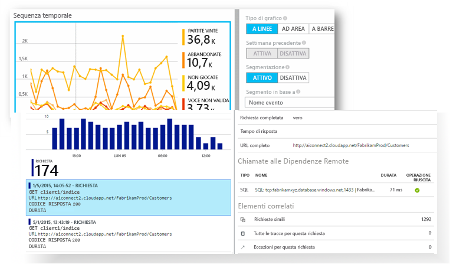

[Dare un'occhiata animazione introduzione hello](https://www.youtube.com/watch?v=fX2NtGrh-Y0).[Take a look at hello intro animation](https://www.youtube.com/watch?v=fX2NtGrh-Y0).

## Come funziona Application Insights?How does Application Insights work?
Installare un pacchetto di piccole dimensioni strumentazione dell'applicazione e impostare una risorsa di Application Insights nel portale di Microsoft Azure hello.You install a small instrumentation package in your application, and set up an Application Insights resource in hello Microsoft Azure portal. Strumentazione Hello controlla l'app e invia portale toohello dati di telemetria.hello instrumentation monitors your app and sends telemetry data toohello portal. (può eseguire un'applicazione hello ovunque - non ha toobe ospitato in Azure).(hello application can run anywhere - it doesn't have toobe hosted in Azure.)

È possibile instrumentare l'applicazione del servizio web hello non solo, ma anche tutti i componenti in background e hello JavaScript nelle pagine web hello autonomamente.You can instrument not only hello web service application, but also any background components, and hello JavaScript in hello web pages themselves. 

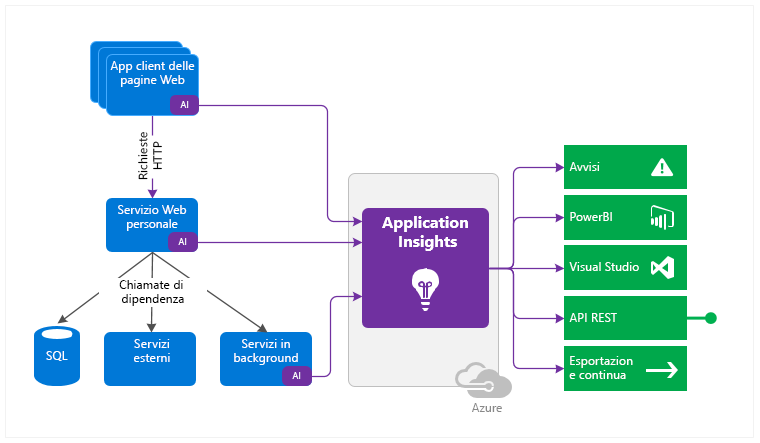

Inoltre, è possibile effettuare il pull nei dati di telemetria da ambienti host hello, ad esempio i contatori delle prestazioni, diagnostica Windows Azure o i registri di Docker.In addition, you can pull in telemetry from hello host environments such as performance counters, Azure diagnostics, or Docker logs. È inoltre possibile impostare i test web che inviano periodicamente richieste sintetiche servizio web tooyour.You can also set up web tests that periodically send synthetic requests tooyour web service.

Tutti i flussi di dati di telemetria sono integrati nel portale di Azure in cui è possibile applicare potenti di hello analitici e dati non elaborati toohello strumenti di ricerca.All these telemetry streams are integrated in hello Azure portal, where you can apply powerful analytic and search tools toohello raw data.

### Che cos'è l'overhead di hello?What's hello overhead?
impatto di Hello sulle prestazioni dell'app è molto piccolo.hello impact on your app's performance is very small. Le chiamate di rilevamento non sono bloccanti e vengono riunite in batch e inviate in un thread separato.Tracking calls are non-blocking, and are batched and sent in a separate thread.

## Quali sono gli elementi monitorati da Application Insights?What does Application Insights monitor?

Application Insights è destinato a team di sviluppo hello, toohelp è comprendere le prestazioni dell'app e modalità di utilizzo.Application Insights is aimed at hello development team, toohelp you understand how your app is performing and how it's being used. Esegue il monitoraggio di:It monitors:

* **Frequenza delle richieste, tempi di risposta e percentuali di errore**: trovare le pagine più visitate, gli orari di visita e la posizione degli utenti. **Request rates, response times, and failure rates** - Find out which pages are most popular, at what times of day, and where your users are. Vedere quali pagine abbiano prestazioni migliori.See which pages perform best. Se i tempi di risposta e le percentuali di errore aumentano di pari passo con le richieste, è probabile che ci sia un problema di assegnazione delle risorse.If your response times and failure rates go high when there are more requests, then perhaps you have a resourcing problem. 
* **Tassi di dipendenza, tempi di risposta e percentuali di errore**: trovare quali servizi esterni causino un rallentamento.**Dependency rates, response times, and failure rates** - Find out whether external services are slowing you down.
* **Eccezioni** : analizzare le statistiche aggregata hello, o selezionare istanze specifiche e approfondire l'analisi dello stack hello e le richieste correlate.**Exceptions** - Analyse hello aggregated statistics, or pick specific instances and drill into hello stack trace and related requests. Vengono segnalate eccezioni di server e browser.Both server and browser exceptions are reported.
* **Visualizzazioni pagina e prestazioni di carico**, segnalate dai browser degli utenti.**Page views and load performance** - reported by your users' browsers.
* **Chiamate AJAX** dalle pagine Web: tassi, tempi di risposta e percentuali di errore.**AJAX calls** from web pages - rates, response times, and failure rates.
* **Numeri di utenti e sessioni**.**User and session counts**.
* **Contatori delle prestazioni** dai computer server Windows o Linux, ad esempio l'uso di CPU, memoria e rete.**Performance counters** from your Windows or Linux server machines, such as CPU, memory, and network usage. 
* **Diagnostica dell'host** da Docker o Azure.**Host diagnostics** from Docker or Azure. 
* **Log di traccia di diagnostica** dall'app, in modo da poter correlare gli eventi di traccia con le richieste.**Diagnostic trace logs** from your app - so that you can correlate trace events with requests.
* **Eventi personalizzati e le metriche** scrivere manualmente nei hello client o server codice tootrack eventi aziendali, ad esempio gli articoli venduti o giochi acquisite.**Custom events and metrics** that you write yourself in hello client or server code, tootrack business events such as items sold or games won.

## Dove è possibile visualizzare i dati di telemetria?Where do I see my telemetry?

Esistono molti modi tooexplore i dati.There are plenty of ways tooexplore your data. Vedere i seguenti articoli:Check out these articles:

|  |  |
| --- | --- |
| [**Rilevamento intelligente e avvisi manuali****Smart detection and manual alerts**](app-insights-proactive-diagnostics.md) Avvisi automatici adattano i modelli di normale dell'app tooyour di telemetria e trigger quando ci sono di fuori di modello comune di hello.Automatic alerts adapt tooyour app's normal patterns of telemetry and trigger when there's something outside hello usual pattern. È anche possibile [impostare avvisi](app-insights-alerts.md) per determinati livelli di metriche standard o personalizzate.You can also [set alerts](app-insights-alerts.md) on particular levels of custom or standard metrics. |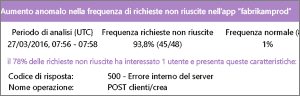 |
| [**Mappa delle applicazioni****Application map**](app-insights-app-map.md) componenti di Hello dell'app, con le metriche principali e avvisi.hello components of your app, with key metrics and alerts. |  |
| [**Profiler****Profiler**](app-insights-profiler.md) Esaminare i profili di esecuzione hello di richieste campionati.Inspect hello execution profiles of sampled requests. |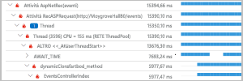 |
| [**Analisi dell'utilizzo****Usage analysis**](app-insights-usage-overview.md) Analizzare la segmentazione e la conservazione degli utenti.Analyze user segmentation and retention.| |
| [**Ricerca diagnostica dei dati dell'istanza****Diagnostic search for instance data**](app-insights-diagnostic-search.md) Cercare e filtrare eventi come richieste, eccezioni, chiamate a dipendenze, tracce di log e visualizzazioni di pagina.Search and filter events such as requests, exceptions, dependency calls, log traces, and page views.  |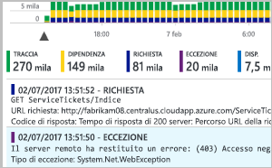 |
| [**Esplora metriche per i dati aggregati****Metrics Explorer for aggregated data**](app-insights-metrics-explorer.md) Esaminare, filtrare e segmentare dati aggregati come frequenza delle richieste, errori, eccezioni, tempi di risposta e tempi di caricamento delle pagine.Explore, filter, and segment aggregated data such as rates of requests, failures, and exceptions; response times, page load times. | |
| [**Dashboard****Dashboards**](app-insights-dashboards.md#dashboards) Combinare dati di più risorse e condividerli con altri utenti.Mash up data from multiple resources and share with others. Ideale per applicazioni con più componenti e continui vengono visualizzati nella chat team hello.Great for multi-component applications, and for continuous display in hello team room. | |
| [**Flusso di metriche in tempo reale****Live Metrics Stream**](app-insights-live-stream.md) Quando si distribuisce una nuova compilazione, è possibile controllare queste toomake indicatori di prestazioni in tempo quasi reale che tutto funziona come previsto.When you deploy a new build, watch these near-real-time performance indicators toomake sure everything works as expected. |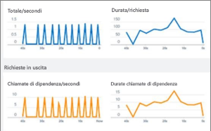 |
| [**Analisi****Analytics**](app-insights-analytics.md) Questo avanzato linguaggio di query consente di trovare risposta a domande approfondite sull'utilizzo e sulle prestazioni dell'app.Answer tough questions about your app's performance and usage by using this powerful query language. |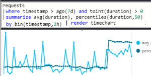 |
| [**Visual Studio****Visual Studio**](app-insights-visual-studio.md) Vedere i dati sulle prestazioni nel codice hello.See performance data in hello code. Vai toocode dalle tracce dello stack.Go toocode from stack traces.|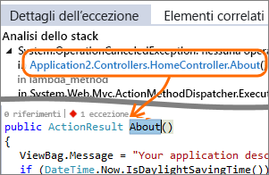 |
| [**Debugger di snapshot****Snapshot debugger**](app-insights-snapshot-debugger.md) Eseguire il debug di snapshot campionati da operazioni attive, con i valori dei parametri.Debug snapshots sampled from live operations, with parameter values.|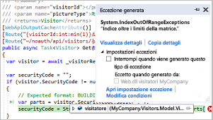 |
| [**Power BI****Power BI**](app-insights-export-power-bi.md) Integrare le metriche di uso con altra business intelligence.Integrate usage metrics with other business intelligence.| 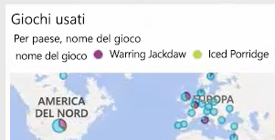|
| [**API REST****REST API**](https://dev.applicationinsights.io/) Scrivere codice toorun query su dati non elaborati e le metriche.Write code toorun queries over your metrics and raw data.|  |
| [**Esportazione continua****Continuous export**](app-insights-export-telemetry.md) Esportazione bulk di dati non elaborati toostorage non appena arriva.Bulk export of raw data toostorage as soon as it arrives. |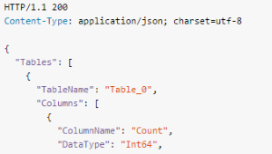 |

## Come si usa Application Insights?How do I use Application Insights?

### MonitoraggioMonitor
Installare Application Insights nell'app, impostare i [test Web di disponibilità](app-insights-monitor-web-app-availability.md) e:Install Application Insights in your app, set up [availability web tests](app-insights-monitor-web-app-availability.md), and:

* Impostare un [dashboard](app-insights-dashboards.md) tookeep di chat del team un occhio su carico, la velocità di risposta e prestazioni hello delle dipendenze, pagina viene caricato e le chiamate AJAX.Set up a [dashboard](app-insights-dashboards.md) for your team room tookeep an eye on load, responsiveness, and hello performance of your dependencies, page loads, and AJAX calls.
* Individuare che sono più lenta hello e la maggior parte delle richieste di errori.Discover which are hello slowest and most failing requests.
* Espressioni di controllo [flusso Live](app-insights-live-stream.md) quando si distribuisce una nuova versione, tooknow immediatamente su un qualsiasi peggioramento delle.Watch [Live Stream](app-insights-live-stream.md) when you deploy a new release, tooknow immediately about any degradation.

### Rilevare, eseguire una diagnosiDetect, Diagnose
Quando si riceve un avviso o si individua un problema:When you receive an alert or discover a problem:

* Individuare il numero di utenti interessati.Assess how many users are affected.
* Correlare gli errori con eccezioni, chiamate alle dipendenze e tracce.Correlate failures with exceptions, dependency calls and traces.
* Esaminare profiler, snapshot, dump dello stack e log di traccia.Examine profiler, snapshots, stack dumps, and trace logs.

### Compilare, misurare, acquisire informazioniBuild, Measure, Learn
[Valutare l'efficacia di hello](app-insights-usage-overview.md) di ogni nuova funzionalità che si distribuisce.[Measure hello effectiveness](app-insights-usage-overview.md) of each new feature that you deploy.

* Pianificare toomeasure modalità di utilizzo dei nuovi UX o le funzionalità di business.Plan toomeasure how customers use new UX or business features.
* Scrivere dati di telemetria personalizzati nel codice.Write custom telemetry into your code.
* Ciclo di sviluppo successivo hello base all'evidenza di disco rigida da dati di telemetria.Base hello next development cycle on hard evidence from your telemetry.

## Attività inizialiGet started
Application Insights è uno dei molti servizi ospitati in Microsoft Azure e dati di telemetria viene inviato non esiste per l'analisi e la presentazione hello.Application Insights is one of hello many services hosted within Microsoft Azure, and telemetry is sent there for analysis and presentation. Quindi prima di eseguire qualsiasi altro elemento, è necessario un abbonamento troppo[Microsoft Azure](http://azure.com).So before you do anything else, you'll need a subscription too[Microsoft Azure](http://azure.com). Toosign gratuito è attivo e se si sceglie hello base [prezzi piano](https://azure.microsoft.com/pricing/details/application-insights/) di Application Insights, non prevede alcun costo fino a quando l'applicazione è aumentato toohave sostanziale utilizzo.It's free toosign up, and if you choose hello basic [pricing plan](https://azure.microsoft.com/pricing/details/application-insights/) of Application Insights, there's no charge until your application has grown toohave substantial usage. Se l'organizzazione ha già una sottoscrizione, Impossibile aggiungono il tooit account Microsoft.If your organization already has a subscription, they could add your Microsoft account tooit.

Esistono diversi modi tooget avviato.There are several ways tooget started. Iniziare con il metodo più adatto alle proprie esigenze.Begin with whichever works best for you. È possibile aggiungere altri hello in un secondo momento.You can add hello others later.

* **In fase di esecuzione: instrumentare un'applicazione web nel server di hello.****At run time: instrument your web app on hello server.** Consente di evitare qualsiasi codice toohello di aggiornamento.Avoids any update toohello code. È necessario server tooyour accesso di amministratore.You need admin access tooyour server.
  * [**IIS in locale o in una VM****IIS on-premises or on a VM**](app-insights-monitor-performance-live-website-now.md)
  * [**VM o App Web di Azure****Azure web app or VM**](app-insights-monitor-performance-live-website-now.md)
  * [**J2EE****J2EE**](app-insights-java-live.md)
* **In fase di sviluppo: aggiungere Application Insights tooyour codice.****At development time: add Application Insights tooyour code.** Consente di toowrite telemetria e tooinstrument back-end e desktop App personalizzate.Allows you toowrite custom telemetry and tooinstrument back-end and desktop apps.
  * [Visual Studio](app-insights-asp-net.md) 2013 Update 2 o versioni successive[Visual Studio](app-insights-asp-net.md) 2013 update 2 or later.
  * Java in [Eclipse](app-insights-java-eclipse.md) o [altri strumenti](app-insights-java-get-started.md)Java in [Eclipse](app-insights-java-eclipse.md) or [other tools](app-insights-java-get-started.md)
  * [Node.JSNode.js](app-insights-nodejs.md)
  * [Altre piattaformeOther platforms](app-insights-platforms.md)
* **[Instrumentare le pagine Web](app-insights-javascript.md)** per visualizzazione pagina, AJAX e altri dati di telemetria sul lato client.**[Instrument your web pages](app-insights-javascript.md)** for page view, AJAX and other client-side telemetry.
* **[Test di disponibilità](app-insights-monitor-web-app-availability.md)**: effettuare regolarmente il ping del sito Web dai server.**[Availability tests](app-insights-monitor-web-app-availability.md)** - ping your website regularly from our servers.

## Passaggi successiviNext steps
Introduzione in fase di esecuzione a:Get started at runtime with:

* [Server IISIIS server](app-insights-monitor-performance-live-website-now.md)
* [Server J2EEJ2EE server](app-insights-java-live.md)

Introduzione in fase di sviluppo a:Get started at development time with:

* [ASP.NETASP.NET](app-insights-asp-net.md)
* [JavaJava](app-insights-java-get-started.md)
* [Node.JSNode.js](app-insights-nodejs.md)

## Supporto, commenti e suggerimentiSupport and feedback
* Domande e problemi:Questions and Issues:
  * [Risoluzione dei problemi][qna][Troubleshooting][qna]
  * [Forum MSDNMSDN Forum](https://social.msdn.microsoft.com/Forums/vstudio/home?forum=ApplicationInsights)
  * [StackOverflowStackOverflow](http://stackoverflow.com/questions/tagged/ms-application-insights)
* Suggerimenti:Your suggestions:
  * [UserVoiceUserVoice](https://visualstudio.uservoice.com/forums/357324)
* Blog:Blog:
  * [Blog di Application InsightsApplication Insights blog](https://azure.microsoft.com/blog/tag/application-insights)

## VideoVideos

[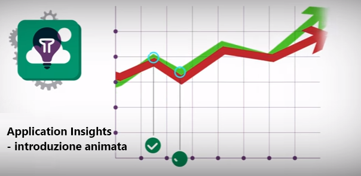](https://www.youtube.com/watch?v=fX2NtGrh-Y0)

> [!VIDEO https://channel9.msdn.com/events/Connect/2016/100/player] 

<!--Link references-->

[android]: https://github.com/Microsoft/ApplicationInsights-Android
[azure]: ../insights-perf-analytics.md
[client]: app-insights-javascript.md
[desktop]: app-insights-windows-desktop.md
[detect]: app-insights-detect-triage-diagnose.md
[greenbrown]: app-insights-asp-net.md
[ios]: https://github.com/Microsoft/ApplicationInsights-iOS
[java]: app-insights-java-get-started.md
[knowUsers]: app-insights-web-track-usage.md
[platforms]: app-insights-platforms.md
[portal]: http://portal.azure.com/
[qna]: app-insights-troubleshoot-faq.md
[redfield]: app-insights-monitor-performance-live-website-now.md
