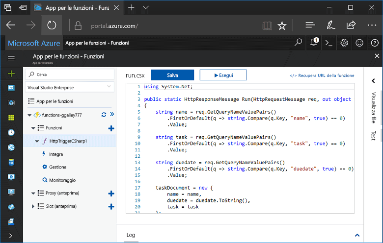
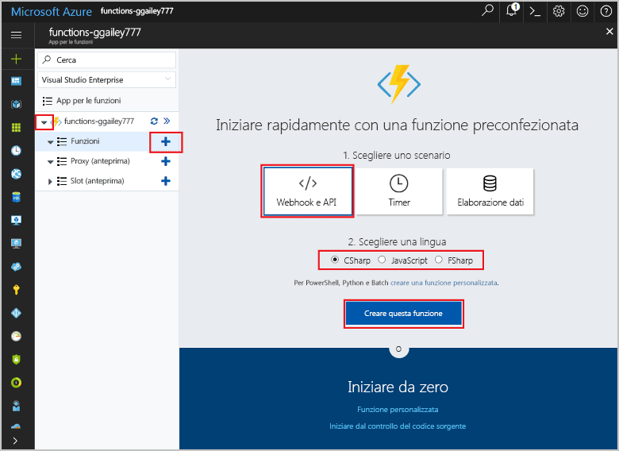
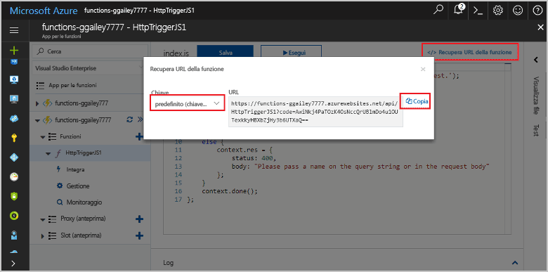
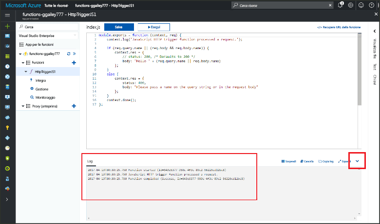

# Creare la prima funzione in hello portale di AzureCreate your first function in hello Azure portal

Funzioni di Azure consente di eseguire il codice in un ambiente senza server senza dover toofirst crea una macchina virtuale o si pubblica un'applicazione web.Azure Functions lets you execute your code in a serverless environment without having toofirst create a VM or publish a web application. In questo argomento, informazioni su come toouse funzioni toocreate una funzione di "hello world" nel portale di Azure hello.In this topic, learn how toouse Functions toocreate a "hello world" function in hello Azure portal.

[!INCLUDE [quickstarts-free-trial-note](../../includes/quickstarts-free-trial-note.md)]

## Accedi tooAzureLog in tooAzure

Accedi toohello [portale di Azure](https://portal.azure.com/).Log in toohello [Azure portal](https://portal.azure.com/).

## Creare un'app per le funzioniCreate a function app

È necessario disporre di un'esecuzione di hello toohost app funzione delle funzioni.You must have a function app toohost hello execution of your functions. Un'app per le funzioni consente di raggruppare le funzioni come un'unità logica per semplificare la gestione, la distribuzione e la condivisione delle risorse.A function app lets you group functions as a logic unit for easier management, deployment, and sharing of resources. 

[!INCLUDE [Create function app Azure portal](../../includes/functions-create-function-app-portal.md)]

[!INCLUDE [functions-portal-favorite-function-apps](../../includes/functions-portal-favorite-function-apps.md)]

Creare quindi una funzione in hello nuova funzione app.Next, you create a function in hello new function app.

## Creare una funzione attivata tramite HTTPCreate an HTTP triggered function

1. Espandere la nuova app di funzione, quindi fare clic su hello  **+**  accanto troppo**funzioni**.Expand your new function app, then click hello **+** button next too**Functions**.

2.  In hello **iniziare rapidamente** selezionare **WebHook + API**, **scegliere una lingua** per la funzione, fare clic su **creare questa funzione** .In hello **Get started quickly** page, select **WebHook + API**, **Choose a language** for your function, and click **Create this function**. 
   
    

Viene creata una funzione nella lingua scelta, utilizzando il modello di hello per una funzione di attivazione HTTP.A function is created in your chosen language using hello template for an HTTP triggered function. È possibile eseguire una nuova funzione hello inviando una richiesta HTTP.You can run hello new function by sending an HTTP request.

## Funzione hello testTest hello function

1. Nella nuova funzione fare clic su **</> Recupera URL della funzione**, selezionare **predefinito (tasto funzione)** e quindi fare clic su **Copia**.In your new function, click **</> Get function URL**, select **default (Function key)**, and then click **Copy**. 

    

2. Incollare l'URL funzione hello nella barra degli indirizzi del browser.Paste hello function URL into your browser's address bar. Aggiungere la stringa di query hello `&name=<yourname>` toothis URL e premere hello `Enter` chiave della richiesta di hello tooexecute tastiera.Append hello query string `&name=<yourname>` toothis URL and press hello `Enter` key on your keyboard tooexecute hello request. Hello Ecco un esempio di risposta hello restituito dalla funzione hello nel browser Edge hello:hello following is an example of hello response returned by hello function in hello Edge browser:

    

    richiesta di Hello URL include una chiave che è necessario, per impostazione predefinita, tooaccess la funzione su HTTP.hello request URL includes a key that is required, by default, tooaccess your function over HTTP.   

3. Quando viene eseguita la funzione, le informazioni di traccia viene scritto toohello log.When your function runs, trace information is written toohello logs. output di traccia toosee hello in seguito all'esecuzione precedente hello, restituire la funzione tooyour nel portale di hello e fare clic su hello freccia nella parte inferiore di hello di hello schermata tooexpand **log**.toosee hello trace output from hello previous execution, return tooyour function in hello portal and click hello up arrow at hello bottom of hello screen tooexpand **Logs**. 

   

## Pulire le risorseClean up resources

[!INCLUDE [Clean up resources](../../includes/functions-quickstart-cleanup.md)]

## Passaggi successiviNext steps

È stata creata un'app per le funzioni con una semplice funzione attivata tramite HTTP.You have created a function app with a simple HTTP triggered function.  

[!INCLUDE [Next steps note](../../includes/functions-quickstart-next-steps.md)]

Per altre informazioni rivedere [Binding HTTP e webhook in Funzioni di Azure](functions-bindings-http-webhook.md).For more information, see [Azure Functions HTTP and webhook bindings](functions-bindings-http-webhook.md).

