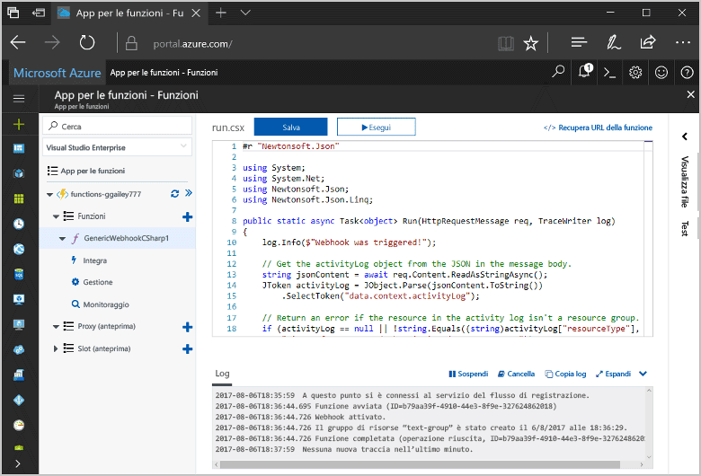
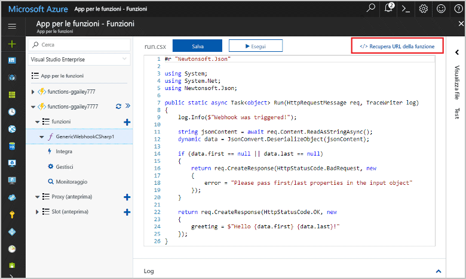
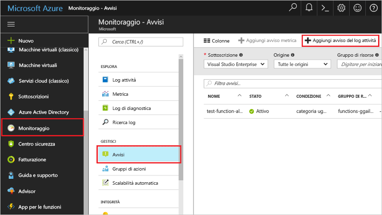
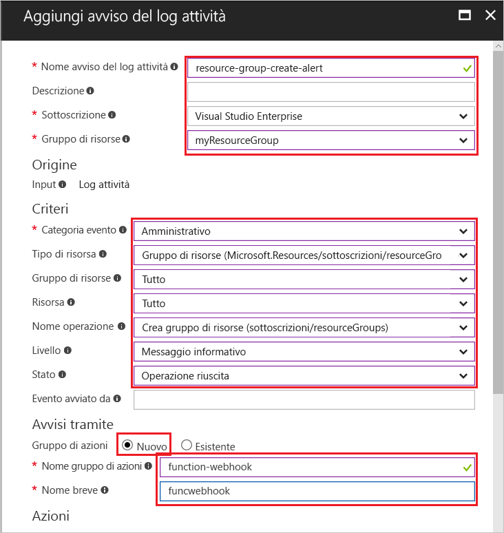
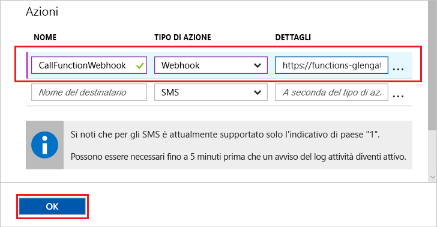
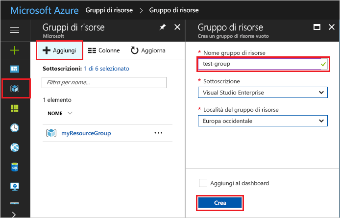
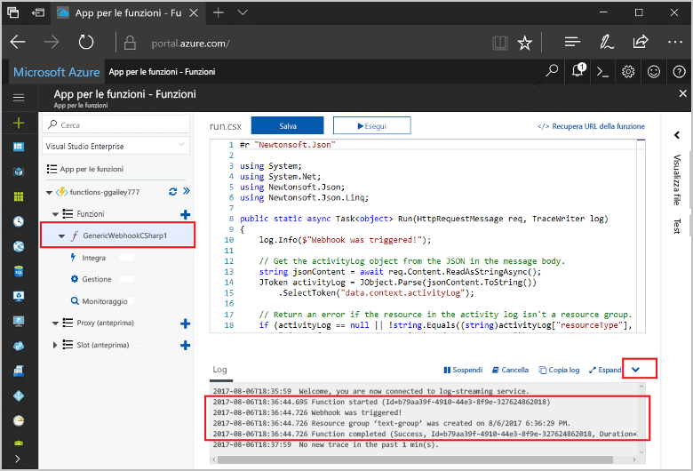

# <a name="create-a-function-triggered-by-a-generic-webhook"></a>Creare una funzione attivata da un webhook generico

Funzioni di Azure consente di eseguire il codice in un ambiente senza server senza dover toofirst crea una macchina virtuale o si pubblica un'applicazione web. Ad esempio, è possibile configurare un toobe funzione attivata da un avviso generato dal monitoraggio di Azure. Questo argomento viene illustrato come tooexecute c# il codice quando un gruppo di risorse è aggiunto tooyour sottoscrizione.   



## <a name="prerequisites"></a>Prerequisiti 

toocomplete questa esercitazione:

+ Se non si ha una sottoscrizione di Azure, creare un [account gratuito](https://azure.microsoft.com/free/?WT.mc_id=A261C142F) prima di iniziare.

[!INCLUDE [functions-portal-favorite-function-apps](../../includes/functions-portal-favorite-function-apps.md)]

## <a name="create-an-azure-function-app"></a>Creare un'app per le funzioni di Azure

[!INCLUDE [Create function app Azure portal](../../includes/functions-create-function-app-portal.md)]

Creare quindi una funzione in hello nuova funzione app.

## <a name="create-function"></a>Creare una funzione attivata da un webhook generico

1. Espandere l'applicazione di funzione e fare clic su hello  **+**  accanto troppo**funzioni**. Se questa funzione è hello primo nell'app di funzione, selezionare **funzione personalizzata**. Consente di visualizzare il set completo di hello dei modelli di funzione.

    

2. Seleziona hello **WebHook - generico c#** modello. Digitare un nome per la funzione C# e quindi selezionare **Crea**.

      

2. Nella nuova funzione, fare clic su **<> / Get funzione URL**, quindi copiare e salvare il valore di hello. Utilizzare questo webhook hello tooconfigure di valore. 

    
         
Creare quindi un endpoint del webhook in un avviso del log attività in Monitoraggio di Azure. 

## <a name="create-an-activity-log-alert"></a>Creare un avviso del log attività

1. Nel portale di Azure hello, passare toohello **monitoraggio** servizio, seleziona **avvisi**, fare clic su **Aggiungi avviso di log attività**.   

    

2. Utilizza le impostazioni di hello come specificato nella tabella hello:

    

    | Impostazione      |  Valore consigliato   | Descrizione                              |
    | ------------ |  ------- | -------------------------------------------------- |
    | **Nome avviso del log attività** | resource-group-create-alert | Nome dell'avviso di log attività hello. |
    | **Sottoscrizione** | Sottoscrizione in uso | sottoscrizione di Hello in uso per questa esercitazione. | 
    |  **Gruppo di risorse** | myResourceGroup | gruppo di risorse Hello risorse avviso hello distribuiti. Utilizzando hello stesso gruppo di risorse, come l'app di funzione rende più semplice tooclean dopo aver completato l'esercitazione hello. |
    | **Categoria evento** | Amministrativo | Questa categoria include le modifiche apportate alle risorse tooAzure.  |
    | **Tipo di risorsa** | Gruppi di risorse | Consente di filtrare le attività di gruppo tooresource gli avvisi. |
    | **Gruppo di risorse**<br/>e **Risorsa** | Tutti | Vengono monitorate tutte le risorse. |
    | **Nome operazione** | Crea gruppo di risorse | Filtra le operazioni di toocreate gli avvisi. |
    | **Level** | Informazioni | Vengono inclusi gli avvisi di livello informativo. | 
    | **Status** | Operazione completata | Filtra tooactions gli avvisi che sono stati completati correttamente. |
    | **Gruppo di azione** | Nuovo | Creare un nuovo gruppo di azione, che definisce accetta azione hello quando viene generato un avviso. |
    | **Nome gruppo di azione** | function-webhook | Un gruppo di azioni di hello tooidentify nome.  | 
    | **Nome breve** | funcwebhook | Un nome breve per il gruppo di azioni di hello. |  

3. In **azioni**, aggiungere un'azione utilizzando le impostazioni di hello come specificato nella tabella hello: 

    

    | Impostazione      |  Valore consigliato   | Descrizione                              |
    | ------------ |  ------- | -------------------------------------------------- |
    | **Nome** | CallFunctionWebhook | Un nome per l'azione di hello. |
    | **Tipo di azione** | webhook | avviso di toohello risposta Hello è che viene chiamato un URL del Webhook. |
    | **Dettagli** | URL della funzione | Incollare nell'URL del webhook hello della funzione hello copiato in precedenza. |v

4. Fare clic su **OK** toocreate hello avviso e azione il gruppo.  

Hello webhook ora viene chiamato quando viene creato un gruppo di risorse nella sottoscrizione. Aggiornare quindi il codice hello nel hello toohandle funzione dati del log JSON nel corpo di hello di hello richiesta.   

## <a name="update-hello-function-code"></a>Aggiornare il codice di funzione hello

1. Spostarsi indietro tooyour funzione app nel portale di hello ed espandere la funzione. 

2. Sostituire il codice di script c# hello nella funzione hello nel portale di hello con hello seguente codice:

    ```csharp
    #r "Newtonsoft.Json"
    
    using System;
    using System.Net;
    using Newtonsoft.Json;
    using Newtonsoft.Json.Linq;
    
    public static async Task<object> Run(HttpRequestMessage req, TraceWriter log)
    {
        log.Info($"Webhook was triggered!");
    
        // Get hello activityLog object from hello JSON in hello message body.
        string jsonContent = await req.Content.ReadAsStringAsync();
        JToken activityLog = JObject.Parse(jsonContent.ToString())
            .SelectToken("data.context.activityLog");
    
        // Return an error if hello resource in hello activity log isn't a resource group. 
        if (activityLog == null || !string.Equals((string)activityLog["resourceType"], 
            "Microsoft.Resources/subscriptions/resourcegroups"))
        {
            log.Error("An error occured");
            return req.CreateResponse(HttpStatusCode.BadRequest, new
            {
                error = "Unexpected message payload or wrong alert received."
            });
        }
    
        // Write information about hello created resource group toohello streaming log.
        log.Info(string.Format("Resource group '{0}' was {1} on {2}.",
            (string)activityLog["resourceGroupName"],
            ((string)activityLog["subStatus"]).ToLower(), 
            (DateTime)activityLog["submissionTimestamp"]));
    
        return req.CreateResponse(HttpStatusCode.OK);    
    }
    ```

Ora è possibile testare la funzione hello creando un nuovo gruppo di risorse nella sottoscrizione.

## <a name="test-hello-function"></a>Funzione hello test

1. Fare clic sull'icona di gruppo di risorse hello in a sinistra del portale di Azure selezionare hello hello **+ Aggiungi**, digitare un **nome gruppo di risorse**e selezionare **crea** toocreate un gruppo di risorse vuoto.
    
    

2. Funzione tooyour torna indietro ed espandere hello **registri** finestra. Dopo aver creato il gruppo di risorse hello, i trigger di avviso log attività hello hello webhook ed esegue la funzione hello. Nome di hello di hello nuovo gruppo di risorse toohello log scritto è visualizzato.  

    

3. (Facoltativo) Tornare indietro ed eliminare il gruppo di risorse hello creato. Si noti che questa attività non attiva la funzione hello. Infatti, le operazioni vengono filtrate da avviso hello di eliminazione. 

## <a name="clean-up-resources"></a>Pulire le risorse

[!INCLUDE [Next steps note](../../includes/functions-quickstart-cleanup.md)]

## <a name="next-steps"></a>Passaggi successivi

È stata creata una funzione che viene eseguita quando viene ricevuta una richiesta da un webhook generico. 

[!INCLUDE [Next steps note](../../includes/functions-quickstart-next-steps.md)]

Per altre informazioni sui trigger webhook, vedere [Associazioni HTTP e webhook in Funzioni di Azure](functions-bindings-http-webhook.md). toolearn più sullo sviluppo di funzioni in c#, vedere [riferimenti per sviluppatori di script c# Azure funzioni](functions-reference-csharp.md).

