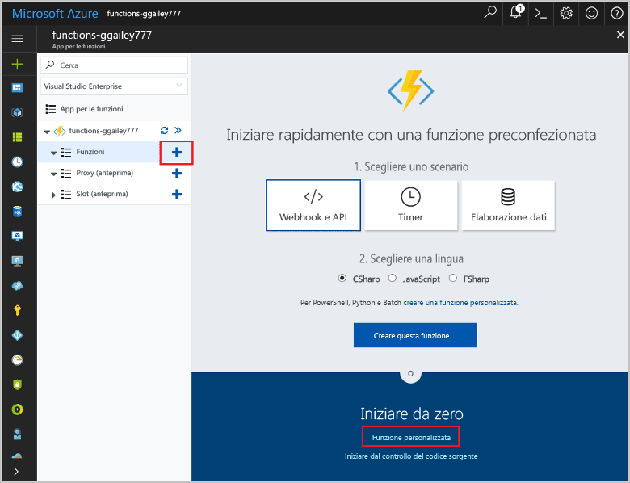

# <a name="create-a-function-triggered-by-a-generic-webhook"></a><span data-ttu-id="c837e-103">Creare una funzione attivata da un webhook generico</span><span class="sxs-lookup"><span data-stu-id="c837e-103">Create a function triggered by a generic webhook</span></span>

<span data-ttu-id="c837e-104">Funzioni di Azure consente di eseguire il codice in un ambiente senza server senza dover prima creare una macchina virtuale o pubblicare un'applicazione Web.</span><span class="sxs-lookup"><span data-stu-id="c837e-104">Azure Functions lets you execute your code in a serverless environment without having to first create a VM or publish a web application.</span></span> <span data-ttu-id="c837e-105">Ad esempio, è possibile configurare una funzione che verrà attivata da un avviso generato da Monitoraggio di Azure.</span><span class="sxs-lookup"><span data-stu-id="c837e-105">For example, you can configure a function to be triggered by an alert raised by Azure Monitor.</span></span> <span data-ttu-id="c837e-106">Questo argomento illustra come eseguire codice C# quando viene aggiunto un gruppo di risorse alla sottoscrizione.</span><span class="sxs-lookup"><span data-stu-id="c837e-106">This topic shows you how to execute C# code when a resource group is added to your subscription.</span></span>   


## <a name="prerequisites"></a><span data-ttu-id="c837e-108">Prerequisiti</span><span class="sxs-lookup"><span data-stu-id="c837e-108">Prerequisites</span></span> 

<span data-ttu-id="c837e-109">Per completare questa esercitazione:</span><span class="sxs-lookup"><span data-stu-id="c837e-109">To complete this tutorial:</span></span>

+ <span data-ttu-id="c837e-110">Se non si ha una sottoscrizione di Azure, creare un [account gratuito](https://azure.microsoft.com/free/?WT.mc_id=A261C142F) prima di iniziare.</span><span class="sxs-lookup"><span data-stu-id="c837e-110">If you don't have an Azure subscription, create a [free account](https://azure.microsoft.com/free/?WT.mc_id=A261C142F) before you begin.</span></span>

[!INCLUDE [functions-portal-favorite-function-apps](../../includes/functions-portal-favorite-function-apps.md)]

## <a name="create-an-azure-function-app"></a><span data-ttu-id="c837e-111">Creare un'app per le funzioni di Azure</span><span class="sxs-lookup"><span data-stu-id="c837e-111">Create an Azure Function app</span></span>

[!INCLUDE [Create function app Azure portal](../../includes/functions-create-function-app-portal.md)]

<span data-ttu-id="c837e-112">Si creerà ora una funzione nella nuova app per le funzioni.</span><span class="sxs-lookup"><span data-stu-id="c837e-112">Next, you create a function in the new function app.</span></span>

## <span data-ttu-id="c837e-113"><a name="create-function"></a>Creare una funzione attivata da un webhook generico</span><span class="sxs-lookup"><span data-stu-id="c837e-113"><a name="create-function"></a>Create a generic webhook triggered function</span></span>

1. <span data-ttu-id="c837e-114">Espandere l'app per le funzioni e fare clic sul pulsante **+** accanto a **Funzioni**.</span><span class="sxs-lookup"><span data-stu-id="c837e-114">Expand your function app and click the **+** button next to **Functions**.</span></span> <span data-ttu-id="c837e-115">Se questa è la prima funzione nell'app per le funzioni, selezionare **Funzione personalizzata**.</span><span class="sxs-lookup"><span data-stu-id="c837e-115">If this function is the first one in your function app, select **Custom function**.</span></span> <span data-ttu-id="c837e-116">Verrà visualizzato il set completo di modelli di funzione.</span><span class="sxs-lookup"><span data-stu-id="c837e-116">This displays the complete set of function templates.</span></span>

    

2. <span data-ttu-id="c837e-118">Selezionare il modello **Generic WebHook - C#** (Webhook generico - C#).</span><span class="sxs-lookup"><span data-stu-id="c837e-118">Select the **Generic WebHook - C#** template.</span></span> <span data-ttu-id="c837e-119">Digitare un nome per la funzione C# e quindi selezionare **Crea**.</span><span class="sxs-lookup"><span data-stu-id="c837e-119">Type a name for your C# function, then select **Create**.</span></span>

      

2. <span data-ttu-id="c837e-121">Nella nuova funzione fare clic su **</> Get function URL** (Ottieni URL funzione) e quindi copiare e salvare il valore.</span><span class="sxs-lookup"><span data-stu-id="c837e-121">In your new function, click **</> Get function URL**, then copy and save the value.</span></span> <span data-ttu-id="c837e-122">Questo valore viene usato per configurare il webhook.</span><span class="sxs-lookup"><span data-stu-id="c837e-122">You use this value to configure the webhook.</span></span> 

    
         
<span data-ttu-id="c837e-124">Creare quindi un endpoint del webhook in un avviso del log attività in Monitoraggio di Azure.</span><span class="sxs-lookup"><span data-stu-id="c837e-124">Next, you create a webhook endpoint in an activity log alert in Azure Monitor.</span></span> 

## <a name="create-an-activity-log-alert"></a><span data-ttu-id="c837e-125">Creare un avviso del log attività</span><span class="sxs-lookup"><span data-stu-id="c837e-125">Create an activity log alert</span></span>

1. <span data-ttu-id="c837e-126">Nel portale di Azure passare al servizio **Monitoraggio**, selezionare **Avvisi** e fare clic su **Aggiungi avviso del log attività**.</span><span class="sxs-lookup"><span data-stu-id="c837e-126">In the Azure portal, navigate to the **Monitor** service, select **Alerts**, and click **Add activity log alert**.</span></span>   

    

2. <span data-ttu-id="c837e-128">Usare le impostazioni specificate nella tabella:</span><span class="sxs-lookup"><span data-stu-id="c837e-128">Use the settings as specified in the table:</span></span>

    

    | <span data-ttu-id="c837e-130">Impostazione</span><span class="sxs-lookup"><span data-stu-id="c837e-130">Setting</span></span>      |  <span data-ttu-id="c837e-131">Valore consigliato</span><span class="sxs-lookup"><span data-stu-id="c837e-131">Suggested value</span></span>   | <span data-ttu-id="c837e-132">Descrizione</span><span class="sxs-lookup"><span data-stu-id="c837e-132">Description</span></span>                              |
    | ------------ |  ------- | -------------------------------------------------- |
    | <span data-ttu-id="c837e-133">**Nome avviso del log attività**</span><span class="sxs-lookup"><span data-stu-id="c837e-133">**Activity log alert name**</span></span> | <span data-ttu-id="c837e-134">resource-group-create-alert</span><span class="sxs-lookup"><span data-stu-id="c837e-134">resource-group-create-alert</span></span> | <span data-ttu-id="c837e-135">Nome dell'avviso del log attività.</span><span class="sxs-lookup"><span data-stu-id="c837e-135">Name of the activity log alert.</span></span> |
    | <span data-ttu-id="c837e-136">**Sottoscrizione**</span><span class="sxs-lookup"><span data-stu-id="c837e-136">**Subscription**</span></span> | <span data-ttu-id="c837e-137">Sottoscrizione in uso</span><span class="sxs-lookup"><span data-stu-id="c837e-137">Your subscription</span></span> | <span data-ttu-id="c837e-138">Sottoscrizione usata per questa esercitazione.</span><span class="sxs-lookup"><span data-stu-id="c837e-138">The subscription you are using for this tutorial.</span></span> | 
    |  <span data-ttu-id="c837e-139">**Gruppo di risorse**</span><span class="sxs-lookup"><span data-stu-id="c837e-139">**Resource Group**</span></span> | <span data-ttu-id="c837e-140">myResourceGroup</span><span class="sxs-lookup"><span data-stu-id="c837e-140">myResourceGroup</span></span> | <span data-ttu-id="c837e-141">Gruppo di risorse in cui vengono distribuite le risorse dell'avviso.</span><span class="sxs-lookup"><span data-stu-id="c837e-141">The resource group that the alert resources are deployed to.</span></span> <span data-ttu-id="c837e-142">L'uso dello stesso gruppo di risorse dell'app per le funzioni semplifica l'operazione di pulizia al termine dell'esercitazione.</span><span class="sxs-lookup"><span data-stu-id="c837e-142">Using the same resource group as your function app makes it easier to clean up after you complete the tutorial.</span></span> |
    | <span data-ttu-id="c837e-143">**Categoria evento**</span><span class="sxs-lookup"><span data-stu-id="c837e-143">**Event category**</span></span> | <span data-ttu-id="c837e-144">Amministrativo</span><span class="sxs-lookup"><span data-stu-id="c837e-144">Administrative</span></span> | <span data-ttu-id="c837e-145">Questa categoria include le modifiche apportate alle risorse di Azure.</span><span class="sxs-lookup"><span data-stu-id="c837e-145">This category includes changes made to Azure resources.</span></span>  |
    | <span data-ttu-id="c837e-146">**Tipo di risorsa**</span><span class="sxs-lookup"><span data-stu-id="c837e-146">**Resource type**</span></span> | <span data-ttu-id="c837e-147">Gruppi di risorse</span><span class="sxs-lookup"><span data-stu-id="c837e-147">Resource groups</span></span> | <span data-ttu-id="c837e-148">Filtra gli avvisi per ottenere le attività dei gruppi di risorse.</span><span class="sxs-lookup"><span data-stu-id="c837e-148">Filters alerts to resource group activities.</span></span> |
    | <span data-ttu-id="c837e-149">**Gruppo di risorse**</span><span class="sxs-lookup"><span data-stu-id="c837e-149">**Resource Group**</span></span><br/><span data-ttu-id="c837e-150">e **Risorsa**</span><span class="sxs-lookup"><span data-stu-id="c837e-150">and **Resource**</span></span> | <span data-ttu-id="c837e-151">Tutti</span><span class="sxs-lookup"><span data-stu-id="c837e-151">All</span></span> | <span data-ttu-id="c837e-152">Vengono monitorate tutte le risorse.</span><span class="sxs-lookup"><span data-stu-id="c837e-152">Monitor all resources.</span></span> |
    | <span data-ttu-id="c837e-153">**Nome operazione**</span><span class="sxs-lookup"><span data-stu-id="c837e-153">**Operation name**</span></span> | <span data-ttu-id="c837e-154">Crea gruppo di risorse</span><span class="sxs-lookup"><span data-stu-id="c837e-154">Create Resource Group</span></span> | <span data-ttu-id="c837e-155">Filtra gli avvisi per ottenere le operazioni di creazione.</span><span class="sxs-lookup"><span data-stu-id="c837e-155">Filters alerts to create operations.</span></span> |
    | <span data-ttu-id="c837e-156">**Level**</span><span class="sxs-lookup"><span data-stu-id="c837e-156">**Level**</span></span> | <span data-ttu-id="c837e-157">Informazioni</span><span class="sxs-lookup"><span data-stu-id="c837e-157">Informational</span></span> | <span data-ttu-id="c837e-158">Vengono inclusi gli avvisi di livello informativo.</span><span class="sxs-lookup"><span data-stu-id="c837e-158">Include informational level alerts.</span></span> | 
    | <span data-ttu-id="c837e-159">**Status**</span><span class="sxs-lookup"><span data-stu-id="c837e-159">**Status**</span></span> | <span data-ttu-id="c837e-160">Operazione completata</span><span class="sxs-lookup"><span data-stu-id="c837e-160">Succeeded</span></span> | <span data-ttu-id="c837e-161">Filtra gli avvisi per ottenere le azioni completate correttamente.</span><span class="sxs-lookup"><span data-stu-id="c837e-161">Filters alerts to actions that have completed successfully.</span></span> |
    | <span data-ttu-id="c837e-162">**Gruppo di azione**</span><span class="sxs-lookup"><span data-stu-id="c837e-162">**Action group**</span></span> | <span data-ttu-id="c837e-163">Nuovo</span><span class="sxs-lookup"><span data-stu-id="c837e-163">New</span></span> | <span data-ttu-id="c837e-164">Viene creato un nuovo gruppo di azione, che definisce l'azione eseguita quando viene generato un avviso.</span><span class="sxs-lookup"><span data-stu-id="c837e-164">Create a new action group, which defines the action takes when an alert is raised.</span></span> |
    | <span data-ttu-id="c837e-165">**Nome gruppo di azione**</span><span class="sxs-lookup"><span data-stu-id="c837e-165">**Action group name**</span></span> | <span data-ttu-id="c837e-166">function-webhook</span><span class="sxs-lookup"><span data-stu-id="c837e-166">function-webhook</span></span> | <span data-ttu-id="c837e-167">Nome per identificare il gruppo di azione.</span><span class="sxs-lookup"><span data-stu-id="c837e-167">A name to identify the action group.</span></span>  | 
    | <span data-ttu-id="c837e-168">**Nome breve**</span><span class="sxs-lookup"><span data-stu-id="c837e-168">**Short name**</span></span> | <span data-ttu-id="c837e-169">funcwebhook</span><span class="sxs-lookup"><span data-stu-id="c837e-169">funcwebhook</span></span> | <span data-ttu-id="c837e-170">Nome breve per il gruppo di azione.</span><span class="sxs-lookup"><span data-stu-id="c837e-170">A short name for the action group.</span></span> |  

3. <span data-ttu-id="c837e-171">In **Azioni** aggiungere un'azione usando le impostazioni specificate nella tabella:</span><span class="sxs-lookup"><span data-stu-id="c837e-171">In **Actions**, add an action using the settings as specified in the table:</span></span> 

    

    | <span data-ttu-id="c837e-173">Impostazione</span><span class="sxs-lookup"><span data-stu-id="c837e-173">Setting</span></span>      |  <span data-ttu-id="c837e-174">Valore consigliato</span><span class="sxs-lookup"><span data-stu-id="c837e-174">Suggested value</span></span>   | <span data-ttu-id="c837e-175">Descrizione</span><span class="sxs-lookup"><span data-stu-id="c837e-175">Description</span></span>                              |
    | ------------ |  ------- | -------------------------------------------------- |
    | <span data-ttu-id="c837e-176">**Nome**</span><span class="sxs-lookup"><span data-stu-id="c837e-176">**Name**</span></span> | <span data-ttu-id="c837e-177">CallFunctionWebhook</span><span class="sxs-lookup"><span data-stu-id="c837e-177">CallFunctionWebhook</span></span> | <span data-ttu-id="c837e-178">Nome dell'azione.</span><span class="sxs-lookup"><span data-stu-id="c837e-178">A name for the action.</span></span> |
    | <span data-ttu-id="c837e-179">**Tipo di azione**</span><span class="sxs-lookup"><span data-stu-id="c837e-179">**Action type**</span></span> | <span data-ttu-id="c837e-180">webhook</span><span class="sxs-lookup"><span data-stu-id="c837e-180">Webhook</span></span> | <span data-ttu-id="c837e-181">La risposta all'avviso è la chiamata di un URL webhook.</span><span class="sxs-lookup"><span data-stu-id="c837e-181">The response to the alert is that a Webhook URL is called.</span></span> |
    | <span data-ttu-id="c837e-182">**Dettagli**</span><span class="sxs-lookup"><span data-stu-id="c837e-182">**Details**</span></span> | <span data-ttu-id="c837e-183">URL della funzione</span><span class="sxs-lookup"><span data-stu-id="c837e-183">Function URL</span></span> | <span data-ttu-id="c837e-184">Incollare l'URL webhook della funzione copiato in precedenza.</span><span class="sxs-lookup"><span data-stu-id="c837e-184">Paste in the webhook URL of the function that you copied earlier.</span></span> |<span data-ttu-id="c837e-185">v</span><span class="sxs-lookup"><span data-stu-id="c837e-185">v</span></span>

4. <span data-ttu-id="c837e-186">Fare clic su **OK** per creare l'avviso e il gruppo di azione.</span><span class="sxs-lookup"><span data-stu-id="c837e-186">Click **OK** to create the alert and action group.</span></span>  

<span data-ttu-id="c837e-187">Il webhook verrà chiamato quando viene creato un gruppo di risorse nella sottoscrizione.</span><span class="sxs-lookup"><span data-stu-id="c837e-187">The webhook is now called when a resource group is created in your subscription.</span></span> <span data-ttu-id="c837e-188">Aggiornare quindi il codice nella funzione per gestire i dati di log JSON nel corpo della richiesta.</span><span class="sxs-lookup"><span data-stu-id="c837e-188">Next, you update the code in your function to handle the JSON log data in the body of the request.</span></span>   

## <a name="update-the-function-code"></a><span data-ttu-id="c837e-189">Aggiornare il codice funzione</span><span class="sxs-lookup"><span data-stu-id="c837e-189">Update the function code</span></span>

1. <span data-ttu-id="c837e-190">Tornare all'app per le funzioni nel portale ed espandere la funzione.</span><span class="sxs-lookup"><span data-stu-id="c837e-190">Navigate back to your function app in the portal, and expand your function.</span></span> 

2. <span data-ttu-id="c837e-191">Sostituire il codice script C# nella funzione nel portale con il codice seguente:</span><span class="sxs-lookup"><span data-stu-id="c837e-191">Replace the C# script code in the function in the portal with the following code:</span></span>

    ```csharp
    #r "Newtonsoft.Json"
    
    using System;
    using System.Net;
    using Newtonsoft.Json;
    using Newtonsoft.Json.Linq;
    
    public static async Task<object> Run(HttpRequestMessage req, TraceWriter log)
    {
        log.Info($"Webhook was triggered!");
    
        // Get the activityLog object from the JSON in the message body.
        string jsonContent = await req.Content.ReadAsStringAsync();
        JToken activityLog = JObject.Parse(jsonContent.ToString())
            .SelectToken("data.context.activityLog");
    
        // Return an error if the resource in the activity log isn't a resource group. 
        if (activityLog == null || !string.Equals((string)activityLog["resourceType"], 
            "Microsoft.Resources/subscriptions/resourcegroups"))
        {
            log.Error("An error occured");
            return req.CreateResponse(HttpStatusCode.BadRequest, new
            {
                error = "Unexpected message payload or wrong alert received."
            });
        }
    
        // Write information about the created resource group to the streaming log.
        log.Info(string.Format("Resource group '{0}' was {1} on {2}.",
            (string)activityLog["resourceGroupName"],
            ((string)activityLog["subStatus"]).ToLower(), 
            (DateTime)activityLog["submissionTimestamp"]));
    
        return req.CreateResponse(HttpStatusCode.OK);    
    }
    ```

<span data-ttu-id="c837e-192">È ora possibile testare la funzione creando un nuovo gruppo di risorse nella sottoscrizione.</span><span class="sxs-lookup"><span data-stu-id="c837e-192">Now you can test the function by creating a new resource group in your subscription.</span></span>

## <a name="test-the-function"></a><span data-ttu-id="c837e-193">Testare la funzione</span><span class="sxs-lookup"><span data-stu-id="c837e-193">Test the function</span></span>

1. <span data-ttu-id="c837e-194">Fare clic sull'icona dei gruppi di risorse sul lato sinistro del portale di Azure, selezionare **+ Aggiungi**, digitare un valore in **Nome gruppo di risorse** e selezionare **Crea** per creare un gruppo di risorse vuoto.</span><span class="sxs-lookup"><span data-stu-id="c837e-194">Click the resource group icon in the left of the Azure portal, select **+ Add**, type a **Resource group name**, and select **Create** to create an empty resource group.</span></span>
    
    

2. <span data-ttu-id="c837e-196">Tornare alla funzione ed espandere la finestra **Log**.</span><span class="sxs-lookup"><span data-stu-id="c837e-196">Go back to your function and expand the **Logs** window.</span></span> <span data-ttu-id="c837e-197">Dopo la creazione del gruppo di risorse, l'avviso del log attività attiva il webhook e viene eseguita la funzione.</span><span class="sxs-lookup"><span data-stu-id="c837e-197">After the resource group is created, the activity log alert triggers the webhook and the function executes.</span></span> <span data-ttu-id="c837e-198">Nei log visualizzati viene scritto il nome del nuovo gruppo di risorse.</span><span class="sxs-lookup"><span data-stu-id="c837e-198">You see the name of the new resource group written to the logs.</span></span>  

    

3. <span data-ttu-id="c837e-200">(Facoltativo) Tornare indietro ed eliminare il gruppo di risorse creato.</span><span class="sxs-lookup"><span data-stu-id="c837e-200">(Optional) Go back and delete the resource group that you created.</span></span> <span data-ttu-id="c837e-201">Si noti che questa attività non attiva la funzione,</span><span class="sxs-lookup"><span data-stu-id="c837e-201">Note that this activity doesn't trigger the function.</span></span> <span data-ttu-id="c837e-202">perché le operazioni di eliminazione sono escluse dal filtro dell'avviso.</span><span class="sxs-lookup"><span data-stu-id="c837e-202">This is because delete operations are filtered out by the alert.</span></span> 

## <a name="clean-up-resources"></a><span data-ttu-id="c837e-203">Pulire le risorse</span><span class="sxs-lookup"><span data-stu-id="c837e-203">Clean up resources</span></span>

[!INCLUDE [Next steps note](../../includes/functions-quickstart-cleanup.md)]

## <a name="next-steps"></a><span data-ttu-id="c837e-204">Passaggi successivi</span><span class="sxs-lookup"><span data-stu-id="c837e-204">Next steps</span></span>

<span data-ttu-id="c837e-205">È stata creata una funzione che viene eseguita quando viene ricevuta una richiesta da un webhook generico.</span><span class="sxs-lookup"><span data-stu-id="c837e-205">You have created a function that runs when a request is received from a generic webhook.</span></span> 

[!INCLUDE [Next steps note](../../includes/functions-quickstart-next-steps.md)]

<span data-ttu-id="c837e-206">Per altre informazioni sui trigger webhook, vedere [Associazioni HTTP e webhook in Funzioni di Azure](functions-bindings-http-webhook.md).</span><span class="sxs-lookup"><span data-stu-id="c837e-206">For more information about webhook triggers, see [Azure Functions HTTP and webhook bindings](functions-bindings-http-webhook.md).</span></span> <span data-ttu-id="c837e-207">Per altre informazioni sullo sviluppo di funzioni in C#, vedere [Guida di riferimento a Funzioni di Azure per sviluppatori di script C#](functions-reference-csharp.md).</span><span class="sxs-lookup"><span data-stu-id="c837e-207">To learn more about developing functions in C#, see [Azure Functions C# script developer reference](functions-reference-csharp.md).</span></span>

