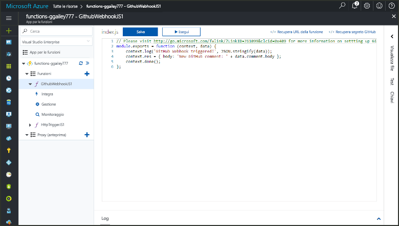
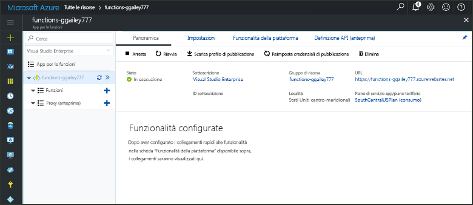
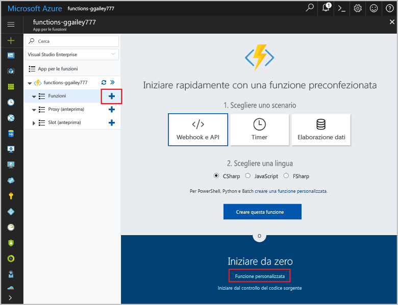
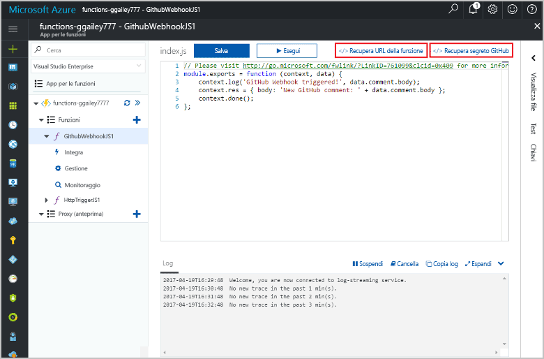
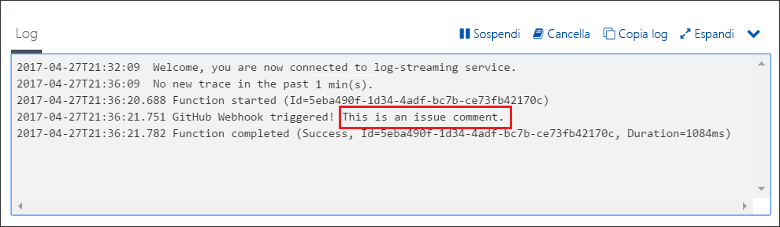

# Creare una funzione attivata da un webhook GitHubCreate a function triggered by a GitHub webhook

Informazioni su come creare una funzione attivata da una richiesta di webhook HTTP con un payload specifico di GitHub.Learn how to create a function that is triggered by an HTTP webhook request with a GitHub-specific payload.

## PrerequisitiPrerequisites

+ Un account GitHub con almeno un progetto.A GitHub account with at least one project.
+ Una sottoscrizione di Azure.An Azure subscription. Se non se ne ha una, creare un [account gratuito](https://azure.microsoft.com/free/?WT.mc_id=A261C142F) prima di iniziare.If you don't have one, create a [free account](https://azure.microsoft.com/free/?WT.mc_id=A261C142F) before you begin.

[!INCLUDE [functions-portal-favorite-function-apps](../../includes/functions-portal-favorite-function-apps.md)]

## Creare un'app per le funzioni di AzureCreate an Azure Function app

[!INCLUDE [Create function app Azure portal](../../includes/functions-create-function-app-portal.md)]

Si creerà ora una funzione nella nuova app per le funzioni.Next, you create a function in the new function app.

## Creare una funzione attivata da webhook GitHubCreate a GitHub webhook triggered function

1. Espandere l'app per le funzioni e fare clic sul pulsante **+** accanto a **Funzioni**.Expand your function app and click the **+** button next to **Functions**. Se questa è la prima funzione nell'app per le funzioni, selezionare **Funzione personalizzata**.If this is the first function in your function app, select **Custom function**. Verrà visualizzato il set completo di modelli di funzione.This displays the complete set of function templates.

    

2. Selezionare il modello **GitHubWebHook** per il linguaggio desiderato.Select the **GitHub WebHook** template for your desired language. **Assegnare un nome alla funzione** e quindi selezionare **Crea**.**Name your function**, then select **Create**.

      

3. Nella nuova funzione fare clic su **</> Get function URL** (Ottieni URL funzione) e quindi copiare e salvare i valori.In your new function, click **</> Get function URL**, then copy and save the values. Eseguire la stessa operazione per **</> Recupera segreto GitHub**.Do the same thing for **</> Get GitHub secret**. Questi valori servono per configurare il webhook in GitHub.You use these values to configure the webhook in GitHub.

    

Viene successivamente creato un webhook nel repository GitHub.Next, you create a webhook in your GitHub repository.

## Configurare il webhookConfigure the webhook

1. In GitHub passare a un repository di cui si è proprietari.In GitHub, navigate to a repository that you own. È possibile usare anche qualsiasi repository biforcato.You can also use any repository that you have forked. Se è necessario creare una copia tramite fork di un repository, usare <https://github.com/Azure-Samples/functions-quickstart>.If you need to fork a repository, use <https://github.com/Azure-Samples/functions-quickstart>.

1. Fare clic su **Impostazioni**, quindi su **Webhook** e infine su **Aggiungi webhook**.Click **Settings**, then click **Webhooks**, and  **Add webhook**.

    

1. Usare le impostazioni come indicato nella tabella e quindi fare clic su **Add webhook** (Aggiungi webhook).Use settings as specified in the table, then click **Add webhook**.

    

| ImpostazioneSetting | Valore consigliatoSuggested value | DescrizioneDescription |
|---|---|---|
| **Payload URL** (URL payload)**Payload URL** | Valore copiatoCopied value | Usare il valore restituito da **</> Get function URL** (Ottieni URL funzione).Use the value returned by  **</> Get function URL**. |
| **Segreto****Secret**   | Valore copiatoCopied value | Usare il valore restituito da **</> Get GitHub secret** (Ottieni segreto GitHub).Use the value returned by  **</> Get GitHub secret**. |
| **Tipo contenuto****Content type** | application/jsonapplication/json | La funzione prevede un payload JSON.The function expects a JSON payload. |
| Trigger di eventoEvent triggers | Selezione di singoli eventiLet me select individual events | Attivazione solo in caso di eventi di commento al problema.We only want to trigger on issue comment events.  |
| | Commento al problemaIssue comment |  |

Il webhook ora è configurato per attivare la funzione quando un nuovo commento al problema viene aggiunto.Now, the webhook is configured to trigger your function when a new issue comment is added.

## Testare la funzioneTest the function

1. Nel repository GitHub aprire la scheda **Issues** (Problemi) in una nuova finestra del browser.In your GitHub repository, open the **Issues** tab in a new browser window.

1. Nella nuova finestra fare clic su **Nuovo problema**, digitare un titolo e quindi fare clic su **Submit new issue** (Invia nuovo problema).In the new window, click **New Issue**, type a title, and then click **Submit new issue**.

1. Nel problema, digitare un commento e fare clic su **Comment (Commento)**.In the issue, type a comment and click **Comment**.

    

1. Tornare al portale e visualizzare i log.Go back to the portal and view the logs. Verrà visualizzata una voce di traccia con il nuovo testo del commento.You should see a trace entry with the new comment text.

     

## Pulire le risorseClean up resources

[!INCLUDE [Next steps note](../../includes/functions-quickstart-cleanup.md)]

## Passaggi successiviNext steps

È stata creata una funzione che viene eseguita quando viene ricevuta una richiesta da un webhook GitHub.You have created a function that runs when a request is received from a GitHub webhook.

[!INCLUDE [Next steps note](../../includes/functions-quickstart-next-steps.md)]

Per altre informazioni sui trigger webhook, vedere [Associazioni HTTP e webhook in Funzioni di Azure](functions-bindings-http-webhook.md).For more information about webhook triggers, see [Azure Functions HTTP and webhook bindings](functions-bindings-http-webhook.md).
