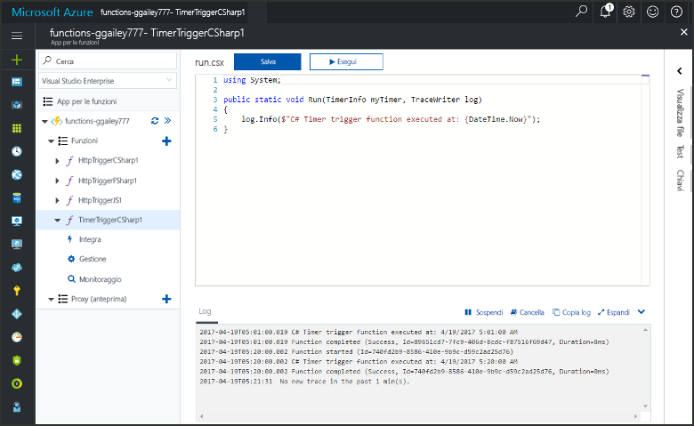
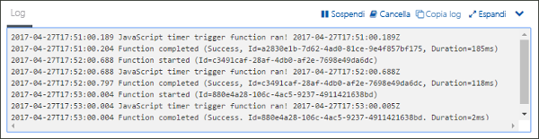
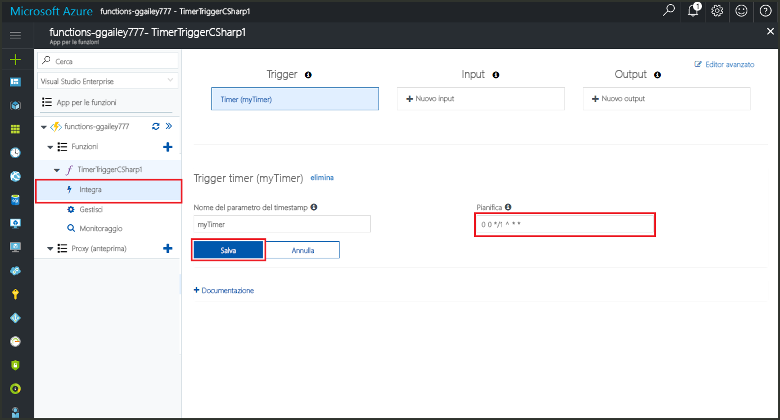

# Creare una funzione in Azure attivata da un timer

Informazioni su come toouse Azure funzioni toocreate una funzione che viene eseguito in base una pianificazione definita.

## Prerequisiti

toocomplete questa esercitazione:

+ Se non si ha una sottoscrizione di Azure, creare un [account gratuito](https://azure.microsoft.com/free/?WT.mc_id=A261C142F) prima di iniziare.

[!INCLUDE [functions-portal-favorite-function-apps](../../includes/functions-portal-favorite-function-apps.md)]

## Creare un'app per le funzioni di Azure

[!INCLUDE [Create function app Azure portal](../../includes/functions-create-function-app-portal.md)]

Creare quindi una funzione in hello nuova funzione app.

## Creare una funzione attivata da un timer

1. Espandere l'applicazione di funzione e fare clic su hello  **+**  accanto troppo**funzioni**. Se si tratta di hello prima funzione di app di funzione, selezionare **funzione personalizzata**. Consente di visualizzare il set completo di hello dei modelli di funzione.

    

2. Seleziona hello **TimerTrigger** modello per la lingua desiderata. Utilizzare quindi le impostazioni di hello come specificato nella tabella hello:

    

    | Impostazione | Valore consigliato | Descrizione |
    |---|---|---|
    | **Dare un nome alla funzione** | TimerTriggerCSharp1 | Definisce il nome di hello della funzione di timer attivato. |
    | **[Pianificazione](http://en.wikipedia.org/wiki/Cron#CRON_expression)** | 0 \*/1 \* \* \* \* | Un campo sei [espressione CRON](http://en.wikipedia.org/wiki/Cron#CRON_expression) toorun la funzione che pianifica ogni minuto. |

2. Fare clic su **Crea**. Viene creata una funzione nel linguaggio scelto che verrà eseguita ogni minuto.

3. Verificare l'esecuzione visualizzando le informazioni di traccia toohello log scritte.

    

A questo punto, è possibile modificare la pianificazione della funzione hello in modo che venga eseguito meno frequentemente, ad esempio una volta ogni ora. 

## Pianificazione di aggiornamento hello timer

1. Espandere la funzione e fare clic su **Integrazione**. Questo è possibile definire l'input e output associazioni per la funzione e inoltre impostare la pianificazione hello. 

2. Nel campo **Pianificazione** immettere il nuovo valore `0 0 */1 * * *` e quindi fare clic su **Salva**.  

È ora disponibile una funzione che viene eseguita ogni ora. 

## Pulire le risorse

[!INCLUDE [Next steps note](../../includes/functions-quickstart-cleanup.md)]

## Passaggi successivi

È stata creata una funzione eseguita in base a una pianificazione.

[!INCLUDE [Next steps note](../../includes/functions-quickstart-next-steps.md)]

Per altre informazioni sui trigger timer, vedere [Pianificare l'esecuzione di codice con Funzioni di Azure](functions-bindings-timer.md).