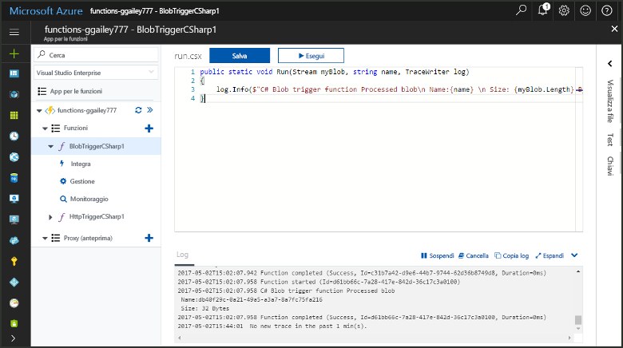
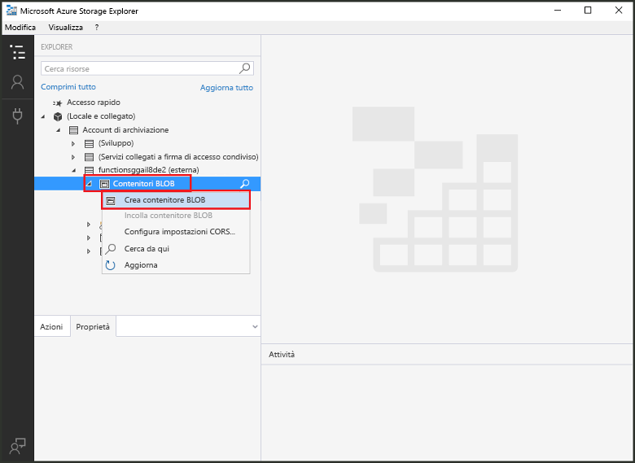
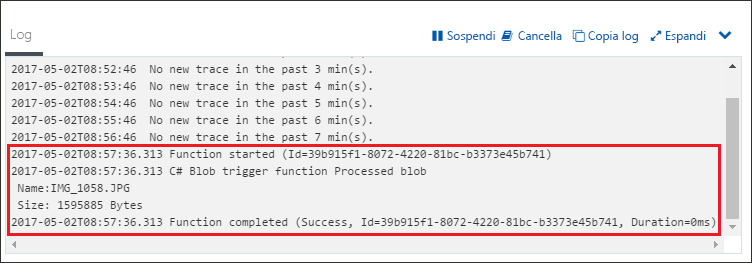

# Creare una funzione attivata dall'archiviazione BLOB di AzureCreate a function triggered by Azure Blob storage

Informazioni su come creare una funzione attivata nel momento in cui vengono caricati o aggiornati file nell'archiviazione BLOB di Azure.Learn how to create a function triggered when files are uploaded to or updated in Azure Blob storage.

## PrerequisitiPrerequisites

+ Scaricare e installare [Microsoft Azure Storage Explorer](http://storageexplorer.com/).Download and install the [Microsoft Azure Storage Explorer](http://storageexplorer.com/).
+ Una sottoscrizione di Azure.An Azure subscription. Se non se ne ha una, creare un [account gratuito](https://azure.microsoft.com/free/?WT.mc_id=A261C142F) prima di iniziare.If you don't have one, create a [free account](https://azure.microsoft.com/free/?WT.mc_id=A261C142F) before you begin.

[!INCLUDE [functions-portal-favorite-function-apps](../../includes/functions-portal-favorite-function-apps.md)]

## Creare un'app per le funzioni di AzureCreate an Azure Function app

[!INCLUDE [Create function app Azure portal](../../includes/functions-create-function-app-portal.md)]

Si creerà ora una funzione nella nuova app per le funzioni.Next, you create a function in the new function app.

## Creare una funzione attivata dall'archiviazione BLOBCreate a Blob storage triggered function

1. Espandere l'app per le funzioni e fare clic sul pulsante **+** accanto a **Funzioni**.Expand your function app and click the **+** button next to **Functions**. Se questa è la prima funzione nell'app per le funzioni, selezionare **Funzione personalizzata**.If this is the first function in your function app, select **Custom function**. Verrà visualizzato il set completo di modelli di funzione.This displays the complete set of function templates.

    

2. Selezionare il modello **BlobTrigger** per la lingua desiderata e usare le impostazioni specificate nella tabella.Select the **BlobTrigger** template for your desired language, and use the settings as specified in the table.

    

    | ImpostazioneSetting | Valore consigliatoSuggested value | DescrizioneDescription |
    |---|---|---|
    | **Percorso****Path**   | mycontainer/{name}mycontainer/{name}    | Percorso da monitorare nell'archiviazione BLOB.Location in Blob storage being monitored. Il nome file del BLOB viene passato nel binding come parametro _name_.The file name of the blob is passed in the binding as the _name_ parameter.  |
    | **Connessione dell'account di archiviazione****Storage account connection** | AzureWebJobStorageAzureWebJobStorage | È possibile usare la connessione dell'account di archiviazione già usata dall'app per le funzioni oppure crearne una nuova.You can use the storage account connection already being used by your function app, or create a new one.  |
    | **Dare un nome alla funzione****Name your function** | Univoco nell'app per le funzioniUnique in your function app | Nome della funzione attivata dal BLOB.Name of this blob triggered function. |

3. Fare clic su **Crea** per creare la funzione.Click **Create** to create your function.

Connettersi quindi all'account di archiviazione di Azure e creare il contenitore **mycontainer**.Next, you connect to your Azure Storage account and create the **mycontainer** container.

## Creare il contenitoreCreate the container

1. Nella funzione fare clic su **Integrazione**, espandere **Documentazione** e copiare sia **Nome account** sia **Chiave account**.In your function, click **Integrate**, expand **Documentation**, and copy both **Account name** and **Account key**. Usare queste credenziali per connettersi all'account di archiviazione.You use these credentials to connect to the storage account. Se si è già connessi all'account di archiviazione, andare al passaggio 4.If you have already connected your storage account, skip to step 4.

    

1. Eseguire lo strumento [Microsoft Azure Storage Explorer](http://storageexplorer.com/), fare clic sull'icona di connessione a sinistra, scegliere **Use a storage account name and key** (Usare il nome e la chiave di un account di archiviazione) e fare clic su **Avanti**.Run the [Microsoft Azure Storage Explorer](http://storageexplorer.com/) tool, click the connect icon on the left, choose **Use a storage account name and key**, and click **Next**.

    

1. Immettere i valori **Nome account** e **Chiave account** definiti nel passaggio 1, fare clic su **Avanti** e quindi su **Connetti**.Enter the **Account name** and **Account key** from step 1, click **Next** and then **Connect**. 

    

1. Espandere l'account di archiviazione associato, fare doppio clic su **Contenitori BLOB**, fare clic su **Crea contenitore BLOB**, digitare `mycontainer` e quindi premere INVIO.Expand the attached storage account, right-click **Blob containers**, click **Create blob container**, type `mycontainer`, and then press enter.

    

Dopo aver creato un contenitore BLOB, è possibile ora testare la funzione caricando un file nel contenitore.Now that you have a blob container, you can test the function by uploading a file to the container.

## Testare la funzioneTest the function

1. Tornare al portale di Azure, selezionare la funzione, espandere i **log** nella parte inferiore della pagina e assicurarsi che lo streaming dei log non sia stato interrotto.Back in the Azure portal, browse to your function expand the **Logs** at the bottom of the page and make sure that log streaming isn't paused.

1. In Esplora archivi espandere l'account di archiviazione, **Contenitori BLOB** e **mycontainer**.In Storage Explorer, expand your storage account, **Blob containers**, and **mycontainer**. Fare clic su **Carica** e quindi su **Carica file...**.Click **Upload** and then **Upload files...**.

    

1. Nella finestra di dialogo **Carica file** fare clic sul campo **File**.In the **Upload files** dialog box, click the **Files** field. Identificare un file nel computer locale, ad esempio un file di immagine, selezionarlo e fare clic su **Apri** e quindi su **Carica**.Browse to a file on your local computer, such as an image file, select it and click **Open** and then **Upload**.

1. Tornare ai log di funzione e verificare che il BLOB sia stato letto.Go back to your function logs and verify that the blob has been read.

   

    >[!NOTE]
    > Se l'app per le funzioni viene eseguita nel piano a consumo predefinito, è possibile che si verifichi un ritardo di alcuni minuti tra il momento in cui il BLOB viene aggiunto o aggiornato e il momento in cui viene attivata la funzione.When your function app runs in the default Consumption plan, there may be a delay of up to several minutes between the blob being added or updated and the function being triggered. Se nelle funzioni attivate dal BLOB è necessaria una bassa latenza, valutare l'opportunità di eseguire l'app per le funzioni in un piano di servizio app.If you need low latency in your blob triggered functions, consider running your function app in an App Service plan.

## Pulire le risorseClean up resources

[!INCLUDE [Next steps note](../../includes/functions-quickstart-cleanup.md)]

## Passaggi successiviNext steps

È stata creata una funzione che viene eseguita nel momento in cui nell'archiviazione BLOB viene aggiunto o aggiornato un BLOB.You have created a function that runs when a blob is added to or updated in Blob storage. 

[!INCLUDE [Next steps note](../../includes/functions-quickstart-next-steps.md)]

Per altre informazioni sui trigger dell'archiviazione BLOB, vedere [Binding dell'archiviazione BLOB di Funzioni di Azure](functions-bindings-storage-blob.md).For more information about Blob storage triggers, see [Azure Functions Blob storage bindings](functions-bindings-storage-blob.md).
