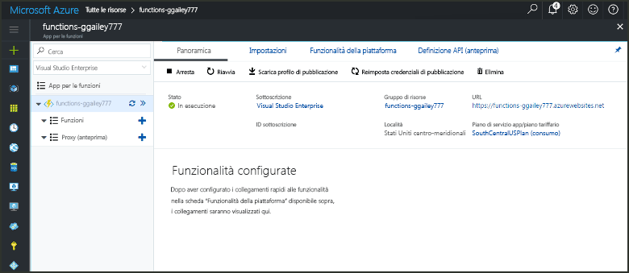
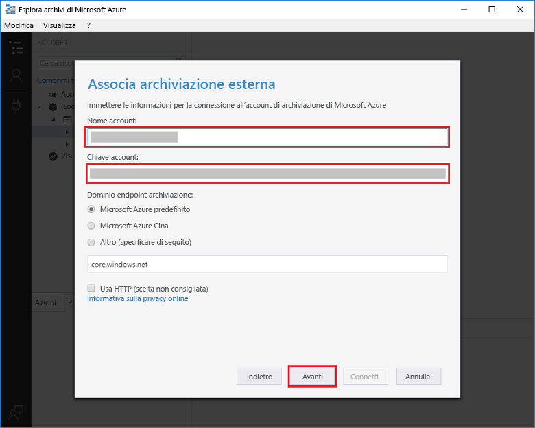

# Creare una funzione attivata dall'archiviazione BLOB di AzureCreate a function triggered by Azure Blob storage

Informazioni su come toocreate una funzione di attivazione eseguita quando i file vengono caricati tooor aggiornato nell'archiviazione Blob di Azure.Learn how toocreate a function triggered when files are uploaded tooor updated in Azure Blob storage.

## PrerequisitiPrerequisites

+ Scaricare e installare hello [Microsoft Azure Storage Explorer](http://storageexplorer.com/).Download and install hello [Microsoft Azure Storage Explorer](http://storageexplorer.com/).
+ Una sottoscrizione di Azure.An Azure subscription. Se non se ne ha una, creare un [account gratuito](https://azure.microsoft.com/free/?WT.mc_id=A261C142F) prima di iniziare.If you don't have one, create a [free account](https://azure.microsoft.com/free/?WT.mc_id=A261C142F) before you begin.

[!INCLUDE [functions-portal-favorite-function-apps](../../includes/functions-portal-favorite-function-apps.md)]

## Creare un'app per le funzioni di AzureCreate an Azure Function app

[!INCLUDE [Create function app Azure portal](../../includes/functions-create-function-app-portal.md)]

Creare quindi una funzione in hello nuova funzione app.Next, you create a function in hello new function app.

## Creare una funzione attivata dall'archiviazione BLOBCreate a Blob storage triggered function

1. Espandere l'applicazione di funzione e fare clic su hello  **+**  accanto troppo**funzioni**.Expand your function app and click hello **+** button next too**Functions**. Se si tratta di hello prima funzione di app di funzione, selezionare **funzione personalizzata**.If this is hello first function in your function app, select **Custom function**. Consente di visualizzare il set completo di hello dei modelli di funzione.This displays hello complete set of function templates.

    

2. Seleziona hello **BlobTrigger** modello per la lingua desiderata e utilizza le impostazioni di hello come specificato nella tabella hello.Select hello **BlobTrigger** template for your desired language, and use hello settings as specified in hello table.

    

    | ImpostazioneSetting | Valore consigliatoSuggested value | DescrizioneDescription |
    |---|---|---|
    | **Percorso****Path**   | mycontainer/{name}mycontainer/{name}    | Percorso da monitorare nell'archiviazione BLOB.Location in Blob storage being monitored. nome del file Hello del blob hello viene passato nell'associazione hello come hello _nome_ parametro.hello file name of hello blob is passed in hello binding as hello _name_ parameter.  |
    | **Connessione dell'account di archiviazione****Storage account connection** | AzureWebJobStorageAzureWebJobStorage | È possibile utilizzare una connessione ad account di archiviazione hello già in uso dalla tua app di funzione o crearne uno nuovo.You can use hello storage account connection already being used by your function app, or create a new one.  |
    | **Dare un nome alla funzione****Name your function** | Univoco nell'app per le funzioniUnique in your function app | Nome della funzione attivata dal BLOB.Name of this blob triggered function. |

3. Fare clic su **crea** toocreate la funzione.Click **Create** toocreate your function.

Successivamente, connettersi tooyour account di archiviazione Azure e creare hello **mycontainer** contenitore.Next, you connect tooyour Azure Storage account and create hello **mycontainer** container.

## Creare il contenitore di helloCreate hello container

1. Nella funzione fare clic su **Integrazione**, espandere **Documentazione** e copiare sia **Nome account** sia **Chiave account**.In your function, click **Integrate**, expand **Documentation**, and copy both **Account name** and **Account key**. Utilizzare questi account di archiviazione di credenziali tooconnect toohello.You use these credentials tooconnect toohello storage account. Se si è già connessi all'account di archiviazione, ignorare toostep 4.If you have already connected your storage account, skip toostep 4.

    

1. Eseguire hello [Microsoft Azure Storage Explorer](http://storageexplorer.com/) strumento, fare clic su hello icona a sinistra di hello della connessione, scegliere **utilizzare un nome account di archiviazione e una chiave**, fare clic su **Avanti**.Run hello [Microsoft Azure Storage Explorer](http://storageexplorer.com/) tool, click hello connect icon on hello left, choose **Use a storage account name and key**, and click **Next**.

    

1. Immettere hello **nome Account** e **chiave dell'Account** nel passaggio 1, fare clic su **Avanti** e quindi **Connetti**.Enter hello **Account name** and **Account key** from step 1, click **Next** and then **Connect**. 

    

1. Espandere l'account di archiviazione collegato hello destro del mouse su **contenitori Blob**, fare clic su **crea contenitore blob**, tipo `mycontainer`, quindi premere INVIO.Expand hello attached storage account, right-click **Blob containers**, click **Create blob container**, type `mycontainer`, and then press enter.

    

Dopo aver creato un contenitore blob, è possibile testare la funzione hello caricando un contenitore di toohello file.Now that you have a blob container, you can test hello function by uploading a file toohello container.

## Funzione hello testTest hello function

1. Nel portale di Azure hello, funzione tooyour Sfoglia espandere hello **registri** nella parte inferiore di hello della pagina hello e assicurarsi che il log di streaming non è in pausa.Back in hello Azure portal, browse tooyour function expand hello **Logs** at hello bottom of hello page and make sure that log streaming isn't paused.

1. In Esplora archivi espandere l'account di archiviazione, **Contenitori BLOB** e **mycontainer**.In Storage Explorer, expand your storage account, **Blob containers**, and **mycontainer**. Fare clic su **Carica** e quindi su **Carica file...**.Click **Upload** and then **Upload files...**.

    

1. In hello **caricare file** finestra di dialogo fare clic su hello **file** campo.In hello **Upload files** dialog box, click hello **Files** field. Sfoglia file tooa nel computer locale, ad esempio un file di immagine, selezionarlo e fare clic su **aprire** e quindi **caricare**.Browse tooa file on your local computer, such as an image file, select it and click **Open** and then **Upload**.

1. Tornare indietro i log delle funzioni tooyour e verificare che BLOB hello è stato letto.Go back tooyour function logs and verify that hello blob has been read.

   

    >[!NOTE]
    > Quando l'app di funzione viene eseguita nel piano di utilizzo predefinito di hello, potrebbe esserci un ritardo di backup tooseveral minuti tra hello blob viene aggiunto o aggiornato e hello funzione venga attivata.When your function app runs in hello default Consumption plan, there may be a delay of up tooseveral minutes between hello blob being added or updated and hello function being triggered. Se nelle funzioni attivate dal BLOB è necessaria una bassa latenza, valutare l'opportunità di eseguire l'app per le funzioni in un piano di servizio app.If you need low latency in your blob triggered functions, consider running your function app in an App Service plan.

## Pulire le risorseClean up resources

[!INCLUDE [Next steps note](../../includes/functions-quickstart-cleanup.md)]

## Passaggi successiviNext steps

È stata creata una funzione che viene eseguito quando un blob viene aggiunto tooor aggiornato nell'archiviazione Blob.You have created a function that runs when a blob is added tooor updated in Blob storage. 

[!INCLUDE [Next steps note](../../includes/functions-quickstart-next-steps.md)]

Per altre informazioni sui trigger dell'archiviazione BLOB, vedere [Binding dell'archiviazione BLOB di Funzioni di Azure](functions-bindings-storage-blob.md).For more information about Blob storage triggers, see [Azure Functions Blob storage bindings](functions-bindings-storage-blob.md).
