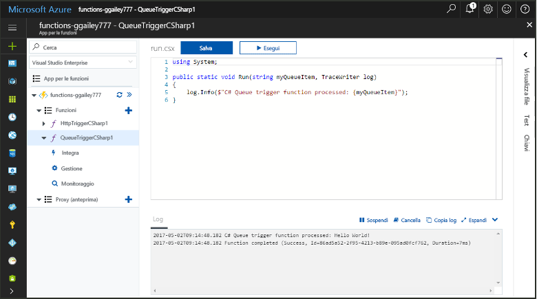
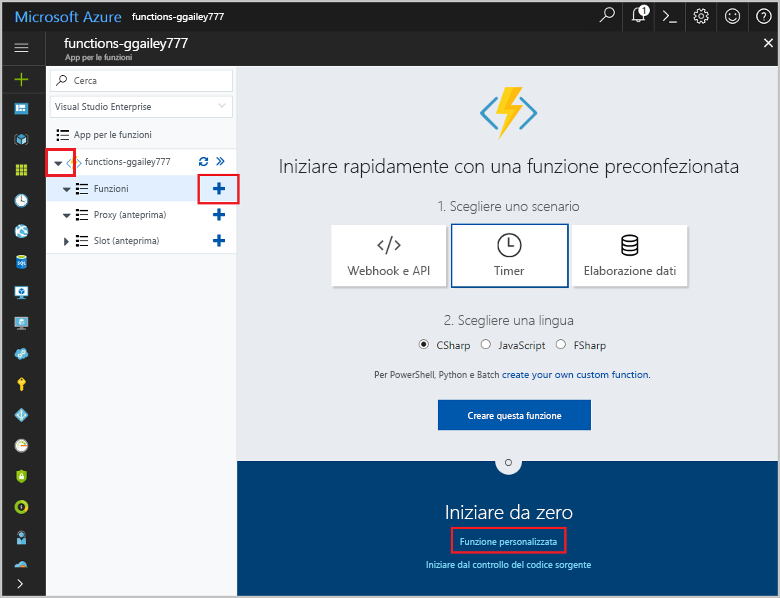
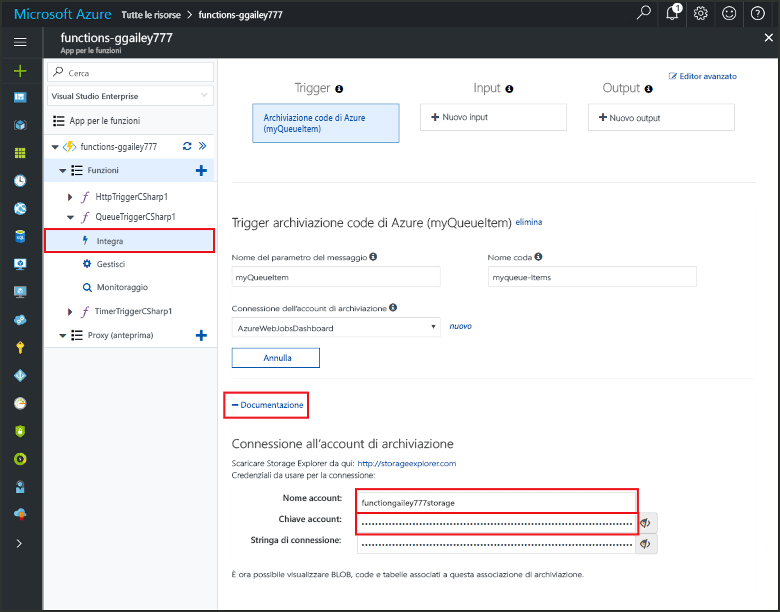
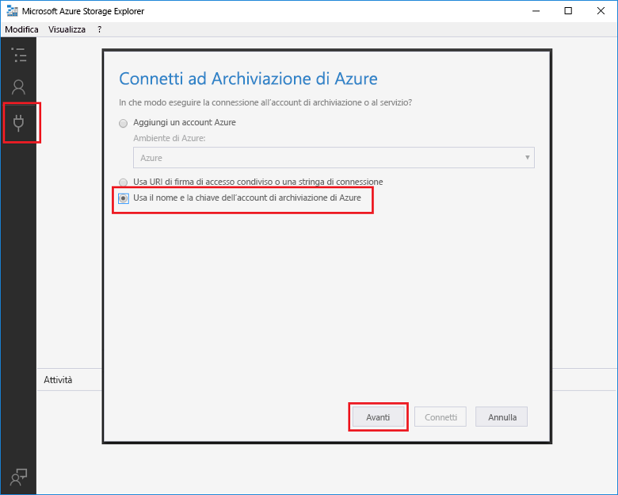
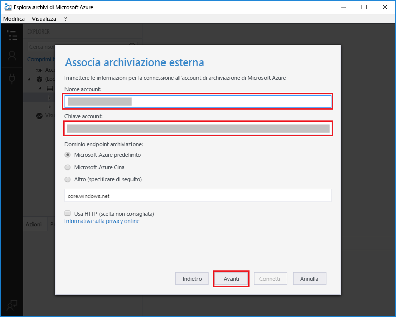
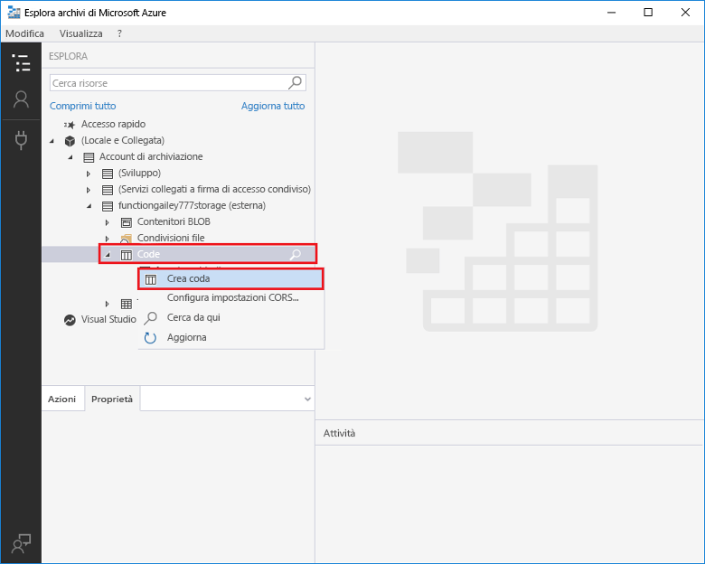
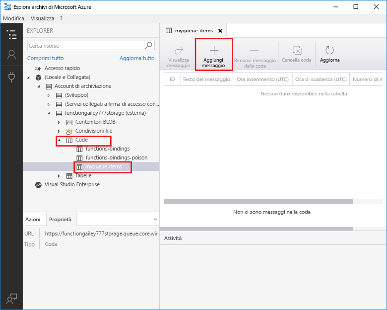
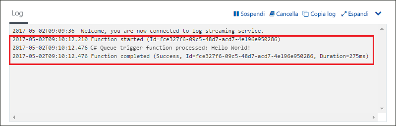

# Creare una funzione attivata dall'archiviazione code di Azure

Informazioni su come toocreate una funzione di attivazione eseguita quando i messaggi vengono inviati tooan coda di archiviazione di Azure.

## Prerequisiti

- Scaricare e installare hello [Microsoft Azure Storage Explorer](http://storageexplorer.com/).

- Una sottoscrizione di Azure. Se non se ne ha una, creare un [account gratuito](https://azure.microsoft.com/free/?WT.mc_id=A261C142F) prima di iniziare.

[!INCLUDE [functions-portal-favorite-function-apps](../../includes/functions-portal-favorite-function-apps.md)]

## Creare un'app per le funzioni di Azure

[!INCLUDE [Create function app Azure portal](../../includes/functions-create-function-app-portal.md)]

Creare quindi una funzione in hello nuova funzione app.

## Creare una funzione attivata da una coda

1. Espandere l'applicazione di funzione e fare clic su hello  **+**  accanto troppo**funzioni**. Se si tratta di hello prima funzione di app di funzione, selezionare **funzione personalizzata**. Consente di visualizzare il set completo di hello dei modelli di funzione.

    

2. Seleziona hello **QueueTrigger** modello per la lingua desiderata e utilizza le impostazioni di hello come specificato nella tabella hello.

    
    
    | Impostazione | Valore consigliato | Descrizione |
    |---|---|---|
    | **Nome coda**   | myqueue-items    | Nome di hello coda tooconnect tooin account di archiviazione. |
    | **Connessione dell'account di archiviazione** | AzureWebJobStorage | È possibile utilizzare una connessione ad account di archiviazione hello già in uso dalla tua app di funzione o crearne uno nuovo.  |
    | **Dare un nome alla funzione** | Univoco nell'app per le funzioni | Nome della funzione attivata dalla coda. |

3. Fare clic su **crea** toocreate la funzione.

Successivamente, connettersi tooyour account di archiviazione Azure e creare hello **myqueue elementi** coda di archiviazione.

## Creare la coda hello

1. Nella funzione fare clic su **Integrazione**, espandere **Documentazione** e copiare sia **Nome account** sia **Chiave account**. Utilizzare questi account di archiviazione di credenziali tooconnect toohello. Se si è già connessi all'account di archiviazione, ignorare toostep 4.

    v

1. Eseguire hello [Microsoft Azure Storage Explorer](http://storageexplorer.com/) strumento, fare clic su hello icona a sinistra di hello della connessione, scegliere **utilizzare un nome account di archiviazione e una chiave**, fare clic su **Avanti**.

    

1. Immettere hello **nome Account** e **chiave dell'Account** nel passaggio 1, fare clic su **Avanti** e quindi **Connetti**.

    

1. Espandere l'account di archiviazione collegato hello destro del mouse su **code**, fare clic su **Create queue**, tipo `myqueue-items`, e quindi premere INVIO.

    

Dopo aver creato una coda di archiviazione, è possibile testare la funzione hello mediante l'aggiunta di una coda di messaggi toohello.

## Funzione hello test

1. Nel portale di Azure hello, funzione tooyour Sfoglia espandere hello **registri** nella parte inferiore di hello della pagina hello e assicurarsi che il log di streaming non è in pausa.

1. In Esplora archivi espandere l'account di archiviazione, **Code** e **myqueue-items** e quindi fare clic su **Aggiungi messaggio**.

    

1. Digitare il proprio messaggio di benvenuto nel campo **Testo del messaggio** e fare clic su **OK**.

1. Attendere alcuni secondi, quindi tornare tooyour i log delle funzioni e verificare che il nuovo messaggio hello letto dalla coda hello.

    

1. In Esplora archivi, fare clic su **aggiornamento** e verificare il messaggio hello è stato elaborato e non è più in coda hello.

## Pulire le risorse

[!INCLUDE [Next steps note](../../includes/functions-quickstart-cleanup.md)]

## Passaggi successivi

È stata creata una funzione che viene eseguito quando un messaggio viene aggiunto tooa coda di archiviazione.

[!INCLUDE [Next steps note](../../includes/functions-quickstart-next-steps.md)]

Per altre informazioni sui trigger dell'archiviazione code, vedere [Associazioni della coda dell'archiviazione di Funzioni di Azure](functions-bindings-storage-queue.md).