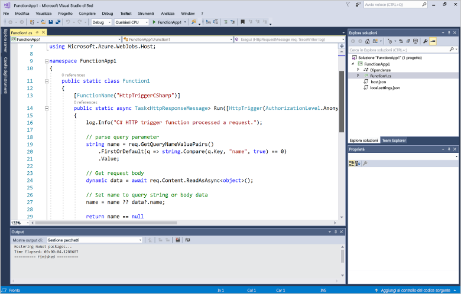
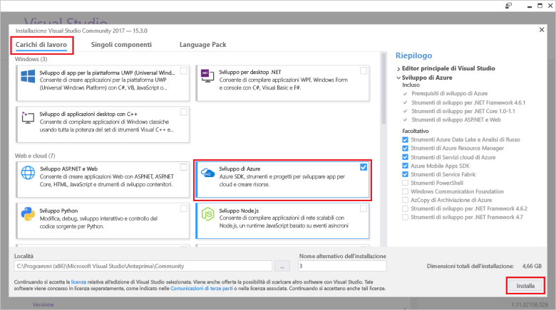
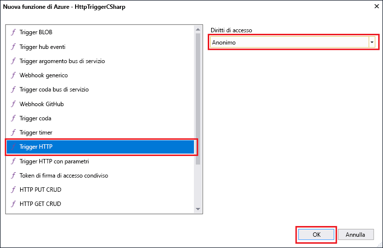

# Creare la prima funzione con Visual StudioCreate your first function using Visual Studio

Funzioni di Azure consente di eseguire il codice in un ambiente senza server senza dover prima creare una macchina virtuale o pubblicare un'applicazione Web.Azure Functions lets you execute your code in a serverless environment without having to first create a VM or publish a web application.

Questo argomento illustra come usare gli strumenti di Visual Studio 2017 per Funzioni di Azure per creare e testare una funzione "hello world" in locale.In this topic, you learn how to use the Visual Studio 2017 tools for Azure Functions to create and test a "hello world" function locally. Il codice della funzione verrà quindi pubblicato in Azure.You will then publish the function code to Azure. Questi strumenti sono disponibili come parte del carico di lavoro di sviluppo di Azure in Visual Studio 2017 versione 15.3 o successiva.These tools are available as part of the Azure development workload in Visual Studio 2017 version 15.3, or a later version.

## PrerequisitiPrerequisites

Per completare questa esercitazione, installare:To complete this tutorial, install:

* [Visual Studio 2017 versione 15.3](https://www.visualstudio.com/vs/preview/), con il carico di lavoro di **sviluppo di Azure**.[Visual Studio 2017 version 15.3](https://www.visualstudio.com/vs/preview/), including the **Azure development** workload.

    
    
    >[!NOTE]  
    Dopo l'installazione o l'aggiornamento a Visual Studio 2017 versione 15.3, potrebbe essere necessario anche aggiornare manualmente gli strumenti di Visual Studio 2017 per Funzioni di Azure.After you install or upgrade to Visual Studio 2017 version 15.3, you might also need to manually update the Visual Studio 2017 tools for Azure Functions. È possibile aggiornare gli strumenti dal menu **Strumenti** scegliendo **Estensioni e aggiornamenti** > **Aggiornamenti** > **Visual Studio Marketplace** > **Azure Functions and Web Jobs Tools** (Strumenti per Funzioni di Azure e processi Web) > **Aggiorna**.You can update the tools from the **Tools** menu under **Extensions and Updates...** > **Updates** > **Visual Studio Marketplace** > **Azure Functions and Web Jobs Tools** > **Update**. 

[!INCLUDE [quickstarts-free-trial-note](../../includes/quickstarts-free-trial-note.md)] 

## Creare un progetto Funzioni di Azure in Visual StudioCreate an Azure Functions project in Visual Studio

[!INCLUDE [Create a project using the Azure Functions template](../../includes/functions-vstools-create.md)]

Ora che è stato creato il progetto, si può creare la prima funzione.Now that you have created the project, you can create your first function.

## Creare la funzioneCreate the function

1. In **Esplora soluzioni** fare clic con il pulsante destro del mouse sul nodo del progetto e scegliere **Aggiungi** > **Nuovo elemento**.In **Solution Explorer**, right-click on your project node and select **Add** > **New Item**. Selezionare **Funzione di Azure** e fare clic su **Aggiungi**.Select **Azure Function** and click **Add**.

2. Selezionare **HttpTrigger**, digitare un **nome di funzione**, selezionare **Anonimo** in **Diritti di accesso** e fare clic su **Crea**.Select **HttpTrigger**, type a **Function Name**, select **Anonymous** for **Access Rights**, and click **Create**. La funzione creata è accessibile da una richiesta HTTP proveniente da qualsiasi client.The function created is accessed by an HTTP request from any client. 

    

    Al progetto viene aggiunto un file di codice che contiene una classe che implementa il codice della funzione.A code file is added to your project that contains a class that implements your function code. Questo codice è basato su un modello, che riceve un valore di nome e lo ritrasmette.This code is based on a template, which receives a name value and echos it back. L'attributo **FunctionName** imposta il nome della funzione.The **FunctionName** attribute sets the name of your function. L'attributo **HttpTrigger** indica il messaggio che attiva la funzione.The **HttpTrigger** attribute indicates the message that triggers the function. 

    

Ora che è stata creata una funzione attivata tramite HTTP, si può testare la funzione nel computer locale.Now that you have created an HTTP-triggered function, you can test it on your local computer.

## Testare la funzione in localeTest the function locally

Azure Functions Core Tools consente di eseguire il progetto Funzioni di Azure nel computer di sviluppo locale.Azure Functions Core Tools lets you run Azure Functions project on your local development computer. Verrà richiesto di installare questi strumenti al primo avvio di una funzione da Visual Studio.You are prompted to install these tools the first time you start a function from Visual Studio.  

1. Per testare la funzione premere F5.To test your function, press F5. Se viene visualizzata, accettare la richiesta di Visual Studio di scaricare e installare gli strumenti dell'interfaccia della riga di comando Azure Functions Core Tools.If prompted, accept the request from Visual Studio to download and install Azure Functions Core (CLI) tools.  Potrebbe essere necessario anche abilitare un'eccezione del firewall per consentire agli strumenti di gestire le richieste HTTP.You may also need to enable a firewall exception so that the tools can handle HTTP requests.

2. Copiare l'URL della funzione dall'output di runtime di Funzioni di Azure.Copy the URL of your function from the Azure Functions runtime output.  

    

3. Incollare l'URL per la richiesta HTTP nella barra degli indirizzi del browser.Paste the URL for the HTTP request into your browser's address bar. Aggiungere la stringa di query `&name=<yourname>` all'URL ed eseguire la richiesta.Append the query string `&name=<yourname>` to this URL and execute the request. Di seguito è illustrata la risposta nel browser alla richiesta GET locale restituita dalla funzione:The following shows the response in the browser to the local GET request returned by the function: 

    

4. Per interrompere il debug, fare clic sul pulsante **Interrompi** sulla barra degli strumenti di Visual Studio.To stop debugging, click the **Stop** button on the Visual Studio toolbar.

Dopo aver verificato la corretta esecuzione della funzione nel computer locale, è possibile pubblicare il progetto in Azure.After you have verified that the function runs correctly on your local computer, it's time to publish the project to Azure.

## Pubblicare il progetto in AzurePublish the project to Azure

Per poter pubblicare il progetto, è necessario che la sottoscrizione di Azure includa un'app per le funzioni.You must have a function app in your Azure subscription before you can publish your project. È possibile creare un'app per le funzioni direttamente da Visual Studio.You can create a function app right from Visual Studio.

[!INCLUDE [Publish the project to Azure](../../includes/functions-vstools-publish.md)]

## Testare la funzione in AzureTest your function in Azure

1. Copiare l'URL di base dell'app per le funzioni dalla pagina del profilo di pubblicazione.Copy the base URL of the function app from the Publish profile page. Sostituire la parte `localhost:port` dell'URL usato durante il test della funzione in locale con il nuovo URL di base.Replace the `localhost:port` portion of the URL you used when testing the function locally with the new base URL. Come prima, assicurarsi di accodare la stringa di query `&name=<yourname>` all'URL ed eseguire la richiesta.As before, make sure to append the query string `&name=<yourname>` to this URL and execute the request.

    L'URL che chiama la funzione attivata tramite HTTP sarà simile al seguente:The URL that calls your HTTP triggered function looks like this:

        http://<functionappname>.azurewebsites.net/api/<functionname>?name=<yourname> 

2. Incollare questo nuovo URL per la richiesta HTTP nella barra degli indirizzi del browser.Paste this new URL for the HTTP request into your browser's address bar. Di seguito è illustrata la risposta nel browser alla richiesta GET remota restituita dalla funzione:The following shows the response in the browser to the remote GET request returned by the function: 

    
 
## Passaggi successiviNext steps

È stato usato Visual Studio per creare un'app per le funzioni C# con una semplice funzione attivata tramite HTTP.You have used Visual Studio to create a C# function app with a simple HTTP triggered function. 

+ Per informazioni su come configurare il progetto per il supporto di altri tipi di trigger e binding, vedere la sezione [Configurare il progetto per lo sviluppo locale](functions-develop-vs.md#configure-the-project-for-local-development) in [Azure Functions Tools for Visual Studio](functions-develop-vs.md).To learn how to configure your project to support other types of triggers and bindings, see the [Configure the project for local development](functions-develop-vs.md#configure-the-project-for-local-development) section in [Azure Functions Tools for Visual Studio](functions-develop-vs.md).
+ Per altre informazioni sul test e il debug in locale con Azure Functions Core Tools, vedere [Scrivere codice per le funzioni di Azure e testarle in locale](functions-run-local.md).To learn more about local testing and debugging using the Azure Functions Core Tools, see [Code and test Azure Functions locally](functions-run-local.md). 
+ Per altre informazioni sullo sviluppo di funzioni quali le librerie della classe .NET, vedere [Uso di librerie di classi .NET con Funzioni di Azure](functions-dotnet-class-library.md).To learn more about developing functions as .NET class libraries, see [Using .NET class libraries with Azure Functions](functions-dotnet-class-library.md). 

