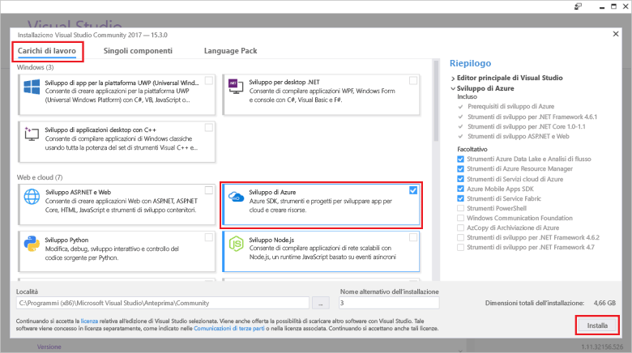

# <a name="azure-functions-tools-for-visual-studio"></a>Azure Functions Tools for Visual Studio  

Strumenti di funzioni di Azure per Visual Studio 2017 è un'estensione di Visual Studio che consente di sviluppare, testare e distribuire le funzioni tooAzure di c#. Se questa è la prima esperienza con le funzioni di Azure, è possibile acquisire informazioni, vedere [tooAzure un'introduzione funzioni](functions-overview.md).

Strumenti di Azure funzioni Hello fornisce hello seguenti vantaggi: 

* Modifica, compilazione ed esecuzione di funzioni nel computer di sviluppo locale. 
* Pubblicazione delle funzioni di Azure direttamente progetto tooAzure. 
* Utilizzare le associazioni di funzioni di processi Web attributi toodeclare direttamente nel hello codice c# anziché mantenendo un function.json separato per le definizioni di associazione.
* Sviluppo e distribuzione di funzioni C# precompilate. Le funzioni precompilate offrono migliori prestazioni nell'avvio a freddo rispetto alle funzioni basate su script C#. 
* Codice delle funzioni in c# con tutti i vantaggi di hello di sviluppo di Visual Studio. 

Questo argomento viene illustrato come toouse hello Azure funzioni Tools per Visual Studio 2017 toodevelop delle funzioni in c#. Verrà inoltre descritto come toopublish tooAzure il progetto come assembly .NET.

## <a name="prerequisites"></a>Prerequisiti

Gli strumenti di funzioni di Azure è incluso nel carico di lavoro di hello lo sviluppo di Azure di [Visual Studio 2017 versione 15.3](https://www.visualstudio.com/vs/), o versione successiva. Assicurarsi di includere hello **lo sviluppo di Azure** carico di lavoro nell'installazione di Visual Studio 2017 versione 15.3:



toocreate e distribuire funzioni, è inoltre necessario:

* Una sottoscrizione di Azure attiva. Se non si possiede una sottoscrizione di Azure, sono disponibili [account gratuiti](https://azure.microsoft.com/free/?WT.mc_id=A261C142F).

* Un account dell'Archiviazione di Azure. toocreate un account di archiviazione, vedere [creare un account di archiviazione](../storage/common/storage-create-storage-account.md#create-a-storage-account).  
## <a name="create-an-azure-functions-project"></a>Creare un progetto di Funzioni di Azure 

[!INCLUDE [Create a project using hello Azure Functions](../../includes/functions-vstools-create.md)]


## <a name="configure-hello-project-for-local-development"></a>Configurare il progetto hello per lo sviluppo locale

Quando si crea un nuovo progetto utilizzando il modello di Azure funzioni hello, si ottiene un progetto c# vuoto che contiene i seguenti file hello:

* **host.JSON**: consente di configurare hello host funzioni. Queste impostazioni si applicano sia durante l'esecuzione in locale che nell'esecuzione in Azure. Per altre informazioni, vedere l'articolo di riferimento su [host.json](https://github.com/Azure/azure-webjobs-sdk-script/wiki/host.json).
    
* **local.settings.json**: mantiene le impostazioni usate quando si esegue Funzioni localmente. Queste impostazioni non vengono utilizzate da Azure, vengono usati da hello [strumenti di base di Azure funzioni](functions-run-local.md). Usare le impostazioni toospecify questo file, ad esempio le stringhe di connessione tooother Azure servizi. Aggiungere un nuovo toohello chiave **valori** matrice per ogni connessione richiesta dalle funzioni nel progetto. Per ulteriori informazioni, vedere [file delle impostazioni locali](functions-run-local.md#local-settings-file) nell'argomento di strumenti di base di Azure funzioni hello.

il runtime di funzioni Hello utilizza internamente un account di archiviazione di Azure. Per tutti i trigger, tipi diversi da HTTP e ai webhook, è necessario impostare hello **Values.AzureWebJobsStorage** tooa Azure Storage account stringa di connessione della chiave.

[!INCLUDE [Note toonot use local storage](../../includes/functions-local-settings-note.md)]

 stringa di connessione account archiviazione hello tooset:

1. In Visual Studio, aprire **Cloud Explorer**, espandere **Account di archiviazione** > **Account di archiviazione**, quindi selezionare **proprietà**e hello copia **stringa di connessione primaria** valore.   

2. Nel progetto, aprire il file di progetto local.settings.json hello e impostare il valore di hello di hello **AzureWebJobsStorage** chiave toohello stringa di connessione è stata copiata.

3. Ripetere hello precedente passaggio tooadd chiavi univoche toohello **valori** matrice per le connessioni richiesto dalle funzioni.  

## <a name="create-a-function"></a>Creare una funzione

Nelle funzioni di pre-compilate, le associazioni hello utilizzate dalla funzione hello sono definite applicando gli attributi nel codice hello. Quando si utilizzano toocreate strumenti di Azure funzioni hello delle funzioni dai modelli fornito hello, questi attributi vengono applicati automaticamente. 

1. In **Esplora soluzioni** fare clic con il pulsante destro del mouse sul nodo del progetto e scegliere **Aggiungi** > **Nuovo elemento**. Selezionare **funzione Azure**, digitare un **nome** classe hello e fare clic su **Aggiungi**.

2. Scegliere il trigger, impostare le proprietà di associazione di hello e fare clic su **crea**. Hello riportato di seguito le impostazioni di hello all'attivazione della creazione di una coda di archiviazione (funzione). 

    
    
    Una chiave di stringa di connessione denominata **QueueStorage** viene fornito, che è definito nel file local.settings.json hello. 
 
3. Esaminare hello appena aggiunta classe. Viene visualizzato un valore statico **eseguire** (metodo), che è stato attribuito hello **FunctionName** attributo. Questo attributo indica che il metodo hello è il punto di ingresso hello per la funzione hello. 

    Ad esempio, hello seguente classe c# rappresenta una funzione di archiviazione generato coda base:

    ````csharp
    using System;
    using Microsoft.Azure.WebJobs;
    using Microsoft.Azure.WebJobs.Host;
    
    namespace FunctionApp1
    {
        public static class Function1
        {
            [FunctionName("QueueTriggerCSharp")]        
            public static void Run([QueueTrigger("myqueue-items", Connection = "QueueStorage")]string myQueueItem, TraceWriter log)
            {
                log.Info($"C# Queue trigger function processed: {myQueueItem}");
            }
        }
    } 
    ````
 
    Un attributo specifico di associazione è parametro specificato per l'associazione tooeach applicato toohello metodo punto di ingresso. l'attributo Hello accetta informazioni di associazione hello come parametri. Nell'esempio precedente hello hello primo parametro è un **QueueTrigger** attributo applicato, che indica la funzione coda attivata. nome della coda Hello e nome di impostazione di stringa di connessione vengono passati come parametri.  

## <a name="testing-functions"></a>Test delle funzioni

Azure Functions Core Tools consente di eseguire il progetto Funzioni di Azure nel computer di sviluppo locale. Si è richiesta tooinstall questi strumenti hello primo avvio di una funzione da Visual Studio.  

tootest della funzione, premere F5. Se richiesto, accettare la richiesta di hello da toodownload di Visual Studio e installare gli strumenti di Azure funzioni Core (CLI).  È necessario anche tooenable un'eccezione del firewall in modo che gli strumenti di hello possono gestire le richieste HTTP.

Con il progetto hello in esecuzione, è possibile testare il codice come si testa funzione distribuito. Per altre informazioni, vedere [Strategie per il test del codice in Funzioni di Azure](functions-test-a-function.md). Durante l'esecuzione in modalità di debug, i punti di interruzione vengono raggiunti in Visual Studio come previsto. 

Per un esempio di come tootest una coda attivata (funzione), vedere hello [esercitazione di avvio rapido di coda attivata funzione](functions-create-storage-queue-triggered-function.md#test-the-function).  

toolearn ulteriori informazioni sull'utilizzo di strumenti di base di hello Azure funzioni, vedere [codice e il test funzioni di Azure localmente](functions-run-local.md).

## <a name="publish-tooazure"></a>Pubblicare tooAzure

[!INCLUDE [Publish hello project tooAzure](../../includes/functions-vstools-publish.md)]

>[!NOTE]  
>Le impostazioni che è stato aggiunto in local.settings.json hello devono essere aggiunti anche toohello funzione app in Azure. Queste impostazioni non vengono aggiunte automaticamente. È possibile aggiungere le impostazioni necessarie tooyour funzione app in uno dei modi seguenti:
>
>* [Tramite il portale di Azure di hello](functions-how-to-use-azure-function-app-settings.md#settings).
>* [Utilizzo di hello `--publish-local-settings` opzione per la pubblicazione in strumenti di base di Azure funzioni hello](functions-run-local.md#publish).
>* [Utilizzando hello Azure CLI](/cli/azure/functionapp/config/appsettings#set). 

## <a name="next-steps"></a>Passaggi successivi

Per ulteriori informazioni sugli strumenti di funzioni di Azure, vedere la sezione delle domande più comuni di hello di hello [strumenti di Visual Studio 2017 per le funzioni di Azure](https://blogs.msdn.microsoft.com/webdev/2017/05/10/azure-function-tools-for-visual-studio-2017/) post di blog.

toolearn informazioni su strumenti di base di hello Azure funzioni, vedere [codice e il test funzioni di Azure localmente](functions-run-local.md).  
toolearn più sullo sviluppo di funzioni come librerie di classi .NET, vedere [librerie di classi .NET utilizzando con le funzioni di Azure](functions-dotnet-class-library.md). Inoltre, in questo argomento fornisce esempi di come toouse attributi toodeclare hello vari tipi di associazioni supportate dalle funzioni di Azure.    
