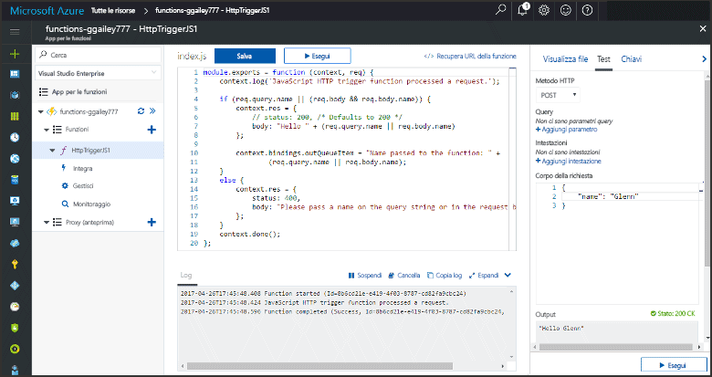
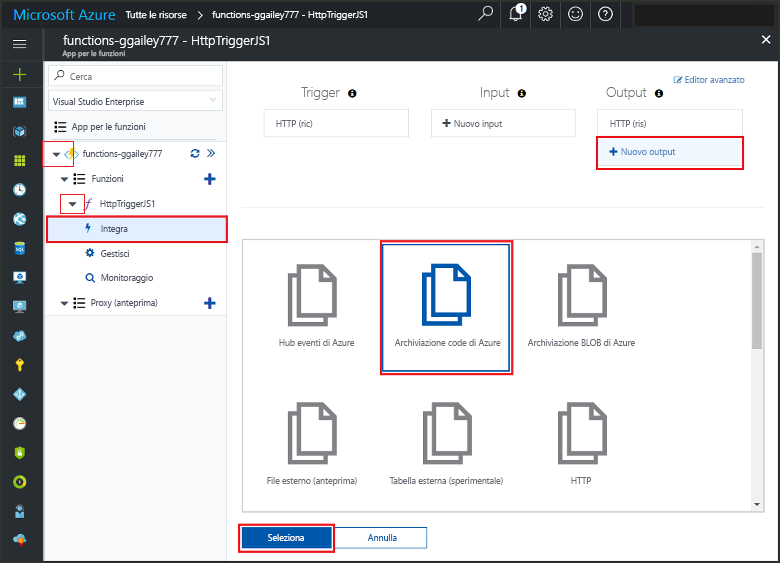
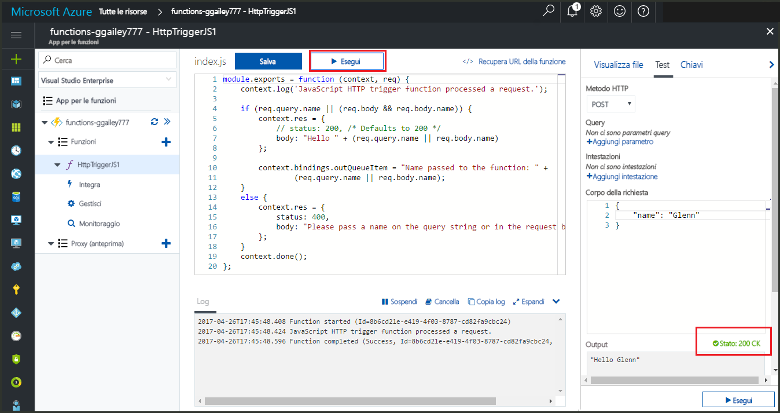
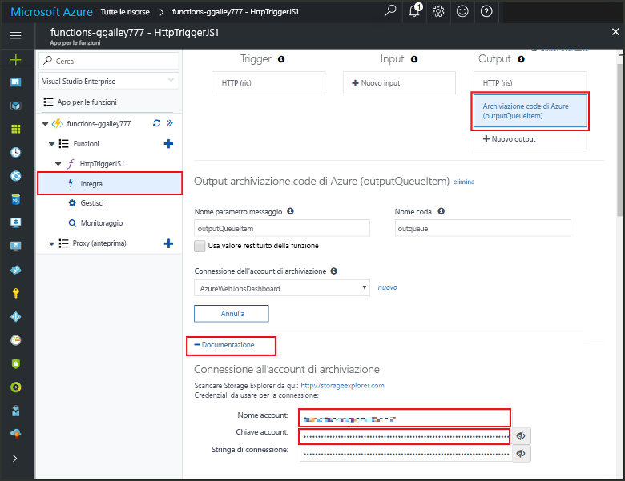

# <a name="add-messages-tooan-azure-storage-queue-using-functions"></a>Aggiungere una coda di archiviazione di Azure tooan messaggi utilizzando le funzioni

Nelle funzioni di Azure, le associazioni di input e outpue forniscono dati di servizio tooexternal tooconnect una modalità dichiarativa dalla funzione. In questo argomento, informazioni su come tooupdate una funzione esistente aggiungendo un output di associazione che invia messaggi tooAzure l'archiviazione delle code.  



## <a name="prerequisites"></a>Prerequisiti 

[!INCLUDE [Previous topics](../../includes/functions-quickstart-previous-topics.md)]

* Installare hello [Microsoft Azure Storage Explorer](http://storageexplorer.com/).

## <a name="add-binding"></a>Aggiungere un binding di output
 
1. Espandere sia l'app per le funzioni sia la funzione.

2. Selezionare **Integrazione**, **+ Nuovo output** e quindi scegliere **Archiviazione code di Azure** e **Seleziona**.
    
    

3. Utilizza le impostazioni di hello come specificato nella tabella hello: 

    

    | Impostazione      |  Valore consigliato   | Descrizione                              |
    | ------------ |  ------- | -------------------------------------------------- |
    | **Nome coda**   | myqueue-items    | nome Hello di hello coda tooconnect tooin account di archiviazione. |
    | **Connessione dell'account di archiviazione** | AzureWebJobStorage | È possibile utilizzare una connessione ad account di archiviazione hello già in uso dalla tua app di funzione o crearne uno nuovo.  |
    | **Nome del parametro del messaggio** | outputQueueItem | nome Hello del parametro di associazione di output di hello. | 

4. Fare clic su **salvare** associazione hello tooadd.
 
Dopo aver creato un'associazione di output definita, è necessario tooupdate hello codice toouse hello associazione tooadd tooa coda dei messaggi.  

## <a name="update-hello-function-code"></a>Aggiornare il codice di funzione hello

1. Selezionare il codice della funzione hello toodisplay funzione nell'editor di hello. 

2. Per una funzione c#, aggiornare la definizione di funzione come segue hello tooadd **outputQueueItem** parametro di associazione di archiviazione. Ignorare questo passaggio per le funzioni JavaScript.

    ```cs   
    public static async Task<HttpResponseMessage> Run(HttpRequestMessage req, 
        ICollector<string> outputQueueItem, TraceWriter log)
    {
        ....
    }
    ```

3. Aggiungere hello dopo la funzione di toohello codice appena prima di avviare hello metodo restituisce. Utilizzare frammento appropriato hello per lingua hello della funzione.

    ```javascript
    context.bindings.outputQueueItem = "Name passed toohello function: " + 
                (req.query.name || req.body.name);
    ```

    ```cs
    outputQueueItem.Add("Name passed toohello function: " + name);     
    ```

4. Selezionare **salvare** toosave modifiche.

il valore di Hello passato trigger HTTP toohello è incluso in una coda toohello aggiunto.
 
## <a name="test-hello-function"></a>Funzione hello test 

1. Dopo aver salvati le modifiche al codice hello, selezionare **eseguire**. 

    

2. Controllare toomake registri hello assicurarsi che la funzione hello ha avuto esito positivo. Una nuova coda denominata **outqueue** creati hello funzioni runtime quando l'associazione di output di hello viene innanzitutto utilizzata nell'account di archiviazione.

Successivamente, è possibile connettersi tooyour storage account tooverify hello nuova coda, il messaggio hello che tooit è stato aggiunto. 

## <a name="connect-toohello-queue"></a>Connettersi toohello coda

Ignora hello i primi tre passaggi se si dispone già installato soluzioni di archiviazione e averlo connesso tooyour account di archiviazione.    

1. Nella funzione, scegliere **integrazione** e hello nuovo **l'archiviazione delle code di Azure** associazione di output, quindi espandere **documentazione**. Copiare sia **Nome account** sia **Chiave account**. Utilizzare questi account di archiviazione di credenziali tooconnect toohello.
 
    

2. Eseguire hello [Microsoft Azure Storage Explorer](http://storageexplorer.com/) strumento, seleziona hello icona a sinistra di hello della connessione, scegliere **utilizzare un nome account di archiviazione e una chiave**e selezionare **Avanti**.

    
    
3. Hello Incolla **nome Account** e **chiave dell'Account** ottenuto al passaggio 1 in campi corrispondenti, quindi selezionare **Avanti**, e **Connetti**. 
  
    

4. Espandere il nodo di account di archiviazione collegato hello, **code** e verificare che una coda denominata **myqueue elementi** esiste. Inoltre, si verrà visualizzato un messaggio già in coda hello.  
 
    
 

## <a name="clean-up-resources"></a>Pulire le risorse

[!INCLUDE [Next steps note](../../includes/functions-quickstart-cleanup.md)]

## <a name="next-steps"></a>Passaggi successivi

È stata aggiunta una funzione di output associazione tooan esistente. 

[!INCLUDE [Next steps note](../../includes/functions-quickstart-next-steps.md)]

Per ulteriori informazioni sull'associazione tooQueue archiviazione, vedere [associazioni di coda di archiviazione di Azure funzioni](functions-bindings-storage-queue.md). 


