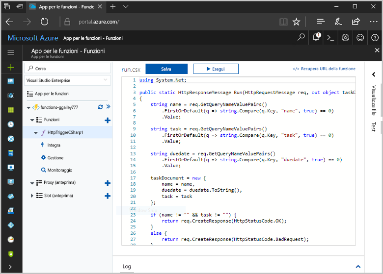
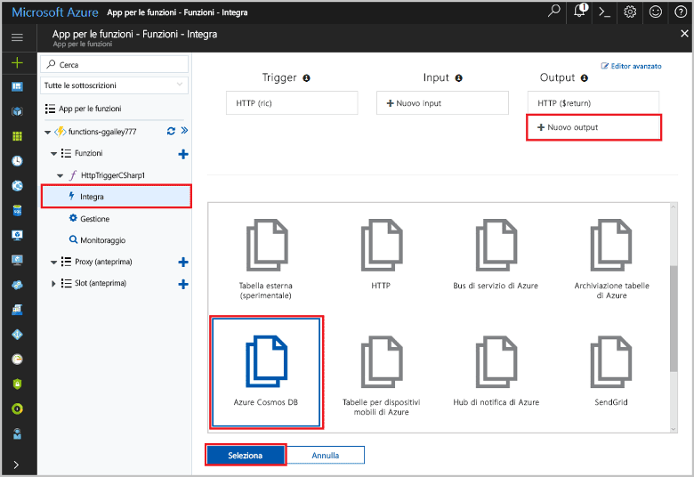
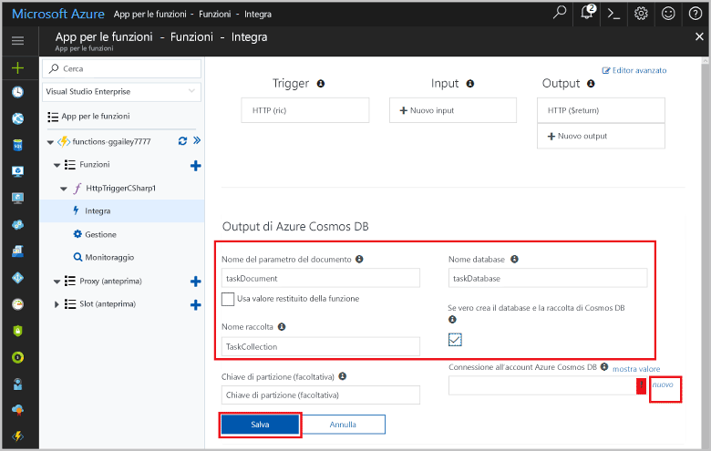
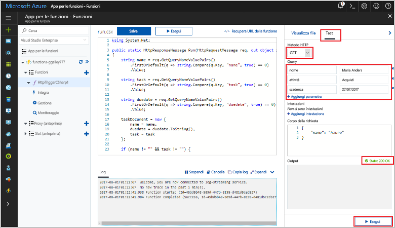
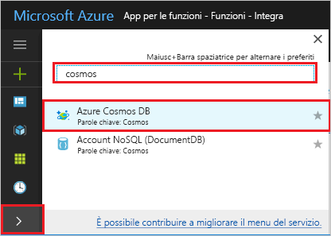
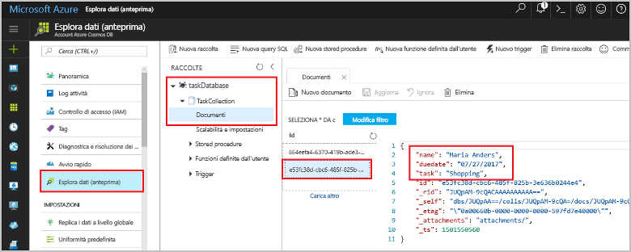

# <a name="store-unstructured-data-using-azure-functions-and-cosmos-db"></a><span data-ttu-id="07245-104">Archiviare dati non strutturati tramite Funzioni di Azure e Cosmos DB</span><span class="sxs-lookup"><span data-stu-id="07245-104">Store unstructured data using Azure Functions and Cosmos DB</span></span>

<span data-ttu-id="07245-105">[Azure Cosmos DB](https://azure.microsoft.com/services/cosmos-db/) offre un approccio ottimale per archiviare dati non strutturati e JSON.</span><span class="sxs-lookup"><span data-stu-id="07245-105">[Azure Cosmos DB](https://azure.microsoft.com/services/cosmos-db/) is a great way to store unstructured and JSON data.</span></span> <span data-ttu-id="07245-106">Insieme a Funzioni di Azure, Cosmos DB semplifica e velocizza l'archiviazione dei dati con una quantità minore di codice rispetto a quella necessaria per l'archiviazione dei dati in un database relazionale.</span><span class="sxs-lookup"><span data-stu-id="07245-106">Combined with Azure Functions, Cosmos DB makes storing data quick and easy with much less code than required for storing data in a relational database.</span></span>

<span data-ttu-id="07245-107">In Funzioni di Azure, i binding di input e di output forniscono una modalità dichiarativa per connettersi a dati di servizio esterni dalla funzione.</span><span class="sxs-lookup"><span data-stu-id="07245-107">In Azure Functions, input and output bindings provide a declarative way to connect to external service data from your function.</span></span> <span data-ttu-id="07245-108">Questo argomento illustra come aggiornare una funzione C# esistente per l'aggiunta di un binding di output che archivia dati non strutturati in un documento di Cosmos DB.</span><span class="sxs-lookup"><span data-stu-id="07245-108">In this topic, learn how to update an existing C# function to add an output binding that stores unstructured data in a Cosmos DB document.</span></span> 



## <a name="prerequisites"></a><span data-ttu-id="07245-110">Prerequisiti</span><span class="sxs-lookup"><span data-stu-id="07245-110">Prerequisites</span></span>

<span data-ttu-id="07245-111">Per completare questa esercitazione:</span><span class="sxs-lookup"><span data-stu-id="07245-111">To complete this tutorial:</span></span>

[!INCLUDE [Previous quickstart note](../../includes/functions-quickstart-previous-topics.md)]

## <a name="add-an-output-binding"></a><span data-ttu-id="07245-112">Aggiungere un binding di output</span><span class="sxs-lookup"><span data-stu-id="07245-112">Add an output binding</span></span>

1. <span data-ttu-id="07245-113">Espandere sia l'app per le funzioni sia la funzione.</span><span class="sxs-lookup"><span data-stu-id="07245-113">Expand both your function app and your function.</span></span>

1. <span data-ttu-id="07245-114">Selezionare **Integrazione** e **Nuovo output** in alto a destra nella pagina.</span><span class="sxs-lookup"><span data-stu-id="07245-114">Select **Integrate** and **+ New Output**, which is at the top right of the page.</span></span> <span data-ttu-id="07245-115">Scegliere **Azure Cosmos DB**, quindi fare clic su **Seleziona**.</span><span class="sxs-lookup"><span data-stu-id="07245-115">Choose **Azure Cosmos DB**, and click **Select**.</span></span>

    

3. <span data-ttu-id="07245-117">Usare le impostazioni di **Azure Cosmos DB output** (Output di Azure Cosmos DB) specificate nella tabella:</span><span class="sxs-lookup"><span data-stu-id="07245-117">Use the **Azure Cosmos DB output** settings as specified in the table:</span></span> 

    

    | <span data-ttu-id="07245-119">Impostazione</span><span class="sxs-lookup"><span data-stu-id="07245-119">Setting</span></span>      | <span data-ttu-id="07245-120">Valore consigliato</span><span class="sxs-lookup"><span data-stu-id="07245-120">Suggested value</span></span>  | <span data-ttu-id="07245-121">Descrizione</span><span class="sxs-lookup"><span data-stu-id="07245-121">Description</span></span>                                |
    | ------------ | ---------------- | ------------------------------------------ |
    | <span data-ttu-id="07245-122">**Nome del parametro del documento**</span><span class="sxs-lookup"><span data-stu-id="07245-122">**Document parameter name**</span></span> | <span data-ttu-id="07245-123">taskDocument</span><span class="sxs-lookup"><span data-stu-id="07245-123">taskDocument</span></span> | <span data-ttu-id="07245-124">Nome che fa riferimento all'oggetto Cosmos DB nel codice.</span><span class="sxs-lookup"><span data-stu-id="07245-124">Name that refers to the Cosmos DB object in code.</span></span> |
    | <span data-ttu-id="07245-125">**Database name** (Nome database)</span><span class="sxs-lookup"><span data-stu-id="07245-125">**Database name**</span></span> | <span data-ttu-id="07245-126">taskDatabase</span><span class="sxs-lookup"><span data-stu-id="07245-126">taskDatabase</span></span> | <span data-ttu-id="07245-127">Nome del database per il salvataggio dei documenti.</span><span class="sxs-lookup"><span data-stu-id="07245-127">Name of database to save documents.</span></span> |
    | <span data-ttu-id="07245-128">**Nome raccolta**</span><span class="sxs-lookup"><span data-stu-id="07245-128">**Collection name**</span></span> | <span data-ttu-id="07245-129">TaskCollection</span><span class="sxs-lookup"><span data-stu-id="07245-129">TaskCollection</span></span> | <span data-ttu-id="07245-130">Nome della raccolta di database di Cosmos DB.</span><span class="sxs-lookup"><span data-stu-id="07245-130">Name of collection of Cosmos DB databases.</span></span> |
    | <span data-ttu-id="07245-131">**Se true, crea il database e la raccolta di Cosmos DB**</span><span class="sxs-lookup"><span data-stu-id="07245-131">**If true, creates the Cosmos DB database and collection**</span></span> | <span data-ttu-id="07245-132">Selezionato</span><span class="sxs-lookup"><span data-stu-id="07245-132">Checked</span></span> | <span data-ttu-id="07245-133">La raccolta non esiste ancora, quindi crearla.</span><span class="sxs-lookup"><span data-stu-id="07245-133">The collection doesn't already exist, so create it.</span></span> |

4. <span data-ttu-id="07245-134">Fare clic sul collegamento **Nuovo** accanto all'etichetta **Connessione dell'account Cosmos DB** e quindi selezionare **Crea nuovo**.</span><span class="sxs-lookup"><span data-stu-id="07245-134">Select **New** next to the **Cosmos DB document connection** label, and select **+ Create new**.</span></span> 

5. <span data-ttu-id="07245-135">Usare quindi le impostazioni di **Nuovo account** specificate nella tabella:</span><span class="sxs-lookup"><span data-stu-id="07245-135">Use the **New account** settings as specified in the table:</span></span> 

    

    | <span data-ttu-id="07245-137">Impostazione</span><span class="sxs-lookup"><span data-stu-id="07245-137">Setting</span></span>      | <span data-ttu-id="07245-138">Valore consigliato</span><span class="sxs-lookup"><span data-stu-id="07245-138">Suggested value</span></span>  | <span data-ttu-id="07245-139">Descrizione</span><span class="sxs-lookup"><span data-stu-id="07245-139">Description</span></span>                                |
    | ------------ | ---------------- | ------------------------------------------ |
    | <span data-ttu-id="07245-140">**ID**</span><span class="sxs-lookup"><span data-stu-id="07245-140">**ID**</span></span> | <span data-ttu-id="07245-141">Nome del database</span><span class="sxs-lookup"><span data-stu-id="07245-141">Name of database</span></span> | <span data-ttu-id="07245-142">ID univoco per il database Cosmos DB</span><span class="sxs-lookup"><span data-stu-id="07245-142">Unique ID for the Cosmos DB database</span></span>  |
    | <span data-ttu-id="07245-143">**API**</span><span class="sxs-lookup"><span data-stu-id="07245-143">**API**</span></span> | <span data-ttu-id="07245-144">SQL (DocumentDB)</span><span class="sxs-lookup"><span data-stu-id="07245-144">SQL (DocumentDB)</span></span> | <span data-ttu-id="07245-145">Selezionare l'API del database di documenti.</span><span class="sxs-lookup"><span data-stu-id="07245-145">Select the document database API.</span></span>  |
    | <span data-ttu-id="07245-146">**Sottoscrizione**</span><span class="sxs-lookup"><span data-stu-id="07245-146">**Subscription**</span></span> | <span data-ttu-id="07245-147">Sottoscrizione di Azure</span><span class="sxs-lookup"><span data-stu-id="07245-147">Azure Subscription</span></span> | <span data-ttu-id="07245-148">Sottoscrizione di Azure</span><span class="sxs-lookup"><span data-stu-id="07245-148">Azure Subscription</span></span>  |
    | <span data-ttu-id="07245-149">**Gruppo di risorse**</span><span class="sxs-lookup"><span data-stu-id="07245-149">**Resource Group**</span></span> | <span data-ttu-id="07245-150">myResourceGroup</span><span class="sxs-lookup"><span data-stu-id="07245-150">myResourceGroup</span></span> |  <span data-ttu-id="07245-151">Usare il gruppo di risorse esistente che contiene l'app per le funzioni.</span><span class="sxs-lookup"><span data-stu-id="07245-151">Use the existing resource group that contains your function app.</span></span> |
    | <span data-ttu-id="07245-152">**Posizione**</span><span class="sxs-lookup"><span data-stu-id="07245-152">**Location**</span></span>  | <span data-ttu-id="07245-153">Europa occidentale</span><span class="sxs-lookup"><span data-stu-id="07245-153">WestEurope</span></span> | <span data-ttu-id="07245-154">Selezionare una località nei pressi dell'app per le funzioni o di altre app che usano i documenti archiviati.</span><span class="sxs-lookup"><span data-stu-id="07245-154">Select a location near to either your function app or to other apps that use the stored documents.</span></span>  |

6. <span data-ttu-id="07245-155">Fare clic su **OK** per creare il database.</span><span class="sxs-lookup"><span data-stu-id="07245-155">Click **OK** to create the database.</span></span> <span data-ttu-id="07245-156">La creazione del database può richiedere alcuni minuti.</span><span class="sxs-lookup"><span data-stu-id="07245-156">It may take a few minutes to create the database.</span></span> <span data-ttu-id="07245-157">Dopo avere creato il database, la stringa di connessione del database viene archiviata come impostazione dell'app per le funzioni.</span><span class="sxs-lookup"><span data-stu-id="07245-157">After the database is created, the database connection string is stored as a function app setting.</span></span> <span data-ttu-id="07245-158">Il nome di questa impostazione dell'app viene inserito nella **connessione dell'account Cosmos DB**.</span><span class="sxs-lookup"><span data-stu-id="07245-158">The name of this app setting is inserted in **Cosmos DB account connection**.</span></span> 
 
8. <span data-ttu-id="07245-159">Dopo aver impostato la stringa di connessione, selezionare **Salva** per creare il binding.</span><span class="sxs-lookup"><span data-stu-id="07245-159">After the connection string is set, select **Save** to create the binding.</span></span>

## <a name="update-the-function-code"></a><span data-ttu-id="07245-160">Aggiornare il codice funzione</span><span class="sxs-lookup"><span data-stu-id="07245-160">Update the function code</span></span>

<span data-ttu-id="07245-161">Sostituire il codice della funzione C# esistente con il seguente:</span><span class="sxs-lookup"><span data-stu-id="07245-161">Replace the existing C# function code with the following code:</span></span>

```csharp
using System.Net;

public static HttpResponseMessage Run(HttpRequestMessage req, out object taskDocument, TraceWriter log)
{
    string name = req.GetQueryNameValuePairs()
        .FirstOrDefault(q => string.Compare(q.Key, "name", true) == 0)
        .Value;

    string task = req.GetQueryNameValuePairs()
        .FirstOrDefault(q => string.Compare(q.Key, "task", true) == 0)
        .Value;

    string duedate = req.GetQueryNameValuePairs()
        .FirstOrDefault(q => string.Compare(q.Key, "duedate", true) == 0)
        .Value;

    taskDocument = new {
        name = name,
        duedate = duedate.ToString(),
        task = task
    };

    if (name != "" && task != "") {
        return req.CreateResponse(HttpStatusCode.OK);
    }
    else {
        return req.CreateResponse(HttpStatusCode.BadRequest);
    }
}

```
<span data-ttu-id="07245-162">Questo esempio di codice legge le stringhe della query di richiesta HTTP e le assegna ai campi dell'oggetto `taskDocument`.</span><span class="sxs-lookup"><span data-stu-id="07245-162">This code sample reads the HTTP Request query strings and assigns them to fields in the `taskDocument` object.</span></span> <span data-ttu-id="07245-163">Il binding `taskDocument` invia i dati dell'oggetto di questo parametro di binding per l'archiviazione nel database di documenti associato.</span><span class="sxs-lookup"><span data-stu-id="07245-163">The `taskDocument` binding sends the object data from this binding parameter to be stored in the bound document database.</span></span> <span data-ttu-id="07245-164">Il database viene creato alla prima esecuzione della funzione.</span><span class="sxs-lookup"><span data-stu-id="07245-164">The database is created the first time the function runs.</span></span>

## <a name="test-the-function-and-database"></a><span data-ttu-id="07245-165">Testare la funzione e il database</span><span class="sxs-lookup"><span data-stu-id="07245-165">Test the function and database</span></span>

1. <span data-ttu-id="07245-166">Espandere la finestra di destra e selezionare **Test**.</span><span class="sxs-lookup"><span data-stu-id="07245-166">Expand the right window and select **Test**.</span></span> <span data-ttu-id="07245-167">In **Query** fare clic su **Aggiungi parametro** e aggiungere i parametri seguenti per la stringa di query:</span><span class="sxs-lookup"><span data-stu-id="07245-167">Under **Query**, click **+ Add parameter** and add the following parameters to the query string:</span></span>

    + `name`
    + `task`
    + `duedate`

2. <span data-ttu-id="07245-168">Fare clic su **Esegui** e verificare che venga restituito uno stato 200.</span><span class="sxs-lookup"><span data-stu-id="07245-168">Click **Run** and verify that a 200 status is returned.</span></span>

    

1. <span data-ttu-id="07245-170">Sul lato sinistro del portale di Azure espandere la barra delle icone, digitare `cosmos` nel campo di ricerca e selezionare **Azure Cosmos DB**.</span><span class="sxs-lookup"><span data-stu-id="07245-170">On the left side of the Azure portal, expand the icon bar, type `cosmos` in the search field, and select **Azure Cosmos DB**.</span></span>

    

2. <span data-ttu-id="07245-172">Selezionare il database creato e quindi selezionare **Esplora dati**.</span><span class="sxs-lookup"><span data-stu-id="07245-172">Select the database you created, then select **Data Explorer**.</span></span> <span data-ttu-id="07245-173">Espandere i nodi **Raccolte**, selezionare il nuovo documento e verificare che il documento contenga i valori della stringa di query, oltre ad alcuni metadati aggiuntivi.</span><span class="sxs-lookup"><span data-stu-id="07245-173">Expand the **Collections** nodes, select the new document, and confirm that the document contains your query string values, along with some additional metadata.</span></span> 

    

<span data-ttu-id="07245-175">È stato aggiunto un binding al trigger HTTP che archivia dati non strutturati in un database Cosmos DB.</span><span class="sxs-lookup"><span data-stu-id="07245-175">You have successfully added a binding to your HTTP trigger that stores unstructured data in a Cosmos DB database.</span></span>

[!INCLUDE [Clean-up section](../../includes/clean-up-section-portal.md)]

## <a name="next-steps"></a><span data-ttu-id="07245-176">Passaggi successivi</span><span class="sxs-lookup"><span data-stu-id="07245-176">Next steps</span></span>

[!INCLUDE [functions-quickstart-next-steps](../../includes/functions-quickstart-next-steps.md)]

<span data-ttu-id="07245-177">Per altre informazioni sul binding a un database Cosmos DB, vedere [Binding di Azure Cosmos DB in Funzioni di Azure](functions-bindings-documentdb.md).</span><span class="sxs-lookup"><span data-stu-id="07245-177">For more information about binding to a Cosmos DB database, see [Azure Functions Cosmos DB bindings](functions-bindings-documentdb.md).</span></span>
