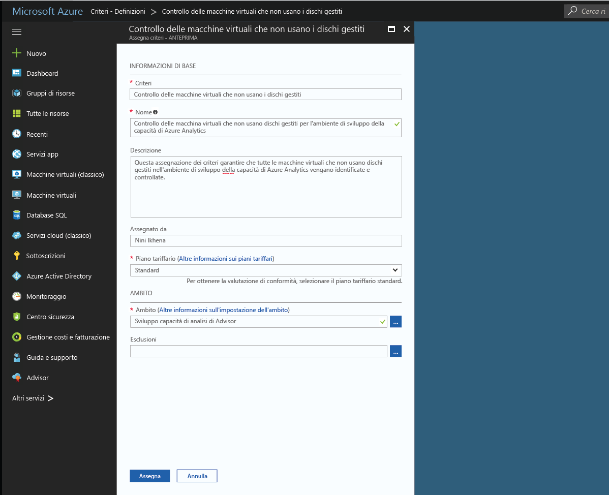

# Creare un'assegnazione di criteri per identificare le risorse non conformi nell'ambiente Azure
Il primo passaggio per comprendere la conformità in Azure consiste nell'identificare lo stato delle risorse. Questa guida introduttiva illustra il processo di creazione di un'assegnazione criteri per identificare le macchine virtuali che non usano Managed Disks.

Alla fine di questo processo, sarà possibile identificare le macchine virtuali che non usano Managed Disks. Tali macchine sono *non conformi* all'assegnazione dei criteri.

Se non si ha una sottoscrizione di Azure, creare un [account gratuito](https://azure.microsoft.com/free/?WT.mc_id=A261C142F) prima di iniziare.

## Creare un'assegnazione dei criteri

In questa guida introduttiva si crea un'assegnazione dei criteri e si assegna la definizione dei criteri *Audit Virtual Machines without Managed Disks* (Controlla macchine virtuali senza Managed Disks).

1. Selezionare **Assegnazioni**nel riquadro a sinistra della pagina Criteri di Azure.
2. Selezionare **Assign Policy** (Assegna criterio) nella parte superiore del riquadro **Assignments** (Assegnazioni).

   

3. Nella pagina **Assegna criterio** fare clic sul  accanto al campo **Policy** (Criterio) per aprire l'elenco delle definizioni disponibili.

   

   Criteri di Azure include definizioni di criteri predefinite che è possibile usare. Sono disponibili definizioni di criteri predefinite come le seguenti:

   - Enforce tag and its value (Imporre un tag e il relativo valore)
   - Applicare un tag e il relativo valore
   - Richiedere SQL Server versione 12.0

    Per un elenco completo di tutti i criteri predefiniti disponibili, vedere [Modelli di criteri](json-samples.md).

4. Cercare tra le definizioni di criteri per trovare la definizione *Audit VMs that do not use managed disks* (Controlla le macchine virtuali che non usano Managed Disks). Fare clic su tale criterio e fare clic su **Select** (Seleziona).

   

5. Specificare un nome visualizzato per l'assegnazione del criterio in **Nome**. In questo caso è possibile usare *Audit VMs that do not use managed disks* (Controlla le macchine virtuali che non usano Managed Disks). È anche possibile aggiungere una **descrizione** facoltativa. La descrizione fornisce informazioni dettagliate su come l'assegnazione dei criteri identifica tutte le macchine virtuali che non usano Managed Disks.
6. Modificare il piano tariffario impostando **Standard** per garantire che i criteri vengano applicati alle risorse esistenti.

   Per Criteri di Azure esistono due piani tariffari, ovvero *Gratuito* e *Standard*. Con il piano Gratuito è possibile applicare i criteri solo alle risorse future, mentre con quello Standard è possibile applicarli anche a risorse esistenti per ottenere una migliore comprensione dello stato di conformità. Per altre informazioni sui prezzi, vedere [Prezzi di Criteri di Azure](https://azure.microsoft.com/pricing/details/azure-policy/).

7. Selezionare l'ambito di applicazione dei criteri in **Scope** (Ambito).  L'ambito determina le risorse o il raggruppamento di risorse a cui viene applicata l'assegnazione di criteri e può variare da una sottoscrizione a gruppi di risorse.
8. Selezionare l'abbonamento (o gruppo di risorse) registrato in precedenza. In questo esempio viene usata la sottoscrizione **Azure Analytics Capacity Dev**, ma le opzioni possono essere diverse. Fare clic su **Seleziona**.

   

9. Per il momento lasciare vuota la casella **Esclusioni** e fare clic su **Assegna**.

A questo punto si è pronti per identificare le risorse non conformi per comprendere lo stato di conformità dell'ambiente.

## Identificare le risorse non conformi

Selezionare **Compliance** (Conformità) nel riquadro sinistro e cercare l'assegnazione di criteri creata.

Le eventuali risorse esistenti non conformi a questa nuova assegnazione verranno visualizzate nella scheda **Non-compliant resources** (Risorse non conformi).

Quando viene valutata una condizione per le risorse esistenti e tale condizione risulta soddisfatta, le risorse vengono contrassegnate come non conformi ai criteri. L'immagine di esempio precedente mostra le risorse non conformi. La tabella seguente illustra il funzionamento delle diverse azioni dei criteri in base alla valutazione della condizione per lo stato di conformità risultante. Anche se nel portale di Azure non viene visualizzata la logica di valutazione, sono visualizzati i risultati relativi allo stato di conformità. Lo stato di conformità può risultare conforme o non conforme.

|Risorsa  |Se la condizione nei criteri risulta  |Azione nei criteri   |Stato di conformità  |
|-----------|---------|---------|---------|
|Exists     |True      |Nega     |Non conforme |
|Exists     |False    |Nega     |Conforme     |
|Exists     |True      |Append   |Non conforme |
|Exists     |False    |Append   |Conforme     |
|Exists     |True      |Audit    |Non conforme |
|Exists     |False    |Audit    |Non conforme |

## Pulire le risorse

Altre guide in questa raccolta si basano su questa guida introduttiva. Se si prevede di continuare a usare le esercitazioni successive, non eliminare le risorse create in questa guida introduttiva. Se non si prevede di continuare, seguire questa procedura per eliminare tutte le risorse create da questa guida di avvio rapido nel portale di Azure.
1. Selezionare **Assegnazioni** nel riquadro a sinistra.
2. Cercare l'assegnazione creata e quindi fare clic su di essa con il pulsante destro del mouse.

   

3.  Selezionare **Delete Assignment** (Elimina assegnazione).

## Passaggi successivi

In questa guida introduttiva è stata assegnata una definizione dei criteri a un ambito. La definizione dei criteri garantisce che tutte le risorse nell'ambito siano conformi e identifica quelle che non lo sono.

Per altre informazioni sull'assegnazione di criteri per assicurarsi che le risorse **future** create siano conformi, continuare con l'esercitazione seguente:

> [!div class="nextstepaction"]
> [Creazione e gestione dei criteri](./create-manage-policy.md)
