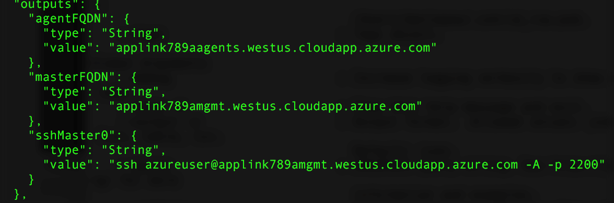

# <a name="deploy-a-docker-container-hosting-solution-using-the-azure-cli-20"></a><span data-ttu-id="9e92c-103">Distribuire una soluzione di hosting di contenitori Docker usando l'interfaccia della riga di comando di Azure 2.0</span><span class="sxs-lookup"><span data-stu-id="9e92c-103">Deploy a Docker container hosting solution using the Azure CLI 2.0</span></span>

<span data-ttu-id="9e92c-104">Usare i comandi `az acs` nell'interfaccia della riga di comando di Azure 2.0 per creare e gestire i cluster nel servizio contenitore di Azure.</span><span class="sxs-lookup"><span data-stu-id="9e92c-104">Use the `az acs` commands in the Azure CLI 2.0 to create and manage clusters in Azure Container Service.</span></span> <span data-ttu-id="9e92c-105">È anche possibile distribuire un cluster del servizio contenitore di Azure usando il [portale di Azure](container-service-deployment.md) o le API del servizio contenitore di Azure.</span><span class="sxs-lookup"><span data-stu-id="9e92c-105">You can also deploy an Azure Container Service cluster by using the [Azure portal](container-service-deployment.md) or the Azure Container Service APIs.</span></span>

<span data-ttu-id="9e92c-106">Per informazioni sui comandi `az acs`, passare il parametro `-h` a qualsiasi comando.</span><span class="sxs-lookup"><span data-stu-id="9e92c-106">For help on `az acs` commands, pass the `-h` parameter to any command.</span></span> <span data-ttu-id="9e92c-107">Ad esempio: `az acs create -h`.</span><span class="sxs-lookup"><span data-stu-id="9e92c-107">For example: `az acs create -h`.</span></span>


## <a name="prerequisites"></a><span data-ttu-id="9e92c-108">Prerequisiti</span><span class="sxs-lookup"><span data-stu-id="9e92c-108">Prerequisites</span></span>
<span data-ttu-id="9e92c-109">Per creare un cluster del servizio contenitore di Azure usando l'interfaccia della riga di comando di Azure 2.0, è necessario:</span><span class="sxs-lookup"><span data-stu-id="9e92c-109">To create an Azure Container Service cluster using the Azure CLI 2.0, you must:</span></span>
* <span data-ttu-id="9e92c-110">Avere un account Azure ([versione di valutazione gratuita](https://azure.microsoft.com/pricing/free-trial/))</span><span class="sxs-lookup"><span data-stu-id="9e92c-110">have an Azure account ([get a free trial](https://azure.microsoft.com/pricing/free-trial/))</span></span>
* <span data-ttu-id="9e92c-111">Avere installato e configurato l'[interfaccia della riga di comando di Azure 2.0](/cli/azure/install-az-cli2)</span><span class="sxs-lookup"><span data-stu-id="9e92c-111">have installed and set up the [Azure CLI 2.0](/cli/azure/install-az-cli2)</span></span>

## <a name="get-started"></a><span data-ttu-id="9e92c-112">Introduzione</span><span class="sxs-lookup"><span data-stu-id="9e92c-112">Get started</span></span> 
### <a name="log-in-to-your-account"></a><span data-ttu-id="9e92c-113">Accedere all'account</span><span class="sxs-lookup"><span data-stu-id="9e92c-113">Log in to your account</span></span>
```azurecli
az login 
```

<span data-ttu-id="9e92c-114">Seguire i prompt per accedere in modo interattivo.</span><span class="sxs-lookup"><span data-stu-id="9e92c-114">Follow the prompts to log in interactively.</span></span> <span data-ttu-id="9e92c-115">Per altri metodi di accesso, vedere [Get started with Azure CLI 2.0](/cli/azure/get-started-with-az-cli2) (Introduzione all'interfaccia della riga di comando di Azure 2.0).</span><span class="sxs-lookup"><span data-stu-id="9e92c-115">For other methods to log in, see [Get started with Azure CLI 2.0](/cli/azure/get-started-with-az-cli2).</span></span>

### <a name="set-your-azure-subscription"></a><span data-ttu-id="9e92c-116">Configurare la sottoscrizione di Azure</span><span class="sxs-lookup"><span data-stu-id="9e92c-116">Set your Azure subscription</span></span>

<span data-ttu-id="9e92c-117">Se si hanno più sottoscrizioni Azure, configurare la sottoscrizione predefinita.</span><span class="sxs-lookup"><span data-stu-id="9e92c-117">If you have more than one Azure subscription, set the default subscription.</span></span> <span data-ttu-id="9e92c-118">Ad esempio:</span><span class="sxs-lookup"><span data-stu-id="9e92c-118">For example:</span></span>

```
az account set --subscription "f66xxxxx-xxxx-xxxx-xxx-zgxxxx33cha5"
```


### <a name="create-a-resource-group"></a><span data-ttu-id="9e92c-119">Creare un gruppo di risorse</span><span class="sxs-lookup"><span data-stu-id="9e92c-119">Create a resource group</span></span>
<span data-ttu-id="9e92c-120">È consigliabile creare un gruppo di risorse per ogni cluster.</span><span class="sxs-lookup"><span data-stu-id="9e92c-120">We recommend that you create a resource group for every cluster.</span></span> <span data-ttu-id="9e92c-121">Specificare un'area di Azure in cui sia [disponibile](https://azure.microsoft.com/en-us/regions/services/) il servizio contenitore di Azure.</span><span class="sxs-lookup"><span data-stu-id="9e92c-121">Specify an Azure region in which Azure Container Service is [available](https://azure.microsoft.com/en-us/regions/services/).</span></span> <span data-ttu-id="9e92c-122">Ad esempio:</span><span class="sxs-lookup"><span data-stu-id="9e92c-122">For example:</span></span>

```azurecli
az group create -n acsrg1 -l "westus"
```
<span data-ttu-id="9e92c-123">L'output è simile al seguente:</span><span class="sxs-lookup"><span data-stu-id="9e92c-123">Output is similar to the following:</span></span>


## <a name="create-an-azure-container-service-cluster"></a><span data-ttu-id="9e92c-125">Creare un cluster del servizio contenitore di Azure</span><span class="sxs-lookup"><span data-stu-id="9e92c-125">Create an Azure Container Service cluster</span></span>

<span data-ttu-id="9e92c-126">Per creare un cluster, usare `az acs create`.</span><span class="sxs-lookup"><span data-stu-id="9e92c-126">To create a cluster, use `az acs create`.</span></span>
<span data-ttu-id="9e92c-127">Un nome per il cluster e il nome del gruppo di risorse creato nel passaggio precedente sono parametri obbligatori.</span><span class="sxs-lookup"><span data-stu-id="9e92c-127">A name for the cluster and the name of the resource group created in the previous step are mandatory parameters.</span></span> 

<span data-ttu-id="9e92c-128">Altri input vengono impostati su valori predefiniti, come illustrato nella schermata seguente, a meno che non vengano sovrascritti tramite le rispettive opzioni.</span><span class="sxs-lookup"><span data-stu-id="9e92c-128">Other inputs are set to default values (see the following screen) unless overwritten using their respective switches.</span></span> <span data-ttu-id="9e92c-129">Ad esempio, l'agente di orchestrazione viene impostato per impostazione predefinita su DC/OS.</span><span class="sxs-lookup"><span data-stu-id="9e92c-129">For example, the orchestrator is set by default to DC/OS.</span></span> <span data-ttu-id="9e92c-130">Se non si specifica alcun valore, viene creato un prefisso del nome DNS in base al nome del cluster.</span><span class="sxs-lookup"><span data-stu-id="9e92c-130">And if you don't specify one, a DNS name prefix is created based on the cluster name.</span></span>


### <a name="quick-acs-create-using-defaults"></a><span data-ttu-id="9e92c-132">Operazione rapida con i valori predefiniti per `acs create`</span><span class="sxs-lookup"><span data-stu-id="9e92c-132">Quick `acs create` using defaults</span></span>
<span data-ttu-id="9e92c-133">Se è disponibile un file di chiave pubblica SSH RSA `id_rsa.pub` nel percorso predefinito o se ne è stato creato uno per [OS X e Linux](../../virtual-machines/linux/mac-create-ssh-keys.md) o [Windows](../../virtual-machines/linux/ssh-from-windows.md), usare un comando simile al seguente:</span><span class="sxs-lookup"><span data-stu-id="9e92c-133">If you have an SSH RSA public key file `id_rsa.pub` in the default location (or created one for [OS X and Linux](../../virtual-machines/linux/mac-create-ssh-keys.md) or [Windows](../../virtual-machines/linux/ssh-from-windows.md)), use a command like the following:</span></span>

```azurecli
az acs create -n acs-cluster -g acsrg1 -d applink789
```
<span data-ttu-id="9e92c-134">Se non è disponibile alcuna chiave pubblica SSH, usare il comando seguente.</span><span class="sxs-lookup"><span data-stu-id="9e92c-134">If you don't have an SSH public key, use this second command.</span></span> <span data-ttu-id="9e92c-135">Questo comando con l'opzione `--generate-ssh-keys` crea automaticamente il file.</span><span class="sxs-lookup"><span data-stu-id="9e92c-135">This command with the `--generate-ssh-keys` switch creates one for you.</span></span>

```azurecli
az acs create -n acs-cluster -g acsrg1 -d applink789 --generate-ssh-keys
```

<span data-ttu-id="9e92c-136">Dopo avere immesso il comando, attendere circa 10 minuti per la creazione del cluster.</span><span class="sxs-lookup"><span data-stu-id="9e92c-136">After you enter the command, wait for about 10 minutes for the cluster to be created.</span></span> <span data-ttu-id="9e92c-137">L'output del comando include nomi di dominio completi dei nodi master e agente e un comando SSH per la connessione al primo master.</span><span class="sxs-lookup"><span data-stu-id="9e92c-137">The command output includes fully qualified domain names (FQDNs) of the master and agent nodes and an SSH command to connect to the first master.</span></span> <span data-ttu-id="9e92c-138">Ecco un output abbreviato:</span><span class="sxs-lookup"><span data-stu-id="9e92c-138">Here is abbreviated output:</span></span>



> [!TIP]
> <span data-ttu-id="9e92c-140">La [Procedura dettagliata per Kubernetes](../kubernetes/container-service-kubernetes-walkthrough.md) illustra come usare `az acs create` con i valori predefiniti per creare un cluster Kubernetes.</span><span class="sxs-lookup"><span data-stu-id="9e92c-140">The [Kubernetes walkthrough](../kubernetes/container-service-kubernetes-walkthrough.md) shows how to use `az acs create` with default values to create a Kubernetes cluster.</span></span>
>

## <a name="manage-acs-clusters"></a><span data-ttu-id="9e92c-141">Gestire i cluster del servizio contenitore di Azure</span><span class="sxs-lookup"><span data-stu-id="9e92c-141">Manage ACS clusters</span></span>

<span data-ttu-id="9e92c-142">Usare comandi `az acs` aggiuntivi per gestire il cluster.</span><span class="sxs-lookup"><span data-stu-id="9e92c-142">Use additional `az acs` commands to manage your cluster.</span></span> <span data-ttu-id="9e92c-143">Di seguito sono riportati alcuni esempi.</span><span class="sxs-lookup"><span data-stu-id="9e92c-143">Here are some examples.</span></span>

### <a name="list-clusters-under-a-subscription"></a><span data-ttu-id="9e92c-144">Elencare i cluster in una sottoscrizione</span><span class="sxs-lookup"><span data-stu-id="9e92c-144">List clusters under a subscription</span></span>

```azurecli
az acs list --output table
```

### <a name="list-clusters-in-a-resource-group"></a><span data-ttu-id="9e92c-145">Elencare i cluster in un gruppo di risorse</span><span class="sxs-lookup"><span data-stu-id="9e92c-145">List clusters in a resource group</span></span>

```azurecli
az acs list -g acsrg1 --output table
```


### <a name="display-details-of-a-container-service-cluster"></a><span data-ttu-id="9e92c-147">Visualizzare i dettagli di un cluster del servizio contenitore</span><span class="sxs-lookup"><span data-stu-id="9e92c-147">Display details of a container service cluster</span></span>

```azurecli
az acs show -g acsrg1 -n acs-cluster --output list
```


### <a name="scale-the-cluster"></a><span data-ttu-id="9e92c-149">Ridimensionare il cluster</span><span class="sxs-lookup"><span data-stu-id="9e92c-149">Scale the cluster</span></span>
<span data-ttu-id="9e92c-150">È consentito sia ridurre che aumentare il numero di istanze dei nodi agente.</span><span class="sxs-lookup"><span data-stu-id="9e92c-150">Both scaling in and scaling out of agent nodes are allowed.</span></span> <span data-ttu-id="9e92c-151">Il parametro `new-agent-count` è il nuovo numero di agenti nel cluster del servizio contenitore di Azure.</span><span class="sxs-lookup"><span data-stu-id="9e92c-151">The parameter `new-agent-count` is the new number of agents in the ACS cluster.</span></span>

```azurecli
az acs scale -g acsrg1 -n acs-cluster --new-agent-count 4
```


## <a name="delete-a-container-service-cluster"></a><span data-ttu-id="9e92c-153">Eliminare un cluster del servizio contenitore</span><span class="sxs-lookup"><span data-stu-id="9e92c-153">Delete a container service cluster</span></span>
```azurecli
az acs delete -g acsrg1 -n acs-cluster 
```
<span data-ttu-id="9e92c-154">Questo comando non elimina tutte le risorse (di rete e di archiviazione) create durante la creazione del servizio contenitore.</span><span class="sxs-lookup"><span data-stu-id="9e92c-154">This command does not delete all resources (network and storage) created while creating the container service.</span></span> <span data-ttu-id="9e92c-155">Per eliminare facilmente tutte le risorse, è consigliabile distribuire ogni cluster in un gruppo di risorse distinto.</span><span class="sxs-lookup"><span data-stu-id="9e92c-155">To delete all resources easily, it is recommended you deploy each cluster in a distinct resource group.</span></span> <span data-ttu-id="9e92c-156">Eliminare quindi il gruppo di risorse quando il cluster non è più necessario.</span><span class="sxs-lookup"><span data-stu-id="9e92c-156">Then, delete the resource group when the cluster is no longer required.</span></span>

## <a name="next-steps"></a><span data-ttu-id="9e92c-157">Passaggi successivi</span><span class="sxs-lookup"><span data-stu-id="9e92c-157">Next steps</span></span>
<span data-ttu-id="9e92c-158">Ora che si ha a disposizione un cluster funzionante, vedere i documenti seguenti per informazioni dettagliate sulla connessione e la gestione:</span><span class="sxs-lookup"><span data-stu-id="9e92c-158">Now that you have a functioning cluster, see these documents for connection and management details:</span></span>

* [<span data-ttu-id="9e92c-159">Connettersi a un cluster del servizio contenitore di Azure</span><span class="sxs-lookup"><span data-stu-id="9e92c-159">Connect to an Azure Container Service cluster</span></span>](../container-service-connect.md)
* [<span data-ttu-id="9e92c-160">Gestione di contenitori tramite l'API REST</span><span class="sxs-lookup"><span data-stu-id="9e92c-160">Work with Azure Container Service and DC/OS</span></span>](container-service-mesos-marathon-rest.md)
* [<span data-ttu-id="9e92c-161">Gestione dei contenitori con Docker Swarm</span><span class="sxs-lookup"><span data-stu-id="9e92c-161">Work with Azure Container Service and Docker Swarm</span></span>](container-service-docker-swarm.md)
* [<span data-ttu-id="9e92c-162">Uso del servizio contenitore di Azure e Kubernetes</span><span class="sxs-lookup"><span data-stu-id="9e92c-162">Work with Azure Container Service and Kubernetes</span></span>](../kubernetes/container-service-kubernetes-walkthrough.md)