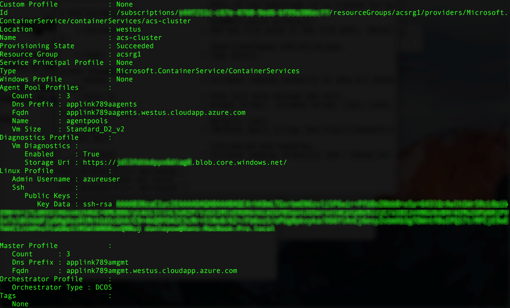

# <a name="deploy-a-docker-container-hosting-solution-using-hello-azure-cli-20"></a>Distribuire un contenitore Docker mediante Azure CLI 2.0 hello soluzione di hosting

Hello utilizzare `az acs` comandi in toocreate hello 2.0 CLI di Azure e gestire i cluster nel servizio contenitore di Azure. È inoltre possibile distribuire un cluster il servizio contenitore di Azure tramite hello [portale di Azure](container-service-deployment.md) o hello API del servizio contenitore di Azure.

Per informazioni su `az acs` comandi, passare hello `-h` comando tooany di parametro. Ad esempio: `az acs create -h`.


## <a name="prerequisites"></a>Prerequisiti
un cluster il servizio contenitore di Azure mediante toocreate hello CLI di Azure 2.0, è necessario:
* Avere un account Azure ([versione di valutazione gratuita](https://azure.microsoft.com/pricing/free-trial/))
* aver installato e configurato hello [CLI di Azure 2.0](/cli/azure/install-az-cli2)

## <a name="get-started"></a>Attività iniziali 
### <a name="log-in-tooyour-account"></a>Accedi tooyour account
```azurecli
az login 
```

Seguire toolog prompt hello in modo interattivo. Per altri metodi toolog in, vedere [Introduzione a Azure CLI 2.0](/cli/azure/get-started-with-az-cli2).

### <a name="set-your-azure-subscription"></a>Configurare la sottoscrizione di Azure

Se si dispone di più di una sottoscrizione di Azure, impostare la sottoscrizione predefinita hello. ad esempio:

```
az account set --subscription "f66xxxxx-xxxx-xxxx-xxx-zgxxxx33cha5"
```


### <a name="create-a-resource-group"></a>Creare un gruppo di risorse
È consigliabile creare un gruppo di risorse per ogni cluster. Specificare un'area di Azure in cui sia [disponibile](https://azure.microsoft.com/en-us/regions/services/) il servizio contenitore di Azure. ad esempio:

```azurecli
az group create -n acsrg1 -l "westus"
```
L'output è simile toohello seguenti:


## <a name="create-an-azure-container-service-cluster"></a>Creare un cluster del servizio contenitore di Azure

Utilizzare un cluster, toocreate `az acs create`.
Un nome per il cluster hello e hello hello del gruppo di risorse creato nel passaggio precedente hello sono parametri obbligatori. 

Gli altri input sono valori toodefault set (vedere la seguente schermata hello) a meno che non sovrascritto con le rispettive opzioni. Ad esempio, orchestrator hello è impostata per operazioni di tooDC predefinita del sistema operativo. E se non si specifica un prefisso del nome DNS viene creato in base a nome del cluster hello.


### <a name="quick-acs-create-using-defaults"></a>Operazione rapida con i valori predefiniti per `acs create`
Se si dispone di un file di chiave pubblica SSH RSA `id_rsa.pub` nel percorso predefinito di hello (o è stato creato uno per [OS X e Linux](../../virtual-machines/linux/mac-create-ssh-keys.md) o [Windows](../../virtual-machines/linux/ssh-from-windows.md)), utilizzare un comando simile hello seguente:

```azurecli
az acs create -n acs-cluster -g acsrg1 -d applink789
```
Se non è disponibile alcuna chiave pubblica SSH, usare il comando seguente. Questo comando con hello `--generate-ssh-keys` viene creato uno automaticamente.

```azurecli
az acs create -n acs-cluster -g acsrg1 -d applink789 --generate-ssh-keys
```

Dopo aver immesso il comando hello, attendere circa 10 minuti per hello cluster toobe creato. output del comando Hello include nomi di dominio completo (FQDN) del master hello e nodi di agente e un master prima SSH comando tooconnect toohello. Ecco un output abbreviato:


> [!TIP]
> Hello [procedura dettagliata Kubernetes](../kubernetes/container-service-kubernetes-walkthrough.md) viene illustrato come toouse `az acs create` con toocreate di valori predefinito un Kubernetes del cluster.
>

## <a name="manage-acs-clusters"></a>Gestire i cluster del servizio contenitore di Azure

Utilizzare aggiuntive `az acs` comandi toomanage del cluster. Di seguito sono riportati alcuni esempi.

### <a name="list-clusters-under-a-subscription"></a>Elencare i cluster in una sottoscrizione

```azurecli
az acs list --output table
```

### <a name="list-clusters-in-a-resource-group"></a>Elencare i cluster in un gruppo di risorse

```azurecli
az acs list -g acsrg1 --output table
```


### <a name="display-details-of-a-container-service-cluster"></a>Visualizzare i dettagli di un cluster del servizio contenitore

```azurecli
az acs show -g acsrg1 -n acs-cluster --output list
```




### <a name="scale-hello-cluster"></a>Cluster hello scala
È consentito sia ridurre che aumentare il numero di istanze dei nodi agente. parametro Hello `new-agent-count` è nuovo numero di agenti in cluster hello ACS di hello.

```azurecli
az acs scale -g acsrg1 -n acs-cluster --new-agent-count 4
```


## <a name="delete-a-container-service-cluster"></a>Eliminare un cluster del servizio contenitore
```azurecli
az acs delete -g acsrg1 -n acs-cluster 
```
Questo comando Elimina tutte le risorse (rete e archiviazione) create durante la creazione del servizio contenitore hello. toodelete tutte le risorse facilmente, è consigliabile implementare ogni cluster in un gruppo di risorse distinto. Eliminare quindi il gruppo di risorse hello quando cluster hello non è più necessario.

## <a name="next-steps"></a>Passaggi successivi
Ora che si ha a disposizione un cluster funzionante, vedere i documenti seguenti per informazioni dettagliate sulla connessione e la gestione:

* [Connettersi tooan cluster del servizio di contenitore di Azure](../container-service-connect.md)
* [Gestione di contenitori tramite l'API REST](container-service-mesos-marathon-rest.md)
* [Gestione dei contenitori con Docker Swarm](container-service-docker-swarm.md)
* [Uso del servizio contenitore di Azure e Kubernetes](../kubernetes/container-service-kubernetes-walkthrough.md)