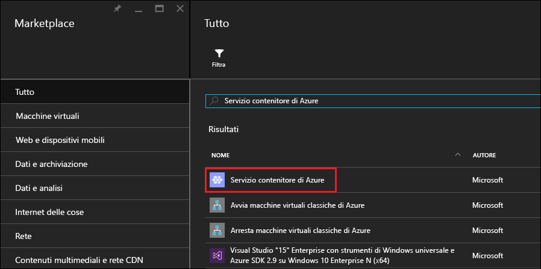
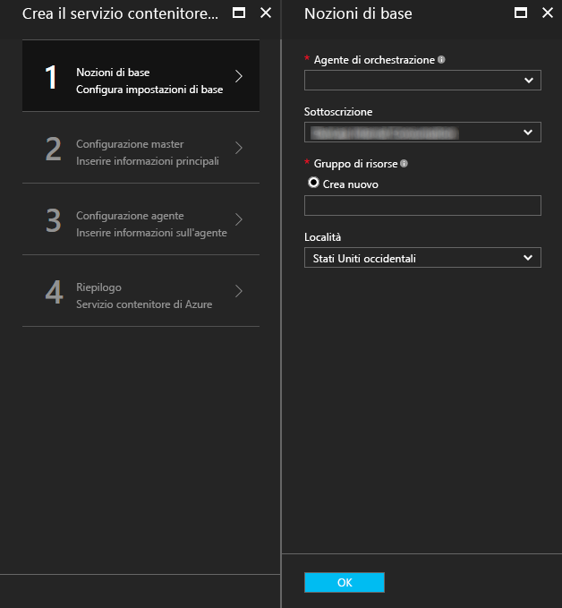
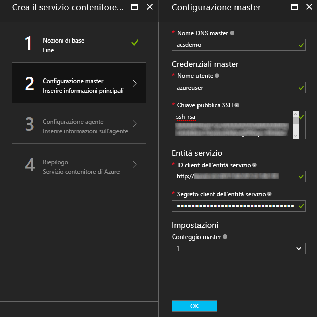
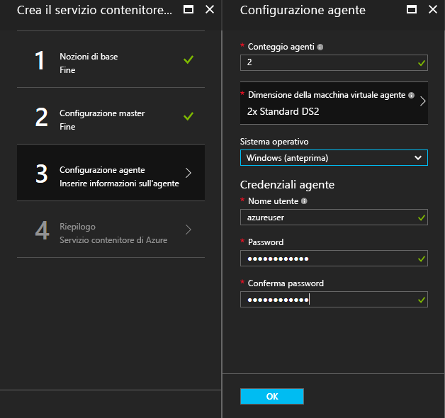
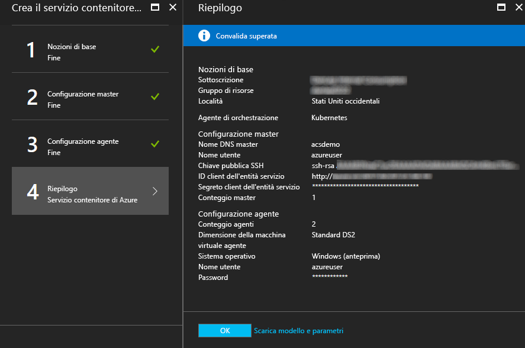
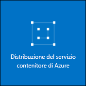

# <a name="deploy-a-docker-container-hosting-solution-using-hello-azure-portal"></a>Distribuire un contenitore Docker usando il portale di Azure hello soluzione di hosting


Il servizio contenitore di Azure consente la distribuzione rapida delle soluzioni open source di clustering e orchestrazione dei contenitori più diffuse. Questo documento illustra la distribuzione di un cluster di servizio di contenitore di Azure tramite hello portale di Azure o un modello di avvio rapido di Azure Resource Manager. 

È inoltre possibile distribuire un cluster il servizio contenitore di Azure tramite hello [CLI di Azure 2.0](container-service-create-acs-cluster-cli.md) o hello API del servizio contenitore di Azure.

Per le informazioni di base, vedere [Introduzione al servizio contenitore di Azure](../container-service-intro.md).


## <a name="prerequisites"></a>Prerequisiti

* **Sottoscrizione di Azure**: nel caso in cui non sia disponibile è possibile usare una [versione di prova gratuita](http://azure.microsoft.com/pricing/free-trial/?WT.mc_id=AA4C1C935). Per cluster di maggiori dimensioni, prendere in considerazione una sottoscrizione con pagamento in base al consumo o altre opzioni di acquisto.

    > [!NOTE]
    > L'utilizzo della sottoscrizione di Azure e [le quote di risorse](../../azure-subscription-service-limits.md), ad esempio le quote di core, limitare l'ambito dimensione hello del cluster di hello si distribuisce. toorequest un aumento della quota, aprire un [richiesta di supporto clienti online](../../azure-supportability/how-to-create-azure-support-request.md) senza alcun costo.
    >

* **Chiave pubblica SSH RSA**: durante la distribuzione tramite il portale di hello o uno dei modelli di avvio rapido di Azure hello, chiave pubblica di tooprovide hello è necessario per l'autenticazione nel servizio contenitore di Azure le macchine virtuali. le chiavi RSA Secure Shell (SSH) toocreate, vedere hello [OS X e Linux](../../virtual-machines/linux/mac-create-ssh-keys.md) o [Windows](../../virtual-machines/linux/ssh-from-windows.md) informazioni aggiuntive. 

* **ID dell'entità client e il segreto del servizio** (solo Kubernetes): per ulteriori informazioni e istruzioni toocreate un'entità servizio di Azure Active Directory, vedere [sulle entità servizio hello per un cluster Kubernetes](../kubernetes/container-service-kubernetes-service-principal.md).


## <a name="create-a-cluster-by-using-hello-azure-portal"></a>Creare un cluster usando hello portale di Azure
1. Accedi toohello portale di Azure selezionare **New**e hello Azure Marketplace per la ricerca **servizio contenitore di Azure**.

      <br />

2. Fare clic su **Azure Container Service** (Servizio contenitore di Azure) e quindi su **Crea**.

3. In hello **nozioni di base** pannello immettere hello le seguenti informazioni:

    * **Orchestrator**: selezionare una delle hello contenitore orchestrators toodeploy nel cluster hello.
        * **DC/OS**: distribuisce un cluster DC/OS.
        * **Swarm**: distribuisce un cluster Docker Swarm.
        * **Kubernetes**: consente di distribuire un cluster Kubernetes.
    * **Sottoscrizione**: selezionare una sottoscrizione di Azure.
    * **Gruppo di risorse**: hello nome di un nuovo gruppo di risorse per la distribuzione di hello.
    * **Percorso**: selezionare un'area di Azure per la distribuzione del servizio di contenitore di Azure hello. Per verificare la disponibilità, vedere [Prodotti disponibili in base all'area](https://azure.microsoft.com/regions/services/).
    
      <br />
    
    Fare clic su **OK** quando si è pronti tooproceed.

4. In hello **Master configurazione** pannello immettere hello seguendo le impostazioni di nodo principale di hello Linux o i nodi cluster hello (alcune impostazioni sono specifiche tooeach orchestrator):

    * **Nome DNS master**: hello prefisso utilizzato toocreate univoco nome dominio completo (FQDN) per master hello. Hello FQDN master è formato hello *prefisso*gestione*percorso*. cloudapp.azure.com.
    * **Nome utente**: nome utente hello per un account in ognuna delle macchine virtuali Linux di hello cluster hello.
    * **Chiave pubblica SSH RSA**: aggiungere hello toobe chiave pubblica utilizzata per l'autenticazione hello le macchine virtuali Linux. È importante che questa chiave non contiene interruzioni di riga e include hello `ssh-rsa` prefisso. Hello `username@domain` suffisso è facoltativo. Hello chiave dovrebbe essere simile alla seguente hello: **AAAAB3Nz ssh-rsa … <>...... UcyupgH azureuser@linuxvm** . 
    * **Entità servizio**: se si seleziona orchestrator Kubernetes hello, immettere una Azure Active Directory **ID client dell'entità servizio** (detto anche appId hello) e **segreto client dell'entità servizio** (password). Per ulteriori informazioni, vedere [sulle entità servizio hello per un cluster Kubernetes](../kubernetes/container-service-kubernetes-service-principal.md).
    * **Master conteggio**: numero di schemi in cluster hello hello.
    * **Diagnostica delle macchine Virtuali**: per alcuni orchestrators, è possibile abilitare la diagnostica di VM su schemi hello.

      <br />

    Fare clic su **OK** quando si è pronti tooproceed.

5. In hello **configurazione agente** pannello immettere hello le seguenti informazioni:

    * **Numero di agenti**: per sciame Docker e Kubernetes, questo valore è numero iniziale di hello degli agenti in set di scalabilità di hello agente. Per i controller di dominio o del sistema operativo, è numero iniziale di hello degli agenti in un set di scalabilità privata. Per DC/OS viene creato anche un set di scalabilità pubblico contenente un numero predeterminato di agenti. Hello numero di agenti in questo set di scalabilità pubblico è determinato dal numero hello di schemi in cluster hello: un agente pubblico per uno schema e due agenti pubblici per tre o cinque schemi.
    * **Dimensioni della macchina virtuale agente**: hello dimensioni delle macchine virtuali di hello agente.
    * **Sistema operativo**: questa impostazione è attualmente disponibile solo se si seleziona orchestrator Kubernetes hello. Scegliere una distribuzione di Linux o un toorun del sistema operativo Windows Server su agenti hello. Questa impostazione determina se il cluster sarà in grado di eseguire applicazioni contenitore Linux o Windows. 

        > [!NOTE]
        > Il supporto dei contenitori Windows è disponibile in anteprima per i cluster Kubernetes. Nei cluster DC/OS e Swarm, al momento sono supportati solo gli agenti Linux nel servizio contenitore di Azure.

    * **Le credenziali dell'agente**: se si seleziona sistema operativo di Windows hello, immettere un amministratore **nome utente** e **Password** per agente hello macchine virtuali. 

      <br />

    Fare clic su **OK** quando si è pronti tooproceed.

6. Al termine della convalida del servizio, fare clic su **OK** .

      <br />

7. Esaminare le condizioni di hello. processo di distribuzione hello toostart, fare clic su **crea**.

    Se si è scelto toopin hello distribuzione toohello portale di Azure, è possibile visualizzare lo stato di distribuzione hello.

      <br />

distribuzione di Hello richiede diversi minuti toocomplete. Quindi, i cluster del servizio di contenitore di Azure hello è pronto per l'utilizzo.


## <a name="create-a-cluster-by-using-a-quickstart-template"></a>Creare un cluster usando un modello di avvio rapido
I modelli di avvio rapido di Azure sono disponibili toodeploy un cluster nel servizio contenitore di Azure. modelli di avvio rapido possono essere modificato tooinclude aggiuntive o avanzate configurazione di Azure Hello. toocreate un cluster il servizio contenitore di Azure utilizzando un modello di avvio rapido di Azure, è necessaria una sottoscrizione di Azure. Se non si ha una sottoscrizione, è possibile iscriversi per ottenere una [versione di prova gratuita](http://azure.microsoft.com/pricing/free-trial/?WT.mc_id=AA4C1C935). 

Seguire questi passaggi toodeploy un cluster utilizzando un modello e hello Azure CLI 2.0 (vedere [istruzioni di installazione e configurazione](/cli/azure/install-az-cli2)).

> [!NOTE] 
> Se si è in un sistema di Windows, è possibile utilizzare un modello usando Azure PowerShell simile passaggi toodeploy. Vedere i passaggi più avanti in questa sezione. È inoltre possibile distribuire un modello tramite hello [portale](../../azure-resource-manager/resource-group-template-deploy-portal.md) o altri metodi.

1. toodeploy un controller di dominio o del sistema operativo, Docker Swarm o Kubernetes cluster, selezionare uno dei modelli di avvio rapido disponibile hello da GitHub. Di seguito viene inserito un elenco parziale. Hello DC/OS e modelli sciame sono hello stesso, ad eccezione di hello orchestrator predefinita.

    * [Modello DC/OS](https://github.com/Azure/azure-quickstart-templates/tree/master/101-acs-dcos)
    * [Modello Swarm](https://github.com/Azure/azure-quickstart-templates/tree/master/101-acs-swarm)
    * [Modello Kubernetes](https://github.com/Azure/azure-quickstart-templates/tree/master/101-acs-kubernetes)

2. Accedi tooyour account Azure (`az login`) e assicurarsi che tale hello CLI di Azure viene connesso tooyour sottoscrizione di Azure. È possibile visualizzare la sottoscrizione predefinita hello utilizzando hello comando seguente:

    ```azurecli
    az account show
    ```
    
    Se si dispone più tooset sottoscrizione ed è necessario un abbonamento predefinite diverse, eseguire `az account set --subscription` e specificare l'ID sottoscrizione hello o nome.

3. Come procedura consigliata, utilizzare un nuovo gruppo di risorse per la distribuzione di hello. toocreate un gruppo di risorse, utilizzare hello `az group create` comando specificare un nome gruppo di risorse e il percorso: 

    ```azurecli
    az group create --name "RESOURCE_GROUP" --location "LOCATION"
    ```

4. Creare un file contenente hello obbligatorio modello JSON parametri. File dei parametri hello download denominato `azuredeploy.parameters.json` che accompagna il modello di servizio di contenitore di Azure hello `azuredeploy.json` in GitHub. Immettere i valori dei parametri necessari per il cluster. 

    Ad esempio, toouse hello [modello DC/OS](https://github.com/Azure/azure-quickstart-templates/tree/master/101-acs-dcos), specificare i valori di parametro per `dnsNamePrefix` e `sshRSAPublicKey`. Visualizzare le descrizioni di hello in `azuredeploy.json` e le opzioni per gli altri parametri.  
 

5. Creare un cluster il servizio contenitore, passando i file dei parametri di distribuzione hello con hello seguente comando, dove:

    * **RESOURCE_GROUP** nome hello hello del gruppo di risorse creato nel passaggio precedente hello.
    * **DEPLOYMENT_NAME** (facoltativo) è un nome con cui toohello distribuzione.
    * **TEMPLATE_URI** hello percorso del file di distribuzione hello `azuredeploy.json`. Deve trattarsi di un URI file non elaborato hello, non un puntatore toohello UI GitHub. toofind questo URI, seleziona hello `azuredeploy.json` file in GitHub e fare clic su hello **Raw** pulsante.  

    ```azurecli
    az group deployment create -g RESOURCE_GROUP -n DEPLOYMENT_NAME --template-uri TEMPLATE_URI --parameters @azuredeploy.parameters.json
    ```

    È anche possibile fornire parametri sotto forma di stringa in formato JSON nella riga di comando hello. Utilizzare una comando simile toohello che segue:

    ```azurecli
    az group deployment create -g RESOURCE_GROUP -n DEPLOYMENT_NAME --template-uri TEMPLATE_URI --parameters "{ \"param1\": {\"value1\"} … }"
    ```

    > [!NOTE]
    > distribuzione di Hello richiede diversi minuti toocomplete.
    > 

### <a name="equivalent-powershell-commands"></a>Comandi di PowerShell equivalenti
È anche possibile distribuire un modello di cluster del servizio contenitore di Azure con PowerShell. Questo documento si basa sulla versione di hello 1.0 [modulo Azure PowerShell](https://azure.microsoft.com/blog/azps-1-0/).

1. toodeploy un controller di dominio o del sistema operativo, Docker Swarm o Kubernetes cluster, selezionare uno dei modelli di avvio rapido disponibile hello da GitHub. Di seguito viene inserito un elenco parziale. Si noti che hello DC/OS e modelli sciame sono hello stesso, con l'eccezione hello di hello orchestrator predefinita.

    * [Modello DC/OS](https://github.com/Azure/azure-quickstart-templates/tree/master/101-acs-dcos)
    * [Modello Swarm](https://github.com/Azure/azure-quickstart-templates/tree/master/101-acs-swarm)
    * [Modello Kubernetes](https://github.com/Azure/azure-quickstart-templates/tree/master/101-acs-kubernetes)

2. Prima di creare un cluster nella sottoscrizione di Azure, verificare che la sessione di PowerShell è stata firmata in tooAzure. È possibile farlo con hello `Get-AzureRMSubscription` comando:

    ```powershell
    Get-AzureRmSubscription
    ```

3. Se è necessario toosign in tooAzure, utilizzare hello `Login-AzureRMAccount` comando:

    ```powershell
    Login-AzureRmAccount
    ```

4. Come procedura consigliata, utilizzare un nuovo gruppo di risorse per la distribuzione di hello. toocreate un gruppo di risorse, utilizzare hello `New-AzureRmResourceGroup` comandi e specificare un'area del nome e la destinazione gruppo risorse:

    ```powershell
    New-AzureRmResourceGroup -Name GROUP_NAME -Location REGION
    ```

5. Dopo aver creato un gruppo di risorse, è possibile creare il cluster con hello comando seguente. URI di hello Hello desiderato è specificato un modello con hello `-TemplateUri` parametro. Quando si esegue questo comando, PowerShell richiede i valori dei parametri di distribuzione.

    ```powershell
    New-AzureRmResourceGroupDeployment -Name DEPLOYMENT_NAME -ResourceGroupName RESOURCE_GROUP_NAME -TemplateUri TEMPLATE_URI
    ```

#### <a name="provide-template-parameters"></a>Fornire i parametri del modello
Se si ha familiarità con PowerShell, significa che è possibile scorrere tra i parametri disponibili per un cmdlet hello digitando un segno meno (-) e quindi premere tasto TAB hello. Questa stessa funzionalità può essere usata anche con i parametri definiti nel modello. Non appena si digita il nome di modello hello, hello cmdlet recupera modello hello analizza parametri hello e aggiunge comando toohello parametri di modello hello in modo dinamico. In questo modo i valori dei parametri modello hello toospecify semplice. E, se si dimentica di un valore di parametro obbligatorio, PowerShell richiede il valore di hello.

Ecco comando completo hello, con i parametri inclusi. Fornire i valori per i nomi di hello delle risorse di hello.

```powershell
New-AzureRmResourceGroupDeployment -ResourceGroupName RESOURCE_GROUP_NAME-TemplateURI TEMPLATE_URI -adminuser value1 -adminpassword value2 ....
```

## <a name="next-steps"></a>Passaggi successivi
Ora che si ha a disposizione un cluster funzionante, vedere i documenti seguenti per informazioni dettagliate sulla connessione e la gestione:

* [Connettersi tooan cluster del servizio di contenitore di Azure](../container-service-connect.md)
* [Gestione di contenitori tramite l'API REST](container-service-mesos-marathon-rest.md)
* [Gestione dei contenitori con Docker Swarm](container-service-docker-swarm.md)
* [Uso del servizio contenitore di Azure e Kubernetes](../kubernetes/container-service-kubernetes-walkthrough.md)
