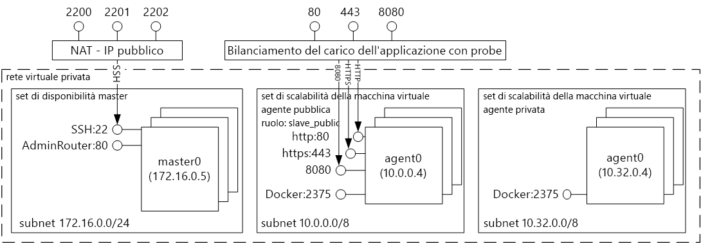
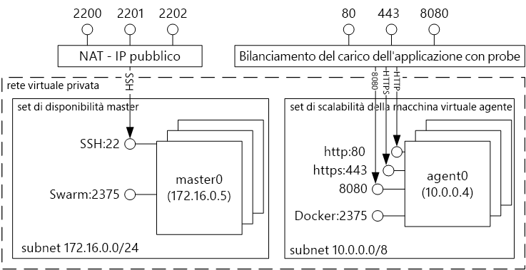
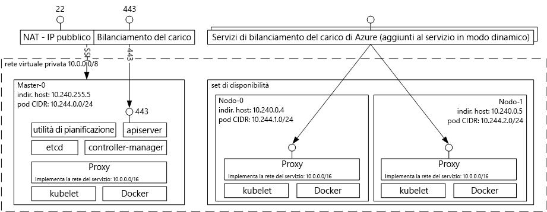

# Introduzione tooDocker contenitore soluzioni con il servizio contenitore di Azure 
Il servizio contenitore di Azure, è più semplice per l'utente toocreate, configurare e gestire un cluster di macchine virtuali che sono preconfigurati toorun contenitore applicazioni. Usa una configurazione ottimizzata di strumenti di pianificazione e orchestrazione open source comuni. Questo consente di toouse le competenze esistenti, o disegnare su un corpo di grandi dimensioni e in continua crescito di esperienza della community, toodeploy e gestire le applicazioni basate sul contenitore in Microsoft Azure.

Il servizio contenitore Azure sfrutta tooensure formato contenitore Docker di hello che i contenitori di applicazioni siano completamente portabili. Supporta inoltre la scelta di maratona e controller di dominio o del sistema operativo, Docker Swarm o Kubernetes in modo da poter ridimensionare toothousands queste applicazioni di contenitori o persino decine di migliaia.

Tramite il servizio contenitore di Azure, è possibile sfruttare le funzionalità di livello aziendale di Azure, mantenendo al tempo stesso la portabilità dell'applicazione, tra cui portabilità in livelli di orchestrazione hello.

## Utilizzo del servizio contenitore di Azure
L'obiettivo di Microsoft con il servizio contenitore di Azure è tooprovide un ambiente host del contenitore tramite strumenti open source e tecnologie che sono comuni tra i clienti oggi. toothis fine, è necessario esporre gli endpoint dell'API standard hello per le scelte orchestrator (controller di dominio o del sistema operativo, Docker Swarm o Kubernetes). Tramite questi endpoint, è possibile utilizzare qualsiasi software che è in grado di comunicare con gli endpoint toothose. Ad esempio, nel caso di hello di endpoint di Docker Swarm hello, è possibile scegliere l'interfaccia della riga di comando toouse hello Docker (CLI). Per i controller di dominio o del sistema operativo, è possibile scegliere hello DCOS CLI. Per Kubernetes, è possibile scegliere `kubectl`.

## Creazione di un cluster Docker con il servizio contenitore di Azure
toobegin mediante il servizio contenitore di Azure, si distribuisce un cluster il servizio contenitore di Azure tramite il portale di hello (hello ricerca Marketplace per **servizio contenitore di Azure**), utilizzando un modello di gestione risorse di Azure ([Docker Swarm](https://github.com/Azure/azure-quickstart-templates/tree/master/101-acs-swarm), [DC/OS](https://github.com/Azure/azure-quickstart-templates/tree/master/101-acs-dcos), o [Kubernetes](https://github.com/Azure/azure-quickstart-templates/tree/master/101-acs-kubernetes)), o con hello [CLI di Azure 2.0](container-service-create-acs-cluster-cli.md). modelli di avvio rapido possono essere modificato tooinclude aggiuntive o avanzate configurazione di Azure Hello. Per altre informazioni, vedere [Distribuire un cluster del servizio contenitore di Azure](container-service-deployment.md).

## Distribuzione di un'applicazione
Il servizio contenitore di Azure consente di scegliere tra Docker Swarm, DC/OS o Kubernetes per l'orchestrazione. La modalità di distribuzione dell'applicazione dipende dall'agente di orchestrazione scelto.

### Uso di DC/OS
Controller di dominio o sistema operativo è un sistema operativo distribuito basato sul kernel di sistemi distribuiti Apache Mesos hello. Apache Mesos si trova in hello Apache Software Foundation e vengono elencate alcune delle hello [protagonisti in IT](http://mesos.apache.org/documentation/latest/powered-by-mesos/) come utenti e collaboratori.

DC/OS e Apache Mesos offrono un set di funzionalità molto ampio:

* Scalabilità collaudata
* Schemi replicati a tolleranza di errore e slave con Apache ZooKeeper
* Supporto per i contenitori formattati Docker
* Isolamento nativo tra le attività con i contenitori Linux
* Pianificazione di più risorse (memoria, CPU, disco e porte)
* Java, Python e API C++ per lo sviluppo di nuove applicazioni parallele
* Interfaccia utente Web per la visualizzazione dello stato del cluster

Per impostazione predefinita, controller di dominio o sistema operativo in esecuzione nel servizio contenitore di Azure include una piattaforma di orchestrazione hello maratona per la pianificazione di carichi di lavoro. Tuttavia, in hello DC/distribuzione del sistema operativo del servizio ACS è incluso hello Mesosphere universo di servizi che possono essere aggiunti tooyour servizio. Servizi in hello universo includono Spark, Hadoop, Cassandra e molto altro ancora.

#### Uso di Marathon
Maratona è un init cluster a livello di sistema e controllo per i servizi in cgroups - o, in caso di hello contenitore del servizio di Azure, i contenitori di Docker in formato. Marathon offre un'interfaccia utente Web da cui è possibile distribuire le applicazioni. L'accesso avviene tramite un URL simile a `http://DNS_PREFIX.REGION.cloudapp.azure.com`, dove DNS\_PREFIX e REGION vengono definiti in fase di distribuzione. Naturalmente, è anche possibile fornire il proprio nome DNS. Per ulteriori informazioni sull'esecuzione di un contenitore utilizzando l'interfaccia utente web maratona di hello, vedere [gestione dei contenitori di controller di dominio o del sistema operativo tramite l'interfaccia utente web di maratona hello](container-service-mesos-marathon-ui.md).

Inoltre, è possibile utilizzare hello API REST per la comunicazione con maratona. Esistono una serie di librerie client disponibili per ogni strumento. Coprono un'ampia gamma di linguaggi, e, naturalmente, è possibile utilizzare il protocollo HTTP hello in qualsiasi linguaggio. Inoltre, molti strumenti comuni di DevOps forniscono il supporto per Marathon. Ciò fornisce flessibilità massima per il team operativo quando si lavora con un cluster del servizio contenitore di Azure. Per ulteriori informazioni sull'esecuzione di un contenitore utilizzando l'API REST maratona hello, vedere [gestione dei contenitori di controller di dominio o del sistema operativo tramite l'API REST maratona hello](container-service-mesos-marathon-rest.md).

### Utilizzo di Docker Swarm
Docker Swarm fornisce clustering nativo per Docker. Poiché Docker Swarm serve hello standard API di Docker, qualsiasi strumento che già comunica con un daemon di Docker è possibile usare gli host di toomultiple sciame tootransparently scala sul servizio contenitore di Azure.

[!INCLUDE [container-service-swarm-mode-note](../../../includes/container-service-swarm-mode-note.md)]

Strumenti supportati per la gestione dei contenitori in un cluster sciame includono, ma non sono limitati a, seguente hello:

* Dokku
* Docker CLI e Docker Compose
* Krane
* Jenkins

### Uso di Kubernetes
Kubernetes è un diffuso strumento open source di livello di produzione per l'orchestrazione di contenitori. Kubernetes automatizza la distribuzione, il ridimensionamento e la gestione delle applicazioni nei contenitori. Poiché è una soluzione open source e dipende dalla community open source hello, in base a cui viene eseguito senza problemi nel servizio contenitore di Azure e può essere utilizzato toodeploy contenitori su larga scala nel servizio contenitore di Azure.

Dispone di un set completo di funzionalità tra cui:
* Scalabilità orizzontale
* Bilanciamento del carico e rilevamento del servizio
* Gestione della configurazione e segreti
* Implementazioni e ripristini automatizzati basati sull'API
* Riparazione automatica

## Video
Introduzione al servizio contenitore di Azure (101):  

> [!VIDEO https://channel9.msdn.com/Shows/Azure-Friday/Azure-Container-Service-101/player]
>
>

Hello applicazioni utilizzando creazione servizio contenitore di Azure (compilazione 2016)

> [!VIDEO https://channel9.msdn.com/Events/Build/2016/B822/player]
>
>

## Passaggi successivi

Distribuire un cluster di servizio di contenitore mediante hello [portale](container-service-deployment.md) o [CLI di Azure 2.0](container-service-create-acs-cluster-cli.md).
