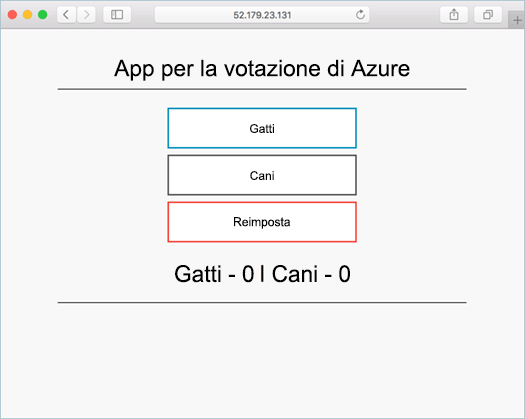

# <a name="deploy-docker-swarm-cluster"></a><span data-ttu-id="f1056-103">Distribuire un cluster Docker Swarm</span><span class="sxs-lookup"><span data-stu-id="f1056-103">Deploy Docker Swarm cluster</span></span>

<span data-ttu-id="f1056-104">In questa Guida introduttiva viene distribuito un cluster di Docker Swarm utilizzando hello CLI di Azure.</span><span class="sxs-lookup"><span data-stu-id="f1056-104">In this quick start, a Docker Swarm cluster is deployed using hello Azure CLI.</span></span> <span data-ttu-id="f1056-105">Un'applicazione multi-contenitore composta da front-end web e un'istanza di Redis viene quindi distribuita e in esecuzione nel cluster hello.</span><span class="sxs-lookup"><span data-stu-id="f1056-105">A multi-container application consisting of web front end and a Redis instance is then deployed and run on hello cluster.</span></span> <span data-ttu-id="f1056-106">Una volta completato, un'applicazione hello è accessibile tramite internet hello.</span><span class="sxs-lookup"><span data-stu-id="f1056-106">Once completed, hello application is accessible over hello internet.</span></span>

<span data-ttu-id="f1056-107">Se non si ha una sottoscrizione di Azure, creare un [account gratuito](https://azure.microsoft.com/free/?WT.mc_id=A261C142F) prima di iniziare.</span><span class="sxs-lookup"><span data-stu-id="f1056-107">If you don't have an Azure subscription, create a [free account](https://azure.microsoft.com/free/?WT.mc_id=A261C142F) before you begin.</span></span>

<span data-ttu-id="f1056-108">Questa Guida rapida richiede che sia in esecuzione hello Azure CLI versione 2.0.4 o versioni successive.</span><span class="sxs-lookup"><span data-stu-id="f1056-108">This quickstart requires that you are running hello Azure CLI version 2.0.4 or later.</span></span> <span data-ttu-id="f1056-109">Eseguire `az --version` versione hello toofind.</span><span class="sxs-lookup"><span data-stu-id="f1056-109">Run `az --version` toofind hello version.</span></span> <span data-ttu-id="f1056-110">Se è necessario tooinstall o l'aggiornamento, vedere [installare Azure CLI 2.0]( /cli/azure/install-azure-cli).</span><span class="sxs-lookup"><span data-stu-id="f1056-110">If you need tooinstall or upgrade, see [Install Azure CLI 2.0]( /cli/azure/install-azure-cli).</span></span>

## <a name="create-a-resource-group"></a><span data-ttu-id="f1056-111">Creare un gruppo di risorse</span><span class="sxs-lookup"><span data-stu-id="f1056-111">Create a resource group</span></span>

<span data-ttu-id="f1056-112">Creare un gruppo di risorse con hello [gruppo az creare](/cli/azure/group#create) comando.</span><span class="sxs-lookup"><span data-stu-id="f1056-112">Create a resource group with hello [az group create](/cli/azure/group#create) command.</span></span> <span data-ttu-id="f1056-113">Un gruppo di risorse di Azure è un gruppo logico in cui le risorse di Azure vengono distribuite e gestite.</span><span class="sxs-lookup"><span data-stu-id="f1056-113">An Azure resource group is a logical group in which Azure resources are deployed and managed.</span></span>

<span data-ttu-id="f1056-114">esempio Hello crea un gruppo di risorse denominato *myResourceGroup* in hello *westus* percorso.</span><span class="sxs-lookup"><span data-stu-id="f1056-114">hello following example creates a resource group named *myResourceGroup* in hello *westus* location.</span></span>

```azurecli-interactive
az group create --name myResourceGroup --location westus
```

<span data-ttu-id="f1056-115">Output:</span><span class="sxs-lookup"><span data-stu-id="f1056-115">Output:</span></span>

```json
{
  "id": "/subscriptions/00000000-0000-0000-0000-000000000000/resourceGroups/myResourceGroup",
  "location": "westcentralus",
  "managedBy": null,
  "name": "myResourceGroup",
  "properties": {
    "provisioningState": "Succeeded"
  },
  "tags": null
}
```

## <a name="create-docker-swarm-cluster"></a><span data-ttu-id="f1056-116">Creare un cluster Docker Swarm</span><span class="sxs-lookup"><span data-stu-id="f1056-116">Create Docker Swarm cluster</span></span>

<span data-ttu-id="f1056-117">Creare un cluster di Docker Swarm contenitore nel servizio di Azure con hello [az acs creare](/cli/azure/acs#create) comando.</span><span class="sxs-lookup"><span data-stu-id="f1056-117">Create a Docker Swarm cluster in Azure Container Service with hello [az acs create](/cli/azure/acs#create) command.</span></span> 

<span data-ttu-id="f1056-118">esempio Hello crea un cluster denominato *mySwarmCluster* con uno Linux master nodo e i tre nodi di agente di Linux.</span><span class="sxs-lookup"><span data-stu-id="f1056-118">hello following example creates a cluster named *mySwarmCluster* with one Linux master node and three Linux agent nodes.</span></span>

```azurecli-interactive
az acs create --name mySwarmCluster --orchestrator-type Swarm --resource-group myResourceGroup --generate-ssh-keys
```

<span data-ttu-id="f1056-119">Dopo alcuni minuti, il comando hello completa e restituisce informazioni in formato json sul cluster di hello.</span><span class="sxs-lookup"><span data-stu-id="f1056-119">After several minutes, hello command completes and returns json formatted information about hello cluster.</span></span>

## <a name="connect-toohello-cluster"></a><span data-ttu-id="f1056-120">Connettere il cluster toohello</span><span class="sxs-lookup"><span data-stu-id="f1056-120">Connect toohello cluster</span></span>

<span data-ttu-id="f1056-121">In tutta questa Guida introduttiva, è necessario l'indirizzo IP di hello del master Docker Swarm hello e pool di agenti di hello Docker.</span><span class="sxs-lookup"><span data-stu-id="f1056-121">Throughout this quick start, you need hello IP address of both hello Docker Swarm master and hello Docker agent pool.</span></span> <span data-ttu-id="f1056-122">Comando che segue hello esecuzione tooreturn entrambi gli indirizzi IP.</span><span class="sxs-lookup"><span data-stu-id="f1056-122">Run hello following command tooreturn both IP addresses.</span></span>


```bash
az network public-ip list --resource-group myResourceGroup --query '[*].{Name:name,IPAddress:ipAddress}' -o table
```

<span data-ttu-id="f1056-123">Output:</span><span class="sxs-lookup"><span data-stu-id="f1056-123">Output:</span></span>

```bash
Name                                                                 IPAddress
-------------------------------------------------------------------  -------------
swarmm-agent-ip-myswarmcluster-myresourcegroup-d5b9d4agent-66066781  52.179.23.131
swarmm-master-ip-myswarmcluster-myresourcegroup-d5b9d4mgmt-66066781  52.141.37.199
```

<span data-ttu-id="f1056-124">Creare un SSH master sciame toohello di tunnel.</span><span class="sxs-lookup"><span data-stu-id="f1056-124">Create an SSH tunnel toohello Swarm master.</span></span> <span data-ttu-id="f1056-125">Sostituire `IPAddress` con indirizzo IP hello master sciame hello.</span><span class="sxs-lookup"><span data-stu-id="f1056-125">Replace `IPAddress` with hello IP address of hello Swarm master.</span></span>

```bash
ssh -p 2200 -fNL 2375:localhost:2375 azureuser@IPAddress
```

<span data-ttu-id="f1056-126">Set hello `DOCKER_HOST` variabile di ambiente.</span><span class="sxs-lookup"><span data-stu-id="f1056-126">Set hello `DOCKER_HOST` environment variable.</span></span> <span data-ttu-id="f1056-127">Ciò consente di comandi di docker toorun su Docker Swarm hello senza nome hello toospecify dell'host hello.</span><span class="sxs-lookup"><span data-stu-id="f1056-127">This allows you toorun docker commands against hello Docker Swarm without having toospecify hello name of hello host.</span></span>

```bash
export DOCKER_HOST=:2375
```

<span data-ttu-id="f1056-128">Sono ora pronti toorun Docker servizi hello Docker Swarm.</span><span class="sxs-lookup"><span data-stu-id="f1056-128">You are now ready toorun Docker services on hello Docker Swarm.</span></span>


## <a name="run-hello-application"></a><span data-ttu-id="f1056-129">Eseguire un'applicazione hello</span><span class="sxs-lookup"><span data-stu-id="f1056-129">Run hello application</span></span>

<span data-ttu-id="f1056-130">Creare un file denominato `docker-compose.yaml` e hello copia seguendo il contenuto al suo interno.</span><span class="sxs-lookup"><span data-stu-id="f1056-130">Create a file named `docker-compose.yaml` and copy hello following content into it.</span></span>

```yaml
version: '3'
services:
  azure-vote-back:
    image: redis
    container_name: azure-vote-back
    ports:
        - "6379:6379"

  azure-vote-front:
    image: microsoft/azure-vote-front:redis-v1
    container_name: azure-vote-front
    environment:
      REDIS: azure-vote-back
    ports:
        - "80:80"
```

<span data-ttu-id="f1056-131">Eseguire hello comando toocreate hello Azure voto servizio.</span><span class="sxs-lookup"><span data-stu-id="f1056-131">Run hello following command toocreate hello Azure Vote service.</span></span>

```bash
docker-compose up -d
```

<span data-ttu-id="f1056-132">Output:</span><span class="sxs-lookup"><span data-stu-id="f1056-132">Output:</span></span>

```bash
Creating network "user_default" with hello default driver
Pulling azure-vote-front (microsoft/azure-vote-front:redis-v1)...
swarm-agent-EE873B23000005: Pulling microsoft/azure-vote-front:redis-v1...
swarm-agent-EE873B23000004: Pulling microsoft/azure-vote-front:redis-v1... : downloaded
Pulling azure-vote-back (redis:latest)...
swarm-agent-EE873B23000004: Pulling redis:latest... : downloaded
Creating azure-vote-front ... 
Creating azure-vote-back ... 
Creating azure-vote-front
Creating azure-vote-back ...
```

## <a name="test-hello-application"></a><span data-ttu-id="f1056-133">Testare l'applicazione hello</span><span class="sxs-lookup"><span data-stu-id="f1056-133">Test hello application</span></span>

<span data-ttu-id="f1056-134">Individuare l'indirizzo IP toohello del hello sciame agente pool tootest all'applicazione Azure voto hello.</span><span class="sxs-lookup"><span data-stu-id="f1056-134">Browse toohello IP address of hello Swarm agent pool tootest out hello Azure Vote application.</span></span>



## <a name="delete-cluster"></a><span data-ttu-id="f1056-136">Eliminare il cluster</span><span class="sxs-lookup"><span data-stu-id="f1056-136">Delete cluster</span></span>
<span data-ttu-id="f1056-137">Quando il cluster hello non è più necessario, è possibile utilizzare hello [eliminazione gruppo az](/cli/azure/group#delete) comandi gruppo di risorse hello tooremove, il servizio contenitore e tutte le relative risorse.</span><span class="sxs-lookup"><span data-stu-id="f1056-137">When hello cluster is no longer needed, you can use hello [az group delete](/cli/azure/group#delete) command tooremove hello resource group, container service, and all related resources.</span></span>

```azurecli-interactive
az group delete --name myResourceGroup --yes --no-wait
```

## <a name="get-hello-code"></a><span data-ttu-id="f1056-138">Ottenere il codice hello</span><span class="sxs-lookup"><span data-stu-id="f1056-138">Get hello code</span></span>

<span data-ttu-id="f1056-139">In questa Guida introduttiva, le immagini contenitore creato in precedenza sono stati utilizzati toocreate un servizio Docker.</span><span class="sxs-lookup"><span data-stu-id="f1056-139">In this quick start, pre-created container images have been used toocreate a Docker service.</span></span> <span data-ttu-id="f1056-140">Hello correlati codice dell'applicazione, Dockerfile e Scrivi file sono disponibili su GitHub.</span><span class="sxs-lookup"><span data-stu-id="f1056-140">hello related application code, Dockerfile, and Compose file are available on GitHub.</span></span>

[<span data-ttu-id="f1056-141">https://github.com/Azure-Samples/azure-voting-app-redis</span><span class="sxs-lookup"><span data-stu-id="f1056-141">https://github.com/Azure-Samples/azure-voting-app-redis</span></span>](https://github.com/Azure-Samples/azure-voting-app-redis.git)

## <a name="next-steps"></a><span data-ttu-id="f1056-142">Passaggi successivi</span><span class="sxs-lookup"><span data-stu-id="f1056-142">Next steps</span></span>

<span data-ttu-id="f1056-143">In questa Guida introduttiva è distribuito un cluster di Docker Swarm e distribuito un tooit applicazione multi-contenitore.</span><span class="sxs-lookup"><span data-stu-id="f1056-143">In this quick start, you deployed a Docker Swarm cluster and deployed a multi-container application tooit.</span></span>

<span data-ttu-id="f1056-144">toolearn sull'integrazione di Docker warm con Visual Studio Team Services, continuare toohello CI/CD con Docker Swarm e Visual Studio Team Services.</span><span class="sxs-lookup"><span data-stu-id="f1056-144">toolearn about integrating Docker warm with Visual Studio Team Services, continue toohello CI/CD with Docker Swarm and VSTS.</span></span>

> [!div class="nextstepaction"]
> [<span data-ttu-id="f1056-145">Integrazione continua e distribuzione continua con Docker Swarm e VSTS</span><span class="sxs-lookup"><span data-stu-id="f1056-145">CI/CD with Docker Swarm and VSTS</span></span>](./container-service-docker-swarm-setup-ci-cd.md)