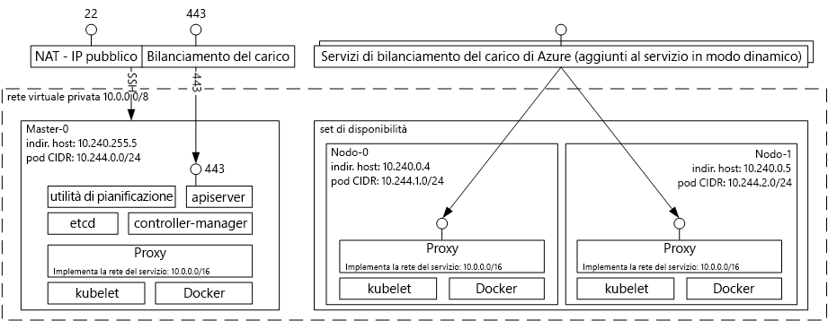

# Introduzione al servizio contenitore di Azure per KubernetesIntroduction to Azure Container Service for Kubernetes
Il servizio contenitore di Azure per Kubernetes semplifica la creazione, la configurazione e la gestione di un cluster di macchine virtuali preconfigurate per eseguire le applicazioni nei contenitori.Azure Container Service for Kubernetes makes it simple to create, configure, and manage a cluster of virtual machines that are preconfigured to run containerized applications. Ciò consente di usare le competenze già acquisite o di attingere da un consistente e crescente bagaglio di competenze a livello di community per distribuire e gestire applicazioni basate sul contenitore in Microsoft Azure.This enables you to use your existing skills, or draw upon a large and growing body of community expertise, to deploy and manage container-based applications on Microsoft Azure.

Il servizio contenitore di Azure consente di sfruttare i vantaggi delle funzionalità di livello aziendale di Azure mantenendo al tempo stesso la portabilità delle applicazioni tramite Kubernetes e il formato immagine Docker.By using Azure Container Service, you can take advantage of the enterprise-grade features of Azure, while still maintaining application portability through Kubernetes and the Docker image format.

## Uso del servizio contenitore di Azure per KubernetesUsing Azure Container Service for Kubernetes
L'obiettivo del servizio contenitore di Azure è fornire un ambiente host contenitore tramite tecnologie e strumenti open source, che sono attualmente diffusi fra i nostri clienti.Our goal with Azure Container Service is to provide a container hosting environment by using open-source tools and technologies that are popular among our customers today. A questo scopo vengono esposti gli endpoint API di Kubernetes standard.To this end, we expose the standard Kubernetes API endpoints. Usando questi endpoint standard è possibile usare qualsiasi software riesca a comunicare con un cluster Kubernetes.By using these standard endpoints, you can leverage any software that is capable of talking to a Kubernetes cluster. È ad esempio possibile scegliere [kubectl](https://kubernetes.io/docs/user-guide/kubectl-overview/), [helm](https://helm.sh/) o [draft](https://github.com/Azure/draft).For example, you might choose [kubectl](https://kubernetes.io/docs/user-guide/kubectl-overview/), [helm](https://helm.sh/), or [draft](https://github.com/Azure/draft).

## Creazione di un cluster Kubernetes con il servizio contenitore di AzureCreating a Kubernetes cluster using Azure Container Service
Per iniziare a usare il servizio contenitore di Azure, distribuire un cluster del servizio contenitore di Azure con l'[interfaccia della riga di comando di Azure 2.0](container-service-kubernetes-walkthrough.md) o tramite il portale (cercare **Servizio contenitore di Azure** nel Marketplace).To begin using Azure Container Service, deploy an Azure Container Service cluster with the [Azure CLI 2.0](container-service-kubernetes-walkthrough.md) or via the portal (search the Marketplace for **Azure Container Service**). Gli utenti avanzati che hanno bisogno di un maggiore controllo sui modelli di Azure Resource Manager possono usare il progetto open source [acs-engine](https://github.com/Azure/acs-engine) per compilare un cluster Kubernetes personalizzato e distribuirlo tramite l'interfaccia della riga di comando `az`.If you are an advanced user who needs more control over the Azure Resource Manager templates, you can use the open source [acs-engine](https://github.com/Azure/acs-engine) project to build your own custom Kubernetes cluster and deploy it via the `az` CLI.

### Uso di KubernetesUsing Kubernetes
Kubernetes automatizza la distribuzione, il ridimensionamento e la gestione delle applicazioni nei contenitori.Kubernetes automates deployment, scaling, and management of containerized applications. Dispone di un set completo di funzionalità tra cui:It has a rich set of features including:
* Bin packing automaticoAutomatic binpacking
* Riparazione automaticaSelf-healing
* Scalabilità orizzontaleHorizontal scaling
* Bilanciamento del carico e rilevamento del servizioService discovery and load balancing
* Implementazioni e ripristini dello stato precedente automatizzatiAutomated rollouts and rollbacks
* Gestione della configurazione e dei segretiSecret and configuration management
* Orchestrazione dell'archiviazioneStorage orchestration
* Esecuzione batchBatch execution

Diagramma dell'architettura di Kubernetes distribuito tramite il servizio contenitore di Azure:Architectural diagram of Kubernetes deployed via Azure Container Service:

## VideoVideos

Il supporto per Kubernetes nei servizi contenitore di Azure (Azure Friday, gennaio 2017):Kubernetes Support in Azure Container Services (Azure Friday, January 2017):

> [!VIDEO https://channel9.msdn.com/Shows/Azure-Friday/Kubernetes-Support-in-Azure-Container-Services/player]
>
>

Strumenti per lo sviluppo e la distribuzione di applicazioni in Kubernetes (Azure OpenDev, giugno 2017):Tools for Developing and Deploying Applications on Kubernetes (Azure OpenDev, June 2017):

> [!VIDEO https://channel9.msdn.com/Events/AzureOpenDev/June2017/Tools-for-Developing-and-Deploying-Applications-on-Kubernetes/player]
>
>

## Passaggi successiviNext steps

Vedere la [guida introduttiva a Kubernetes](container-service-kubernetes-walkthrough.md) per iniziare a conoscere oggi stesso il servizio contenitore di Azure.Explore the [Kubernetes Quickstart](container-service-kubernetes-walkthrough.md) to begin exploring Azure Container Service today.