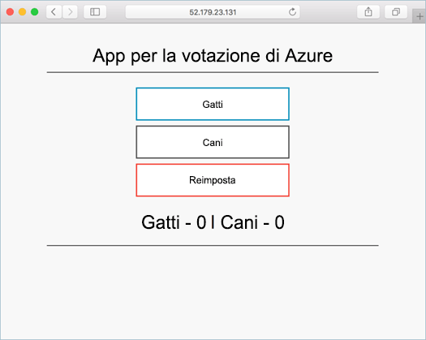

# <a name="run-applications-in-kubernetes"></a>Eseguire applicazioni in Kubernetes

In questa esercitazione, parte quattro di sette, verrà distribuita un'applicazione di esempio in un cluster Kubernetes. I passaggi completati comprendono:

> [!div class="checklist"]
> * Scaricare i file manifesto Kubernetes
> * Eseguire un'applicazione in Kubernetes
> * Testare l'applicazione hello

Nelle esercitazioni successive, questa applicazione viene ampliata, aggiornato, e Operations Management Suite sono configurati cluster di Kubernetes toomonitor hello.

In questa esercitazione si presuppone una conoscenza di base dei concetti Kubernetes, per informazioni dettagliate sul Kubernetes vedere hello [Kubernetes documentazione](https://kubernetes.io/docs/home/).

## <a name="before-you-begin"></a>Prima di iniziare

Nelle esercitazioni precedenti, un'applicazione è stata distribuita in un'immagine contenitore, questa immagine è stato caricato tooAzure contenitore del Registro di sistema e un cluster Kubernetes è stato creato. Se si è già questi passaggi e si desidera toofollow lungo, restituire troppo[esercitazione 1: creare le immagini contenitore](./container-service-tutorial-kubernetes-prepare-app.md). 

Il requisito minimo per questa esercitazione è un cluster Kubernetes.

## <a name="get-manifest-file"></a>Ottenere il file manifesto

Per questa esercitazione, gli [oggetti Kubernetes](https://kubernetes.io/docs/concepts/overview/working-with-objects/kubernetes-objects/) vengono distribuiti con un manifesto Kubernetes. Un manifesto Kubernetes è un file in formato YAML o JSON contenente le istruzioni sulla distribuzione e la configurazione degli oggetti.

file di manifesto dell'applicazione Hello per questa esercitazione è disponibile nel repository di applicazione di hello voto di Azure, è stato clonato in un'esercitazione precedente. Se non è già stato fatto, è possibile clonare il repository di hello con hello comando seguente: 

```bash
git clone https://github.com/Azure-Samples/azure-voting-app-redis.git
```

file manifesto di Hello si trova nella seguente directory di repository clonato hello hello.

```bash
/azure-voting-app-redis/kubernetes-manifests/azure-vote-all-in-one-redis.yml
```

## <a name="update-manifest-file"></a>Aggiornare il file manifesto

Se si usa le immagini contenitore di Azure del Registro di sistema contenitore toostore hello, hello toobe esigenze manifesto aggiornato con hello ACR loginServer nome.

Ottenere il nome del server accesso ACR hello con hello [elenco acr az](/cli/azure/acr#list) comando.

```azurecli-interactive
az acr list --resource-group myResourceGroup --query "[].{acrLoginServer:loginServer}" --output table
```

Hello esempio manifesto è stato creato in precedenza con un nome di repository di *microsoft*. Aprire il file hello con qualsiasi editor di testo e sostituire hello *microsoft* valore con il nome di server hello account di accesso dell'istanza del record.

```yaml
containers:
- name: azure-vote-front
  image: microsoft/azure-vote-front:redis-v1
```

## <a name="deploy-application"></a>Distribuire un'applicazione

Hello utilizzare [kubectl creare](https://kubernetes.io/docs/user-guide/kubectl/v1.6/#create) comando applicazione hello toorun. Questo comando analizza hello file manifesto e creare oggetti Kubernetes hello definito.

```azurecli-interactive
kubectl create -f ./azure-voting-app-redis/kubernetes-manifests/azure-vote-all-in-one-redis.yml
```

Output:

```bash
deployment "azure-vote-back" created
service "azure-vote-back" created
deployment "azure-vote-front" created
service "azure-vote-front" created
```

## <a name="test-application"></a>Testare l'applicazione

Oggetto [Kubernetes servizio](https://kubernetes.io/docs/concepts/services-networking/service/) viene creato che espone toohello applicazione hello internet. Il processo potrebbe richiedere alcuni minuti. 

lo stato di avanzamento toomonitor, utilizzare hello [kubectl ottenere servizio](https://review.docs.microsoft.com/en-us/azure/container-service/container-service-kubernetes-walkthrough?branch=pr-en-us-17681) con hello `--watch` argomento.

```azurecli-interactive
kubectl get service azure-vote-front --watch
```

Inizialmente, hello **esterno IP** per hello *azure voto-anteriore* servizio viene visualizzato come *in sospeso*. Una volta che l'indirizzo IP esterno hello è stato modificato da *in sospeso* tooan *indirizzo IP*, utilizzare `CTRL-C` processo di controllo kubectl toostop hello.

```bash
NAME               CLUSTER-IP    EXTERNAL-IP   PORT(S)        AGE
azure-vote-front   10.0.42.158   <pending>     80:31873/TCP   1m
azure-vote-front   10.0.42.158   52.179.23.131 80:31873/TCP   2m
```

applicazione hello toosee, Sfoglia toohello l'indirizzo IP esterno.



## <a name="next-steps"></a>Passaggi successivi

In questa esercitazione, hello applicazione voto Azure è stato distribuito tooan Kubernetes servizio contenitore di Azure cluster. Le attività completate comprendono:  

> [!div class="checklist"]
> * Scaricare i file manifesto Kubernetes
> * Eseguire un'applicazione hello in Kubernetes
> * Applicazione hello testata

Spostare toohello toolearn esercitazione successiva sulla scalabilità di un applicazione Kubernetes e hello Kubernetes infrastruttura sottostante. 

> [!div class="nextstepaction"]
> [Scalare l'applicazione e l'infrastruttura Kubernetes](./container-service-tutorial-kubernetes-scale.md)