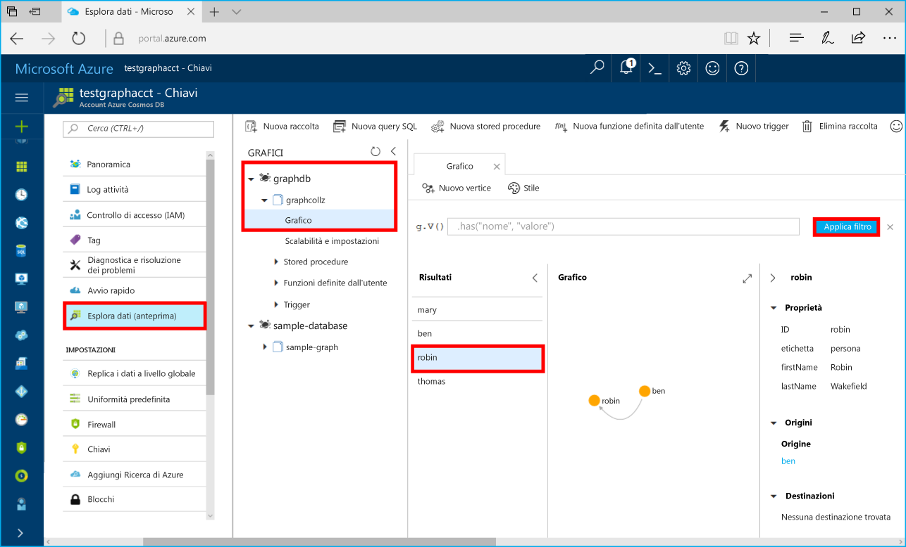

# <a name="azure-cosmos-db-build-a-net-application-using-the-graph-api"></a><span data-ttu-id="da829-103">Azure Cosmos DB: Creare un'applicazione .NET tramite l'API Graph</span><span class="sxs-lookup"><span data-stu-id="da829-103">Azure Cosmos DB: Build a .NET application using the Graph API</span></span>

<span data-ttu-id="da829-104">Azure Cosmos DB è il servizio di database multimodello distribuito a livello globale di Microsoft.</span><span class="sxs-lookup"><span data-stu-id="da829-104">Azure Cosmos DB is Microsoft’s globally distributed multi-model database service.</span></span> <span data-ttu-id="da829-105">È possibile creare ed eseguire rapidamente query su database di documenti, coppie chiave/valore e grafi, sfruttando in ognuno dei casi i vantaggi offerti dalle funzionalità di scalabilità orizzontale e distribuzione globale alla base di Azure Cosmos DB.</span><span class="sxs-lookup"><span data-stu-id="da829-105">You can quickly create and query document, key/value, and graph databases, all of which benefit from the global distribution and horizontal scale capabilities at the core of Azure Cosmos DB.</span></span> 

<span data-ttu-id="da829-106">Questa guida di avvio rapido mostra come creare un account, un database e un grafo (contenitore) di Azure Cosmos DB tramite il portale di Azure.</span><span class="sxs-lookup"><span data-stu-id="da829-106">This quick start demonstrates how to create an Azure Cosmos DB account, database, and graph (container) using the Azure portal.</span></span> <span data-ttu-id="da829-107">Quindi, si creerà ed eseguirà un'app console basata sull'[API Graph](graph-sdk-dotnet.md) (anteprima).</span><span class="sxs-lookup"><span data-stu-id="da829-107">You then build and run a console app built on the [Graph API](graph-sdk-dotnet.md) (preview).</span></span>  

## <a name="prerequisites"></a><span data-ttu-id="da829-108">Prerequisiti</span><span class="sxs-lookup"><span data-stu-id="da829-108">Prerequisites</span></span>

<span data-ttu-id="da829-109">Se Visual Studio 2017 non è ancora installato, è possibile scaricare e usare la versione **gratuita** [Visual Studio 2017 Community Edition](https://www.visualstudio.com/downloads/).</span><span class="sxs-lookup"><span data-stu-id="da829-109">If you don’t already have Visual Studio 2017 installed, you can download and use the **free** [Visual Studio 2017 Community Edition](https://www.visualstudio.com/downloads/).</span></span> <span data-ttu-id="da829-110">Durante l'installazione di Visual Studio abilitare **Sviluppo di Azure**.</span><span class="sxs-lookup"><span data-stu-id="da829-110">Make sure that you enable **Azure development** during the Visual Studio setup.</span></span>

[!INCLUDE [quickstarts-free-trial-note](../../includes/quickstarts-free-trial-note.md)]

## <a name="create-a-database-account"></a><span data-ttu-id="da829-111">Creare un account di database</span><span class="sxs-lookup"><span data-stu-id="da829-111">Create a database account</span></span>

[!INCLUDE [cosmos-db-create-dbaccount-graph](../../includes/cosmos-db-create-dbaccount-graph.md)]

## <a name="add-a-graph"></a><span data-ttu-id="da829-112">Aggiungere un grafo</span><span class="sxs-lookup"><span data-stu-id="da829-112">Add a graph</span></span>

[!INCLUDE [cosmos-db-create-graph](../../includes/cosmos-db-create-graph.md)]

## <a name="clone-the-sample-application"></a><span data-ttu-id="da829-113">Clonare l'applicazione di esempio</span><span class="sxs-lookup"><span data-stu-id="da829-113">Clone the sample application</span></span>

<span data-ttu-id="da829-114">Clonare ora un'app per le API Graph da GitHub, impostare la stringa di connessione ed eseguirla.</span><span class="sxs-lookup"><span data-stu-id="da829-114">Now let's clone a Graph API app from github, set the connection string, and run it.</span></span> <span data-ttu-id="da829-115">Come si noterà, è facile usare i dati a livello di codice.</span><span class="sxs-lookup"><span data-stu-id="da829-115">You'll see how easy it is to work with data programmatically.</span></span> 

1. <span data-ttu-id="da829-116">Aprire una finestra del terminale Git, ad esempio Git Bash, ed eseguire il comando `cd` per passare a una directory di lavoro.</span><span class="sxs-lookup"><span data-stu-id="da829-116">Open a git terminal window, such as git bash, and `cd` to a working directory.</span></span>  

2. <span data-ttu-id="da829-117">Eseguire il comando seguente per clonare l'archivio di esempio.</span><span class="sxs-lookup"><span data-stu-id="da829-117">Run the following command to clone the sample repository.</span></span> 

    ```bash
    git clone https://github.com/Azure-Samples/azure-cosmos-db-graph-dotnet-getting-started.git
    ```

3. <span data-ttu-id="da829-118">Aprire quindi Visual Studio e il file della soluzione.</span><span class="sxs-lookup"><span data-stu-id="da829-118">Then open Visual Studio and open the solution file.</span></span> 

## <a name="review-the-code"></a><span data-ttu-id="da829-119">Esaminare il codice</span><span class="sxs-lookup"><span data-stu-id="da829-119">Review the code</span></span>

<span data-ttu-id="da829-120">Ecco una breve analisi di ciò che accade nell'app.</span><span class="sxs-lookup"><span data-stu-id="da829-120">Let's make a quick review of what's happening in the app.</span></span> <span data-ttu-id="da829-121">Aprire il file Program.cs. Come si noterà, queste righe di codice creano le risorse di Azure Cosmos DB.</span><span class="sxs-lookup"><span data-stu-id="da829-121">Open the Program.cs file and you'll find that these lines of code create the Azure Cosmos DB resources.</span></span> 

* <span data-ttu-id="da829-122">Viene inizializzato DocumentClient.</span><span class="sxs-lookup"><span data-stu-id="da829-122">The DocumentClient is initialized.</span></span> <span data-ttu-id="da829-123">Nell'anteprima è stata aggiunta un'API di estensione Graph nel client Azure Cosmos DB.</span><span class="sxs-lookup"><span data-stu-id="da829-123">In the preview, we added a graph extension API on the Azure Cosmos DB client.</span></span> <span data-ttu-id="da829-124">È in corso lo sviluppo di un client Graph autonomo separato dal client e dalle risorse di Azure Cosmos DB.</span><span class="sxs-lookup"><span data-stu-id="da829-124">We are working on a standalone graph client decoupled from the Azure Cosmos DB client and resources.</span></span>

    ```csharp
    using (DocumentClient client = new DocumentClient(
        new Uri(endpoint),
        authKey,
        new ConnectionPolicy { ConnectionMode = ConnectionMode.Direct, ConnectionProtocol = Protocol.Tcp }))
    ```

* <span data-ttu-id="da829-125">Viene creato un nuovo database.</span><span class="sxs-lookup"><span data-stu-id="da829-125">A new database is created.</span></span>

    ```csharp
    Database database = await client.CreateDatabaseIfNotExistsAsync(new Database { Id = "graphdb" });
    ```

* <span data-ttu-id="da829-126">Viene creato un nuovo grafo.</span><span class="sxs-lookup"><span data-stu-id="da829-126">A new graph is created.</span></span>

    ```csharp
    DocumentCollection graph = await client.CreateDocumentCollectionIfNotExistsAsync(
        UriFactory.CreateDatabaseUri("graphdb"),
        new DocumentCollection { Id = "graph" },
        new RequestOptions { OfferThroughput = 1000 });
    ```
* <span data-ttu-id="da829-127">Viene eseguita una serie di passaggi di Gremlin tramite il metodo `CreateGremlinQuery`.</span><span class="sxs-lookup"><span data-stu-id="da829-127">A series of Gremlin steps are executed using the `CreateGremlinQuery` method.</span></span>

    ```csharp
    // The CreateGremlinQuery method extensions allow you to execute Gremlin queries and iterate
    // results asychronously
    IDocumentQuery<dynamic> query = client.CreateGremlinQuery<dynamic>(graph, "g.V().count()");
    while (query.HasMoreResults)
    {
        foreach (dynamic result in await query.ExecuteNextAsync())
        {
            Console.WriteLine($"\t {JsonConvert.SerializeObject(result)}");
        }
    }

    ```

## <a name="update-your-connection-string"></a><span data-ttu-id="da829-128">Aggiornare la stringa di connessione</span><span class="sxs-lookup"><span data-stu-id="da829-128">Update your connection string</span></span>

<span data-ttu-id="da829-129">Tornare ora al portale di Azure per recuperare le informazioni sulla stringa di connessione e copiarle nell'app.</span><span class="sxs-lookup"><span data-stu-id="da829-129">Now go back to the Azure portal to get your connection string information and copy it into the app.</span></span>

1. <span data-ttu-id="da829-130">In Visual Studio 2017 aprire il file App.config.</span><span class="sxs-lookup"><span data-stu-id="da829-130">In Visual Studio 2017, open the App.config file.</span></span> 

2. <span data-ttu-id="da829-131">Nell'account Azure Cosmos DB nel portale di Azure fare clic su **Chiavi** nel riquadro di spostamento a sinistra.</span><span class="sxs-lookup"><span data-stu-id="da829-131">In the Azure portal, in your Azure Cosmos DB account, click **Keys** in the left navigation.</span></span> 

    

3. <span data-ttu-id="da829-133">Copiare il valore **URI** dal portale e impostarlo come valore della chiave di endpoint in App.config.</span><span class="sxs-lookup"><span data-stu-id="da829-133">Copy your **URI** value from the portal and make it the value of the Endpoint key in App.config.</span></span> <span data-ttu-id="da829-134">Come illustrato nello screenshot precedente è possibile usare il pulsante di copia per copiare il valore.</span><span class="sxs-lookup"><span data-stu-id="da829-134">You can use the copy button as shown in the preceding screenshot to copy the value.</span></span>

    `<add key="Endpoint" value="https://FILLME.documents.azure.com:443" />`

4. <span data-ttu-id="da829-135">Copiare il valore di **CHIAVE PRIMARIA** dal portale e impostarlo come valore della chiave AuthKey in App.config, quindi salvare le modifiche.</span><span class="sxs-lookup"><span data-stu-id="da829-135">Copy your **PRIMARY KEY** value from the portal, and make it the value of the AuthKey key in App.config, then save your changes.</span></span> 

    `<add key="AuthKey" value="FILLME" />`

<span data-ttu-id="da829-136">L'app è stata aggiornata con tutte le informazioni necessarie per comunicare con Azure Cosmos DB.</span><span class="sxs-lookup"><span data-stu-id="da829-136">You've now updated your app with all the info it needs to communicate with Azure Cosmos DB.</span></span> 

## <a name="run-the-console-app"></a><span data-ttu-id="da829-137">Eseguire l'app console</span><span class="sxs-lookup"><span data-stu-id="da829-137">Run the console app</span></span>

1. <span data-ttu-id="da829-138">In Visual Studio fare clic con il pulsante destro del mouse sul progetto **GraphGetStarted** in **Esplora soluzioni** e quindi scegliere **Gestisci pacchetti NuGet**.</span><span class="sxs-lookup"><span data-stu-id="da829-138">In Visual Studio, right-click on the **GraphGetStarted** project in **Solution Explorer** and then click **Manage NuGet Packages**.</span></span> 

2. <span data-ttu-id="da829-139">Nella casella **Sfoglia** di NuGet digitare *Microsoft.Azure.Graphs* e selezionare la casella **Includi versione preliminare**.</span><span class="sxs-lookup"><span data-stu-id="da829-139">In the NuGet **Browse** box, type *Microsoft.Azure.Graphs* and check the **Includes prerelease** box.</span></span> 

3. <span data-ttu-id="da829-140">Dai risultati installare la libreria **Microsoft.Azure.Graphs** .</span><span class="sxs-lookup"><span data-stu-id="da829-140">From the results, install the **Microsoft.Azure.Graphs** library.</span></span> <span data-ttu-id="da829-141">Viene installato il pacchetto della libreria di estensioni Graph per Azure Cosmos DB, insieme a tutte le dipendenze.</span><span class="sxs-lookup"><span data-stu-id="da829-141">This installs the Azure Cosmos DB graph extension library package and all dependencies.</span></span>

    <span data-ttu-id="da829-142">Se viene visualizzato un messaggio sulla verifica delle modifiche alla soluzione, fare clic su **OK**.</span><span class="sxs-lookup"><span data-stu-id="da829-142">If you get a message about reviewing changes to the solution, click **OK**.</span></span> <span data-ttu-id="da829-143">Se viene visualizzato un messaggio sull'accettazione della licenza, fare clic su **Accetto**.</span><span class="sxs-lookup"><span data-stu-id="da829-143">If you get a message about license acceptance, click **I accept**.</span></span>

4. <span data-ttu-id="da829-144">Premere CTRL+F5 per eseguire l'applicazione.</span><span class="sxs-lookup"><span data-stu-id="da829-144">Click CTRL + F5 to run the application.</span></span>

   <span data-ttu-id="da829-145">La finestra della console visualizza i vertici e gli archi aggiunti al grafo.</span><span class="sxs-lookup"><span data-stu-id="da829-145">The console window displays the vertexes and edges being added to the graph.</span></span> <span data-ttu-id="da829-146">Al termine dello script, premere INVIO due volte per chiudere la finestra della console.</span><span class="sxs-lookup"><span data-stu-id="da829-146">When the script completes, press ENTER twice to close the console window.</span></span> 

## <a name="browse-using-the-data-explorer"></a><span data-ttu-id="da829-147">Esplorare i dati con Esplora dati</span><span class="sxs-lookup"><span data-stu-id="da829-147">Browse using the Data Explorer</span></span>

<span data-ttu-id="da829-148">È ora possibile tornare a Esplora dati nel portale di Azure per esplorare i nuovi dati del grafo ed eseguire query su di essi.</span><span class="sxs-lookup"><span data-stu-id="da829-148">You can now go back to Data Explorer in the Azure portal and browse and query your new graph data.</span></span>

1. <span data-ttu-id="da829-149">In Esplora dati il nuovo database viene visualizzato nel riquadro Graph.</span><span class="sxs-lookup"><span data-stu-id="da829-149">In Data Explorer, the new database appears in the Graphs pane.</span></span> <span data-ttu-id="da829-150">Espandere **graphdb** e **graphcollz** e quindi fare clic su **Grafico**.</span><span class="sxs-lookup"><span data-stu-id="da829-150">Expand **graphdb**, **graphcollz**, and then click **Graph**.</span></span>

2. <span data-ttu-id="da829-151">Fare clic sul pulsante **Applica filtro** per usare la query predefinita per visualizzare tutti i vertici nel grafico.</span><span class="sxs-lookup"><span data-stu-id="da829-151">Click the **Apply Filter** button to use the default query to view all the verticies in the graph.</span></span> <span data-ttu-id="da829-152">I dati generati dall'app di esempio vengono visualizzati nel riquadro Graphs (Grafi).</span><span class="sxs-lookup"><span data-stu-id="da829-152">The data generated by the sample app is displayed in the Graphs pane.</span></span>

    <span data-ttu-id="da829-153">È possibile ingrandire o ridurre il grafico, espanderne lo spazio di visualizzazione, aggiungere altri vertici e spostare i vertici nell'area di visualizzazione.</span><span class="sxs-lookup"><span data-stu-id="da829-153">You can zoom in and out of the graph, you can expand the graph display space, add additional verticies, and move verticies on the display surface.</span></span>

    

## <a name="review-slas-in-the-azure-portal"></a><span data-ttu-id="da829-155">Esaminare i contratti di servizio nel portale di Azure</span><span class="sxs-lookup"><span data-stu-id="da829-155">Review SLAs in the Azure portal</span></span>

[!INCLUDE [cosmosdb-tutorial-review-slas](../../includes/cosmos-db-tutorial-review-slas.md)]

## <a name="clean-up-resources"></a><span data-ttu-id="da829-156">Pulire le risorse</span><span class="sxs-lookup"><span data-stu-id="da829-156">Clean up resources</span></span>

<span data-ttu-id="da829-157">Se non si intende continuare a usare l'app, eliminare tutte le risorse create tramite questa guida di avvio rapido nel portale di Azure eseguendo questi passaggi:</span><span class="sxs-lookup"><span data-stu-id="da829-157">If you're not going to continue to use this app, delete all resources created by this quickstart in the Azure portal with the following steps:</span></span> 

1. <span data-ttu-id="da829-158">Scegliere **Gruppi di risorse** dal menu a sinistra del portale di Azure e quindi fare clic sul nome della risorsa creata.</span><span class="sxs-lookup"><span data-stu-id="da829-158">From the left-hand menu in the Azure portal, click **Resource groups** and then click the name of the resource you created.</span></span> 
2. <span data-ttu-id="da829-159">Nella pagina del gruppo di risorse fare clic su **Elimina**, digitare il nome della risorsa da eliminare nella casella di testo e quindi fare clic su **Elimina**.</span><span class="sxs-lookup"><span data-stu-id="da829-159">On your resource group page, click **Delete**, type the name of the resource to delete in the text box, and then click **Delete**.</span></span>

## <a name="next-steps"></a><span data-ttu-id="da829-160">Passaggi successivi</span><span class="sxs-lookup"><span data-stu-id="da829-160">Next steps</span></span>

<span data-ttu-id="da829-161">In questa guida di avvio rapido si è appreso come creare un account Azure Cosmos DB, come creare un grafo con Esplora dati e come eseguire un'app.</span><span class="sxs-lookup"><span data-stu-id="da829-161">In this quickstart, you've learned how to create an Azure Cosmos DB account, create a graph using the Data Explorer, and run an app.</span></span> <span data-ttu-id="da829-162">È ora possibile creare query più complesse e implementare la potente logica di attraversamento dei grafi usando Gremlin.</span><span class="sxs-lookup"><span data-stu-id="da829-162">You can now build more complex queries and implement powerful graph traversal logic using Gremlin.</span></span> 

> [!div class="nextstepaction"]
> [<span data-ttu-id="da829-163">Eseguire query con Gremlin</span><span class="sxs-lookup"><span data-stu-id="da829-163">Query using Gremlin</span></span>](tutorial-query-graph.md)

