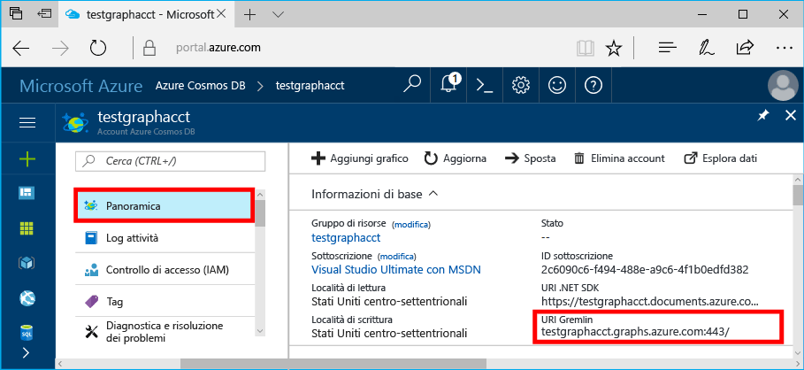

# <a name="azure-cosmos-db-create-query-and-traverse-a-graph-in-hello-gremlin-console"></a><span data-ttu-id="7593c-103">Azure Cosmos DB: Crea, query e attraversare un grafico nella console Gremlin hello</span><span class="sxs-lookup"><span data-stu-id="7593c-103">Azure Cosmos DB: Create, query, and traverse a graph in hello Gremlin console</span></span>

<span data-ttu-id="7593c-104">Azure Cosmos DB è il servizio di database multimodello distribuito a livello globale di Microsoft.</span><span class="sxs-lookup"><span data-stu-id="7593c-104">Azure Cosmos DB is Microsoft’s globally distributed multi-model database service.</span></span> <span data-ttu-id="7593c-105">Creare rapidamente e query chiave/valore, il documento e database grafico, ognuno dei quali trarre vantaggio dalla distribuzione globale hello e funzionalità di scalabilità orizzontale di base di Azure Cosmos DB hello.</span><span class="sxs-lookup"><span data-stu-id="7593c-105">You can quickly create and query document, key/value, and graph databases, all of which benefit from hello global distribution and horizontal scale capabilities at hello core of Azure Cosmos DB.</span></span> 

<span data-ttu-id="7593c-106">Questa Guida introduttiva illustra come hello toocreate un account Azure Cosmos DB, il database e graph (contenitore) tramite il portale di Azure e quindi utilizzare hello [Gremlin Console](https://tinkerpop.apache.org/docs/current/reference/#gremlin-console) da [Apache TinkerPop](http://tinkerpop.apache.org) toowork con API (anteprima) i dati del grafico.</span><span class="sxs-lookup"><span data-stu-id="7593c-106">This quick start demonstrates how toocreate an Azure Cosmos DB account, database, and graph (container) using hello Azure portal and then use hello [Gremlin Console](https://tinkerpop.apache.org/docs/current/reference/#gremlin-console) from  [Apache TinkerPop](http://tinkerpop.apache.org) toowork with Graph API (preview) data.</span></span> <span data-ttu-id="7593c-107">In questa esercitazione è creare ed eseguire query di vertici e bordi, aggiornando una proprietà di vertici, eseguire una query vertici, attraversano il grafico hello ed eliminare un vertice.</span><span class="sxs-lookup"><span data-stu-id="7593c-107">In this tutorial, you create and query vertices and edges, updating a vertex property, query vertices, traverse hello graph, and drop a vertex.</span></span>


<span data-ttu-id="7593c-109">console Gremlin Hello è Groovy/Java in base e viene eseguito in Windows, Mac e Linux.</span><span class="sxs-lookup"><span data-stu-id="7593c-109">hello Gremlin console is Groovy/Java based and runs on Linux, Mac, and Windows.</span></span> <span data-ttu-id="7593c-110">È possibile scaricarlo da hello [TinkerPop Apache sito](https://www.apache.org/dyn/closer.lua/tinkerpop/3.2.5/apache-tinkerpop-gremlin-console-3.2.5-bin.zip).</span><span class="sxs-lookup"><span data-stu-id="7593c-110">You can download it from hello [Apache TinkerPop site](https://www.apache.org/dyn/closer.lua/tinkerpop/3.2.5/apache-tinkerpop-gremlin-console-3.2.5-bin.zip).</span></span>

## <a name="prerequisites"></a><span data-ttu-id="7593c-111">Prerequisiti</span><span class="sxs-lookup"><span data-stu-id="7593c-111">Prerequisites</span></span>

<span data-ttu-id="7593c-112">È necessario un toocreate sottoscrizione di Azure, un account Azure Cosmos DB toohave per questa Guida rapida.</span><span class="sxs-lookup"><span data-stu-id="7593c-112">You need toohave an Azure subscription toocreate an Azure Cosmos DB account for this quickstart.</span></span>

[!INCLUDE [quickstarts-free-trial-note](../../includes/quickstarts-free-trial-note.md)]

<span data-ttu-id="7593c-113">È inoltre necessario hello tooinstall [Gremlin Console](http://tinkerpop.apache.org/).</span><span class="sxs-lookup"><span data-stu-id="7593c-113">You also need tooinstall hello [Gremlin Console](http://tinkerpop.apache.org/).</span></span> <span data-ttu-id="7593c-114">Usare la versione 3.2.5 o successiva.</span><span class="sxs-lookup"><span data-stu-id="7593c-114">Use version 3.2.5 or above.</span></span>

## <a name="create-a-database-account"></a><span data-ttu-id="7593c-115">Creare un account di database</span><span class="sxs-lookup"><span data-stu-id="7593c-115">Create a database account</span></span>

[!INCLUDE [cosmos-db-create-dbaccount-graph](../../includes/cosmos-db-create-dbaccount-graph.md)]

## <a name="add-a-graph"></a><span data-ttu-id="7593c-116">Aggiungere un grafo</span><span class="sxs-lookup"><span data-stu-id="7593c-116">Add a graph</span></span>

[!INCLUDE [cosmos-db-create-graph](../../includes/cosmos-db-create-graph.md)]

## <span data-ttu-id="7593c-117"><a id="ConnectAppService"></a>La connessione di servizio app tooyour</span><span class="sxs-lookup"><span data-stu-id="7593c-117"><a id="ConnectAppService"></a>Connect tooyour app service</span></span>
1. <span data-ttu-id="7593c-118">Prima di avviare hello Gremlin Console, creare o modificare file di configurazione remote secure.yaml hello nella directory apache-tinkerpop-gremlin-console-3.2.5/conf hello.</span><span class="sxs-lookup"><span data-stu-id="7593c-118">Before starting hello Gremlin Console, create or modify hello remote-secure.yaml configuration file in hello apache-tinkerpop-gremlin-console-3.2.5/conf directory.</span></span>
2. <span data-ttu-id="7593c-119">Immettere le configurazioni per *Hosts*, *Port*, *Username*, *Password*, *ConnectionPool* e *Serializer*:</span><span class="sxs-lookup"><span data-stu-id="7593c-119">Fill in your *host*, *port*, *username*, *password*, *connectionPool*, and *serializer* configurations:</span></span>

    <span data-ttu-id="7593c-120">Impostazione</span><span class="sxs-lookup"><span data-stu-id="7593c-120">Setting</span></span>|<span data-ttu-id="7593c-121">Valore consigliato</span><span class="sxs-lookup"><span data-stu-id="7593c-121">Suggested value</span></span>|<span data-ttu-id="7593c-122">Descrizione</span><span class="sxs-lookup"><span data-stu-id="7593c-122">Description</span></span>
    ---|---|---
    <span data-ttu-id="7593c-123">hosts</span><span class="sxs-lookup"><span data-stu-id="7593c-123">hosts</span></span>|<span data-ttu-id="7593c-124">[***.graphs.azure.com]</span><span class="sxs-lookup"><span data-stu-id="7593c-124">[***.graphs.azure.com]</span></span>|<span data-ttu-id="7593c-125">Vedere lo screenshot di seguito.</span><span class="sxs-lookup"><span data-stu-id="7593c-125">See screenshot below.</span></span> <span data-ttu-id="7593c-126">Questo è il valore URI Gremlin hello nella pagina di panoramica hello del portale di Azure, tra parentesi quadre, hello finali hello: 443 / rimosso.</span><span class="sxs-lookup"><span data-stu-id="7593c-126">This is hello Gremlin URI value on hello Overview page of hello Azure portal, in square brackets, with hello trailing :443/ removed.</span></span><br><br><span data-ttu-id="7593c-127">Questo valore può anche essere recuperato dalla scheda chiavi hello, usando il valore URI hello rimozione https://, la modifica di documenti toographs, nonché hello finali: 443 /.</span><span class="sxs-lookup"><span data-stu-id="7593c-127">This value can also be retrieved from hello Keys tab, using hello URI value by removing https://, changing documents toographs, and removing hello trailing :443/.</span></span>
    <span data-ttu-id="7593c-128">port</span><span class="sxs-lookup"><span data-stu-id="7593c-128">port</span></span>|<span data-ttu-id="7593c-129">443</span><span class="sxs-lookup"><span data-stu-id="7593c-129">443</span></span>|<span data-ttu-id="7593c-130">Impostare too443.</span><span class="sxs-lookup"><span data-stu-id="7593c-130">Set too443.</span></span>
    <span data-ttu-id="7593c-131">username</span><span class="sxs-lookup"><span data-stu-id="7593c-131">username</span></span>|<span data-ttu-id="7593c-132">*Nome utente*</span><span class="sxs-lookup"><span data-stu-id="7593c-132">*Your username*</span></span>|<span data-ttu-id="7593c-133">risorse del form hello Hello `/dbs/<db>/colls/<coll>` in `<db>` è il nome del database e `<coll>` è il nome della raccolta.</span><span class="sxs-lookup"><span data-stu-id="7593c-133">hello resource of hello form `/dbs/<db>/colls/<coll>` where `<db>` is your database name and `<coll>` is your collection name.</span></span>
    <span data-ttu-id="7593c-134">password</span><span class="sxs-lookup"><span data-stu-id="7593c-134">password</span></span>|<span data-ttu-id="7593c-135">*Chiave primaria*</span><span class="sxs-lookup"><span data-stu-id="7593c-135">*Your primary key*</span></span>| <span data-ttu-id="7593c-136">Vedere il secondo screenshot di seguito.</span><span class="sxs-lookup"><span data-stu-id="7593c-136">See second screenshot below.</span></span> <span data-ttu-id="7593c-137">Si tratta della chiave primaria, che è possibile recuperare dalla pagina chiavi hello del portale di Azure, nella casella di chiave primaria hello hello.</span><span class="sxs-lookup"><span data-stu-id="7593c-137">This is your primary key, which you can retrieve from hello Keys page of hello Azure portal, in hello Primary Key box.</span></span> <span data-ttu-id="7593c-138">Utilizzare il pulsante di copia hello sul lato sinistro di hello del valore di hello toocopy casella hello.</span><span class="sxs-lookup"><span data-stu-id="7593c-138">Use hello copy button on hello left side of hello box toocopy hello value.</span></span>
    <span data-ttu-id="7593c-139">connectionPool</span><span class="sxs-lookup"><span data-stu-id="7593c-139">connectionPool</span></span>|<span data-ttu-id="7593c-140">{enableSsl: true}</span><span class="sxs-lookup"><span data-stu-id="7593c-140">{enableSsl: true}</span></span>|<span data-ttu-id="7593c-141">Impostazione del pool di connessioni per SSL.</span><span class="sxs-lookup"><span data-stu-id="7593c-141">Your connection pool setting for SSL.</span></span>
    <span data-ttu-id="7593c-142">serializer</span><span class="sxs-lookup"><span data-stu-id="7593c-142">serializer</span></span>|<span data-ttu-id="7593c-143">{ className: org.apache.tinkerpop.gremlin.</span><span class="sxs-lookup"><span data-stu-id="7593c-143">{ className: org.apache.tinkerpop.gremlin.</span></span><br><span data-ttu-id="7593c-144">driver.ser.GraphSONMessageSerializerV1d0,</span><span class="sxs-lookup"><span data-stu-id="7593c-144">driver.ser.GraphSONMessageSerializerV1d0,</span></span><br> <span data-ttu-id="7593c-145">config: { serializeResultToString: true }}</span><span class="sxs-lookup"><span data-stu-id="7593c-145">config: { serializeResultToString: true }}</span></span>|<span data-ttu-id="7593c-146">Impostare il valore di toothis ed eliminare qualsiasi `\n` interruzioni di riga quando si incolla in valore hello.</span><span class="sxs-lookup"><span data-stu-id="7593c-146">Set toothis value and delete any `\n` line breaks when pasting in hello value.</span></span>

    <span data-ttu-id="7593c-147">Per il valore di host hello, copiare hello **Gremlin URI** valore hello **Panoramica** pagina: </span><span class="sxs-lookup"><span data-stu-id="7593c-147">For hello hosts value, copy hello **Gremlin URI** value from hello **Overview** page: </span></span>

    <span data-ttu-id="7593c-148">Per il valore di password hello, copiare hello **chiave primaria** da hello **chiavi** pagina: </span><span class="sxs-lookup"><span data-stu-id="7593c-148">For hello password value, copy hello **Primary key** from hello **Keys** page: </span></span>


3. <span data-ttu-id="7593c-149">In terminale, eseguire `bin/gremlin.bat` o `bin/gremlin.sh` toostart hello [Gremlin Console](http://tinkerpop.apache.org/docs/3.2.5/tutorials/getting-started/).</span><span class="sxs-lookup"><span data-stu-id="7593c-149">In your terminal, run `bin/gremlin.bat` or `bin/gremlin.sh` toostart hello [Gremlin Console](http://tinkerpop.apache.org/docs/3.2.5/tutorials/getting-started/).</span></span>
4. <span data-ttu-id="7593c-150">In terminale, eseguire `:remote connect tinkerpop.server conf/remote-secure.yaml` servizio app di tooconnect tooyour.</span><span class="sxs-lookup"><span data-stu-id="7593c-150">In your terminal, run `:remote connect tinkerpop.server conf/remote-secure.yaml` tooconnect tooyour app service.</span></span>

    > [!TIP]
    > <span data-ttu-id="7593c-151">Se viene visualizzato l'errore hello `No appenders could be found for logger` assicurarsi di aver aggiornato il valore del serializzatore hello nel file remoto secure.yaml hello come descritto nel passaggio 2.</span><span class="sxs-lookup"><span data-stu-id="7593c-151">If you receive hello error `No appenders could be found for logger` ensure that you updated hello serializer value in hello remote-secure.yaml file as described in step 2.</span></span> 

<span data-ttu-id="7593c-152">L'installazione è riuscita.</span><span class="sxs-lookup"><span data-stu-id="7593c-152">Great!</span></span> <span data-ttu-id="7593c-153">Ora che è stata completata l'installazione di hello, iniziamo esegue alcuni comandi della console.</span><span class="sxs-lookup"><span data-stu-id="7593c-153">Now that we finished hello setup, let's start running some console commands.</span></span>

<span data-ttu-id="7593c-154">Provare un comando count () semplice.</span><span class="sxs-lookup"><span data-stu-id="7593c-154">Let's try a simple count() command.</span></span> <span data-ttu-id="7593c-155">Digitare segue hello in console hello al prompt dei comandi hello:</span><span class="sxs-lookup"><span data-stu-id="7593c-155">Type hello following into hello console at hello prompt:</span></span>
```
:> g.V().count()
```

> [!TIP]
> <span data-ttu-id="7593c-156">Hello preavviso `:>` che precede hello `g.V().count()` testo?</span><span class="sxs-lookup"><span data-stu-id="7593c-156">Notice hello `:>` that precedes hello `g.V().count()` text?</span></span> 
>
> <span data-ttu-id="7593c-157">Ciò fa parte del comando hello che è necessario tootype.</span><span class="sxs-lookup"><span data-stu-id="7593c-157">This is part of hello command you need tootype.</span></span> <span data-ttu-id="7593c-158">È importante quando si utilizza console Gremlin hello con Azure Cosmos DB.</span><span class="sxs-lookup"><span data-stu-id="7593c-158">It is important when using hello Gremlin console, with Azure Cosmos DB.</span></span>  
>
> <span data-ttu-id="7593c-159">L'omissione di questo `:>` prefisso indica comando hello di hello console tooexecute localmente, spesso su un grafico in memoria.</span><span class="sxs-lookup"><span data-stu-id="7593c-159">Omitting this `:>` prefix instructs hello console tooexecute hello command locally, often against an in-memory graph.</span></span>
> <span data-ttu-id="7593c-160">Usando questa `:>` indica hello console tooexecute un comando remoto, in questo caso contro DB Cosmos (ovvero emulatore localhost hello, o un > istanza di Azure).</span><span class="sxs-lookup"><span data-stu-id="7593c-160">Using this `:>` tells hello console tooexecute a remote command, in this case against Cosmos DB (either hello localhost emulator, or an > Azure instance).</span></span>


## <a name="create-vertices-and-edges"></a><span data-ttu-id="7593c-161">Creare vertici e archi</span><span class="sxs-lookup"><span data-stu-id="7593c-161">Create vertices and edges</span></span>

<span data-ttu-id="7593c-162">Per iniziare, aggiungere cinque vertici per le persone per *Thomas*, *Mary Kay*, *Robin*, *Ben* e *Jack*.</span><span class="sxs-lookup"><span data-stu-id="7593c-162">Let's begin by adding five person vertices for *Thomas*, *Mary Kay*, *Robin*, *Ben*, and *Jack*.</span></span>

<span data-ttu-id="7593c-163">Input (Thomas):</span><span class="sxs-lookup"><span data-stu-id="7593c-163">Input (Thomas):</span></span>

```
:> g.addV('person').property('firstName', 'Thomas').property('lastName', 'Andersen').property('age', 44).property('userid', 1)
```

<span data-ttu-id="7593c-164">Output:</span><span class="sxs-lookup"><span data-stu-id="7593c-164">Output:</span></span>

```
==>[id:796cdccc-2acd-4e58-a324-91d6f6f5ed6d,label:person,type:vertex,properties:[firstName:[[id:f02a749f-b67c-4016-850e-910242d68953,value:Thomas]],lastName:[[id:f5fa3126-8818-4fda-88b0-9bb55145ce5c,value:Andersen]],age:[[id:f6390f9c-e563-433e-acbf-25627628016e,value:44]],userid:[[id:796cdccc-2acd-4e58-a324-91d6f6f5ed6d|userid,value:1]]]]
```
<span data-ttu-id="7593c-165">Input (Mary Kay):</span><span class="sxs-lookup"><span data-stu-id="7593c-165">Input (Mary Kay):</span></span>

```
:> g.addV('person').property('firstName', 'Mary Kay').property('lastName', 'Andersen').property('age', 39).property('userid', 2)

```

<span data-ttu-id="7593c-166">Output:</span><span class="sxs-lookup"><span data-stu-id="7593c-166">Output:</span></span>

```
==>[id:0ac9be25-a476-4a30-8da8-e79f0119ea5e,label:person,type:vertex,properties:[firstName:[[id:ea0604f8-14ee-4513-a48a-1734a1f28dc0,value:Mary Kay]],lastName:[[id:86d3bba5-fd60-4856-9396-c195ef7d7f4b,value:Andersen]],age:[[id:bc81b78d-30c4-4e03-8f40-50f72eb5f6da,value:39]],userid:[[id:0ac9be25-a476-4a30-8da8-e79f0119ea5e|userid,value:2]]]]

```

<span data-ttu-id="7593c-167">Input (Robin):</span><span class="sxs-lookup"><span data-stu-id="7593c-167">Input (Robin):</span></span>

```
:> g.addV('person').property('firstName', 'Robin').property('lastName', 'Wakefield').property('userid', 3)
```

<span data-ttu-id="7593c-168">Output:</span><span class="sxs-lookup"><span data-stu-id="7593c-168">Output:</span></span>

```
==>[id:8dc14d6a-8683-4a54-8d74-7eef1fb43a3e,label:person,type:vertex,properties:[firstName:[[id:ec65f078-7a43-4cbe-bc06-e50f2640dc4e,value:Robin]],lastName:[[id:a3937d07-0e88-45d3-a442-26fcdfb042ce,value:Wakefield]],userid:[[id:8dc14d6a-8683-4a54-8d74-7eef1fb43a3e|userid,value:3]]]]
```

<span data-ttu-id="7593c-169">Input (Ben):</span><span class="sxs-lookup"><span data-stu-id="7593c-169">Input (Ben):</span></span>

```
:> g.addV('person').property('firstName', 'Ben').property('lastName', 'Miller').property('userid', 4)

```

<span data-ttu-id="7593c-170">Output:</span><span class="sxs-lookup"><span data-stu-id="7593c-170">Output:</span></span>

```
==>[id:ee86b670-4d24-4966-9a39-30529284b66f,label:person,type:vertex,properties:[firstName:[[id:a632469b-30fc-4157-840c-b80260871e9a,value:Ben]],lastName:[[id:4a08d307-0719-47c6-84ae-1b0b06630928,value:Miller]],userid:[[id:ee86b670-4d24-4966-9a39-30529284b66f|userid,value:4]]]]
```

<span data-ttu-id="7593c-171">Input (Jack):</span><span class="sxs-lookup"><span data-stu-id="7593c-171">Input (Jack):</span></span>

```
:> g.addV('person').property('firstName', 'Jack').property('lastName', 'Connor').property('userid', 5)
```

<span data-ttu-id="7593c-172">Output:</span><span class="sxs-lookup"><span data-stu-id="7593c-172">Output:</span></span>

```
==>[id:4c835f2a-ea5b-43bb-9b6b-215488ad8469,label:person,type:vertex,properties:[firstName:[[id:4250824e-4b72-417f-af98-8034aa15559f,value:Jack]],lastName:[[id:44c1d5e1-a831-480a-bf94-5167d133549e,value:Connor]],userid:[[id:4c835f2a-ea5b-43bb-9b6b-215488ad8469|userid,value:5]]]]
```


<span data-ttu-id="7593c-173">Aggiungere quindi gli archi per le relazioni tra le persone.</span><span class="sxs-lookup"><span data-stu-id="7593c-173">Next, let's add edges for relationships between our people.</span></span>

<span data-ttu-id="7593c-174">Input (Thomas -> Mary Kay):</span><span class="sxs-lookup"><span data-stu-id="7593c-174">Input (Thomas -> Mary Kay):</span></span>

```
:> g.V().hasLabel('person').has('firstName', 'Thomas').addE('knows').to(g.V().hasLabel('person').has('firstName', 'Mary Kay'))
```

<span data-ttu-id="7593c-175">Output:</span><span class="sxs-lookup"><span data-stu-id="7593c-175">Output:</span></span>

```
==>[id:c12bf9fb-96a1-4cb7-a3f8-431e196e702f,label:knows,type:edge,inVLabel:person,outVLabel:person,inV:0d1fa428-780c-49a5-bd3a-a68d96391d5c,outV:1ce821c6-aa3d-4170-a0b7-d14d2a4d18c3]
```

<span data-ttu-id="7593c-176">Input (Thomas -> Robin):</span><span class="sxs-lookup"><span data-stu-id="7593c-176">Input (Thomas -> Robin):</span></span>

```
:> g.V().hasLabel('person').has('firstName', 'Thomas').addE('knows').to(g.V().hasLabel('person').has('firstName', 'Robin'))
```

<span data-ttu-id="7593c-177">Output:</span><span class="sxs-lookup"><span data-stu-id="7593c-177">Output:</span></span>

```
==>[id:58319bdd-1d3e-4f17-a106-0ddf18719d15,label:knows,type:edge,inVLabel:person,outVLabel:person,inV:3e324073-ccfc-4ae1-8675-d450858ca116,outV:1ce821c6-aa3d-4170-a0b7-d14d2a4d18c3]
```

<span data-ttu-id="7593c-178">Input (Robin -> Ben):</span><span class="sxs-lookup"><span data-stu-id="7593c-178">Input (Robin -> Ben):</span></span>

```
:> g.V().hasLabel('person').has('firstName', 'Robin').addE('knows').to(g.V().hasLabel('person').has('firstName', 'Ben'))
```

<span data-ttu-id="7593c-179">Output:</span><span class="sxs-lookup"><span data-stu-id="7593c-179">Output:</span></span>

```
==>[id:889c4d3c-549e-4d35-bc21-a3d1bfa11e00,label:knows,type:edge,inVLabel:person,outVLabel:person,inV:40fd641d-546e-412a-abcc-58fe53891aab,outV:3e324073-ccfc-4ae1-8675-d450858ca116]
```

## <a name="update-a-vertex"></a><span data-ttu-id="7593c-180">Aggiornare un vertice</span><span class="sxs-lookup"><span data-stu-id="7593c-180">Update a vertex</span></span>

<span data-ttu-id="7593c-181">Consente di aggiornare hello *Thomas* vertice con una nuova durata di *45*.</span><span class="sxs-lookup"><span data-stu-id="7593c-181">Let's update hello *Thomas* vertex with a new age of *45*.</span></span>

<span data-ttu-id="7593c-182">Input:</span><span class="sxs-lookup"><span data-stu-id="7593c-182">Input:</span></span>
```
:> g.V().hasLabel('person').has('firstName', 'Thomas').property('age', 45)
```
<span data-ttu-id="7593c-183">Output:</span><span class="sxs-lookup"><span data-stu-id="7593c-183">Output:</span></span>

```
==>[id:ae36f938-210e-445a-92df-519f2b64c8ec,label:person,type:vertex,properties:[firstName:[[id:872090b6-6a77-456a-9a55-a59141d4ebc2,value:Thomas]],lastName:[[id:7ee7a39a-a414-4127-89b4-870bc4ef99f3,value:Andersen]],age:[[id:a2a75d5a-ae70-4095-806d-a35abcbfe71d,value:45]]]]
```

## <a name="query-your-graph"></a><span data-ttu-id="7593c-184">Eseguire query sul grafo</span><span class="sxs-lookup"><span data-stu-id="7593c-184">Query your graph</span></span>

<span data-ttu-id="7593c-185">È ora possibile eseguire diverse query sul grafo.</span><span class="sxs-lookup"><span data-stu-id="7593c-185">Now, let's run a variety of queries against your graph.</span></span>

<span data-ttu-id="7593c-186">Innanzitutto, provare una query con un filtro tooreturn solo gli utenti che hanno più di 40 anni fa.</span><span class="sxs-lookup"><span data-stu-id="7593c-186">First, let's try a query with a filter tooreturn only people who are older than 40 years old.</span></span>

<span data-ttu-id="7593c-187">Input (query con filtro):</span><span class="sxs-lookup"><span data-stu-id="7593c-187">Input (filter query):</span></span>

```
:> g.V().hasLabel('person').has('age', gt(40))
```

<span data-ttu-id="7593c-188">Output:</span><span class="sxs-lookup"><span data-stu-id="7593c-188">Output:</span></span>

```
==>[id:ae36f938-210e-445a-92df-519f2b64c8ec,label:person,type:vertex,properties:[firstName:[[id:872090b6-6a77-456a-9a55-a59141d4ebc2,value:Thomas]],lastName:[[id:7ee7a39a-a414-4127-89b4-870bc4ef99f3,value:Andersen]],age:[[id:a2a75d5a-ae70-4095-806d-a35abcbfe71d,value:45]]]]
```

<span data-ttu-id="7593c-189">Successivamente, si hello primo nome del progetto per gli utenti di hello che hanno più di 40 anni fa.</span><span class="sxs-lookup"><span data-stu-id="7593c-189">Next, let's project hello first name for hello people who are older than 40 years old.</span></span>

<span data-ttu-id="7593c-190">Input (query con filtro + query di proiezione):</span><span class="sxs-lookup"><span data-stu-id="7593c-190">Input (filter + projection query):</span></span>

```
:> g.V().hasLabel('person').has('age', gt(40)).values('firstName')
```

<span data-ttu-id="7593c-191">Output:</span><span class="sxs-lookup"><span data-stu-id="7593c-191">Output:</span></span>

```
==>Thomas
```

## <a name="traverse-your-graph"></a><span data-ttu-id="7593c-192">Attraversare il grafo</span><span class="sxs-lookup"><span data-stu-id="7593c-192">Traverse your graph</span></span>

<span data-ttu-id="7593c-193">Consente di attraversare hello grafico tooreturn tutti gli elementi Friend di Thomas.</span><span class="sxs-lookup"><span data-stu-id="7593c-193">Let's traverse hello graph tooreturn all of Thomas's friends.</span></span>

<span data-ttu-id="7593c-194">Input (amici di Thomas):</span><span class="sxs-lookup"><span data-stu-id="7593c-194">Input (friends of Thomas):</span></span>

```
:> g.V().hasLabel('person').has('firstName', 'Thomas').outE('knows').inV().hasLabel('person')
```

<span data-ttu-id="7593c-195">Output:</span><span class="sxs-lookup"><span data-stu-id="7593c-195">Output:</span></span> 

```
==>[id:f04bc00b-cb56-46c4-a3bb-a5870c42f7ff,label:person,type:vertex,properties:[firstName:[[id:14feedec-b070-444e-b544-62be15c7167c,value:Mary Kay]],lastName:[[id:107ab421-7208-45d4-b969-bbc54481992a,value:Andersen]],age:[[id:4b08d6e4-58f5-45df-8e69-6b790b692e0a,value:39]]]]
==>[id:91605c63-4988-4b60-9a30-5144719ae326,label:person,type:vertex,properties:[firstName:[[id:f760e0e6-652a-481a-92b0-1767d9bf372e,value:Robin]],lastName:[[id:352a4caa-bad6-47e3-a7dc-90ff342cf870,value:Wakefield]]]]
```

<span data-ttu-id="7593c-196">Successivamente, iniziamo livello successivo di hello di vertici.</span><span class="sxs-lookup"><span data-stu-id="7593c-196">Next, let's get hello next layer of vertices.</span></span> <span data-ttu-id="7593c-197">Attraversare hello grafico tooreturn tutti i tuoi amici hello di amici di Thomas.</span><span class="sxs-lookup"><span data-stu-id="7593c-197">Traverse hello graph tooreturn all hello friends of Thomas's friends.</span></span>

<span data-ttu-id="7593c-198">Input (amici degli amici di Thomas):</span><span class="sxs-lookup"><span data-stu-id="7593c-198">Input (friends of friends of Thomas):</span></span>

```
:> g.V().hasLabel('person').has('firstName', 'Thomas').outE('knows').inV().hasLabel('person').outE('knows').inV().hasLabel('person')
```
<span data-ttu-id="7593c-199">Output:</span><span class="sxs-lookup"><span data-stu-id="7593c-199">Output:</span></span>

```
==>[id:a801a0cb-ee85-44ee-a502-271685ef212e,label:person,type:vertex,properties:[firstName:[[id:b9489902-d29a-4673-8c09-c2b3fe7f8b94,value:Ben]],lastName:[[id:e084f933-9a4b-4dbc-8273-f0171265cf1d,value:Miller]]]]
```

## <a name="drop-a-vertex"></a><span data-ttu-id="7593c-200">Eliminare un vertice</span><span class="sxs-lookup"><span data-stu-id="7593c-200">Drop a vertex</span></span>

<span data-ttu-id="7593c-201">Eliminare ora un vertice dal database di graph hello.</span><span class="sxs-lookup"><span data-stu-id="7593c-201">Let's now delete a vertex from hello graph database.</span></span>

<span data-ttu-id="7593c-202">Input (eliminazione del vertice Jack):</span><span class="sxs-lookup"><span data-stu-id="7593c-202">Input (drop Jack vertex):</span></span>

```
:> g.V().hasLabel('person').has('firstName', 'Jack').drop()
```

## <a name="clear-your-graph"></a><span data-ttu-id="7593c-203">Cancellare il grafo</span><span class="sxs-lookup"><span data-stu-id="7593c-203">Clear your graph</span></span>

<span data-ttu-id="7593c-204">Infine, si cancella il database di hello di tutti i vertici e bordi.</span><span class="sxs-lookup"><span data-stu-id="7593c-204">Finally, let's clear hello database of all vertices and edges.</span></span>

<span data-ttu-id="7593c-205">Input:</span><span class="sxs-lookup"><span data-stu-id="7593c-205">Input:</span></span>

```
:> g.E().drop()
:> g.V().drop()
```

<span data-ttu-id="7593c-206">Congratulazioni.</span><span class="sxs-lookup"><span data-stu-id="7593c-206">Congratulations!</span></span> <span data-ttu-id="7593c-207">Questa esercitazione sull'API Graph di Azure Cosmos DB è stata completata.</span><span class="sxs-lookup"><span data-stu-id="7593c-207">You've completed this Azure Cosmos DB: Graph API tutorial!</span></span>

## <a name="review-slas-in-hello-azure-portal"></a><span data-ttu-id="7593c-208">Esaminare i contratti di servizio nel portale di Azure hello</span><span class="sxs-lookup"><span data-stu-id="7593c-208">Review SLAs in hello Azure portal</span></span>

[!INCLUDE [cosmosdb-tutorial-review-slas](../../includes/cosmos-db-tutorial-review-slas.md)]

## <a name="clean-up-resources"></a><span data-ttu-id="7593c-209">Pulire le risorse</span><span class="sxs-lookup"><span data-stu-id="7593c-209">Clean up resources</span></span>

<span data-ttu-id="7593c-210">Se non si ha intenzione toocontinue toouse questa app, eliminare tutte le risorse create da questa Guida rapida hello portale di Azure con hello alla procedura seguente:</span><span class="sxs-lookup"><span data-stu-id="7593c-210">If you're not going toocontinue toouse this app, delete all resources created by this quickstart in hello Azure portal with hello following steps:</span></span>  

1. <span data-ttu-id="7593c-211">Dal menu a sinistra di hello in hello portale di Azure, fare clic su **gruppi di risorse** e quindi fare clic su nome hello della risorsa di hello è stato creato.</span><span class="sxs-lookup"><span data-stu-id="7593c-211">From hello left-hand menu in hello Azure portal, click **Resource groups** and then click hello name of hello resource you created.</span></span> 
2. <span data-ttu-id="7593c-212">Nella pagina di gruppo di risorse, fare clic su **eliminare**, digitare il nome di hello di hello risorsa toodelete nella casella di testo hello e quindi fare clic su **eliminare**.</span><span class="sxs-lookup"><span data-stu-id="7593c-212">On your resource group page, click **Delete**, type hello name of hello resource toodelete in hello text box, and then click **Delete**.</span></span>

## <a name="next-steps"></a><span data-ttu-id="7593c-213">Passaggi successivi</span><span class="sxs-lookup"><span data-stu-id="7593c-213">Next steps</span></span>

<span data-ttu-id="7593c-214">In questa Guida rapida, si è appreso come toocreate un account Azure Cosmos DB, creare un grafico utilizzando hello Esplora dati, creare i vertici e bordi e attraversare il grafico utilizzando console Gremlin hello.</span><span class="sxs-lookup"><span data-stu-id="7593c-214">In this quickstart, you've learned how toocreate an Azure Cosmos DB account, create a graph using hello Data Explorer, create vertices and edges, and traverse your graph using hello Gremlin console.</span></span> <span data-ttu-id="7593c-215">È ora possibile creare query più complesse e implementare la potente logica di attraversamento dei grafi usando Gremlin.</span><span class="sxs-lookup"><span data-stu-id="7593c-215">You can now build more complex queries and implement powerful graph traversal logic using Gremlin.</span></span> 

> [!div class="nextstepaction"]
> [<span data-ttu-id="7593c-216">Eseguire query con Gremlin</span><span class="sxs-lookup"><span data-stu-id="7593c-216">Query using Gremlin</span></span>](tutorial-query-graph.md)
