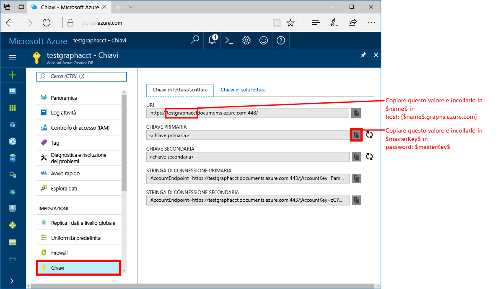
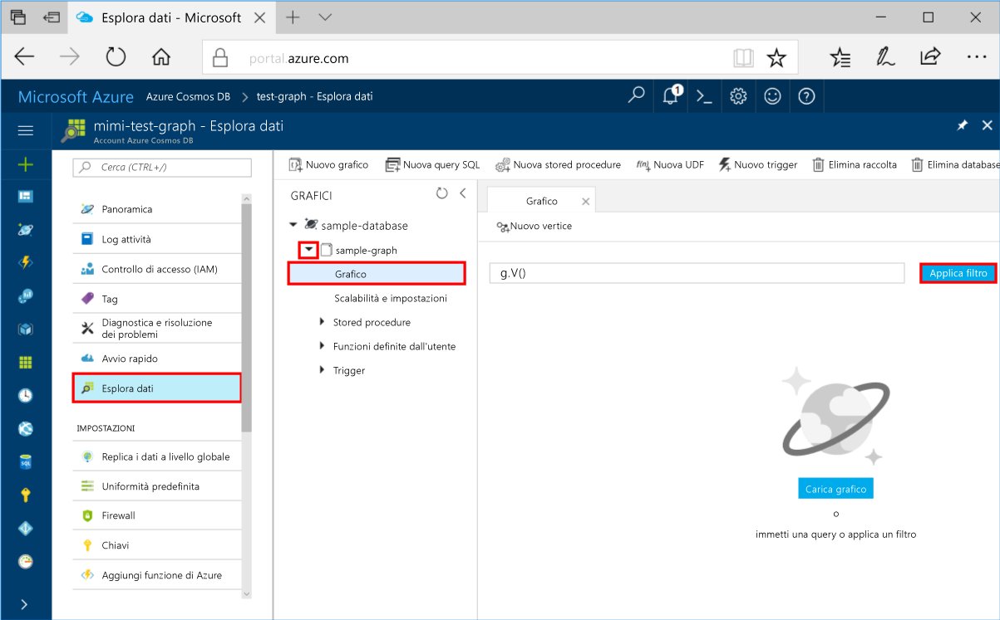
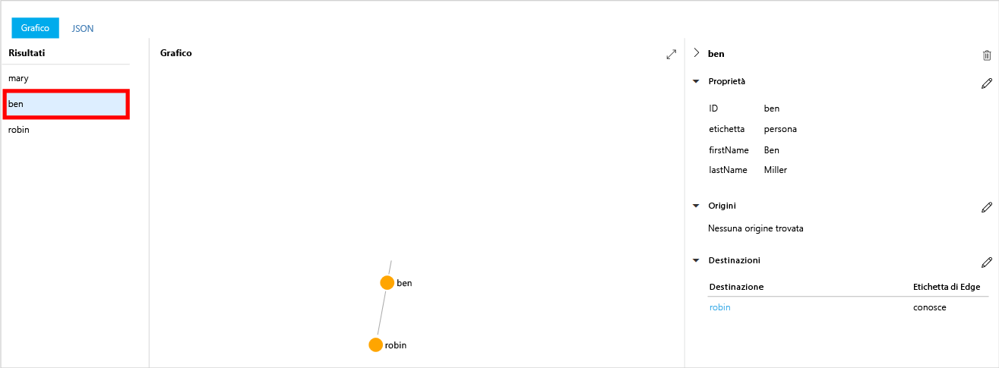
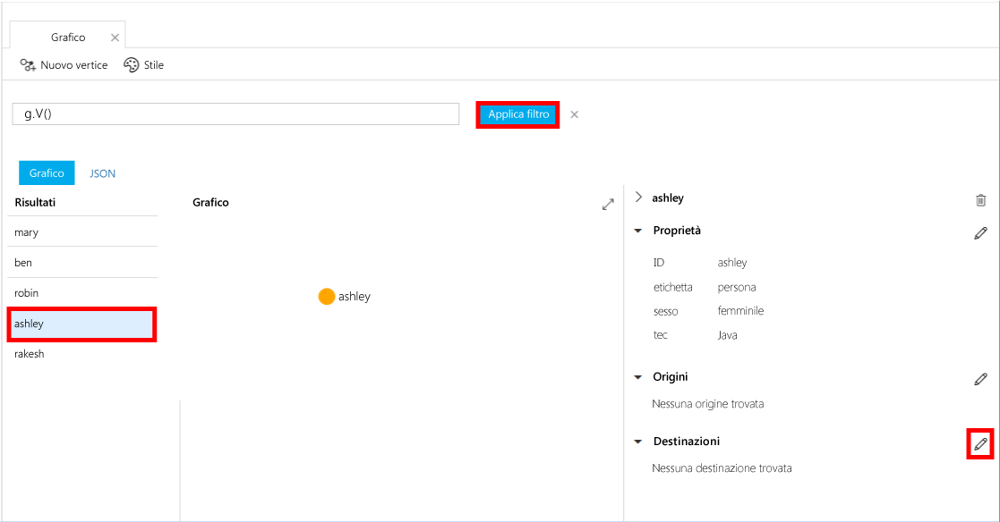
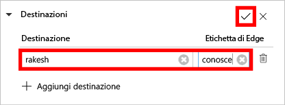
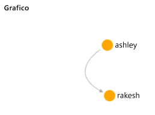

# <a name="azure-cosmos-db-create-a-graph-database-using-java-and-hello-azure-portal"></a><span data-ttu-id="0eb41-103">DB Cosmos Azure: Creare un database di graph tramite Java e hello portale di Azure</span><span class="sxs-lookup"><span data-stu-id="0eb41-103">Azure Cosmos DB: Create a graph database using Java and hello Azure portal</span></span>

<span data-ttu-id="0eb41-104">Azure Cosmos DB è il servizio di database multimodello distribuito a livello globale di Microsoft.</span><span class="sxs-lookup"><span data-stu-id="0eb41-104">Azure Cosmos DB is Microsoft’s globally distributed multi-model database service.</span></span> <span data-ttu-id="0eb41-105">Creare rapidamente e query chiave/valore, il documento e database grafico, ognuno dei quali trarre vantaggio dalla distribuzione globale hello e funzionalità di scalabilità orizzontale di base di Azure Cosmos DB hello.</span><span class="sxs-lookup"><span data-stu-id="0eb41-105">You can quickly create and query document, key/value, and graph databases, all of which benefit from hello global distribution and horizontal scale capabilities at hello core of Azure Cosmos DB.</span></span> 

<span data-ttu-id="0eb41-106">Questa Guida rapida viene creato un grafico utilizzando database hello gli strumenti del portale di Azure per Azure Cosmos DB.</span><span class="sxs-lookup"><span data-stu-id="0eb41-106">This quickstart creates a graph database using hello Azure portal tools for Azure Cosmos DB.</span></span> <span data-ttu-id="0eb41-107">Questa Guida rapida illustra anche come tooquickly creare un'applicazione console Java utilizzando un database di grafico con i sistemi operativi hello [Gremlin Java](https://mvnrepository.com/artifact/org.apache.tinkerpop/gremlin-driver) driver.</span><span class="sxs-lookup"><span data-stu-id="0eb41-107">This quickstart also shows you how tooquickly create a Java console app using a graph database using hello OSS [Gremlin Java](https://mvnrepository.com/artifact/org.apache.tinkerpop/gremlin-driver) driver.</span></span> <span data-ttu-id="0eb41-108">istruzioni di Hello in questa Guida rapida possono essere seguite in qualsiasi sistema operativo che è in grado di eseguire Java.</span><span class="sxs-lookup"><span data-stu-id="0eb41-108">hello instructions in this quickstart can be followed on any operating system that is capable of running Java.</span></span> <span data-ttu-id="0eb41-109">Questa Guida rapida consente di acquisire familiarità con la creazione e la modifica delle risorse di grafico in hello dell'interfaccia utente o a livello di codice, a seconda del valore è la preferenza.</span><span class="sxs-lookup"><span data-stu-id="0eb41-109">This quickstart familiarizes you with creating and modifying graph resources in either hello UI or programmatically, whichever is your preference.</span></span> 

## <a name="prerequisites"></a><span data-ttu-id="0eb41-110">Prerequisiti</span><span class="sxs-lookup"><span data-stu-id="0eb41-110">Prerequisites</span></span>

* [<span data-ttu-id="0eb41-111">Java Development Kit (JDK) 1.7+</span><span class="sxs-lookup"><span data-stu-id="0eb41-111">Java Development Kit (JDK) 1.7+</span></span>](http://www.oracle.com/technetwork/java/javase/downloads/jdk8-downloads-2133151.html)
    * <span data-ttu-id="0eb41-112">In Ubuntu, eseguire `apt-get install default-jdk` tooinstall hello JDK.</span><span class="sxs-lookup"><span data-stu-id="0eb41-112">On Ubuntu, run `apt-get install default-jdk` tooinstall hello JDK.</span></span>
    * <span data-ttu-id="0eb41-113">Essere tooset che hello JAVA_HOME ambiente variabile toopoint toohello cartella in cui è installato hello JDK.</span><span class="sxs-lookup"><span data-stu-id="0eb41-113">Be sure tooset hello JAVA_HOME environment variable toopoint toohello folder where hello JDK is installed.</span></span>
* <span data-ttu-id="0eb41-114">[Scaricare](http://maven.apache.org/download.cgi) e [installare](http://maven.apache.org/install.html) un archivio binario [Maven](http://maven.apache.org/)</span><span class="sxs-lookup"><span data-stu-id="0eb41-114">[Download](http://maven.apache.org/download.cgi) and [install](http://maven.apache.org/install.html) a [Maven](http://maven.apache.org/) binary archive</span></span>
    * <span data-ttu-id="0eb41-115">In Ubuntu, è possibile eseguire `apt-get install maven` tooinstall Maven.</span><span class="sxs-lookup"><span data-stu-id="0eb41-115">On Ubuntu, you can run `apt-get install maven` tooinstall Maven.</span></span>
* [<span data-ttu-id="0eb41-116">Git</span><span class="sxs-lookup"><span data-stu-id="0eb41-116">Git</span></span>](https://www.git-scm.com/)
    * <span data-ttu-id="0eb41-117">In Ubuntu, è possibile eseguire `sudo apt-get install git` tooinstall Git.</span><span class="sxs-lookup"><span data-stu-id="0eb41-117">On Ubuntu, you can run `sudo apt-get install git` tooinstall Git.</span></span>

[!INCLUDE [quickstarts-free-trial-note](../../includes/quickstarts-free-trial-note.md)]

## <a name="create-a-database-account"></a><span data-ttu-id="0eb41-118">Creare un account di database</span><span class="sxs-lookup"><span data-stu-id="0eb41-118">Create a database account</span></span>

<span data-ttu-id="0eb41-119">Prima di creare un database di grafico, è necessario un account di database Gremlin (grafico) con Azure Cosmos DB toocreate.</span><span class="sxs-lookup"><span data-stu-id="0eb41-119">Before you can create a graph database, you need toocreate a Gremlin (Graph) database account with Azure Cosmos DB.</span></span>

[!INCLUDE [cosmos-db-create-dbaccount-graph](../../includes/cosmos-db-create-dbaccount-graph.md)]

## <a name="add-a-graph"></a><span data-ttu-id="0eb41-120">Aggiungere un grafo</span><span class="sxs-lookup"><span data-stu-id="0eb41-120">Add a graph</span></span>

<span data-ttu-id="0eb41-121">A questo punto, è possibile utilizzare strumento di esplorazione dei dati hello in hello toocreate portale Azure un database di grafico.</span><span class="sxs-lookup"><span data-stu-id="0eb41-121">You can now use hello Data Explorer tool in hello Azure portal toocreate a graph database.</span></span> 

1. <span data-ttu-id="0eb41-122">Nel portale di Azure, nel menu di navigazione sinistro hello, hello fare clic su **Esplora dati (anteprima)**.</span><span class="sxs-lookup"><span data-stu-id="0eb41-122">In hello Azure portal, in hello left navigation menu, click **Data Explorer (Preview)**.</span></span> 
2. <span data-ttu-id="0eb41-123">In hello **Esplora dati (anteprima)** pannello, fare clic su **nuovo grafico**, quindi immettere nella pagina di hello mediante hello le seguenti informazioni:</span><span class="sxs-lookup"><span data-stu-id="0eb41-123">In hello **Data Explorer (Preview)** blade, click **New Graph**, then fill in hello page using hello following information:</span></span>

    

    <span data-ttu-id="0eb41-125">Impostazione</span><span class="sxs-lookup"><span data-stu-id="0eb41-125">Setting</span></span>|<span data-ttu-id="0eb41-126">Valore consigliato</span><span class="sxs-lookup"><span data-stu-id="0eb41-126">Suggested value</span></span>|<span data-ttu-id="0eb41-127">Descrizione</span><span class="sxs-lookup"><span data-stu-id="0eb41-127">Description</span></span>
    ---|---|---
    <span data-ttu-id="0eb41-128">ID database</span><span class="sxs-lookup"><span data-stu-id="0eb41-128">Database ID</span></span>|<span data-ttu-id="0eb41-129">sample-database</span><span class="sxs-lookup"><span data-stu-id="0eb41-129">sample-database</span></span>|<span data-ttu-id="0eb41-130">Hello ID per il nuovo database.</span><span class="sxs-lookup"><span data-stu-id="0eb41-130">hello ID for your new database.</span></span> <span data-ttu-id="0eb41-131">I nomi dei database devono avere una lunghezza compresa tra 1 e 255 caratteri e non possono contenere `/ \ # ?` o spazi finali.</span><span class="sxs-lookup"><span data-stu-id="0eb41-131">Database names must be between 1 and 255 characters, and cannot contain `/ \ # ?` or a trailing space.</span></span>
    <span data-ttu-id="0eb41-132">ID grafo</span><span class="sxs-lookup"><span data-stu-id="0eb41-132">Graph ID</span></span>|<span data-ttu-id="0eb41-133">sample-graph</span><span class="sxs-lookup"><span data-stu-id="0eb41-133">sample-graph</span></span>|<span data-ttu-id="0eb41-134">Hello ID per il nuovo grafico.</span><span class="sxs-lookup"><span data-stu-id="0eb41-134">hello ID for your new graph.</span></span> <span data-ttu-id="0eb41-135">I nomi dei grafici sono hello stesso carattere requisiti come ID di database.</span><span class="sxs-lookup"><span data-stu-id="0eb41-135">Graph names have hello same character requirements as database ids.</span></span>
    <span data-ttu-id="0eb41-136">Capacità di archiviazione</span><span class="sxs-lookup"><span data-stu-id="0eb41-136">Storage Capacity</span></span>| <span data-ttu-id="0eb41-137">10 GB</span><span class="sxs-lookup"><span data-stu-id="0eb41-137">10 GB</span></span>|<span data-ttu-id="0eb41-138">Lasciare il valore di predefinito hello.</span><span class="sxs-lookup"><span data-stu-id="0eb41-138">Leave hello default value.</span></span> <span data-ttu-id="0eb41-139">Questa è la capacità di archiviazione hello del database hello.</span><span class="sxs-lookup"><span data-stu-id="0eb41-139">This is hello storage capacity of hello database.</span></span>
    <span data-ttu-id="0eb41-140">Velocità effettiva</span><span class="sxs-lookup"><span data-stu-id="0eb41-140">Throughput</span></span>|<span data-ttu-id="0eb41-141">400 UR/s</span><span class="sxs-lookup"><span data-stu-id="0eb41-141">400 RUs</span></span>|<span data-ttu-id="0eb41-142">Lasciare il valore di predefinito hello.</span><span class="sxs-lookup"><span data-stu-id="0eb41-142">Leave hello default value.</span></span> <span data-ttu-id="0eb41-143">È possibile scalare in verticale della velocità effettiva hello in un secondo momento se si desidera tooreduce latenza.</span><span class="sxs-lookup"><span data-stu-id="0eb41-143">You can scale up hello throughput later if you want tooreduce latency.</span></span>
    <span data-ttu-id="0eb41-144">Chiave di partizione</span><span class="sxs-lookup"><span data-stu-id="0eb41-144">Partition key</span></span>|<span data-ttu-id="0eb41-145">Lasciare vuoto</span><span class="sxs-lookup"><span data-stu-id="0eb41-145">Leave blank</span></span>|<span data-ttu-id="0eb41-146">A scopo di hello di questa Guida rapida, lasciare vuota la chiave di partizione hello.</span><span class="sxs-lookup"><span data-stu-id="0eb41-146">For hello purpose of this quickstart, leave hello partition key blank.</span></span>

3. <span data-ttu-id="0eb41-147">Una volta compilato il modulo di hello, fare clic su **OK**.</span><span class="sxs-lookup"><span data-stu-id="0eb41-147">Once hello form is filled out, click **OK**.</span></span>

## <a name="clone-hello-sample-application"></a><span data-ttu-id="0eb41-148">Applicazione di esempio hello clonare</span><span class="sxs-lookup"><span data-stu-id="0eb41-148">Clone hello sample application</span></span>

<span data-ttu-id="0eb41-149">Ora si clonare un'app di grafico da github, impostare la stringa di connessione hello ed eseguirlo.</span><span class="sxs-lookup"><span data-stu-id="0eb41-149">Now let's clone a graph app from github, set hello connection string, and run it.</span></span> <span data-ttu-id="0eb41-150">Viene visualizzato quanto sia facile toowork con i dati a livello di codice.</span><span class="sxs-lookup"><span data-stu-id="0eb41-150">You see how easy it is toowork with data programmatically.</span></span> 

1. <span data-ttu-id="0eb41-151">Aprire una finestra terminale git, ad esempio git bash, e `cd` tooa directory di lavoro.</span><span class="sxs-lookup"><span data-stu-id="0eb41-151">Open a git terminal window, such as git bash, and `cd` tooa working directory.</span></span>  

2. <span data-ttu-id="0eb41-152">Eseguire hello seguenti repository di esempio di comando tooclone hello.</span><span class="sxs-lookup"><span data-stu-id="0eb41-152">Run hello following command tooclone hello sample repository.</span></span> 

    ```bash
    git clone https://github.com/Azure-Samples/azure-cosmos-db-graph-java-getting-started.git
    ```

## <a name="review-hello-code"></a><span data-ttu-id="0eb41-153">Esaminare il codice hello</span><span class="sxs-lookup"><span data-stu-id="0eb41-153">Review hello code</span></span>

<span data-ttu-id="0eb41-154">Questo punto, eseguire una rapida panoramica delle operazioni eseguite nell'applicazione hello.</span><span class="sxs-lookup"><span data-stu-id="0eb41-154">Let's make a quick review of what's happening in hello app.</span></span> <span data-ttu-id="0eb41-155">Aprire hello `Program.java` file dalla cartella \src\GetStarted hello e trovare le righe di codice.</span><span class="sxs-lookup"><span data-stu-id="0eb41-155">Open hello `Program.java` file from hello \src\GetStarted folder and find these lines of code.</span></span> 

* <span data-ttu-id="0eb41-156">Hello Gremlin `Client` viene inizializzato dalla configurazione hello in `src/remote.yaml`.</span><span class="sxs-lookup"><span data-stu-id="0eb41-156">hello Gremlin `Client` is initialized from hello configuration in `src/remote.yaml`.</span></span>

    ```java
    cluster = Cluster.build(new File("src/remote.yaml")).create();
    ...
    client = cluster.connect();
    ```

* <span data-ttu-id="0eb41-157">Una serie di passaggi Gremlin vengono eseguite utilizzando hello `client.submit` metodo.</span><span class="sxs-lookup"><span data-stu-id="0eb41-157">A series of Gremlin steps are executed using hello `client.submit` method.</span></span>

    ```java
    ResultSet results = client.submit(gremlin);

    CompletableFuture<List<Result>> completableFutureResults = results.all();
    List<Result> resultList = completableFutureResults.get();

    for (Result result : resultList) {
        System.out.println(result.toString());
    }
    ```

## <a name="update-your-connection-string"></a><span data-ttu-id="0eb41-158">Aggiornare la stringa di connessione</span><span class="sxs-lookup"><span data-stu-id="0eb41-158">Update your connection string</span></span>

1. <span data-ttu-id="0eb41-159">File src/remote.yaml hello aperto.</span><span class="sxs-lookup"><span data-stu-id="0eb41-159">Open hello src/remote.yaml file.</span></span> 

3. <span data-ttu-id="0eb41-160">Compilare il *host*, *username*, e *password* valori nel file src/remote.yaml hello.</span><span class="sxs-lookup"><span data-stu-id="0eb41-160">Fill in your *hosts*, *username*, and *password* values in hello src/remote.yaml file.</span></span> <span data-ttu-id="0eb41-161">altre Hello hello impostazioni non è necessario toobe modificato.</span><span class="sxs-lookup"><span data-stu-id="0eb41-161">hello rest of hello settings do not need toobe changed.</span></span>

    <span data-ttu-id="0eb41-162">Impostazione</span><span class="sxs-lookup"><span data-stu-id="0eb41-162">Setting</span></span>|<span data-ttu-id="0eb41-163">Valore consigliato</span><span class="sxs-lookup"><span data-stu-id="0eb41-163">Suggested value</span></span>|<span data-ttu-id="0eb41-164">Descrizione</span><span class="sxs-lookup"><span data-stu-id="0eb41-164">Description</span></span>
    ---|---|---
    <span data-ttu-id="0eb41-165">Hosts</span><span class="sxs-lookup"><span data-stu-id="0eb41-165">Hosts</span></span>|<span data-ttu-id="0eb41-166">[***.graphs.azure.com]</span><span class="sxs-lookup"><span data-stu-id="0eb41-166">[***.graphs.azure.com]</span></span>|<span data-ttu-id="0eb41-167">Vedere la figura hello segue questa tabella.</span><span class="sxs-lookup"><span data-stu-id="0eb41-167">See hello screenshot following this table.</span></span> <span data-ttu-id="0eb41-168">Questo valore è hello Gremlin URI nella pagina di panoramica hello del portale di Azure, tra parentesi quadre, hello finali hello: 443 / rimosso.</span><span class="sxs-lookup"><span data-stu-id="0eb41-168">This value is hello Gremlin URI value on hello Overview page of hello Azure portal, in square brackets, with hello trailing :443/ removed.</span></span><br><br><span data-ttu-id="0eb41-169">Questo valore può anche essere recuperato dalla scheda chiavi hello, usando il valore URI hello rimozione https://, la modifica di documenti toographs, nonché hello finali: 443 /.</span><span class="sxs-lookup"><span data-stu-id="0eb41-169">This value can also be retrieved from hello Keys tab, using hello URI value by removing https://, changing documents toographs, and removing hello trailing :443/.</span></span>
    <span data-ttu-id="0eb41-170">Username</span><span class="sxs-lookup"><span data-stu-id="0eb41-170">Username</span></span>|<span data-ttu-id="0eb41-171">/dbs/sample-database/colls/sample-graph</span><span class="sxs-lookup"><span data-stu-id="0eb41-171">/dbs/sample-database/colls/sample-graph</span></span>|<span data-ttu-id="0eb41-172">risorse del form hello Hello `/dbs/<db>/colls/<coll>` in `<db>` è il nome del database esistente e `<coll>` è il nome della raccolta esistente.</span><span class="sxs-lookup"><span data-stu-id="0eb41-172">hello resource of hello form `/dbs/<db>/colls/<coll>` where `<db>` is your existing database name and `<coll>` is your existing collection name.</span></span>
    <span data-ttu-id="0eb41-173">Password</span><span class="sxs-lookup"><span data-stu-id="0eb41-173">Password</span></span>|<span data-ttu-id="0eb41-174">*Chiave master primaria*</span><span class="sxs-lookup"><span data-stu-id="0eb41-174">*Your primary master key*</span></span>|<span data-ttu-id="0eb41-175">Vedere hello seconda figura è presente nella tabella seguente.</span><span class="sxs-lookup"><span data-stu-id="0eb41-175">See hello second screenshot following this table.</span></span> <span data-ttu-id="0eb41-176">Questo valore è la chiave primaria, che è possibile recuperare dalla pagina chiavi hello del portale di Azure, nella casella di chiave primaria hello hello.</span><span class="sxs-lookup"><span data-stu-id="0eb41-176">This value is your primary key, which you can retrieve from hello Keys page of hello Azure portal, in hello Primary Key box.</span></span> <span data-ttu-id="0eb41-177">Copiare il valore di hello utilizzando il pulsante di copia hello hello destra della casella hello.</span><span class="sxs-lookup"><span data-stu-id="0eb41-177">Copy hello value using hello copy button on hello right side of hello box.</span></span>

    <span data-ttu-id="0eb41-178">Per il valore di host hello, copiare hello **Gremlin URI** valore hello **Panoramica** pagina.</span><span class="sxs-lookup"><span data-stu-id="0eb41-178">For hello Hosts value, copy hello **Gremlin URI** value from hello **Overview** page.</span></span> <span data-ttu-id="0eb41-179">Se è vuota, vedere le istruzioni di hello nella riga hello host hello tabella sulla creazione di hello Gremlin URI dal pannello chiavi hello precedente.</span><span class="sxs-lookup"><span data-stu-id="0eb41-179">If it's empty, see hello instructions in hello Hosts row in hello preceding table about creating hello Gremlin URI from hello Keys blade.</span></span>
<span data-ttu-id="0eb41-180"></span><span class="sxs-lookup"><span data-stu-id="0eb41-180"></span></span>

    <span data-ttu-id="0eb41-181">Per il valore di Password hello, copiare hello **chiave primaria** da hello **chiavi** pannello: </span><span class="sxs-lookup"><span data-stu-id="0eb41-181">For hello Password value, copy hello **Primary key** from hello **Keys** blade: </span></span>

## <a name="run-hello-console-app"></a><span data-ttu-id="0eb41-182">Eseguire app console hello</span><span class="sxs-lookup"><span data-stu-id="0eb41-182">Run hello console app</span></span>

1. <span data-ttu-id="0eb41-183">Nella finestra terminale git hello, `cd` toohello azure-cosmos-db-graph-java-getting-started cartella.</span><span class="sxs-lookup"><span data-stu-id="0eb41-183">In hello git terminal window, `cd` toohello azure-cosmos-db-graph-java-getting-started folder.</span></span>

2. <span data-ttu-id="0eb41-184">Nella finestra terminal git hello, digitare `mvn package` tooinstall hello necessari pacchetti Java.</span><span class="sxs-lookup"><span data-stu-id="0eb41-184">In hello git terminal window, type `mvn package` tooinstall hello required Java packages.</span></span>

3. <span data-ttu-id="0eb41-185">Nella finestra terminale di hello git, eseguire `mvn exec:java -D exec.mainClass=GetStarted.Program` hello finestra terminale toostart l'applicazione Java.</span><span class="sxs-lookup"><span data-stu-id="0eb41-185">In hello git terminal window, run `mvn exec:java -D exec.mainClass=GetStarted.Program` in hello terminal window toostart your Java application.</span></span>

<span data-ttu-id="0eb41-186">finestra terminale Hello Visualizza vertici hello aggiunti toohello grafico.</span><span class="sxs-lookup"><span data-stu-id="0eb41-186">hello terminal window displays hello vertices being added toohello graph.</span></span> <span data-ttu-id="0eb41-187">Al termine del programma hello, passa indietro toohello portale di Azure nel browser internet.</span><span class="sxs-lookup"><span data-stu-id="0eb41-187">Once hello program completes, switch back toohello Azure portal in your internet browser.</span></span> 

<a id="add-sample-data"></a>
## <a name="review-and-add-sample-data"></a><span data-ttu-id="0eb41-188">Verificare e aggiungere dati di esempio</span><span class="sxs-lookup"><span data-stu-id="0eb41-188">Review and add sample data</span></span>

<span data-ttu-id="0eb41-189">È possibile tornare indietro tooData Explorer e vedere i vertici hello aggiunto toohello grafico e aggiungere ulteriori punti dati.</span><span class="sxs-lookup"><span data-stu-id="0eb41-189">You can now go back tooData Explorer and see hello vertices added toohello graph, and add additional data points.</span></span>

1. <span data-ttu-id="0eb41-190">In Esplora dati espandere hello **database di esempio**/**grafico di esempio**, fare clic su **grafico**, quindi fare clic su **Applica filtro**.</span><span class="sxs-lookup"><span data-stu-id="0eb41-190">In Data Explorer, expand hello **sample-database**/**sample-graph**, click **Graph**, and then click **Apply Filter**.</span></span> 

   

2. <span data-ttu-id="0eb41-192">In hello **risultati** elenco, l'aggiunta di nuovi utenti hello toohello grafico.</span><span class="sxs-lookup"><span data-stu-id="0eb41-192">In hello **Results** list, notice hello new users added toohello graph.</span></span> <span data-ttu-id="0eb41-193">Selezionare **ben** e notare che si è connesso toorobin.</span><span class="sxs-lookup"><span data-stu-id="0eb41-193">Select **ben** and notice that he's connected toorobin.</span></span> <span data-ttu-id="0eb41-194">È possibile spostarsi vertici hello in Esplora grafico hello, ingrandire e ridurre ed espandere hello dimensioni dell'area di Esplora grafico hello.</span><span class="sxs-lookup"><span data-stu-id="0eb41-194">You can move hello vertices around on hello graph explorer, zoom in and out, and expand hello size of hello graph explorer surface.</span></span> 

   

3. <span data-ttu-id="0eb41-196">Aggiungere alcuni nuovo grafico toohello di utenti con hello Esplora dati.</span><span class="sxs-lookup"><span data-stu-id="0eb41-196">Let's add a few new users toohello graph using hello Data Explorer.</span></span> <span data-ttu-id="0eb41-197">Fare clic su hello **nuovi Vertex** grafico tooyour dati tooadd di pulsante.</span><span class="sxs-lookup"><span data-stu-id="0eb41-197">Click hello **New Vertex** button tooadd data tooyour graph.</span></span>

   

4. <span data-ttu-id="0eb41-199">Immettere un'etichetta di *persona* quindi immettere hello seguenti chiavi e valori primo vertice hello toocreate nel grafico hello.</span><span class="sxs-lookup"><span data-stu-id="0eb41-199">Enter a label of *person* then enter hello following keys and values toocreate hello first vertex in hello graph.</span></span> <span data-ttu-id="0eb41-200">Si noti che è possibile creare proprietà univoche per ogni persona del grafo.</span><span class="sxs-lookup"><span data-stu-id="0eb41-200">Notice that you can create unique properties for each person in your graph.</span></span> <span data-ttu-id="0eb41-201">È necessaria solo hello id chiave.</span><span class="sxs-lookup"><span data-stu-id="0eb41-201">Only hello id key is required.</span></span>

    <span data-ttu-id="0eb41-202">key</span><span class="sxs-lookup"><span data-stu-id="0eb41-202">key</span></span>|<span data-ttu-id="0eb41-203">value</span><span class="sxs-lookup"><span data-stu-id="0eb41-203">value</span></span>|<span data-ttu-id="0eb41-204">Note</span><span class="sxs-lookup"><span data-stu-id="0eb41-204">Notes</span></span>
    ----|----|----
    <span data-ttu-id="0eb41-205">id</span><span class="sxs-lookup"><span data-stu-id="0eb41-205">id</span></span>|<span data-ttu-id="0eb41-206">ashley</span><span class="sxs-lookup"><span data-stu-id="0eb41-206">ashley</span></span>|<span data-ttu-id="0eb41-207">Identificatore univoco di Hello per vertice hello.</span><span class="sxs-lookup"><span data-stu-id="0eb41-207">hello unique identifier for hello vertex.</span></span> <span data-ttu-id="0eb41-208">Se non si specifica alcun ID, ne verrà generato automaticamente uno.</span><span class="sxs-lookup"><span data-stu-id="0eb41-208">If you don't specify an id, one is generated for you.</span></span>
    <span data-ttu-id="0eb41-209">gender</span><span class="sxs-lookup"><span data-stu-id="0eb41-209">gender</span></span>|<span data-ttu-id="0eb41-210">female</span><span class="sxs-lookup"><span data-stu-id="0eb41-210">female</span></span>| 
    <span data-ttu-id="0eb41-211">tech</span><span class="sxs-lookup"><span data-stu-id="0eb41-211">tech</span></span> | <span data-ttu-id="0eb41-212">java</span><span class="sxs-lookup"><span data-stu-id="0eb41-212">java</span></span> | 

    > [!NOTE]
    > <span data-ttu-id="0eb41-213">In questa esercitazione introduttiva viene creata una raccolta non partizionata.</span><span class="sxs-lookup"><span data-stu-id="0eb41-213">In this quickstart we create a non-partitioned collection.</span></span> <span data-ttu-id="0eb41-214">Tuttavia, se si crea una raccolta partizionata specificando una chiave di partizione durante la creazione dell'insieme di hello, è necessario chiave di partizione hello tooinclude come chiave in ogni nuovo vertice.</span><span class="sxs-lookup"><span data-stu-id="0eb41-214">However, if you create a partitioned collection by specifying a partition key during hello collection creation, then you need tooinclude hello partition key as a key in each new vertex.</span></span> 

5. <span data-ttu-id="0eb41-215">Fare clic su **OK**.</span><span class="sxs-lookup"><span data-stu-id="0eb41-215">Click **OK**.</span></span> <span data-ttu-id="0eb41-216">Potrebbe essere necessario tooexpand toosee la schermata **OK** nella parte inferiore di hello della schermata di hello.</span><span class="sxs-lookup"><span data-stu-id="0eb41-216">You may need tooexpand your screen toosee **OK** on hello bottom of hello screen.</span></span>

6. <span data-ttu-id="0eb41-217">Fare di nuovo clic su **New Vertex** (Nuovo vertice) e aggiungere un altro nuovo utente.</span><span class="sxs-lookup"><span data-stu-id="0eb41-217">Click **New Vertex** again and add an additional new user.</span></span> <span data-ttu-id="0eb41-218">Immettere un'etichetta di *persona* quindi immettere il seguente hello chiavi e valori:</span><span class="sxs-lookup"><span data-stu-id="0eb41-218">Enter a label of *person* then enter hello following keys and values:</span></span>

    <span data-ttu-id="0eb41-219">key</span><span class="sxs-lookup"><span data-stu-id="0eb41-219">key</span></span>|<span data-ttu-id="0eb41-220">value</span><span class="sxs-lookup"><span data-stu-id="0eb41-220">value</span></span>|<span data-ttu-id="0eb41-221">Note</span><span class="sxs-lookup"><span data-stu-id="0eb41-221">Notes</span></span>
    ----|----|----
    <span data-ttu-id="0eb41-222">id</span><span class="sxs-lookup"><span data-stu-id="0eb41-222">id</span></span>|<span data-ttu-id="0eb41-223">rakesh</span><span class="sxs-lookup"><span data-stu-id="0eb41-223">rakesh</span></span>|<span data-ttu-id="0eb41-224">Identificatore univoco di Hello per vertice hello.</span><span class="sxs-lookup"><span data-stu-id="0eb41-224">hello unique identifier for hello vertex.</span></span> <span data-ttu-id="0eb41-225">Se non si specifica alcun ID, ne verrà generato automaticamente uno.</span><span class="sxs-lookup"><span data-stu-id="0eb41-225">If you don't specify an id, one is generated for you.</span></span>
    <span data-ttu-id="0eb41-226">gender</span><span class="sxs-lookup"><span data-stu-id="0eb41-226">gender</span></span>|<span data-ttu-id="0eb41-227">male</span><span class="sxs-lookup"><span data-stu-id="0eb41-227">male</span></span>| 
    <span data-ttu-id="0eb41-228">school</span><span class="sxs-lookup"><span data-stu-id="0eb41-228">school</span></span>|<span data-ttu-id="0eb41-229">MIT</span><span class="sxs-lookup"><span data-stu-id="0eb41-229">MIT</span></span>| 

7. <span data-ttu-id="0eb41-230">Fare clic su **OK**.</span><span class="sxs-lookup"><span data-stu-id="0eb41-230">Click **OK**.</span></span> 

8. <span data-ttu-id="0eb41-231">Fare clic su **Applica filtro** predefinito hello `g.V()` filtro.</span><span class="sxs-lookup"><span data-stu-id="0eb41-231">Click **Apply Filter** with hello default `g.V()` filter.</span></span> <span data-ttu-id="0eb41-232">Tutti gli utenti di hello ora Mostra in hello **risultati** elenco.</span><span class="sxs-lookup"><span data-stu-id="0eb41-232">All of hello users now show in hello **Results** list.</span></span> <span data-ttu-id="0eb41-233">Quando si aggiungono più dati, è possibile utilizzare i filtri toolimit i risultati.</span><span class="sxs-lookup"><span data-stu-id="0eb41-233">As you add more data, you can use filters toolimit your results.</span></span> <span data-ttu-id="0eb41-234">Per impostazione predefinita, si utilizza Esplora dati `g.V()` tooretrieve tutti i vertici in un grafico, ma è possono modificare tale tooa diversi [query graph](tutorial-query-graph.md), ad esempio `g.V().count()`, tooreturn un conteggio di tutti i vertici hello nel grafico hello in formato JSON.</span><span class="sxs-lookup"><span data-stu-id="0eb41-234">By default, Data Explorer uses `g.V()` tooretrieve all vertices in a graph, but you can change that tooa different [graph query](tutorial-query-graph.md), such as `g.V().count()`, tooreturn a count of all hello vertices in hello graph in JSON format.</span></span>

9. <span data-ttu-id="0eb41-235">È ora possibile connettere rakesh e ashley.</span><span class="sxs-lookup"><span data-stu-id="0eb41-235">Now we can connect rakesh and ashley.</span></span> <span data-ttu-id="0eb41-236">Verificare **Alice** in selezionata nel hello **risultati** elenco, quindi fare clic su pulsante Modifica hello Avanti troppo**destinazioni** nel lato inferiore destro.</span><span class="sxs-lookup"><span data-stu-id="0eb41-236">Ensure **ashley** in selected in hello **Results** list, then click hello edit button next too**Targets** on lower right side.</span></span> <span data-ttu-id="0eb41-237">Potrebbe essere necessario toowiden il hello toosee finestra **proprietà** area.</span><span class="sxs-lookup"><span data-stu-id="0eb41-237">You may need toowiden your window toosee hello **Properties** area.</span></span>

   

10. <span data-ttu-id="0eb41-239">In hello **destinazione** digitare *rakesh*e in hello **etichetta Edge** nella casella *sa*e quindi fare clic sulla casella di controllo hello.</span><span class="sxs-lookup"><span data-stu-id="0eb41-239">In hello **Target** box type *rakesh*, and in hello **Edge label** box type *knows*, and then click hello check box.</span></span>

   

11. <span data-ttu-id="0eb41-241">A questo punto selezionare **rakesh** dall'elenco dei risultati hello e vedere che Alice e rakesh siano connessi.</span><span class="sxs-lookup"><span data-stu-id="0eb41-241">Now select **rakesh** from hello results list and see that ashley and rakesh are connected.</span></span> 

   

    <span data-ttu-id="0eb41-243">È inoltre possibile utilizzare Esplora dati toocreate stored procedure, funzioni definite dall'utente e anche logica di business sul lato server tooperform trigger come velocità effettiva di scala.</span><span class="sxs-lookup"><span data-stu-id="0eb41-243">You can also use Data Explorer toocreate stored procedures, UDFs, and triggers tooperform server-side business logic as well as scale throughput.</span></span> <span data-ttu-id="0eb41-244">Esplora dati espone tutti hello predefinite a livello di codice l'accesso ai dati disponibile in hello API, ma fornisce un accesso semplice tooyour dati hello portale di Azure.</span><span class="sxs-lookup"><span data-stu-id="0eb41-244">Data Explorer exposes all of hello built-in programmatic data access available in hello APIs, but provides easy access tooyour data in hello Azure portal.</span></span>


## <a name="review-slas-in-hello-azure-portal"></a><span data-ttu-id="0eb41-245">Esaminare i contratti di servizio nel portale di Azure hello</span><span class="sxs-lookup"><span data-stu-id="0eb41-245">Review SLAs in hello Azure portal</span></span>

[!INCLUDE [cosmosdb-tutorial-review-slas](../../includes/cosmos-db-tutorial-review-slas.md)]

## <a name="clean-up-resources"></a><span data-ttu-id="0eb41-246">Pulire le risorse</span><span class="sxs-lookup"><span data-stu-id="0eb41-246">Clean up resources</span></span>

<span data-ttu-id="0eb41-247">Se non si ha intenzione toocontinue toouse questa app, eliminare tutte le risorse create da questa Guida rapida hello portale di Azure con hello alla procedura seguente:</span><span class="sxs-lookup"><span data-stu-id="0eb41-247">If you're not going toocontinue toouse this app, delete all resources created by this quickstart in hello Azure portal with hello following steps:</span></span> 

1. <span data-ttu-id="0eb41-248">Dal menu a sinistra di hello in hello portale di Azure, fare clic su **gruppi di risorse** e quindi fare clic su nome hello della risorsa di hello è stato creato.</span><span class="sxs-lookup"><span data-stu-id="0eb41-248">From hello left-hand menu in hello Azure portal, click **Resource groups** and then click hello name of hello resource you created.</span></span> 
2. <span data-ttu-id="0eb41-249">Nella pagina di gruppo di risorse, fare clic su **eliminare**, digitare il nome di hello di hello risorsa toodelete nella casella di testo hello e quindi fare clic su **eliminare**.</span><span class="sxs-lookup"><span data-stu-id="0eb41-249">On your resource group page, click **Delete**, type hello name of hello resource toodelete in hello text box, and then click **Delete**.</span></span>

## <a name="next-steps"></a><span data-ttu-id="0eb41-250">Passaggi successivi</span><span class="sxs-lookup"><span data-stu-id="0eb41-250">Next steps</span></span>

<span data-ttu-id="0eb41-251">In questa Guida rapida, si è appreso come creare un grafico utilizzando Esplora dati hello toocreate un account Azure Cosmos DB ed eseguire un'app.</span><span class="sxs-lookup"><span data-stu-id="0eb41-251">In this quickstart, you've learned how toocreate an Azure Cosmos DB account, create a graph using hello Data Explorer, and run an app.</span></span> <span data-ttu-id="0eb41-252">È ora possibile creare query più complesse e implementare la potente logica di attraversamento dei grafi usando Gremlin.</span><span class="sxs-lookup"><span data-stu-id="0eb41-252">You can now build more complex queries and implement powerful graph traversal logic using Gremlin.</span></span> 

> [!div class="nextstepaction"]
> [<span data-ttu-id="0eb41-253">Eseguire query con Gremlin</span><span class="sxs-lookup"><span data-stu-id="0eb41-253">Query using Gremlin</span></span>](tutorial-query-graph.md)

