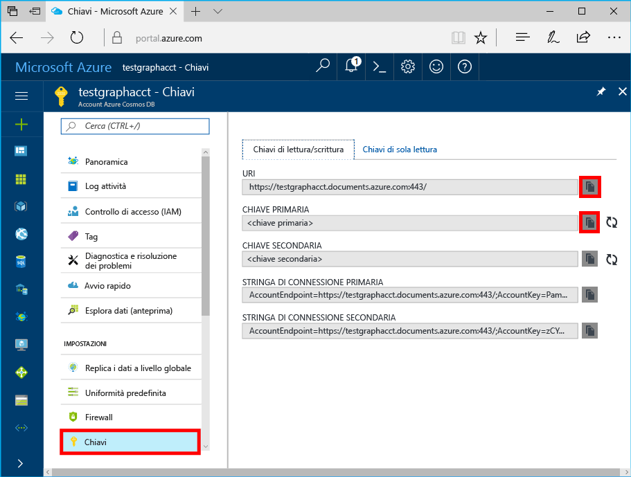

# <a name="azure-cosmos-db-build-a-nodejs-application-by-using-graph-api"></a>Azure Cosmos DB: Creare un'applicazione Node.js tramite l'API Graph

Azure DB Cosmos è servizio di database più modelli hello globale distribuito da Microsoft. Creare rapidamente e query chiave/valore, il documento e database grafico, ognuno dei quali trarre vantaggio dalla distribuzione globale hello e funzionalità di scalabilità orizzontale di base di Azure Cosmos DB hello. 

In questo articolo Guida introduttiva viene illustrato come un database di Azure Cosmos toocreate account per l'API Graph (anteprima), database e grafico tramite hello portale di Azure. Quindi compilazione e l'esecuzione di un'applicazione console tramite hello open source [Gremlin Node.js](https://www.npmjs.com/package/gremlin-secure) driver.  

> [!NOTE]
> modulo npm Hello `gremlin-secure` è una versione modificata di `gremlin` modulo, con supporto per SSL e SASL necessari per la connessione con Azure Cosmos DB. Il codice sorgente è disponibile su [Github](https://github.com/CosmosDB/gremlin-javascript).
>

## <a name="prerequisites"></a>Prerequisiti

Prima di poter eseguire questo esempio, è necessario disporre di hello seguenti prerequisiti:
* [Node.js](https://nodejs.org/en/) versione v0.10.29 o versioni successive
* [Git](http://git-scm.com/)

[!INCLUDE [quickstarts-free-trial-note](../../includes/quickstarts-free-trial-note.md)]

## <a name="create-a-database-account"></a>Creare un account di database

[!INCLUDE [cosmos-db-create-dbaccount-graph](../../includes/cosmos-db-create-dbaccount-graph.md)]

## <a name="add-a-graph"></a>Aggiungere un grafo

[!INCLUDE [cosmos-db-create-graph](../../includes/cosmos-db-create-graph.md)]

## <a name="clone-hello-sample-application"></a>Applicazione di esempio hello clonare

Ora si app clone un'API Graph da GitHub, impostare la stringa di connessione hello ed eseguirlo. Si noterà quanto sia facile toowork con i dati a livello di codice. 

1. Aprire una finestra terminale Git, ad esempio Git Bash e modificare (tramite `cd` comando) tooa directory di lavoro.  

2. Eseguire hello seguenti repository di esempio di comando tooclone hello. 

    ```bash
    git clone https://github.com/Azure-Samples/azure-cosmos-db-graph-nodejs-getting-started.git
    ```

3. Aprire il file di soluzione hello in Visual Studio. 

## <a name="review-hello-code"></a>Esaminare il codice hello

Questo punto, eseguire una rapida panoramica delle operazioni eseguite nell'applicazione hello. Aprire hello `app.js` file ed è possibile trovare hello righe di codice seguente. 

* Hello Gremlin client è stato creato.

    ```nodejs
    const client = Gremlin.createClient(
        443, 
        config.endpoint, 
        { 
            "session": false, 
            "ssl": true, 
            "user": `/dbs/${config.database}/colls/${config.collection}`,
            "password": config.primaryKey
        });
    ```

  salve le configurazioni sono tutti in `config.js`, che le modifiche apportate nella seguente sezione hello.

* Una serie di passaggi Gremlin vengono eseguiti con hello `client.execute` metodo.

    ```nodejs
    console.log('Running Count'); 
    client.execute("g.V().count()", { }, (err, results) => {
        if (err) return console.error(err);
        console.log(JSON.stringify(results));
        console.log();
    });
    ```

## <a name="update-your-connection-string"></a>Aggiornare la stringa di connessione

1. File config.js hello aperto. 

2. Nella config.js, inserire nella chiave config.endpoint hello con hello **Gremlin URI** valore hello **Panoramica** pagina del portale di Azure hello. 

    `config.endpoint = "GRAPHENDPOINT";`

    

   Se hello **Gremlin URI** valore è vuoto, è possibile generare il valore di hello da hello **chiavi** pagina nel portale di hello utilizzando hello **URI** valore, rimozione https:// e la modifica toographs documenti.

   endpoint Gremlin Hello deve essere solo nome host di hello senza un numero di porta o protocollo hello, ad esempio `mygraphdb.graphs.azure.com` (non `https://mygraphdb.graphs.azure.com` o `mygraphdb.graphs.azure.com:433`).

3. Nella config.js, inserire il valore config.primaryKey hello con hello **chiave primaria** valore hello **chiavi** pagina del portale di Azure hello. 

    `config.primaryKey = "PRIMARYKEY";`

   

4. Immettere il nome di database hello e nome del grafico (contenitore) per il valore di hello di config.database e config.collection. 

Ecco un esempio dell'aspetto che dovrebbe avere il file config.js completato:

```nodejs
var config = {}

// Note that this must not have HTTPS or hello port number
config.endpoint = "testgraphacct.graphs.azure.com";
config.primaryKey = "Pams6e7LEUS7LJ2Qk0fjZf3eGo65JdMWHmyn65i52w8ozPX2oxY3iP0yu05t9v1WymAHNcMwPIqNAEv3XDFsEg==";
config.database = "graphdb"
config.collection = "Persons"

module.exports = config;
```

## <a name="run-hello-console-app"></a>Eseguire app console hello

1. Aprire una finestra terminale e modificare (tramite `cd` comando) toohello directory di installazione per il file package. JSON hello incluso nel progetto hello.  

2. Eseguire `npm install` tooinstall hello necessari moduli npm, inclusi `gremlin-secure`.

3. Eseguire `node app.js` in un terminal toostart l'applicazione del nodo.

## <a name="browse-with-data-explorer"></a>Esplorare con Esplora dati

È ora possibile tornare tooData Esplora in hello tooview portale Azure, eseguire query, modificare e lavorare con i nuovi dati del grafico.

In Esplora dati hello nuovo database verrà visualizzato in hello **grafici** riquadro. Espandere database hello, seguito da una raccolta di hello, quindi fare clic su **grafico**.

dati Hello generati dall'applicazione di esempio hello viene visualizzati nel riquadro successivo di hello all'interno di hello **grafico** scheda quando si fa clic **Applica filtro**.

Provare a completare `g.V()` con `.has('firstName', 'Thomas')` filtro hello tootest. Si noti che il valore di hello tra maiuscole e minuscole.

## <a name="review-slas-in-hello-azure-portal"></a>Esaminare i contratti di servizio nel portale di Azure hello

[!INCLUDE [cosmosdb-tutorial-review-slas](../../includes/cosmos-db-tutorial-review-slas.md)]

## <a name="clean-up-your-resources"></a>Pulire le risorse

Se non si prevede toocontinue utilizzando questa app, eliminare tutte le risorse che è stato creato in questo articolo eseguendo hello seguenti: 

1. Nel portale di Azure, nel menu di navigazione sinistro hello, hello fare clic su **gruppi di risorse**, quindi fare clic su nome hello della risorsa di hello creato. 
2. Nella pagina di gruppo di risorse, fare clic su **eliminare**, digitare il nome di hello di hello risorsa toobe eliminato e quindi fare clic su **eliminare**.

## <a name="next-steps"></a>Passaggi successivi

In questo articolo, si è appreso come creare un grafico utilizzando Esplora dati, un account Azure Cosmos DB, toocreate ed eseguire un'app. È ora possibile creare query più complesse e implementare la potente logica di attraversamento dei grafi usando Gremlin. 

> [!div class="nextstepaction"]
> [Eseguire query con Gremlin](tutorial-query-graph.md)
