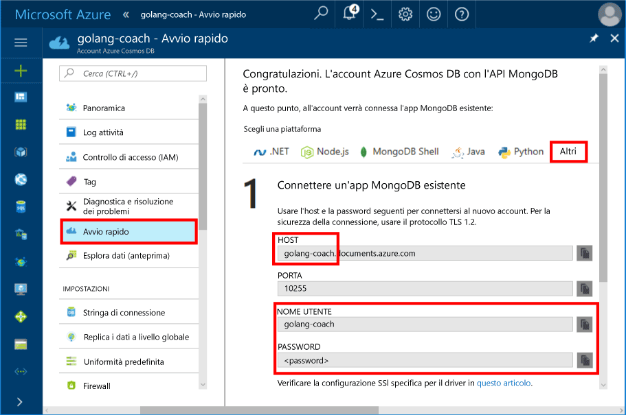
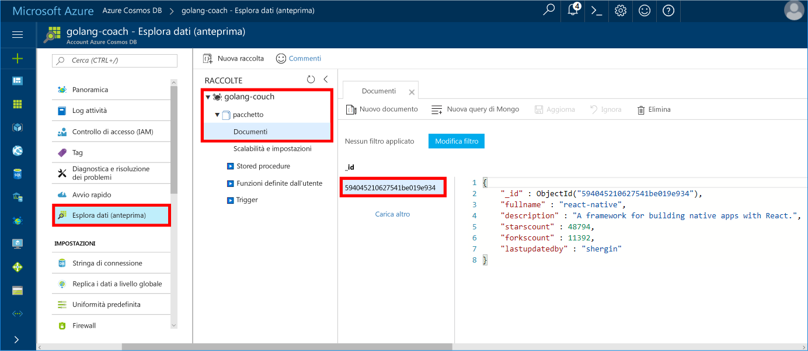

# <a name="azure-cosmos-db-build-a-mongodb-api-console-app-with-golang-and-hello-azure-portal"></a>Azure DB Cosmos: Compilare un'applicazione console API MongoDB con Golang e hello portale di Azure

Azure Cosmos DB è il servizio di database multimodello distribuito a livello globale di Microsoft. Creare rapidamente e query chiave/valore, il documento e database grafico, ognuno dei quali trarre vantaggio dalla distribuzione globale hello e funzionalità di scalabilità orizzontale di base di Azure Cosmos DB hello.

Questa Guida introduttiva illustra come toouse esistente [MongoDB](https://docs.microsoft.com/en-us/azure/cosmos-db/mongodb-introduction) app scritta in [Golang](https://golang.org/) e connetterla tooyour DB Cosmos Azure database, che supporta le connessioni client di MongoDB.

In altre parole, l'applicazione di Golang riconosce solo che viene stabilita la connessione database tooa utilizzando APIs MongoDB. È trasparente toohello applicazione hello dati viene archiviato nel database di Azure Cosmos.

## <a name="prerequisites"></a>Prerequisiti

- Una sottoscrizione di Azure. Se non si ha una sottoscrizione di Azure, creare un [account gratuito](https://azure.microsoft.com/free) prima di iniziare.
- [Passare](https://golang.org/dl/) e una conoscenza di base di hello [passare](https://golang.org/) language.
- Un IDE. [Gogland](https://www.jetbrains.com/go/) di Jetbrains, [Visual Studio Code](https://code.visualstudio.com/) di Microsoft o [Atom](https://atom.io/). In questa esercitazione si usa Gogland.

<a id="create-account"></a>
## <a name="create-a-database-account"></a>Creare un account di database

[!INCLUDE [cosmos-db-create-dbaccount](../../includes/cosmos-db-create-dbaccount-mongodb.md)]

## <a name="clone-hello-sample-application"></a>Applicazione di esempio hello clonare

Duplicare l'applicazione di esempio hello e installare i pacchetti hello necessario.

1. Creare una cartella denominata CosmosDBSample cartella hello GOROOT\src, ovvero C:\Go\ per impostazione predefinita.
2. Eseguire hello comando utilizzando una finestra terminale git, ad esempio l'archivio di git bash tooclone hello esempio nella cartella CosmosDBSample hello seguente. 

    ```bash
    git clone https://github.com/Azure-Samples/azure-cosmos-db-mongodb-golang-getting-started.git
    ```
3.  Eseguire hello seguente pacchetto mgo hello tooget di comando. 

    ```
    go get gopkg.in/mgo.v2
    ```

Hello [mgo](http://labix.org/mgo) driver (si pronuncia come *mango*) è un [MongoDB](http://www.mongodb.org/) driver per hello [passare language](http://golang.org/) che implementa un RTF e testato selezione di funzionalità in un'API molto semplice seguente idiomi Go standard.

<a id="connection-string"></a>

## <a name="update-your-connection-string"></a>Aggiornare la stringa di connessione

Tornare toohello tooget portale Azure le informazioni sulla stringa di connessione e copiarla in app hello.

1. Fare clic su **introduttiva** in hello dal menu di navigazione a sinistra e quindi fare clic su **altri** sulle stringhe di tooview hello connessione richieste dal hello applicazione Go.

2. Nel Goglang, aprire il file di main.go hello nella directory GOROOT\CosmosDBSample hello e aggiorna hello seguenti righe di codice utilizzando informazioni della stringa di connessione hello da hello portale di Azure, come illustrato nella seguente schermata hello. 

    nome del Database Hello è il prefisso hello di hello **Host** valore nel riquadro di stringa di connessione del portale di Azure hello. Per l'account di hello illustrato nell'immagine di hello riportata di seguito, il nome di Database hello è golang autobus.

    ```go
    Database: "hello prefix of hello Host value in hello Azure portal",
    Username: "hello Username in hello Azure portal",
    Password: "hello Password in hello Azure portal",
    ```

    

3. Salvare il file di main.go hello.

## <a name="review-hello-code"></a>Esaminare il codice hello

Questo punto, eseguire una rapida panoramica delle operazioni eseguite nel file main.go hello. 

### <a name="connecting-hello-go-app-tooazure-cosmos-db"></a>Connessione hello Go app tooAzure Cosmos DB

DB Cosmos Azure supporta hello MongoDB abilitato per SSL. tooconnect tooan MongoDB abilitato per SSL, è necessario hello toodefine **DialServer** funzionare in [mgo. DialInfo](http://gopkg.in/mgo.v2#DialInfo)e utilizzare di hello [tls. *Connessione* ](http://golang.org/pkg/crypto/tls#Dial) funzione connessione hello tooperform.

Hello seguente frammento di codice Golang connette hello Go app con l'API di Azure Cosmos DB MongoDB. Hello *DialInfo* classe contiene le opzioni per stabilire una sessione con un cluster di MongoDB.

```go
// DialInfo holds options for establishing a session with a MongoDB cluster.
dialInfo := &mgo.DialInfo{
    Addrs:    []string{"golang-couch.documents.azure.com:10255"}, // Get HOST + PORT
    Timeout:  60 * time.Second,
    Database: "database", // It can be anything
    Username: "username", // Username
    Password: "Azure database connect password from Azure Portal", // PASSWORD
    DialServer: func(addr *mgo.ServerAddr) (net.Conn, error) {
        return tls.Dial("tcp", addr.String(), &tls.Config{})
    },
}

// Create a session which maintains a pool of socket connections
// tooour Azure Cosmos DB MongoDB database.
session, err := mgo.DialWithInfo(dialInfo)

if err != nil {
    fmt.Printf("Can't connect toomongo, go error %v\n", err)
    os.Exit(1)
}

defer session.Close()

// SetSafe changes hello session safety mode.
// If hello safe parameter is nil, hello session is put in unsafe mode, 
// and writes become fire-and-forget,
// without error checking. hello unsafe mode is faster since operations won't hold on waiting for a confirmation.
// 
session.SetSafe(&mgo.Safe{})
```

Hello **mgo. Dial()** metodo viene utilizzato quando è presente alcuna connessione SSL. Per una connessione SSL, hello **mgo. DialWithInfo()** metodo è obbligatorio.

Un'istanza di hello **{} DialWIthInfo** è oggetto di sessione utilizzato toocreate hello. Una volta stabilita la sessione hello, è possibile accedere raccolta hello utilizzando hello frammento di codice seguente:

```go
collection := session.DB(“database”).C(“package”)
```

<a id="create-document"></a>

### <a name="create-a-document"></a>Creare un documento

```go
// Model
type Package struct {
    Id bson.ObjectId  `bson:"_id,omitempty"`
    FullName      string
    Description   string
    StarsCount    int
    ForksCount    int
    LastUpdatedBy string
}

// insert Document in collection
err = collection.Insert(&Package{
    FullName:"react",
    Description:"A framework for building native apps with React.",
    ForksCount: 11392,
    StarsCount:48794,
    LastUpdatedBy:"shergin",

})

if err != nil {
    log.Fatal("Problem inserting data: ", err)
    return
}
```

### <a name="query-or-read-a-document"></a>Leggere o eseguire query in un documento

Azure Cosmos DB supporta query avanzate sui documenti JSON archiviati in ogni raccolta. Hello codice di esempio seguente viene illustrata una query che è possibile eseguire sui documenti hello nella raccolta.

```go
// Get a Document from hello collection
result := Package{}
err = collection.Find(bson.M{"fullname": "react"}).One(&result)
if err != nil {
    log.Fatal("Error finding record: ", err)
    return
}

fmt.Println("Description:", result.Description)
```


### <a name="update-a-document"></a>Aggiornare un documento

```go
// Update a document
updateQuery := bson.M{"_id": result.Id}
change := bson.M{"$set": bson.M{"fullname": "react-native"}}
err = collection.Update(updateQuery, change)
if err != nil {
    log.Fatal("Error updating record: ", err)
    return
}
```

### <a name="delete-a-document"></a>Eliminare un documento

Azure Cosmos DB supporta l'eliminazione di documenti JSON.

```go
// Delete a document
query := bson.M{"_id": result.Id}
err = collection.Remove(query)
if err != nil {
   log.Fatal("Error deleting record: ", err)
   return
}
```
    
## <a name="run-hello-app"></a>Eseguire app hello

1. In Goglang, assicurarsi che il GOPATH (disponibile in **File**, **impostazioni**, **passare**, **GOPATH**) includono hello percorso nel quale hello gopkg è stato installato, ovvero USERPROFILE\go per impostazione predefinita. 
2. Commento le righe di hello che Elimina documento hello, righe 91 a 96, in modo che è possibile visualizzare il documento hello dopo l'applicazione hello in esecuzione.
3. In Gogland fare clic su **Run** (Esegui) e quindi su **Run 'Build main.go and run'** (Esegui 'Compila main.go ed esegui').

    app Hello termina e viene visualizzata la descrizione hello del documento hello creata [creare un documento](#create-document).
    
    ```
    Description: A framework for building native apps with React.
    
    Process finished with exit code 0
    ```

    
    
## <a name="review-your-document-in-data-explorer"></a>Esaminare il documento in Esplora dati

Tornare toohello toosee portale di Azure in Esplora dati del documento.

1. Fare clic su **Esplora dati (anteprima)** nel menu di navigazione a sinistra, hello espandere **golang autobus**, **pacchetto**, quindi fare clic su **documenti**. In hello **documenti** scheda, fare clic su hello \_documento hello toodisplay di id nel riquadro di destra hello. 

    
    
2. È possibile quindi utilizzare hello documento inline e fare clic su **aggiornamento** toosave è. È possibile eliminare il documento hello o creare nuovi documenti o query.

## <a name="review-slas-in-hello-azure-portal"></a>Esaminare i contratti di servizio nel portale di Azure hello

[!INCLUDE [cosmosdb-tutorial-review-slas](../../includes/cosmos-db-tutorial-review-slas.md)]

## <a name="clean-up-resources"></a>Pulire le risorse

Se non si ha intenzione toocontinue toouse questa app, eliminare tutte le risorse create da questa Guida rapida hello portale di Azure con hello alla procedura seguente:

1. Dal menu a sinistra di hello in hello portale di Azure, fare clic su **gruppi di risorse** e quindi fare clic su nome hello della risorsa di hello è stato creato. 
2. Nella pagina di gruppo di risorse, fare clic su **eliminare**, digitare il nome di hello di hello risorsa toodelete nella casella di testo hello e quindi fare clic su **eliminare**.

## <a name="next-steps"></a>Passaggi successivi

In questa Guida rapida, si è appreso come un account Azure Cosmos DB toocreate ed eseguire un'app Golang usando hello API per MongoDB. È ora possibile importare account Cosmos DB tooyour di dati aggiuntivi. 

> [!div class="nextstepaction"]
> [Importare dati in Azure Cosmos DB per hello MongoDB API](mongodb-migrate.md)
