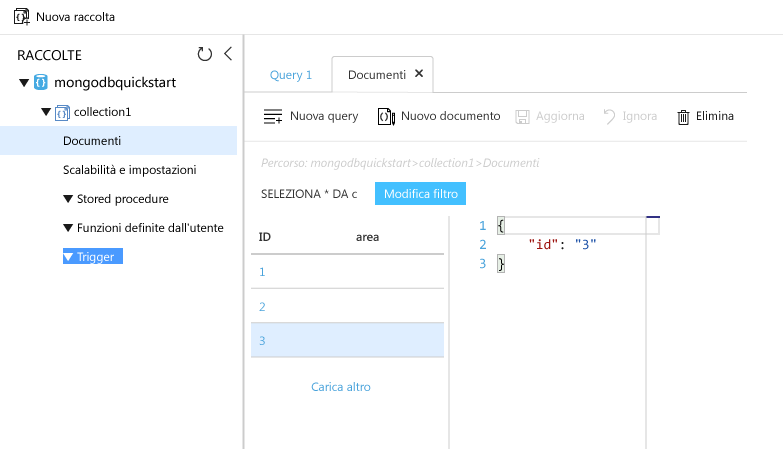

# <a name="azure-cosmos-db-migrate-an-existing-nodejs-mongodb-web-app"></a><span data-ttu-id="d8415-103">Azure Cosmos DB: Eseguire la migrazione di un'app Web MongoDB Node.js esistente</span><span class="sxs-lookup"><span data-stu-id="d8415-103">Azure Cosmos DB: Migrate an existing Node.js MongoDB web app</span></span> 

<span data-ttu-id="d8415-104">Azure Cosmos DB è il servizio di database multimodello distribuito a livello globale di Microsoft.</span><span class="sxs-lookup"><span data-stu-id="d8415-104">Azure Cosmos DB is Microsoft’s globally distributed multi-model database service.</span></span> <span data-ttu-id="d8415-105">È possibile creare ed eseguire rapidamente query su database di documenti, coppie chiave/valore e grafi, sfruttando in ognuno dei casi i vantaggi offerti dalle funzionalità di scalabilità orizzontale e distribuzione globale alla base di Azure Cosmos DB.</span><span class="sxs-lookup"><span data-stu-id="d8415-105">You can quickly create and query document, key/value, and graph databases, all of which benefit from the global distribution and horizontal scale capabilities at the core of Azure Cosmos DB.</span></span> 

<span data-ttu-id="d8415-106">Questa guida di avvio rapido illustra come usare un'app [MongoDB](mongodb-introduction.md) esistente scritta in Node.js e connetterla al database Azure Cosmos DB, che supporta le connessioni client MongoDB.</span><span class="sxs-lookup"><span data-stu-id="d8415-106">This quickstart demonstrates how to use an existing [MongoDB](mongodb-introduction.md) app written in Node.js and connect it to your Azure Cosmos DB database, which supports MongoDB client connections.</span></span> <span data-ttu-id="d8415-107">In altre parole, l'applicazione Node.js sa solo che si sta connettendo a un database usando le API MongoDB.</span><span class="sxs-lookup"><span data-stu-id="d8415-107">In other words, your Node.js application only knows that it's connecting to a database using MongoDB APIs.</span></span> <span data-ttu-id="d8415-108">Il fatto che i dati siano archiviati in Azure Cosmos DB è trasparente per l'applicazione.</span><span class="sxs-lookup"><span data-stu-id="d8415-108">It is transparent to the application that the data is stored in Azure Cosmos DB.</span></span>

<span data-ttu-id="d8415-109">Al termine, si avrà un'applicazione MEAN (MongoDB, Express, AngularJS e Node.js) in esecuzione in [Azure Cosmos DB](https://azure.microsoft.com/services/cosmos-db/).</span><span class="sxs-lookup"><span data-stu-id="d8415-109">When you are done, you will have a MEAN application (MongoDB, Express, AngularJS, and Node.js) running on [Azure Cosmos DB](https://azure.microsoft.com/services/cosmos-db/).</span></span> 


[!INCLUDE [cloud-shell-try-it](../../includes/cloud-shell-try-it.md)]

<span data-ttu-id="d8415-111">Se si sceglie di installare e usare l'interfaccia della riga di comando in locale, per questo argomento è necessario eseguire la versione 2.0 o successiva dell'interfaccia della riga di comando di Azure.</span><span class="sxs-lookup"><span data-stu-id="d8415-111">If you choose to install and use the CLI locally, this topic requires that you are running the Azure CLI version 2.0 or later.</span></span> <span data-ttu-id="d8415-112">Eseguire `az --version` per trovare la versione.</span><span class="sxs-lookup"><span data-stu-id="d8415-112">Run `az --version` to find the version.</span></span> <span data-ttu-id="d8415-113">Se è necessario eseguire l'installazione o l'aggiornamento, vedere [Installare l'interfaccia della riga di comando di Azure 2.0]( /cli/azure/install-azure-cli).</span><span class="sxs-lookup"><span data-stu-id="d8415-113">If you need to install or upgrade, see [Install Azure CLI 2.0]( /cli/azure/install-azure-cli).</span></span> 

## <a name="prerequisites"></a><span data-ttu-id="d8415-114">Prerequisiti</span><span class="sxs-lookup"><span data-stu-id="d8415-114">Prerequisites</span></span> 
<span data-ttu-id="d8415-115">Oltre all'interfaccia della riga di comando di Azure, è necessario che [Node.js](https://nodejs.org/) e [Git](http://www.git-scm.com/downloads) siano installati localmente per eseguire i comandi `npm` e `git`.</span><span class="sxs-lookup"><span data-stu-id="d8415-115">In addition to Azure CLI, you need [Node.js](https://nodejs.org/) and [Git](http://www.git-scm.com/downloads) installed locally to run `npm` and `git` commands.</span></span>

<span data-ttu-id="d8415-116">È necessario saper usare Node.js.</span><span class="sxs-lookup"><span data-stu-id="d8415-116">You should have working knowledge of Node.js.</span></span> <span data-ttu-id="d8415-117">Questa guida di avvio rapido non ha lo scopo di offrire informazioni generali sullo sviluppo di applicazioni Node.js.</span><span class="sxs-lookup"><span data-stu-id="d8415-117">This quickstart is not intended to help you with developing Node.js applications in general.</span></span>

## <a name="clone-the-sample-application"></a><span data-ttu-id="d8415-118">Clonare l'applicazione di esempio</span><span class="sxs-lookup"><span data-stu-id="d8415-118">Clone the sample application</span></span>

<span data-ttu-id="d8415-119">Aprire una finestra del terminale Git, ad esempio Git Bash, ed eseguire il comando `cd` per passare a una directory di lavoro.</span><span class="sxs-lookup"><span data-stu-id="d8415-119">Open a git terminal window, such as git bash, and `cd` to a working directory.</span></span>  

<span data-ttu-id="d8415-120">Eseguire i comandi seguenti per clonare il repository di esempio.</span><span class="sxs-lookup"><span data-stu-id="d8415-120">Run the following commands to clone the sample repository.</span></span> <span data-ttu-id="d8415-121">Questo archivio di esempio contiene l'applicazione [MEAN.js](http://meanjs.org/) predefinita.</span><span class="sxs-lookup"><span data-stu-id="d8415-121">This sample repository contains the default [MEAN.js](http://meanjs.org/) application.</span></span> 

```bash
git clone https://github.com/prashanthmadi/mean
```

## <a name="run-the-application"></a><span data-ttu-id="d8415-122">Eseguire l'applicazione</span><span class="sxs-lookup"><span data-stu-id="d8415-122">Run the application</span></span>

<span data-ttu-id="d8415-123">Installare i pacchetti necessari e avviare l'applicazione.</span><span class="sxs-lookup"><span data-stu-id="d8415-123">Install the required packages and start the application.</span></span>

```bash
cd mean
npm install
npm start
```

## <a name="log-in-to-azure"></a><span data-ttu-id="d8415-124">Accedere ad Azure</span><span class="sxs-lookup"><span data-stu-id="d8415-124">Log in to Azure</span></span>

<span data-ttu-id="d8415-125">Se si usa un'interfaccia della riga di comando di Azure installata, accedere alla sottoscrizione di Azure con il comando [az login](/cli/azure/#login) e seguire le istruzioni visualizzate.</span><span class="sxs-lookup"><span data-stu-id="d8415-125">If you are using an installed Azure CLI, log in to your Azure subscription with the [az login](/cli/azure/#login) command and follow the on-screen directions.</span></span> <span data-ttu-id="d8415-126">Se si usa Azure Cloud Shell, è possibile ignorare questo passaggio.</span><span class="sxs-lookup"><span data-stu-id="d8415-126">You can skip this step if you're using the Azure Cloud Shell.</span></span>

```azurecli
az login 
``` 
   
## <a name="add-the-azure-cosmos-db-module"></a><span data-ttu-id="d8415-127">Aggiungere il modulo Azure Cosmos DB</span><span class="sxs-lookup"><span data-stu-id="d8415-127">Add the Azure Cosmos DB module</span></span>

<span data-ttu-id="d8415-128">Se si usa un'interfaccia della riga di comando di Azure installata, verificare se il componente `cosmosdb` è già installato eseguendo il comando `az`.</span><span class="sxs-lookup"><span data-stu-id="d8415-128">If you are using an installed Azure CLI, check to see if the `cosmosdb` component is already installed by running the `az` command.</span></span> <span data-ttu-id="d8415-129">Se `cosmosdb` è nell'elenco di comandi di base, passare al comando successivo.</span><span class="sxs-lookup"><span data-stu-id="d8415-129">If `cosmosdb` is in the list of base commands, proceed to the next command.</span></span> <span data-ttu-id="d8415-130">Se si usa Azure Cloud Shell, è possibile ignorare questo passaggio.</span><span class="sxs-lookup"><span data-stu-id="d8415-130">You can skip this step if you're using the Azure Cloud Shell.</span></span>

<span data-ttu-id="d8415-131">Se `cosmosdb` non è nell'elenco dei comandi di base, reinstallare l'[interfaccia della riga di comando di Azure 2.0]( /cli/azure/install-azure-cli).</span><span class="sxs-lookup"><span data-stu-id="d8415-131">If `cosmosdb` is not in the list of base commands, reinstall [Azure CLI 2.0]( /cli/azure/install-azure-cli).</span></span>

## <a name="create-a-resource-group"></a><span data-ttu-id="d8415-132">Creare un gruppo di risorse</span><span class="sxs-lookup"><span data-stu-id="d8415-132">Create a resource group</span></span>

<span data-ttu-id="d8415-133">Creare un [gruppo di risorse](../azure-resource-manager/resource-group-overview.md) con il comando [az group create](/cli/azure/group#create).</span><span class="sxs-lookup"><span data-stu-id="d8415-133">Create a [resource group](../azure-resource-manager/resource-group-overview.md) with the [az group create](/cli/azure/group#create).</span></span> <span data-ttu-id="d8415-134">Un gruppo di risorse di Azure è un contenitore logico in cui vengono distribuite e gestite risorse di Azure come app Web, database e account di archiviazione.</span><span class="sxs-lookup"><span data-stu-id="d8415-134">An Azure resource group is a logical container into which Azure resources like web apps, databases and storage accounts are deployed and managed.</span></span> 

<span data-ttu-id="d8415-135">L'esempio seguente crea un gruppo di risorse nell'area Europa occidentale.</span><span class="sxs-lookup"><span data-stu-id="d8415-135">The following example creates a resource group in the West Europe region.</span></span> <span data-ttu-id="d8415-136">Scegliere un nome univoco per il gruppo di risorse.</span><span class="sxs-lookup"><span data-stu-id="d8415-136">Choose a unique name for the resource group.</span></span>

<span data-ttu-id="d8415-137">Se si usa Azure Cloud Shell, fare clic su **Prova**, seguire le istruzioni visualizzate per eseguire l'accesso e quindi copiare il comando al prompt dei comandi.</span><span class="sxs-lookup"><span data-stu-id="d8415-137">If you are using Azure Cloud Shell, click **Try It**, follow the onscreen prompts to login, then copy the command into the command prompt.</span></span>

```azurecli-interactive
az group create --name myResourceGroup --location "West Europe"
```

## <a name="create-an-azure-cosmos-db-account"></a><span data-ttu-id="d8415-138">Creare un account Azure Cosmos DB</span><span class="sxs-lookup"><span data-stu-id="d8415-138">Create an Azure Cosmos DB account</span></span>

<span data-ttu-id="d8415-139">Creare un account Azure Cosmos DB con il comando [az cosmosdb create](/cli/azure/cosmosdb#create).</span><span class="sxs-lookup"><span data-stu-id="d8415-139">Create an Azure Cosmos DB account with the [az cosmosdb create](/cli/azure/cosmosdb#create) command.</span></span>

<span data-ttu-id="d8415-140">Nel comando seguente sostituire il segnaposto `<cosmosdb-name>` con il nome univoco dell'account Azure Cosmos DB.</span><span class="sxs-lookup"><span data-stu-id="d8415-140">In the following command, please substitute your own unique Azure Cosmos DB account name where you see the `<cosmosdb-name>` placeholder.</span></span> <span data-ttu-id="d8415-141">Questo nome univoco verrà usato come parte dell'endpoint di Azure Cosmos DB, `https://<cosmosdb-name>.documents.azure.com/`, pertanto deve essere univoco rispetto a tutti gli account Azure Cosmos DB presenti in Azure.</span><span class="sxs-lookup"><span data-stu-id="d8415-141">This unique name will be used as part of your Azure Cosmos DB endpoint (`https://<cosmosdb-name>.documents.azure.com/`), so the name needs to be unique across all Azure Cosmos DB accounts in Azure.</span></span> 

```azurecli-interactive
az cosmosdb create --name <cosmosdb-name> --resource-group myResourceGroup --kind MongoDB
```

<span data-ttu-id="d8415-142">Il parametro `--kind MongoDB` consente le connessioni al client MongoDB.</span><span class="sxs-lookup"><span data-stu-id="d8415-142">The `--kind MongoDB` parameter enables MongoDB client connections.</span></span>

<span data-ttu-id="d8415-143">Dopo la creazione dell'account Azure Cosmos DB, l'interfaccia della riga di comando di Azure mostra informazioni simili all'esempio seguente.</span><span class="sxs-lookup"><span data-stu-id="d8415-143">When the Azure Cosmos DB account is created, the Azure CLI shows information similar to the following example.</span></span> 

> [!NOTE]
> <span data-ttu-id="d8415-144">Questo esempio usa JSON come formato di output dell'interfaccia della riga di comando di Azure, ovvero l'impostazione predefinita.</span><span class="sxs-lookup"><span data-stu-id="d8415-144">This example uses JSON as the Azure CLI output format, which is the default.</span></span> <span data-ttu-id="d8415-145">Per usare un altro formato di output, vedere [Formati di output per i comandi dell'interfaccia della riga di comando di Azure 2.0](https://docs.microsoft.com/cli/azure/format-output-azure-cli).</span><span class="sxs-lookup"><span data-stu-id="d8415-145">To use another output format, see [Output formats for Azure CLI 2.0 commands](https://docs.microsoft.com/cli/azure/format-output-azure-cli).</span></span>

```json
{
  "databaseAccountOfferType": "Standard",
  "documentEndpoint": "https://<cosmosdb-name>.documents.azure.com:443/",
  "id": "/subscriptions/00000000-0000-0000-0000-000000000000/resourceGroups/myResourceGroup/providers/Microsoft.Document
DB/databaseAccounts/<cosmosdb-name>",
  "kind": "MongoDB",
  "location": "West Europe",
  "name": "<cosmosdb-name>",
  "readLocations": [
    {
      "documentEndpoint": "https://<cosmosdb-name>-westeurope.documents.azure.com:443/",
      "failoverPriority": 0,
      "id": "<cosmosdb-name>-westeurope",
      "locationName": "West Europe",
      "provisioningState": "Succeeded"
    }
  ],
  "resourceGroup": "myResourceGroup",
  "type": "Microsoft.DocumentDB/databaseAccounts",
  "writeLocations": [
    {
      "documentEndpoint": "https://<cosmosdb-name>-westeurope.documents.azure.com:443/",
      "failoverPriority": 0,
      "id": "<cosmosdb-name>-westeurope",
      "locationName": "West Europe",
      "provisioningState": "Succeeded"
    }
  ]
} 
```

## <a name="connect-your-nodejs-application-to-the-database"></a><span data-ttu-id="d8415-146">Connettere l'applicazione Node.js al database</span><span class="sxs-lookup"><span data-stu-id="d8415-146">Connect your Node.js application to the database</span></span>

<span data-ttu-id="d8415-147">In questo passaggio si usa una stringa di connessione MongoDB per connettere l'applicazione di esempio MEAN.js a un database Azure Cosmos DB appena creato.</span><span class="sxs-lookup"><span data-stu-id="d8415-147">In this step, you connect your MEAN.js sample application to an Azure Cosmos DB database you just created, using a MongoDB connection string.</span></span> 

<a name="devconfig"></a>
## <a name="configure-the-connection-string-in-your-nodejs-application"></a><span data-ttu-id="d8415-148">Configurare la stringa di connessione nell'applicazione Node.js</span><span class="sxs-lookup"><span data-stu-id="d8415-148">Configure the connection string in your Node.js application</span></span>

<span data-ttu-id="d8415-149">Nel repository di MEAN.js aprire `config/env/local-development.js`.</span><span class="sxs-lookup"><span data-stu-id="d8415-149">In your MEAN.js repository, open `config/env/local-development.js`.</span></span>

<span data-ttu-id="d8415-150">Sostituire il contenuto del file con il codice seguente.</span><span class="sxs-lookup"><span data-stu-id="d8415-150">Replace the content of this file with the following code.</span></span> <span data-ttu-id="d8415-151">Assicurarsi di sostituire anche i due segnaposto `<cosmosdb-name>` con il nome dell'account Azure Cosmos DB.</span><span class="sxs-lookup"><span data-stu-id="d8415-151">Be sure to also replace the two `<cosmosdb-name>` placeholders with your Azure Cosmos DB account name.</span></span>

```javascript
'use strict';

module.exports = {
  db: {
    uri: 'mongodb://<cosmosdb-name>:<primary_master_key>@<cosmosdb-name>.documents.azure.com:10255/mean-dev?ssl=true&sslverifycertificate=false'
  }
};
```

## <a name="retrieve-the-key"></a><span data-ttu-id="d8415-152">Recuperare la chiave</span><span class="sxs-lookup"><span data-stu-id="d8415-152">Retrieve the key</span></span>

<span data-ttu-id="d8415-153">Per connettersi a un database Azure Cosmos DB, è necessaria la chiave del database.</span><span class="sxs-lookup"><span data-stu-id="d8415-153">In order to connect to an Azure Cosmos DB database, you need the database key.</span></span> <span data-ttu-id="d8415-154">Usare il comando [az cosmosdb list-keys](/cli/azure/cosmosdb#list-keys) per recuperare la chiave primaria.</span><span class="sxs-lookup"><span data-stu-id="d8415-154">Use the [az cosmosdb list-keys](/cli/azure/cosmosdb#list-keys) command to retrieve the primary key.</span></span>

```azurecli-interactive
az cosmosdb list-keys --name <cosmosdb-name> --resource-group myResourceGroup --query "primaryMasterKey"
```

<span data-ttu-id="d8415-155">L'interfaccia della riga di comando di Azure restituisce informazioni simili all'esempio seguente.</span><span class="sxs-lookup"><span data-stu-id="d8415-155">The Azure CLI outputs information similar to the following example.</span></span> 

```json
"RUayjYjixJDWG5xTqIiXjC..."
```

<span data-ttu-id="d8415-156">Copiare il valore di `primaryMasterKey`.</span><span class="sxs-lookup"><span data-stu-id="d8415-156">Copy the value of `primaryMasterKey`.</span></span> <span data-ttu-id="d8415-157">Incollarlo tramite `<primary_master_key>` in `local-development.js`.</span><span class="sxs-lookup"><span data-stu-id="d8415-157">Paste this over the  `<primary_master_key>` in `local-development.js`.</span></span>

<span data-ttu-id="d8415-158">Salvare le modifiche.</span><span class="sxs-lookup"><span data-stu-id="d8415-158">Save your changes.</span></span>

### <a name="run-the-application-again"></a><span data-ttu-id="d8415-159">Eseguire di nuovo l'applicazione.</span><span class="sxs-lookup"><span data-stu-id="d8415-159">Run the application again.</span></span>

<span data-ttu-id="d8415-160">Eseguire di nuovo `npm start`.</span><span class="sxs-lookup"><span data-stu-id="d8415-160">Run `npm start` again.</span></span> 

```bash
npm start
```

<span data-ttu-id="d8415-161">Un messaggio della console dovrebbe ora indicare che l'ambiente di sviluppo è operativo.</span><span class="sxs-lookup"><span data-stu-id="d8415-161">A console message should now tell you that the development environment is up and running.</span></span> 

<span data-ttu-id="d8415-162">Andare a `http://localhost:3000` in un browser.</span><span class="sxs-lookup"><span data-stu-id="d8415-162">Navigate to `http://localhost:3000` in a browser.</span></span> <span data-ttu-id="d8415-163">Fare clic su **Iscrizione** nel menu in alto e provare a creare due utenti fittizi.</span><span class="sxs-lookup"><span data-stu-id="d8415-163">Click **Sign Up** in the top menu and try to create two dummy users.</span></span> 

<span data-ttu-id="d8415-164">L'applicazione di esempio MEAN.js archivia i dati utente nel database.</span><span class="sxs-lookup"><span data-stu-id="d8415-164">The MEAN.js sample application stores user data in the database.</span></span> <span data-ttu-id="d8415-165">Se l'operazione ha esito positivo e l'applicazione MEAN.js accede automaticamente all'utente creato, la connessione ad Azure Cosmos DB funziona.</span><span class="sxs-lookup"><span data-stu-id="d8415-165">If you are successful and MEAN.js automatically signs into the created user, then your Azure Cosmos DB connection is working.</span></span> 


## <a name="view-data-in-data-explorer"></a><span data-ttu-id="d8415-167">Visualizzare i dati in Esplora dati</span><span class="sxs-lookup"><span data-stu-id="d8415-167">View data in Data Explorer</span></span>

<span data-ttu-id="d8415-168">I dati archiviati da Azure Cosmos DB sono disponibili per la visualizzazione, l'esecuzione di query e l'esecuzione di logica di business nel portale di Azure.</span><span class="sxs-lookup"><span data-stu-id="d8415-168">Data stored by an Azure Cosmos DB is available to view, query, and run business-logic on in the Azure portal.</span></span>

<span data-ttu-id="d8415-169">Per visualizzare e usare i dati utente creati nel passaggio precedente, nonché eseguire query su di essi, accedere al [portale di Azure](https://portal.azure.com) nel Web browser.</span><span class="sxs-lookup"><span data-stu-id="d8415-169">To view, query, and work with the user data created in the previous step, login to the [Azure portal](https://portal.azure.com) in your web browser.</span></span>

<span data-ttu-id="d8415-170">Nella casella di ricerca nella parte superiore digitare Azure Cosmos DB.</span><span class="sxs-lookup"><span data-stu-id="d8415-170">In the top Search box, type Azure Cosmos DB.</span></span> <span data-ttu-id="d8415-171">Quando il pannello dell'account Cosmos DB si apre, selezionare l'account Cosmos DB.</span><span class="sxs-lookup"><span data-stu-id="d8415-171">When your Cosmos DB account blade opens, select your Cosmos DB account.</span></span> <span data-ttu-id="d8415-172">Nel riquadro di spostamento a sinistra fare clic su Esplora dati.</span><span class="sxs-lookup"><span data-stu-id="d8415-172">In the left navigation, click Data Explorer.</span></span> <span data-ttu-id="d8415-173">Espandere la raccolta nel riquadro Raccolte. Sarà quindi possibile visualizzare i documenti nella raccolta, eseguire query sui dati e anche creare ed eseguire stored procedure, trigger e funzioni definite dall'utente.</span><span class="sxs-lookup"><span data-stu-id="d8415-173">Expand your collection in the Collections pane, and then you can view the documents in the collection, query the data, and even create and run stored procedures, triggers, and UDFs.</span></span> 




## <a name="deploy-the-nodejs-application-to-azure"></a><span data-ttu-id="d8415-175">Distribuire l'applicazione Node.js in Azure</span><span class="sxs-lookup"><span data-stu-id="d8415-175">Deploy the Node.js application to Azure</span></span>

<span data-ttu-id="d8415-176">In questo passaggio si distribuisce l'applicazione Node.js connessa a MongoDB in Azure Cosmos DB.</span><span class="sxs-lookup"><span data-stu-id="d8415-176">In this step, you deploy your MongoDB-connected Node.js application to Azure Cosmos DB.</span></span>

<span data-ttu-id="d8415-177">Si sarà probabilmente notato che il file di configurazione modificato in precedenza è per l'ambiente di sviluppo (`/config/env/local-development.js`).</span><span class="sxs-lookup"><span data-stu-id="d8415-177">You may have noticed that the configuration file that you changed earlier is for the development environment (`/config/env/local-development.js`).</span></span> <span data-ttu-id="d8415-178">Quando si distribuisce l'applicazione nel servizio app, per impostazione predefinita viene eseguita nell'ambiente di produzione.</span><span class="sxs-lookup"><span data-stu-id="d8415-178">When you deploy your application to App Service, it will run in the production environment by default.</span></span> <span data-ttu-id="d8415-179">A questo punto, è quindi necessario apportare la stessa modifica al file di configurazione corrispondente.</span><span class="sxs-lookup"><span data-stu-id="d8415-179">So now, you need to make the same change to the respective configuration file.</span></span>

<span data-ttu-id="d8415-180">Nel repository di MEAN.js aprire `config/env/production.js`.</span><span class="sxs-lookup"><span data-stu-id="d8415-180">In your MEAN.js repository, open `config/env/production.js`.</span></span>

<span data-ttu-id="d8415-181">Nell'oggetto `db` sostituire il valore di `uri` come mostrato nell'esempio seguente.</span><span class="sxs-lookup"><span data-stu-id="d8415-181">In the `db` object, replace the value of `uri` as show in the following example.</span></span> <span data-ttu-id="d8415-182">Assicurarsi di sostituire i segnaposto come fatto in precedenza.</span><span class="sxs-lookup"><span data-stu-id="d8415-182">Be sure to replace the placeholders as before.</span></span>

```javascript
'mongodb://<cosmosdb-name>:<primary_master_key>@<cosmosdb-name>.documents.azure.com:10255/mean?ssl=true&sslverifycertificate=false',
```

> [!NOTE] 
> <span data-ttu-id="d8415-183">L'opzione `ssl=true` è importante perché [Azure Cosmos DB richiede l'uso di SSL](connect-mongodb-account.md#connection-string-requirements).</span><span class="sxs-lookup"><span data-stu-id="d8415-183">The `ssl=true` option is important because [Azure Cosmos DB requires SSL](connect-mongodb-account.md#connection-string-requirements).</span></span> 
>
>

<span data-ttu-id="d8415-184">Nel terminale eseguire il commit tutte le modifiche in Git.</span><span class="sxs-lookup"><span data-stu-id="d8415-184">In the terminal, commit all your changes into Git.</span></span> <span data-ttu-id="d8415-185">È possibile copiare entrambi i comandi per eseguirli insieme.</span><span class="sxs-lookup"><span data-stu-id="d8415-185">You can copy both commands to run them together.</span></span>

```bash
git add .
git commit -m "configured MongoDB connection string"
```
## <a name="clean-up-resources"></a><span data-ttu-id="d8415-186">Pulire le risorse</span><span class="sxs-lookup"><span data-stu-id="d8415-186">Clean up resources</span></span>

<span data-ttu-id="d8415-187">Se non si intende continuare a usare l'app, eliminare tutte le risorse create tramite questa guida di avvio rapido nel portale di Azure eseguendo questi passaggi:</span><span class="sxs-lookup"><span data-stu-id="d8415-187">If you're not going to continue to use this app, delete all resources created by this quickstart in the Azure portal with the following steps:</span></span>

1. <span data-ttu-id="d8415-188">Scegliere **Gruppi di risorse** dal menu a sinistra del portale di Azure e quindi fare clic sul nome della risorsa creata.</span><span class="sxs-lookup"><span data-stu-id="d8415-188">From the left-hand menu in the Azure portal, click **Resource groups** and then click the name of the resource you created.</span></span> 
2. <span data-ttu-id="d8415-189">Nella pagina del gruppo di risorse fare clic su **Elimina**, digitare il nome della risorsa da eliminare nella casella di testo e quindi fare clic su **Elimina**.</span><span class="sxs-lookup"><span data-stu-id="d8415-189">On your resource group page, click **Delete**, type the name of the resource to delete in the text box, and then click **Delete**.</span></span>

## <a name="next-steps"></a><span data-ttu-id="d8415-190">Passaggi successivi</span><span class="sxs-lookup"><span data-stu-id="d8415-190">Next steps</span></span>

<span data-ttu-id="d8415-191">In questa guida di avvio rapido si è appreso come creare un account Azure Cosmos DB e come creare una raccolta MongoDB tramite Esplora dati.</span><span class="sxs-lookup"><span data-stu-id="d8415-191">In this quickstart, you've learned how to create an Azure Cosmos DB account and create a MongoDB collection using the Data Explorer.</span></span> <span data-ttu-id="d8415-192">È ora possibile eseguire la migrazione dei dati di MongoDB in Azure Cosmos DB.</span><span class="sxs-lookup"><span data-stu-id="d8415-192">You can now migrate your MongoDB data to Azure Cosmos DB.</span></span>  

> [!div class="nextstepaction"]
> [<span data-ttu-id="d8415-193">Importare i dati di MongoDB in Azure Cosmos DB</span><span class="sxs-lookup"><span data-stu-id="d8415-193">Import MongoDB data into Azure Cosmos DB</span></span>](mongodb-migrate.md)
