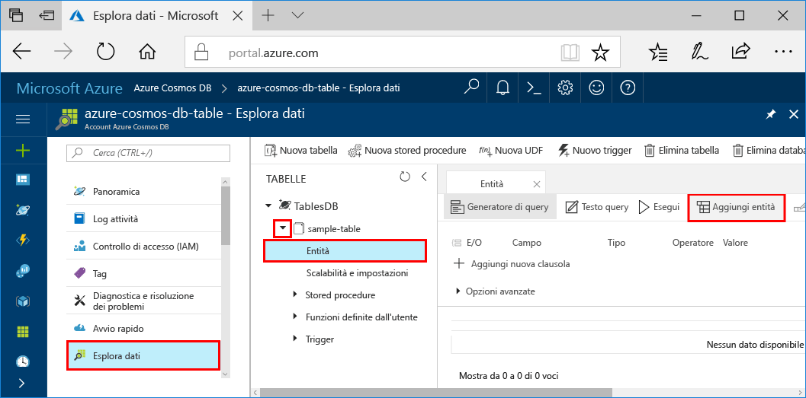

# <a name="azure-cosmos-db-build-a-net-application-using-hello-table-api"></a>Azure Cosmos DB: Compilare un'applicazione .NET usando hello tabella API

Azure Cosmos DB è il servizio di database multimodello distribuito a livello globale di Microsoft. Creare rapidamente e query chiave/valore, il documento e database grafico, ognuno dei quali trarre vantaggio dalla distribuzione globale hello e funzionalità di scalabilità orizzontale di base di Azure Cosmos DB hello. 

Questa Guida introduttiva illustra come un database di Azure Cosmos toocreate account e creare una tabella all'interno di tale account hello portale di Azure. Verranno quindi scrivere codice tooinsert, aggiornamento ed eliminare entità ed eseguire alcune query utilizzando hello nuovo [Premium di archiviazione di Windows Azure Table](https://aka.ms/premiumtablenuget) pacchetto NuGet (anteprima). Questa libreria ha hello stesse classi e le firme del metodo come pubblico hello [Windows Azure Storage SDK](https://www.nuget.org/packages/WindowsAzure.Storage), ma ha anche hello possibilità tooconnect tooAzure DB Cosmos gli account tramite hello [tabella API](table-introduction.md) (anteprima). 

## <a name="prerequisites"></a>Prerequisiti

Se si dispone già di Visual Studio 2017, che installata, è possibile scaricare e utilizzare hello **libero** [2017 di Visual Studio Community Edition](https://www.visualstudio.com/downloads/). Assicurarsi di abilitare **lo sviluppo di Azure** durante l'installazione di Visual Studio hello.

[!INCLUDE [quickstarts-free-trial-note](../../includes/quickstarts-free-trial-note.md)]

## <a name="create-a-database-account"></a>Creare un account di database

[!INCLUDE [cosmos-db-create-dbaccount-table](../../includes/cosmos-db-create-dbaccount-table.md)]

## <a name="add-a-table"></a>Aggiungere una tabella

[!INCLUDE [cosmos-db-create-table](../../includes/cosmos-db-create-table.md)]

## <a name="add-sample-data"></a>Aggiungere dati di esempio

È ora possibile aggiungere dati tooyour nuova tabella utilizzando Esplora dati (anteprima).

1. In Esplora dati espandere **sample-table**, fare clic su **Entità** e quindi su **Aggiungi entità**.

   
2. Ora aggiungere una casella di valore dati toohello PartitionKey e RowKey casella del valore e fare clic su **Aggiungi entità**.

   
  
    È ora possibile aggiungere altre entità tooyour tabella, modificare le entità o eseguire query sui dati in Esplora dati. Esplora dati è inoltre in cui è possibile ridimensionare la velocità effettiva e aggiungere una tabella tooyour trigger, stored procedure e funzioni definite dall'utente.

## <a name="clone-hello-sample-application"></a>Applicazione di esempio hello clonare

Ora si clonare un'app di tabella da github, impostare la stringa di connessione hello ed eseguirlo. Si noterà quanto sia facile toowork con i dati a livello di codice. 

1. Aprire una finestra terminale git, ad esempio git bash, e `cd` tooa directory di lavoro.  

2. Eseguire hello seguenti repository di esempio di comando tooclone hello. 

    ```bash
    git clone https://github.com/Azure-Samples/azure-cosmos-db-table-dotnet-getting-started.git
    ```

3. Aprire quindi il file di soluzione hello in Visual Studio. 

## <a name="review-hello-code"></a>Esaminare il codice hello

Questo punto, eseguire una rapida panoramica delle operazioni eseguite nell'applicazione hello. File Program.cs aprire hello e trovare le righe di codice creano hello risorse Azure Cosmos DB. 

* Hello CloudTableClient viene inizializzato.

    ```csharp
    CloudStorageAccount storageAccount = CloudStorageAccount.Parse(connectionString); 
    CloudTableClient tableClient = storageAccount.CreateCloudTableClient();
    ```

* Se non esiste, viene creata una nuova tabella.

    ```csharp
    CloudTable table = tableClient.GetTableReference("people");
    table.CreateIfNotExists();
    ```

* Viene creato un nuovo contenitore di tabelle. È possibile osservare questo tooregular molto simile a codice archiviazione tabelle di Azure SDK. 

    ```csharp
    CustomerEntity item = new CustomerEntity()
                {
                    PartitionKey = Guid.NewGuid().ToString(),
                    RowKey = Guid.NewGuid().ToString(),
                    Email = $"{GetRandomString(6)}@contoso.com",
                    PhoneNumber = "425-555-0102",
                    Bio = GetRandomString(1000)
                };
    ```

## <a name="update-your-connection-string"></a>Aggiornare la stringa di connessione

Ora informazioni sulla stringa di connessione hello verrà aggiornata in modo l'app in grado di comunicare tooAzure DB Cosmos. 

1. In Visual Studio, aprire il file app. config hello. 

2. In hello [portale di Azure](http://portal.azure.com/)in hello Azure Cosmos DB menu di navigazione a sinistra, fare clic su **stringa di connessione**. Quindi nel riquadro nuova hello fare clic su pulsante Copia hello hello stringa di connessione. 

    

3. Incollare il valore di hello nel file app. config hello come valore di hello di hello PremiumStorageConnectionString. 

    `<add key="PremiumStorageConnectionString" 
        value="DefaultEndpointsProtocol=https;AccountName=MYSTORAGEACCOUNT;AccountKey=AUTHKEY;TableEndpoint=https://COSMOSDB.documents.azure.com" />`    

    È possibile lasciare hello StandardStorageConnectionString come è.

È stato aggiornato a questo punto l'app con tutte le informazioni di hello deve toocommunicate con Azure Cosmos DB. 

## <a name="run-hello-web-app"></a>Eseguire app web hello

1. In Visual Studio, fare clic su hello **PremiumTableGetStarted** nel progetto **Esplora** e quindi fare clic su **Gestisci pacchetti NuGet**. 

2. In hello NuGet **Sfoglia** digitare *Windowsazure PremiumTable*.

3. Controllare hello **Includi versione preliminare** casella. 

4. Dai risultati di hello, installare hello **Windowsazure PremiumTable** libreria. Consente di installare anteprima hello pacchetto Azure Cosmos DB tabella API, nonché tutte le dipendenze. Si tratta di un pacchetto NuGet diverso rispetto a pacchetto di archiviazione di Azure hello utilizzato per l'archiviazione tabelle di Azure. 

5. Premere CTRL + F5 applicazione hello toorun.

    finestra della console Hello Visualizza dati hello aggiunti, recuperare, eseguire una query, sostituito o eliminate dalla tabella hello. Al termine dell'esecuzione dello script hello, premere qualsiasi finestra di console hello tooclose chiave. 
    
    

6. Se si desidera che le nuove entità hello toosee in Esplora dati, un commento solo le righe 188 208 in program.cs in modo che non vengono eliminati, eseguire nuovamente esempio hello. 

    È ora possibile passare nuovamente tooData Explorer, fare clic su **aggiornamento**, espandere hello **persone** tabella e fare clic su **entità**e quindi utilizzare questi nuovi dati. 

    

## <a name="review-slas-in-hello-azure-portal"></a>Esaminare i contratti di servizio nel portale di Azure hello

[!INCLUDE [cosmosdb-tutorial-review-slas](../../includes/cosmos-db-tutorial-review-slas.md)]

## <a name="clean-up-resources"></a>Pulire le risorse

Se non si ha intenzione toocontinue toouse questa app, eliminare tutte le risorse create da questa Guida rapida hello portale di Azure con hello alla procedura seguente: 

1. Dal menu a sinistra di hello in hello portale di Azure, fare clic su **gruppi di risorse** e quindi fare clic su nome hello della risorsa di hello è stato creato. 
2. Nella pagina di gruppo di risorse, fare clic su **eliminare**, digitare il nome di hello di hello risorsa toodelete nella casella di testo hello e quindi fare clic su **eliminare**.

## <a name="next-steps"></a>Passaggi successivi

In questa Guida rapida, si è appreso come creare una tabella utilizzando Esplora dati hello toocreate un account Azure Cosmos DB ed eseguire un'app.  Ora è possibile eseguire una query con i dati utilizzando hello API di tabella.  

> [!div class="nextstepaction"]
> [Query tramite tabella API hello](tutorial-query-table.md)

