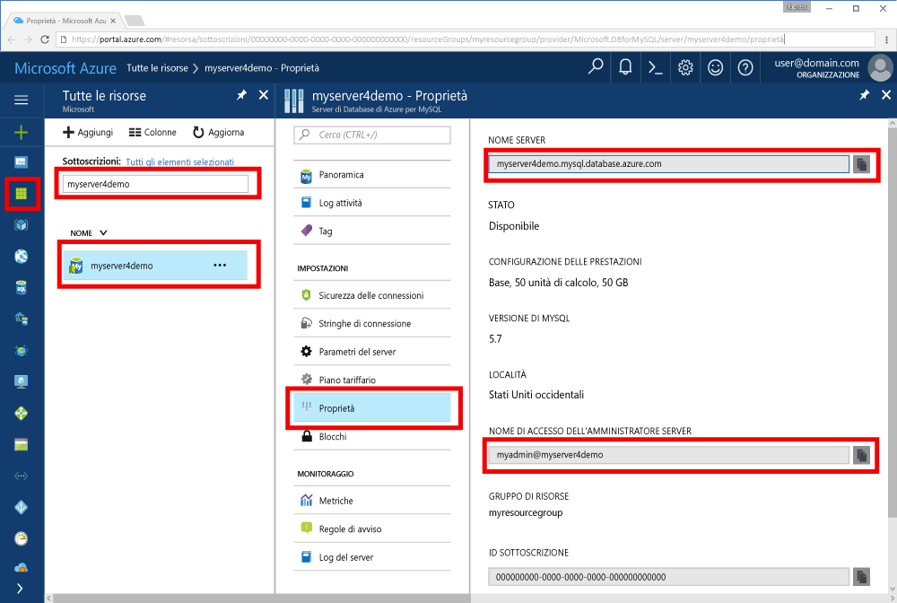

# <a name="azure-database-for-mysql-use-go-language-tooconnect-and-query-data"></a><span data-ttu-id="4b791-103">Il Database di Azure per MySQL: utilizzano il comando Go language tooconnect ed eseguire query sui dati</span><span class="sxs-lookup"><span data-stu-id="4b791-103">Azure Database for MySQL: Use Go language tooconnect and query data</span></span>
<span data-ttu-id="4b791-104">Questa Guida introduttiva illustra come tooconnect tooan Database di Azure per l'utilizzo di MySQL codice hello scritto in [passare](https://golang.org/) language da Windows, Ubuntu Linux e Apple piattaforme macOS.</span><span class="sxs-lookup"><span data-stu-id="4b791-104">This quickstart demonstrates how tooconnect tooan Azure Database for MySQL using code written in hello [Go](https://golang.org/) language from Windows, Ubuntu Linux, and Apple macOS platforms.</span></span> <span data-ttu-id="4b791-105">Viene illustrato come toouse tooquery di istruzioni SQL, inserire, aggiornare ed eliminare dati nel database di hello.</span><span class="sxs-lookup"><span data-stu-id="4b791-105">It shows how toouse SQL statements tooquery, insert, update, and delete data in hello database.</span></span> <span data-ttu-id="4b791-106">In questo articolo si presuppone che si ha familiarità con lo sviluppo tramite Go, ma che sono tooworking nuovo con il Database di Azure per MySQL.</span><span class="sxs-lookup"><span data-stu-id="4b791-106">This article assumes you are familiar with development using Go, but that you are new tooworking with Azure Database for MySQL.</span></span>

## <a name="prerequisites"></a><span data-ttu-id="4b791-107">Prerequisiti</span><span class="sxs-lookup"><span data-stu-id="4b791-107">Prerequisites</span></span>
<span data-ttu-id="4b791-108">Questa Guida rapida utilizza risorse di hello create in una di queste guide come punto di partenza:</span><span class="sxs-lookup"><span data-stu-id="4b791-108">This quickstart uses hello resources created in either of these guides as a starting point:</span></span>
- <span data-ttu-id="4b791-109">[Create an Azure Database for MySQL server using Azure portal](./quickstart-create-mysql-server-database-using-azure-portal.md) (Creare un database di Azure per il server MySQL usando il portale di Azure)</span><span class="sxs-lookup"><span data-stu-id="4b791-109">[Create an Azure Database for MySQL server using Azure portal](./quickstart-create-mysql-server-database-using-azure-portal.md)</span></span>
- <span data-ttu-id="4b791-110">[Create an Azure Database for MySQL server using Azure CLI](./quickstart-create-mysql-server-database-using-azure-cli.md) (Creare un database di Azure per il server MySQL usando l'interfaccia della riga di comando di Azure)</span><span class="sxs-lookup"><span data-stu-id="4b791-110">[Create an Azure Database for MySQL server using Azure CLI](./quickstart-create-mysql-server-database-using-azure-cli.md)</span></span>

## <a name="install-go-and-mysql-connector"></a><span data-ttu-id="4b791-111">Installare Go e il connettore MySQL</span><span class="sxs-lookup"><span data-stu-id="4b791-111">Install Go and MySQL connector</span></span>
<span data-ttu-id="4b791-112">Installare [passare](https://golang.org/doc/install) hello e [driver di sql go per MySQL](https://github.com/go-sql-driver/mysql#installation) sul proprio computer.</span><span class="sxs-lookup"><span data-stu-id="4b791-112">Install [Go](https://golang.org/doc/install) and hello [go-sql-driver for MySQL](https://github.com/go-sql-driver/mysql#installation) on your own machine.</span></span> <span data-ttu-id="4b791-113">A seconda della piattaforma, attenersi alla seguente procedura hello:</span><span class="sxs-lookup"><span data-stu-id="4b791-113">Depending on your platform, follow hello steps:</span></span>

### <a name="windows"></a><span data-ttu-id="4b791-114">Windows</span><span class="sxs-lookup"><span data-stu-id="4b791-114">Windows</span></span>
1. <span data-ttu-id="4b791-115">[Scaricare](https://golang.org/dl/) e installare Go per Microsoft Windows base toohello [le istruzioni di installazione](https://golang.org/doc/install).</span><span class="sxs-lookup"><span data-stu-id="4b791-115">[Download](https://golang.org/dl/) and install Go for Microsoft Windows according toohello [installation instructions](https://golang.org/doc/install).</span></span>
2. <span data-ttu-id="4b791-116">Avviare hello prompt dei comandi dal menu di avvio hello.</span><span class="sxs-lookup"><span data-stu-id="4b791-116">Launch hello command prompt from hello start menu.</span></span>
3. <span data-ttu-id="4b791-117">Creare una cartella per il progetto, ad esempio</span><span class="sxs-lookup"><span data-stu-id="4b791-117">Make a folder for your project such.</span></span> <span data-ttu-id="4b791-118">`mkdir  %USERPROFILE%\go\src\mysqlgo`.</span><span class="sxs-lookup"><span data-stu-id="4b791-118">`mkdir  %USERPROFILE%\go\src\mysqlgo`.</span></span>
4. <span data-ttu-id="4b791-119">Spostarsi nella cartella di progetto hello, ad esempio `cd %USERPROFILE%\go\src\mysqlgo`.</span><span class="sxs-lookup"><span data-stu-id="4b791-119">Change directory into hello project folder, such as `cd %USERPROFILE%\go\src\mysqlgo`.</span></span>
5. <span data-ttu-id="4b791-120">Impostare la variabile di ambiente hello per la directory del codice sorgente toohello toopoint GOPATH.</span><span class="sxs-lookup"><span data-stu-id="4b791-120">Set hello environment variable for GOPATH toopoint toohello source code directory.</span></span> <span data-ttu-id="4b791-121">`set GOPATH=%USERPROFILE%\go`.</span><span class="sxs-lookup"><span data-stu-id="4b791-121">`set GOPATH=%USERPROFILE%\go`.</span></span>
6. <span data-ttu-id="4b791-122">Installare hello [driver di sql go per mysql](https://github.com/go-sql-driver/mysql#installation) eseguendo hello `go get github.com/go-sql-driver/mysql` comando.</span><span class="sxs-lookup"><span data-stu-id="4b791-122">Install hello [go-sql-driver for mysql](https://github.com/go-sql-driver/mysql#installation) by running hello `go get github.com/go-sql-driver/mysql` command.</span></span>

   <span data-ttu-id="4b791-123">In sintesi, installare Go e quindi eseguire questi comandi nel prompt dei comandi di hello:</span><span class="sxs-lookup"><span data-stu-id="4b791-123">In summary, install Go, then run these commands in hello command prompt:</span></span>
   ```cmd
   mkdir  %USERPROFILE%\go\src\mysqlgo
   cd %USERPROFILE%\go\src\mysqlgo
   set GOPATH=%USERPROFILE%\go
   go get github.com/go-sql-driver/mysql
   ```

### <a name="linux-ubuntu"></a><span data-ttu-id="4b791-124">Linux (Ubuntu)</span><span class="sxs-lookup"><span data-stu-id="4b791-124">Linux (Ubuntu)</span></span>
1. <span data-ttu-id="4b791-125">Avviare shell Bash hello.</span><span class="sxs-lookup"><span data-stu-id="4b791-125">Launch hello Bash shell.</span></span> 
2. <span data-ttu-id="4b791-126">Installare Go eseguendo `sudo apt-get install golang-go`.</span><span class="sxs-lookup"><span data-stu-id="4b791-126">Install Go by running `sudo apt-get install golang-go`.</span></span>
3. <span data-ttu-id="4b791-127">Creare una cartella per il progetto nella home directory, ad esempio `mkdir -p ~/go/src/mysqlgo/`.</span><span class="sxs-lookup"><span data-stu-id="4b791-127">Make a folder for your project in your home directory, such as `mkdir -p ~/go/src/mysqlgo/`.</span></span>
4. <span data-ttu-id="4b791-128">Spostarsi nella cartella hello, ad esempio `cd ~/go/src/mysqlgo/`.</span><span class="sxs-lookup"><span data-stu-id="4b791-128">Change directory into hello folder, such as `cd ~/go/src/mysqlgo/`.</span></span>
5. <span data-ttu-id="4b791-129">Set hello GOPATH ambiente toopoint variabile tooa directory di origine, ad esempio a casa corrente della directory passare cartella.</span><span class="sxs-lookup"><span data-stu-id="4b791-129">Set hello GOPATH environment variable toopoint tooa valid source directory, such as your current home directory's go folder.</span></span> <span data-ttu-id="4b791-130">Fase della shell bash hello, `export GOPATH=~/go` tooadd hello andare directory come hello GOPATH per sessione shell corrente hello.</span><span class="sxs-lookup"><span data-stu-id="4b791-130">At hello bash shell, run `export GOPATH=~/go` tooadd hello go directory as hello GOPATH for hello current shell session.</span></span>
6. <span data-ttu-id="4b791-131">Installare hello [driver di sql go per mysql](https://github.com/go-sql-driver/mysql#installation) eseguendo hello `go get github.com/go-sql-driver/mysql` comando.</span><span class="sxs-lookup"><span data-stu-id="4b791-131">Install hello [go-sql-driver for mysql](https://github.com/go-sql-driver/mysql#installation) by running hello `go get github.com/go-sql-driver/mysql` command.</span></span>

   <span data-ttu-id="4b791-132">In sintesi, eseguire questi comandi Bash:</span><span class="sxs-lookup"><span data-stu-id="4b791-132">In summary, run these bash commands:</span></span>
   ```bash
   sudo apt-get install golang-go
   mkdir -p ~/go/src/mysqlgo/
   cd ~/go/src/mysqlgo/
   export GOPATH=~/go/
   go get github.com/go-sql-driver/mysql
   ```

### <a name="apple-macos"></a><span data-ttu-id="4b791-133">Apple macOS</span><span class="sxs-lookup"><span data-stu-id="4b791-133">Apple macOS</span></span>
1. <span data-ttu-id="4b791-134">Scaricare e installare andare in base toohello [le istruzioni di installazione](https://golang.org/doc/install) corrispondenti della piattaforma.</span><span class="sxs-lookup"><span data-stu-id="4b791-134">Download and install Go according toohello [installation instructions](https://golang.org/doc/install)  matching your platform.</span></span> 
2. <span data-ttu-id="4b791-135">Avviare shell Bash hello.</span><span class="sxs-lookup"><span data-stu-id="4b791-135">Launch hello Bash shell.</span></span> 
3. <span data-ttu-id="4b791-136">Creare una cartella per il progetto nella home directory, ad esempio `mkdir -p ~/go/src/mysqlgo/`.</span><span class="sxs-lookup"><span data-stu-id="4b791-136">Make a folder for your project in your home directory, such as `mkdir -p ~/go/src/mysqlgo/`.</span></span>
4. <span data-ttu-id="4b791-137">Spostarsi nella cartella hello, ad esempio `cd ~/go/src/mysqlgo/`.</span><span class="sxs-lookup"><span data-stu-id="4b791-137">Change directory into hello folder, such as `cd ~/go/src/mysqlgo/`.</span></span>
5. <span data-ttu-id="4b791-138">Set hello GOPATH ambiente toopoint variabile tooa directory di origine, ad esempio a casa corrente della directory passare cartella.</span><span class="sxs-lookup"><span data-stu-id="4b791-138">Set hello GOPATH environment variable toopoint tooa valid source directory, such as your current home directory's go folder.</span></span> <span data-ttu-id="4b791-139">Fase della shell bash hello, `export GOPATH=~/go` tooadd hello andare directory come hello GOPATH per sessione shell corrente hello.</span><span class="sxs-lookup"><span data-stu-id="4b791-139">At hello bash shell, run `export GOPATH=~/go` tooadd hello go directory as hello GOPATH for hello current shell session.</span></span>
6. <span data-ttu-id="4b791-140">Installare hello [driver di sql go per mysql](https://github.com/go-sql-driver/mysql#installation) eseguendo hello `go get github.com/go-sql-driver/mysql` comando.</span><span class="sxs-lookup"><span data-stu-id="4b791-140">Install hello [go-sql-driver for mysql](https://github.com/go-sql-driver/mysql#installation) by running hello `go get github.com/go-sql-driver/mysql` command.</span></span>

   <span data-ttu-id="4b791-141">In sintesi, installare Go e quindi eseguire questi comandi Bash:</span><span class="sxs-lookup"><span data-stu-id="4b791-141">In summary, install Go, then run these bash commands:</span></span>
   ```bash
   mkdir -p ~/go/src/mysqlgo/
   cd ~/go/src/mysqlgo/
   export GOPATH=~/go/
   go get github.com/go-sql-driver/mysql
   ```

## <a name="get-connection-information"></a><span data-ttu-id="4b791-142">Ottenere informazioni di connessione</span><span class="sxs-lookup"><span data-stu-id="4b791-142">Get connection information</span></span>
<span data-ttu-id="4b791-143">Ottenere hello connessione le informazioni necessarie tooconnect toohello Database di Azure per MySQL.</span><span class="sxs-lookup"><span data-stu-id="4b791-143">Get hello connection information needed tooconnect toohello Azure Database for MySQL.</span></span> <span data-ttu-id="4b791-144">È necessario hello le credenziali di nome e l'account di accesso completo del server.</span><span class="sxs-lookup"><span data-stu-id="4b791-144">You need hello fully qualified server name and login credentials.</span></span>

1. <span data-ttu-id="4b791-145">Accedi toohello [portale di Azure](https://portal.azure.com/).</span><span class="sxs-lookup"><span data-stu-id="4b791-145">Log in toohello [Azure portal](https://portal.azure.com/).</span></span>
2. <span data-ttu-id="4b791-146">Dal menu a sinistra di hello nel portale di Azure, fare clic su **tutte le risorse** e Cerca server hello avere piegato, ad esempio **myserver4demo**.</span><span class="sxs-lookup"><span data-stu-id="4b791-146">From hello left-hand menu in Azure portal, click **All resources** and search for hello server you have creased, such as **myserver4demo**.</span></span>
3. <span data-ttu-id="4b791-147">Fare clic sul nome di server hello **myserver4demo**.</span><span class="sxs-lookup"><span data-stu-id="4b791-147">Click hello server name **myserver4demo**.</span></span>
4. <span data-ttu-id="4b791-148">Server di selezionare hello **proprietà** pagina.</span><span class="sxs-lookup"><span data-stu-id="4b791-148">Select hello server's **Properties** page.</span></span> <span data-ttu-id="4b791-149">Prendere nota di hello **nome Server** e **nome account di accesso di amministratore Server**.</span><span class="sxs-lookup"><span data-stu-id="4b791-149">Make a note of hello **Server name** and **Server admin login name**.</span></span>
 <span data-ttu-id="4b791-150"></span><span class="sxs-lookup"><span data-stu-id="4b791-150"></span></span>
5. <span data-ttu-id="4b791-151">Se si dimenticano le informazioni di accesso del server, passare toohello **Panoramica** pagina nome account di accesso amministratore di tooview hello Server e, se necessario, reimpostare la password di hello.</span><span class="sxs-lookup"><span data-stu-id="4b791-151">If you forget your server login information, navigate toohello **Overview** page tooview hello Server admin login name and, if necessary, reset hello password.</span></span>
   

## <a name="build-and-run-go-code"></a><span data-ttu-id="4b791-152">Compilare ed eseguire il codice Go</span><span class="sxs-lookup"><span data-stu-id="4b791-152">Build and run Go code</span></span> 
1. <span data-ttu-id="4b791-153">toowrite Golang codice, è possibile utilizzare un editor di testo semplice, ad esempio Blocco note di Microsoft Windows, [vi](http://manpages.ubuntu.com/manpages/xenial/man1/nvi.1.html#contenttoc5) o [Nano](https://www.nano-editor.org/) Ubuntu o TextEdit in macOS.</span><span class="sxs-lookup"><span data-stu-id="4b791-153">toowrite Golang code, you can use a simple text editor, such as Notepad in Microsoft Windows, [vi](http://manpages.ubuntu.com/manpages/xenial/man1/nvi.1.html#contenttoc5) or [Nano](https://www.nano-editor.org/) in Ubuntu, or TextEdit in macOS.</span></span> <span data-ttu-id="4b791-154">Se si preferisce un ambiente IDE (Interactive Development Environment) avanzato, provare [Gogland](https://www.jetbrains.com/go/) di Jetbrains, [Visual Studio Code](https://code.visualstudio.com/) di Microsoft o [Atom](https://atom.io/).</span><span class="sxs-lookup"><span data-stu-id="4b791-154">If you prefer a richer Interactive Development Environment (IDE) try [Gogland](https://www.jetbrains.com/go/) by Jetbrains, [Visual Studio Code](https://code.visualstudio.com/) by Microsoft, or [Atom](https://atom.io/).</span></span>
2. <span data-ttu-id="4b791-155">Incollare hello codice Go da sezioni hello in file di testo e salvare nella cartella del progetto con estensione \*passare, ad esempio il percorso di Windows `%USERPROFILE%\go\src\mysqlgo\createtable.go` o percorso di Linux `~/go/src/mysqlgo/createtable.go`.</span><span class="sxs-lookup"><span data-stu-id="4b791-155">Paste hello Go code from hello sections below into text files, and save into your project folder with file extension \*.go, such as Windows path `%USERPROFILE%\go\src\mysqlgo\createtable.go` or Linux path `~/go/src/mysqlgo/createtable.go`.</span></span>
3. <span data-ttu-id="4b791-156">Individuare hello `HOST`, `DATABASE`, `USER`, e `PASSWORD` costanti nel codice hello e sostituire i valori di esempio hello con valori personalizzati.</span><span class="sxs-lookup"><span data-stu-id="4b791-156">Locate hello `HOST`, `DATABASE`, `USER`, and `PASSWORD` constants in hello code, and replace hello example values with your own values.</span></span> 
4. <span data-ttu-id="4b791-157">Avviare il prompt di comandi hello o della shell bash.</span><span class="sxs-lookup"><span data-stu-id="4b791-157">Launch hello command prompt or bash shell.</span></span> <span data-ttu-id="4b791-158">Passare alla cartella del progetto,</span><span class="sxs-lookup"><span data-stu-id="4b791-158">Change directory into your project folder.</span></span> <span data-ttu-id="4b791-159">ad esempio `cd %USERPROFILE%\go\src\mysqlgo\` in Windows.</span><span class="sxs-lookup"><span data-stu-id="4b791-159">For example, on Windows `cd %USERPROFILE%\go\src\mysqlgo\`.</span></span> <span data-ttu-id="4b791-160">In Linux `cd ~/go/src/mysqlgo/`.</span><span class="sxs-lookup"><span data-stu-id="4b791-160">On Linux `cd ~/go/src/mysqlgo/`.</span></span>  <span data-ttu-id="4b791-161">Alcuni editor IDE hello indicato offrono funzionalità di debug e di runtime senza i comandi della shell.</span><span class="sxs-lookup"><span data-stu-id="4b791-161">Some of hello IDE editors mentioned offer debug and runtime capabilities without requiring shell commands.</span></span>
5. <span data-ttu-id="4b791-162">Eseguire il codice hello digitando il comando hello `go run createtable.go` toocompile hello applicazione ed eseguirlo.</span><span class="sxs-lookup"><span data-stu-id="4b791-162">Run hello code by typing hello command `go run createtable.go` toocompile hello application and run it.</span></span> 
6. <span data-ttu-id="4b791-163">In alternativa, toobuild codice hello in un'applicazione nativa, `go build createtable.go`, quindi avviare `createtable.exe` toorun un'applicazione hello.</span><span class="sxs-lookup"><span data-stu-id="4b791-163">Alternatively, toobuild hello code into a native application, `go build createtable.go`, then launch `createtable.exe` toorun hello application.</span></span>

## <a name="connect-create-table-and-insert-data"></a><span data-ttu-id="4b791-164">Connettersi, creare tabelle e inserire dati</span><span class="sxs-lookup"><span data-stu-id="4b791-164">Connect, create table, and insert data</span></span>
<span data-ttu-id="4b791-165">Seguente hello utilizzare codice tooconnect toohello server, creare una tabella e caricare i dati di hello usando un **inserire** istruzione SQL.</span><span class="sxs-lookup"><span data-stu-id="4b791-165">Use hello following code tooconnect toohello server, create a table, and load hello data using an **INSERT** SQL statement.</span></span> 

<span data-ttu-id="4b791-166">codice Hello Importa tre pacchetti: hello [pacchetto sql](https://golang.org/pkg/database/sql/), hello [driver sql passare per mysql](https://github.com/go-sql-driver/mysql#installation) come toocommunicate un driver con Database di Azure per MySQL hello e hello [pacchetto fmt](https://golang.org/pkg/fmt/)per stampato input e output nella riga di comando hello.</span><span class="sxs-lookup"><span data-stu-id="4b791-166">hello code imports three packages: hello [sql package](https://golang.org/pkg/database/sql/), hello [go sql driver for mysql](https://github.com/go-sql-driver/mysql#installation) as a driver toocommunicate with hello Azure Database for MySQL, and hello [fmt package](https://golang.org/pkg/fmt/) for printed input and output on hello command line.</span></span>

<span data-ttu-id="4b791-167">codice Hello chiama metodo [sql. Open ()](http://go-database-sql.org/accessing.html) tooconnect tooAzure Database per MySQL e connessione hello controlli utilizzando metodo [db. Ping()](https://golang.org/pkg/database/sql/#DB.Ping).</span><span class="sxs-lookup"><span data-stu-id="4b791-167">hello code calls method [sql.Open()](http://go-database-sql.org/accessing.html) tooconnect tooAzure Database for MySQL, and checks hello connection using method [db.Ping()](https://golang.org/pkg/database/sql/#DB.Ping).</span></span> <span data-ttu-id="4b791-168">Oggetto [handle di database](https://golang.org/pkg/database/sql/#DB) viene utilizzata in, che contiene il pool di connessioni hello per il server di database hello.</span><span class="sxs-lookup"><span data-stu-id="4b791-168">A [database handle](https://golang.org/pkg/database/sql/#DB) is used throughout, holding hello connection pool for hello database server.</span></span> <span data-ttu-id="4b791-169">hello chiamate di codice Hello [Exec ()](https://golang.org/pkg/database/sql/#DB.Exec) metodo più volte toorun diversi comandi DDL.</span><span class="sxs-lookup"><span data-stu-id="4b791-169">hello code calls hello [Exec()](https://golang.org/pkg/database/sql/#DB.Exec) method several times toorun several DDL commands.</span></span> <span data-ttu-id="4b791-170">Hello viene utilizzata anche hello [Prepare()](http://go-database-sql.org/prepared.html) e toorun Exec () preparato di istruzioni con parametri diversi tooinsert tre righe.</span><span class="sxs-lookup"><span data-stu-id="4b791-170">hello code also uses hello [Prepare()](http://go-database-sql.org/prepared.html) and Exec() toorun prepared statements with different parameters tooinsert three rows.</span></span> <span data-ttu-id="4b791-171">Ogni volta che un metodo personalizzato checkError() è toocheck usato se l'errore e andare nel panico tooexit.</span><span class="sxs-lookup"><span data-stu-id="4b791-171">Each time a custom checkError() method is used toocheck if an error occurred and panic tooexit.</span></span>

<span data-ttu-id="4b791-172">Sostituire hello `host`, `database`, `user`, e `password` costanti con valori personalizzati.</span><span class="sxs-lookup"><span data-stu-id="4b791-172">Replace hello `host`, `database`, `user`, and `password` constants with your own values.</span></span> 

```Go
package main

import (
    "database/sql"
    "fmt"

    _ "github.com/go-sql-driver/mysql"
)

const (
    host     = "myserver4demo.mysql.database.azure.com"
    database = "quickstartdb"
    user     = "myadmin@myserver4demo"
    password = "yourpassword"
)

func checkError(err error) {
    if err != nil {
        panic(err)
    }
}

func main() {

    // Initialize connection string.
    var connectionString = fmt.Sprintf("%s:%s@tcp(%s:3306)/%s?allowNativePasswords=true", user, password, host, database)

    // Initialize connection object.
    db, err := sql.Open("mysql", connectionString)
    checkError(err)
    defer db.Close()

    err = db.Ping()
    checkError(err)
    fmt.Println("Successfully created connection toodatabase.")

    // Drop previous table of same name if one exists.
    _, err = db.Exec("DROP TABLE IF EXISTS inventory;")
    checkError(err)
    fmt.Println("Finished dropping table (if existed).")

    // Create table.
    _, err = db.Exec("CREATE TABLE inventory (id serial PRIMARY KEY, name VARCHAR(50), quantity INTEGER);")
    checkError(err)
    fmt.Println("Finished creating table.")

    // Insert some data into table.
    sqlStatement, err := db.Prepare("INSERT INTO inventory (name, quantity) VALUES (?, ?);")
    res, err := sqlStatement.Exec("banana", 150)
    checkError(err)
    rowCount, err := res.RowsAffected()
    fmt.Printf("Inserted %d row(s) of data.\n", rowCount)

    res, err = sqlStatement.Exec("orange", 154)
    checkError(err)
    rowCount, err = res.RowsAffected()
    fmt.Printf("Inserted %d row(s) of data.\n", rowCount)

    res, err = sqlStatement.Exec("apple", 100)
    checkError(err)
    rowCount, err = res.RowsAffected()
    fmt.Printf("Inserted %d row(s) of data.\n", rowCount)
    fmt.Println("Done.")
}

```

## <a name="read-data"></a><span data-ttu-id="4b791-173">Leggere i dati</span><span class="sxs-lookup"><span data-stu-id="4b791-173">Read data</span></span>
<span data-ttu-id="4b791-174">Seguente hello utilizzare codice tooconnect e leggere hello dati utilizzando un **selezionare** istruzione SQL.</span><span class="sxs-lookup"><span data-stu-id="4b791-174">Use hello following code tooconnect and read hello data using a **SELECT** SQL statement.</span></span> 

<span data-ttu-id="4b791-175">codice Hello Importa tre pacchetti: hello [pacchetto sql](https://golang.org/pkg/database/sql/), hello [driver sql passare per mysql](https://github.com/go-sql-driver/mysql#installation) come toocommunicate un driver con Database di Azure per MySQL hello e hello [pacchetto fmt](https://golang.org/pkg/fmt/)per stampato input e output nella riga di comando hello.</span><span class="sxs-lookup"><span data-stu-id="4b791-175">hello code imports three packages: hello [sql package](https://golang.org/pkg/database/sql/), hello [go sql driver for mysql](https://github.com/go-sql-driver/mysql#installation) as a driver toocommunicate with hello Azure Database for MySQL, and hello [fmt package](https://golang.org/pkg/fmt/) for printed input and output on hello command line.</span></span>

<span data-ttu-id="4b791-176">codice Hello chiama metodo [sql. Open ()](http://go-database-sql.org/accessing.html) tooconnect tooAzure Database per MySQL e connessione hello controlli utilizzando metodo [db. Ping()](https://golang.org/pkg/database/sql/#DB.Ping).</span><span class="sxs-lookup"><span data-stu-id="4b791-176">hello code calls method [sql.Open()](http://go-database-sql.org/accessing.html) tooconnect tooAzure Database for MySQL, and checks hello connection using method [db.Ping()](https://golang.org/pkg/database/sql/#DB.Ping).</span></span> <span data-ttu-id="4b791-177">Oggetto [handle di database](https://golang.org/pkg/database/sql/#DB) viene utilizzata in, che contiene il pool di connessioni hello per il server di database hello.</span><span class="sxs-lookup"><span data-stu-id="4b791-177">A [database handle](https://golang.org/pkg/database/sql/#DB) is used throughout, holding hello connection pool for hello database server.</span></span> <span data-ttu-id="4b791-178">hello chiamate di codice Hello [query ()](https://golang.org/pkg/database/sql/#DB.Query) comando select hello toorun di metodo.</span><span class="sxs-lookup"><span data-stu-id="4b791-178">hello code calls hello [Query()](https://golang.org/pkg/database/sql/#DB.Query) method toorun hello select command.</span></span> <span data-ttu-id="4b791-179">Esegue quindi il [Next](https://golang.org/pkg/database/sql/#Rows.Next) tooiterate tramite il set di risultati hello e [Scan()](https://golang.org/pkg/database/sql/#Rows.Scan) tooparse hello i valori di colonna salvataggio valore hello in variabili.</span><span class="sxs-lookup"><span data-stu-id="4b791-179">Then it runs [Next()](https://golang.org/pkg/database/sql/#Rows.Next) tooiterate through hello result set and [Scan()](https://golang.org/pkg/database/sql/#Rows.Scan) tooparse hello column values, saving hello value into variables.</span></span> <span data-ttu-id="4b791-180">Ogni volta che un metodo personalizzato checkError() è toocheck usato se l'errore e andare nel panico tooexit.</span><span class="sxs-lookup"><span data-stu-id="4b791-180">Each time a custom checkError() method is used toocheck if an error occurred and panic tooexit.</span></span>

<span data-ttu-id="4b791-181">Sostituire hello `host`, `database`, `user`, e `password` costanti con valori personalizzati.</span><span class="sxs-lookup"><span data-stu-id="4b791-181">Replace hello `host`, `database`, `user`, and `password` constants with your own values.</span></span> 

```Go
package main

import (
    "database/sql"
    "fmt"

    _ "github.com/go-sql-driver/mysql"
)

const (
    host     = "myserver4demo.mysql.database.azure.com"
    database = "quickstartdb"
    user     = "myadmin@myserver4demo"
    password = "yourpassword"
)

func checkError(err error) {
    if err != nil {
        panic(err)
    }
}

func main() {

    // Initialize connection string.
    var connectionString = fmt.Sprintf("%s:%s@tcp(%s:3306)/%s?allowNativePasswords=true", user, password, host, database)

    // Initialize connection object.
    db, err := sql.Open("mysql", connectionString)
    checkError(err)
    defer db.Close()

    err = db.Ping()
    checkError(err)
    fmt.Println("Successfully created connection toodatabase.")

    // Variables for printing column data when scanned.
    var (
        id       int
        name     string
        quantity int
    )

    // Read some data from hello table.
    rows, err := db.Query("SELECT id, name, quantity from inventory;")
    checkError(err)
    defer rows.Close()
    fmt.Println("Reading data:")
    for rows.Next() {
        err := rows.Scan(&id, &name, &quantity)
        checkError(err)
        fmt.Printf("Data row = (%d, %s, %d)\n", id, name, quantity)
    }
    err = rows.Err()
    checkError(err)
    fmt.Println("Done.")
}
```

## <a name="update-data"></a><span data-ttu-id="4b791-182">Aggiornare i dati</span><span class="sxs-lookup"><span data-stu-id="4b791-182">Update data</span></span>
<span data-ttu-id="4b791-183">Seguente hello utilizzare tooconnect del codice e aggiornare hello dati utilizzando un **aggiornare** istruzione SQL.</span><span class="sxs-lookup"><span data-stu-id="4b791-183">Use hello following code tooconnect and update hello data using a **UPDATE** SQL statement.</span></span> 

<span data-ttu-id="4b791-184">codice Hello Importa tre pacchetti: hello [pacchetto sql](https://golang.org/pkg/database/sql/), hello [driver sql passare per mysql](https://github.com/go-sql-driver/mysql#installation) come toocommunicate un driver con Database di Azure per MySQL hello e hello [pacchetto fmt](https://golang.org/pkg/fmt/)per stampato input e output nella riga di comando hello.</span><span class="sxs-lookup"><span data-stu-id="4b791-184">hello code imports three packages: hello [sql package](https://golang.org/pkg/database/sql/), hello [go sql driver for mysql](https://github.com/go-sql-driver/mysql#installation) as a driver toocommunicate with hello Azure Database for MySQL, and hello [fmt package](https://golang.org/pkg/fmt/) for printed input and output on hello command line.</span></span>

<span data-ttu-id="4b791-185">codice Hello chiama metodo [sql. Open ()](http://go-database-sql.org/accessing.html) tooconnect tooAzure Database per MySQL e connessione hello controlli utilizzando metodo [db. Ping()](https://golang.org/pkg/database/sql/#DB.Ping).</span><span class="sxs-lookup"><span data-stu-id="4b791-185">hello code calls method [sql.Open()](http://go-database-sql.org/accessing.html) tooconnect tooAzure Database for MySQL, and checks hello connection using method [db.Ping()](https://golang.org/pkg/database/sql/#DB.Ping).</span></span> <span data-ttu-id="4b791-186">Oggetto [handle di database](https://golang.org/pkg/database/sql/#DB) viene utilizzata in, che contiene il pool di connessioni hello per il server di database hello.</span><span class="sxs-lookup"><span data-stu-id="4b791-186">A [database handle](https://golang.org/pkg/database/sql/#DB) is used throughout, holding hello connection pool for hello database server.</span></span> <span data-ttu-id="4b791-187">hello chiamate di codice Hello [Exec ()](https://golang.org/pkg/database/sql/#DB.Exec) comando update hello toorun di metodo.</span><span class="sxs-lookup"><span data-stu-id="4b791-187">hello code calls hello [Exec()](https://golang.org/pkg/database/sql/#DB.Exec) method toorun hello update command.</span></span> <span data-ttu-id="4b791-188">Ogni volta che un metodo personalizzato checkError() è toocheck usato se l'errore e andare nel panico tooexit.</span><span class="sxs-lookup"><span data-stu-id="4b791-188">Each time a custom checkError() method is used toocheck if an error occurred and panic tooexit.</span></span>

<span data-ttu-id="4b791-189">Sostituire hello `host`, `database`, `user`, e `password` costanti con valori personalizzati.</span><span class="sxs-lookup"><span data-stu-id="4b791-189">Replace hello `host`, `database`, `user`, and `password` constants with your own values.</span></span> 

```Go
package main

import (
    "database/sql"
    "fmt"

    _ "github.com/go-sql-driver/mysql"
)

const (
    host     = "myserver4demo.mysql.database.azure.com"
    database = "quickstartdb"
    user     = "myadmin@myserver4demo"
    password = "yourpassword"
)

func checkError(err error) {
    if err != nil {
        panic(err)
    }
}

func main() {

    // Initialize connection string.
    var connectionString = fmt.Sprintf("%s:%s@tcp(%s:3306)/%s?allowNativePasswords=true", user, password, host, database)

    // Initialize connection object.
    db, err := sql.Open("mysql", connectionString)
    checkError(err)
    defer db.Close()

    err = db.Ping()
    checkError(err)
    fmt.Println("Successfully created connection toodatabase.")

    // Modify some data in table.
    rows, err := db.Exec("UPDATE inventory SET quantity = ? WHERE name = ?", 200, "banana")
    checkError(err)
    rowCount, err := rows.RowsAffected()
    fmt.Printf("Deleted %d row(s) of data.\n", rowCount)
    fmt.Println("Done.")
}
```

## <a name="delete-data"></a><span data-ttu-id="4b791-190">Eliminare i dati</span><span class="sxs-lookup"><span data-stu-id="4b791-190">Delete data</span></span>
<span data-ttu-id="4b791-191">Seguente hello utilizzare codice tooconnect e rimuovere dati tramite un **eliminare** istruzione SQL.</span><span class="sxs-lookup"><span data-stu-id="4b791-191">Use hello following code tooconnect and remove data using a **DELETE** SQL statement.</span></span> 

<span data-ttu-id="4b791-192">codice Hello Importa tre pacchetti: hello [pacchetto sql](https://golang.org/pkg/database/sql/), hello [driver sql passare per mysql](https://github.com/go-sql-driver/mysql#installation) come toocommunicate un driver con Database di Azure per MySQL hello e hello [pacchetto fmt](https://golang.org/pkg/fmt/)per stampato input e output nella riga di comando hello.</span><span class="sxs-lookup"><span data-stu-id="4b791-192">hello code imports three packages: hello [sql package](https://golang.org/pkg/database/sql/), hello [go sql driver for mysql](https://github.com/go-sql-driver/mysql#installation) as a driver toocommunicate with hello Azure Database for MySQL, and hello [fmt package](https://golang.org/pkg/fmt/) for printed input and output on hello command line.</span></span>

<span data-ttu-id="4b791-193">codice Hello chiama metodo [sql. Open ()](http://go-database-sql.org/accessing.html) tooconnect tooAzure Database per MySQL e connessione hello controlli utilizzando metodo [db. Ping()](https://golang.org/pkg/database/sql/#DB.Ping).</span><span class="sxs-lookup"><span data-stu-id="4b791-193">hello code calls method [sql.Open()](http://go-database-sql.org/accessing.html) tooconnect tooAzure Database for MySQL, and checks hello connection using method [db.Ping()](https://golang.org/pkg/database/sql/#DB.Ping).</span></span> <span data-ttu-id="4b791-194">Oggetto [handle di database](https://golang.org/pkg/database/sql/#DB) viene utilizzata in, che contiene il pool di connessioni hello per il server di database hello.</span><span class="sxs-lookup"><span data-stu-id="4b791-194">A [database handle](https://golang.org/pkg/database/sql/#DB) is used throughout, holding hello connection pool for hello database server.</span></span> <span data-ttu-id="4b791-195">hello chiamate di codice Hello [Exec ()](https://golang.org/pkg/database/sql/#DB.Exec) hello toorun metodo comando delete.</span><span class="sxs-lookup"><span data-stu-id="4b791-195">hello code calls hello [Exec()](https://golang.org/pkg/database/sql/#DB.Exec) method toorun hello delete command.</span></span> <span data-ttu-id="4b791-196">Ogni volta che un metodo personalizzato checkError() è toocheck usato se l'errore e andare nel panico tooexit.</span><span class="sxs-lookup"><span data-stu-id="4b791-196">Each time a custom checkError() method is used toocheck if an error occurred and panic tooexit.</span></span>

<span data-ttu-id="4b791-197">Sostituire hello `host`, `database`, `user`, e `password` costanti con valori personalizzati.</span><span class="sxs-lookup"><span data-stu-id="4b791-197">Replace hello `host`, `database`, `user`, and `password` constants with your own values.</span></span> 

```Go
package main

import (
    "database/sql"
    "fmt"
    _ "github.com/go-sql-driver/mysql"
)

const (
    host     = "myserver4demo.mysql.database.azure.com"
    database = "quickstartdb"
    user     = "myadmin@myserver4demo"
    password = "yourpassword"
)

func checkError(err error) {
    if err != nil {
        panic(err)
    }
}

func main() {

    // Initialize connection string.
    var connectionString = fmt.Sprintf("%s:%s@tcp(%s:3306)/%s?allowNativePasswords=true", user, password, host, database)

    // Initialize connection object.
    db, err := sql.Open("mysql", connectionString)
    checkError(err)
    defer db.Close()

    err = db.Ping()
    checkError(err)
    fmt.Println("Successfully created connection toodatabase.")

    // Modify some data in table.
    rows, err := db.Exec("DELETE FROM inventory WHERE name = ?", "orange")
    checkError(err)
    rowCount, err := rows.RowsAffected()
    fmt.Printf("Deleted %d row(s) of data.\n", rowCount)
    fmt.Println("Done.")
}
```

## <a name="next-steps"></a><span data-ttu-id="4b791-198">Passaggi successivi</span><span class="sxs-lookup"><span data-stu-id="4b791-198">Next steps</span></span>
> [!div class="nextstepaction"]
> [<span data-ttu-id="4b791-199">Eseguire la migrazione del database usando le funzionalità di esportazione e importazione</span><span class="sxs-lookup"><span data-stu-id="4b791-199">Migrate your database using Export and Import</span></span>](./concepts-migrate-import-export.md)
