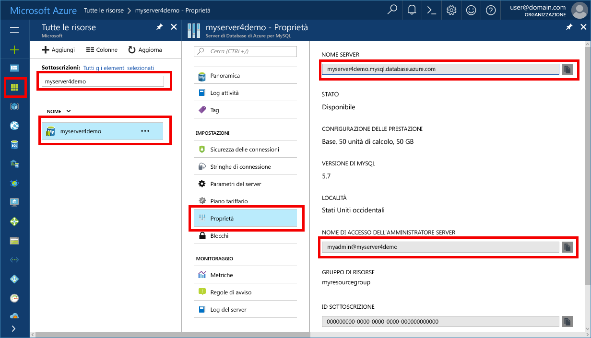

# <a name="azure-database-for-mysql-use-nodejs-tooconnect-and-query-data"></a><span data-ttu-id="ad0c5-103">Il Database di Azure per MySQL: usare Node.js tooconnect ed eseguire query sui dati</span><span class="sxs-lookup"><span data-stu-id="ad0c5-103">Azure Database for MySQL: Use Node.js tooconnect and query data</span></span>
<span data-ttu-id="ad0c5-104">Questa Guida introduttiva illustra come tooconnect tooan Database di Azure per l'utilizzo di MySQL [Node.js](https://nodejs.org/) da piattaforme di Windows, Ubuntu Linux e Mac.</span><span class="sxs-lookup"><span data-stu-id="ad0c5-104">This quickstart demonstrates how tooconnect tooan Azure Database for MySQL using [Node.js](https://nodejs.org/) from Windows, Ubuntu Linux, and Mac platforms.</span></span> <span data-ttu-id="ad0c5-105">Viene illustrato come toouse tooquery di istruzioni SQL, inserire, aggiornare ed eliminare dati nel database di hello.</span><span class="sxs-lookup"><span data-stu-id="ad0c5-105">It shows how toouse SQL statements tooquery, insert, update, and delete data in hello database.</span></span> <span data-ttu-id="ad0c5-106">Hello passaggi in questo articolo si presuppone che si ha familiarità con lo sviluppo usando Node.js e che siano tooworking nuovo con il Database di Azure per MySQL.</span><span class="sxs-lookup"><span data-stu-id="ad0c5-106">hello steps in this article assume that you are familiar with developing using Node.js, and that you are new tooworking with Azure Database for MySQL.</span></span>

## <a name="prerequisites"></a><span data-ttu-id="ad0c5-107">Prerequisiti</span><span class="sxs-lookup"><span data-stu-id="ad0c5-107">Prerequisites</span></span>
<span data-ttu-id="ad0c5-108">Questa Guida rapida utilizza risorse di hello create in una di queste guide come punto di partenza:</span><span class="sxs-lookup"><span data-stu-id="ad0c5-108">This quickstart uses hello resources created in either of these guides as a starting point:</span></span>
- <span data-ttu-id="ad0c5-109">[Create an Azure Database for MySQL server using Azure portal](./quickstart-create-mysql-server-database-using-azure-portal.md) (Creare un database di Azure per il server MySQL usando il portale di Azure)</span><span class="sxs-lookup"><span data-stu-id="ad0c5-109">[Create an Azure Database for MySQL server using Azure portal](./quickstart-create-mysql-server-database-using-azure-portal.md)</span></span>
- [<span data-ttu-id="ad0c5-110">Creare un database di Azure per il server MySQL tramite l'interfaccia della riga di comando di Azure</span><span class="sxs-lookup"><span data-stu-id="ad0c5-110">Create an Azure Database for MySQL server using Azure CLI</span></span>](./quickstart-create-mysql-server-database-using-azure-cli.md)

<span data-ttu-id="ad0c5-111">È anche necessario:</span><span class="sxs-lookup"><span data-stu-id="ad0c5-111">You also need to:</span></span>
- <span data-ttu-id="ad0c5-112">Installare hello [Node.js](https://nodejs.org) runtime.</span><span class="sxs-lookup"><span data-stu-id="ad0c5-112">Install hello [Node.js](https://nodejs.org) runtime.</span></span>
- <span data-ttu-id="ad0c5-113">Installare [mysql2](https://www.npmjs.com/package/mysql2) tooMySQL tooconnect da Node.js applicazione hello del pacchetto.</span><span class="sxs-lookup"><span data-stu-id="ad0c5-113">Install [mysql2](https://www.npmjs.com/package/mysql2) package tooconnect tooMySQL from hello Node.js application.</span></span> 

## <a name="install-nodejs-and-hello-mysql-connector"></a><span data-ttu-id="ad0c5-114">Installazione di Node.js e hello connettore MySQL</span><span class="sxs-lookup"><span data-stu-id="ad0c5-114">Install Node.js and hello MySQL connector</span></span>
<span data-ttu-id="ad0c5-115">A seconda della piattaforma, seguire hello istruzioni appropriate tooinstall Node.js.</span><span class="sxs-lookup"><span data-stu-id="ad0c5-115">Depending on your platform, follow hello appropriate instructions tooinstall Node.js.</span></span> <span data-ttu-id="ad0c5-116">Utilizzare un pacchetto mysql2 hello npm tooinstall e le relative dipendenze nella cartella del progetto.</span><span class="sxs-lookup"><span data-stu-id="ad0c5-116">Use npm tooinstall hello mysql2 package and its dependencies into your project folder.</span></span>

### <a name="windows"></a><span data-ttu-id="ad0c5-117">**Windows**</span><span class="sxs-lookup"><span data-stu-id="ad0c5-117">**Windows**</span></span>
1. <span data-ttu-id="ad0c5-118">Visitare hello [pagina di download di Node.js](https://nodejs.org/en/download/) e selezionare l'opzione di installazione di Windows desiderata.</span><span class="sxs-lookup"><span data-stu-id="ad0c5-118">Visit hello [Node.js downloads page](https://nodejs.org/en/download/) and select your desired Windows installer option.</span></span>
2. <span data-ttu-id="ad0c5-119">Creare una cartella di progetto locale, ad esempio `nodejsmysql`.</span><span class="sxs-lookup"><span data-stu-id="ad0c5-119">Make a local project folder such as `nodejsmysql`.</span></span> 
3. <span data-ttu-id="ad0c5-120">Avviare il prompt hello e cd, ad esempio nella cartella di progetto hello,`cd c:\nodejsmysql\`</span><span class="sxs-lookup"><span data-stu-id="ad0c5-120">Launch hello command prompt and cd into hello project folder, such as `cd c:\nodejsmysql\`</span></span>
4. <span data-ttu-id="ad0c5-121">Eseguire una libreria di hello NPM strumento tooinstall hello mysql2 nella cartella di progetto hello.</span><span class="sxs-lookup"><span data-stu-id="ad0c5-121">Run hello NPM tool tooinstall hello mysql2 library into hello project folder.</span></span>

   ```cmd
   cd c:\nodejsmysql\
   "C:\Program Files\nodejs\npm" install mysql2
   "C:\Program Files\nodejs\npm" list
   ```

5. <span data-ttu-id="ad0c5-122">Verificare l'installazione di hello controllando hello `npm list` output di testo per `mysql2@1.3.5`.</span><span class="sxs-lookup"><span data-stu-id="ad0c5-122">Verify hello installation by checking hello `npm list` output text for `mysql2@1.3.5`.</span></span>

### <a name="linux-ubuntu"></a><span data-ttu-id="ad0c5-123">**Linux (Ubuntu)**</span><span class="sxs-lookup"><span data-stu-id="ad0c5-123">**Linux (Ubuntu)**</span></span>
1. <span data-ttu-id="ad0c5-124">La seguente esecuzione hello comandi tooinstall **Node.js** e **npm** hello package manager per Node.js.</span><span class="sxs-lookup"><span data-stu-id="ad0c5-124">Run hello following commands tooinstall **Node.js** and **npm** hello package manager for Node.js.</span></span>

   ```bash
   sudo apt-get install -y nodejs npm
   ```

2. <span data-ttu-id="ad0c5-125">Eseguire hello toomake i comandi seguenti di una cartella di progetto `mysqlnodejs` e installare il pacchetto di mysql2 hello in tale cartella.</span><span class="sxs-lookup"><span data-stu-id="ad0c5-125">Run hello following commands toomake a project folder `mysqlnodejs` and install hello mysql2 package into that folder.</span></span>

   ```bash
   mkdir nodejsmysql
   cd nodejsmysql
   npm install --save mysql2
   npm list
   ```
3. <span data-ttu-id="ad0c5-126">Verificare l'installazione di hello controllando testo di output dell'elenco di npm per `mysql2@1.3.5`.</span><span class="sxs-lookup"><span data-stu-id="ad0c5-126">Verify hello installation by checking npm list output text for `mysql2@1.3.5`.</span></span>

### <a name="mac-os"></a><span data-ttu-id="ad0c5-127">**Mac OS**</span><span class="sxs-lookup"><span data-stu-id="ad0c5-127">**Mac OS**</span></span>
1. <span data-ttu-id="ad0c5-128">Immettere i seguenti comandi tooinstall hello **brew**, un manager di pacchetto da utilizzare per Mac OS X e **Node.js**.</span><span class="sxs-lookup"><span data-stu-id="ad0c5-128">Enter hello following commands tooinstall **brew**, an easy-to-use package manager for Mac OS X and **Node.js**.</span></span>

   ```bash
   ruby -e "$(curl -fsSL https://raw.githubusercontent.com/Homebrew/install/master/install)"
   brew install node
   ```
2. <span data-ttu-id="ad0c5-129">Eseguire hello toomake i comandi seguenti di una cartella di progetto `mysqlnodejs` e installare il pacchetto di mysql2 hello in tale cartella.</span><span class="sxs-lookup"><span data-stu-id="ad0c5-129">Run hello following commands toomake a project folder `mysqlnodejs` and install hello mysql2 package into that folder.</span></span>

   ```bash
   mkdir nodejsmysql
   cd nodejsmysql
   npm install --save mysql2
   npm list
   ```

3. <span data-ttu-id="ad0c5-130">Verificare l'installazione di hello controllando hello `npm list` output di testo per `mysql2@1.3.6`.</span><span class="sxs-lookup"><span data-stu-id="ad0c5-130">Verify hello installation by checking hello `npm list` output text for `mysql2@1.3.6`.</span></span> <span data-ttu-id="ad0c5-131">numero di versione Hello può variare vengono rilasciate nuove patch.</span><span class="sxs-lookup"><span data-stu-id="ad0c5-131">hello version number may vary as new patches are released.</span></span>

## <a name="get-connection-information"></a><span data-ttu-id="ad0c5-132">Ottenere informazioni di connessione</span><span class="sxs-lookup"><span data-stu-id="ad0c5-132">Get connection information</span></span>
<span data-ttu-id="ad0c5-133">Ottenere hello connessione le informazioni necessarie tooconnect toohello Database di Azure per MySQL.</span><span class="sxs-lookup"><span data-stu-id="ad0c5-133">Get hello connection information needed tooconnect toohello Azure Database for MySQL.</span></span> <span data-ttu-id="ad0c5-134">È necessario hello le credenziali di nome e l'account di accesso completo del server.</span><span class="sxs-lookup"><span data-stu-id="ad0c5-134">You need hello fully qualified server name and login credentials.</span></span>

1. <span data-ttu-id="ad0c5-135">Accedi toohello [portale di Azure](https://portal.azure.com/).</span><span class="sxs-lookup"><span data-stu-id="ad0c5-135">Log in toohello [Azure portal](https://portal.azure.com/).</span></span>
2. <span data-ttu-id="ad0c5-136">Nel riquadro di sinistra hello, fare clic su **tutte le risorse**e quindi cercare server hello sia stato creato (ad esempio, **myserver4demo**).</span><span class="sxs-lookup"><span data-stu-id="ad0c5-136">In hello left pane, click **All resources**, and then search for hello server you have created (for example, **myserver4demo**).</span></span>
3. <span data-ttu-id="ad0c5-137">Fare clic sul nome di server hello **myserver4demo**.</span><span class="sxs-lookup"><span data-stu-id="ad0c5-137">Click hello server name **myserver4demo**.</span></span>
4. <span data-ttu-id="ad0c5-138">Server di selezionare hello **proprietà** pagina.</span><span class="sxs-lookup"><span data-stu-id="ad0c5-138">Select hello server's **Properties** page.</span></span> <span data-ttu-id="ad0c5-139">Prendere nota di hello **nome Server** e **nome account di accesso di amministratore Server**.</span><span class="sxs-lookup"><span data-stu-id="ad0c5-139">Make a note of hello **Server name** and **Server admin login name**.</span></span>
 <span data-ttu-id="ad0c5-140"></span><span class="sxs-lookup"><span data-stu-id="ad0c5-140"></span></span>
5. <span data-ttu-id="ad0c5-141">Se si dimenticano le informazioni di accesso del server, passare toohello **Panoramica** pagina nome account di accesso amministratore di tooview hello Server e, se necessario, reimpostare la password di hello.</span><span class="sxs-lookup"><span data-stu-id="ad0c5-141">If you forget your server login information, navigate toohello **Overview** page tooview hello Server admin login name and, if necessary, reset hello password.</span></span>

## <a name="running-hello-javascript-code-in-nodejs"></a><span data-ttu-id="ad0c5-142">Esecuzione di codice JavaScript hello in Node.js</span><span class="sxs-lookup"><span data-stu-id="ad0c5-142">Running hello JavaScript code in Node.js</span></span>
1. <span data-ttu-id="ad0c5-143">Incollare il codice JavaScript hello in file di testo e salvare in una cartella di progetto con estensione js file, ad esempio C:\nodejsmysql\createtable.js o /home/username/nodejsmysql/createtable.js</span><span class="sxs-lookup"><span data-stu-id="ad0c5-143">Paste hello JavaScript code into text files, and save into a project folder with file extension .js, such as C:\nodejsmysql\createtable.js or /home/username/nodejsmysql/createtable.js</span></span>
2. <span data-ttu-id="ad0c5-144">Avviare il prompt di comandi hello o della shell bash.</span><span class="sxs-lookup"><span data-stu-id="ad0c5-144">Launch hello command prompt or bash shell.</span></span> <span data-ttu-id="ad0c5-145">Passare alla cartella del progetto `cd nodejsmysql`.</span><span class="sxs-lookup"><span data-stu-id="ad0c5-145">Change directory into your project folder `cd nodejsmysql`.</span></span>
3. <span data-ttu-id="ad0c5-146">un'applicazione hello toorun, digitare il comando di nodo hello seguito dal nome di file hello, ad esempio `node createtable.js`.</span><span class="sxs-lookup"><span data-stu-id="ad0c5-146">toorun hello application, type hello node command followed by hello file name, such as `node createtable.js`.</span></span>
4. <span data-ttu-id="ad0c5-147">In Windows, se un'applicazione hello nodo non è presente nel proprio percorso di variabile di ambiente, potrebbe essere necessario toouse hello percorso completo toolaunch hello nodo dell'applicazione, ad esempio`"C:\Program Files\nodejs\node.exe" createtable.js`</span><span class="sxs-lookup"><span data-stu-id="ad0c5-147">On Windows, if hello node application is not in your environment variable path, you may need toouse hello full path toolaunch hello node application, such as `"C:\Program Files\nodejs\node.exe" createtable.js`</span></span>

## <a name="connect-create-table-and-insert-data"></a><span data-ttu-id="ad0c5-148">Connettersi, creare tabelle e inserire dati</span><span class="sxs-lookup"><span data-stu-id="ad0c5-148">Connect, create table, and insert data</span></span>
<span data-ttu-id="ad0c5-149">Seguente hello utilizzare codice tooconnect e caricare i dati di hello usando **CREATE TABLE** e **INSERT INTO** istruzioni SQL.</span><span class="sxs-lookup"><span data-stu-id="ad0c5-149">Use hello following code tooconnect and load hello data using **CREATE TABLE** and  **INSERT INTO** SQL statements.</span></span>

<span data-ttu-id="ad0c5-150">Hello [mysql.createConnection()](https://github.com/mysqljs/mysql#establishing-connections) metodo è toointerface utilizzato con il server MySQL hello.</span><span class="sxs-lookup"><span data-stu-id="ad0c5-150">hello [mysql.createConnection()](https://github.com/mysqljs/mysql#establishing-connections) method is used toointerface with hello MySQL server.</span></span> <span data-ttu-id="ad0c5-151">Hello [Connect ()](https://github.com/mysqljs/mysql#establishing-connections) funzione è utilizzata tooestablish hello connessione toohello server.</span><span class="sxs-lookup"><span data-stu-id="ad0c5-151">hello [connect()](https://github.com/mysqljs/mysql#establishing-connections) function is used tooestablish hello connection toohello server.</span></span> <span data-ttu-id="ad0c5-152">Hello [query ()](https://github.com/mysqljs/mysql#performing-queries) funzione è tooexecute utilizzati nella query SQL hello database MySQL.</span><span class="sxs-lookup"><span data-stu-id="ad0c5-152">hello [query()](https://github.com/mysqljs/mysql#performing-queries) function is used tooexecute hello SQL query against MySQL database.</span></span> 

<span data-ttu-id="ad0c5-153">Sostituire hello `host`, `user`, `password`, e `database` parametri con valori di hello specificato al momento della creazione hello server e database.</span><span class="sxs-lookup"><span data-stu-id="ad0c5-153">Replace hello `host`, `user`, `password`, and `database` parameters with hello values that you specified when you created hello server and database.</span></span>

```javascript
const mysql = require('mysql2');

var config =
{
    host: 'myserver4demo.mysql.database.azure.com',
    user: 'myadmin@myserver4demo',
    password: 'your_password',
    database: 'quickstartdb',
    port: 3306,
    ssl: true
};

const conn = new mysql.createConnection(config);

conn.connect(
    function (err) { 
    if (err) { 
        console.log("!!! Cannot connect !!! Error:");
        throw err;
    }
    else
    {
       console.log("Connection established.");
           queryDatabase();
    }   
});

function queryDatabase(){
       conn.query('DROP TABLE IF EXISTS inventory;', function (err, results, fields) { 
            if (err) throw err; 
            console.log('Dropped inventory table if existed.');
        })
       conn.query('CREATE TABLE inventory (id serial PRIMARY KEY, name VARCHAR(50), quantity INTEGER);', 
            function (err, results, fields) {
                if (err) throw err;
            console.log('Created inventory table.');
        })
       conn.query('INSERT INTO inventory (name, quantity) VALUES (?, ?);', ['banana', 150], 
            function (err, results, fields) {
                if (err) throw err;
            else console.log('Inserted ' + results.affectedRows + ' row(s).');
        })
       conn.query('INSERT INTO inventory (name, quantity) VALUES (?, ?);', ['orange', 154], 
            function (err, results, fields) {
                if (err) throw err;
            console.log('Inserted ' + results.affectedRows + ' row(s).');
        })
       conn.query('INSERT INTO inventory (name, quantity) VALUES (?, ?);', ['apple', 100], 
        function (err, results, fields) {
                if (err) throw err;
            console.log('Inserted ' + results.affectedRows + ' row(s).');
        })
       conn.end(function (err) { 
        if (err) throw err;
        else  console.log('Done.') 
        });
};
```

## <a name="read-data"></a><span data-ttu-id="ad0c5-154">Leggere i dati</span><span class="sxs-lookup"><span data-stu-id="ad0c5-154">Read data</span></span>
<span data-ttu-id="ad0c5-155">Seguente hello utilizzare codice tooconnect e leggere hello dati utilizzando un **selezionare** istruzione SQL.</span><span class="sxs-lookup"><span data-stu-id="ad0c5-155">Use hello following code tooconnect and read hello data using a **SELECT** SQL statement.</span></span> 

<span data-ttu-id="ad0c5-156">Hello [mysql.createConnection()](https://github.com/mysqljs/mysql#establishing-connections) metodo è toointerface utilizzato con il server MySQL hello.</span><span class="sxs-lookup"><span data-stu-id="ad0c5-156">hello [mysql.createConnection()](https://github.com/mysqljs/mysql#establishing-connections) method is used toointerface with hello MySQL server.</span></span> <span data-ttu-id="ad0c5-157">Hello [Connect ()](https://github.com/mysqljs/mysql#establishing-connections) metodo è usato tooestablish hello connessione toohello server.</span><span class="sxs-lookup"><span data-stu-id="ad0c5-157">hello [connect()](https://github.com/mysqljs/mysql#establishing-connections) method is used tooestablish hello connection toohello server.</span></span> <span data-ttu-id="ad0c5-158">Hello [query ()](https://github.com/mysqljs/mysql#performing-queries) metodo è usato tooexecute hello SQL query database MySQL.</span><span class="sxs-lookup"><span data-stu-id="ad0c5-158">hello [query()](https://github.com/mysqljs/mysql#performing-queries) method is used tooexecute hello SQL query against MySQL database.</span></span> <span data-ttu-id="ad0c5-159">Matrice di risultati Hello è usato toohold hello risultati della query hello.</span><span class="sxs-lookup"><span data-stu-id="ad0c5-159">hello results array is used toohold hello results of hello query.</span></span>

<span data-ttu-id="ad0c5-160">Sostituire hello `host`, `user`, `password`, e `database` parametri con valori di hello specificato al momento della creazione hello server e database.</span><span class="sxs-lookup"><span data-stu-id="ad0c5-160">Replace hello `host`, `user`, `password`, and `database` parameters with hello values that you specified when you created hello server and database.</span></span>

```javascript
const mysql = require('mysql2');

var config =
{
    host: 'myserver4demo.mysql.database.azure.com',
    user: 'myadmin@myserver4demo',
    password: 'your_password',
    database: 'quickstartdb',
    port: 3306,
    ssl: true
};

const conn = new mysql.createConnection(config);

conn.connect(
    function (err) { 
        if (err) { 
            console.log("!!! Cannot connect !!! Error:");
            throw err;
        }
        else {
            console.log("Connection established.");
            readData();
        }   
    });

function readData(){
        conn.query('SELECT * FROM inventory', 
            function (err, results, fields) {
                if (err) throw err;
                else console.log('Selected ' + results.length + ' row(s).');
                for (i = 0; i < results.length; i++) {
                    console.log('Row: ' + JSON.stringify(results[i]));
                }
                console.log('Done.');
            })
       conn.end(
           function (err) { 
                if (err) throw err;
                else  console.log('Closing connection.') 
        });
};
```

## <a name="update-data"></a><span data-ttu-id="ad0c5-161">Aggiornare i dati</span><span class="sxs-lookup"><span data-stu-id="ad0c5-161">Update data</span></span>
<span data-ttu-id="ad0c5-162">Seguente hello utilizzare codice tooconnect e leggere hello dati utilizzando un **aggiornamento** istruzione SQL.</span><span class="sxs-lookup"><span data-stu-id="ad0c5-162">Use hello following code tooconnect and read hello data using a **UPDATE** SQL statement.</span></span> 

<span data-ttu-id="ad0c5-163">Hello [mysql.createConnection()](https://github.com/mysqljs/mysql#establishing-connections) metodo è toointerface utilizzato con il server MySQL hello.</span><span class="sxs-lookup"><span data-stu-id="ad0c5-163">hello [mysql.createConnection()](https://github.com/mysqljs/mysql#establishing-connections) method is used toointerface with hello MySQL server.</span></span> <span data-ttu-id="ad0c5-164">Hello [Connect ()](https://github.com/mysqljs/mysql#establishing-connections) metodo è usato tooestablish hello connessione toohello server.</span><span class="sxs-lookup"><span data-stu-id="ad0c5-164">hello [connect()](https://github.com/mysqljs/mysql#establishing-connections) method is used tooestablish hello connection toohello server.</span></span> <span data-ttu-id="ad0c5-165">Hello [query ()](https://github.com/mysqljs/mysql#performing-queries) metodo è usato tooexecute hello SQL query database MySQL.</span><span class="sxs-lookup"><span data-stu-id="ad0c5-165">hello [query()](https://github.com/mysqljs/mysql#performing-queries) method is used tooexecute hello SQL query against MySQL database.</span></span> 

<span data-ttu-id="ad0c5-166">Sostituire hello `host`, `user`, `password`, e `database` parametri con valori di hello specificato al momento della creazione hello server e database.</span><span class="sxs-lookup"><span data-stu-id="ad0c5-166">Replace hello `host`, `user`, `password`, and `database` parameters with hello values that you specified when you created hello server and database.</span></span>

```javascript
const mysql = require('mysql2');

var config =
{
    host: 'myserver4demo.mysql.database.azure.com',
    user: 'myadmin@myserver4demo',
    password: 'your_password',
    database: 'quickstartdb',
    port: 3306,
    ssl: true
};

const conn = new mysql.createConnection(config);

conn.connect(
    function (err) { 
        if (err) { 
            console.log("!!! Cannot connect !!! Error:");
            throw err;
        }
        else {
            console.log("Connection established.");
            updateData();
        }   
    });

function updateData(){
       conn.query('UPDATE inventory SET quantity = ? WHERE name = ?', [200, 'banana'], 
            function (err, results, fields) {
                if (err) throw err;
                else console.log('Updated ' + results.affectedRows + ' row(s).');
        })
       conn.end(
           function (err) { 
                if (err) throw err;
                else  console.log('Done.') 
        });
};
```

## <a name="delete-data"></a><span data-ttu-id="ad0c5-167">Eliminare i dati</span><span class="sxs-lookup"><span data-stu-id="ad0c5-167">Delete data</span></span>
<span data-ttu-id="ad0c5-168">Seguente hello utilizzare codice tooconnect e leggere hello dati utilizzando un **eliminare** istruzione SQL.</span><span class="sxs-lookup"><span data-stu-id="ad0c5-168">Use hello following code tooconnect and read hello data using a **DELETE** SQL statement.</span></span> 

<span data-ttu-id="ad0c5-169">Hello [mysql.createConnection()](https://github.com/mysqljs/mysql#establishing-connections) metodo è toointerface utilizzato con il server MySQL hello.</span><span class="sxs-lookup"><span data-stu-id="ad0c5-169">hello [mysql.createConnection()](https://github.com/mysqljs/mysql#establishing-connections) method is used toointerface with hello MySQL server.</span></span> <span data-ttu-id="ad0c5-170">Hello [Connect ()](https://github.com/mysqljs/mysql#establishing-connections) metodo è usato tooestablish hello connessione toohello server.</span><span class="sxs-lookup"><span data-stu-id="ad0c5-170">hello [connect()](https://github.com/mysqljs/mysql#establishing-connections) method is used tooestablish hello connection toohello server.</span></span> <span data-ttu-id="ad0c5-171">Hello [query ()](https://github.com/mysqljs/mysql#performing-queries) metodo è usato tooexecute hello SQL query database MySQL.</span><span class="sxs-lookup"><span data-stu-id="ad0c5-171">hello [query()](https://github.com/mysqljs/mysql#performing-queries) method is used tooexecute hello SQL query against MySQL database.</span></span> 

<span data-ttu-id="ad0c5-172">Sostituire hello `host`, `user`, `password`, e `database` parametri con valori di hello specificato al momento della creazione hello server e database.</span><span class="sxs-lookup"><span data-stu-id="ad0c5-172">Replace hello `host`, `user`, `password`, and `database` parameters with hello values that you specified when you created hello server and database.</span></span>

```javascript
const mysql = require('mysql2');

var config =
{
    host: 'myserver4demo.mysql.database.azure.com',
    user: 'myadmin@myserver4demo',
    password: 'your_password',
    database: 'quickstartdb',
    port: 3306,
    ssl: true
};

const conn = new mysql.createConnection(config);

conn.connect(
    function (err) { 
        if (err) { 
            console.log("!!! Cannot connect !!! Error:");
            throw err;
        }
        else {
            console.log("Connection established.");
            deleteData();
        }   
    });

function deleteData(){
       conn.query('DELETE FROM inventory WHERE name = ?', ['orange'], 
            function (err, results, fields) {
                if (err) throw err;
                else console.log('Deleted ' + results.affectedRows + ' row(s).');
        })
       conn.end(
           function (err) { 
                if (err) throw err;
                else  console.log('Done.') 
        });
};
```

## <a name="next-steps"></a><span data-ttu-id="ad0c5-173">Passaggi successivi</span><span class="sxs-lookup"><span data-stu-id="ad0c5-173">Next steps</span></span>
> [!div class="nextstepaction"]
> [<span data-ttu-id="ad0c5-174">Eseguire la migrazione del database usando le funzionalità di esportazione e importazione</span><span class="sxs-lookup"><span data-stu-id="ad0c5-174">Migrate your database using Export and Import</span></span>](./concepts-migrate-import-export.md)
