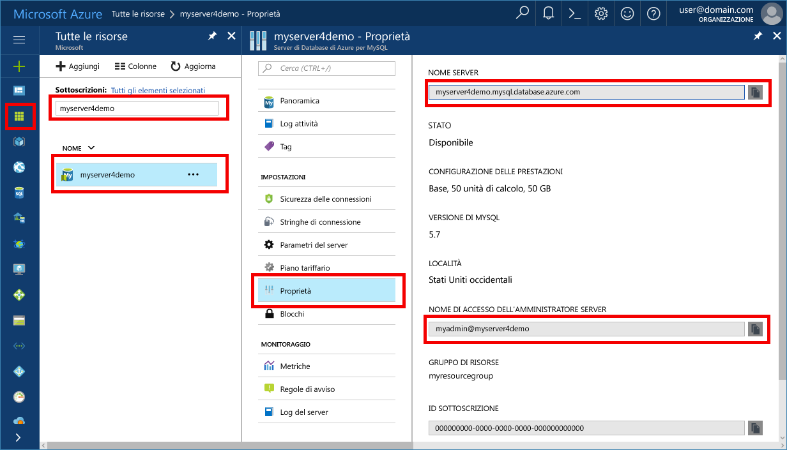

# <a name="azure-database-for-mysql-use-ruby-to-connect-and-query-data"></a><span data-ttu-id="c6870-103">Database di Azure per MySQL: usare Ruby per connettersi ed eseguire query sui dati</span><span class="sxs-lookup"><span data-stu-id="c6870-103">Azure Database for MySQL: Use Ruby to connect and query data</span></span>
<span data-ttu-id="c6870-104">Questa guida introduttiva illustra come connettersi a un database di Azure per MySQL usando un'applicazione [Ruby](https://www.ruby-lang.org) e Gem [mysql2](https://rubygems.org/gems/mysql2) dalle piattaforme Windows, Ubuntu Linux e Mac.</span><span class="sxs-lookup"><span data-stu-id="c6870-104">This quickstart demonstrates how to connect to an Azure Database for MySQL using a [Ruby](https://www.ruby-lang.org) application and the [mysql2](https://rubygems.org/gems/mysql2) gem from Windows, Ubuntu Linux, and Mac platforms.</span></span> <span data-ttu-id="c6870-105">Spiega come usare le istruzioni SQL per eseguire query, inserire, aggiornare ed eliminare dati nel database.</span><span class="sxs-lookup"><span data-stu-id="c6870-105">It shows how to use SQL statements to query, insert, update, and delete data in the database.</span></span> <span data-ttu-id="c6870-106">Questo articolo presuppone che si abbia familiarità con lo sviluppo con Ruby, ma non con Database di Azure per MySQL.</span><span class="sxs-lookup"><span data-stu-id="c6870-106">This article assumes you are familiar with development using Ruby, but that you are new to working with Azure Database for MySQL.</span></span>

## <a name="prerequisites"></a><span data-ttu-id="c6870-107">Prerequisiti</span><span class="sxs-lookup"><span data-stu-id="c6870-107">Prerequisites</span></span>
<span data-ttu-id="c6870-108">Questa guida introduttiva usa le risorse create in una delle guide seguenti come punto di partenza:</span><span class="sxs-lookup"><span data-stu-id="c6870-108">This quickstart uses the resources created in either of these guides as a starting point:</span></span>
- [<span data-ttu-id="c6870-109">Creare un database di Azure per il server MySQL tramite il portale di Azure</span><span class="sxs-lookup"><span data-stu-id="c6870-109">Create an Azure Database for MySQL server using Azure portal</span></span>](./quickstart-create-mysql-server-database-using-azure-portal.md)
- <span data-ttu-id="c6870-110">[Create an Azure Database for MySQL server using Azure CLI](./quickstart-create-mysql-server-database-using-azure-cli.md) (Creare un database di Azure per il server MySQL usando l'interfaccia della riga di comando di Azure)</span><span class="sxs-lookup"><span data-stu-id="c6870-110">[Create an Azure Database for MySQL server using Azure CLI](./quickstart-create-mysql-server-database-using-azure-cli.md)</span></span>

## <a name="install-ruby"></a><span data-ttu-id="c6870-111">Installare Ruby</span><span class="sxs-lookup"><span data-stu-id="c6870-111">Install Ruby</span></span>
<span data-ttu-id="c6870-112">Installare Ruby, Gem e la libreria MySQL2 nel computer.</span><span class="sxs-lookup"><span data-stu-id="c6870-112">Install Ruby, Gem, and the MySQL2 library on your own machine.</span></span> 

### <a name="windows"></a><span data-ttu-id="c6870-113">Windows</span><span class="sxs-lookup"><span data-stu-id="c6870-113">Windows</span></span>
1. <span data-ttu-id="c6870-114">Scaricare e installare la versione 2.3 di [Ruby](http://rubyinstaller.org/downloads/).</span><span class="sxs-lookup"><span data-stu-id="c6870-114">Download and Install the 2.3 version of [Ruby](http://rubyinstaller.org/downloads/).</span></span>
2. <span data-ttu-id="c6870-115">Avviare un nuovo prompt dei comandi (cmd) dal menu Start.</span><span class="sxs-lookup"><span data-stu-id="c6870-115">Launch a new command prompt (cmd) from the Start menu.</span></span>
3. <span data-ttu-id="c6870-116">Passare alla directory di Ruby per la versione 2.3.</span><span class="sxs-lookup"><span data-stu-id="c6870-116">Change directory into the Ruby directory for version 2.3.</span></span> `cd c:\Ruby23-x64\bin`
4. <span data-ttu-id="c6870-117">Verificare l'installazione di Ruby eseguendo il comando `ruby -v` per visualizzare la versione installata.</span><span class="sxs-lookup"><span data-stu-id="c6870-117">Test the Ruby installation by running the command `ruby -v` to see the version installed.</span></span>
5. <span data-ttu-id="c6870-118">Verificare l'installazione di Gem eseguendo il comando `gem -v` per visualizzare la versione installata.</span><span class="sxs-lookup"><span data-stu-id="c6870-118">Test the Gem installation by running the command `gem -v` to see the version installed.</span></span>
6. <span data-ttu-id="c6870-119">Compilare il modulo Mysql2 per Ruby con Gem eseguendo il comando `gem install mysql2`.</span><span class="sxs-lookup"><span data-stu-id="c6870-119">Build the Mysql2 module for Ruby using Gem by running the command `gem install mysql2`.</span></span>

### <a name="macos"></a><span data-ttu-id="c6870-120">MacOS</span><span class="sxs-lookup"><span data-stu-id="c6870-120">MacOS</span></span>
1. <span data-ttu-id="c6870-121">Eseguire il comando `brew install ruby` per installare Ruby usando Homebrew.</span><span class="sxs-lookup"><span data-stu-id="c6870-121">Install Ruby using Homebrew by running the command `brew install ruby`.</span></span> <span data-ttu-id="c6870-122">Per altre opzioni di installazione, vedere la [documentazione sull'installazione](https://www.ruby-lang.org/en/documentation/installation/#homebrew) di Ruby.</span><span class="sxs-lookup"><span data-stu-id="c6870-122">For more installation options, see the Ruby [installation documentation](https://www.ruby-lang.org/en/documentation/installation/#homebrew).</span></span>
2. <span data-ttu-id="c6870-123">Verificare l'installazione di Ruby eseguendo il comando `ruby -v` per visualizzare la versione installata.</span><span class="sxs-lookup"><span data-stu-id="c6870-123">Test the Ruby installation by running the command `ruby -v` to see the version installed.</span></span>
3. <span data-ttu-id="c6870-124">Verificare l'installazione di Gem eseguendo il comando `gem -v` per visualizzare la versione installata.</span><span class="sxs-lookup"><span data-stu-id="c6870-124">Test the Gem installation by running the command `gem -v` to see the version installed.</span></span>
4. <span data-ttu-id="c6870-125">Compilare il modulo Mysql2 per Ruby con Gem eseguendo il comando `gem install mysql2`.</span><span class="sxs-lookup"><span data-stu-id="c6870-125">Build the Mysql2 module for Ruby using Gem by running the command `gem install mysql2`.</span></span>

### <a name="linux-ubuntu"></a><span data-ttu-id="c6870-126">Linux (Ubuntu)</span><span class="sxs-lookup"><span data-stu-id="c6870-126">Linux (Ubuntu)</span></span>
1. <span data-ttu-id="c6870-127">Installare Ruby eseguendo il comando `sudo apt-get install ruby-full`.</span><span class="sxs-lookup"><span data-stu-id="c6870-127">Install Ruby by running the command `sudo apt-get install ruby-full`.</span></span> <span data-ttu-id="c6870-128">Per altre opzioni di installazione, vedere la [documentazione sull'installazione](https://www.ruby-lang.org/en/documentation/installation/) di Ruby.</span><span class="sxs-lookup"><span data-stu-id="c6870-128">For more installation options, see the Ruby [installation documentation](https://www.ruby-lang.org/en/documentation/installation/).</span></span>
2. <span data-ttu-id="c6870-129">Verificare l'installazione di Ruby eseguendo il comando `ruby -v` per visualizzare la versione installata.</span><span class="sxs-lookup"><span data-stu-id="c6870-129">Test the Ruby installation by running the command `ruby -v` to see the version installed.</span></span>
3. <span data-ttu-id="c6870-130">Installare gli aggiornamenti più recenti per Gem eseguendo il comando `sudo gem update --system`.</span><span class="sxs-lookup"><span data-stu-id="c6870-130">Install the latest updates for Gem by running the command `sudo gem update --system`.</span></span>
4. <span data-ttu-id="c6870-131">Verificare l'installazione di Gem eseguendo il comando `gem -v` per visualizzare la versione installata.</span><span class="sxs-lookup"><span data-stu-id="c6870-131">Test the Gem installation by running the command `gem -v` to see the version installed.</span></span>
5. <span data-ttu-id="c6870-132">Installare gcc, make e altri strumenti di compilazione eseguendo il comando `sudo apt-get install build-essential`.</span><span class="sxs-lookup"><span data-stu-id="c6870-132">Install the gcc, make, and other build tools by running the command `sudo apt-get install build-essential`.</span></span>
6. <span data-ttu-id="c6870-133">Installare le librerie di sviluppo client MySQL eseguendo il comando `sudo apt-get install libmysqlclient-dev`.</span><span class="sxs-lookup"><span data-stu-id="c6870-133">Install the MySQL client developer libraries by running the command `sudo apt-get install libmysqlclient-dev`.</span></span>
7. <span data-ttu-id="c6870-134">Compilare il modulo Mysql2 per Ruby con Gem eseguendo il comando `sudo gem install mysql2`.</span><span class="sxs-lookup"><span data-stu-id="c6870-134">Build the mysql2 module for Ruby using Gem by running the command `sudo gem install mysql2`.</span></span>

## <a name="get-connection-information"></a><span data-ttu-id="c6870-135">Ottenere informazioni di connessione</span><span class="sxs-lookup"><span data-stu-id="c6870-135">Get connection information</span></span>
<span data-ttu-id="c6870-136">Ottenere le informazioni di connessione necessarie per connettersi al database di Azure per MySQL.</span><span class="sxs-lookup"><span data-stu-id="c6870-136">Get the connection information needed to connect to the Azure Database for MySQL.</span></span> <span data-ttu-id="c6870-137">Sono necessari il nome del server completo e le credenziali di accesso.</span><span class="sxs-lookup"><span data-stu-id="c6870-137">You need the fully qualified server name and login credentials.</span></span>

1. <span data-ttu-id="c6870-138">Accedere al [Portale di Azure](https://portal.azure.com/).</span><span class="sxs-lookup"><span data-stu-id="c6870-138">Log in to the [Azure portal](https://portal.azure.com/).</span></span>
2. <span data-ttu-id="c6870-139">Nel menu a sinistra nel portale di Azure fare clic su **Tutte le risorse** e cercare il server creato, ad esempio **myserver4demo**.</span><span class="sxs-lookup"><span data-stu-id="c6870-139">From the left-hand menu in Azure portal, click **All resources** and search for the server you have creased, such as **myserver4demo**.</span></span>
3. <span data-ttu-id="c6870-140">Fare clic sul nome server **myserver4demo**.</span><span class="sxs-lookup"><span data-stu-id="c6870-140">Click the server name **myserver4demo**.</span></span>
4. <span data-ttu-id="c6870-141">Selezionare la pagina **Proprietà** del server.</span><span class="sxs-lookup"><span data-stu-id="c6870-141">Select the server's **Properties** page.</span></span> <span data-ttu-id="c6870-142">Annotare il **Nome server** e il **nome di accesso dell'amministratore del server**.</span><span class="sxs-lookup"><span data-stu-id="c6870-142">Make a note of the **Server name** and **Server admin login name**.</span></span>
 <span data-ttu-id="c6870-143"></span><span class="sxs-lookup"><span data-stu-id="c6870-143"></span></span>
5. <span data-ttu-id="c6870-144">Se si dimenticano le informazioni di accesso per il server, passare alla pagina **Panoramica** per visualizzare il nome di accesso dell'amministratore del server e, se necessario, reimpostare la password.</span><span class="sxs-lookup"><span data-stu-id="c6870-144">If you forget your server login information, navigate to the **Overview** page to view the Server admin login name and, if necessary, reset the password.</span></span>

## <a name="run-ruby-code"></a><span data-ttu-id="c6870-145">Eseguire il codice Ruby</span><span class="sxs-lookup"><span data-stu-id="c6870-145">Run Ruby code</span></span> 
1. <span data-ttu-id="c6870-146">Incollare in file di testo il codice Ruby riportato nelle sezioni seguenti, quindi salvare i file nella cartella del progetto con l'estensione rb, ad esempio `C:\rubymysql\createtable.rb` o `/home/username/rubymysql/createtable.rb`.</span><span class="sxs-lookup"><span data-stu-id="c6870-146">Paste the Ruby code from the sections below into text files, and save the files into a project folder with file extension .rb, such as `C:\rubymysql\createtable.rb` or `/home/username/rubymysql/createtable.rb`.</span></span>
2. <span data-ttu-id="c6870-147">Per eseguire il codice, avviare il prompt dei comandi o la shell Bash.</span><span class="sxs-lookup"><span data-stu-id="c6870-147">To run the code, launch the command prompt or bash shell.</span></span> <span data-ttu-id="c6870-148">Passare alla cartella del progetto `cd rubymysql`</span><span class="sxs-lookup"><span data-stu-id="c6870-148">Change directory into your project folder `cd rubymysql`</span></span>
3. <span data-ttu-id="c6870-149">Per eseguire l'applicazione, digitare quindi il comando ruby seguito dal nome del file, ad esempio `ruby createtable.rb`.</span><span class="sxs-lookup"><span data-stu-id="c6870-149">Then type the ruby command followed by the file name, such as `ruby createtable.rb` to run the application.</span></span>
4. <span data-ttu-id="c6870-150">Nel sistema operativo Windows, se l'applicazione Ruby non è presente nella variabile di ambiente PATH potrebbe essere necessario usare il percorso completo per avviare l'applicazione Ruby, ad esempio `"c:\Ruby23-x64\bin\ruby.exe" createtable.rb`</span><span class="sxs-lookup"><span data-stu-id="c6870-150">On the Windows OS, if the ruby application is not in your path environment variable, you may need to use the full path to launch the node application, such as `"c:\Ruby23-x64\bin\ruby.exe" createtable.rb`</span></span>

## <a name="connect-and-create-a-table"></a><span data-ttu-id="c6870-151">Connettersi e creare una tabella</span><span class="sxs-lookup"><span data-stu-id="c6870-151">Connect and create a table</span></span>
<span data-ttu-id="c6870-152">Usare il codice seguente per connettersi e creare una tabella usando l'istruzione SQL **CREATE TABLE**, seguita dalle istruzioni SQL **INSERT INTO** per aggiungere righe nella tabella.</span><span class="sxs-lookup"><span data-stu-id="c6870-152">Use the following code to connect and create a table using **CREATE TABLE** SQL statement, followed by **INSERT INTO** SQL statements to add rows into the table.</span></span>

<span data-ttu-id="c6870-153">Il codice usa un metodo [mysql2::client](http://www.rubydoc.info/gems/mysql2/0.4.8) class .new() per la connessione ad Azure Database per MySQL.</span><span class="sxs-lookup"><span data-stu-id="c6870-153">The code uses a [mysql2::client](http://www.rubydoc.info/gems/mysql2/0.4.8) class .new() method to connect to Azure Database for MySQL.</span></span> <span data-ttu-id="c6870-154">Chiama quindi il metodo [query()](http://www.rubydoc.info/gems/mysql2/0.4.8#Usage) più volte per eseguire i comandi DROP, CREATE TABLE e INSERT INTO.</span><span class="sxs-lookup"><span data-stu-id="c6870-154">Then it calls method [query()](http://www.rubydoc.info/gems/mysql2/0.4.8#Usage) several times to run the DROP, CREATE TABLE, and INSERT INTO commands.</span></span> <span data-ttu-id="c6870-155">Chiama infine il metodo [close()](http://www.rubydoc.info/gems/mysql2/0.4.8/Mysql2/Client#close-instance_method) per chiudere la connessione prima di terminare.</span><span class="sxs-lookup"><span data-stu-id="c6870-155">Then it calls method [close()](http://www.rubydoc.info/gems/mysql2/0.4.8/Mysql2/Client#close-instance_method) to close the connection before terminating.</span></span>

<span data-ttu-id="c6870-156">Sostituire le stringhe `host`, `database`, `username` e `password` con valori personalizzati.</span><span class="sxs-lookup"><span data-stu-id="c6870-156">Replace the `host`, `database`, `username`, and `password` strings with your own values.</span></span> 
```ruby
require 'mysql2'

begin
    # Initialize connection variables.
    host = String('myserver4demo.mysql.database.azure.com')
    database = String('quickstartdb')
    username = String('myadmin@myserver4demo')
    password = String('yourpassword')

    # Initialize connection object.
    client = Mysql2::Client.new(:host => host, :username => username, :database => database, :password => password)
    puts 'Successfully created connection to database.'

    # Drop previous table of same name if one exists
    client.query('DROP TABLE IF EXISTS inventory;')
    puts 'Finished dropping table (if existed).'

    # Drop previous table of same name if one exists.
    client.query('CREATE TABLE inventory (id serial PRIMARY KEY, name VARCHAR(50), quantity INTEGER);')
    puts 'Finished creating table.'

    # Insert some data into table.
    client.query("INSERT INTO inventory VALUES(1, 'banana', 150)")
    client.query("INSERT INTO inventory VALUES(2, 'orange', 154)")
    client.query("INSERT INTO inventory VALUES(3, 'apple', 100)")
    puts 'Inserted 3 rows of data.'

# Error handling
rescue Exception => e
    puts e.message

# Cleanup
ensure
    client.close if client
    puts 'Done.'
end
```

## <a name="read-data"></a><span data-ttu-id="c6870-157">Leggere i dati</span><span class="sxs-lookup"><span data-stu-id="c6870-157">Read data</span></span>
<span data-ttu-id="c6870-158">Usare il codice seguente per connettersi e leggere i dati usando un'istruzione SQL **SELECT**.</span><span class="sxs-lookup"><span data-stu-id="c6870-158">Use the following code to connect and read the data using a **SELECT** SQL statement.</span></span> 

<span data-ttu-id="c6870-159">Il codice usa un metodo [mysql2::client](http://www.rubydoc.info/gems/mysql2/0.4.8) class .new() per la connessione ad Azure Database per MySQL.</span><span class="sxs-lookup"><span data-stu-id="c6870-159">The code uses a [mysql2::client](http://www.rubydoc.info/gems/mysql2/0.4.8) class .new() method to connect to Azure Database for MySQL.</span></span> <span data-ttu-id="c6870-160">Chiama quindi il metodo [query()](http://www.rubydoc.info/gems/mysql2/0.4.8#Usage) per eseguire i comandi SELECT.</span><span class="sxs-lookup"><span data-stu-id="c6870-160">Then it calls method [query()](http://www.rubydoc.info/gems/mysql2/0.4.8#Usage) to run the SELECT commands.</span></span> <span data-ttu-id="c6870-161">Chiama infine il metodo [close()](http://www.rubydoc.info/gems/mysql2/0.4.8/Mysql2/Client#close-instance_method) per chiudere la connessione prima di terminare.</span><span class="sxs-lookup"><span data-stu-id="c6870-161">Then it calls method [close()](http://www.rubydoc.info/gems/mysql2/0.4.8/Mysql2/Client#close-instance_method) to close the connection before terminating.</span></span>

<span data-ttu-id="c6870-162">Sostituire le stringhe `host`, `database`, `username` e `password` con valori personalizzati.</span><span class="sxs-lookup"><span data-stu-id="c6870-162">Replace the `host`, `database`, `username`, and `password` strings with your own values.</span></span> 

```ruby
require 'mysql2'

begin
    # Initialize connection variables.
    host = String('myserver4demo.mysql.database.azure.com')
    database = String('quickstartdb')
    username = String('myadmin@myserver4demo')
    password = String('yourpassword')

    # Initialize connection object.
    client = Mysql2::Client.new(:host => host, :username => username, :database => database, :password => password)
    puts 'Successfully created connection to database.'

    # Read data
    resultSet = client.query('SELECT * from inventory;')
    resultSet.each do |row|
        puts 'Data row = (%s, %s, %s)' % [row['id'], row['name'], row['quantity']]
    end
    puts 'Read ' + resultSet.count.to_s + ' row(s).'

# Error handling
rescue Exception => e
    puts e.message

# Cleanup
ensure
    client.close if client
    puts 'Done.'
end
```

## <a name="update-data"></a><span data-ttu-id="c6870-163">Aggiornare i dati</span><span class="sxs-lookup"><span data-stu-id="c6870-163">Update data</span></span>
<span data-ttu-id="c6870-164">Usare il codice seguente per connettersi e aggiornare i dati usando un'istruzione SQL **UPDATE**.</span><span class="sxs-lookup"><span data-stu-id="c6870-164">Use the following code to connect and update the data using a **UPDATE** SQL statement.</span></span>

<span data-ttu-id="c6870-165">Il codice usa un metodo [mysql2::client](http://www.rubydoc.info/gems/mysql2/0.4.8) class .new() per la connessione ad Azure Database per MySQL.</span><span class="sxs-lookup"><span data-stu-id="c6870-165">The code uses a [mysql2::client](http://www.rubydoc.info/gems/mysql2/0.4.8) class .new() method to connect to Azure Database for MySQL.</span></span> <span data-ttu-id="c6870-166">Chiama quindi il metodo [query()](http://www.rubydoc.info/gems/mysql2/0.4.8#Usage) per eseguire i comandi UPDATE.</span><span class="sxs-lookup"><span data-stu-id="c6870-166">Then it calls method [query()](http://www.rubydoc.info/gems/mysql2/0.4.8#Usage) to run the UPDATE commands.</span></span> <span data-ttu-id="c6870-167">Chiama infine il metodo [close()](http://www.rubydoc.info/gems/mysql2/0.4.8/Mysql2/Client#close-instance_method) per chiudere la connessione prima di terminare.</span><span class="sxs-lookup"><span data-stu-id="c6870-167">Then it calls method [close()](http://www.rubydoc.info/gems/mysql2/0.4.8/Mysql2/Client#close-instance_method) to close the connection before terminating.</span></span>

<span data-ttu-id="c6870-168">Sostituire le stringhe `host`, `database`, `username` e `password` con valori personalizzati.</span><span class="sxs-lookup"><span data-stu-id="c6870-168">Replace the `host`, `database`, `username`, and `password` strings with your own values.</span></span> 

```ruby
require 'mysql2'

begin
    # Initialize connection variables.
    host = String('myserver4demo.mysql.database.azure.com')
    database = String('quickstartdb')
    username = String('myadmin@myserver4demo')
    password = String('yourpassword')

    # Initialize connection object.
    client = Mysql2::Client.new(:host => host, :username => username, :database => database, :password => password)
    puts 'Successfully created connection to database.'

    # Update data
   client.query('UPDATE inventory SET quantity = %d WHERE name = %s;' % [200, '\'banana\''])
   puts 'Updated 1 row of data.'

# Error handling
rescue Exception => e
    puts e.message

# Cleanup
ensure
    client.close if client
    puts 'Done.'
end
```


## <a name="delete-data"></a><span data-ttu-id="c6870-169">Eliminare i dati</span><span class="sxs-lookup"><span data-stu-id="c6870-169">Delete data</span></span>
<span data-ttu-id="c6870-170">Usare il codice seguente per connettersi e leggere i dati usando un'istruzione SQL **DELETE**.</span><span class="sxs-lookup"><span data-stu-id="c6870-170">Use the following code to connect and read the data using a **DELETE** SQL statement.</span></span> 

<span data-ttu-id="c6870-171">Il codice usa un metodo [mysql2::client](http://www.rubydoc.info/gems/mysql2/0.4.8) class .new() per la connessione ad Azure Database per MySQL.</span><span class="sxs-lookup"><span data-stu-id="c6870-171">The code uses a [mysql2::client](http://www.rubydoc.info/gems/mysql2/0.4.8) class .new() method to connect to Azure Database for MySQL.</span></span> <span data-ttu-id="c6870-172">Chiama quindi il metodo [query()](http://www.rubydoc.info/gems/mysql2/0.4.8#Usage) per eseguire i comandi DELETE.</span><span class="sxs-lookup"><span data-stu-id="c6870-172">Then it calls method [query()](http://www.rubydoc.info/gems/mysql2/0.4.8#Usage) to run the DELETE commands.</span></span> <span data-ttu-id="c6870-173">Chiama infine il metodo [close()](http://www.rubydoc.info/gems/mysql2/0.4.8/Mysql2/Client#close-instance_method) per chiudere la connessione prima di terminare.</span><span class="sxs-lookup"><span data-stu-id="c6870-173">Then it calls method [close()](http://www.rubydoc.info/gems/mysql2/0.4.8/Mysql2/Client#close-instance_method) to close the connection before terminating.</span></span>

<span data-ttu-id="c6870-174">Sostituire le stringhe `host`, `database`, `username` e `password` con valori personalizzati.</span><span class="sxs-lookup"><span data-stu-id="c6870-174">Replace the `host`, `database`, `username`, and `password` strings with your own values.</span></span> 

```ruby
require 'mysql2'

begin
    # Initialize connection variables.
    host = String('myserver4demo.mysql.database.azure.com')
    database = String('quickstartdb')
    username = String('myadmin@myserver4demo')
    password = String('yourpassword')

    # Initialize connection object.
    client = Mysql2::Client.new(:host => host, :username => username, :database => database, :password => password)
    puts 'Successfully created connection to database.'

    # Delete data
    resultSet = client.query('DELETE FROM inventory WHERE name = %s;' % ['\'orange\''])
    puts 'Deleted 1 row.'

# Error handling
rescue Exception => e
    puts e.message

# Cleanup
ensure
    client.close if client
    puts 'Done.'
end
```

## <a name="next-steps"></a><span data-ttu-id="c6870-175">Passaggi successivi</span><span class="sxs-lookup"><span data-stu-id="c6870-175">Next steps</span></span>
> [!div class="nextstepaction"]
> [<span data-ttu-id="c6870-176">Eseguire la migrazione del database usando le funzionalità di esportazione e importazione</span><span class="sxs-lookup"><span data-stu-id="c6870-176">Migrate your database using Export and Import</span></span>](./concepts-migrate-import-export.md)
