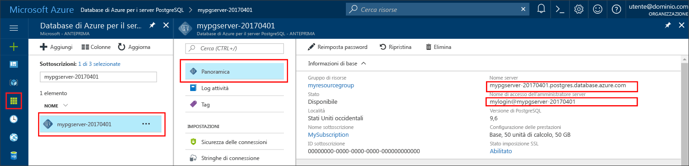

# <a name="azure-database-for-postgresql-use-nodejs-to-connect-and-query-data"></a><span data-ttu-id="2a54d-103">Database di Azure per PostgreSQL: usare Node.js per connettersi ai dati ed eseguire query</span><span class="sxs-lookup"><span data-stu-id="2a54d-103">Azure Database for PostgreSQL: Use Node.js to connect and query data</span></span>
<span data-ttu-id="2a54d-104">Questa guida introduttiva illustra come connettersi a un database di Azure per PostgreSQL usando [Node.js](https://nodejs.org/).</span><span class="sxs-lookup"><span data-stu-id="2a54d-104">This quickstart demonstrates how to connect to an Azure Database for PostgreSQL using [Node.js](https://nodejs.org/).</span></span> <span data-ttu-id="2a54d-105">Spiega come usare le istruzioni SQL per eseguire query, inserire, aggiornare ed eliminare dati nel database.</span><span class="sxs-lookup"><span data-stu-id="2a54d-105">It shows how to use SQL statements to query, insert, update, and delete data in the database.</span></span> <span data-ttu-id="2a54d-106">Le procedure descritte in questo articolo presuppongono che si abbia familiarità con lo sviluppo con Node.js, ma non con Database di Azure per PostgreSQL.</span><span class="sxs-lookup"><span data-stu-id="2a54d-106">The steps in this article assume that you are familiar with developing using Node.js, and that you are new to working with Azure Database for PostgreSQL.</span></span>

## <a name="prerequisites"></a><span data-ttu-id="2a54d-107">Prerequisiti</span><span class="sxs-lookup"><span data-stu-id="2a54d-107">Prerequisites</span></span>
<span data-ttu-id="2a54d-108">Questa guida introduttiva usa le risorse create in una delle guide seguenti come punto di partenza:</span><span class="sxs-lookup"><span data-stu-id="2a54d-108">This quickstart uses the resources created in either of these guides as a starting point:</span></span>
- [<span data-ttu-id="2a54d-109">Creare un database: portale</span><span class="sxs-lookup"><span data-stu-id="2a54d-109">Create DB - Portal</span></span>](quickstart-create-server-database-portal.md)
- [<span data-ttu-id="2a54d-110">Creare un database: interfaccia della riga di comando</span><span class="sxs-lookup"><span data-stu-id="2a54d-110">Create DB - CLI</span></span>](quickstart-create-server-database-azure-cli.md)

<span data-ttu-id="2a54d-111">È anche necessario:</span><span class="sxs-lookup"><span data-stu-id="2a54d-111">You also need to:</span></span>
- <span data-ttu-id="2a54d-112">Installare [Node.js](https://nodejs.org)</span><span class="sxs-lookup"><span data-stu-id="2a54d-112">Install [Node.js](https://nodejs.org)</span></span>

## <a name="install-pg-client"></a><span data-ttu-id="2a54d-113">Installare il client pg</span><span class="sxs-lookup"><span data-stu-id="2a54d-113">Install pg client</span></span>
<span data-ttu-id="2a54d-114">Installare [pg](https://www.npmjs.com/package/pg), un client PostgreSQL per Node.js.</span><span class="sxs-lookup"><span data-stu-id="2a54d-114">Install [pg](https://www.npmjs.com/package/pg), which is a PostgreSQL client for Node.js.</span></span>

<span data-ttu-id="2a54d-115">A tale scopo, eseguire Node Package Manager (npm) per JavaScript dalla riga di comando per installare il client pg.</span><span class="sxs-lookup"><span data-stu-id="2a54d-115">To do so, run the node package manager (npm) for JavaScript from your command line to install the pg client.</span></span>
```bash
npm install pg
```

<span data-ttu-id="2a54d-116">Verificare l'installazione elencando i pacchetti installati.</span><span class="sxs-lookup"><span data-stu-id="2a54d-116">Verify the installation by listing the packages installed.</span></span>
```bash
npm list
```

## <a name="get-connection-information"></a><span data-ttu-id="2a54d-117">Ottenere informazioni di connessione</span><span class="sxs-lookup"><span data-stu-id="2a54d-117">Get connection information</span></span>
<span data-ttu-id="2a54d-118">Ottenere le informazioni di connessione necessarie per connettersi al database di Azure per PostgreSQL.</span><span class="sxs-lookup"><span data-stu-id="2a54d-118">Get the connection information needed to connect to the Azure Database for PostgreSQL.</span></span> <span data-ttu-id="2a54d-119">Sono necessari il nome del server completo e le credenziali di accesso.</span><span class="sxs-lookup"><span data-stu-id="2a54d-119">You need the fully qualified server name and login credentials.</span></span>

1. <span data-ttu-id="2a54d-120">Accedere al [Portale di Azure](https://portal.azure.com/).</span><span class="sxs-lookup"><span data-stu-id="2a54d-120">Log in to the [Azure portal](https://portal.azure.com/).</span></span>
2. <span data-ttu-id="2a54d-121">Nel menu a sinistra nel portale di Azure fare clic su **Tutte le risorse** e cercare il server appena creato.</span><span class="sxs-lookup"><span data-stu-id="2a54d-121">From the left-hand menu in Azure portal, click **All resources** and search for the server you just created.</span></span>
3. <span data-ttu-id="2a54d-122">Fare clic sul nome del server.</span><span class="sxs-lookup"><span data-stu-id="2a54d-122">Click the server name.</span></span>
4. <span data-ttu-id="2a54d-123">Selezionare la pagina **Panoramica** del server.</span><span class="sxs-lookup"><span data-stu-id="2a54d-123">Select the server's **Overview** page.</span></span> <span data-ttu-id="2a54d-124">Annotare il **Nome server** e il **nome di accesso dell'amministratore del server**.</span><span class="sxs-lookup"><span data-stu-id="2a54d-124">Make a note of the **Server name** and **Server admin login name**.</span></span>
 <span data-ttu-id="2a54d-125"></span><span class="sxs-lookup"><span data-stu-id="2a54d-125"></span></span>
5. <span data-ttu-id="2a54d-126">Se si dimenticano le informazioni di accesso per il server, passare alla pagina **Panoramica** per visualizzare il nome di accesso dell'amministratore del server e, se necessario, reimpostare la password.</span><span class="sxs-lookup"><span data-stu-id="2a54d-126">If you forget your server login information, navigate to the **Overview** page to view the Server admin login name and, if necessary, reset the password.</span></span>

## <a name="running-the-javascript-code-in-nodejs"></a><span data-ttu-id="2a54d-127">Esecuzione del codice JavaScript in Node.js</span><span class="sxs-lookup"><span data-stu-id="2a54d-127">Running the JavaScript code in Node.js</span></span>
<span data-ttu-id="2a54d-128">È possibile avviare Node.js dalla shell di Bash o dal prompt dei comandi di Windows digitando `node`, quindi eseguire l'esempio di codice JavaScript in modo interattivo copiandolo e incollandolo nel prompt.</span><span class="sxs-lookup"><span data-stu-id="2a54d-128">You may launch Node.js from the bash shell or windows command prompt by typing `node`, then run the example JavaScript code interactively by copy and pasting it onto the prompt.</span></span> <span data-ttu-id="2a54d-129">In alternativa è possibile salvare il codice JavaScript in un file di testo e avviare `node filename.js` con il nome del file come parametro per l'esecuzione.</span><span class="sxs-lookup"><span data-stu-id="2a54d-129">Alternatively, you may save the JavaScript code into a text file and launch `node filename.js` with the file name as a parameter to run it.</span></span>

## <a name="connect-create-table-and-insert-data"></a><span data-ttu-id="2a54d-130">Connettersi, creare tabelle e inserire dati</span><span class="sxs-lookup"><span data-stu-id="2a54d-130">Connect, create table, and insert data</span></span>
<span data-ttu-id="2a54d-131">Usare il codice seguente per connettersi e caricare i dati usando le istruzioni SQL **CREATE TABLE** e **INSERT INTO**.</span><span class="sxs-lookup"><span data-stu-id="2a54d-131">Use the following code to connect and load the data using **CREATE TABLE** and  **INSERT INTO** SQL statements.</span></span>
<span data-ttu-id="2a54d-132">L'oggetto [pg.Client](https://github.com/brianc/node-postgres/wiki/Client) viene usato per l'interfaccia con il server PostgreSQL.</span><span class="sxs-lookup"><span data-stu-id="2a54d-132">The [pg.Client](https://github.com/brianc/node-postgres/wiki/Client) object is used to interface with the PostgreSQL server.</span></span> <span data-ttu-id="2a54d-133">La funzione [pg.Client.connect()](https://github.com/brianc/node-postgres/wiki/Client#method-connect) viene usata per stabilire la connessione al server.</span><span class="sxs-lookup"><span data-stu-id="2a54d-133">The [pg.Client.connect()](https://github.com/brianc/node-postgres/wiki/Client#method-connect) function is used to establish the connection to the server.</span></span> <span data-ttu-id="2a54d-134">La funzione [pg.Client.query()](https://github.com/brianc/node-postgres/wiki/Query) viene usata per eseguire la query SQL sul database PostgreSQL.</span><span class="sxs-lookup"><span data-stu-id="2a54d-134">The [pg.Client.query()](https://github.com/brianc/node-postgres/wiki/Query) function is used to execute the SQL query against PostgreSQL database.</span></span> 

<span data-ttu-id="2a54d-135">Sostituire i parametri host, dbname, user e password con i valori specificati al momento della creazione del server e del database.</span><span class="sxs-lookup"><span data-stu-id="2a54d-135">Replace the host, dbname, user, and password parameters with the values that you specified when you created the server and database.</span></span>

```javascript
const pg = require('pg');

const config = {
    host: '<your-db-server-name>.postgres.database.azure.com',
    // Do not hard code your username and password.
    // Consider using Node environment variables.
    user: '<your-db-username>',     
    password: '<your-password>',
    database: '<name-of-database>',
    port: 5432,
    ssl: true
};

const client = new pg.Client(config);

client.connect(err => {
    if (err) throw err;
    else {
        queryDatabase();
    }
});

function queryDatabase() {
    const query = `
        DROP TABLE IF EXISTS inventory;
        CREATE TABLE inventory (id serial PRIMARY KEY, name VARCHAR(50), quantity INTEGER);
        INSERT INTO inventory (name, quantity) VALUES ('banana', 150);
        INSERT INTO inventory (name, quantity) VALUES ('orange', 154);
        INSERT INTO inventory (name, quantity) VALUES ('apple', 100);
    `;

    client
        .query(query)
        .then(() => {
            console.log('Table created successfully!');
            client.end(console.log('Closed client connection'));
        })
        .catch(err => console.log(err))
        .then(() => {
            console.log('Finished execution, exiting now');
            process.exit();
        });
}
```

## <a name="read-data"></a><span data-ttu-id="2a54d-136">Leggere i dati</span><span class="sxs-lookup"><span data-stu-id="2a54d-136">Read data</span></span>
<span data-ttu-id="2a54d-137">Usare il codice seguente per connettersi e leggere i dati usando un'istruzione SQL **SELECT**.</span><span class="sxs-lookup"><span data-stu-id="2a54d-137">Use the following code to connect and read the data using a **SELECT** SQL statement.</span></span> <span data-ttu-id="2a54d-138">L'oggetto [pg.Client](https://github.com/brianc/node-postgres/wiki/Client) viene usato per l'interfaccia con il server PostgreSQL.</span><span class="sxs-lookup"><span data-stu-id="2a54d-138">The [pg.Client](https://github.com/brianc/node-postgres/wiki/Client) object is used to interface with the PostgreSQL server.</span></span> <span data-ttu-id="2a54d-139">La funzione [pg.Client.connect()](https://github.com/brianc/node-postgres/wiki/Client#method-connect) viene usata per stabilire la connessione al server.</span><span class="sxs-lookup"><span data-stu-id="2a54d-139">The [pg.Client.connect()](https://github.com/brianc/node-postgres/wiki/Client#method-connect) function is used to establish the connection to the server.</span></span> <span data-ttu-id="2a54d-140">La funzione [pg.Client.query()](https://github.com/brianc/node-postgres/wiki/Query) viene usata per eseguire la query SQL sul database PostgreSQL.</span><span class="sxs-lookup"><span data-stu-id="2a54d-140">The [pg.Client.query()](https://github.com/brianc/node-postgres/wiki/Query) function is used to execute the SQL query against PostgreSQL database.</span></span> 

<span data-ttu-id="2a54d-141">Sostituire i parametri host, dbname, user e password con i valori specificati al momento della creazione del server e del database.</span><span class="sxs-lookup"><span data-stu-id="2a54d-141">Replace the host, dbname, user, and password parameters with the values that you specified when you created the server and database.</span></span> 

```javascript
const pg = require('pg');

const config = {
    host: '<your-db-server-name>.postgres.database.azure.com',
    // Do not hard code your username and password.
    // Consider using Node environment variables.
    user: '<your-db-username>',     
    password: '<your-password>',
    database: '<name-of-database>',
    port: 5432,
    ssl: true
};

const client = new pg.Client(config);

client.connect(err => {
    if (err) throw err;
    else { queryDatabase(); }
});

function queryDatabase() {
  
    console.log(`Running query to PostgreSQL server: ${config.host}`);

    const query = 'SELECT * FROM inventory;';

    client.query(query)
        .then(res => {
            const rows = res.rows;

            rows.map(row => {
                console.log(`Read: ${JSON.stringify(row)}`);
            });

            process.exit();
        })
        .catch(err => {
            console.log(err);
        });
}
```

## <a name="update-data"></a><span data-ttu-id="2a54d-142">Aggiornare i dati</span><span class="sxs-lookup"><span data-stu-id="2a54d-142">Update data</span></span>
<span data-ttu-id="2a54d-143">Usare il codice seguente per connettersi e leggere i dati usando un'istruzione SQL **UPDATE**.</span><span class="sxs-lookup"><span data-stu-id="2a54d-143">Use the following code to connect and read the data using a **UPDATE** SQL statement.</span></span> <span data-ttu-id="2a54d-144">L'oggetto [pg.Client](https://github.com/brianc/node-postgres/wiki/Client) viene usato per l'interfaccia con il server PostgreSQL.</span><span class="sxs-lookup"><span data-stu-id="2a54d-144">The [pg.Client](https://github.com/brianc/node-postgres/wiki/Client) object is used to interface with the PostgreSQL server.</span></span> <span data-ttu-id="2a54d-145">La funzione [pg.Client.connect()](https://github.com/brianc/node-postgres/wiki/Client#method-connect) viene usata per stabilire la connessione al server.</span><span class="sxs-lookup"><span data-stu-id="2a54d-145">The [pg.Client.connect()](https://github.com/brianc/node-postgres/wiki/Client#method-connect) function is used to establish the connection to the server.</span></span> <span data-ttu-id="2a54d-146">La funzione [pg.Client.query()](https://github.com/brianc/node-postgres/wiki/Query) viene usata per eseguire la query SQL sul database PostgreSQL.</span><span class="sxs-lookup"><span data-stu-id="2a54d-146">The [pg.Client.query()](https://github.com/brianc/node-postgres/wiki/Query) function is used to execute the SQL query against PostgreSQL database.</span></span> 

<span data-ttu-id="2a54d-147">Sostituire i parametri host, dbname, user e password con i valori specificati al momento della creazione del server e del database.</span><span class="sxs-lookup"><span data-stu-id="2a54d-147">Replace the host, dbname, user, and password parameters with the values that you specified when you created the server and database.</span></span> 

```javascript
const pg = require('pg');

const config = {
    host: '<your-db-server-name>.postgres.database.azure.com',
    // Do not hard code your username and password.
    // Consider using Node environment variables.
    user: '<your-db-username>',     
    password: '<your-password>',
    database: '<name-of-database>',
    port: 5432,
    ssl: true
};

const client = new pg.Client(config);

client.connect(err => {
    if (err) throw err;
    else {
        queryDatabase();
    }
});

function queryDatabase() {
    const query = `
        UPDATE inventory 
        SET quantity= 1000 WHERE name='banana';
    `;

    client
        .query(query)
        .then(result => {
            console.log('Update completed');
            console.log(`Rows affected: ${result.rowCount}`);
        })
        .catch(err => {
            console.log(err);
            throw err;
        });
}
```

## <a name="delete-data"></a><span data-ttu-id="2a54d-148">Eliminare i dati</span><span class="sxs-lookup"><span data-stu-id="2a54d-148">Delete data</span></span>
<span data-ttu-id="2a54d-149">Usare il codice seguente per connettersi e leggere i dati usando un'istruzione SQL **DELETE**.</span><span class="sxs-lookup"><span data-stu-id="2a54d-149">Use the following code to connect and read the data using a **DELETE** SQL statement.</span></span> <span data-ttu-id="2a54d-150">L'oggetto [pg.Client](https://github.com/brianc/node-postgres/wiki/Client) viene usato per l'interfaccia con il server PostgreSQL.</span><span class="sxs-lookup"><span data-stu-id="2a54d-150">The [pg.Client](https://github.com/brianc/node-postgres/wiki/Client) object is used to interface with the PostgreSQL server.</span></span> <span data-ttu-id="2a54d-151">La funzione [pg.Client.connect()](https://github.com/brianc/node-postgres/wiki/Client#method-connect) viene usata per stabilire la connessione al server.</span><span class="sxs-lookup"><span data-stu-id="2a54d-151">The [pg.Client.connect()](https://github.com/brianc/node-postgres/wiki/Client#method-connect) function is used to establish the connection to the server.</span></span> <span data-ttu-id="2a54d-152">La funzione [pg.Client.query()](https://github.com/brianc/node-postgres/wiki/Query) viene usata per eseguire la query SQL sul database PostgreSQL.</span><span class="sxs-lookup"><span data-stu-id="2a54d-152">The [pg.Client.query()](https://github.com/brianc/node-postgres/wiki/Query) function is used to execute the SQL query against PostgreSQL database.</span></span> 

<span data-ttu-id="2a54d-153">Sostituire i parametri host, dbname, user e password con i valori specificati al momento della creazione del server e del database.</span><span class="sxs-lookup"><span data-stu-id="2a54d-153">Replace the host, dbname, user, and password parameters with the values that you specified when you created the server and database.</span></span> 

```javascript
const pg = require('pg');

const config = {
    host: '<your-db-server-name>.postgres.database.azure.com',
    // Do not hard code your username and password.
    // Consider using Node environment variables.
    user: '<your-db-username>',     
    password: '<your-password>',
    database: '<name-of-database>',
    port: 5432,
    ssl: true
};

const client = new pg.Client(config);

client.connect(err => {
    if (err) {
        throw err;
    } else {
        queryDatabase();
    }
});

function queryDatabase() {
    const query = `
        DELETE FROM inventory 
        WHERE name = 'apple';
    `;

    client
        .query(query)
        .then(result => {
            console.log('Delete completed');
            console.log(`Rows affected: ${result.rowCount}`);
        })
        .catch(err => {
            console.log(err);
            throw err;
        });
}
```

## <a name="next-steps"></a><span data-ttu-id="2a54d-154">Passaggi successivi</span><span class="sxs-lookup"><span data-stu-id="2a54d-154">Next steps</span></span>
> [!div class="nextstepaction"]
> [<span data-ttu-id="2a54d-155">Eseguire la migrazione del database usando le funzionalità di esportazione e importazione</span><span class="sxs-lookup"><span data-stu-id="2a54d-155">Migrate your database using Export and Import</span></span>](./howto-migrate-using-export-and-import.md)
