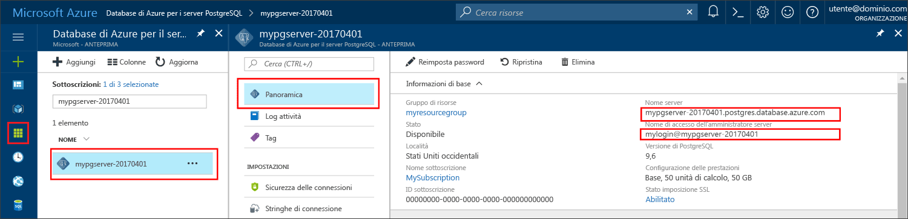

# <a name="azure-database-for-postgresql-use-php-to-connect-and-query-data"></a><span data-ttu-id="a1a19-103">Database di Azure per PostgreSQL: usare PHP per connettersi ai dati ed eseguire query</span><span class="sxs-lookup"><span data-stu-id="a1a19-103">Azure Database for PostgreSQL: Use PHP to connect and query data</span></span>
<span data-ttu-id="a1a19-104">Questa guida introduttiva illustra come connettersi a un database di Azure per PostgreSQL usando un'applicazione [PHP](http://php.net/manual/intro-whatis.php).</span><span class="sxs-lookup"><span data-stu-id="a1a19-104">This quickstart demonstrates how to connect to an Azure Database for PostgreSQL using a [PHP](http://php.net/manual/intro-whatis.php) application.</span></span> <span data-ttu-id="a1a19-105">Spiega come usare le istruzioni SQL per eseguire query, inserire, aggiornare ed eliminare dati nel database.</span><span class="sxs-lookup"><span data-stu-id="a1a19-105">It shows how to use SQL statements to query, insert, update, and delete data in the database.</span></span> <span data-ttu-id="a1a19-106">Questo articolo presuppone che si abbia familiarità con lo sviluppo con PHP, ma non con Database di Azure per PostgreSQL.</span><span class="sxs-lookup"><span data-stu-id="a1a19-106">This article assumes you are familiar with development using PHP, but that you are new to working with Azure Database for PostgreSQL.</span></span>

## <a name="prerequisites"></a><span data-ttu-id="a1a19-107">Prerequisiti</span><span class="sxs-lookup"><span data-stu-id="a1a19-107">Prerequisites</span></span>
<span data-ttu-id="a1a19-108">Questa guida introduttiva usa le risorse create in una delle guide seguenti come punto di partenza:</span><span class="sxs-lookup"><span data-stu-id="a1a19-108">This quickstart uses the resources created in either of these guides as a starting point:</span></span>
- [<span data-ttu-id="a1a19-109">Creare un database: portale</span><span class="sxs-lookup"><span data-stu-id="a1a19-109">Create DB - Portal</span></span>](quickstart-create-server-database-portal.md)
- [<span data-ttu-id="a1a19-110">Creare un database: interfaccia della riga di comando di Azure</span><span class="sxs-lookup"><span data-stu-id="a1a19-110">Create DB - Azure CLI</span></span>](quickstart-create-server-database-azure-cli.md)

## <a name="install-php"></a><span data-ttu-id="a1a19-111">Installare PHP</span><span class="sxs-lookup"><span data-stu-id="a1a19-111">Install PHP</span></span>
<span data-ttu-id="a1a19-112">Installare PHP nel server o creare un'[app Web](https://docs.microsoft.com/en-us/azure/app-service-web/app-service-web-overview) di Azure che includa PHP.</span><span class="sxs-lookup"><span data-stu-id="a1a19-112">Install PHP on your own server, or create an Azure [web app](https://docs.microsoft.com/en-us/azure/app-service-web/app-service-web-overview) that includes PHP.</span></span>

### <a name="windows"></a><span data-ttu-id="a1a19-113">Windows</span><span class="sxs-lookup"><span data-stu-id="a1a19-113">Windows</span></span>
- <span data-ttu-id="a1a19-114">Scaricare [PHP versione 7.1.4 non thread-safe (x64)](http://windows.php.net/download#php-7.1)</span><span class="sxs-lookup"><span data-stu-id="a1a19-114">Download [PHP 7.1.4 non-thread safe (x64) version](http://windows.php.net/download#php-7.1)</span></span>
- <span data-ttu-id="a1a19-115">Installare PHP e vedere il [manuale di PHP](http://php.net/manual/install.windows.php) per le altre opzioni di configurazione</span><span class="sxs-lookup"><span data-stu-id="a1a19-115">Install PHP and refer to the [PHP manual](http://php.net/manual/install.windows.php) for further configuration</span></span>
- <span data-ttu-id="a1a19-116">Il codice usa la classe **pgsql** (ext/php_pgsql.dll) inclusa nell'installazione di PHP.</span><span class="sxs-lookup"><span data-stu-id="a1a19-116">The code uses the **pgsql** class (ext/php_pgsql.dll)  that is included in the PHP installation.</span></span> 
- <span data-ttu-id="a1a19-117">Abilitare l'estensione **pgsql** modificando il file di configurazione php.ini, che in genere si trova in `C:\Program Files\PHP\v7.1\php.ini`.</span><span class="sxs-lookup"><span data-stu-id="a1a19-117">Enabled the **pgsql** extension by editing the php.ini configuration file, typically located at `C:\Program Files\PHP\v7.1\php.ini`.</span></span> <span data-ttu-id="a1a19-118">Il file di configurazione dovrebbe contenere una riga con il testo `extension=php_pgsql.so`.</span><span class="sxs-lookup"><span data-stu-id="a1a19-118">The configuration file should contain a line with the text `extension=php_pgsql.so`.</span></span> <span data-ttu-id="a1a19-119">Se non è visualizzata, aggiungere il testo e salvare il file.</span><span class="sxs-lookup"><span data-stu-id="a1a19-119">If it is not shown, add the text and save the file.</span></span> <span data-ttu-id="a1a19-120">Se il testo è presente, ma commentato con un punto e virgola come prefisso, rimuovere il commento dal testo rimuovendo il punto e virgola.</span><span class="sxs-lookup"><span data-stu-id="a1a19-120">If the text is present, but commented with a semicolon prefix, uncomment the text by removing the semicolon.</span></span>

### <a name="linux-ubuntu"></a><span data-ttu-id="a1a19-121">Linux (Ubuntu)</span><span class="sxs-lookup"><span data-stu-id="a1a19-121">Linux (Ubuntu)</span></span>
- <span data-ttu-id="a1a19-122">Scaricare [PHP versione 7.1.4 non thread-safe (x64)](http://php.net/downloads.php)</span><span class="sxs-lookup"><span data-stu-id="a1a19-122">Download [PHP 7.1.4 non-thread safe (x64) version](http://php.net/downloads.php)</span></span> 
- <span data-ttu-id="a1a19-123">Installare PHP e vedere il [manuale di PHP](http://php.net/manual/install.unix.php) per le altre opzioni di configurazione</span><span class="sxs-lookup"><span data-stu-id="a1a19-123">Install PHP and refer to the [PHP manual](http://php.net/manual/install.unix.php) for further configuration</span></span>
- <span data-ttu-id="a1a19-124">Il codice usa la classe **pgsql** class (php_pgsql.so).</span><span class="sxs-lookup"><span data-stu-id="a1a19-124">The code uses the **pgsql** class (php_pgsql.so).</span></span> <span data-ttu-id="a1a19-125">Installarla eseguendo `sudo apt-get install php-pgsql`.</span><span class="sxs-lookup"><span data-stu-id="a1a19-125">Install it by running `sudo apt-get install php-pgsql`.</span></span>
- <span data-ttu-id="a1a19-126">Abilitare l'estensione **pgsql** modificando il file di configurazione `/etc/php/7.0/mods-available/pgsql.ini`.</span><span class="sxs-lookup"><span data-stu-id="a1a19-126">Enabled the **pgsql** extension by editing the `/etc/php/7.0/mods-available/pgsql.ini` configuration file.</span></span> <span data-ttu-id="a1a19-127">Il file di configurazione dovrebbe contenere una riga con il testo `extension=php_pgsql.so`.</span><span class="sxs-lookup"><span data-stu-id="a1a19-127">The configuration file should contain a line with the text `extension=php_pgsql.so`.</span></span> <span data-ttu-id="a1a19-128">Se non è visualizzata, aggiungere il testo e salvare il file.</span><span class="sxs-lookup"><span data-stu-id="a1a19-128">If it is not shown, add the text and save the file.</span></span> <span data-ttu-id="a1a19-129">Se il testo è presente, ma commentato con un punto e virgola come prefisso, rimuovere il commento dal testo rimuovendo il punto e virgola.</span><span class="sxs-lookup"><span data-stu-id="a1a19-129">If the text is present, but commented with a semicolon prefix, uncomment the text by removing the semicolon.</span></span>

### <a name="macos"></a><span data-ttu-id="a1a19-130">MacOS</span><span class="sxs-lookup"><span data-stu-id="a1a19-130">MacOS</span></span>
- <span data-ttu-id="a1a19-131">Scaricare [PHP versione 7.1.4](http://php.net/downloads.php)</span><span class="sxs-lookup"><span data-stu-id="a1a19-131">Download [PHP 7.1.4 version](http://php.net/downloads.php)</span></span>
- <span data-ttu-id="a1a19-132">Installare PHP e vedere il [manuale di PHP](http://php.net/manual/install.macosx.php) per le altre opzioni di configurazione</span><span class="sxs-lookup"><span data-stu-id="a1a19-132">Install PHP and refer to the [PHP manual](http://php.net/manual/install.macosx.php) for further configuration</span></span>

## <a name="get-connection-information"></a><span data-ttu-id="a1a19-133">Ottenere informazioni di connessione</span><span class="sxs-lookup"><span data-stu-id="a1a19-133">Get connection information</span></span>
<span data-ttu-id="a1a19-134">Ottenere le informazioni di connessione necessarie per connettersi al database di Azure per PostgreSQL.</span><span class="sxs-lookup"><span data-stu-id="a1a19-134">Get the connection information needed to connect to the Azure Database for PostgreSQL.</span></span> <span data-ttu-id="a1a19-135">Sono necessari il nome del server completo e le credenziali di accesso.</span><span class="sxs-lookup"><span data-stu-id="a1a19-135">You need the fully qualified server name and login credentials.</span></span>

1. <span data-ttu-id="a1a19-136">Accedere al [Portale di Azure](https://portal.azure.com/).</span><span class="sxs-lookup"><span data-stu-id="a1a19-136">Log in to the [Azure portal](https://portal.azure.com/).</span></span>
2. <span data-ttu-id="a1a19-137">Nel menu a sinistra nel portale di Azure fare clic su **Tutte le risorse** e cercare il server creato, ad esempio **mypgserver-20170401**.</span><span class="sxs-lookup"><span data-stu-id="a1a19-137">From the left-hand menu in Azure portal, click **All resources** and search for the server you have created, such as **mypgserver-20170401**.</span></span>
3. <span data-ttu-id="a1a19-138">Fare clic sul nome del server **mypgserver-20170401**.</span><span class="sxs-lookup"><span data-stu-id="a1a19-138">Click the server name **mypgserver-20170401**.</span></span>
4. <span data-ttu-id="a1a19-139">Selezionare la pagina **Panoramica** del server.</span><span class="sxs-lookup"><span data-stu-id="a1a19-139">Select the server's **Overview** page.</span></span> <span data-ttu-id="a1a19-140">Annotare il **Nome server** e il **nome di accesso dell'amministratore del server**.</span><span class="sxs-lookup"><span data-stu-id="a1a19-140">Make a note of the **Server name** and **Server admin login name**.</span></span>
 <span data-ttu-id="a1a19-141"></span><span class="sxs-lookup"><span data-stu-id="a1a19-141"></span></span>
5. <span data-ttu-id="a1a19-142">Se si dimenticano le informazioni di accesso per il server, passare alla pagina **Panoramica** per visualizzare il nome di accesso dell'amministratore del server e, se necessario, reimpostare la password.</span><span class="sxs-lookup"><span data-stu-id="a1a19-142">If you forget your server login information, navigate to the **Overview** page to view the Server admin login name and, if necessary, reset the password.</span></span>

## <a name="connect-and-create-a-table"></a><span data-ttu-id="a1a19-143">Connettersi e creare una tabella</span><span class="sxs-lookup"><span data-stu-id="a1a19-143">Connect and create a table</span></span>
<span data-ttu-id="a1a19-144">Usare il codice seguente per connettersi e creare una tabella usando l'istruzione SQL **CREATE TABLE**, seguita dalle istruzioni SQL **INSERT INTO** per aggiungere righe nella tabella.</span><span class="sxs-lookup"><span data-stu-id="a1a19-144">Use the following code to connect and create a table using **CREATE TABLE** SQL statement, followed by **INSERT INTO** SQL statements to add rows into the table.</span></span>

<span data-ttu-id="a1a19-145">Il codice chiama il metodo [pg_connect()](http://php.net/manual/en/function.pg-connect.php) per connettersi a Database di Azure per PostgreSQL.</span><span class="sxs-lookup"><span data-stu-id="a1a19-145">The code call method [pg_connect()](http://php.net/manual/en/function.pg-connect.php) to connect to Azure Database for PostgreSQL.</span></span> <span data-ttu-id="a1a19-146">Chiama quindi il metodo [pg_query()](http://php.net/manual/en/function.pg-query.php) più volte per eseguire diversi comandi e [pg_last_error()](http://php.net/manual/en/function.pg-last-error.php) ogni volta per controllare i dettagli se si è verificato un errore.</span><span class="sxs-lookup"><span data-stu-id="a1a19-146">Then it calls method [pg_query()](http://php.net/manual/en/function.pg-query.php) several times to run several commands, and [pg_last_error()](http://php.net/manual/en/function.pg-last-error.php) to check the details if an error occurred each time.</span></span> <span data-ttu-id="a1a19-147">Chiama infine il metodo [pg_close()](http://php.net/manual/en/function.pg-close.php) per chiudere la connessione.</span><span class="sxs-lookup"><span data-stu-id="a1a19-147">Then it calls method [pg_close()](http://php.net/manual/en/function.pg-close.php) to close the connection.</span></span>

<span data-ttu-id="a1a19-148">Sostituire i parametri `$host`, `$database`, `$user` e `$password` con valori personalizzati.</span><span class="sxs-lookup"><span data-stu-id="a1a19-148">Replace the `$host`, `$database`, `$user`, and `$password` parameters with your own values.</span></span> 

```php
<?php
    // Initialize connection variables.
    $host = "mypgserver-20170401.postgres.database.azure.com";
    $database = "mypgsqldb";
    $user = "mylogin@mypgserver-20170401";
    $password = "<server_admin_password>";

    // Initialize connection object.
    $connection = pg_connect("host=$host dbname=$database user=$user password=$password") 
        or die("Failed to create connection to database: ". pg_last_error(). "<br/>");
    print "Successfully created connection to database.<br/>";

    // Drop previous table of same name if one exists.
    $query = "DROP TABLE IF EXISTS inventory;";
    pg_query($connection, $query) 
        or die("Encountered an error when executing given sql statement: ". pg_last_error(). "<br/>");
    print "Finished dropping table (if existed).<br/>";

    // Create table.
    $query = "CREATE TABLE inventory (id serial PRIMARY KEY, name VARCHAR(50), quantity INTEGER);";
    pg_query($connection, $query) 
        or die("Encountered an error when executing given sql statement: ". pg_last_error(). "<br/>");
    print "Finished creating table.<br/>";

    // Insert some data into table.
    $name = '\'banana\'';
    $quantity = 150;
    $query = "INSERT INTO inventory (name, quantity) VALUES ($1, $2);";
    pg_query($connection, $query) 
        or die("Encountered an error when executing given sql statement: ". pg_last_error(). "<br/>");

    $name = '\'orange\'';
    $quantity = 154;
    $query = "INSERT INTO inventory (name, quantity) VALUES ($name, $quantity);";
    pg_query($connection, $query) 
        or die("Encountered an error when executing given sql statement: ". pg_last_error(). "<br/>");

    $name = '\'apple\'';
    $quantity = 100;
    $query = "INSERT INTO inventory (name, quantity) VALUES ($name, $quantity);";
    pg_query($connection, $query) 
        or die("Encountered an error when executing given sql statement: ". pg_last_error()). "<br/>";

    print "Inserted 3 rows of data.<br/>";

    // Closing connection
    pg_close($connection);
?>
```

## <a name="read-data"></a><span data-ttu-id="a1a19-149">Leggere i dati</span><span class="sxs-lookup"><span data-stu-id="a1a19-149">Read data</span></span>
<span data-ttu-id="a1a19-150">Usare il codice seguente per connettersi e leggere i dati usando un'istruzione SQL **SELECT**.</span><span class="sxs-lookup"><span data-stu-id="a1a19-150">Use the following code to connect and read the data using a **SELECT** SQL statement.</span></span> 

 <span data-ttu-id="a1a19-151">Il codice chiama il metodo [pg_connect()](http://php.net/manual/en/function.pg-connect.php) per connettersi a Database di Azure per PostgreSQL.</span><span class="sxs-lookup"><span data-stu-id="a1a19-151">The code call method [pg_connect()](http://php.net/manual/en/function.pg-connect.php) to connect to Azure Database for PostgreSQL.</span></span> <span data-ttu-id="a1a19-152">Chiama quindi il metodo [pg_query()](http://php.net/manual/en/function.pg-query.php) per eseguire il comando SELECT, mantenendo i risultati in un set di risultati, e [pg_last_error()](http://php.net/manual/en/function.pg-last-error.php) per controllare i dettagli se si è verificato un errore.</span><span class="sxs-lookup"><span data-stu-id="a1a19-152">Then it calls method [pg_query()](http://php.net/manual/en/function.pg-query.php) to run the SELECT command, keeping the results in a result set, and [pg_last_error()](http://php.net/manual/en/function.pg-last-error.php) to check the details if an error occurred.</span></span>  <span data-ttu-id="a1a19-153">Per leggere il set di risultati, viene chiamato il metodo [pg_fetch_row()](http://php.net/manual/en/function.pg-fetch-row.php) in un ciclo, una volta per riga, e i dati della riga vengono recuperati in una matrice `$row`, con un valore di dati per colonna in ogni posizione della matrice.</span><span class="sxs-lookup"><span data-stu-id="a1a19-153">To read the result set, method [pg_fetch_row()](http://php.net/manual/en/function.pg-fetch-row.php) is called in a loop, once per row, and the row data is retrieved in an array `$row`, with one data value per column in each array position.</span></span>  <span data-ttu-id="a1a19-154">Per liberare il set di risultati, viene chiamato il metodo [pg_free_result()](http://php.net/manual/en/function.pg-free-result.php).</span><span class="sxs-lookup"><span data-stu-id="a1a19-154">To free the result set, method [pg_free_result()](http://php.net/manual/en/function.pg-free-result.php) is called.</span></span> <span data-ttu-id="a1a19-155">Chiama infine il metodo [pg_close()](http://php.net/manual/en/function.pg-close.php) per chiudere la connessione.</span><span class="sxs-lookup"><span data-stu-id="a1a19-155">Then it calls method [pg_close()](http://php.net/manual/en/function.pg-close.php) to close the connection.</span></span>

<span data-ttu-id="a1a19-156">Sostituire i parametri `$host`, `$database`, `$user` e `$password` con valori personalizzati.</span><span class="sxs-lookup"><span data-stu-id="a1a19-156">Replace the `$host`, `$database`, `$user`, and `$password` parameters with your own values.</span></span> 

```php
<?php
    // Initialize connection variables.
    $host = "mypgserver-20170401.postgres.database.azure.com";
    $database = "mypgsqldb";
    $user = "mylogin@mypgserver-20170401";
    $password = "<server_admin_password>";
    
    // Initialize connection object.
    $connection = pg_connect("host=$host dbname=$database user=$user password=$password")
                or die("Failed to create connection to database: ". pg_last_error(). "<br/>");

    print "Successfully created connection to database. <br/>";

    // Perform some SQL queries over the connection.
    $query = "SELECT * from inventory";
    $result_set = pg_query($connection, $query) 
        or die("Encountered an error when executing given sql statement: ". pg_last_error(). "<br/>");
    while ($row = pg_fetch_row($result_set))
    {
        print "Data row = ($row[0], $row[1], $row[2]). <br/>";
    }

    // Free result_set
    pg_free_result($result_set);

    // Closing connection
    pg_close($connection);
?>
```

## <a name="update-data"></a><span data-ttu-id="a1a19-157">Aggiornare i dati</span><span class="sxs-lookup"><span data-stu-id="a1a19-157">Update data</span></span>
<span data-ttu-id="a1a19-158">Usare il codice seguente per connettersi e aggiornare i dati usando un'istruzione SQL **UPDATE**.</span><span class="sxs-lookup"><span data-stu-id="a1a19-158">Use the following code to connect and update the data using a **UPDATE** SQL statement.</span></span>

<span data-ttu-id="a1a19-159">Il codice chiama il metodo [pg_connect()](http://php.net/manual/en/function.pg-connect.php) per connettersi a Database di Azure per PostgreSQL.</span><span class="sxs-lookup"><span data-stu-id="a1a19-159">The code call method [pg_connect()](http://php.net/manual/en/function.pg-connect.php) to connect to Azure Database for PostgreSQL.</span></span> <span data-ttu-id="a1a19-160">Chiama quindi il metodo [pg_query()](http://php.net/manual/en/function.pg-query.php) per eseguire un comando e [pg_last_error()](http://php.net/manual/en/function.pg-last-error.php) per controllare i dettagli se si è verificato un errore.</span><span class="sxs-lookup"><span data-stu-id="a1a19-160">Then it calls method [pg_query()](http://php.net/manual/en/function.pg-query.php) to run a command, and [pg_last_error()](http://php.net/manual/en/function.pg-last-error.php) to check the details if an error occurred.</span></span> <span data-ttu-id="a1a19-161">Chiama infine il metodo [pg_close()](http://php.net/manual/en/function.pg-close.php) per chiudere la connessione.</span><span class="sxs-lookup"><span data-stu-id="a1a19-161">Then it calls method [pg_close()](http://php.net/manual/en/function.pg-close.php) to close the connection.</span></span>

<span data-ttu-id="a1a19-162">Sostituire i parametri `$host`, `$database`, `$user` e `$password` con valori personalizzati.</span><span class="sxs-lookup"><span data-stu-id="a1a19-162">Replace the `$host`, `$database`, `$user`, and `$password` parameters with your own values.</span></span> 

```php
<?php
    // Initialize connection variables.
    $host = "mypgserver-20170401.postgres.database.azure.com";
    $database = "mypgsqldb";
    $user = "mylogin@mypgserver-20170401";
    $password = "<server_admin_password>";

    // Initialize connection object.
    $connection = pg_connect("host=$host dbname=$database user=$user password=$password")
                or die("Failed to create connection to database: ". pg_last_error(). ".<br/>");

    print "Successfully created connection to database. <br/>";

    // Modify some data in table.
    $new_quantity = 200;
    $name = '\'banana\'';
    $query = "UPDATE inventory SET quantity = $new_quantity WHERE name = $name;";
    pg_query($connection, $query) 
        or die("Encountered an error when executing given sql statement: ". pg_last_error(). ".<br/>");
    print "Updated 1 row of data. </br>";

    // Closing connection
    pg_close($connection);
?>
```


## <a name="delete-data"></a><span data-ttu-id="a1a19-163">Eliminare i dati</span><span class="sxs-lookup"><span data-stu-id="a1a19-163">Delete data</span></span>
<span data-ttu-id="a1a19-164">Usare il codice seguente per connettersi e leggere i dati usando un'istruzione SQL **DELETE**.</span><span class="sxs-lookup"><span data-stu-id="a1a19-164">Use the following code to connect and read the data using a **DELETE** SQL statement.</span></span> 

 <span data-ttu-id="a1a19-165">Il codice chiama il metodo [pg_connect()](http://php.net/manual/en/function.pg-connect.php) per connettersi a Database di Azure per PostgreSQL.</span><span class="sxs-lookup"><span data-stu-id="a1a19-165">The code call method [pg_connect()](http://php.net/manual/en/function.pg-connect.php) to connect to  Azure Database for PostgreSQL.</span></span> <span data-ttu-id="a1a19-166">Chiama quindi il metodo [pg_query()](http://php.net/manual/en/function.pg-query.php) per eseguire un comando e [pg_last_error()](http://php.net/manual/en/function.pg-last-error.php) per controllare i dettagli se si è verificato un errore.</span><span class="sxs-lookup"><span data-stu-id="a1a19-166">Then it calls method [pg_query()](http://php.net/manual/en/function.pg-query.php) to run a command, and [pg_last_error()](http://php.net/manual/en/function.pg-last-error.php) to check the details if an error occurred.</span></span> <span data-ttu-id="a1a19-167">Chiama infine il metodo [pg_close()](http://php.net/manual/en/function.pg-close.php) per chiudere la connessione.</span><span class="sxs-lookup"><span data-stu-id="a1a19-167">Then it calls method [pg_close()](http://php.net/manual/en/function.pg-close.php) to close the connection.</span></span>

<span data-ttu-id="a1a19-168">Sostituire i parametri `$host`, `$database`, `$user` e `$password` con valori personalizzati.</span><span class="sxs-lookup"><span data-stu-id="a1a19-168">Replace the `$host`, `$database`, `$user`, and `$password` parameters with your own values.</span></span> 

```php
<?php
    // Initialize connection variables.
    $host = "mypgserver-20170401.postgres.database.azure.com";
    $database = "mypgsqldb";
    $user = "mylogin@mypgserver-20170401";
    $password = "<server_admin_password>";

    // Initialize connection object.
    $connection = pg_connect("host=$host dbname=$database user=$user password=$password")
            or die("Failed to create connection to database: ". pg_last_error(). ". </br>");

    print "Successfully created connection to database. <br/>";

    // Delete some data from table.
    $name = '\'orange\'';
    $query = "DELETE FROM inventory WHERE name = $name;";
    pg_query($connection, $query) 
        or die("Encountered an error when executing given sql statement: ". pg_last_error(). ". <br/>");
    print "Deleted 1 row of data. <br/>";

    // Closing connection
    pg_close($connection);
?>
```

## <a name="next-steps"></a><span data-ttu-id="a1a19-169">Passaggi successivi</span><span class="sxs-lookup"><span data-stu-id="a1a19-169">Next steps</span></span>
> [!div class="nextstepaction"]
> [<span data-ttu-id="a1a19-170">Eseguire la migrazione del database usando le funzionalità di esportazione e importazione</span><span class="sxs-lookup"><span data-stu-id="a1a19-170">Migrate your database using Export and Import</span></span>](./howto-migrate-using-export-and-import.md)
