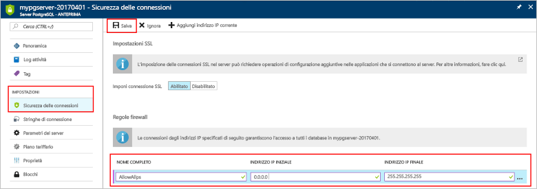

# <a name="create-an-azure-database-for-postgresql-in-the-azure-portal"></a><span data-ttu-id="193e7-103">Creare un database di Azure per PostgreSQL nel portale di Azure</span><span class="sxs-lookup"><span data-stu-id="193e7-103">Create an Azure Database for PostgreSQL in the Azure portal</span></span>

<span data-ttu-id="193e7-104">Il database di Azure per PostgreSQL è un servizio gestito che consente di eseguire, gestire e ridimensionare database PostgreSQL a disponibilità elevata nel cloud.</span><span class="sxs-lookup"><span data-stu-id="193e7-104">Azure Database for PostgreSQL is a managed service that enables you to run, manage, and scale highly available PostgreSQL databases in the cloud.</span></span> <span data-ttu-id="193e7-105">Questa guida introduttiva illustra come creare un database di Azure per il server PostgreSQL con il portale di Azure in circa cinque minuti.</span><span class="sxs-lookup"><span data-stu-id="193e7-105">This quickstart shows you how to create an Azure Database for PostgreSQL server using the Azure portal in about five minutes.</span></span>

<span data-ttu-id="193e7-106">Se non si ha una sottoscrizione di Azure, creare un account [gratuito](https://azure.microsoft.com/free/) prima di iniziare.</span><span class="sxs-lookup"><span data-stu-id="193e7-106">If you don't have an Azure subscription, create a [free](https://azure.microsoft.com/free/) account before you begin.</span></span>

## <a name="log-in-to-the-azure-portal"></a><span data-ttu-id="193e7-107">Accedere al Portale di Azure.</span><span class="sxs-lookup"><span data-stu-id="193e7-107">Log in to the Azure portal</span></span>
<span data-ttu-id="193e7-108">Aprire il Web browser e passare al [portale di Microsoft Azure](https://portal.azure.com/).</span><span class="sxs-lookup"><span data-stu-id="193e7-108">Open your web browser, and navigate to the [Microsoft Azure portal](https://portal.azure.com/).</span></span> <span data-ttu-id="193e7-109">Immettere le credenziali per accedere al portale.</span><span class="sxs-lookup"><span data-stu-id="193e7-109">Enter your credentials to sign in to the portal.</span></span> <span data-ttu-id="193e7-110">La visualizzazione predefinita è il dashboard del servizio.</span><span class="sxs-lookup"><span data-stu-id="193e7-110">The default view is your service dashboard.</span></span>

## <a name="create-an-azure-database-for-postgresql"></a><span data-ttu-id="193e7-111">Creare un database di Azure per PostgreSQL</span><span class="sxs-lookup"><span data-stu-id="193e7-111">Create an Azure Database for PostgreSQL</span></span>

<span data-ttu-id="193e7-112">Verrà creato un database di Azure per il server PostgreSQL con un set definito di [risorse di calcolo e di archiviazione](./concepts-compute-unit-and-storage.md).</span><span class="sxs-lookup"><span data-stu-id="193e7-112">An Azure Database for PostgreSQL server is created with a defined set of [compute and storage resources](./concepts-compute-unit-and-storage.md).</span></span> <span data-ttu-id="193e7-113">Il server viene creato all'interno di un [gruppo di risorse di Azure](../azure-resource-manager/resource-group-overview.md).</span><span class="sxs-lookup"><span data-stu-id="193e7-113">The server is created within an [Azure resource group](../azure-resource-manager/resource-group-overview.md).</span></span>

<span data-ttu-id="193e7-114">Seguire questa procedura per creare un database di Azure per il server PostgreSQL:</span><span class="sxs-lookup"><span data-stu-id="193e7-114">Follow these steps to create an Azure Database for PostgreSQL server:</span></span>
1.  <span data-ttu-id="193e7-115">Fare clic sul pulsante **Nuovo** (+) nell'angolo superiore sinistro del portale di Azure.</span><span class="sxs-lookup"><span data-stu-id="193e7-115">Click the **New** button (+) found on the upper left-hand corner of the Azure portal.</span></span>
2.  <span data-ttu-id="193e7-116">Selezionare **Database** nella pagina **Nuovo** e selezionare **Database di Azure per PostgreSQL** nella pagina **Database**.</span><span class="sxs-lookup"><span data-stu-id="193e7-116">Select **Databases** from the **New** page, and select **Azure Database for PostgreSQL** from the **Databases** page.</span></span>
 <span data-ttu-id="193e7-117"></span><span class="sxs-lookup"><span data-stu-id="193e7-117"></span></span>

3.  <span data-ttu-id="193e7-118">Compilare il modulo per i dettagli del nuovo server con le informazioni seguenti, come illustrato nell'immagine precedente:</span><span class="sxs-lookup"><span data-stu-id="193e7-118">Fill out the new server details form with the following information, as shown on the preceding image:</span></span>

    <span data-ttu-id="193e7-119">Impostazione</span><span class="sxs-lookup"><span data-stu-id="193e7-119">Setting</span></span>|<span data-ttu-id="193e7-120">Valore consigliato</span><span class="sxs-lookup"><span data-stu-id="193e7-120">Suggested value</span></span>|<span data-ttu-id="193e7-121">Descrizione</span><span class="sxs-lookup"><span data-stu-id="193e7-121">Description</span></span>
    ---|---|---
    <span data-ttu-id="193e7-122">Nome server</span><span class="sxs-lookup"><span data-stu-id="193e7-122">Server name</span></span> |<span data-ttu-id="193e7-123">*mypgserver-20170401*</span><span class="sxs-lookup"><span data-stu-id="193e7-123">*mypgserver-20170401*</span></span>|<span data-ttu-id="193e7-124">Scegliere un nome univoco per identificare il database di Azure per il server PostgreSQL.</span><span class="sxs-lookup"><span data-stu-id="193e7-124">Choose a unique name that identifies your Azure Database for PostgreSQL server.</span></span> <span data-ttu-id="193e7-125">Il nome di dominio *postgres.database.azure.com* viene aggiunto al nome del server specificato per la connessione delle applicazioni.</span><span class="sxs-lookup"><span data-stu-id="193e7-125">The domain name *postgres.database.azure.com* is appended to the server name you provide for applications to connect to.</span></span> <span data-ttu-id="193e7-126">Il nome del server può contenere solo lettere minuscole, numeri e il segno meno (-) e deve avere una lunghezza compresa tra 3 e 63 caratteri.</span><span class="sxs-lookup"><span data-stu-id="193e7-126">The server name can contain only lowercase letters, numbers, and the hyphen (-) character, and it must contain from 3 through 63 characters.</span></span>
    <span data-ttu-id="193e7-127">Sottoscrizione</span><span class="sxs-lookup"><span data-stu-id="193e7-127">Subscription</span></span>|<span data-ttu-id="193e7-128">*Sottoscrizione in uso*</span><span class="sxs-lookup"><span data-stu-id="193e7-128">*Your subscription*</span></span>|<span data-ttu-id="193e7-129">Sottoscrizione di Azure da usare per il server.</span><span class="sxs-lookup"><span data-stu-id="193e7-129">The Azure subscription that you want to use for your server.</span></span> <span data-ttu-id="193e7-130">Se si possiedono più sottoscrizioni, scegliere quella appropriata in cui viene fatturata la risorsa.</span><span class="sxs-lookup"><span data-stu-id="193e7-130">If you have multiple subscriptions, choose the appropriate subscription in which the resource is billed for.</span></span>
    <span data-ttu-id="193e7-131">Gruppo di risorse</span><span class="sxs-lookup"><span data-stu-id="193e7-131">Resource Group</span></span>|<span data-ttu-id="193e7-132">*myresourcegroup*</span><span class="sxs-lookup"><span data-stu-id="193e7-132">*myresourcegroup*</span></span>| <span data-ttu-id="193e7-133">È possibile creare un nuovo nome di gruppo di risorse o usarne uno esistente nella sottoscrizione.</span><span class="sxs-lookup"><span data-stu-id="193e7-133">You may make a new resource group name, or use an existing one from your subscription.</span></span>
    <span data-ttu-id="193e7-134">Accesso amministratore server</span><span class="sxs-lookup"><span data-stu-id="193e7-134">Server admin login</span></span> |<span data-ttu-id="193e7-135">*mylogin*</span><span class="sxs-lookup"><span data-stu-id="193e7-135">*mylogin*</span></span>| <span data-ttu-id="193e7-136">Creare un proprio account di accesso da usare per la connessione al server.</span><span class="sxs-lookup"><span data-stu-id="193e7-136">Make your own login account to use when connecting to the server.</span></span> <span data-ttu-id="193e7-137">Il nome di accesso dell'amministratore non può essere "azure_superuser", "azure_pg_admin", "admin", "administrator", "root", "guest" o "public" e non può iniziare con "pg_".</span><span class="sxs-lookup"><span data-stu-id="193e7-137">The admin login name cannot be 'azure_superuser', 'azure_pg_admin', 'admin', 'administrator', 'root', 'guest', or 'public', and cannot start with 'pg_'.</span></span>
    <span data-ttu-id="193e7-138">Password</span><span class="sxs-lookup"><span data-stu-id="193e7-138">Password</span></span> |<span data-ttu-id="193e7-139">*A scelta dell'utente*</span><span class="sxs-lookup"><span data-stu-id="193e7-139">*Your choice*</span></span> | <span data-ttu-id="193e7-140">Creare una nuova password per l'account dell'amministratore del server.</span><span class="sxs-lookup"><span data-stu-id="193e7-140">Create a new password for the server admin account.</span></span> <span data-ttu-id="193e7-141">Deve avere una lunghezza compresa tra 8 e 128 caratteri.</span><span class="sxs-lookup"><span data-stu-id="193e7-141">Must contain from 8 to 128 characters.</span></span> <span data-ttu-id="193e7-142">La password deve contenere caratteri di tre delle categorie seguenti: lettere maiuscole, lettere minuscole, numeri (0-9) e caratteri non alfanumerici (!, $, #, % e così via).</span><span class="sxs-lookup"><span data-stu-id="193e7-142">Your password must contain characters from three of the following categories – English uppercase letters, English lowercase letters, numbers (0-9), and non-alphanumeric characters (!, $, #, %, etc.).</span></span>
    <span data-ttu-id="193e7-143">Percorso</span><span class="sxs-lookup"><span data-stu-id="193e7-143">Location</span></span>|<span data-ttu-id="193e7-144">*Area più vicina ai propri utenti*</span><span class="sxs-lookup"><span data-stu-id="193e7-144">*The region closest to your users*</span></span>| <span data-ttu-id="193e7-145">Scegliere la località più vicina agli utenti.</span><span class="sxs-lookup"><span data-stu-id="193e7-145">Choose the location that's closest to your users.</span></span>
    <span data-ttu-id="193e7-146">Versione di PostgreSQL</span><span class="sxs-lookup"><span data-stu-id="193e7-146">PostgreSQL Version</span></span>|<span data-ttu-id="193e7-147">*Scegliere la versione più recente*</span><span class="sxs-lookup"><span data-stu-id="193e7-147">*Choose the latest version*</span></span>| <span data-ttu-id="193e7-148">Scegliere la versione più recente a meno che non si abbiano requisiti specifici.</span><span class="sxs-lookup"><span data-stu-id="193e7-148">Choose the latest version unless you have specific requirements.</span></span>
    <span data-ttu-id="193e7-149">Piano tariffario</span><span class="sxs-lookup"><span data-stu-id="193e7-149">Pricing Tier</span></span> | <span data-ttu-id="193e7-150">**Basic**, **50 unità di calcolo** **50 GB**</span><span class="sxs-lookup"><span data-stu-id="193e7-150">**Basic**, **50 Compute Units** **50 GB**</span></span> | <span data-ttu-id="193e7-151">Fare clic su **Piano tariffario** per specificare il livello di servizio e il livello delle prestazioni per il nuovo database.</span><span class="sxs-lookup"><span data-stu-id="193e7-151">Click **Pricing tier** to specify the service tier and performance level for your new database.</span></span> <span data-ttu-id="193e7-152">Scegliere il piano Basic nella parte superiore della scheda.</span><span class="sxs-lookup"><span data-stu-id="193e7-152">Choose Basic tier in the tab at the top.</span></span> <span data-ttu-id="193e7-153">Fare clic sul lato sinistro del dispositivo di scorrimento Unità di calcolo per impostare il valore sulla quantità minima disponibile per questa guida introduttiva.</span><span class="sxs-lookup"><span data-stu-id="193e7-153">Click the left end of the Compute Units slider to adjust the value to the least amount available for this quickstart.</span></span> <span data-ttu-id="193e7-154">Fare clic su **OK** per salvare la selezione del piano tariffario.</span><span class="sxs-lookup"><span data-stu-id="193e7-154">Click **Ok** to save the pricing tier selection.</span></span> <span data-ttu-id="193e7-155">Vedere lo screenshot seguente.</span><span class="sxs-lookup"><span data-stu-id="193e7-155">See the following screenshot.</span></span>
    | <span data-ttu-id="193e7-156">Aggiungi al dashboard</span><span class="sxs-lookup"><span data-stu-id="193e7-156">Pin to dashboard</span></span> | <span data-ttu-id="193e7-157">Controllo</span><span class="sxs-lookup"><span data-stu-id="193e7-157">Check</span></span> | <span data-ttu-id="193e7-158">Selezionare l'opzione **Aggiungi al dashboard** per tenere facilmente traccia del server nella pagina iniziale del dashboard del portale di Azure.</span><span class="sxs-lookup"><span data-stu-id="193e7-158">Check the **Pin to dashboard** option to allow easy tracking of your server on the front dashboard page of your Azure portal.</span></span>

  > [!IMPORTANT]
  > <span data-ttu-id="193e7-159">L'account di accesso amministratore server e la password qui specificati sono necessari per accedere al server e ai relativi database più avanti in questa guida introduttiva.</span><span class="sxs-lookup"><span data-stu-id="193e7-159">The server admin login and password that you specify here are required to log in to the server and its databases later in this quick start.</span></span> <span data-ttu-id="193e7-160">Prendere nota di queste informazioni per usarle in seguito.</span><span class="sxs-lookup"><span data-stu-id="193e7-160">Remember or record this information for later use.</span></span>

    

4.  <span data-ttu-id="193e7-162">Fare clic su **Crea** per eseguire il provisioning del server.</span><span class="sxs-lookup"><span data-stu-id="193e7-162">Click **Create** to provision the server.</span></span> <span data-ttu-id="193e7-163">Il provisioning richiede qualche minuto, fino a un massimo di 20.</span><span class="sxs-lookup"><span data-stu-id="193e7-163">Provisioning takes a few minutes, up to 20 minutes maximum.</span></span>

5.  <span data-ttu-id="193e7-164">Sulla barra degli strumenti fare clic su **Notifiche** per monitorare il processo di distribuzione.</span><span class="sxs-lookup"><span data-stu-id="193e7-164">On the toolbar, click **Notifications** to monitor the deployment process.</span></span>
 <span data-ttu-id="193e7-165"></span><span class="sxs-lookup"><span data-stu-id="193e7-165"></span></span>
   
  <span data-ttu-id="193e7-166">Per impostazione predefinita, il database **postgres** viene creato nel server.</span><span class="sxs-lookup"><span data-stu-id="193e7-166">By default, **postgres** database gets created under your server.</span></span> <span data-ttu-id="193e7-167">Il database [postgres](https://www.postgresql.org/docs/9.6/static/app-initdb.html) è un database predefinito che può essere usato da utenti, utilità e applicazioni di terze parti.</span><span class="sxs-lookup"><span data-stu-id="193e7-167">The [postgres](https://www.postgresql.org/docs/9.6/static/app-initdb.html) database is a default database meant for use by users, utilities, and third-party applications.</span></span> 

## <a name="configure-a-server-level-firewall-rule"></a><span data-ttu-id="193e7-168">Configurare una regola del firewall a livello di server</span><span class="sxs-lookup"><span data-stu-id="193e7-168">Configure a server-level firewall rule</span></span>

<span data-ttu-id="193e7-169">Il database di Azure per il servizio PostgreSQL crea un firewall a livello di server.</span><span class="sxs-lookup"><span data-stu-id="193e7-169">The Azure Database for PostgreSQL service creates a firewall at the server-level.</span></span> <span data-ttu-id="193e7-170">Questo firewall impedisce alle applicazioni e agli strumenti esterni di connettersi al server e ai database nel server, a meno che non venga creata una regola del firewall per aprire il firewall per indirizzi IP specifici.</span><span class="sxs-lookup"><span data-stu-id="193e7-170">This firewall prevents external applications and tools from connecting to the server and any databases on the server, unless a firewall rule is created to open the firewall for specific IP addresses.</span></span> 

1.  <span data-ttu-id="193e7-171">Individuare il server al termine della distribuzione.</span><span class="sxs-lookup"><span data-stu-id="193e7-171">Locate your server after the deployment completes.</span></span> <span data-ttu-id="193e7-172">Se necessario, è possibile eseguire una ricerca.</span><span class="sxs-lookup"><span data-stu-id="193e7-172">If needed, you can search for it.</span></span> <span data-ttu-id="193e7-173">Scegliere **Tutte le risorse** dal menu a sinistra e digitare il nome del server, che in questo esempio è *mypgserver-20170401*, per cercare il server appena creato.</span><span class="sxs-lookup"><span data-stu-id="193e7-173">For example, click **All Resources** from the left-hand menu and type in the server name (such as the example *mypgserver-20170401*) to search for your newly created server.</span></span> <span data-ttu-id="193e7-174">Fare clic sul nome del server elencato nei risultati della ricerca.</span><span class="sxs-lookup"><span data-stu-id="193e7-174">Click on your server name listed in the search result.</span></span> <span data-ttu-id="193e7-175">Si apre la pagina **Panoramica** del server in cui vengono fornite le opzioni per una configurazione aggiuntiva.</span><span class="sxs-lookup"><span data-stu-id="193e7-175">The **Overview** page for your server opens and provides options for further configuration.</span></span>
 
    

2.  <span data-ttu-id="193e7-177">Nella pagina del server selezionare **Sicurezza connessione**.</span><span class="sxs-lookup"><span data-stu-id="193e7-177">On the server page, select **Connection security**.</span></span> 
    <span data-ttu-id="193e7-178"></span><span class="sxs-lookup"><span data-stu-id="193e7-178"></span></span>

3.  <span data-ttu-id="193e7-179">Sotto l'intestazione **Regole del firewall** fare clic nella casella di testo vuota nella colonna **Nome regola** per iniziare a creare la regola del firewall.</span><span class="sxs-lookup"><span data-stu-id="193e7-179">Under the **Firewall rules** heading, click in the blank text box in the **Rule Name** column to begin creating the firewall rule.</span></span> 

    <span data-ttu-id="193e7-180">Per questa guida introduttiva, verranno consentiti tutti gli indirizzi IP nel server inserendo nella casella di testo di ogni colonna i valori seguenti:</span><span class="sxs-lookup"><span data-stu-id="193e7-180">For this quick start, let's allow all IP addresses into the server by filling in the text box in each column with the following values:</span></span>

    <span data-ttu-id="193e7-181">Nome regola</span><span class="sxs-lookup"><span data-stu-id="193e7-181">Rule Name</span></span> | <span data-ttu-id="193e7-182">Indirizzo IP iniziale</span><span class="sxs-lookup"><span data-stu-id="193e7-182">Start IP</span></span> | <span data-ttu-id="193e7-183">Indirizzo IP finale</span><span class="sxs-lookup"><span data-stu-id="193e7-183">End IP</span></span> 
    ---|---|---
    <span data-ttu-id="193e7-184">AllowAllIps</span><span class="sxs-lookup"><span data-stu-id="193e7-184">AllowAllIps</span></span> |  <span data-ttu-id="193e7-185">0.0.0.0</span><span class="sxs-lookup"><span data-stu-id="193e7-185">0.0.0.0</span></span> | <span data-ttu-id="193e7-186">255.255.255.255</span><span class="sxs-lookup"><span data-stu-id="193e7-186">255.255.255.255</span></span>

4. <span data-ttu-id="193e7-187">Sulla barra degli strumenti superiore della pagina Sicurezza connessione fare clic su **Salva**.</span><span class="sxs-lookup"><span data-stu-id="193e7-187">On the upper toolbar of the Connection security page, click **Save**.</span></span> <span data-ttu-id="193e7-188">Prima di continuare, attendere alcuni istanti la notifica che segnala che l'aggiornamento della sicurezza della connessione è stato completato.</span><span class="sxs-lookup"><span data-stu-id="193e7-188">Wait for a few moments and notice the notification showing that updating connection security has finished successfully before continuing.</span></span>

    > [!NOTE]
    > <span data-ttu-id="193e7-189">Le connessioni al database di Azure per il server PostgreSQL comunicano sulla porta 5432.</span><span class="sxs-lookup"><span data-stu-id="193e7-189">Connections to your Azure Database for PostgreSQL server communicate over port 5432.</span></span> <span data-ttu-id="193e7-190">Se si sta cercando di connettersi da una rete aziendale, il traffico in uscita sulla porta 5432 potrebbe non essere consentito dal firewall della rete.</span><span class="sxs-lookup"><span data-stu-id="193e7-190">If you are trying to connect from within a corporate network, outbound traffic over port 5432 may not be allowed by your network's firewall.</span></span> <span data-ttu-id="193e7-191">In questo caso, non sarà possibile connettersi al server a meno che il reparto IT non apra la porta 5432.</span><span class="sxs-lookup"><span data-stu-id="193e7-191">If so, you will not be able to connect to your server unless your IT department opens port 5432.</span></span>
    >

## <a name="get-the-connection-information"></a><span data-ttu-id="193e7-192">Ottenere le informazioni di connessione</span><span class="sxs-lookup"><span data-stu-id="193e7-192">Get the connection information</span></span>

<span data-ttu-id="193e7-193">Quando si crea il database di Azure per il server PostgreSQL, viene creato un database predefinito **postgres**.</span><span class="sxs-lookup"><span data-stu-id="193e7-193">When we created our Azure Database for PostgreSQL server, a default database named **postgres** gets created.</span></span> <span data-ttu-id="193e7-194">Per connettersi al server di database, è necessario ricordare il nome del server completo e le credenziali di accesso amministratore.</span><span class="sxs-lookup"><span data-stu-id="193e7-194">To connect to your database server, you need to remember the full server name and admin login credentials.</span></span> <span data-ttu-id="193e7-195">È possibile che si sia preso nota prima di questi valori durante la lettura dell'articolo introduttivo.</span><span class="sxs-lookup"><span data-stu-id="193e7-195">You may have noted those values earlier in the quick start article.</span></span> <span data-ttu-id="193e7-196">In caso contrario, è possibile trovare facilmente il nome del server e le informazioni di accesso nella pagina Panoramica del server nel portale di Azure.</span><span class="sxs-lookup"><span data-stu-id="193e7-196">In case you did not, you can easily find the server name and login information from the server Overview page in the Azure portal.</span></span>

1. <span data-ttu-id="193e7-197">Aprire la pagina **Panoramica** del server.</span><span class="sxs-lookup"><span data-stu-id="193e7-197">Open your server's **Overview** page.</span></span> <span data-ttu-id="193e7-198">Annotare il **Nome server** e il **nome di accesso dell'amministratore del server**.</span><span class="sxs-lookup"><span data-stu-id="193e7-198">Make a note of the **Server name** and **Server admin login name**.</span></span>
    <span data-ttu-id="193e7-199">Passare il puntatore del mouse su ogni campo per visualizzare l'icona di copia a destra del testo.</span><span class="sxs-lookup"><span data-stu-id="193e7-199">Hover your cursor over each field, and the copy icon appears to the right of the text.</span></span> <span data-ttu-id="193e7-200">Fare clic sull'icona di copia necessaria per copiare i valori desiderati.</span><span class="sxs-lookup"><span data-stu-id="193e7-200">Click the copy icon as needed to copy the values.</span></span>

 

## <a name="connect-to-postgresql-database-using-psql-in-cloud-shell"></a><span data-ttu-id="193e7-202">Connettersi al database PostgreSQL tramite psql in Cloud Shell</span><span class="sxs-lookup"><span data-stu-id="193e7-202">Connect to PostgreSQL database using psql in Cloud Shell</span></span>

<span data-ttu-id="193e7-203">Sono diverse le applicazioni che è possibile usare per connettere il database di Azure per il server PostgreSQL.</span><span class="sxs-lookup"><span data-stu-id="193e7-203">There are a number of applications you can use to connect to your Azure Database for PostgreSQL server.</span></span> <span data-ttu-id="193e7-204">Verrà usata prima l'utilità della riga di comando psql per illustrare la connessione al server.</span><span class="sxs-lookup"><span data-stu-id="193e7-204">Let's first use the psql command-line utility to illustrate how to connect to the server.</span></span>  <span data-ttu-id="193e7-205">È possibile usare un Web browser e Azure Cloud Shell, come descritto qui, senza dover installare software aggiuntivi.</span><span class="sxs-lookup"><span data-stu-id="193e7-205">You can use a web browser and the Azure Cloud Shell as described here without the need to install any additional software.</span></span> <span data-ttu-id="193e7-206">È anche possibile connettersi dall'utilità psql, se è già installata nel computer.</span><span class="sxs-lookup"><span data-stu-id="193e7-206">If you have the psql utility installed locally on your own machine, you can connect from there as well.</span></span>

1. <span data-ttu-id="193e7-207">Avviare Azure Cloud Shell tramite l'icona del terminale nel riquadro di spostamento in alto.</span><span class="sxs-lookup"><span data-stu-id="193e7-207">Launch the Azure Cloud Shell via the terminal icon on the top navigation pane.</span></span>

   

2. <span data-ttu-id="193e7-209">Azure Cloud Shell si apre nel browser, consentendo di digitare i comandi della shell Bash.</span><span class="sxs-lookup"><span data-stu-id="193e7-209">The Azure Cloud Shell opens in your browser, enabling you to type bash shell commands.</span></span>

   

3. <span data-ttu-id="193e7-211">Al prompt di Cloud Shell connettersi a un database nel database di Azure per il server PostgreSQL digitando la riga di comandi psql al prompt verde.</span><span class="sxs-lookup"><span data-stu-id="193e7-211">At the Cloud Shell prompt, connect to a database in your Azure Database for PostgreSQL server by typing the psql command line at the green prompt.</span></span>

    <span data-ttu-id="193e7-212">Il formato seguente è usato per connettersi a un Database di Azure per il server PostgreSQL con l'utilità [psql](https://www.postgresql.org/docs/9.6/static/app-psql.html):</span><span class="sxs-lookup"><span data-stu-id="193e7-212">The following format is used to connect to an Azure Database for PostgreSQL server with the [psql](https://www.postgresql.org/docs/9.6/static/app-psql.html) utility:</span></span>
    ```bash
    psql --host=<yourserver> --port=<port> --username=<server admin login> --dbname=<database name>
    ```

    <span data-ttu-id="193e7-213">Il comando seguente, ad esempio, stabilisce la connessione a un server di esempio:</span><span class="sxs-lookup"><span data-stu-id="193e7-213">For example, the following command connects to an example server:</span></span>

    ```bash
    psql --host=mypgserver-20170401.postgres.database.azure.com --port=5432 --username=mylogin@mypgserver-20170401 --dbname=postgres
    ```

    <span data-ttu-id="193e7-214">Parametro psql</span><span class="sxs-lookup"><span data-stu-id="193e7-214">psql parameter</span></span> |<span data-ttu-id="193e7-215">Valore consigliato</span><span class="sxs-lookup"><span data-stu-id="193e7-215">Suggested value</span></span>|<span data-ttu-id="193e7-216">Descrizione</span><span class="sxs-lookup"><span data-stu-id="193e7-216">Description</span></span>
    ---|---|---
    <span data-ttu-id="193e7-217">--host</span><span class="sxs-lookup"><span data-stu-id="193e7-217">--host</span></span> | <span data-ttu-id="193e7-218">*nome del server*</span><span class="sxs-lookup"><span data-stu-id="193e7-218">*server name*</span></span> | <span data-ttu-id="193e7-219">Specificare il valore del nome del server usato prima quando si è creato il database di Azure per PostgreSQL.</span><span class="sxs-lookup"><span data-stu-id="193e7-219">Specify the server name value that was used when you created the Azure Database for PostgreSQL earlier.</span></span> <span data-ttu-id="193e7-220">Il server di esempio visualizzato è mypgserver-20170401.postgres.database.azure.com. Usare il nome di dominio completo (\*.postgres.database.azure.com) come nell'esempio.</span><span class="sxs-lookup"><span data-stu-id="193e7-220">Our example server shown is mypgserver-20170401.postgres.database.azure.com. Use the fully qualified domain name (\*.postgres.database.azure.com) as shown in the example.</span></span> <span data-ttu-id="193e7-221">Se non si ricorda il nome del server, seguire la procedura illustrata nella sezione precedente per ottenere le informazioni di connessione.</span><span class="sxs-lookup"><span data-stu-id="193e7-221">Follow the steps in the previous section to get the connection information if you do not remember your server name.</span></span> 
    <span data-ttu-id="193e7-222">--port</span><span class="sxs-lookup"><span data-stu-id="193e7-222">--port</span></span> | <span data-ttu-id="193e7-223">**5432**</span><span class="sxs-lookup"><span data-stu-id="193e7-223">**5432**</span></span> | <span data-ttu-id="193e7-224">Usare sempre la porta 5432 quando ci si connette al database di Azure per PostgreSQL.</span><span class="sxs-lookup"><span data-stu-id="193e7-224">Always use port 5432 when connecting to Azure Database for PostgreSQL.</span></span> 
    <span data-ttu-id="193e7-225">--username</span><span class="sxs-lookup"><span data-stu-id="193e7-225">--username</span></span> | <span data-ttu-id="193e7-226">*nome di accesso amministratore server*</span><span class="sxs-lookup"><span data-stu-id="193e7-226">*server admin login name*</span></span> |<span data-ttu-id="193e7-227">Digitare il nome utente di accesso amministratore server usato prima quando si è creato il database di Azure per PostgreSQL.</span><span class="sxs-lookup"><span data-stu-id="193e7-227">Type in the  server admin login username supplied when you created the Azure Database for PostgreSQL earlier.</span></span> <span data-ttu-id="193e7-228">Se non si ricorda il nome utente, seguire la procedura illustrata nella sezione precedente per ottenere le informazioni di connessione.</span><span class="sxs-lookup"><span data-stu-id="193e7-228">Follow the steps in the previous section to get the connection information if you do not remember the username.</span></span>  <span data-ttu-id="193e7-229">Il formato è *username@servername*.</span><span class="sxs-lookup"><span data-stu-id="193e7-229">The format is *username@servername*.</span></span>
    <span data-ttu-id="193e7-230">--dbname</span><span class="sxs-lookup"><span data-stu-id="193e7-230">--dbname</span></span> | <span data-ttu-id="193e7-231">**postgres**</span><span class="sxs-lookup"><span data-stu-id="193e7-231">**postgres**</span></span> | <span data-ttu-id="193e7-232">Usare il nome del database predefinito generato dal sistema *postgres* per la prima connessione.</span><span class="sxs-lookup"><span data-stu-id="193e7-232">Use the default system generated database name *postgres* for the first connection.</span></span> <span data-ttu-id="193e7-233">Successivamente viene creato il database personalizzato.</span><span class="sxs-lookup"><span data-stu-id="193e7-233">Later you create your own database.</span></span>

    <span data-ttu-id="193e7-234">Dopo l'esecuzione del comando psql con i propri valori dei parametri, verrà richiesto di digitare la password amministratore server.</span><span class="sxs-lookup"><span data-stu-id="193e7-234">After running the psql command, with your own parameter values, you are prompted to type the server admin password.</span></span> <span data-ttu-id="193e7-235">Si tratta della stessa password specificata al momento della creazione del server.</span><span class="sxs-lookup"><span data-stu-id="193e7-235">This password is the same that you provided when you created the server.</span></span> 

    <span data-ttu-id="193e7-236">Parametro psql</span><span class="sxs-lookup"><span data-stu-id="193e7-236">psql parameter</span></span> |<span data-ttu-id="193e7-237">Valore consigliato</span><span class="sxs-lookup"><span data-stu-id="193e7-237">Suggested value</span></span>|<span data-ttu-id="193e7-238">Descrizione</span><span class="sxs-lookup"><span data-stu-id="193e7-238">Description</span></span>
    ---|---|---
    <span data-ttu-id="193e7-239">password</span><span class="sxs-lookup"><span data-stu-id="193e7-239">password</span></span> | <span data-ttu-id="193e7-240">*password amministratore dell'utente*</span><span class="sxs-lookup"><span data-stu-id="193e7-240">*your admin password*</span></span> | <span data-ttu-id="193e7-241">Si noti che i caratteri della password digitati non verranno visualizzati nel prompt di Bash.</span><span class="sxs-lookup"><span data-stu-id="193e7-241">Note, the typed password characters are not shown on the bash prompt.</span></span> <span data-ttu-id="193e7-242">Dopo avere digitato tutti i caratteri, premere INVIO per eseguire l'autenticazione e la connessione.</span><span class="sxs-lookup"><span data-stu-id="193e7-242">Press enter after you have typed all the characters to authenticate and connect.</span></span>

    <span data-ttu-id="193e7-243">Dopo che è stata stabilita la connessione, l'utilità psql visualizza un prompt postgres in cui è possibile digitare comandi sql.</span><span class="sxs-lookup"><span data-stu-id="193e7-243">Once connected, the psql utility displays a postgres prompt where you type sql commands.</span></span> <span data-ttu-id="193e7-244">Nell'output della connessione iniziale potrebbe essere visualizzato un avviso perché la versione di psql in Azure Cloud Shell potrebbe essere diversa dalla versione del database di Azure per il server PostgreSQL.</span><span class="sxs-lookup"><span data-stu-id="193e7-244">In the initial connection output, a warning may be displayed since the psql in the Azure Cloud Shell may be a different  version than the Azure Database for PostgreSQL server version.</span></span> 
    
    <span data-ttu-id="193e7-245">Output di psql esempio:</span><span class="sxs-lookup"><span data-stu-id="193e7-245">Example psql output:</span></span>
    ```bash
    psql (9.5.7, server 9.6.2)
    WARNING: psql major version 9.5, server major version 9.6.
        Some psql features might not work.
    SSL connection (protocol: TLSv1.2, cipher: ECDHE-RSA-AES256-SHA384, bits: 256, compression: off)
    Type "help" for help.
   
    postgres=> 
    ```

    > [!TIP]
    > <span data-ttu-id="193e7-246">Se il firewall non è configurato per consentire l'indirizzo IP di Azure Cloud Shell, verrà visualizzato l'errore seguente:</span><span class="sxs-lookup"><span data-stu-id="193e7-246">If the firewall is not configured to allow the IP address of the Azure Cloud Shell, the following error occurs:</span></span>
    > 
    > <span data-ttu-id="193e7-247">"psql: FATAL:  no pg_hba.conf entry for host "138.91.195.82", user "mylogin", database "postgres", SSL on FATAL:  SSL connection is required.</span><span class="sxs-lookup"><span data-stu-id="193e7-247">"psql: FATAL:  no pg_hba.conf entry for host "138.91.195.82", user "mylogin", database "postgres", SSL on FATAL:  SSL connection is required.</span></span> <span data-ttu-id="193e7-248">Please specify SSL options and retry.</span><span class="sxs-lookup"><span data-stu-id="193e7-248">Please specify SSL options and retry.</span></span>
    > 
    > <span data-ttu-id="193e7-249">Per risolvere l'errore, assicurarsi che la configurazione del server corrisponda alla procedura illustrata nella sezione *Configurare una regola del firewall a livello di server* di questo articolo.</span><span class="sxs-lookup"><span data-stu-id="193e7-249">To resolve the error, make sure the server configuration matches the steps in the *Configure a server-level firewall rule* section of the article.</span></span>

4.  <span data-ttu-id="193e7-250">Creare un database vuoto al prompt digitando il comando seguente:</span><span class="sxs-lookup"><span data-stu-id="193e7-250">Create a blank database at the prompt by typing the following command:</span></span>
    ```bash
    CREATE DATABASE mypgsqldb;
    ```
    <span data-ttu-id="193e7-251">Il completamento del comando potrebbe richiedere alcuni istanti.</span><span class="sxs-lookup"><span data-stu-id="193e7-251">The command may take a few moments to complete.</span></span> 

5.  <span data-ttu-id="193e7-252">Al prompt eseguire il comando seguente per cambiare la connessione passando al database appena creato **mypgsqldb**.</span><span class="sxs-lookup"><span data-stu-id="193e7-252">At the prompt, execute the following command to switch connection to the newly created database **mypgsqldb**.</span></span>
    ```bash
    \c mypgsqldb
    ```

6.  <span data-ttu-id="193e7-253">Digitare \q e quindi premere INVIO per chiudere psql.</span><span class="sxs-lookup"><span data-stu-id="193e7-253">Type \q and then press ENTER to quit psql.</span></span> <span data-ttu-id="193e7-254">Al termine, è possibile chiudere Azure Cloud Shell.</span><span class="sxs-lookup"><span data-stu-id="193e7-254">You can close the Azure Cloud Shell after you are done.</span></span>

<span data-ttu-id="193e7-255">Ora che si è connessi al database di Azure per PostgreSQL e si è creato un database utente vuoto,</span><span class="sxs-lookup"><span data-stu-id="193e7-255">Now you have connected to the Azure Database for PostgreSQL and created a blank user database.</span></span> <span data-ttu-id="193e7-256">continuare con la sezione successiva per connettersi usando un altro strumento comune, pgAdmin.</span><span class="sxs-lookup"><span data-stu-id="193e7-256">Continue to the next section to connect using another common tool, pgAdmin.</span></span>

## <a name="connect-to-postgresql-database-using-pgadmin"></a><span data-ttu-id="193e7-257">Connettersi al database PostgreSQL tramite pgAdmin</span><span class="sxs-lookup"><span data-stu-id="193e7-257">Connect to PostgreSQL database using pgAdmin</span></span>

<span data-ttu-id="193e7-258">Per connettersi al server PostgreSQL Azure tramite lo strumento dell'interfaccia utente grafica _pgAdmin_</span><span class="sxs-lookup"><span data-stu-id="193e7-258">To connect to Azure PostgreSQL server using the GUI tool _pgAdmin_</span></span>
1.  <span data-ttu-id="193e7-259">Avviare l'applicazione _pgAdmin_ nel computer client.</span><span class="sxs-lookup"><span data-stu-id="193e7-259">Launch the _pgAdmin_ application on your client computer.</span></span> <span data-ttu-id="193e7-260">È possibile installare _pgAdmin_ da http://www.pgadmin.org/.</span><span class="sxs-lookup"><span data-stu-id="193e7-260">You can install _pgAdmin_ from http://www.pgadmin.org/.</span></span>
2.  <span data-ttu-id="193e7-261">Fare clic sull'icona **Add New Server** (Aggiungi nuovo server) nella sezione **Quick Links** (Collegamenti rapidi) al centro della pagina del dashboard.</span><span class="sxs-lookup"><span data-stu-id="193e7-261">Click the **Add New Server** icon from the **Quick Links** section in the center of the Dashboard page.</span></span>
3.  <span data-ttu-id="193e7-262">Nella finestra di dialogo **Create - Server** (Creazione server), nella scheda **General** (Generale), immettere un nome descrittivo univoco per il server, ad esempio **Azure PostgreSQL Server**.</span><span class="sxs-lookup"><span data-stu-id="193e7-262">In the **Create - Server** dialog box **General** tab, enter a unique friendly Name for the server, such as **Azure PostgreSQL Server**.</span></span>
<span data-ttu-id="193e7-263"></span><span class="sxs-lookup"><span data-stu-id="193e7-263"></span></span>
4.  <span data-ttu-id="193e7-264">Nella finestra di dialogo **Create - Server** (Creazione server), nella scheda **Connection** (Connessione), usare le impostazioni specificate e fare clic su **Save** (Salva).</span><span class="sxs-lookup"><span data-stu-id="193e7-264">In the **Create - Server** dialog box, **Connection** tab, use the settings as specified and click **Save**.</span></span>
   <span data-ttu-id="193e7-265"></span><span class="sxs-lookup"><span data-stu-id="193e7-265"></span></span>

    <span data-ttu-id="193e7-266">Parametro di pgAdmin</span><span class="sxs-lookup"><span data-stu-id="193e7-266">pgAdmin parameter</span></span> |<span data-ttu-id="193e7-267">Valore consigliato</span><span class="sxs-lookup"><span data-stu-id="193e7-267">Suggested value</span></span>|<span data-ttu-id="193e7-268">Descrizione</span><span class="sxs-lookup"><span data-stu-id="193e7-268">Description</span></span>
    ---|---|---
    <span data-ttu-id="193e7-269">Host Name/Address (Nome host/indirizzo)</span><span class="sxs-lookup"><span data-stu-id="193e7-269">Host Name/Address</span></span> | <span data-ttu-id="193e7-270">*nome del server*</span><span class="sxs-lookup"><span data-stu-id="193e7-270">*server name*</span></span> | <span data-ttu-id="193e7-271">Specificare il valore del nome del server usato prima quando si è creato il database di Azure per PostgreSQL.</span><span class="sxs-lookup"><span data-stu-id="193e7-271">Specify the server name value that was used when you created the Azure Database for PostgreSQL earlier.</span></span> <span data-ttu-id="193e7-272">Il server di esempio visualizzato è mypgserver-20170401.postgres.database.azure.com. Usare il nome di dominio completo (\*.postgres.database.azure.com) come nell'esempio.</span><span class="sxs-lookup"><span data-stu-id="193e7-272">Our example server shown is mypgserver-20170401.postgres.database.azure.com. Use the fully qualified domain name (\*.postgres.database.azure.com) as shown in the example.</span></span> <span data-ttu-id="193e7-273">Se non si ricorda il nome del server, seguire la procedura illustrata nella sezione precedente per ottenere le informazioni di connessione.</span><span class="sxs-lookup"><span data-stu-id="193e7-273">Follow the steps in the previous section to get the connection information if you do not remember your server name.</span></span> 
    <span data-ttu-id="193e7-274">Porta</span><span class="sxs-lookup"><span data-stu-id="193e7-274">Port</span></span> | <span data-ttu-id="193e7-275">**5432**</span><span class="sxs-lookup"><span data-stu-id="193e7-275">**5432**</span></span> | <span data-ttu-id="193e7-276">Usare sempre la porta 5432 quando ci si connette al database di Azure per PostgreSQL.</span><span class="sxs-lookup"><span data-stu-id="193e7-276">Always use port 5432 when connecting to Azure Database for PostgreSQL.</span></span>  
    <span data-ttu-id="193e7-277">Maintenance Database (Database manutenzione)</span><span class="sxs-lookup"><span data-stu-id="193e7-277">Maintenance Database</span></span> | <span data-ttu-id="193e7-278">**postgres**</span><span class="sxs-lookup"><span data-stu-id="193e7-278">**postgres**</span></span> | <span data-ttu-id="193e7-279">Usare il nome del database predefinito generato dal sistema *postgres*.</span><span class="sxs-lookup"><span data-stu-id="193e7-279">Use the default system generated database name *postgres*.</span></span>
    <span data-ttu-id="193e7-280">User Name</span><span class="sxs-lookup"><span data-stu-id="193e7-280">User Name</span></span> | <span data-ttu-id="193e7-281">*nome di accesso amministratore server*</span><span class="sxs-lookup"><span data-stu-id="193e7-281">*server admin login name*</span></span> | <span data-ttu-id="193e7-282">Digitare il nome utente di accesso amministratore server specificato in precedenza al momento della creazione del database di Azure per PostgreSQL.</span><span class="sxs-lookup"><span data-stu-id="193e7-282">Type in the server admin login username supplied when you created the Azure Database for PostgreSQL earlier.</span></span> <span data-ttu-id="193e7-283">Se non si ricorda il nome utente, seguire la procedura illustrata nella sezione precedente per ottenere le informazioni di connessione.</span><span class="sxs-lookup"><span data-stu-id="193e7-283">Follow the steps in the previous section to get the connection information if you do not remember the username.</span></span> <span data-ttu-id="193e7-284">Il formato è *username@servername*.</span><span class="sxs-lookup"><span data-stu-id="193e7-284">The format is *username@servername*.</span></span>
    <span data-ttu-id="193e7-285">Password</span><span class="sxs-lookup"><span data-stu-id="193e7-285">Password</span></span> | <span data-ttu-id="193e7-286">*password amministratore dell'utente*</span><span class="sxs-lookup"><span data-stu-id="193e7-286">*your admin password*</span></span> |  <span data-ttu-id="193e7-287">Password scelta in precedenza in questa guida introduttiva durante la creazione del server.</span><span class="sxs-lookup"><span data-stu-id="193e7-287">The password you chose when you created the server earlier in this quickstart.</span></span>
    <span data-ttu-id="193e7-288">Ruolo</span><span class="sxs-lookup"><span data-stu-id="193e7-288">Role</span></span> | <span data-ttu-id="193e7-289">*lasciare vuoto*</span><span class="sxs-lookup"><span data-stu-id="193e7-289">*leave blank*</span></span> | <span data-ttu-id="193e7-290">Non è necessario specificare un nome di ruolo in questa fase.</span><span class="sxs-lookup"><span data-stu-id="193e7-290">No need to provide a role name at this point.</span></span> <span data-ttu-id="193e7-291">Lasciare vuoto questo campo.</span><span class="sxs-lookup"><span data-stu-id="193e7-291">Leave the field blank.</span></span>
    <span data-ttu-id="193e7-292">SSL Mode (Modalità SSL)</span><span class="sxs-lookup"><span data-stu-id="193e7-292">SSL Mode</span></span> | <span data-ttu-id="193e7-293">Valore richiesto</span><span class="sxs-lookup"><span data-stu-id="193e7-293">Require</span></span> | <span data-ttu-id="193e7-294">Per impostazione predefinita, tutti i server PostgreSQL Azure vengono creati con l'opzione di applicazione del protocollo SSL attivata.</span><span class="sxs-lookup"><span data-stu-id="193e7-294">By default, all Azure PostgreSQL servers are created with SSL enforcing turned ON.</span></span> <span data-ttu-id="193e7-295">Per disattivare questa opzione, vedere le informazioni dettagliate nell'argomento relativo all'[applicazione di SSL](./concepts-ssl-connection-security.md).</span><span class="sxs-lookup"><span data-stu-id="193e7-295">To turn OFF SSL enforcing, see details in [Enforcing SSL](./concepts-ssl-connection-security.md).</span></span>
    
5.  <span data-ttu-id="193e7-296">Fare clic su **Salva**.</span><span class="sxs-lookup"><span data-stu-id="193e7-296">Click **Save**.</span></span>
6.  <span data-ttu-id="193e7-297">Nel riquadro sinistro Browser espandere il nodo **Servers** (Server).</span><span class="sxs-lookup"><span data-stu-id="193e7-297">In the Browser left pane, expand the **Servers** node.</span></span> <span data-ttu-id="193e7-298">Scegliere il server, ad esempio **Azure PostgreSQL Server**, e fare clic per connettersi.</span><span class="sxs-lookup"><span data-stu-id="193e7-298">Choose your server, for example **Azure PostgreSQL Server** and click to connect to it.</span></span>
7. <span data-ttu-id="193e7-299">Espandere il nodo del server e quindi il nodo **Databases** (Database) sottostante.</span><span class="sxs-lookup"><span data-stu-id="193e7-299">Expand the server node, and then expand **Databases** under it.</span></span> <span data-ttu-id="193e7-300">L'elenco dovrebbe includere il database *postgres* esistente e qualsiasi database utente appena creato, come il database *mypgsqldb* creato nella sezione precedente.</span><span class="sxs-lookup"><span data-stu-id="193e7-300">The list should include your existing *postgres* database, and any newly created user database, such as *mypgsqldb*, that we created in the previous section.</span></span> <span data-ttu-id="193e7-301">Si noti che con Database di Azure per PostgreSQL è possibile creare più database per server.</span><span class="sxs-lookup"><span data-stu-id="193e7-301">Notice that you may create multiple databases per server with Azure Database for PostgreSQL.</span></span>
8. <span data-ttu-id="193e7-302">Fare clic con il pulsante destro del mouse su **Databases** (Database), scegliere il menu **Create** (Crea) e fare clic su **Database**.</span><span class="sxs-lookup"><span data-stu-id="193e7-302">Right-click on **Databases**, choose the **Create** menu, and click **Database**.</span></span>
9.  <span data-ttu-id="193e7-303">Digitare un nome di database a propria scelta nel campo **Database**, ad esempio *mypgsqldb* come illustrato di seguito.</span><span class="sxs-lookup"><span data-stu-id="193e7-303">Type a database name of your choice in the **Database** field, such as *mypgsqldb* shown in the example.</span></span> 
10. <span data-ttu-id="193e7-304">Selezionare il **proprietario** del database nella casella di riepilogo a discesa.</span><span class="sxs-lookup"><span data-stu-id="193e7-304">Select the **Owner** for the database from the drop-down box.</span></span> <span data-ttu-id="193e7-305">Scegliere il nome di accesso amministratore server, che in questo esempio è *mylogin*.</span><span class="sxs-lookup"><span data-stu-id="193e7-305">Choose your server admin login name, such as our example *mylogin*.</span></span>
10. <span data-ttu-id="193e7-306">Fare clic su **Save** (Salva) per creare un nuovo database vuoto.</span><span class="sxs-lookup"><span data-stu-id="193e7-306">Click **Save** to create a new blank database.</span></span>
11. <span data-ttu-id="193e7-307">Il database creato verrà visualizzato nel riquadro **Browser** nell'elenco dei database sotto il nome del server.</span><span class="sxs-lookup"><span data-stu-id="193e7-307">In the **Browser** pane, see the database you created in the list of Databases under your server name.</span></span>
 <span data-ttu-id="193e7-308"></span><span class="sxs-lookup"><span data-stu-id="193e7-308"></span></span>


## <a name="clean-up-resources"></a><span data-ttu-id="193e7-309">Pulire le risorse</span><span class="sxs-lookup"><span data-stu-id="193e7-309">Clean up resources</span></span>
<span data-ttu-id="193e7-310">Eseguire la pulizia delle risorse create nel corso della guida introduttiva eliminando il [gruppo di risorse di Azure](../azure-resource-manager/resource-group-overview.md), in modo da includere tutte le risorse nel gruppo, oppure solo la risorsa server, se si vogliono mantenere intatte le altre.</span><span class="sxs-lookup"><span data-stu-id="193e7-310">Clean up the resources you created in the quickstart either by deleting the [Azure resource group](../azure-resource-manager/resource-group-overview.md), which includes all the resources in the resource group, or by deleting the one server resource if you want to keep the other resources intact.</span></span>

> [!TIP]
> <span data-ttu-id="193e7-311">Altre guide di avvio rapido di questa raccolta si basano sulla presente guida di avvio rapido.</span><span class="sxs-lookup"><span data-stu-id="193e7-311">Other quickstarts in this collection build upon this quick start.</span></span> <span data-ttu-id="193e7-312">Se si prevede di continuare a usare le guide di avvio rapido successive, non pulire le risorse create in questa guida di avvio rapido.</span><span class="sxs-lookup"><span data-stu-id="193e7-312">If you plan to continue on to work with subsequent quickstarts, do not clean up the resources created in this quickstart.</span></span> <span data-ttu-id="193e7-313">Se non si intende continuare, seguire questa procedura per eliminare le risorse create con questa guida introduttiva nel portale di Azure.</span><span class="sxs-lookup"><span data-stu-id="193e7-313">If you do not plan to continue, use the following steps to delete resources created by this quickstart in the Azure portal.</span></span>

<span data-ttu-id="193e7-314">Per eliminare l'intero gruppo di risorse, incluso il server appena creato:</span><span class="sxs-lookup"><span data-stu-id="193e7-314">To delete the entire resource group including the newly created server:</span></span>
1.  <span data-ttu-id="193e7-315">Individuare il gruppo di risorse nel portale di Azure.</span><span class="sxs-lookup"><span data-stu-id="193e7-315">Locate your resource group in the Azure portal.</span></span> <span data-ttu-id="193e7-316">Scegliere **Gruppi di risorse** dal menu a sinistra nel portale di Azure e quindi fare clic sul nome del gruppo di risorse, che in questo esempio è **myresourcegroup**.</span><span class="sxs-lookup"><span data-stu-id="193e7-316">From the left-hand menu in the Azure portal, click **Resource groups** and then click the name of your resource group, such as our example **myresourcegroup**.</span></span>
2.  <span data-ttu-id="193e7-317">Nella pagina del gruppo di risorse fare clic su **Elimina**.</span><span class="sxs-lookup"><span data-stu-id="193e7-317">On your resource group page, click **Delete**.</span></span> <span data-ttu-id="193e7-318">Digitare quindi nella casella di testo il nome del gruppo di risorse, che in questo esempio è **myresourcegroup**, per confermare l'eliminazione e quindi fare clic su **Elimina**.</span><span class="sxs-lookup"><span data-stu-id="193e7-318">Then type the name of your resource group, such as our example **myresourcegroup**, in the text box to confirm deletion, and then click **Delete**.</span></span>

<span data-ttu-id="193e7-319">In alternativa, per eliminare il server appena creato:</span><span class="sxs-lookup"><span data-stu-id="193e7-319">Or instead, to delete the newly created server:</span></span>
1.  <span data-ttu-id="193e7-320">Individuare il server nel portale di Azure, se non è già aperto.</span><span class="sxs-lookup"><span data-stu-id="193e7-320">Locate your server in the Azure portal, if you do not have it open.</span></span> <span data-ttu-id="193e7-321">Scegliere **Tutte le risorse** dal menu a sinistra nel portale di Azure e quindi cercare il server creato.</span><span class="sxs-lookup"><span data-stu-id="193e7-321">From the left-hand menu in Azure portal, click **All resources**, and then search for the server you created.</span></span>
2.  <span data-ttu-id="193e7-322">Nella pagina **Panoramica** fare clic sul pulsante **Elimina** nel riquadro superiore.</span><span class="sxs-lookup"><span data-stu-id="193e7-322">On the **Overview** page, click the **Delete** button on the top pane.</span></span>
<span data-ttu-id="193e7-323"></span><span class="sxs-lookup"><span data-stu-id="193e7-323"></span></span>
3.  <span data-ttu-id="193e7-324">Verificare il nome del server che si vuole eliminare e visualizzare i database sottostanti interessati.</span><span class="sxs-lookup"><span data-stu-id="193e7-324">Confirm the server name you want to delete, and show the databases under it that are affected.</span></span> <span data-ttu-id="193e7-325">Digitare nella casella di testo il nome del server, che in questo esempio è **mypgserver-20170401**, e quindi fare clic su **Elimina**.</span><span class="sxs-lookup"><span data-stu-id="193e7-325">Type your server name in the text box, such as our example **mypgserver-20170401**, and then click **Delete**.</span></span>

## <a name="next-steps"></a><span data-ttu-id="193e7-326">Passaggi successivi</span><span class="sxs-lookup"><span data-stu-id="193e7-326">Next steps</span></span>
> [!div class="nextstepaction"]
> [<span data-ttu-id="193e7-327">Eseguire la migrazione del database usando le funzionalità di esportazione e importazione</span><span class="sxs-lookup"><span data-stu-id="193e7-327">Migrate your database using Export and Import</span></span>](./howto-migrate-using-export-and-import.md)
