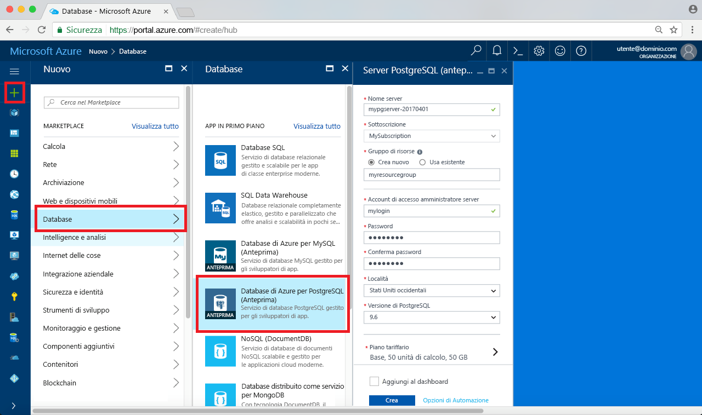

# <a name="create-an-azure-database-for-postgresql-in-hello-azure-portal"></a>Creare un Database di Azure per PostgreSQL hello portale di Azure

Il Database di Azure per PostgreSQL è un servizio gestito che consente di toorun, gestire e scalare database PostgreSQL a disponibilità elevata nel cloud hello. Questa Guida introduttiva viene illustrato come toocreate un Azure del Database per server PostgreSQL utilizzando hello portale di Azure in circa cinque minuti.

Se non si ha una sottoscrizione di Azure, creare un account [gratuito](https://azure.microsoft.com/free/) prima di iniziare.

## <a name="log-in-toohello-azure-portal"></a>Accedi toohello portale di Azure
Aprire il web browser e passare toohello [portale Microsoft Azure](https://portal.azure.com/). Immettere le credenziali toosign nel portale toohello. visualizzazione predefinita Hello è il dashboard del servizio.

## <a name="create-an-azure-database-for-postgresql"></a>Creare un database di Azure per PostgreSQL

Verrà creato un database di Azure per il server PostgreSQL con un set definito di [risorse di calcolo e di archiviazione](./concepts-compute-unit-and-storage.md). Hello server viene creato all'interno di un [gruppo di risorse](../azure-resource-manager/resource-group-overview.md).

Seguire questi toocreate passaggi un Database di Azure per PostgreSQL server:
1.  Fare clic su hello **New** pulsante (+) in hello angolo superiore sinistro del portale di Azure hello.
2.  Selezionare **database** da hello **New** pagina e selezionare **Database di Azure per PostgreSQL** da hello **database** pagina.
 

3.  Compilare hello nuovi server Dettagli modulo con hello le seguenti informazioni, come mostrato nella precedente immagine hello:

    Impostazione|Valore consigliato|Descrizione
    ---|---|---
    Nome server |*mypgserver-20170401*|Scegliere un nome univoco per identificare il database di Azure per il server PostgreSQL. nome di dominio Hello *postgres.database.azure.com* è il nome di server aggiunti toohello Fornisci per tooconnect di applicazioni per. nome del server Hello può contenere solo lettere minuscole, numeri e caratteri di trattino (-) hello e deve contenere da 3 a 63 caratteri.
    Sottoscrizione|*Sottoscrizione in uso*|Hello sottoscrizione di Azure che si desidera toouse per il server. Se si dispone di più sottoscrizioni, scegliere in cui la risorsa hello viene fatturata per la sottoscrizione appropriata hello.
    Gruppo di risorse|*myresourcegroup*| È possibile creare un nuovo nome di gruppo di risorse o usarne uno esistente nella sottoscrizione.
    Accesso amministratore server |*mylogin*| Verificare la propria toouse di account di accesso durante la connessione server toohello. nome di account di accesso amministratore Hello non può essere 'azure_superuser', 'azure_pg_admin', 'admin', 'administrator', 'root', 'guest' o 'public' e non può iniziare con 'pg_'.
    Password |*A scelta dell'utente* | Creare una nuova password per l'account amministratore di server hello. Deve contenere da 8 too128 caratteri. La password deve contenere caratteri di tre delle seguenti categorie di hello: inglese lettere maiuscole, lettere minuscole, numeri (0-9) e caratteri non alfanumerici (!, $, #, %, ecc.).
    Percorso|*utenti tooyour di Hello area più vicini*| Scegliere percorso hello utenti tooyour più vicini.
    Versione di PostgreSQL|*Scegliere la versione più recente di hello*| Scegliere la versione più recente di hello, a meno che non si dispone di requisiti specifici.
    Piano tariffario | **Basic**, **50 unità di calcolo** **50 GB** | Fare clic su **tariffario** toospecify hello servizio livello di prestazioni e per il nuovo database. Nella scheda hello nella parte superiore di hello, scegliere il livello di base. Fare clic su hello estremità sinistra hello unità di calcolo dispositivo di scorrimento tooadjust hello valore toohello minimo disponibile per questa Guida rapida. Fare clic su **Ok** hello toosave dei prezzi di selezione. Vedere la seguente schermata hello.
    | PIN toodashboard | Controllo | Controllare hello **toodashboard Pin** opzione tooallow facile rilevamento del server nella pagina dashboard anteriore hello del portale di Azure.

  > [!IMPORTANT]
  > account di accesso amministratore server Hello e una password che è possibile specificare sono necessari toolog toohello server e i relativi database più avanti in questa Guida introduttiva. Prendere nota di queste informazioni per usarle in seguito.

    

4.  Fare clic su **crea** server hello tooprovision. Provisioning richiede alcuni minuti, i minuti too20 massimo.

5.  Sulla barra degli strumenti hello, fare clic su **notifiche** toomonitor processo di distribuzione hello.
 
   
  Per impostazione predefinita, il database **postgres** viene creato nel server. Hello [postgres](https://www.postgresql.org/docs/9.6/static/app-initdb.html) database è un database predefinito può essere utilizzata per gli utenti, utilità e applicazioni di terze parti. 

## <a name="configure-a-server-level-firewall-rule"></a>Configurare una regola del firewall a livello di server

Hello Azure Database PostgreSQL servizio consente di creare un firewall a livello di server hello. Questo firewall impedisce applicazioni esterne e gli strumenti di connessione toohello server e tutti i database nel server di hello, solo una regola del firewall creata firewall hello tooopen per indirizzi IP specifici. 

1.  Individuare il server al termine della distribuzione hello. Se necessario, è possibile eseguire una ricerca. Ad esempio, fare clic su **tutte le risorse** dal menu a sinistra hello e digitare il nome di server hello (ad esempio esempio hello *mypgserver 20170401*) toosearch per il server appena creato. Fare clic sul nome del server elencato nei risultati di ricerca hello. Hello **Panoramica** pagina per il server viene aperto e offre opzioni per un'ulteriore configurazione.
 
    

2.  Nella pagina server hello selezionare **sicurezza della connessione**. 
    

3.  In hello **regole del Firewall** fare clic su nella casella di testo vuoto hello hello **nome regola** toobegin colonna creazione hello regola del firewall. 

    Per questa Guida introduttiva di seguito consentono di tutti gli indirizzi IP in server hello immettendo nella casella di testo hello in ogni colonna con hello seguenti valori:

    Nome regola | Indirizzo IP iniziale | Indirizzo IP finale 
    ---|---|---
    AllowAllIps |  0.0.0.0 | 255.255.255.255

4. Barra degli strumenti hello superiore della pagina di sicurezza connessione hello, fare clic su **salvare**. Attendere qualche istante e notifica hello informativa che mostra che l'aggiornamento di sicurezza della connessione è stato completato prima di continuare.

    > [!NOTE]
    > Connessioni tooyour Database di Azure per server PostgreSQL comunicare attraverso la porta 5432. Se si sta tentando di tooconnect da una rete aziendale, il traffico in uscita sulla porta 5432 può non essere consentito dal firewall della rete. In questo caso, non sarà in grado di tooconnect tooyour server, a meno che il reparto IT apre la porta 5432.
    >

## <a name="get-hello-connection-information"></a>Ottenere informazioni sulla connessione hello

Quando si crea il database di Azure per il server PostgreSQL, viene creato un database predefinito **postgres**. server di database tooyour tooconnect, è necessario tooremember hello server completo dall'amministratore e nome credenziali di accesso. Si hanno osservato tali valori in precedenza nell'articolo di avvio rapido hello. Nel caso in cui non è stato eseguito, di facile hello accesso tramite nome e informazioni sul server dalla pagina Panoramica di server hello in hello portale di Azure.

1. Aprire la pagina **Panoramica** del server. Prendere nota di hello **nome Server** e **nome account di accesso di amministratore Server**.
    Posiziona il cursore sulla ogni campo e icona Copia hello toohello destra del testo hello. Fare clic sull'icona di copia hello come valori hello toocopy necessari.

 

## <a name="connect-toopostgresql-database-using-psql-in-cloud-shell"></a>La connessione a database tooPostgreSQL utilizzando psql nella Shell di Cloud

Esistono un numero di applicazioni è possibile utilizzare tooconnect tooyour Database di Azure per server PostgreSQL. Consente innanzitutto di usare hello psql utilità della riga di comando tooillustrate come tooconnect toohello server.  È possibile utilizzare un web browser e della Shell di Cloud di Azure come descritto di seguito senza hello hello necessario tooinstall software aggiuntivo. Se si dispone di utilità psql hello installato localmente nel computer, è possibile connettersi anche da quest '.

1. Avviare hello Shell di Cloud di Azure tramite l'icona di terminal hello nel riquadro di spostamento superiore hello.

   

2. Hello Azure Cloud Shell apre nel browser, consentendo tootype i comandi della shell bash.

   

3. Al prompt della Shell Cloud hello connessione database tooa nel Database di Azure per server PostgreSQL digitando hello psql della riga di comando al prompt dei comandi hello verde.

    il formato seguente Hello è tooan tooconnect utilizzati Database di Azure per server PostgreSQL con hello [psql](https://www.postgresql.org/docs/9.6/static/app-psql.html) utilità:
    ```bash
    psql --host=<yourserver> --port=<port> --username=<server admin login> --dbname=<database name>
    ```

    Ad esempio, hello comando seguente si connette a server di esempio tooan:

    ```bash
    psql --host=mypgserver-20170401.postgres.database.azure.com --port=5432 --username=mylogin@mypgserver-20170401 --dbname=postgres
    ```

    Parametro psql |Valore consigliato|Descrizione
    ---|---|---
    --host | *nome del server* | Specificare hello server valore del nome è stato utilizzato durante la creazione hello Database di Azure per PostgreSQL in precedenza. Il server di esempio visualizzato è mypgserver-20170401.postgres.database.azure.com. Utilizza il nome di dominio completo hello (\*. postgres.database.azure.com) come illustrato nell'esempio hello. Seguire i passaggi di hello in hello precedente sezione tooget hello le informazioni di connessione se non si ricorda il nome del server. 
    --port | **5432** | Utilizzare sempre la porta 5432 per la connessione di Database tooAzure per PostgreSQL. 
    --username | *nome di accesso amministratore server* |Digitare nome utente account di accesso amministratore server hello specificato durante la creazione del Database di Azure hello per PostgreSQL in precedenza. Seguire i passaggi di hello in hello precedente sezione tooget hello le informazioni di connessione se non si ricorda hello username.  formato hello è  *username@servername* .
    --dbname | **postgres** | Nome del database utilizzare hello predefinito generato dal sistema *postgres* per la prima connessione hello. Successivamente viene creato il database personalizzato.

    Dopo il comando psql hello in esecuzione, con i valori di parametro, si password di amministratore server hello tootype richiesta. Questa password è hello stesso fornito al momento della creazione server hello. 

    Parametro psql |Valore consigliato|Descrizione
    ---|---|---
    password | *password amministratore dell'utente* | Si noti, hello password digitata caratteri non vengono visualizzati in bash hello prompt dei comandi. Premere INVIO dopo aver digitato tutti hello caratteri tooauthenticate e connettersi.

    Una volta connessi, utilità psql hello consente di visualizzare un prompt dei comandi postgres necessario digitare i comandi sql. Nell'output di hello connessione iniziale, un messaggio di avviso potrebbe essere visualizzato poiché psql hello in hello Azure Cloud Shell può essere una versione differente rispetto a hello Azure Database PostgreSQL versione del server. 
    
    Output di psql esempio:
    ```bash
    psql (9.5.7, server 9.6.2)
    WARNING: psql major version 9.5, server major version 9.6.
        Some psql features might not work.
    SSL connection (protocol: TLSv1.2, cipher: ECDHE-RSA-AES256-SHA384, bits: 256, compression: off)
    Type "help" for help.
   
    postgres=> 
    ```

    > [!TIP]
    > Se hello firewall non è configurato l'indirizzo IP tooallow hello del hello Shell di Cloud di Azure, hello seguente errore:
    > 
    > "psql: FATAL:  no pg_hba.conf entry for host "138.91.195.82", user "mylogin", database "postgres", SSL on FATAL:  SSL connection is required. Please specify SSL options and retry.
    > 
    > Errore di hello tooresolve, verificare che hello server configuration corrispondenze hello passaggi hello *configurare una regola firewall di livello server* sezione dell'articolo hello.

4.  Creare un database vuoto in hello prompt dei comandi digitando hello comando seguente:
    ```bash
    CREATE DATABASE mypgsqldb;
    ```
    comando Hello potrebbe richiedere alcuni istanti toocomplete. 

5.  Al prompt dei comandi hello, eseguire hello seguente database toohello appena creato di comando tooswitch connessione **mypgsqldb**.
    ```bash
    \c mypgsqldb
    ```

6.  Digitare \q e quindi premere INVIO tooquit psql. Dopo avere completato, è possibile chiudere hello Shell di Cloud di Azure.

Si dispone ora connessi toohello Database di Azure per PostgreSQL e creato un database utente vuoto. Continuare a utilizzare un altro strumento comune, pgAdmin toohello successiva sezione tooconnect.

## <a name="connect-toopostgresql-database-using-pgadmin"></a>La connessione a database tooPostgreSQL utilizzando pgAdmin

tooconnect tooAzure PostgreSQL server utilizzando lo strumento GUI hello _pgAdmin_
1.  Avviare hello _pgAdmin_ applicazione nel computer client. È possibile installare _pgAdmin_ da http://www.pgadmin.org/.
2.  Fare clic su hello **aggiungere nuovi Server** icona hello **collegamenti rapidi** sezione centro hello hello pagina del Dashboard.
3.  In hello **Create - Server** la finestra di dialogo **generale** , immettere un nome descrittivo univoco per il server di hello, ad esempio **PostgreSQL Server Azure**.

4.  In hello **Create - Server** nella finestra di dialogo **connessione** scheda, utilizzare le impostazioni di hello come specificato, fare clic su **salvare**.
   

    Parametro di pgAdmin |Valore consigliato|Descrizione
    ---|---|---
    Host Name/Address (Nome host/indirizzo) | *nome del server* | Specificare hello server valore del nome è stato utilizzato durante la creazione hello Database di Azure per PostgreSQL in precedenza. Il server di esempio visualizzato è mypgserver-20170401.postgres.database.azure.com. Utilizza il nome di dominio completo hello (\*. postgres.database.azure.com) come illustrato nell'esempio hello. Seguire i passaggi di hello in hello precedente sezione tooget hello le informazioni di connessione se non si ricorda il nome del server. 
    Porta | **5432** | Utilizzare sempre la porta 5432 per la connessione di Database tooAzure per PostgreSQL.  
    Maintenance Database (Database manutenzione) | **postgres** | Nome del database utilizzare hello predefinito generato dal sistema *postgres*.
    User Name | *nome di accesso amministratore server* | Digitare nome utente account di accesso amministratore server hello specificato durante la creazione del Database di Azure hello per PostgreSQL in precedenza. Seguire i passaggi di hello in hello precedente sezione tooget hello le informazioni di connessione se non si ricorda hello username. formato hello è  *username@servername* .
    Password | *password amministratore dell'utente* |  password Hello scelto al momento della creazione di server hello in precedenza in questa Guida rapida.
    Ruolo | *lasciare vuoto* | Non è necessario tooprovide un ruolo di assegnare un nome a questo punto. Lasciare vuoto il campo hello.
    SSL Mode (Modalità SSL) | Valore richiesto | Per impostazione predefinita, tutti i server PostgreSQL Azure vengono creati con l'opzione di applicazione del protocollo SSL attivata. tooturn OFF applica SSL, vedere i dettagli nella [applicazione SSL](./concepts-ssl-connection-security.md).
    
5.  Fare clic su **Salva**.
6.  Nel riquadro a sinistra del Visualizzatore hello, espandere hello **server** nodo. Scegliere il server, ad esempio **PostgreSQL Server Azure** e fare clic su tooconnect tooit.
7. Espandere il nodo server hello e quindi **database** sotto di esso. Hello elenco deve includere esistente *postgres* , qualsiasi utente appena creato e database di database, ad esempio *mypgsqldb*, creato nella sezione precedente hello. Si noti che con Database di Azure per PostgreSQL è possibile creare più database per server.
8. Fare clic su **database**, scegliere hello **crea** dal menu **Database**.
9.  Digitare un nome di database di propria scelta nel hello **Database** campo, ad esempio *mypgsqldb* illustrato nell'esempio hello. 
10. Seleziona hello **proprietario** per database hello dalla casella di riepilogo a discesa hello. Scegliere il nome di accesso amministratore server, che in questo esempio è *mylogin*.
10. Fare clic su **salvare** toocreate un nuovo database vuoto.
11. In hello **Browser** riquadro, vedere database hello creato nell'elenco di hello dei database con il nome del server.
 


## <a name="clean-up-resources"></a>Pulire le risorse
Pulire le risorse di hello creato nella Guida introduttiva hello uno eliminando hello [gruppo di risorse](../azure-resource-manager/resource-group-overview.md), che include tutte le risorse di hello nel gruppo di risorse hello o eliminando la risorsa di un server hello se si desidera tookeep hello altre risorse intatti.

> [!TIP]
> Altre guide di avvio rapido di questa raccolta si basano sulla presente guida di avvio rapido. Se si intende toocontinue toowork con successive Guide rapide, eseguire la pulizia hello le risorse create in questa Guida rapida. Se non si prevede toocontinue, utilizzare hello seguenti risorse toodelete passaggi create da questa Guida rapida nel portale di Azure hello.

toodelete hello intero gruppo di risorse tra cui server hello appena creato:
1.  Individuare il gruppo di risorse nel portale di Azure hello. Dal menu a sinistra di hello in hello portale di Azure, fare clic su **gruppi di risorse** e quindi fare clic su nome hello del gruppo di risorse, ad esempio esempio **myresourcegroup**.
2.  Nella pagina del gruppo di risorse fare clic su **Elimina**. Quindi hello del tipo del gruppo di risorse, ad esempio esempio **myresourcegroup**in hello di eliminazione tooconfirm casella di testo e quindi fare clic su **eliminare**.

O invece hello toodelete appena creata server:
1.  Se non si dispone, aprire, individuare il server nel portale di Azure hello. Dal menu a sinistra di hello nel portale di Azure, fare clic su **tutte le risorse**e quindi cercare server hello è stato creato.
2.  In hello **Panoramica** pagina, fare clic su hello **eliminare** pulsante nel riquadro superiore hello.

3.  Confermare il nome server hello desiderato toodelete e visualizzare i database di hello in essa contenute sono interessate. Digitare il nome del server nella casella di testo hello, ad esempio esempio **mypgserver 20170401**, quindi fare clic su **eliminare**.

## <a name="next-steps"></a>Passaggi successivi
> [!div class="nextstepaction"]
> [Eseguire la migrazione del database usando le funzionalità di esportazione e importazione](./howto-migrate-using-export-and-import.md)
