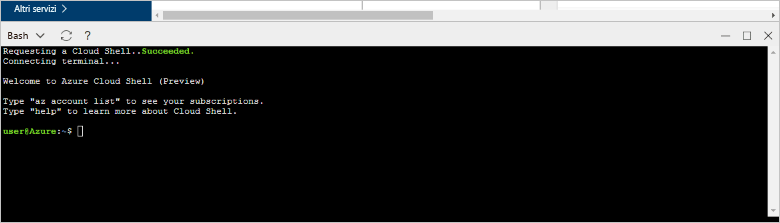

# <a name="design-your-first-azure-database-for-postgresql-using-hello-azure-portal"></a>Progettazione di un Database di Azure per PostgreSQL utilizzando hello portale di Azure

Il Database di Azure per PostgreSQL è un servizio gestito che consente di toorun, gestire e scalare database PostgreSQL a disponibilità elevata nel cloud hello. Utilizza hello portale di Azure, è possibile facilmente gestire il server e progettare un database.

In questa esercitazione, utilizzare la modalità hello toolearn portale Azure per:
> [!div class="checklist"]
> * Creare un database di Azure per PostgreSQL
> * Configurare firewall hello del server
> * Utilizzare [ **psql** ](https://www.postgresql.org/docs/9.6/static/app-psql.html) toocreate utilità un database
> * Caricare dati di esempio
> * Eseguire query sui dati
> * Aggiornare i dati
> * Ripristinare i dati

## <a name="prerequisites"></a>Prerequisiti
Se non si ha una sottoscrizione di Azure, creare un account [gratuito](https://azure.microsoft.com/free/) prima di iniziare.

## <a name="log-in-toohello-azure-portal"></a>Accedi toohello portale di Azure
Accedi toohello [portale di Azure](https://portal.azure.com).

## <a name="create-an-azure-database-for-postgresql"></a>Creare un database di Azure per PostgreSQL

Verrà creato un database di Azure per il server PostgreSQL con un set definito di [risorse di calcolo e di archiviazione](./concepts-compute-unit-and-storage.md). Hello server viene creato all'interno di un [gruppo di risorse](../azure-resource-manager/resource-group-overview.md).

Seguire questi toocreate passaggi un Database di Azure per PostgreSQL server:
1.  Fare clic su hello **+ nuovo** pulsante disponibile nella hello angolo superiore sinistro del portale di Azure hello.
2.  Selezionare **database** da hello **New** pagina e selezionare **Database di Azure per PostgreSQL** da hello **database** pagina.
 

3.  Compilare hello nuovi server Dettagli modulo con hello le seguenti informazioni, come mostrato nella precedente immagine hello:
    - Nome del server: **mypgserver 20170401** (nome di un server esegue il mapping nome tooDNS ed è pertanto necessario toobe univoco globale) 
    - Sottoscrizione: Se si dispone di più sottoscrizioni, scegliere la sottoscrizione appropriata di hello in cui esistano risorse hello o viene fatturata per.
    - Gruppo di risorse: **myresourcegroup**
    - L'accesso dell'amministratore del server e la password scelta
    - Località
    - Versione di PostgreSQL

  > [!IMPORTANT]
  > account di accesso amministratore server Hello e una password che è possibile specificare sono necessari toolog toohello server e i relativi database più avanti in questa Guida introduttiva. Prendere nota di queste informazioni per usarle in seguito.

4.  Fare clic su **tariffario** toospecify hello servizio livello di prestazioni e per il nuovo database. Per questa guida di avvio rapido, selezionare il livello **Basic**, **50 unità di calcolo** e **50 GB** di spazio di archiviazione incluso.
 
5.  Fare clic su **OK**.
6.  Fare clic su **crea** server hello tooprovision. Il provisioning richiede alcuni minuti.

  > [!TIP]
  > Controllare hello **toodashboard Pin** rilevamento semplice di opzione tooallow delle distribuzioni.

7.  Sulla barra degli strumenti hello, fare clic su **notifiche** toomonitor processo di distribuzione hello.
 
   
  Per impostazione predefinita, il database **postgres** viene creato nel server. Hello [postgres](https://www.postgresql.org/docs/9.6/static/app-initdb.html) database è un database predefinito può essere utilizzata per gli utenti, utilità e applicazioni di terze parti. 

## <a name="configure-a-server-level-firewall-rule"></a>Configurare una regola del firewall a livello di server

Hello Azure Database PostgreSQL servizio consente di creare un firewall a livello di server hello. Questo firewall impedisce la applicazioni esterne e gli strumenti connessione toohello server e tutti i database nel server di hello solo una regola del firewall creata firewall hello tooopen per indirizzi IP specifici. 

1.  Al termine della distribuzione di hello, fare clic su **tutte le risorse** dal menu a sinistra hello e digitare il nome di hello **mypgserver 20170401** toosearch per il server appena creato. Fare clic su un nome server hello elencato nei risultati di ricerca hello. Hello **Panoramica** pagina per il server viene aperto e offre opzioni per un'ulteriore configurazione.
 
 

2.  Nel Pannello di hello server, selezionare **sicurezza della connessione**. 
3.  Fare clic nella casella di testo hello in **nome della regola,** e aggiungere un nuovo firewall regola toowhitelist hello intervallo IP per la connettività. Per questa esercitazione, consentire tutti gli indirizzi IP digitando **Rule Name = AllowAllIps**, **IP iniziale = 0.0.0.0** e **IP finale = 255.255.255.255** e quindi fare clic su **Salva**. È possibile impostare una regola del firewall che copre un intervallo IP toobe tooconnect in grado di dalla rete.
 
 

4.  Fare clic su **salvare** e quindi fare clic su hello **X** tooclose hello **sicurezza connessioni** pagina.

  > [!NOTE]
  > Il server PostgreSQL Azure comunica sulla porta 5432. Se si sta tentando di tooconnect da una rete aziendale, il traffico in uscita sulla porta 5432 può non essere consentito dal firewall della rete. In questo caso, non sarà server di Database SQL di Azure in grado di tooconnect tooyour, a meno che il reparto IT apre la porta 5432.
  >


## <a name="get-hello-connection-information"></a>Ottenere informazioni sulla connessione hello

Quando abbiamo creato il Database di Azure per server PostgreSQL, hello predefinito **postgres** database viene inoltre creato. server di database tooyour tooconnect, sono necessarie credenziali di accesso e le informazioni di host tooprovide.

1. Dal menu a sinistra di hello nel portale di Azure, fare clic su **tutte le risorse** cercare hello server appena creato e **mypgserver 20170401**.

  

3. Fare clic sul nome di server hello **mypgserver 20170401**.
4. Server di selezionare hello **Panoramica** pagina. Prendere nota di hello **nome Server** e **nome account di accesso di amministratore Server**.

 


## <a name="connect-toopostgresql-database-using-psql-in-cloud-shell"></a>La connessione a database tooPostgreSQL utilizzando psql nella Shell di Cloud

Verrà ora utilizzare hello psql utilità della riga di comando tooconnect toohello Azure Database PostgreSQL server. 
1. Avviare hello Shell di Cloud di Azure tramite l'icona di terminal hello nel riquadro di spostamento superiore hello.

   

2. Hello Azure Cloud Shell apre nel browser, consentendo tootype bash comandi.

   

3. Al prompt della Shell Cloud hello connettersi tooyour Database di Azure per server PostgreSQL utilizzando i comandi psql hello. il formato seguente Hello è tooan tooconnect utilizzati Database di Azure per server PostgreSQL con hello [psql](https://www.postgresql.org/docs/9.6/static/app-psql.html) utilità:
   ```bash
   psql --host=<myserver> --port=<port> --username=<server admin login> --dbname=<database name>
   ```

   Ad esempio, hello comando seguente si connette a database predefinito toohello chiamato **postgres** sul server PostgreSQL **mypgserver 20170401.postgres.database.azure.com** utilizzando le credenziali di accesso. Quando richiesto, immettere la password di amministratore del server.

   ```bash
   psql --host=mypgserver-20170401.postgres.database.azure.com --port=5432 --username=mylogin@mypgserver-20170401 --dbname=postgres
   ```

## <a name="create-a-new-database"></a>Creare un nuovo database
Dopo aver connesso toohello server, è possibile creare un database vuoto al prompt dei comandi hello.
```bash
CREATE DATABASE mypgsqldb;
```

Al prompt dei comandi hello, eseguire hello seguente database toohello appena creato di comando tooswitch connessione **mypgsqldb**.
```bash
\c mypgsqldb
```
## <a name="create-tables-in-hello-database"></a>Creare tabelle nel database di hello
Ora che è stato appreso come tooconnect toohello Database di Azure per PostgreSQL, possiamo andare come toocomplete alcune attività di base.

In primo luogo, è possibile creare una tabella e caricarla con alcuni dati. Creare una tabella che tiene traccia delle informazioni riguardanti l'inventario.
```sql
CREATE TABLE inventory (
    id serial PRIMARY KEY, 
    name VARCHAR(50), 
    quantity INTEGER
);
```

È possibile visualizzare hello appena creato tabella nell'elenco di hello di tabvles ora digitando:
```sql
\dt
```

## <a name="load-data-into-hello-tables"></a>Caricamento dei dati nelle tabelle di hello
Ora che abbiamo una tabella, possiamo inserire alcuni dati al suo interno. Nella finestra del prompt dei comandi aperta hello eseguire hello seguente query tooinsert alcune righe di dati
```sql
INSERT INTO inventory (id, name, quantity) VALUES (1, 'banana', 150); 
INSERT INTO inventory (id, name, quantity) VALUES (2, 'orange', 154);
```

È ora due righe di dati di esempio nella tabella hello creato in precedenza.

## <a name="query-and-update-hello-data-in-hello-tables"></a>Eseguire una query e aggiornare i dati nelle tabelle di hello hello
Eseguire le seguenti query tooretrieve informazioni dalla tabella di database hello hello. 
```sql
SELECT * FROM inventory;
```

È inoltre possibile aggiornare i dati di hello nelle tabelle di hello
```sql
UPDATE inventory SET quantity = 200 WHERE name = 'banana';
```

la riga Hello Ottiene aggiornata di conseguenza quando si recuperano dati.
```sql
SELECT * FROM inventory;
```

## <a name="restore-data-tooa-previous-point-in-time"></a>Dati tooa precedente punto di ripristino temporizzato
Si supponga di aver eliminato accidentalmente questa tabella. Questa situazione non è facile da ripristinare. Il Database di Azure per PostgreSQL consente toogo tooany indietro punto nel tempo (in hello ultimo backup too7 giorni (Basic) e 35 giorni (Standard)) e il ripristino di questo nuovo server tooa punto nel tempo. È possibile utilizzare questo nuovo toorecover server i dati eliminati. Hello seguente punto di ripristino hello campione server tooa passaggi prima tabella hello è stato aggiunto.

1.  Hello Azure Database PostgreSQL pagina per il server, scegliere **ripristinare** sulla barra degli strumenti hello. Hello **ripristinare** verrà visualizzata la pagina.
  
2.  Compilare hello **ripristinare** form con le informazioni necessarie hello:

  
  - **Punto di ripristino**: selezionare un punto nel tempo che si verifica prima che il server di hello è stato modificato
  - **Server di destinazione**: fornire un nuovo nome del server desiderato toorestore per
  - **Percorso**: non è possibile selezionare l'area di hello, per impostazione predefinita è uguale al server di origine hello
  - **Piano tariffario**: non è possibile modificare questo valore quando si ripristina un server. È uguale al server di origine hello. 
3.  Fare clic su **OK** toorestore hello server troppo[tooa momento di ripristinare](./howto-restore-server-portal.md) prima tabelle hello è stato eliminato. Ripristino di un punto diverso di server tooa nel tempo crea un duplicato nuovo server come server originale hello come hello punto nel tempo specificato, purché tale valore entro il periodo di memorizzazione hello per le [livello di servizio](./concepts-service-tiers.md).

## <a name="next-steps"></a>Passaggi successivi
In questa esercitazione, si è appreso come toouse hello portale di Azure e altre utilità per:
> [!div class="checklist"]
> * Creare un database di Azure per PostgreSQL
> * Configurare firewall hello del server
> * Utilizzare [ **psql** ](https://www.postgresql.org/docs/9.6/static/app-psql.html) toocreate utilità un database
> * Caricare dati di esempio
> * Eseguire query sui dati
> * Aggiornare i dati
> * Ripristinare i dati

Per ulteriori informazioni come attività simili toodo CLI di Azure toouse, rivedere l'esercitazione: [di progettazione di un Database di Azure per PostgreSQL mediante Azure CLI](tutorial-design-database-using-azure-cli.md)
