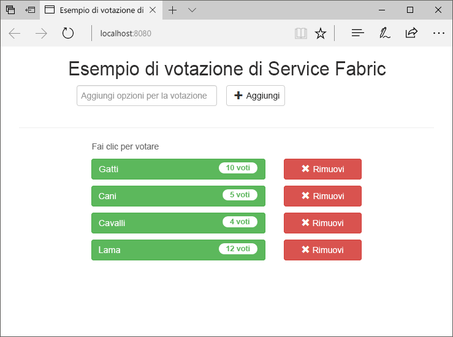
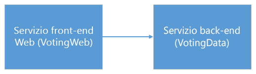
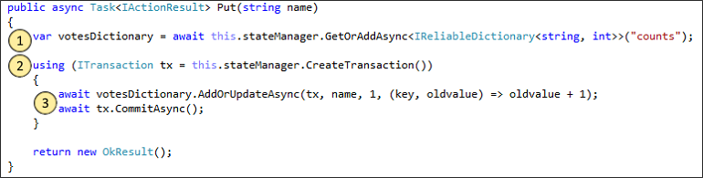
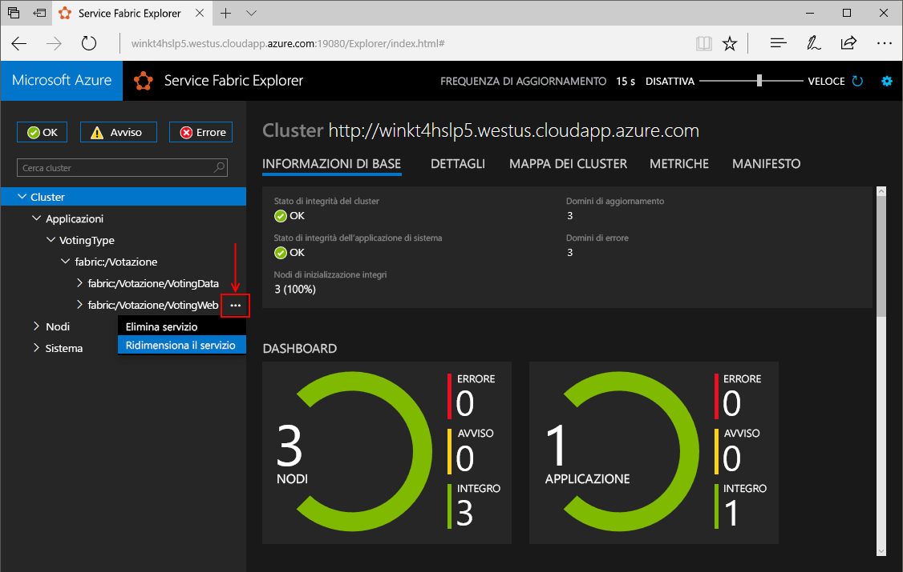
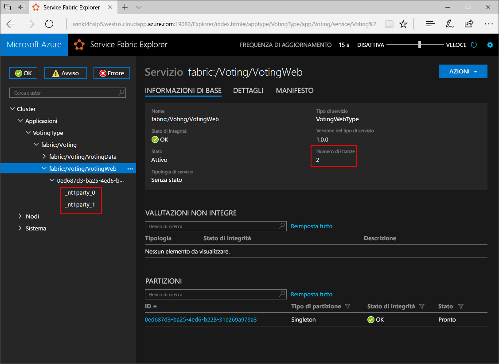
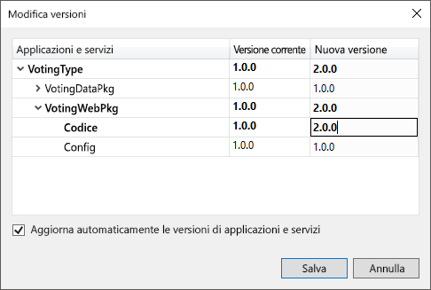
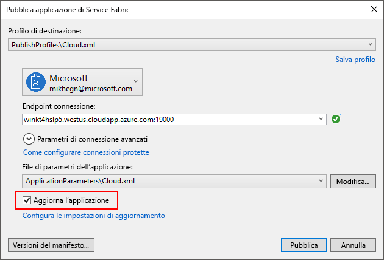
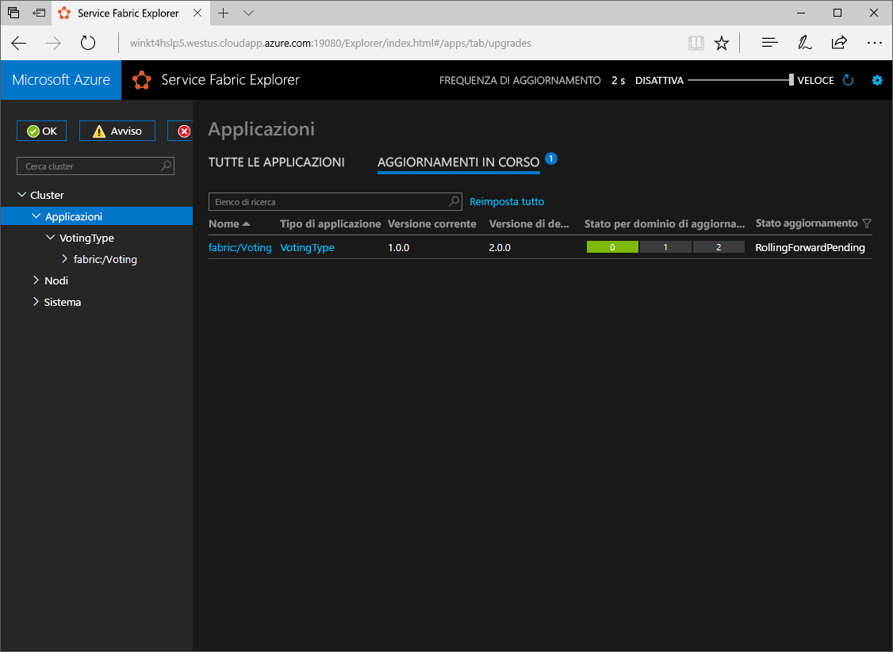

# <a name="create-a-net-service-fabric-application-in-azure"></a><span data-ttu-id="d9b36-103">Creare un'applicazione .NET Service Fabric in Azure</span><span class="sxs-lookup"><span data-stu-id="d9b36-103">Create a .NET Service Fabric application in Azure</span></span>
<span data-ttu-id="d9b36-104">Azure Service Fabric è una piattaforma di sistemi distribuiti per la distribuzione e la gestione di microservizi e contenitori scalabili e affidabili.</span><span class="sxs-lookup"><span data-stu-id="d9b36-104">Azure Service Fabric is a distributed systems platform for deploying and managing scalable and reliable microservices and containers.</span></span> 

<span data-ttu-id="d9b36-105">In questa guida introduttiva viene illustrato come distribuire la prima applicazione .NET in Service Fabric.</span><span class="sxs-lookup"><span data-stu-id="d9b36-105">This quickstart shows how to deploy your first .NET application to Service Fabric.</span></span> <span data-ttu-id="d9b36-106">Al termine, sarà disponibile un'applicazione di voto con un front-end Web ASP.NET Core che salva i risultati delle votazioni in un servizio back-end con stato nel cluster.</span><span class="sxs-lookup"><span data-stu-id="d9b36-106">When you're finished, you have a voting application with an ASP.NET Core web front-end that saves voting results in a stateful back-end service in the cluster.</span></span>



<span data-ttu-id="d9b36-108">Usando questa applicazione, si apprenderà come:</span><span class="sxs-lookup"><span data-stu-id="d9b36-108">Using this application you learn how to:</span></span>
> [!div class="checklist"]
> * <span data-ttu-id="d9b36-109">Creare un'applicazione mediante .NET e Service Fabric</span><span class="sxs-lookup"><span data-stu-id="d9b36-109">Create an application using .NET and Service Fabric</span></span>
> * <span data-ttu-id="d9b36-110">Usare ASP.NET Core come front-end Web</span><span class="sxs-lookup"><span data-stu-id="d9b36-110">Use ASP.NET core as a web front-end</span></span>
> * <span data-ttu-id="d9b36-111">Archiviare i dati dell'applicazione in un servizio con stato</span><span class="sxs-lookup"><span data-stu-id="d9b36-111">Store application data in a stateful service</span></span>
> * <span data-ttu-id="d9b36-112">Eseguire il debug dell'applicazione in locale</span><span class="sxs-lookup"><span data-stu-id="d9b36-112">Debug your application locally</span></span>
> * <span data-ttu-id="d9b36-113">Distribuire l'applicazione in un cluster in Azure</span><span class="sxs-lookup"><span data-stu-id="d9b36-113">Deploy the application to a cluster in Azure</span></span>
> * <span data-ttu-id="d9b36-114">Scalare orizzontalmente l'applicazione in più nodi</span><span class="sxs-lookup"><span data-stu-id="d9b36-114">Scale-out the application across multiple nodes</span></span>
> * <span data-ttu-id="d9b36-115">Eseguire un aggiornamento in sequenza delle applicazioni</span><span class="sxs-lookup"><span data-stu-id="d9b36-115">Perform a rolling application upgrade</span></span>

## <a name="prerequisites"></a><span data-ttu-id="d9b36-116">Prerequisiti</span><span class="sxs-lookup"><span data-stu-id="d9b36-116">Prerequisites</span></span>
<span data-ttu-id="d9b36-117">Per completare questa guida introduttiva:</span><span class="sxs-lookup"><span data-stu-id="d9b36-117">To complete this quickstart:</span></span>
1. <span data-ttu-id="d9b36-118">[Installare Visual Studio 2017](https://www.visualstudio.com/) con i carichi di lavoro **Sviluppo di Azure** e **Sviluppo ASP.NET e Web**.</span><span class="sxs-lookup"><span data-stu-id="d9b36-118">[Install Visual Studio 2017](https://www.visualstudio.com/) with the **Azure development** and **ASP.NET and web development** workloads.</span></span>
2. [<span data-ttu-id="d9b36-119">Installare Git</span><span class="sxs-lookup"><span data-stu-id="d9b36-119">Install Git</span></span>](https://git-scm.com/)
3. [<span data-ttu-id="d9b36-120">Installare Microsoft Azure Service Fabric SDK</span><span class="sxs-lookup"><span data-stu-id="d9b36-120">Install the Microsoft Azure Service Fabric SDK</span></span>](http://www.microsoft.com/web/handlers/webpi.ashx?command=getinstallerredirect&appid=MicrosoftAzure-ServiceFabric-CoreSDK)
4. <span data-ttu-id="d9b36-121">Eseguire il comando seguente per consentire a Visual Studio di eseguire la distribuzione nel cluster Service Fabric locale:</span><span class="sxs-lookup"><span data-stu-id="d9b36-121">Run the following command to enable Visual Studio to deploy to the local Service Fabric cluster:</span></span>
    ```powershell
    Set-ExecutionPolicy -ExecutionPolicy Unrestricted -Force -Scope CurrentUser
    ```

## <a name="download-the-sample"></a><span data-ttu-id="d9b36-122">Scaricare l'esempio</span><span class="sxs-lookup"><span data-stu-id="d9b36-122">Download the sample</span></span>
<span data-ttu-id="d9b36-123">In una finestra di comando eseguire il comando seguente per clonare il repository dell'app di esempio nel computer locale.</span><span class="sxs-lookup"><span data-stu-id="d9b36-123">In a command window, run the following command to clone the sample app repository to your local machine.</span></span>
```
git clone https://github.com/Azure-Samples/service-fabric-dotnet-quickstart
```

## <a name="run-the-application-locally"></a><span data-ttu-id="d9b36-124">Eseguire l'applicazione in locale</span><span class="sxs-lookup"><span data-stu-id="d9b36-124">Run the application locally</span></span>
<span data-ttu-id="d9b36-125">Fare clic con il pulsante destro del mouse sull'icona di Visual Studio nel menu Start e scegliere **Esegui come amministratore**.</span><span class="sxs-lookup"><span data-stu-id="d9b36-125">Right-click the Visual Studio icon in the Start Menu and choose **Run as administrator**.</span></span> <span data-ttu-id="d9b36-126">Per connettere il debugger ai servizi, è necessario eseguire Visual Studio come amministratore.</span><span class="sxs-lookup"><span data-stu-id="d9b36-126">In order to attach the debugger to your services, you need to run Visual Studio as administrator.</span></span>

<span data-ttu-id="d9b36-127">Aprire la soluzione di Visual Studio **Voting.sln** dal repository che è stato clonato.</span><span class="sxs-lookup"><span data-stu-id="d9b36-127">Open the **Voting.sln** Visual Studio solution from the repository you cloned.</span></span>

<span data-ttu-id="d9b36-128">Per distribuire l'applicazione, premere **F5**.</span><span class="sxs-lookup"><span data-stu-id="d9b36-128">To deploy the application, press **F5**.</span></span>

> [!NOTE]
> <span data-ttu-id="d9b36-129">La prima volta che si esegue e si distribuisce l'applicazione, Visual Studio crea un cluster locale per il debug.</span><span class="sxs-lookup"><span data-stu-id="d9b36-129">The first time you run and deploy the application, Visual Studio creates a local cluster for debugging.</span></span> <span data-ttu-id="d9b36-130">Questa operazione può richiedere del tempo.</span><span class="sxs-lookup"><span data-stu-id="d9b36-130">This operation may take some time.</span></span> <span data-ttu-id="d9b36-131">Lo stato della creazione del cluster verrà visualizzato nella finestra di output di Visual Studio.</span><span class="sxs-lookup"><span data-stu-id="d9b36-131">The cluster creation status is displayed in the Visual Studio output window.</span></span>

<span data-ttu-id="d9b36-132">Al termine della distribuzione, avviare un browser e aprire la pagina `http://localhost:8080`, ovvero il front-end Web dell'applicazione.</span><span class="sxs-lookup"><span data-stu-id="d9b36-132">When the deployment is complete, launch a browser and open this page: `http://localhost:8080` - the web front-end of the application.</span></span>


<span data-ttu-id="d9b36-134">È ora possibile aggiungere un set di opzioni per le votazioni e iniziare a raccogliere i voti.</span><span class="sxs-lookup"><span data-stu-id="d9b36-134">You can now add a set of voting options, and start taking votes.</span></span> <span data-ttu-id="d9b36-135">L'applicazione viene eseguita e archivia tutti i dati nel cluster di Service Fabric, senza che sia necessario un database separato.</span><span class="sxs-lookup"><span data-stu-id="d9b36-135">The application runs and stores all data in your Service Fabric cluster, without the need for a separate database.</span></span>

## <a name="walk-through-the-voting-sample-application"></a><span data-ttu-id="d9b36-136">Descrizione dettagliata dell'applicazione di voto di esempio</span><span class="sxs-lookup"><span data-stu-id="d9b36-136">Walk through the voting sample application</span></span>
<span data-ttu-id="d9b36-137">L'applicazione di voto è costituita da due servizi:</span><span class="sxs-lookup"><span data-stu-id="d9b36-137">The voting application consists of two services:</span></span>
- <span data-ttu-id="d9b36-138">Il servizio front-end Web (VotingWeb) - Un servizio front-end Web ASP.NET Core che gestisce la pagina Web e che espone le API Web per la comunicazione con il servizio back-end.</span><span class="sxs-lookup"><span data-stu-id="d9b36-138">Web front-end service (VotingWeb)- An ASP.NET Core web front-end service, which serves the web page and exposes web APIs to communicate with the backend service.</span></span>
- <span data-ttu-id="d9b36-139">Il servizio back-end (VotingData) - Un servizio Web ASP.NET Core che espone un'API per l'archiviazione dei risultati delle votazioni in un oggetto Reliable Dictionary reso persistente su disco.</span><span class="sxs-lookup"><span data-stu-id="d9b36-139">Back-end service (VotingData)- An ASP.NET Core web service, which exposes an API to store the vote results in a reliable dictionary persisted on disk.</span></span>



<span data-ttu-id="d9b36-141">Quando l'utente vota nell'applicazione, si verificano gli eventi seguenti:</span><span class="sxs-lookup"><span data-stu-id="d9b36-141">When you vote in the application the following events occur:</span></span>
1. <span data-ttu-id="d9b36-142">JavaScript invia la richiesta di voto all'API Web nel servizio front-end Web come una richiesta HTTP PUT.</span><span class="sxs-lookup"><span data-stu-id="d9b36-142">A JavaScript sends the vote request to the web API in the web front-end service as an HTTP PUT request.</span></span>

2. <span data-ttu-id="d9b36-143">Il servizio front-end Web usa un proxy per individuare e inoltrare una richiesta PUT HTTP al servizio back-end.</span><span class="sxs-lookup"><span data-stu-id="d9b36-143">The web front-end service uses a proxy to locate and forward an HTTP PUT request to the back-end service.</span></span>

3. <span data-ttu-id="d9b36-144">Il servizio back-end accetta la richiesta in ingresso e archivia il risultato aggiornato in un oggetto Reliable Dictionary, che viene replicato in più nodi all'interno del cluster e reso persistente su disco.</span><span class="sxs-lookup"><span data-stu-id="d9b36-144">The back-end service takes the incoming request, and stores the updated result in a reliable dictionary, which gets replicated to multiple nodes within the cluster and persisted on disk.</span></span> <span data-ttu-id="d9b36-145">Tutti i dati dell'applicazione sono archiviati nel cluster, quindi non è necessario alcun database.</span><span class="sxs-lookup"><span data-stu-id="d9b36-145">All the application's data is stored in the cluster, so no database is needed.</span></span>

## <a name="debug-in-visual-studio"></a><span data-ttu-id="d9b36-146">Eseguire il debug in Visual Studio</span><span class="sxs-lookup"><span data-stu-id="d9b36-146">Debug in Visual Studio</span></span>
<span data-ttu-id="d9b36-147">Durante il debug dell'applicazione in Visual Studio, viene usato un cluster di sviluppo locale di Service Fabric.</span><span class="sxs-lookup"><span data-stu-id="d9b36-147">When debugging application in Visual Studio, you are using a local Service Fabric development cluster.</span></span> <span data-ttu-id="d9b36-148">È possibile modificare l'esperienza di debug in base allo specifico scenario.</span><span class="sxs-lookup"><span data-stu-id="d9b36-148">You have the option to adjust your debugging experience to your scenario.</span></span> <span data-ttu-id="d9b36-149">In questa applicazione, i dati vengono archiviati nel servizio back-end tramite un oggetto Reliable Dictionary.</span><span class="sxs-lookup"><span data-stu-id="d9b36-149">In this application, we store data in our back-end service, using a reliable dictionary.</span></span> <span data-ttu-id="d9b36-150">Visual Studio rimuove l'applicazione per impostazione predefinita quando si arresta il debugger.</span><span class="sxs-lookup"><span data-stu-id="d9b36-150">Visual Studio removes the application per default when you stop the debugger.</span></span> <span data-ttu-id="d9b36-151">La rimozione dell'applicazione determina la rimozione anche dei dati nel servizio back-end.</span><span class="sxs-lookup"><span data-stu-id="d9b36-151">Removing the application causes the data in the back-end service to also be removed.</span></span> <span data-ttu-id="d9b36-152">Per rendere persistenti i dati tra le sessioni di debug, è possibile modificare la proprietà **Modalità di debug applicazione** del progetto **Voting** in Visual Studio.</span><span class="sxs-lookup"><span data-stu-id="d9b36-152">To persist the data between debugging sessions, you can change the **Application Debug Mode** as a property on the **Voting** project in Visual Studio.</span></span>

<span data-ttu-id="d9b36-153">Per osservare che cosa avviene nel codice, completare la procedura seguente:</span><span class="sxs-lookup"><span data-stu-id="d9b36-153">To look at what happens in the code, complete the following steps:</span></span>
1. <span data-ttu-id="d9b36-154">Aprire il file **VotesController.cs** e impostare un punto di interruzione nel metodo **Put** dell'API Web (riga 47). È possibile eseguire una ricerca nel file usando Esplora soluzioni in Visual Studio.</span><span class="sxs-lookup"><span data-stu-id="d9b36-154">Open the **VotesController.cs** file and set a breakpoint in the web API's **Put** method (line 47) - You can search for the file in the Solution Explorer in Visual Studio.</span></span>

2. <span data-ttu-id="d9b36-155">Aprire il file **VoteDataController.cs** e impostare un punto di interruzione nel metodo **Put** dell'API Web (riga 50).</span><span class="sxs-lookup"><span data-stu-id="d9b36-155">Open the **VoteDataController.cs** file and set a breakpoint in this web API's **Put** method (line 50).</span></span>

3. <span data-ttu-id="d9b36-156">Tornare al browser e fare clic su un'opzione di voto oppure aggiungere una nuova opzione di voto.</span><span class="sxs-lookup"><span data-stu-id="d9b36-156">Go back to the browser and click a voting option or add a new voting option.</span></span> <span data-ttu-id="d9b36-157">È stato raggiunto il primo punto di interruzione nel controller API del front-end Web.</span><span class="sxs-lookup"><span data-stu-id="d9b36-157">You hit the first breakpoint in the web front-end's api controller.</span></span>
    - <span data-ttu-id="d9b36-158">In questa posizione, il codice JavaScript nel browser invia una richiesta al controller API Web nel servizio front-end.</span><span class="sxs-lookup"><span data-stu-id="d9b36-158">This is where the JavaScript in the browser sends a request to the web API controller in the front-end service.</span></span>
    
    

    - <span data-ttu-id="d9b36-160">Prima di tutto, costruire l'URL del proxy inverso per il servizio back-end **(1)**.</span><span class="sxs-lookup"><span data-stu-id="d9b36-160">First we construct the URL to the ReverseProxy for our back-end service **(1)**.</span></span>
    - <span data-ttu-id="d9b36-161">Inviare quindi la richiesta PUT HTTP al proxy inverso **(2)**.</span><span class="sxs-lookup"><span data-stu-id="d9b36-161">Then we send the HTTP PUT Request to the ReverseProxy **(2)**.</span></span>
    - <span data-ttu-id="d9b36-162">Infine, restituire la risposta dal servizio back-end al client **(3)**.</span><span class="sxs-lookup"><span data-stu-id="d9b36-162">Finally the we return the response from the back-end service to the client **(3)**.</span></span>

4. <span data-ttu-id="d9b36-163">Premere **F5** per continuare.</span><span class="sxs-lookup"><span data-stu-id="d9b36-163">Press **F5** to continue</span></span>
    - <span data-ttu-id="d9b36-164">Ora ci troviamo al punto di interruzione nel servizio back-end.</span><span class="sxs-lookup"><span data-stu-id="d9b36-164">You are now at the break point in the back-end service.</span></span>
    
    

    - <span data-ttu-id="d9b36-166">Nella prima riga del metodo **(1)** usiamo `StateManager` per ottenere o aggiungere un oggetto Reliable Dictionary denominato `counts`.</span><span class="sxs-lookup"><span data-stu-id="d9b36-166">In the first line in the method **(1)** we are using the `StateManager` to get or add a reliable dictionary called `counts`.</span></span>
    - <span data-ttu-id="d9b36-167">Tutte le interazioni con i valori in un oggetto Reliable Dictionary richiedono una transazione, che viene creata dall'istruzione using **(2)**.</span><span class="sxs-lookup"><span data-stu-id="d9b36-167">All interactions with values in a reliable dictionary require a transaction, this using statement **(2)** creates that transaction.</span></span>
    - <span data-ttu-id="d9b36-168">Nella transazione, aggiorniamo quindi il valore della chiave pertinente per l'opzione di voto e viene eseguito il commit dell'operazione **(3)**.</span><span class="sxs-lookup"><span data-stu-id="d9b36-168">In the transaction, we then update the value of the relevant key for the voting option and commits the operation **(3)**.</span></span> <span data-ttu-id="d9b36-169">Dopo la restituzione del metodo Commit, i dati vengono aggiornati nel dizionario e replicati negli altri nodi del cluster.</span><span class="sxs-lookup"><span data-stu-id="d9b36-169">Once the commit method returns, the data is updated in the dictionary and replicated to other nodes in the cluster.</span></span> <span data-ttu-id="d9b36-170">A questo punto, i dati sono archiviati in modo sicuro nel cluster e il servizio back-end può eseguire il failover in altri nodi, rendendo comunque disponibili i dati.</span><span class="sxs-lookup"><span data-stu-id="d9b36-170">The data is now safely stored in the cluster, and the back-end service can fail over to other nodes, still having the data available.</span></span>
5. <span data-ttu-id="d9b36-171">Premere **F5** per continuare.</span><span class="sxs-lookup"><span data-stu-id="d9b36-171">Press **F5** to continue</span></span>

<span data-ttu-id="d9b36-172">Per interrompere la sessione di debug, premere **MAIUSC+F5**.</span><span class="sxs-lookup"><span data-stu-id="d9b36-172">To stop the debugging session, press **Shift+F5**.</span></span>

## <a name="deploy-the-application-to-azure"></a><span data-ttu-id="d9b36-173">Distribuzione dell'applicazione in Azure</span><span class="sxs-lookup"><span data-stu-id="d9b36-173">Deploy the application to Azure</span></span>
<span data-ttu-id="d9b36-174">Per distribuire l'applicazione in un cluster in Azure, è possibile scegliere di creare un proprio cluster oppure usare un cluster di entità.</span><span class="sxs-lookup"><span data-stu-id="d9b36-174">To deploy the application to a cluster in Azure, you can either choose to create your own cluster, or use a Party Cluster.</span></span>

<span data-ttu-id="d9b36-175">I cluster di entità sono cluster Service Fabric gratuiti e disponibili per un periodo di tempo limitato ospitati in Azure e gestiti dal team di Service Fabric, in cui chiunque può distribuire applicazioni e ottenere informazioni sulla piattaforma.</span><span class="sxs-lookup"><span data-stu-id="d9b36-175">Party clusters are free, limited-time Service Fabric clusters hosted on Azure and run by the Service Fabric team where anyone can deploy applications and learn about the platform.</span></span> <span data-ttu-id="d9b36-176">Per ottenere l'accesso a un cluster di entità, [seguire le istruzioni](http://aka.ms/tryservicefabric).</span><span class="sxs-lookup"><span data-stu-id="d9b36-176">To get access to a Party Cluster, [follow the instructions](http://aka.ms/tryservicefabric).</span></span> 

<span data-ttu-id="d9b36-177">Per informazioni sulla creazione di un cluster, vedere [Creare il primo cluster di Service Fabric di Azure](service-fabric-get-started-azure-cluster.md).</span><span class="sxs-lookup"><span data-stu-id="d9b36-177">For information about creating your own cluster, see [Create your first Service Fabric cluster on Azure](service-fabric-get-started-azure-cluster.md).</span></span>

> [!Note]
> <span data-ttu-id="d9b36-178">Il servizio front-end Web è configurato per l'ascolto del traffico in ingresso sulla porta 8080.</span><span class="sxs-lookup"><span data-stu-id="d9b36-178">The web front-end service is configured to listen on port 8080 for incoming traffic.</span></span> <span data-ttu-id="d9b36-179">Assicurarsi che tale porta sia aperta nel cluster.</span><span class="sxs-lookup"><span data-stu-id="d9b36-179">Make sure that port is open in your cluster.</span></span> <span data-ttu-id="d9b36-180">Se si usa il cluster di entità, questa porta è aperta.</span><span class="sxs-lookup"><span data-stu-id="d9b36-180">If you are using the Party Cluster, this port is open.</span></span>
>

### <a name="deploy-the-application-using-visual-studio"></a><span data-ttu-id="d9b36-181">Distribuire l'applicazione tramite Visual Studio</span><span class="sxs-lookup"><span data-stu-id="d9b36-181">Deploy the application using Visual Studio</span></span>
<span data-ttu-id="d9b36-182">Ora che l'applicazione è pronta, è possibile distribuirla in un cluster direttamente da Visual Studio.</span><span class="sxs-lookup"><span data-stu-id="d9b36-182">Now that the application is ready, you can deploy it to a cluster directly from Visual Studio.</span></span>

1. <span data-ttu-id="d9b36-183">Fare clic con il pulsante destro del mouse su **Voting** in Esplora soluzioni e scegliere **Pubblica**.</span><span class="sxs-lookup"><span data-stu-id="d9b36-183">Right-click **Voting** in the Solution Explorer and choose **Publish**.</span></span> <span data-ttu-id="d9b36-184">Verrà visualizzata la finestra di dialogo Pubblica.</span><span class="sxs-lookup"><span data-stu-id="d9b36-184">The Publish dialog appears.</span></span>

    

2. <span data-ttu-id="d9b36-186">Digitare l'endpoint della connessione del cluster nel campo **Endpoint connessione** e fare clic su **Pubblica**.</span><span class="sxs-lookup"><span data-stu-id="d9b36-186">Type in the Connection Endpoint of the cluster in the **Connection Endpoint** field and click **Publish**.</span></span> <span data-ttu-id="d9b36-187">Durante la registrazione per il cluster di entità, l'endpoint della connessione viene fornito nel browser.</span><span class="sxs-lookup"><span data-stu-id="d9b36-187">When signing up for the Party Cluster, the Connection Endpoint is provided in the browser.</span></span> <span data-ttu-id="d9b36-188">Ad esempio, `winh1x87d1d.westus.cloudapp.azure.com:19000`.</span><span class="sxs-lookup"><span data-stu-id="d9b36-188">- for example, `winh1x87d1d.westus.cloudapp.azure.com:19000`.</span></span>

3. <span data-ttu-id="d9b36-189">Aprire un browser e digitare l'indirizzo del cluster, ad esempio `http://winh1x87d1d.westus.cloudapp.azure.com`.</span><span class="sxs-lookup"><span data-stu-id="d9b36-189">Open a browser and type in the cluster address - for example, `http://winh1x87d1d.westus.cloudapp.azure.com`.</span></span> <span data-ttu-id="d9b36-190">A questo punto, sarà visualizzata l'applicazione in esecuzione nel cluster in Azure.</span><span class="sxs-lookup"><span data-stu-id="d9b36-190">You should now see the application running in the cluster in Azure.</span></span>


## <a name="scale-applications-and-services-in-a-cluster"></a><span data-ttu-id="d9b36-192">Ridimensionare applicazioni e servizi in un cluster</span><span class="sxs-lookup"><span data-stu-id="d9b36-192">Scale applications and services in a cluster</span></span>
<span data-ttu-id="d9b36-193">I servizi di Service Fabric possono essere facilmente ridimensionati in un cluster per supportare le modifiche del carico sui servizi.</span><span class="sxs-lookup"><span data-stu-id="d9b36-193">Service Fabric services can easily be scaled across a cluster to accommodate for a change in the load on the services.</span></span> <span data-ttu-id="d9b36-194">È possibile ridimensionare un servizio modificando il numero di istanze in esecuzione nel cluster.</span><span class="sxs-lookup"><span data-stu-id="d9b36-194">You scale a service by changing the number of instances running in the cluster.</span></span> <span data-ttu-id="d9b36-195">Sono disponibili diversi sistemi per garantire la scalabilità dei servizi: è possibile usare gli script o i comandi di PowerShell oppure l'interfaccia della riga di comando di Service Fabric (sfctl).</span><span class="sxs-lookup"><span data-stu-id="d9b36-195">You have multiple ways of scaling your services, you can use scripts or commands from PowerShell or Service Fabric CLI (sfctl).</span></span> <span data-ttu-id="d9b36-196">In questo esempio verrà usato Service Fabric Explorer.</span><span class="sxs-lookup"><span data-stu-id="d9b36-196">In this example, we are using Service Fabric Explorer.</span></span>

<span data-ttu-id="d9b36-197">Service Fabric Explorer è in esecuzione in tutti i cluster di Service Fabric ed è accessibile da un browser, passando alla porta di gestione HTTP (19080) del cluster, ad esempio `http://winh1x87d1d.westus.cloudapp.azure.com:19080`.</span><span class="sxs-lookup"><span data-stu-id="d9b36-197">Service Fabric Explorer runs in all Service Fabric clusters and can be accessed from a browser, by browsing to the clusters HTTP management port (19080), for example, `http://winh1x87d1d.westus.cloudapp.azure.com:19080`.</span></span>

<span data-ttu-id="d9b36-198">Per scalare il servizio front-end Web, seguire questa procedura:</span><span class="sxs-lookup"><span data-stu-id="d9b36-198">To scale the web front-end service, do the following steps:</span></span>

1. <span data-ttu-id="d9b36-199">Aprire Service Fabric Explorer nel cluster, ad esempio `http://winh1x87d1d.westus.cloudapp.azure.com:19080`.</span><span class="sxs-lookup"><span data-stu-id="d9b36-199">Open Service Fabric Explorer in your cluster - for example,`http://winh1x87d1d.westus.cloudapp.azure.com:19080`.</span></span>
2. <span data-ttu-id="d9b36-200">Fare clic sui puntini di sospensione accanto al nodo **fabric:/Voting/VotingWeb** nella visualizzazione ad albero e scegliere **Scale Service** (Ridimensiona servizio).</span><span class="sxs-lookup"><span data-stu-id="d9b36-200">Click on the ellipsis (three dots) next to the **fabric:/Voting/VotingWeb** node in the treeview and choose **Scale Service**.</span></span>

    

    <span data-ttu-id="d9b36-202">Ora è possibile scegliere di modificare il numero di istanze del servizio front-end Web.</span><span class="sxs-lookup"><span data-stu-id="d9b36-202">You can now choose to scale the number of instances of the web front-end service.</span></span>

3. <span data-ttu-id="d9b36-203">Impostare il numero su **2** e fare clic su **Scale Service** (Ridimensiona servizio).</span><span class="sxs-lookup"><span data-stu-id="d9b36-203">Change the number to **2** and click **Scale Service**.</span></span>
4. <span data-ttu-id="d9b36-204">Fare clic sul nodo **fabric:/Voting/VotingWeb** nella visualizzazione ad albero ed espandere il nodo della partizione (rappresentato da un GUID).</span><span class="sxs-lookup"><span data-stu-id="d9b36-204">Click on the **fabric:/Voting/VotingWeb** node in the tree-view and expand the partition node (represented by a GUID).</span></span>

    

    <span data-ttu-id="d9b36-206">È ora possibile vedere che il servizio dispone di due istanze. Nella visualizzazione ad albero viene indicato su quali nodi vengono eseguite le istanze.</span><span class="sxs-lookup"><span data-stu-id="d9b36-206">You can now see that the service has two instances, and in the tree view you see which nodes the instances run on.</span></span>

<span data-ttu-id="d9b36-207">Con questa semplice attività di gestione abbiamo raddoppiato le risorse disponibili per il servizio front-end per l'elaborazione del carico utente.</span><span class="sxs-lookup"><span data-stu-id="d9b36-207">By this simple management task, we doubled the resources available for our front-end service to process user load.</span></span> <span data-ttu-id="d9b36-208">È importante comprendere che non sono necessarie più istanze di un servizio perché questo venga eseguito in modo affidabile.</span><span class="sxs-lookup"><span data-stu-id="d9b36-208">It's important to understand that you do not need multiple instances of a service to have it run reliably.</span></span> <span data-ttu-id="d9b36-209">In caso di problemi di un servizio, Service Fabric assicura l'esecuzione di una nuova istanza del servizio nel cluster.</span><span class="sxs-lookup"><span data-stu-id="d9b36-209">If a service fails, Service Fabric makes sure a new service instance runs in the cluster.</span></span>

## <a name="perform-a-rolling-application-upgrade"></a><span data-ttu-id="d9b36-210">Eseguire un aggiornamento in sequenza delle applicazioni</span><span class="sxs-lookup"><span data-stu-id="d9b36-210">Perform a rolling application upgrade</span></span>
<span data-ttu-id="d9b36-211">Durante la distribuzione di nuovi aggiornamenti per l'applicazione, Service Fabric distribuisce gli aggiornamenti in modo sicuro.</span><span class="sxs-lookup"><span data-stu-id="d9b36-211">When deploying new updates to your application, Service Fabric rolls out the update in a safe way.</span></span> <span data-ttu-id="d9b36-212">Gli aggiornamenti in sequenza non comportano tempi di inattività durante l'aggiornamento e consentono il rollback automatico in caso di errori.</span><span class="sxs-lookup"><span data-stu-id="d9b36-212">Rolling upgrades gives you no downtime while upgrading as well as automated rollback should errors occur.</span></span>

<span data-ttu-id="d9b36-213">Per aggiornare l'applicazione, eseguire le operazioni seguenti:</span><span class="sxs-lookup"><span data-stu-id="d9b36-213">To upgrade the application, do the following:</span></span>

1. <span data-ttu-id="d9b36-214">Aprire il file **Index.cshtml** in Visual Studio. È possibile cercare il file in Esplora soluzioni in Visual Studio.</span><span class="sxs-lookup"><span data-stu-id="d9b36-214">Open the **Index.cshtml** file in Visual Studio - You can search for the file in the Solution Explorer in Visual Studio.</span></span>
2. <span data-ttu-id="d9b36-215">Modificare il titolo della pagina, ad esempio aggiungendo testo.</span><span class="sxs-lookup"><span data-stu-id="d9b36-215">Change the heading on the page by adding some text - for example.</span></span>
    ```html
        <div class="col-xs-8 col-xs-offset-2 text-center">
            <h2>Service Fabric Voting Sample v2</h2>
        </div>
    ```
3. <span data-ttu-id="d9b36-216">Salvare il file.</span><span class="sxs-lookup"><span data-stu-id="d9b36-216">Save the file.</span></span>
4. <span data-ttu-id="d9b36-217">Fare clic con il pulsante destro del mouse su **Voting** in Esplora soluzioni e scegliere **Pubblica**.</span><span class="sxs-lookup"><span data-stu-id="d9b36-217">Right-click **Voting** in the Solution Explorer and choose **Publish**.</span></span> <span data-ttu-id="d9b36-218">Verrà visualizzata la finestra di dialogo Pubblica.</span><span class="sxs-lookup"><span data-stu-id="d9b36-218">The Publish dialog appears.</span></span>
5. <span data-ttu-id="d9b36-219">Fare clic sul pulsante **Versione manifesto** per modificare la versione del servizio e dell'applicazione.</span><span class="sxs-lookup"><span data-stu-id="d9b36-219">Click the **Manifest Version** button to change the version of the service and application.</span></span>
6. <span data-ttu-id="d9b36-220">Modificare la versione dell'elemento **Codice** in **VotingWebPkg**, ad esempio in "2.0.0", e fare clic su **Salva**.</span><span class="sxs-lookup"><span data-stu-id="d9b36-220">Change the version of the **Code** element under **VotingWebPkg** to "2.0.0", for example, and click **Save**.</span></span>

    
7. <span data-ttu-id="d9b36-222">Nella finestra di dialogo **Pubblica applicazione di Service Fabric** selezionare la casella di controllo Aggiorna l'applicazione e fare clic su **Pubblica**.</span><span class="sxs-lookup"><span data-stu-id="d9b36-222">In the **Publish Service Fabric Application** dialog, check the Upgrade the Application checkbox, and click **Publish**.</span></span>

    
8. <span data-ttu-id="d9b36-224">Aprire il browser e passare all'indirizzo del cluster sulla porta 19080, ad esempio `http://winh1x87d1d.westus.cloudapp.azure.com:19080`.</span><span class="sxs-lookup"><span data-stu-id="d9b36-224">Open your browser and browse to the cluster address on port 19080 - for example, `http://winh1x87d1d.westus.cloudapp.azure.com:19080`.</span></span>
9. <span data-ttu-id="d9b36-225">Fare clic sul nodo **Applicazioni** nella visualizzazione ad albero, quindi su **Upgrades in Progress** (Aggiornamenti in corso) nel riquadro destro.</span><span class="sxs-lookup"><span data-stu-id="d9b36-225">Click on the **Applications** node in the tree view, and then **Upgrades in Progress** in the right-hand pane.</span></span> <span data-ttu-id="d9b36-226">È possibile osservare che l'aggiornamento viene distribuito attraverso i domini di aggiornamento del cluster, verificando l'integrità di ogni dominio prima di procedere a quello successivo.</span><span class="sxs-lookup"><span data-stu-id="d9b36-226">You see how the upgrade rolls through the upgrade domains in your cluster, making sure each domain is healthy before proceeding to the next.</span></span>
    <span data-ttu-id="d9b36-227"></span><span class="sxs-lookup"><span data-stu-id="d9b36-227"></span></span>

    <span data-ttu-id="d9b36-228">Service Fabric garantisce la sicurezza degli aggiornamenti attendendo due minuti dopo l'aggiornamento del servizio in ogni nodo del cluster.</span><span class="sxs-lookup"><span data-stu-id="d9b36-228">Service Fabric makes upgrades safe by waiting two minutes after upgrading the service on each node in the cluster.</span></span> <span data-ttu-id="d9b36-229">L'intero aggiornamento richiederà circa 8 minuti.</span><span class="sxs-lookup"><span data-stu-id="d9b36-229">Expect the entire update to take approximately eight minutes.</span></span>

10. <span data-ttu-id="d9b36-230">Durante l'esecuzione dell'aggiornamento, è comunque possibile usare l'applicazione.</span><span class="sxs-lookup"><span data-stu-id="d9b36-230">While the upgrade is running, you can still use the application.</span></span> <span data-ttu-id="d9b36-231">Poiché nel cluster sono in esecuzione due istanze del servizio, alcune delle richieste potrebbero ottenere la versione aggiornata dell'applicazione, mentre altre potrebbero ancora ottenere la versione precedente.</span><span class="sxs-lookup"><span data-stu-id="d9b36-231">Because you have two instances of the service running in the cluster, some of your requests may get an upgraded version of the application, while others may still get the old version.</span></span>

## <a name="next-steps"></a><span data-ttu-id="d9b36-232">Passaggi successivi</span><span class="sxs-lookup"><span data-stu-id="d9b36-232">Next steps</span></span>
<span data-ttu-id="d9b36-233">In questa guida introduttiva si è appreso come:</span><span class="sxs-lookup"><span data-stu-id="d9b36-233">In this quickstart, you learned how to:</span></span>

> [!div class="checklist"]
> * <span data-ttu-id="d9b36-234">Creare un'applicazione mediante .NET e Service Fabric</span><span class="sxs-lookup"><span data-stu-id="d9b36-234">Create an application using .NET and Service Fabric</span></span>
> * <span data-ttu-id="d9b36-235">Usare ASP.NET Core come front-end Web</span><span class="sxs-lookup"><span data-stu-id="d9b36-235">Use ASP.NET core as a web front-end</span></span>
> * <span data-ttu-id="d9b36-236">Archiviare i dati dell'applicazione in un servizio con stato</span><span class="sxs-lookup"><span data-stu-id="d9b36-236">Store application data in a stateful service</span></span>
> * <span data-ttu-id="d9b36-237">Eseguire il debug dell'applicazione in locale</span><span class="sxs-lookup"><span data-stu-id="d9b36-237">Debug your application locally</span></span>
> * <span data-ttu-id="d9b36-238">Distribuire l'applicazione in un cluster in Azure</span><span class="sxs-lookup"><span data-stu-id="d9b36-238">Deploy the application to a cluster in Azure</span></span>
> * <span data-ttu-id="d9b36-239">Scalare orizzontalmente l'applicazione in più nodi</span><span class="sxs-lookup"><span data-stu-id="d9b36-239">Scale-out the application across multiple nodes</span></span>
> * <span data-ttu-id="d9b36-240">Eseguire un aggiornamento in sequenza delle applicazioni</span><span class="sxs-lookup"><span data-stu-id="d9b36-240">Perform a rolling application upgrade</span></span>

<span data-ttu-id="d9b36-241">Per altre informazioni su Service Fabric e .NET, fare riferimento a questa esercitazione:</span><span class="sxs-lookup"><span data-stu-id="d9b36-241">To learn more about Service Fabric and .NET, take a look at this tutorial:</span></span>
> [!div class="nextstepaction"]
> [<span data-ttu-id="d9b36-242">Applicazione .NET in Service Fabric</span><span class="sxs-lookup"><span data-stu-id="d9b36-242">.NET application on Service Fabric</span></span>](service-fabric-tutorial-create-dotnet-app.md)