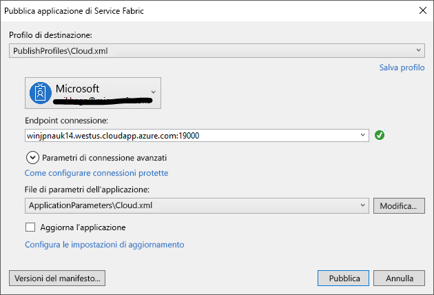

# <a name="deploy-an-application-tooa-party-cluster-in-azure"></a><span data-ttu-id="c941b-103">Distribuire un tooa applicazione Cluster di terze parti in Azure</span><span class="sxs-lookup"><span data-stu-id="c941b-103">Deploy an application tooa Party Cluster in Azure</span></span>
<span data-ttu-id="c941b-104">In questa esercitazione fa parte di due di una serie e illustra come toodeploy un tooa applicazione Azure Service Fabric Cluster di terze parti in Azure.</span><span class="sxs-lookup"><span data-stu-id="c941b-104">This tutorial is part two of a series and shows you how toodeploy an Azure Service Fabric application tooa Party Cluster in Azure.</span></span>

<span data-ttu-id="c941b-105">Nel parte due serie di esercitazioni hello, si apprenderà come:</span><span class="sxs-lookup"><span data-stu-id="c941b-105">In part two of hello tutorial series, you learn how to:</span></span>
> [!div class="checklist"]
> * <span data-ttu-id="c941b-106">Distribuire un cluster remoto tooa applicazione con Visual Studio</span><span class="sxs-lookup"><span data-stu-id="c941b-106">Deploy an application tooa remote cluster using Visual Studio</span></span>
> * <span data-ttu-id="c941b-107">Rimuovere un'applicazione da un cluster usando Service Fabric Explorer</span><span class="sxs-lookup"><span data-stu-id="c941b-107">Remove an application from a cluster using Service Fabric Explorer</span></span>

<span data-ttu-id="c941b-108">In questa serie di esercitazioni si apprenderà come:</span><span class="sxs-lookup"><span data-stu-id="c941b-108">In this tutorial series you learn how to:</span></span>
> [!div class="checklist"]
> * [<span data-ttu-id="c941b-109">Creare un'applicazione di Service Fabric .NET</span><span class="sxs-lookup"><span data-stu-id="c941b-109">Build a .NET Service Fabric application</span></span>](service-fabric-tutorial-create-dotnet-app.md)
> * <span data-ttu-id="c941b-110">Distribuire hello applicazione tooa remota del cluster</span><span class="sxs-lookup"><span data-stu-id="c941b-110">Deploy hello application tooa remote cluster</span></span>
> * [<span data-ttu-id="c941b-111">Configurare l'integrazione continua e la distribuzione continua usando Visual Studio Team Services</span><span class="sxs-lookup"><span data-stu-id="c941b-111">Configure CI/CD using Visual Studio Team Services</span></span>](service-fabric-tutorial-deploy-app-with-cicd-vsts.md)

## <a name="prerequisites"></a><span data-ttu-id="c941b-112">Prerequisiti</span><span class="sxs-lookup"><span data-stu-id="c941b-112">Prerequisites</span></span>
<span data-ttu-id="c941b-113">Prima di iniziare questa esercitazione:</span><span class="sxs-lookup"><span data-stu-id="c941b-113">Before you begin this tutorial:</span></span>
- <span data-ttu-id="c941b-114">Se non si ha una sottoscrizione di Azure, creare un [account gratuito](https://azure.microsoft.com/free/?WT.mc_id=A261C142F)</span><span class="sxs-lookup"><span data-stu-id="c941b-114">If you don't have an Azure subscription, create a [free account](https://azure.microsoft.com/free/?WT.mc_id=A261C142F)</span></span>
- <span data-ttu-id="c941b-115">[Installare Visual Studio 2017](https://www.visualstudio.com/) e installare hello **lo sviluppo di Azure** e **sviluppo web ASP.NET e** i carichi di lavoro.</span><span class="sxs-lookup"><span data-stu-id="c941b-115">[Install Visual Studio 2017](https://www.visualstudio.com/) and install hello **Azure development** and **ASP.NET and web development** workloads.</span></span>
- [<span data-ttu-id="c941b-116">Installare hello Service Fabric SDK</span><span class="sxs-lookup"><span data-stu-id="c941b-116">Install hello Service Fabric SDK</span></span>](service-fabric-get-started.md)

## <a name="download-hello-voting-sample-application"></a><span data-ttu-id="c941b-117">Scaricare l'applicazione di esempio hello voto</span><span class="sxs-lookup"><span data-stu-id="c941b-117">Download hello Voting sample application</span></span>
<span data-ttu-id="c941b-118">Se si non compila l'applicazione di esempio hello voto [parte 1 di questa serie di esercitazioni](service-fabric-tutorial-create-dotnet-app.md), è possibile scaricarlo.</span><span class="sxs-lookup"><span data-stu-id="c941b-118">If you did not build hello Voting sample application in [part one of this tutorial series](service-fabric-tutorial-create-dotnet-app.md), you can download it.</span></span> <span data-ttu-id="c941b-119">In una finestra di comando, eseguire hello successivo comando tooclone hello esempio app repository tooyour computer locale.</span><span class="sxs-lookup"><span data-stu-id="c941b-119">In a command window, run hello following command tooclone hello sample app repository tooyour local machine.</span></span>

```
git clone https://github.com/Azure-Samples/service-fabric-dotnet-quickstart
```

## <a name="set-up-a-party-cluster"></a><span data-ttu-id="c941b-120">Configurare un cluster di entità</span><span class="sxs-lookup"><span data-stu-id="c941b-120">Set up a Party Cluster</span></span>
<span data-ttu-id="c941b-121">Cluster di terze parti sono i cluster di Service Fabric gratuito, periodo di tempo limitato ospitati in Azure e vengono eseguiti dal team di Service Fabric hello in tutti gli utenti possono distribuire le applicazioni e informazioni sulla piattaforma hello.</span><span class="sxs-lookup"><span data-stu-id="c941b-121">Party clusters are free, limited-time Service Fabric clusters hosted on Azure and run by hello Service Fabric team where anyone can deploy applications and learn about hello platform.</span></span> <span data-ttu-id="c941b-122">Gratuitamente.</span><span class="sxs-lookup"><span data-stu-id="c941b-122">For free!</span></span>

<span data-ttu-id="c941b-123">tooget accesso tooa Cluster di terze parti, visitare il sito di toothis: http://aka.ms/tryservicefabric e seguire hello istruzioni tooget tooa cluster di accesso.</span><span class="sxs-lookup"><span data-stu-id="c941b-123">tooget access tooa Party Cluster, browse toothis site: http://aka.ms/tryservicefabric and follow hello instructions tooget access tooa cluster.</span></span> <span data-ttu-id="c941b-124">È necessario un Facebook o GitHub account tooget accesso tooa Cluster di terze parti.</span><span class="sxs-lookup"><span data-stu-id="c941b-124">You need a Facebook or GitHub account tooget access tooa Party Cluster.</span></span>

> [!NOTE]
> <span data-ttu-id="c941b-125">Cluster di terze parti non sono protetti in modo le applicazioni e tutti i dati inseriti in essi contenuti possono essere tooothers visibile.</span><span class="sxs-lookup"><span data-stu-id="c941b-125">Party clusters are not secured, so your applications and any data you put in them may be visible tooothers.</span></span> <span data-ttu-id="c941b-126">Non eseguire la distribuzione di qualsiasi elemento non si desidera che altri toosee.</span><span class="sxs-lookup"><span data-stu-id="c941b-126">Don't deploy anything you don't want others toosee.</span></span> <span data-ttu-id="c941b-127">Essere tooread che le condizioni di utilizzo per tutti i dettagli di hello.</span><span class="sxs-lookup"><span data-stu-id="c941b-127">Be sure tooread over our Terms of Use for all hello details.</span></span>

## <a name="configure-hello-listening-port"></a><span data-ttu-id="c941b-128">Configurare una porta di attesa hello</span><span class="sxs-lookup"><span data-stu-id="c941b-128">Configure hello listening port</span></span>
<span data-ttu-id="c941b-129">Quando viene creato hello servizio front-end VotingWeb, Visual Studio seleziona casualmente una porta per toolisten servizio hello in.</span><span class="sxs-lookup"><span data-stu-id="c941b-129">When hello VotingWeb front-end service is created, Visual Studio randomly selects a port for hello service toolisten on.</span></span>  <span data-ttu-id="c941b-130">Hello VotingWeb servizio agisce come front-end per l'applicazione hello e accetta il traffico esterno, andiamo associare tooa tale servizio predefinito e porta conosciuto.</span><span class="sxs-lookup"><span data-stu-id="c941b-130">hello VotingWeb service acts as hello front-end for this application and accepts external traffic, so let's bind that service tooa fixed and well-know port.</span></span> <span data-ttu-id="c941b-131">In Esplora soluzioni aprire *VotingWeb/PackageRoot/ServiceManifest.xml*.</span><span class="sxs-lookup"><span data-stu-id="c941b-131">In Solution Explorer, open  *VotingWeb/PackageRoot/ServiceManifest.xml*.</span></span>  <span data-ttu-id="c941b-132">Trovare hello **Endpoint** risorsa hello **risorse** sezione e modificare hello **porta** too80 valore.</span><span class="sxs-lookup"><span data-stu-id="c941b-132">Find hello **Endpoint** resource in hello **Resources** section and change hello **Port** value too80.</span></span>

```xml
<Resources>
    <Endpoints>
      <!-- This endpoint is used by hello communication listener tooobtain hello port on which too
           listen. Please note that if your service is partitioned, this port is shared with 
           replicas of different partitions that are placed in your code. -->
      <Endpoint Protocol="http" Name="ServiceEndpoint" Type="Input" Port="80" />
    </Endpoints>
  </Resources>
```

<span data-ttu-id="c941b-133">Aggiornare anche il valore della proprietà URL dell'applicazione hello nel progetto di voto hello in modo da un web browser apre la porta corretta toohello quando si esegue il debug utilizzando 'F5'.</span><span class="sxs-lookup"><span data-stu-id="c941b-133">Also update hello Application URL property value in hello Voting project so a web browser opens toohello correct port when you debug using 'F5'.</span></span>  <span data-ttu-id="c941b-134">In Esplora soluzioni selezionare hello **voto** hello progetto e aggiornare **URL applicazione** proprietà.</span><span class="sxs-lookup"><span data-stu-id="c941b-134">In Solution Explorer, select hello **Voting** project and update hello **Application URL** property.</span></span>


## <a name="deploy-hello-app-toohello-azure"></a><span data-ttu-id="c941b-136">Distribuire toohello app hello Azure</span><span class="sxs-lookup"><span data-stu-id="c941b-136">Deploy hello app toohello Azure</span></span>
<span data-ttu-id="c941b-137">Ora che un'applicazione hello è pronta, è possibile distribuire toohello Cluster di terze parti direttamente da Visual Studio.</span><span class="sxs-lookup"><span data-stu-id="c941b-137">Now that hello application is ready, you can deploy it toohello Party Cluster direct from Visual Studio.</span></span>

1. <span data-ttu-id="c941b-138">Fare doppio clic su **voto** in hello Esplora soluzioni e scegliere **pubblica**.</span><span class="sxs-lookup"><span data-stu-id="c941b-138">Right-click **Voting** in hello Solution Explorer and choose **Publish**.</span></span>

    

2. <span data-ttu-id="c941b-140">Digitare hello Endpoint della connessione di hello Cluster di terze parti in hello **Endpoint della connessione** campo e fare clic su **pubblica**.</span><span class="sxs-lookup"><span data-stu-id="c941b-140">Type in hello Connection Endpoint of hello Party Cluster in hello **Connection Endpoint** field and click **Publish**.</span></span>

    <span data-ttu-id="c941b-141">Una volta pubblicare hello è completata, dovrebbe essere in grado di toosend un'applicazione toohello richiesta tramite un browser.</span><span class="sxs-lookup"><span data-stu-id="c941b-141">Once hello publish has finished, you should be able toosend a request toohello application via a browser.</span></span>

3. <span data-ttu-id="c941b-142">Aprire preferito browser e digitare l'indirizzo del cluster hello (endpoint hello connessione senza le informazioni sulla porta hello - ad esempio, win1kw5649s.westus.cloudapp.azure.com).</span><span class="sxs-lookup"><span data-stu-id="c941b-142">Open you preferred browser and type in hello cluster address (hello connection endpoint without hello port information - for example, win1kw5649s.westus.cloudapp.azure.com).</span></span>

    <span data-ttu-id="c941b-143">Dovrebbe essere hello stesso risultato, come specificato durante l'esecuzione di un'applicazione hello in locale.</span><span class="sxs-lookup"><span data-stu-id="c941b-143">You should now see hello same result as you saw when running hello application locally.</span></span>

    

## <a name="remove-hello-application-from-a-cluster-using-service-fabric-explorer"></a><span data-ttu-id="c941b-145">Rimuovere un'applicazione hello da un cluster usando Service Fabric Explorer</span><span class="sxs-lookup"><span data-stu-id="c941b-145">Remove hello application from a cluster using Service Fabric Explorer</span></span>
<span data-ttu-id="c941b-146">Service Fabric Explorer è un tooexplore di interfaccia utente grafica e gestire le applicazioni in un cluster di Service Fabric.</span><span class="sxs-lookup"><span data-stu-id="c941b-146">Service Fabric Explorer is a graphical user interface tooexplore and manage applications in a Service Fabric cluster.</span></span>

<span data-ttu-id="c941b-147">applicazione hello tooremove da hello Cluster di terze parti:</span><span class="sxs-lookup"><span data-stu-id="c941b-147">tooremove hello application from hello Party Cluster:</span></span>

1. <span data-ttu-id="c941b-148">Sfoglia toohello Service Fabric Explorer, usando il collegamento di hello fornito dalla pagina di iscrizione di hello Cluster di terze parti.</span><span class="sxs-lookup"><span data-stu-id="c941b-148">Browse toohello Service Fabric Explorer, using hello link provided by hello Party Cluster sign-up page.</span></span> <span data-ttu-id="c941b-149">Ad esempio, http://win1kw5649s.westus.cloudapp.azure.com:19080/Explorer/index.html.</span><span class="sxs-lookup"><span data-stu-id="c941b-149">For example, http://win1kw5649s.westus.cloudapp.azure.com:19080/Explorer/index.html.</span></span>

2. <span data-ttu-id="c941b-150">In Service Fabric Explorer, passare toohello **fabric://Voting** nodo di treeview hello sul lato sinistro di hello.</span><span class="sxs-lookup"><span data-stu-id="c941b-150">In Service Fabric Explorer, navigate toohello **fabric://Voting** node in hello treeview on hello left-hand side.</span></span>

3. <span data-ttu-id="c941b-151">Fare clic su hello **azione** pulsante hello destro **Essentials** riquadro, quindi scegliere **Elimina applicazione**.</span><span class="sxs-lookup"><span data-stu-id="c941b-151">Click hello **Action** button in hello right-hand **Essentials** pane, and choose **Delete Application**.</span></span> <span data-ttu-id="c941b-152">Conferma eliminazione istanza dell'applicazione hello, che consente di rimuovere l'applicazione in esecuzione nel cluster hello istanza hello.</span><span class="sxs-lookup"><span data-stu-id="c941b-152">Confirm deleting hello application instance, which removes hello instance of our application running in hello cluster.</span></span>


## <a name="remove-hello-application-type-from-a-cluster-using-service-fabric-explorer"></a><span data-ttu-id="c941b-154">Rimuovere il tipo di applicazione hello da un cluster usando Service Fabric Explorer</span><span class="sxs-lookup"><span data-stu-id="c941b-154">Remove hello application type from a cluster using Service Fabric Explorer</span></span>
<span data-ttu-id="c941b-155">Le applicazioni vengono distribuite come tipi di applicazioni in un cluster di Service Fabric, che consente di toohave più istanze e versioni di un'applicazione hello in esecuzione all'interno di cluster hello.</span><span class="sxs-lookup"><span data-stu-id="c941b-155">Applications are deployed as application types in a Service Fabric cluster, which enables you toohave multiple instances and versions of hello application running within hello cluster.</span></span> <span data-ttu-id="c941b-156">Dopo la rimozione di hello in esecuzione l'istanza dell'applicazione, è anche possibile rimuovere tipo hello, pulizia hello toocomplete della distribuzione hello.</span><span class="sxs-lookup"><span data-stu-id="c941b-156">After having removed hello running instance of our application, we can also remove hello type, toocomplete hello cleanup of hello deployment.</span></span>

<span data-ttu-id="c941b-157">Per ulteriori informazioni sul modello di applicazione hello nell'infrastruttura del servizio, vedere [un'applicazione nell'infrastruttura del servizio del modello](service-fabric-application-model.md).</span><span class="sxs-lookup"><span data-stu-id="c941b-157">For more information about hello application model in Service Fabric, see [Model an application in Service Fabric](service-fabric-application-model.md).</span></span>

1. <span data-ttu-id="c941b-158">Passare toohello **VotingType** nodo di treeview hello.</span><span class="sxs-lookup"><span data-stu-id="c941b-158">Navigate toohello **VotingType** node in hello treeview.</span></span>

2. <span data-ttu-id="c941b-159">Fare clic su hello **azione** pulsante hello destro **Essentials** riquadro e scegliere **tipo annullamento del provisioning**.</span><span class="sxs-lookup"><span data-stu-id="c941b-159">Click hello **Action** button in hello right-hand **Essentials** pane, and choose **Unprovision Type**.</span></span> <span data-ttu-id="c941b-160">Confermare l'annullamento del provisioning del tipo di applicazione hello.</span><span class="sxs-lookup"><span data-stu-id="c941b-160">Confirm unprovisioning hello application type.</span></span>


<span data-ttu-id="c941b-162">Questo conclude l'esercitazione hello.</span><span class="sxs-lookup"><span data-stu-id="c941b-162">This concludes hello tutorial.</span></span>

## <a name="next-steps"></a><span data-ttu-id="c941b-163">Passaggi successivi</span><span class="sxs-lookup"><span data-stu-id="c941b-163">Next steps</span></span>
<span data-ttu-id="c941b-164">In questa esercitazione si è appreso come:</span><span class="sxs-lookup"><span data-stu-id="c941b-164">In this tutorial, you learned how to:</span></span>

> [!div class="checklist"]
> * <span data-ttu-id="c941b-165">Distribuire un cluster remoto tooa applicazione con Visual Studio</span><span class="sxs-lookup"><span data-stu-id="c941b-165">Deploy an application tooa remote cluster using Visual Studio</span></span>
> * <span data-ttu-id="c941b-166">Rimuovere un'applicazione da un cluster usando Service Fabric Explorer</span><span class="sxs-lookup"><span data-stu-id="c941b-166">Remove an application from a cluster using Service Fabric Explorer</span></span>

<span data-ttu-id="c941b-167">Esercitazione successiva toohello avanzate:</span><span class="sxs-lookup"><span data-stu-id="c941b-167">Advance toohello next tutorial:</span></span>
> [!div class="nextstepaction"]
> [<span data-ttu-id="c941b-168">Impostare l'integrazione continua usando Visual Studio Team Services</span><span class="sxs-lookup"><span data-stu-id="c941b-168">Set up continuous integration using Visual Studio Team Services</span></span>](service-fabric-tutorial-deploy-app-with-cicd-vsts.md)