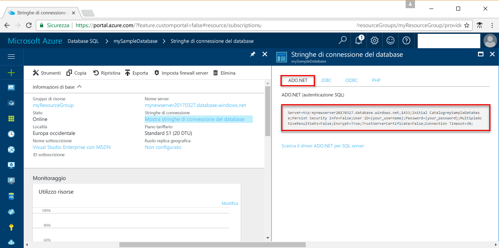

# <a name="use-net-core-c-tooquery-an-azure-sql-database"></a>Utilizzare .NET Core (c#) tooquery un database SQL di Azure

Questa esercitazione introduttiva illustra come toouse [.NET Core](https://www.microsoft.com/net/) in Linux/Windows/macOS toocreate c# programma tooconnect tooan Azure SQL database e utilizzare dati tooquery di istruzioni Transact-SQL.

## <a name="prerequisites"></a>Prerequisiti

Questo rapido toocomplete esercitazione per l'avvio, assicurarsi di avere seguito hello:

- un database SQL di Azure. Questa Guida introduttiva utilizza risorse di hello create in una di queste guide introduttive: 

   - [Creare un database: portale](sql-database-get-started-portal.md)
   - [Creare un database: interfaccia della riga di comando](sql-database-get-started-cli.md)
   - [Creare un database: PowerShell](sql-database-get-started-powershell.md)

- Oggetto [regola del firewall a livello di server](sql-database-get-started-portal.md#create-a-server-level-firewall-rule) per l'indirizzo IP pubblico hello del computer hello è utilizzare per questa esercitazione introduttiva.
- Avere installato [.NET Core per il sistema operativo](https://www.microsoft.com/net/core). 

## <a name="sql-server-connection-information"></a>Informazioni di connessione SQL Server

Ottenere il database di SQL Azure toohello hello connessione le informazioni necessarie tooconnect. Sarà necessario hello nome completo del server, nome del database e le informazioni di accesso nelle procedure successive hello.

1. Accedi toohello [portale di Azure](https://portal.azure.com/).
2. Selezionare **database SQL** dal menu a sinistra di hello, scegliere il database in hello **database SQL** pagina. 
3. In hello **Panoramica** pagina per il database, revisione hello nome completo del server come illustrato nella seguente immagine hello. È possibile passare il mouse su toobring nome di server hello backup hello **fare clic su toocopy** opzione. 

    

4. Se si dimenticano le informazioni di accesso del server Database SQL di Azure, passare toohello Database di SQL server pagina tooview hello admin nome del server. Se necessario, è possibile reimpostare la password di hello.

5. Fare clic su **Mostra stringhe di connessione del database**.

6. Hello revisione completa **ADO.NET** stringa di connessione.

    

> [!IMPORTANT]
> Sul posto per l'indirizzo IP pubblico hello del computer hello in cui si esegue questa esercitazione, è necessario disporre una regola del firewall. Se in un computer diverso o di un diverso indirizzo IP pubblico, creare un [regola firewall di livello server utilizzando il portale di Azure di hello](sql-database-get-started-portal.md#create-a-server-level-firewall-rule). 
>
  
## <a name="create-a-new-net-project"></a>Creare un nuovo progetto .NET

1. Aprire un prompt dei comandi e creare una cartella denominata *sqltest*. Esplorazione delle cartelle toohello è creare ed eseguire hello comando seguente:

    ```
    dotnet new console
    ```

2. Aprire ***sqltest.csproj*** con un editor di testo e aggiungere SqlClient come dipendenza utilizzando hello seguente codice:

    ```xml
    <ItemGroup>
        <PackageReference Include="System.Data.SqlClient" Version="4.3.0" />
    </ItemGroup>
    ```

## <a name="insert-code-tooquery-sql-database"></a>Inserire codice tooquery SQL database

1. Nell'ambiente di sviluppo o nell'editor di testo preferito aprire **Program.cs**.

2. Sostituire il contenuto di hello con hello seguente di codice e aggiungere hello valori appropriati per il server, database, l'utente e password.

```csharp
using System;
using System.Data.SqlClient;
using System.Text;

namespace sqltest
{
    class Program
    {
        static void Main(string[] args)
        {
            try 
            { 
                SqlConnectionStringBuilder builder = new SqlConnectionStringBuilder();
                builder.DataSource = "your_server.database.windows.net"; 
                builder.UserID = "your_user";            
                builder.Password = "your_password";     
                builder.InitialCatalog = "your_database";

                using (SqlConnection connection = new SqlConnection(builder.ConnectionString))
                {
                    Console.WriteLine("\nQuery data example:");
                    Console.WriteLine("=========================================\n");
                    
                    connection.Open();       
                    StringBuilder sb = new StringBuilder();
                    sb.Append("SELECT TOP 20 pc.Name as CategoryName, p.name as ProductName ");
                    sb.Append("FROM [SalesLT].[ProductCategory] pc ");
                    sb.Append("JOIN [SalesLT].[Product] p ");
                    sb.Append("ON pc.productcategoryid = p.productcategoryid;");
                    String sql = sb.ToString();

                    using (SqlCommand command = new SqlCommand(sql, connection))
                    {
                        using (SqlDataReader reader = command.ExecuteReader())
                        {
                            while (reader.Read())
                            {
                                Console.WriteLine("{0} {1}", reader.GetString(0), reader.GetString(1));
                            }
                        }
                    }                    
                }
            }
            catch (SqlException e)
            {
                Console.WriteLine(e.ToString());
            }
            Console.ReadLine();
        }
    }
}
```

## <a name="run-hello-code"></a>Eseguire il codice hello

1. Al prompt dei comandi di hello, eseguire hello seguenti comandi:

   ```csharp
   dotnet restore
   dotnet run
   ```

2. Verificare che i 20 righe hello superiore vengono restituite e chiudere la finestra dell'applicazione hello.


## <a name="next-steps"></a>Passaggi successivi

- [Introduzione a .NET Core in Windows o Linux/macOS tramite riga di comando hello](/dotnet/core/tutorials/using-with-xplat-cli).
- Informazioni su come troppo[connettersi ed eseguire query su un database SQL di Azure mediante hello .NET framework e Visual Studio](sql-database-connect-query-dotnet-visual-studio.md).  
- Informazioni su come troppo[progettazione di un database SQL di Azure utilizzando SSMS](sql-database-design-first-database.md) o [progettazione di un database SQL di Azure usando .NET](sql-database-design-first-database-csharp.md).
- Per altre informazioni su .NET, vedere la [documentazione di .NET](https://docs.microsoft.com/dotnet/).
