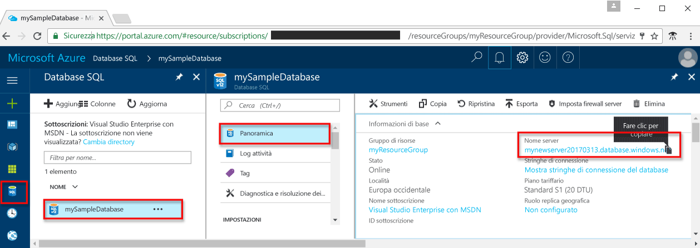
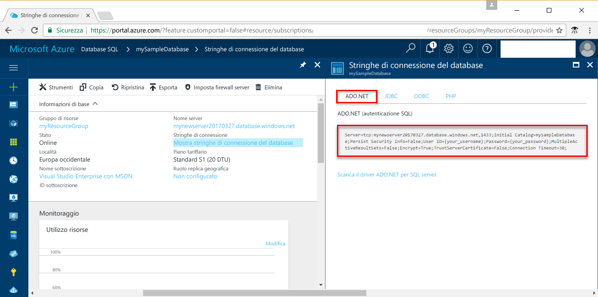

# <a name="use-net-c-with-visual-studio-to-connect-and-query-an-azure-sql-database"></a><span data-ttu-id="1b008-103">Usare .NET (C#) con Visual Studio Code per connettersi a un database SQL ed eseguire query</span><span class="sxs-lookup"><span data-stu-id="1b008-103">Use .NET (C#) with Visual Studio to connect and query an Azure SQL database</span></span>

<span data-ttu-id="1b008-104">Questa esercitazione introduttiva illustra come usare [.NET Framework](https://www.microsoft.com/net/) per creare un programma C# con Visual Studio per connettersi a un database SQL di Azure e usare istruzioni Transact-SQL per eseguire query sui dati.</span><span class="sxs-lookup"><span data-stu-id="1b008-104">This quick start tutorial demonstrates how to use the [.NET framework](https://www.microsoft.com/net/) to create a C# program with Visual Studio to connect to an Azure SQL database and use Transact-SQL statements to query data.</span></span>

## <a name="prerequisites"></a><span data-ttu-id="1b008-105">Prerequisiti</span><span class="sxs-lookup"><span data-stu-id="1b008-105">Prerequisites</span></span>

<span data-ttu-id="1b008-106">Per completare questa esercitazione introduttiva, accertarsi di avere:</span><span class="sxs-lookup"><span data-stu-id="1b008-106">To complete this quick start tutorial, make sure you have the following:</span></span>

- <span data-ttu-id="1b008-107">un database SQL di Azure.</span><span class="sxs-lookup"><span data-stu-id="1b008-107">An Azure SQL database.</span></span> <span data-ttu-id="1b008-108">Questa guida introduttiva usa le risorse create in una delle guide introduttive seguenti:</span><span class="sxs-lookup"><span data-stu-id="1b008-108">This quick start uses the resources created in one of these quick starts:</span></span> 

   - [<span data-ttu-id="1b008-109">Creare un database: portale</span><span class="sxs-lookup"><span data-stu-id="1b008-109">Create DB - Portal</span></span>](sql-database-get-started-portal.md)
   - [<span data-ttu-id="1b008-110">Creare un database: interfaccia della riga di comando</span><span class="sxs-lookup"><span data-stu-id="1b008-110">Create DB - CLI</span></span>](sql-database-get-started-cli.md)
   - [<span data-ttu-id="1b008-111">Creare un database: PowerShell</span><span class="sxs-lookup"><span data-stu-id="1b008-111">Create DB - PowerShell</span></span>](sql-database-get-started-powershell.md)

- <span data-ttu-id="1b008-112">Una [regola del firewall a livello di server](sql-database-get-started-portal.md#create-a-server-level-firewall-rule) per l'indirizzo IP pubblico del computer usato per questa esercitazione introduttiva.</span><span class="sxs-lookup"><span data-stu-id="1b008-112">A [server-level firewall rule](sql-database-get-started-portal.md#create-a-server-level-firewall-rule) for the public IP address of the computer you use for this quick start tutorial.</span></span>
- <span data-ttu-id="1b008-113">Un'installazione di [Visual Studio Community 2017, Visual Studio Professional 2017 o Visual Studio Enterprise 2017](https://www.visualstudio.com/downloads/).</span><span class="sxs-lookup"><span data-stu-id="1b008-113">An installation of [Visual Studio Community 2017, Visual Studio Professional 2017, or Visual Studio Enterprise 2017](https://www.visualstudio.com/downloads/).</span></span>

## <a name="sql-server-connection-information"></a><span data-ttu-id="1b008-114">Informazioni di connessione SQL Server</span><span class="sxs-lookup"><span data-stu-id="1b008-114">SQL server connection information</span></span>

<span data-ttu-id="1b008-115">Ottenere le informazioni di connessione necessarie per connettersi al database SQL di Azure.</span><span class="sxs-lookup"><span data-stu-id="1b008-115">Get the connection information needed to connect to the Azure SQL database.</span></span> <span data-ttu-id="1b008-116">Nelle procedure successive saranno necessari il nome completo del server, il nome del database e le informazioni di accesso.</span><span class="sxs-lookup"><span data-stu-id="1b008-116">You will need the fully qualified server name, database name, and login information in the next procedures.</span></span>

1. <span data-ttu-id="1b008-117">Accedere al [Portale di Azure](https://portal.azure.com/).</span><span class="sxs-lookup"><span data-stu-id="1b008-117">Log in to the [Azure portal](https://portal.azure.com/).</span></span>
2. <span data-ttu-id="1b008-118">Scegliere **Database SQL** dal menu a sinistra, quindi fare clic sul database nella pagina **Database SQL**.</span><span class="sxs-lookup"><span data-stu-id="1b008-118">Select **SQL Databases** from the left-hand menu, and click your database on the **SQL databases** page.</span></span> 
3. <span data-ttu-id="1b008-119">Nella pagina **Panoramica** per il database, verificare il nome completo del server, come mostrato nell'immagine seguente.</span><span class="sxs-lookup"><span data-stu-id="1b008-119">On the **Overview** page for your database, review the fully qualified server name as shown in the following image.</span></span> <span data-ttu-id="1b008-120">È possibile passare il puntatore sul nome del server per visualizzare l'opzione **Fare clic per copiare**.</span><span class="sxs-lookup"><span data-stu-id="1b008-120">You can hover over the server name to bring up the **Click to copy** option.</span></span> 

    

4. <span data-ttu-id="1b008-122">Se si dimenticano le informazioni di accesso per il server di database SQL di Azure, passare alla pagina del server di database SQL per visualizzare il nome dell'amministratore del server.</span><span class="sxs-lookup"><span data-stu-id="1b008-122">If you forget your Azure SQL Database server login information, navigate to the SQL Database server page to view the server admin name.</span></span> <span data-ttu-id="1b008-123">È possibile reimpostare la password, se necessario.</span><span class="sxs-lookup"><span data-stu-id="1b008-123">You can reset the password if necessary.</span></span>

5. <span data-ttu-id="1b008-124">Fare clic su **Mostra stringhe di connessione del database**.</span><span class="sxs-lookup"><span data-stu-id="1b008-124">Click **Show database connection strings**.</span></span>

6. <span data-ttu-id="1b008-125">Esaminare la stringa di connessione completa **ADO.NET**.</span><span class="sxs-lookup"><span data-stu-id="1b008-125">Review the complete **ADO.NET** connection string.</span></span>

    

> [!IMPORTANT]
> <span data-ttu-id="1b008-127">È necessario avere una regola del firewall impostata per l'indirizzo IP pubblico del computer su cui si esegue questa esercitazione.</span><span class="sxs-lookup"><span data-stu-id="1b008-127">You must have a firewall rule in place for the public IP address of the computer on which you perform this tutorial.</span></span> <span data-ttu-id="1b008-128">Se si usa un computer o un indirizzo IP pubblico diverso, creare una [regola del firewall a livello di server con il portale di Azure](sql-database-get-started-portal.md#create-a-server-level-firewall-rule).</span><span class="sxs-lookup"><span data-stu-id="1b008-128">If you are on a different computer or have a different public IP address, create a [server-level firewall rule using the Azure portal](sql-database-get-started-portal.md#create-a-server-level-firewall-rule).</span></span> 
>
  
## <a name="create-a-new-visual-studio-project"></a><span data-ttu-id="1b008-129">Creare un nuovo progetto di Visual Studio</span><span class="sxs-lookup"><span data-stu-id="1b008-129">Create a new Visual Studio project</span></span>

1. <span data-ttu-id="1b008-130">In Visual Studio scegliere **File**, **Nuovo**, **Progetto**.</span><span class="sxs-lookup"><span data-stu-id="1b008-130">In Visual Studio, choose **File**, **New**, **Project**.</span></span> 
2. <span data-ttu-id="1b008-131">Nella finestra di dialogo **Nuovo progetto** espandere **Visual C#**.</span><span class="sxs-lookup"><span data-stu-id="1b008-131">In the **New Project** dialog, and expand **Visual C#**.</span></span>
3. <span data-ttu-id="1b008-132">Selezionare **Applicazione console** e immettere *sqltest* come nome di progetto.</span><span class="sxs-lookup"><span data-stu-id="1b008-132">Select **Console App** and enter *sqltest* for the project name.</span></span>
4. <span data-ttu-id="1b008-133">Fare clic su **OK** per creare e aprire il nuovo progetto in Visual Studio</span><span class="sxs-lookup"><span data-stu-id="1b008-133">Click **OK** to create and open the new project in Visual Studio</span></span>
4. <span data-ttu-id="1b008-134">In Esplora soluzioni fare clic con il pulsante destro del mouse su **sqltest** e scegliere **Gestisci pacchetti NuGet**.</span><span class="sxs-lookup"><span data-stu-id="1b008-134">In Solution Explorer, right-click **sqltest** and click **Manage NuGet Packages**.</span></span> 
5. <span data-ttu-id="1b008-135">In **Sfoglia** cercare ```System.Data.SqlClient``` e, dopo averlo trovato, selezionarlo.</span><span class="sxs-lookup"><span data-stu-id="1b008-135">On the **Browse**, search for ```System.Data.SqlClient``` and, when found, select it.</span></span>
6. <span data-ttu-id="1b008-136">Nella pagina **System.Data.SqlClient** fare clic su **Installa**.</span><span class="sxs-lookup"><span data-stu-id="1b008-136">In the **System.Data.SqlClient** page, click **Install**.</span></span>
7. <span data-ttu-id="1b008-137">Al termine dell'installazione, rivedere le modifiche e quindi fare clic su **OK** per chiudere la finestra **Anteprima**.</span><span class="sxs-lookup"><span data-stu-id="1b008-137">When the install completes, review the changes and then click **OK** to close the **Preview** window.</span></span> 
8. <span data-ttu-id="1b008-138">Se viene visualizzata una finestra **Accettazione della licenza** fare clic su **Accetto**.</span><span class="sxs-lookup"><span data-stu-id="1b008-138">If a **License Acceptance** window appears, click **I Accept**.</span></span>

## <a name="insert-code-to-query-sql-database"></a><span data-ttu-id="1b008-139">Inserire il codice per eseguire query sul database SQL</span><span class="sxs-lookup"><span data-stu-id="1b008-139">Insert code to query SQL database</span></span>
1. <span data-ttu-id="1b008-140">Passare a (o aprire, se necessario) **Program.cs**</span><span class="sxs-lookup"><span data-stu-id="1b008-140">Switch to (or open if necessary) **Program.cs**</span></span>

2. <span data-ttu-id="1b008-141">Sostituire il contenuto di **Program.cs** con il codice seguente e aggiungere i valori appropriati per il server, il database, l'utente e la password.</span><span class="sxs-lookup"><span data-stu-id="1b008-141">Replace the contents of **Program.cs** with the following code and add the appropriate values for your server, database, user, and password.</span></span>

```csharp
using System;
using System.Data.SqlClient;
using System.Text;

namespace sqltest
{
    class Program
    {
        static void Main(string[] args)
        {
            try 
            { 
                SqlConnectionStringBuilder builder = new SqlConnectionStringBuilder();
                builder.DataSource = "your_server.database.windows.net"; 
                builder.UserID = "your_user";            
                builder.Password = "your_password";     
                builder.InitialCatalog = "your_database";

                using (SqlConnection connection = new SqlConnection(builder.ConnectionString))
                {
                    Console.WriteLine("\nQuery data example:");
                    Console.WriteLine("=========================================\n");
                    
                    connection.Open();       
                    StringBuilder sb = new StringBuilder();
                    sb.Append("SELECT TOP 20 pc.Name as CategoryName, p.name as ProductName ");
                    sb.Append("FROM [SalesLT].[ProductCategory] pc ");
                    sb.Append("JOIN [SalesLT].[Product] p ");
                    sb.Append("ON pc.productcategoryid = p.productcategoryid;");
                    String sql = sb.ToString();

                    using (SqlCommand command = new SqlCommand(sql, connection))
                    {
                        using (SqlDataReader reader = command.ExecuteReader())
                        {
                            while (reader.Read())
                            {
                                Console.WriteLine("{0} {1}", reader.GetString(0), reader.GetString(1));
                            }
                        }
                    }                    
                }
            }
            catch (SqlException e)
            {
                Console.WriteLine(e.ToString());
            }
            Console.ReadLine();
        }
    }
}
```

## <a name="run-the-code"></a><span data-ttu-id="1b008-142">Eseguire il codice</span><span class="sxs-lookup"><span data-stu-id="1b008-142">Run the code</span></span>

1. <span data-ttu-id="1b008-143">Premere **F5** per eseguire l'applicazione.</span><span class="sxs-lookup"><span data-stu-id="1b008-143">Press **F5** to run the application.</span></span>
2. <span data-ttu-id="1b008-144">Verificare che vengano restituite le prime 20 righe e quindi chiudere la finestra dell'applicazione.</span><span class="sxs-lookup"><span data-stu-id="1b008-144">Verify that the top 20 rows are returned and then close the application window.</span></span>

## <a name="next-steps"></a><span data-ttu-id="1b008-145">Passaggi successivi</span><span class="sxs-lookup"><span data-stu-id="1b008-145">Next steps</span></span>

- <span data-ttu-id="1b008-146">Informazioni su come [connettersi ed eseguire query su un database SQL di Azure usando .NET Core](sql-database-connect-query-dotnet-core.md) in Windows/Linux/macOS.</span><span class="sxs-lookup"><span data-stu-id="1b008-146">Learn how to [connect and query an Azure SQL database using .NET core](sql-database-connect-query-dotnet-core.md) on Windows/Linux/macOS.</span></span>  
- <span data-ttu-id="1b008-147">Informazioni su come [iniziare a usare .NET Core in Windows/Linux/macOS con la riga di comando](/dotnet/core/tutorials/using-with-xplat-cli).</span><span class="sxs-lookup"><span data-stu-id="1b008-147">Learn about [Getting started with .NET Core on Windows/Linux/macOS using the command line](/dotnet/core/tutorials/using-with-xplat-cli).</span></span>
- <span data-ttu-id="1b008-148">Informazioni su come [progettare il primo database SQL di Azure con SSMS](sql-database-design-first-database.md) o su come [progettare il primo database SQL di Azure con .NET](sql-database-design-first-database-csharp.md).</span><span class="sxs-lookup"><span data-stu-id="1b008-148">Learn how to [Design your first Azure SQL database using SSMS](sql-database-design-first-database.md) or [Design your first Azure SQL database using .NET](sql-database-design-first-database-csharp.md).</span></span>
- <span data-ttu-id="1b008-149">Per altre informazioni su .NET, vedere la [documentazione di .NET](https://docs.microsoft.com/dotnet/).</span><span class="sxs-lookup"><span data-stu-id="1b008-149">For more information about .NET, see [.NET documentation](https://docs.microsoft.com/dotnet/).</span></span>
