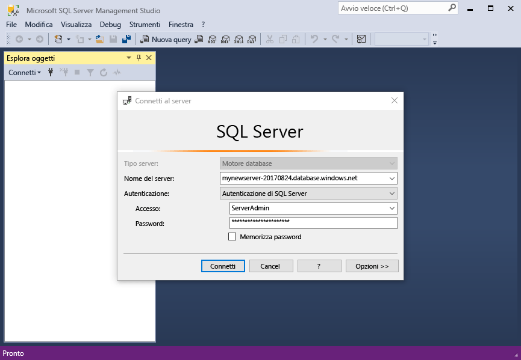
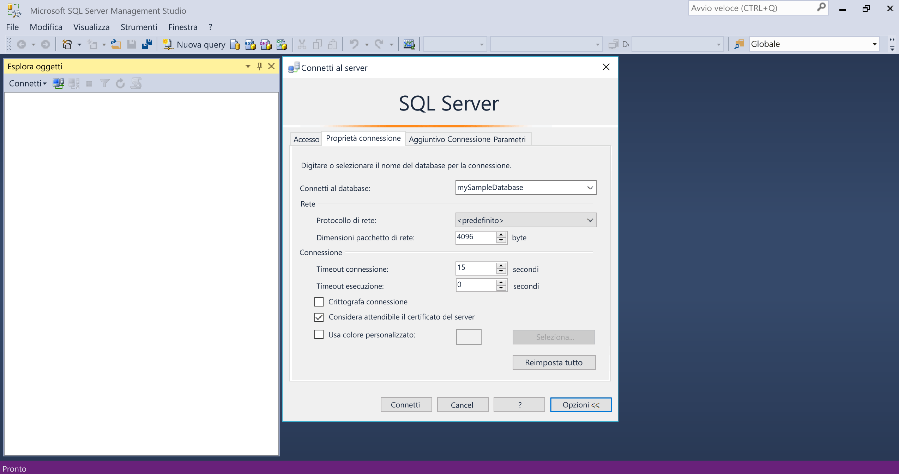
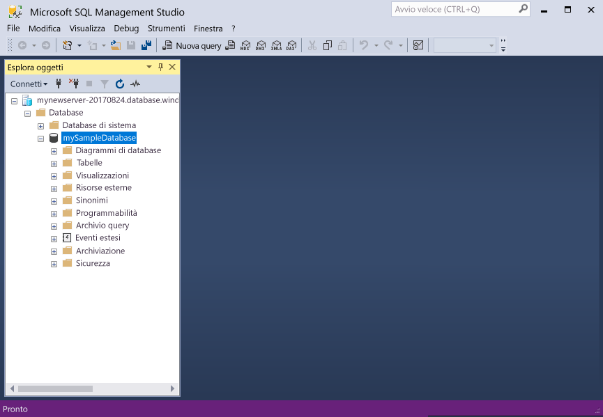
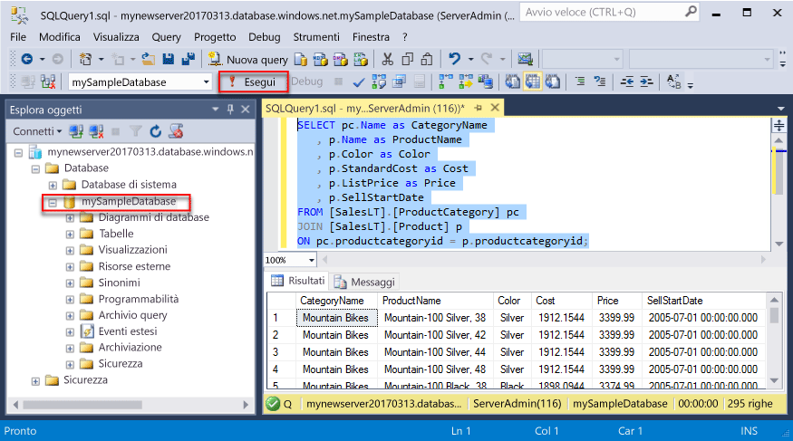
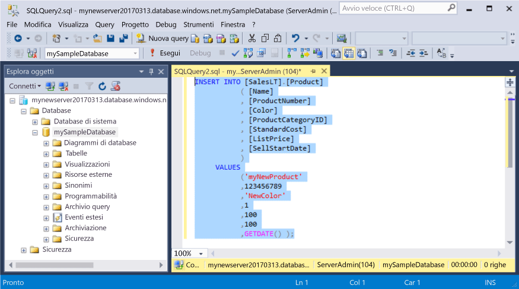
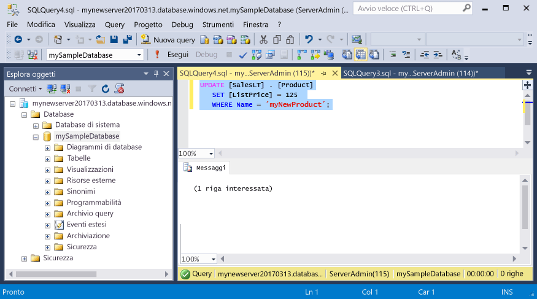
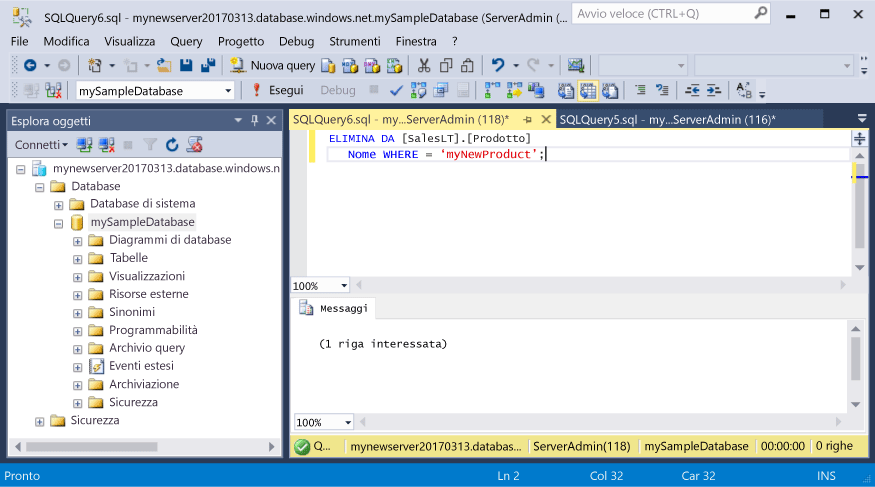

# <a name="azure-sql-database-use-sql-server-management-studio-to-connect-and-query-data"></a><span data-ttu-id="b30c0-105">Database SQL di Azure: usare SQL Server Management Studio per connettersi ed eseguire query sui dati</span><span class="sxs-lookup"><span data-stu-id="b30c0-105">Azure SQL Database: Use SQL Server Management Studio to connect and query data</span></span>

<span data-ttu-id="b30c0-106">[SQL Server Management Studio](https://msdn.microsoft.com/library/ms174173.aspx) (SSMS) è un ambiente integrato per la gestione di qualsiasi infrastruttura SQL, da SQL Server al database SQL per Microsoft Windows.</span><span class="sxs-lookup"><span data-stu-id="b30c0-106">[SQL Server Management Studio](https://msdn.microsoft.com/library/ms174173.aspx) (SSMS) is an integrated environment for managing any SQL infrastructure, from SQL Server to SQL Database for Microsoft Windows.</span></span> <span data-ttu-id="b30c0-107">Questa guida introduttiva illustra come usare SSMS per connettersi a un database SQL di Azure e quindi usare istruzioni Transact-SQL per eseguire query e inserire, aggiornare ed eliminare dati nel database.</span><span class="sxs-lookup"><span data-stu-id="b30c0-107">This quick start demonstrates how to use SSMS to connect to an Azure SQL database, and then use Transact-SQL statements to query, insert, update, and delete data in the database.</span></span> 

## <a name="prerequisites"></a><span data-ttu-id="b30c0-108">Prerequisiti</span><span class="sxs-lookup"><span data-stu-id="b30c0-108">Prerequisites</span></span>

<span data-ttu-id="b30c0-109">Questa guida introduttiva usa come punto di partenza le risorse create in una delle guide introduttive seguenti:</span><span class="sxs-lookup"><span data-stu-id="b30c0-109">This quick start uses as its starting point the resources created in one of these quick starts:</span></span>

- [<span data-ttu-id="b30c0-110">Creare un database: portale</span><span class="sxs-lookup"><span data-stu-id="b30c0-110">Create DB - Portal</span></span>](sql-database-get-started-portal.md)
- [<span data-ttu-id="b30c0-111">Creare un database: interfaccia della riga di comando</span><span class="sxs-lookup"><span data-stu-id="b30c0-111">Create DB - CLI</span></span>](sql-database-get-started-cli.md)
- [<span data-ttu-id="b30c0-112">Creare un database: PowerShell</span><span class="sxs-lookup"><span data-stu-id="b30c0-112">Create DB - PowerShell</span></span>](sql-database-get-started-powershell.md)

<span data-ttu-id="b30c0-113">Prima di iniziare, assicurarsi di avere installato la versione più recente di [SSMS](https://msdn.microsoft.com/library/mt238290.aspx).</span><span class="sxs-lookup"><span data-stu-id="b30c0-113">Before you start, make sure you have installed the newest version of [SSMS](https://msdn.microsoft.com/library/mt238290.aspx).</span></span> 

## <a name="sql-server-connection-information"></a><span data-ttu-id="b30c0-114">Informazioni di connessione SQL Server</span><span class="sxs-lookup"><span data-stu-id="b30c0-114">SQL server connection information</span></span>

<span data-ttu-id="b30c0-115">Ottenere le informazioni di connessione necessarie per connettersi al database SQL di Azure.</span><span class="sxs-lookup"><span data-stu-id="b30c0-115">Get the connection information needed to connect to the Azure SQL database.</span></span> <span data-ttu-id="b30c0-116">Nelle procedure successive saranno necessari il nome completo del server, il nome del database e le informazioni di accesso.</span><span class="sxs-lookup"><span data-stu-id="b30c0-116">You will need the fully qualified server name, database name, and login information in the next procedures.</span></span>

1. <span data-ttu-id="b30c0-117">Accedere al [Portale di Azure](https://portal.azure.com/).</span><span class="sxs-lookup"><span data-stu-id="b30c0-117">Log in to the [Azure portal](https://portal.azure.com/).</span></span>
2. <span data-ttu-id="b30c0-118">Scegliere **Database SQL** dal menu a sinistra, quindi fare clic sul database nella pagina **Database SQL**.</span><span class="sxs-lookup"><span data-stu-id="b30c0-118">Select **SQL Databases** from the left-hand menu, and click your database on the **SQL databases** page.</span></span> 
3. <span data-ttu-id="b30c0-119">Nella pagina **Panoramica** per il database, verificare il nome completo del server, come mostrato nell'immagine seguente.</span><span class="sxs-lookup"><span data-stu-id="b30c0-119">On the **Overview** page for your database, review the fully qualified server name as shown in the image below.</span></span> <span data-ttu-id="b30c0-120">È possibile passare il puntatore sul nome del server per visualizzare l'opzione **Fare clic per copiare**.</span><span class="sxs-lookup"><span data-stu-id="b30c0-120">You can hover over the server name to bring up the **Click to copy** option.</span></span>

    

4. <span data-ttu-id="b30c0-122">Se si sono dimenticate le informazioni di accesso per il server del database SQL di Azure, passare alla pagina del server del database SQL per visualizzare il nome dell'amministratore del server e, se necessario, reimpostare la password.</span><span class="sxs-lookup"><span data-stu-id="b30c0-122">If you have forgotten the login information for your Azure SQL Database server, navigate to the SQL Database server page to view the server admin name and, if necessary, reset the password.</span></span> 

## <a name="connect-to-your-database"></a><span data-ttu-id="b30c0-123">Connettersi al database</span><span class="sxs-lookup"><span data-stu-id="b30c0-123">Connect to your database</span></span>

<span data-ttu-id="b30c0-124">Usare SQL Server Management Studio per stabilire una connessione al server del database SQL di Azure.</span><span class="sxs-lookup"><span data-stu-id="b30c0-124">Use SQL Server Management Studio to establish a connection to your Azure SQL Database server.</span></span> 

> [!IMPORTANT]
> <span data-ttu-id="b30c0-125">Il server logico del database SQL di Azure è in ascolto sulla porta 1433.</span><span class="sxs-lookup"><span data-stu-id="b30c0-125">An Azure SQL Database logical server listens on port 1433.</span></span> <span data-ttu-id="b30c0-126">Se si sta tentando di connettersi a un server logico del database SQL di Azure dall'interno di un firewall aziendale, questa porta deve essere aperta.</span><span class="sxs-lookup"><span data-stu-id="b30c0-126">If you are attempting to connect to an Azure SQL Database logical server from within a corporate firewall, this port must be open in the corporate firewall for you to successfully connect.</span></span>
>

1. <span data-ttu-id="b30c0-127">Aprire SQL Server Management Studio.</span><span class="sxs-lookup"><span data-stu-id="b30c0-127">Open SQL Server Management Studio.</span></span>

2. <span data-ttu-id="b30c0-128">Nella finestra di dialogo **Connetti al server** immettere le informazioni seguenti:</span><span class="sxs-lookup"><span data-stu-id="b30c0-128">In the **Connect to Server** dialog box, enter the following information:</span></span>

   | <span data-ttu-id="b30c0-129">Impostazione</span><span class="sxs-lookup"><span data-stu-id="b30c0-129">Setting</span></span>       | <span data-ttu-id="b30c0-130">Valore consigliato</span><span class="sxs-lookup"><span data-stu-id="b30c0-130">Suggested value</span></span> | <span data-ttu-id="b30c0-131">Descrizione</span><span class="sxs-lookup"><span data-stu-id="b30c0-131">Description</span></span> | 
   | ------------ | ------------------ | ------------------------------------------------- | 
   | <span data-ttu-id="b30c0-132">**Tipo di server**</span><span class="sxs-lookup"><span data-stu-id="b30c0-132">**Server type**</span></span> | <span data-ttu-id="b30c0-133">Motore di database</span><span class="sxs-lookup"><span data-stu-id="b30c0-133">Database engine</span></span> | <span data-ttu-id="b30c0-134">Questo valore è obbligatorio.</span><span class="sxs-lookup"><span data-stu-id="b30c0-134">This value is required.</span></span> |
   | <span data-ttu-id="b30c0-135">**Server name** (Nome server)</span><span class="sxs-lookup"><span data-stu-id="b30c0-135">**Server name**</span></span> | <span data-ttu-id="b30c0-136">Nome completo del server</span><span class="sxs-lookup"><span data-stu-id="b30c0-136">The fully qualified server name</span></span> | <span data-ttu-id="b30c0-137">Il nome sarà simile a: **mynewserver20170313.database.windows.net**.</span><span class="sxs-lookup"><span data-stu-id="b30c0-137">The name should be something like this: **mynewserver20170313.database.windows.net**.</span></span> |
   | <span data-ttu-id="b30c0-138">**Autenticazione**</span><span class="sxs-lookup"><span data-stu-id="b30c0-138">**Authentication**</span></span> | <span data-ttu-id="b30c0-139">Autenticazione di SQL Server</span><span class="sxs-lookup"><span data-stu-id="b30c0-139">SQL Server Authentication</span></span> | <span data-ttu-id="b30c0-140">L'autenticazione SQL è il solo tipo di autenticazione configurato in questa esercitazione.</span><span class="sxs-lookup"><span data-stu-id="b30c0-140">SQL Authentication is the only authentication type that we have configured in this tutorial.</span></span> |
   | <span data-ttu-id="b30c0-141">**Accesso**</span><span class="sxs-lookup"><span data-stu-id="b30c0-141">**Login**</span></span> | <span data-ttu-id="b30c0-142">Account amministratore del server</span><span class="sxs-lookup"><span data-stu-id="b30c0-142">The server admin account</span></span> | <span data-ttu-id="b30c0-143">Si tratta dell'account specificato quando è stato creato il server.</span><span class="sxs-lookup"><span data-stu-id="b30c0-143">This is the account that you specified when you created the server.</span></span> |
   | <span data-ttu-id="b30c0-144">**Password**</span><span class="sxs-lookup"><span data-stu-id="b30c0-144">**Password**</span></span> | <span data-ttu-id="b30c0-145">Password per l'account amministratore del server</span><span class="sxs-lookup"><span data-stu-id="b30c0-145">The password for your server admin account</span></span> | <span data-ttu-id="b30c0-146">Si tratta della password specificata quando è stato creato il server.</span><span class="sxs-lookup"><span data-stu-id="b30c0-146">This is the password that you specified when you created the server.</span></span> |

     

3. <span data-ttu-id="b30c0-148">Fare clic su **Opzioni** nella finestra di dialogo **Connetti al server**.</span><span class="sxs-lookup"><span data-stu-id="b30c0-148">Click **Options** in the **Connect to server** dialog box.</span></span> <span data-ttu-id="b30c0-149">Nella sezione **Connetti al database** immettere **mySampleDatabase** per connettersi a tale database.</span><span class="sxs-lookup"><span data-stu-id="b30c0-149">In the **Connect to database** section, enter **mySampleDatabase** to connect to this database.</span></span>

     

4. <span data-ttu-id="b30c0-151">Fare clic su **Connetti**.</span><span class="sxs-lookup"><span data-stu-id="b30c0-151">Click **Connect**.</span></span> <span data-ttu-id="b30c0-152">La finestra Esplora oggetti viene visualizzata in SSMS.</span><span class="sxs-lookup"><span data-stu-id="b30c0-152">The Object Explorer window opens in SSMS.</span></span> 

     

5. <span data-ttu-id="b30c0-154">In Esplora oggetti espandere **Database** e quindi espandere **mySampleDatabase** per visualizzare gli oggetti disponibili nel database di esempio.</span><span class="sxs-lookup"><span data-stu-id="b30c0-154">In Object Explorer, expand **Databases** and then expand **mySampleDatabase** to view the objects in the sample database.</span></span>

## <a name="query-data"></a><span data-ttu-id="b30c0-155">Eseguire query sui dati</span><span class="sxs-lookup"><span data-stu-id="b30c0-155">Query data</span></span>

<span data-ttu-id="b30c0-156">Usare il codice seguente per eseguire una query per individuare i primi 20 prodotti per categoria usando l'istruzione [SELECT](https://msdn.microsoft.com/library/ms189499.aspx) di Transact-SQL.</span><span class="sxs-lookup"><span data-stu-id="b30c0-156">Use the following code to query for the top 20 products by category using the [SELECT](https://msdn.microsoft.com/library/ms189499.aspx) Transact-SQL statement.</span></span>

1. <span data-ttu-id="b30c0-157">In Esplora oggetti fare clic con il pulsante destro del mouse su **mySampleDatabase** e scegliere **Nuova query**.</span><span class="sxs-lookup"><span data-stu-id="b30c0-157">In Object Explorer, right-click **mySampleDatabase** and click **New Query**.</span></span> <span data-ttu-id="b30c0-158">Viene visualizzata una finestra di query vuota, connessa al database.</span><span class="sxs-lookup"><span data-stu-id="b30c0-158">A blank query window opens that is connected to your database.</span></span>
2. <span data-ttu-id="b30c0-159">Nella finestra delle query, immettere la query seguente:</span><span class="sxs-lookup"><span data-stu-id="b30c0-159">In the query window, enter the following query:</span></span>

   ```sql
   SELECT pc.Name as CategoryName, p.name as ProductName
   FROM [SalesLT].[ProductCategory] pc
   JOIN [SalesLT].[Product] p
   ON pc.productcategoryid = p.productcategoryid;
   ```

3. <span data-ttu-id="b30c0-160">Sulla barra degli strumenti fare clic su **Esegui** per recuperare dati dalle tabelle Product e ProductCategory.</span><span class="sxs-lookup"><span data-stu-id="b30c0-160">On the toolbar, click **Execute** to retrieve data from the Product and ProductCategory tables.</span></span>

    

## <a name="insert-data"></a><span data-ttu-id="b30c0-162">Inserire dati</span><span class="sxs-lookup"><span data-stu-id="b30c0-162">Insert data</span></span>

<span data-ttu-id="b30c0-163">Usare il codice seguente per inserire un nuovo prodotto nella tabella SalesLT.Product usando l'istruzione [INSERT](https://msdn.microsoft.com/library/ms174335.aspx) di Transact-SQL.</span><span class="sxs-lookup"><span data-stu-id="b30c0-163">Use the following code to insert a new product into the SalesLT.Product table using the [INSERT](https://msdn.microsoft.com/library/ms174335.aspx) Transact-SQL statement.</span></span>

1. <span data-ttu-id="b30c0-164">Nella finestra delle query, sostituire la query precedente con quella seguente:</span><span class="sxs-lookup"><span data-stu-id="b30c0-164">In the query window, replace the previous query with the following query:</span></span>

   ```sql
   INSERT INTO [SalesLT].[Product]
           ( [Name]
           , [ProductNumber]
           , [Color]
           , [ProductCategoryID]
           , [StandardCost]
           , [ListPrice]
           , [SellStartDate]
           )
     VALUES
           ('myNewProduct'
           ,123456789
           ,'NewColor'
           ,1
           ,100
           ,100
           ,GETDATE() );
   ```

2. <span data-ttu-id="b30c0-165">Sulla barra degli strumenti fare clic su **Esegui** per inserire una nuova riga nella tabella Product.</span><span class="sxs-lookup"><span data-stu-id="b30c0-165">On the toolbar, click **Execute**  to insert a new row in the Product table.</span></span>

    

## <a name="update-data"></a><span data-ttu-id="b30c0-166">Aggiornare i dati</span><span class="sxs-lookup"><span data-stu-id="b30c0-166">Update data</span></span>

<span data-ttu-id="b30c0-167">Usare il codice seguente per aggiornare il nuovo prodotto aggiunto in precedenza usando l'istruzione [UPDATE](https://msdn.microsoft.com/library/ms177523.aspx) di Transact-SQL.</span><span class="sxs-lookup"><span data-stu-id="b30c0-167">Use the following code to update the new product that you previously added using the [UPDATE](https://msdn.microsoft.com/library/ms177523.aspx) Transact-SQL statement.</span></span>

1. <span data-ttu-id="b30c0-168">Nella finestra delle query, sostituire la query precedente con quella seguente:</span><span class="sxs-lookup"><span data-stu-id="b30c0-168">In the query window, replace the previous query with the following query:</span></span>

   ```sql
   UPDATE [SalesLT].[Product]
   SET [ListPrice] = 125
   WHERE Name = 'myNewProduct';
   ```

2. <span data-ttu-id="b30c0-169">Sulla barra degli strumenti fare clic su **Esegui** per aggiornare la riga specificata nella tabella Product.</span><span class="sxs-lookup"><span data-stu-id="b30c0-169">On the toolbar, click **Execute** to update the specified row in the Product table.</span></span>

    

## <a name="delete-data"></a><span data-ttu-id="b30c0-170">Eliminare i dati</span><span class="sxs-lookup"><span data-stu-id="b30c0-170">Delete data</span></span>

<span data-ttu-id="b30c0-171">Usare il codice seguente per eliminare il nuovo prodotto aggiunto in precedenza usando l'istruzione [DELETE](https://msdn.microsoft.com/library/ms189835.aspx) di Transact-SQL.</span><span class="sxs-lookup"><span data-stu-id="b30c0-171">Use the following code to delete the new product that you previously added using the [DELETE](https://msdn.microsoft.com/library/ms189835.aspx) Transact-SQL statement.</span></span>

1. <span data-ttu-id="b30c0-172">Nella finestra delle query, sostituire la query precedente con quella seguente:</span><span class="sxs-lookup"><span data-stu-id="b30c0-172">In the query window, replace the previous query with the following query:</span></span>

   ```sql
   DELETE FROM [SalesLT].[Product]
   WHERE Name = 'myNewProduct';
   ```

2. <span data-ttu-id="b30c0-173">Sulla barra degli strumenti fare clic su **Esegui** per eliminare la riga specificata nella tabella Product.</span><span class="sxs-lookup"><span data-stu-id="b30c0-173">On the toolbar, click **Execute** to delete the specified row in the Product table.</span></span>

    

## <a name="next-steps"></a><span data-ttu-id="b30c0-174">Passaggi successivi</span><span class="sxs-lookup"><span data-stu-id="b30c0-174">Next steps</span></span>

- <span data-ttu-id="b30c0-175">Per altre informazioni sulla creazione e gestione di server e database con Transact-SQL, vedere [Informazioni su server e database del database SQL di Azure](sql-database-servers-databases.md).</span><span class="sxs-lookup"><span data-stu-id="b30c0-175">To learn about creating and managing servers and databases with Transact-SQL, see [Learn about Azure SQL Database servers and databases](sql-database-servers-databases.md).</span></span>
- <span data-ttu-id="b30c0-176">Per informazioni su SSMS, vedere [Usare SQL Server Management Studio](https://msdn.microsoft.com/library/ms174173.aspx).</span><span class="sxs-lookup"><span data-stu-id="b30c0-176">For information about SSMS, see [Use SQL Server Management Studio](https://msdn.microsoft.com/library/ms174173.aspx).</span></span>
- <span data-ttu-id="b30c0-177">Per connettersi ed eseguire query usando Visual Studio Code, vedere [Connettersi ed eseguire query con Visual Studio Code](sql-database-connect-query-vscode.md).</span><span class="sxs-lookup"><span data-stu-id="b30c0-177">To connect and query using Visual Studio Code, see [Connect and query with Visual Studio Code](sql-database-connect-query-vscode.md).</span></span>
- <span data-ttu-id="b30c0-178">Per connettersi ed eseguire query usando .NET, vedere [Connettersi ed eseguire query con .NET](sql-database-connect-query-dotnet.md).</span><span class="sxs-lookup"><span data-stu-id="b30c0-178">To connect and query using .NET, see [Connect and query with .NET](sql-database-connect-query-dotnet.md).</span></span>
- <span data-ttu-id="b30c0-179">Per connettersi ed eseguire query usando PHP, vedere [Connettersi ed eseguire query con PHP](sql-database-connect-query-php.md).</span><span class="sxs-lookup"><span data-stu-id="b30c0-179">To connect and query using PHP, see [Connect and query with PHP](sql-database-connect-query-php.md).</span></span>
- <span data-ttu-id="b30c0-180">Per connettersi ed eseguire query usando Node.js, vedere [Connettersi ed eseguire query con Node.js](sql-database-connect-query-nodejs.md).</span><span class="sxs-lookup"><span data-stu-id="b30c0-180">To connect and query using Node.js, see [Connect and query with Node.js](sql-database-connect-query-nodejs.md).</span></span>
- <span data-ttu-id="b30c0-181">Per connettersi ed eseguire query usando Java, vedere [Connettersi ed eseguire query con Java](sql-database-connect-query-java.md).</span><span class="sxs-lookup"><span data-stu-id="b30c0-181">To connect and query using Java, see [Connect and query with Java](sql-database-connect-query-java.md).</span></span>
- <span data-ttu-id="b30c0-182">Per connettersi ed eseguire query usando Python, vedere [Connettersi ed eseguire query con Python](sql-database-connect-query-python.md).</span><span class="sxs-lookup"><span data-stu-id="b30c0-182">To connect and query using Python, see [Connect and query with Python](sql-database-connect-query-python.md).</span></span>
- <span data-ttu-id="b30c0-183">Per connettersi ed eseguire query usando Ruby, vedere [Connettersi ed eseguire query con Ruby](sql-database-connect-query-ruby.md).</span><span class="sxs-lookup"><span data-stu-id="b30c0-183">To connect and query using Ruby, see [Connect and query with Ruby](sql-database-connect-query-ruby.md).</span></span>
