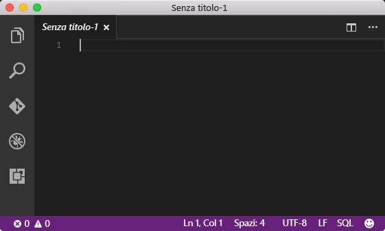
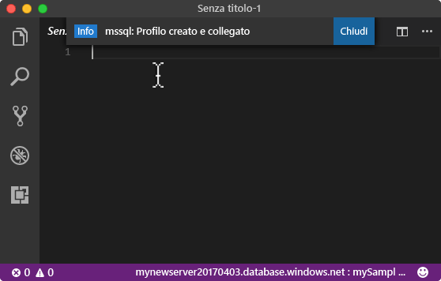
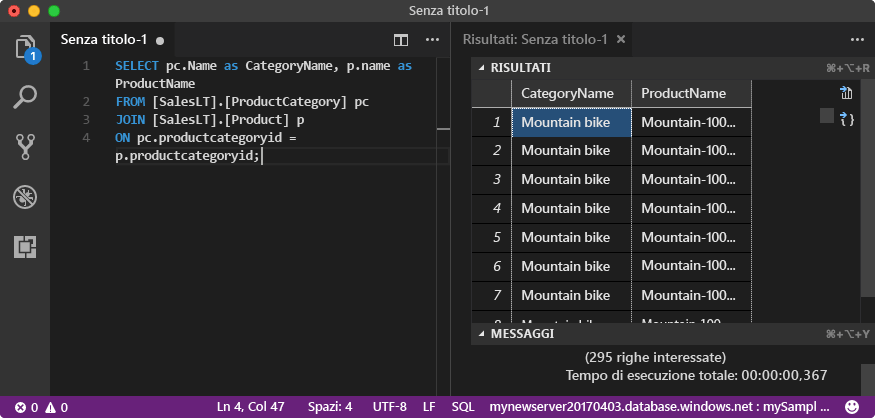

# <a name="azure-sql-database-use-visual-studio-code-tooconnect-and-query-data"></a><span data-ttu-id="bff3d-105">Database SQL di Azure: Tooconnect ed eseguire query sui dati di utilizzare Visual Studio Code</span><span class="sxs-lookup"><span data-stu-id="bff3d-105">Azure SQL Database: Use Visual Studio Code tooconnect and query data</span></span>

<span data-ttu-id="bff3d-106">[Codice di Visual Studio](https://code.visualstudio.com/docs) è un editor di codice con interfaccia grafica per Linux, macOS, e Windows che supporti le estensioni, tra cui hello [estensione mssql](https://aka.ms/mssql-marketplace) per le query di Microsoft SQL Server, Database SQL di Azure e SQL Data Warehouse.</span><span class="sxs-lookup"><span data-stu-id="bff3d-106">[Visual Studio Code](https://code.visualstudio.com/docs) is a graphical code editor for Linux, macOS, and Windows that supports extensions, including hello [mssql extension](https://aka.ms/mssql-marketplace) for querying Microsoft SQL Server, Azure SQL Database, and SQL Data Warehouse.</span></span> <span data-ttu-id="bff3d-107">Questa Guida introduttiva viene illustrato come database di SQL Azure tooan tooconnect codice di Visual Studio toouse e tooquery istruzioni di utilizzo di Transact-SQL, inserire, aggiornare ed eliminare dati nel database di hello.</span><span class="sxs-lookup"><span data-stu-id="bff3d-107">This quick start demonstrates how toouse Visual Studio Code tooconnect tooan Azure SQL database, and then use Transact-SQL statements tooquery, insert, update, and delete data in hello database.</span></span>

## <a name="prerequisites"></a><span data-ttu-id="bff3d-108">Prerequisiti</span><span class="sxs-lookup"><span data-stu-id="bff3d-108">Prerequisites</span></span>

<span data-ttu-id="bff3d-109">Questa Guida introduttiva viene utilizzata come le risorse di hello punto iniziale create in una di queste guide introduttive:</span><span class="sxs-lookup"><span data-stu-id="bff3d-109">This quick start uses as its starting point hello resources created in one of these quick starts:</span></span>

- [<span data-ttu-id="bff3d-110">Creare un database: portale</span><span class="sxs-lookup"><span data-stu-id="bff3d-110">Create DB - Portal</span></span>](sql-database-get-started-portal.md)
- [<span data-ttu-id="bff3d-111">Creare un database: interfaccia della riga di comando</span><span class="sxs-lookup"><span data-stu-id="bff3d-111">Create DB - CLI</span></span>](sql-database-get-started-cli.md)
- [<span data-ttu-id="bff3d-112">Creare un database: PowerShell</span><span class="sxs-lookup"><span data-stu-id="bff3d-112">Create DB - PowerShell</span></span>](sql-database-get-started-powershell.md)

<span data-ttu-id="bff3d-113">Prima di iniziare, verificare che è stata installata hello la versione più recente di [codice di Visual Studio](https://code.visualstudio.com/Download) e hello caricati [mssql estensione](https://aka.ms/mssql-marketplace).</span><span class="sxs-lookup"><span data-stu-id="bff3d-113">Before you start, make sure you have installed hello newest version of [Visual Studio Code](https://code.visualstudio.com/Download) and loaded hello [mssql extension](https://aka.ms/mssql-marketplace).</span></span> <span data-ttu-id="bff3d-114">Per istruzioni di installazione per l'estensione mssql hello, vedere [installare Visual Studio Code](https://docs.microsoft.com/sql/linux/sql-server-linux-develop-use-vscode#install-vs-code) e vedere [mssql per Visual Studio Code](https://marketplace.visualstudio.com/items?itemName=ms-mssql.mssql).</span><span class="sxs-lookup"><span data-stu-id="bff3d-114">For installation guidance for hello mssql extension, see [Install VS Code](https://docs.microsoft.com/sql/linux/sql-server-linux-develop-use-vscode#install-vs-code) and see [mssql for Visual Studio Code](https://marketplace.visualstudio.com/items?itemName=ms-mssql.mssql).</span></span> 

## <a name="configure-vs-code"></a><span data-ttu-id="bff3d-115">Configurare Visual Studio Code</span><span class="sxs-lookup"><span data-stu-id="bff3d-115">Configure VS Code</span></span> 

### <a name="mac-os"></a><span data-ttu-id="bff3d-116">**Mac OS**</span><span class="sxs-lookup"><span data-stu-id="bff3d-116">**Mac OS**</span></span>
<span data-ttu-id="bff3d-117">Per macOS, è necessario tooinstall OpenSSL ovvero prerequisiti per DotNet tale estensione mssql utilizzata.</span><span class="sxs-lookup"><span data-stu-id="bff3d-117">For macOS, you need tooinstall OpenSSL which is a prerequiste for DotNet Core that mssql extention uses.</span></span> <span data-ttu-id="bff3d-118">Aprire terminale e immettere i seguenti comandi tooinstall hello **brew** e **OpenSSL**.</span><span class="sxs-lookup"><span data-stu-id="bff3d-118">Open your terminal and enter hello following commands tooinstall **brew** and **OpenSSL**.</span></span> 

```bash
ruby -e "$(curl -fsSL https://raw.githubusercontent.com/Homebrew/install/master/install)"
brew update
brew install openssl
mkdir -p /usr/local/lib
ln -s /usr/local/opt/openssl/lib/libcrypto.1.0.0.dylib /usr/local/lib/
ln -s /usr/local/opt/openssl/lib/libssl.1.0.0.dylib /usr/local/lib/
```

### <a name="linux-ubuntu"></a><span data-ttu-id="bff3d-119">**Linux (Ubuntu)**</span><span class="sxs-lookup"><span data-stu-id="bff3d-119">**Linux (Ubuntu)**</span></span>

<span data-ttu-id="bff3d-120">Non è necessaria alcuna configurazione speciale.</span><span class="sxs-lookup"><span data-stu-id="bff3d-120">No special configuration needed.</span></span>

### <a name="windows"></a><span data-ttu-id="bff3d-121">**Windows**</span><span class="sxs-lookup"><span data-stu-id="bff3d-121">**Windows**</span></span>

<span data-ttu-id="bff3d-122">Non è necessaria alcuna configurazione speciale.</span><span class="sxs-lookup"><span data-stu-id="bff3d-122">No special configuration needed.</span></span>

## <a name="sql-server-connection-information"></a><span data-ttu-id="bff3d-123">Informazioni di connessione SQL Server</span><span class="sxs-lookup"><span data-stu-id="bff3d-123">SQL server connection information</span></span>

<span data-ttu-id="bff3d-124">Ottenere il database di SQL Azure toohello hello connessione le informazioni necessarie tooconnect.</span><span class="sxs-lookup"><span data-stu-id="bff3d-124">Get hello connection information needed tooconnect toohello Azure SQL database.</span></span> <span data-ttu-id="bff3d-125">Sarà necessario hello nome completo del server, nome del database e le informazioni di accesso nelle procedure successive hello.</span><span class="sxs-lookup"><span data-stu-id="bff3d-125">You will need hello fully qualified server name, database name, and login information in hello next procedures.</span></span>

1. <span data-ttu-id="bff3d-126">Accedi toohello [portale di Azure](https://portal.azure.com/).</span><span class="sxs-lookup"><span data-stu-id="bff3d-126">Log in toohello [Azure portal](https://portal.azure.com/).</span></span>
2. <span data-ttu-id="bff3d-127">Selezionare **database SQL** dal menu a sinistra di hello, scegliere il database in hello **database SQL** pagina.</span><span class="sxs-lookup"><span data-stu-id="bff3d-127">Select **SQL Databases** from hello left-hand menu, and click your database on hello **SQL databases** page.</span></span> 
3. <span data-ttu-id="bff3d-128">In hello **Panoramica** pagina per il database, revisione hello nome completo del server come illustrato nella seguente immagine hello.</span><span class="sxs-lookup"><span data-stu-id="bff3d-128">On hello **Overview** page for your database, review hello fully qualified server name as shown in hello following image.</span></span> <span data-ttu-id="bff3d-129">È possibile passare il mouse su toobring nome di server hello backup hello **fare clic su toocopy** opzione.</span><span class="sxs-lookup"><span data-stu-id="bff3d-129">You can hover over hello server name toobring up hello **Click toocopy** option.</span></span>

    

4. <span data-ttu-id="bff3d-131">Se si hanno dimenticato di informazioni di accesso hello del server di Database SQL di Azure, passare toohello Database di SQL server pagina tooview hello admin nome del server e, se necessario, reimpostare la password di hello.</span><span class="sxs-lookup"><span data-stu-id="bff3d-131">If you have forgotten hello login information for your Azure SQL Database server, navigate toohello SQL Database server page tooview hello server admin name and, if necessary, reset hello password.</span></span> 

## <a name="set-language-mode-toosql"></a><span data-ttu-id="bff3d-132">Set language modalità tooSQL</span><span class="sxs-lookup"><span data-stu-id="bff3d-132">Set language mode tooSQL</span></span>

<span data-ttu-id="bff3d-133">Impostare la modalità di linguaggio hello è troppo**SQL** in T-SQL IntelliSense e di comandi di Visual Studio Code tooenable mssql.</span><span class="sxs-lookup"><span data-stu-id="bff3d-133">Set hello language mode is set too**SQL** in Visual Studio Code tooenable mssql commands and T-SQL IntelliSense.</span></span>

1. <span data-ttu-id="bff3d-134">Aprire una nuova finestra di Visual Studio Code.</span><span class="sxs-lookup"><span data-stu-id="bff3d-134">Open a new Visual Studio Code window.</span></span> 

2. <span data-ttu-id="bff3d-135">Fare clic su **testo normale** in hello angolo inferiore destro della barra di stato hello.</span><span class="sxs-lookup"><span data-stu-id="bff3d-135">Click **Plain Text** in hello lower right-hand corner of hello status bar.</span></span>
3. <span data-ttu-id="bff3d-136">In hello **la modalità di selezione lingua** dal menu a discesa che consente di aprire, digitare **SQL**, quindi premere **invio** tooset hello language modalità tooSQL.</span><span class="sxs-lookup"><span data-stu-id="bff3d-136">In hello **Select language mode** drop-down menu that opens, type **SQL**, and then press **ENTER** tooset hello language mode tooSQL.</span></span> 

   

## <a name="connect-tooyour-database"></a><span data-ttu-id="bff3d-138">La connessione a database tooyour</span><span class="sxs-lookup"><span data-stu-id="bff3d-138">Connect tooyour database</span></span>

<span data-ttu-id="bff3d-139">Utilizzare Visual Studio Code tooestablish un server di Database SQL di Azure tooyour di connessione.</span><span class="sxs-lookup"><span data-stu-id="bff3d-139">Use Visual Studio Code tooestablish a connection tooyour Azure SQL Database server.</span></span>

> [!IMPORTANT]
> <span data-ttu-id="bff3d-140">Prima di continuare, assicurarsi di avere a portata di mano le informazioni su server, database e account di accesso.</span><span class="sxs-lookup"><span data-stu-id="bff3d-140">Before continuing, make sure that you have your server, database, and login information ready.</span></span> <span data-ttu-id="bff3d-141">Dopo l'inizio di immissione di informazioni sul profilo di connessione hello, se si modifica lo stato attivo dal codice di Visual Studio, è necessario toorestart Creazione profilo di connessione hello.</span><span class="sxs-lookup"><span data-stu-id="bff3d-141">Once you begin entering hello connection profile information, if you change your focus from Visual Studio Code, you have toorestart creating hello connection profile.</span></span>
>

1. <span data-ttu-id="bff3d-142">Nel codice di Visual Studio, premere **CTRL + MAIUSC + P** (o **F1**) tooopen hello riquadro comandi.</span><span class="sxs-lookup"><span data-stu-id="bff3d-142">In VS Code, press **CTRL+SHIFT+P** (or **F1**) tooopen hello Command Palette.</span></span>

2. <span data-ttu-id="bff3d-143">Digitare **sqlcon** e premere **INVIO**.</span><span class="sxs-lookup"><span data-stu-id="bff3d-143">Type **sqlcon** and press **ENTER**.</span></span>

3. <span data-ttu-id="bff3d-144">Premere **invio** tooselect **Crea profilo di connessione**.</span><span class="sxs-lookup"><span data-stu-id="bff3d-144">Press **ENTER** tooselect **Create Connection Profile**.</span></span> <span data-ttu-id="bff3d-145">Verrà creato un profilo di connessione per l'istanza di SQL Server.</span><span class="sxs-lookup"><span data-stu-id="bff3d-145">This creates a connection profile for your SQL Server instance.</span></span>

4. <span data-ttu-id="bff3d-146">Seguire hello richieste toospecify hello le proprietà di connessione per il nuovo profilo di connessione hello.</span><span class="sxs-lookup"><span data-stu-id="bff3d-146">Follow hello prompts toospecify hello connection properties for hello new connection profile.</span></span> <span data-ttu-id="bff3d-147">Dopo aver specificato ogni valore, premere **invio** toocontinue.</span><span class="sxs-lookup"><span data-stu-id="bff3d-147">After specifying each value, press **ENTER** toocontinue.</span></span> 

   | <span data-ttu-id="bff3d-148">Impostazione</span><span class="sxs-lookup"><span data-stu-id="bff3d-148">Setting</span></span>       | <span data-ttu-id="bff3d-149">Valore consigliato</span><span class="sxs-lookup"><span data-stu-id="bff3d-149">Suggested value</span></span> | <span data-ttu-id="bff3d-150">Descrizione</span><span class="sxs-lookup"><span data-stu-id="bff3d-150">Description</span></span> |
   | ------------ | ------------------ | ------------------------------------------------- | 
   | <span data-ttu-id="bff3d-151">**Nome server</span><span class="sxs-lookup"><span data-stu-id="bff3d-151">**Server name</span></span> | <span data-ttu-id="bff3d-152">nome completo del server Hello</span><span class="sxs-lookup"><span data-stu-id="bff3d-152">hello fully qualified server name</span></span> | <span data-ttu-id="bff3d-153">Hello il nome deve essere simile al seguente: **mynewserver20170313.database.windows.net**.</span><span class="sxs-lookup"><span data-stu-id="bff3d-153">hello name should be something like this: **mynewserver20170313.database.windows.net**.</span></span> |
   | <span data-ttu-id="bff3d-154">**Database name** (Nome database)</span><span class="sxs-lookup"><span data-stu-id="bff3d-154">**Database name**</span></span> | <span data-ttu-id="bff3d-155">mySampleDatabase</span><span class="sxs-lookup"><span data-stu-id="bff3d-155">mySampleDatabase</span></span> | <span data-ttu-id="bff3d-156">nome Hello di hello database toowhich tooconnect.</span><span class="sxs-lookup"><span data-stu-id="bff3d-156">hello name of hello database toowhich tooconnect.</span></span> |
   | <span data-ttu-id="bff3d-157">**Autenticazione**</span><span class="sxs-lookup"><span data-stu-id="bff3d-157">**Authentication**</span></span> | <span data-ttu-id="bff3d-158">Account di accesso SQL</span><span class="sxs-lookup"><span data-stu-id="bff3d-158">SQL Login</span></span>| <span data-ttu-id="bff3d-159">L'autenticazione di SQL è hello unico tipo di autenticazione che è stato configurato in questa esercitazione.</span><span class="sxs-lookup"><span data-stu-id="bff3d-159">SQL Authentication is hello only authentication type that we have configured in this tutorial.</span></span> |
   | <span data-ttu-id="bff3d-160">**Nome utente**</span><span class="sxs-lookup"><span data-stu-id="bff3d-160">**User name**</span></span> | <span data-ttu-id="bff3d-161">account amministratore di server Hello</span><span class="sxs-lookup"><span data-stu-id="bff3d-161">hello server admin account</span></span> | <span data-ttu-id="bff3d-162">Si tratta di hello con l'account specificato durante la creazione di server hello.</span><span class="sxs-lookup"><span data-stu-id="bff3d-162">This is hello account that you specified when you created hello server.</span></span> |
   | <span data-ttu-id="bff3d-163">**Password (SQL Login)** (Password - Account di accesso SQL)</span><span class="sxs-lookup"><span data-stu-id="bff3d-163">**Password (SQL Login)**</span></span> | <span data-ttu-id="bff3d-164">password Hello per l'account di amministratore del server</span><span class="sxs-lookup"><span data-stu-id="bff3d-164">hello password for your server admin account</span></span> | <span data-ttu-id="bff3d-165">Si tratta hello password specificata durante la creazione di server hello.</span><span class="sxs-lookup"><span data-stu-id="bff3d-165">This is hello password that you specified when you created hello server.</span></span> |
   | <span data-ttu-id="bff3d-166">**Save Password?** (Salvare la password?)</span><span class="sxs-lookup"><span data-stu-id="bff3d-166">**Save Password?**</span></span> | <span data-ttu-id="bff3d-167">Sì o No</span><span class="sxs-lookup"><span data-stu-id="bff3d-167">Yes or No</span></span> | <span data-ttu-id="bff3d-168">Selezionare Sì se non si desidera che la password di hello tooenter ogni volta.</span><span class="sxs-lookup"><span data-stu-id="bff3d-168">Select Yes if you do not want tooenter hello password each time.</span></span> |
   | <span data-ttu-id="bff3d-169">**Immettere un nome per questo profilo**</span><span class="sxs-lookup"><span data-stu-id="bff3d-169">**Enter a name for this profile**</span></span> | <span data-ttu-id="bff3d-170">Nome del profilo, ad esempio **mySampleDatabase**</span><span class="sxs-lookup"><span data-stu-id="bff3d-170">A profile name, such as **mySampleDatabase**</span></span> | <span data-ttu-id="bff3d-171">Un nome del profilo salvato velocizza la connessione agli accessi successivi.</span><span class="sxs-lookup"><span data-stu-id="bff3d-171">A saved profile name speeds your connection on subsequent logins.</span></span> | 

5. <span data-ttu-id="bff3d-172">Hello premere **ESC** chiave tooclose informazioni sul messaggio che informa che il profilo di hello è creato e collegato.</span><span class="sxs-lookup"><span data-stu-id="bff3d-172">Press hello **ESC** key tooclose hello info message that informs you that hello profile is created and connected.</span></span>

6. <span data-ttu-id="bff3d-173">Verificare la connessione nella barra di stato hello.</span><span class="sxs-lookup"><span data-stu-id="bff3d-173">Verify your connection in hello status bar.</span></span>

   

## <a name="query-data"></a><span data-ttu-id="bff3d-175">Eseguire query sui dati</span><span class="sxs-lookup"><span data-stu-id="bff3d-175">Query data</span></span>

<span data-ttu-id="bff3d-176">Tooquery per primi 20 prodotti di hello di codice seguente di hello utilizzare per categoria utilizzando hello [selezionare](https://msdn.microsoft.com/library/ms189499.aspx) istruzione Transact-SQL.</span><span class="sxs-lookup"><span data-stu-id="bff3d-176">Use hello following code tooquery for hello top 20 products by category using hello [SELECT](https://msdn.microsoft.com/library/ms189499.aspx) Transact-SQL statement.</span></span>

1. <span data-ttu-id="bff3d-177">In hello **Editor** finestra immettere hello query nella finestra query vuota hello seguenti:</span><span class="sxs-lookup"><span data-stu-id="bff3d-177">In hello **Editor** window, enter hello following query in hello empty query window:</span></span>

   ```sql
   SELECT pc.Name as CategoryName, p.name as ProductName
   FROM [SalesLT].[ProductCategory] pc
   JOIN [SalesLT].[Product] p
   ON pc.productcategoryid = p.productcategoryid;
   ```

2. <span data-ttu-id="bff3d-178">Premere **CTRL + MAIUSC + E** tooretrieve dati da tabelle Product e ProductCategory hello.</span><span class="sxs-lookup"><span data-stu-id="bff3d-178">Press **CTRL+SHIFT+E** tooretrieve data from hello Product and ProductCategory tables.</span></span>

    

## <a name="insert-data"></a><span data-ttu-id="bff3d-180">Inserire dati</span><span class="sxs-lookup"><span data-stu-id="bff3d-180">Insert data</span></span>

<span data-ttu-id="bff3d-181">Utilizzare hello di codice seguente tooinsert un nuovo prodotto nella tabella SalesLT.Product hello utilizzando hello [inserire](https://msdn.microsoft.com/library/ms174335.aspx) istruzione Transact-SQL.</span><span class="sxs-lookup"><span data-stu-id="bff3d-181">Use hello following code tooinsert a new product into hello SalesLT.Product table using hello [INSERT](https://msdn.microsoft.com/library/ms174335.aspx) Transact-SQL statement.</span></span>

1. <span data-ttu-id="bff3d-182">In hello **Editor** finestra, eliminare la query precedente hello e immettere hello seguente query:</span><span class="sxs-lookup"><span data-stu-id="bff3d-182">In hello **Editor** window, delete hello previous query and enter hello following query:</span></span>

   ```sql
   INSERT INTO [SalesLT].[Product]
           ( [Name]
           , [ProductNumber]
           , [Color]
           , [ProductCategoryID]
           , [StandardCost]
           , [ListPrice]
           , [SellStartDate]
           )
     VALUES
           ('myNewProduct'
           ,123456789
           ,'NewColor'
           ,1
           ,100
           ,100
           ,GETDATE() );
   ```

2. <span data-ttu-id="bff3d-183">Premere **CTRL + MAIUSC + E** tooinsert una nuova riga nella tabella Product hello.</span><span class="sxs-lookup"><span data-stu-id="bff3d-183">Press **CTRL+SHIFT+E** tooinsert a new row in hello Product table.</span></span>

## <a name="update-data"></a><span data-ttu-id="bff3d-184">Aggiornare i dati</span><span class="sxs-lookup"><span data-stu-id="bff3d-184">Update data</span></span>

<span data-ttu-id="bff3d-185">Esempio di codice seguente di hello utilizzare nuovo prodotto hello tooupdate precedentemente aggiunto mediante hello [aggiornamento](https://msdn.microsoft.com/library/ms177523.aspx) istruzione Transact-SQL.</span><span class="sxs-lookup"><span data-stu-id="bff3d-185">Use hello following code tooupdate hello new product that you previously added using hello [UPDATE](https://msdn.microsoft.com/library/ms177523.aspx) Transact-SQL statement.</span></span>

1.  <span data-ttu-id="bff3d-186">In hello **Editor** finestra, eliminare la query precedente hello e immettere hello seguente query:</span><span class="sxs-lookup"><span data-stu-id="bff3d-186">In hello **Editor** window, delete hello previous query and enter hello following query:</span></span>

   ```sql
   UPDATE [SalesLT].[Product]
   SET [ListPrice] = 125
   WHERE Name = 'myNewProduct';
   ```

2. <span data-ttu-id="bff3d-187">Premere **CTRL + MAIUSC + E** tooupdate riga specificata di hello nella tabella Product hello.</span><span class="sxs-lookup"><span data-stu-id="bff3d-187">Press **CTRL+SHIFT+E** tooupdate hello specified row in hello Product table.</span></span>

## <a name="delete-data"></a><span data-ttu-id="bff3d-188">Eliminare i dati</span><span class="sxs-lookup"><span data-stu-id="bff3d-188">Delete data</span></span>

<span data-ttu-id="bff3d-189">Esempio di codice seguente di hello utilizzare nuovo prodotto hello toodelete precedentemente aggiunto mediante hello [eliminare](https://msdn.microsoft.com/library/ms189835.aspx) istruzione Transact-SQL.</span><span class="sxs-lookup"><span data-stu-id="bff3d-189">Use hello following code toodelete hello new product that you previously added using hello [DELETE](https://msdn.microsoft.com/library/ms189835.aspx) Transact-SQL statement.</span></span>

1. <span data-ttu-id="bff3d-190">In hello **Editor** finestra, eliminare la query precedente hello e immettere hello seguente query:</span><span class="sxs-lookup"><span data-stu-id="bff3d-190">In hello **Editor** window, delete hello previous query and enter hello following query:</span></span>

   ```sql
   DELETE FROM [SalesLT].[Product]
   WHERE Name = 'myNewProduct';
   ```

2. <span data-ttu-id="bff3d-191">Premere **CTRL + MAIUSC + E** toodelete riga specificata di hello nella tabella Product hello.</span><span class="sxs-lookup"><span data-stu-id="bff3d-191">Press **CTRL+SHIFT+E** toodelete hello specified row in hello Product table.</span></span>

## <a name="next-steps"></a><span data-ttu-id="bff3d-192">Passaggi successivi</span><span class="sxs-lookup"><span data-stu-id="bff3d-192">Next steps</span></span>

- <span data-ttu-id="bff3d-193">tooconnect e query tramite SQL Server Management Studio, vedere [Connect e query con SQL Server Management Studio](sql-database-connect-query-ssms.md).</span><span class="sxs-lookup"><span data-stu-id="bff3d-193">tooconnect and query using SQL Server Management Studio, see [Connect and query with SSMS](sql-database-connect-query-ssms.md).</span></span>
- <span data-ttu-id="bff3d-194">Per un articolo di MSDN Magazine sull'uso di Visual Studio Code, vedere il post di blog [Crea un IDE di database con estensione MSSQL](https://msdn.microsoft.com/magazine/mt809115).</span><span class="sxs-lookup"><span data-stu-id="bff3d-194">For an MSDN magazine article on using Visual Studio Code, see [Create a database IDE with MSSQL extension blog post](https://msdn.microsoft.com/magazine/mt809115).</span></span>
