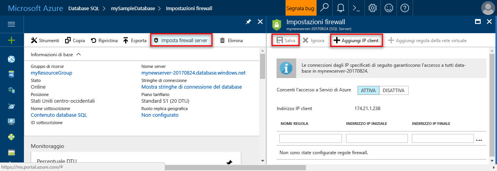

# <a name="design-your-first-azure-sql-database"></a>Progettare il primo database SQL di Azure

Database SQL di Azure è un relazionale database-come a un servizio (DBaaS) in hello Cloud Microsoft ("Azure"). In questa esercitazione, è illustrato come toouse hello portale di Azure e [SQL Server Management Studio](https://msdn.microsoft.com/library/ms174173.aspx) (SSMS) per: 

> [!div class="checklist"]
> * Creare un database in hello portale di Azure
> * Impostare una regola firewall di livello server nel portale di Azure hello
> * La connessione a database toohello con SQL Server Management Studio
> * Creare tabelle con SQL Server Management Studio
> * Eseguire il caricamento bulk dei dati con BCP
> * Eseguire una query su quei dati con SQL Server Management Studio
> * Ripristinare tooa database hello precedente [ripristino temporizzato](sql-database-recovery-using-backups.md#point-in-time-restore) in hello portale di Azure

Se non si ha una sottoscrizione di Azure, [creare un account gratuito](https://azure.microsoft.com/free/) prima di iniziare.

## <a name="prerequisites"></a>Prerequisiti

toocomplete questa esercitazione, verificare che è stato installato:
- versione più recente di Hello di [SQL Server Management Studio](https://msdn.microsoft.com/library/ms174173.aspx) (SSMS).
- versione più recente di Hello di [BCP e SQLCMD](https://www.microsoft.com/download/details.aspx?id=36433).

## <a name="log-in-toohello-azure-portal"></a>Accedi toohello portale di Azure

Accedi toohello [portale di Azure](https://portal.azure.com/).

## <a name="create-a-blank-sql-database"></a>Creare un database SQL vuoto

Un database SQL di Azure viene creato con un set definito di [risorse di calcolo e di archiviazione](sql-database-service-tiers.md). Hello database viene creato all'interno di un [gruppo di risorse](../azure-resource-manager/resource-group-overview.md) e in un [server logico di Database SQL di Azure](sql-database-features.md). 

Seguire questi toocreate passaggi un database SQL vuoto. 

1. Fare clic su hello **New** pulsante disponibile nella hello angolo superiore sinistro del portale di Azure hello.

2. Selezionare **database** da hello **New** pagina e selezionare **Database SQL** da hello **database** pagina. 

   

3. Compilare il modulo di Database SQL hello con hello le seguenti informazioni, come mostrato nella precedente immagine hello:   

   | Impostazione       | Valore consigliato | Descrizione | 
   | ------------ | ------------------ | ------------------------------------------------- | 
   | **Database name** (Nome database) | mySampleDatabase | Per i nomi di database validi, vedere [Database Identifiers](https://docs.microsoft.com/sql/relational-databases/databases/database-identifiers) (Identificatori di database). | 
   | **Sottoscrizione** | Sottoscrizione in uso  | Per informazioni dettagliate sulle sottoscrizioni, vedere [Subscriptions](https://account.windowsazure.com/Subscriptions) (Sottoscrizioni). |
   | **Gruppo di risorse** | myResourceGroup | Per i nomi di gruppi di risorse validi, vedere [Naming rules and restrictions](https://docs.microsoft.com/azure/architecture/best-practices/naming-conventions) (Regole di denominazione e restrizioni). |
   | **Select source** (Seleziona origine) | Database vuoto | Indica che deve essere creato un database vuoto. |

4. Fare clic su **Server** toocreate e configurare un nuovo server per il nuovo database. Compilare hello **nuovo modulo server** con hello le seguenti informazioni: 

   | Impostazione       | Valore consigliato | Descrizione | 
   | ------------ | ------------------ | ------------------------------------------------- | 
   | **Server name** (Nome server) | Qualsiasi nome globalmente univoco | Per i nomi di server validi, vedere [Naming rules and restrictions](https://docs.microsoft.com/azure/architecture/best-practices/naming-conventions) (Regole di denominazione e restrizioni). | 
   | **Nome di accesso amministratore server** | Qualsiasi nome valido | Per i nomi di accesso validi, vedere [Database Identifiers](https://docs.microsoft.com/sql/relational-databases/databases/database-identifiers) (Identificatori di database).|
   | **Password** | Qualsiasi password valida | La password deve contenere almeno 8 caratteri e deve contenere caratteri di tre delle seguenti categorie di hello: lettere maiuscole, lettere minuscole, numeri e caratteri non alfanumerici. |
   | **Posizione** | Qualsiasi località valida | Per informazioni sulle aree, vedere [Aree di Azure](https://azure.microsoft.com/regions/). |

   

5. Fare clic su **Seleziona**.

6. Fare clic su **tariffario** toospecify hello servizio livello di prestazioni e per il nuovo database. Per esercitazione selezionare **20 DTU** e **250** GB di memoria.

   

7. Fare clic su **Apply**.  

8. Selezionare un **delle regole di confronto** per database vuoto di hello (per questa esercitazione, hello Usa il valore predefinito). Per altre informazioni sulle regole di confronto, vedere [Collations](https://docs.microsoft.com/sql/t-sql/statements/collations) (Regole di confronto)

9. Fare clic su **crea** database hello tooprovision. Provisioning richiede circa un minuto e mezzo di toocomplete. 

10. Sulla barra degli strumenti hello, fare clic su **notifiche** toomonitor processo di distribuzione hello.

   

## <a name="create-a-server-level-firewall-rule"></a>Creare una regola del firewall a livello di server

Hello servizio Database SQL consente di creare un firewall hello a livello server che impedisce la connessione server toohello o da qualsiasi database nel server di hello, solo una regola del firewall creata firewall hello tooopen per indirizzi IP specifici strumenti e applicazioni esterne. Seguire questi passaggi toocreate un [regola del firewall a livello di server SQL Database](sql-database-firewall-configure.md) per indirizzo IP del client e abilitare la connettività esterna tramite firewall del Database SQL hello per solo l'indirizzo IP. 

> [!NOTE]
> Il database SQL comunica attraverso la porta 1433. Se si sta tentando di tooconnect da una rete aziendale, può non essere consentito il traffico in uscita sulla porta 1433 dal firewall della rete. In questo caso, è possibile connettersi tooyour server di Database SQL di Azure, a meno che il reparto IT consente di aprire la porta 1433.
>

1. Al termine della distribuzione di hello, fare clic su **database SQL** dal menu a sinistra di hello e quindi fare clic su **mySampleDatabase** su hello **database SQL** pagina. pagina di panoramica per l'apertura del database, che mostra hello completamente Hello completo del server (ad esempio **mynewserver20170313.database.windows.net**) e offre opzioni per un'ulteriore configurazione. Copiare il nome completo del server per usarlo in seguito.

   > [!IMPORTANT]
   > È necessario il server di tooyour tooconnect nome completo del server e i relativi database nelle successive guide introduttive.
   > 

    

2. Fare clic su **impostare firewall server** sulla barra degli strumenti hello, come illustrato nella figura precedente hello. Hello **le impostazioni del Firewall** verrà visualizzata la pagina per il server di Database SQL di hello. 

    


3. Fare clic su **Aggiungi indirizzo IP del client** su hello barra degli strumenti tooadd il corrente l'indirizzo IP di tooa nuova regola del firewall. Una regola del firewall può aprire la porta 1433 per un indirizzo IP singolo o un intervallo di indirizzi IP.

4. Fare clic su **Salva**. Una regola del firewall a livello di server viene creata per l'indirizzo IP corrente, aprire la porta 1433 sul server logico hello.

    

4. Fare clic su **OK** e quindi chiudere hello **le impostazioni del Firewall** pagina.

È ora possibile connettersi a server di Database SQL toohello e i relativi database tramite SQL Server Management Studio o un altro strumento di propria scelta da questo indirizzo IP utilizzando l'account amministratore di server hello creato in precedenza.

> [!IMPORTANT]
> Per impostazione predefinita, l'accesso attraverso il firewall di Database SQL hello è abilitato per tutti i servizi di Azure. Fare clic su **OFF** su toodisable questa pagina per tutti i servizi di Azure.

## <a name="sql-server-connection-information"></a>Informazioni di connessione SQL Server

Ottenere hello nome completo del server per il server di Database SQL di Azure nel portale di Azure hello. Utilizzare hello server completo tooconnect tooyour server dei nomi utilizzando SQL Server Management Studio.

1. Accedi toohello [portale di Azure](https://portal.azure.com/).
2. Selezionare **database SQL** dal menu a sinistra di hello, scegliere il database in hello **database SQL** pagina. 
3. In hello **Essentials** riquadro hello pagina del portale Azure per il database, individuare e copiare hello **nome Server**.

   

## <a name="connect-toohello-database-with-ssms"></a>La connessione a database toohello con SQL Server Management Studio

Utilizzare [SQL Server Management Studio](https://docs.microsoft.com/sql/ssms/sql-server-management-studio-ssms) tooestablish un server di Database SQL di Azure tooyour di connessione.

1. Aprire SQL Server Management Studio.

2. In hello **connettersi tooServer** finestra di dialogo immettere hello le seguenti informazioni:

   | Impostazione       | Valore consigliato | Descrizione | 
   | ------------ | ------------------ | ------------------------------------------------- | 
   | Tipo di server | Motore di database | Questo valore è obbligatorio |
   | Nome server | nome completo del server Hello | Hello il nome deve essere simile al seguente: **mynewserver20170313.database.windows.net**. |
   | Autenticazione | Autenticazione di SQL Server | L'autenticazione di SQL è hello unico tipo di autenticazione che è stato configurato in questa esercitazione. |
   | Login | account amministratore di server Hello | Si tratta di hello con l'account specificato durante la creazione di server hello. |
   | Password | password Hello per l'account di amministratore del server | Si tratta hello password specificata durante la creazione di server hello. |

   

3. Fare clic su **opzioni** in hello **connettersi tooserver** la finestra di dialogo. In hello **connettersi toodatabase** immettere **mySampleDatabase** tooconnect toothis database.

     

4. Fare clic su **Connetti**. verrà visualizzata la finestra di Esplora oggetti Hello in SSMS. 

5. In Esplora oggetti espandere **database** e quindi espandere **mySampleDatabase** oggetti hello tooview nel database di esempio hello.

     

## <a name="create-tables-in-hello-database"></a>Creare tabelle nel database di hello 

Creare uno schema di database con quattro tabelle che modellano un sistema di gestione degli studenti per le università tramite [Transact-SQL](https://docs.microsoft.com/sql/t-sql/language-reference):

- Person
- Corso
- Studente
- Accreditare quel modello come un sistema di gestione degli studenti per le università

Hello diagramma seguente viene illustrato come queste tabelle vengono correlate tooeach altri. Alcune di queste tabelle fanno riferimento a delle colonne in altre tabelle. Ad esempio, fa riferimento a tabella Student hello hello **PersonId** colonna di hello **persona** tabella. Uno Studio hello diagramma toounderstand come hello tabelle in questa esercitazione sono correlati tooone un altro. Per un esame approfondito come tabelle di database efficace toocreate, vedere [creare tabelle di database efficace](https://msdn.microsoft.com/library/cc505842.aspx). Per informazioni sulla scelta dei tipi di dati, vedere [Tipi di dati](https://docs.microsoft.com/sql/t-sql/data-types/data-types-transact-sql).

> [!NOTE]
> È inoltre possibile utilizzare hello [Progettazione tabelle in SQL Server Management Studio](https://msdn.microsoft.com/library/hh272695.aspx) toocreate e progettare le tabelle. 


1. In Esplora oggetti fare clic con il pulsante destro del mouse su **mySampleDatabase** e scegliere **Nuova query**. Query vuota viene visualizzata una finestra che è connesso tooyour database.

2. Nella finestra query hello eseguire hello query toocreate quattro tabelle del database seguenti: 

   ```sql 
   -- Create Person table

   CREATE TABLE Person
   (
   PersonId   INT IDENTITY PRIMARY KEY,
   FirstName   NVARCHAR(128) NOT NULL,
   MiddelInitial NVARCHAR(10),
   LastName   NVARCHAR(128) NOT NULL,
   DateOfBirth   DATE NOT NULL
   )
   
   -- Create Student table
 
   CREATE TABLE Student
   (
   StudentId INT IDENTITY PRIMARY KEY,
   PersonId  INT REFERENCES Person (PersonId),
   Email   NVARCHAR(256)
   )
   
   -- Create Course table
 
   CREATE TABLE Course
   (
   CourseId  INT IDENTITY PRIMARY KEY,
   Name   NVARCHAR(50) NOT NULL,
   Teacher   NVARCHAR(256) NOT NULL
   ) 

   -- Create Credit table
 
   CREATE TABLE Credit
   (
   StudentId   INT REFERENCES Student (StudentId),
   CourseId   INT REFERENCES Course (CourseId),
   Grade   DECIMAL(5,2) CHECK (Grade <= 100.00),
   Attempt   TINYINT,
   CONSTRAINT  [UQ_studentgrades] UNIQUE CLUSTERED
   (
   StudentId, CourseId, Grade, Attempt
   )
   )
   ```

   

3. Espandere il nodo 'tabelle' hello nelle tabelle hello oggetto di SQL Server Management Studio Esplora toosee hello che è stato creato.

   

## <a name="load-data-into-hello-tables"></a>Caricamento dei dati nelle tabelle di hello

1. Creare una cartella denominata **SampleTableData** nei dati di esempio toostore cartella di download per il database. 

2. Esempio hello pulsante destro del mouse collegamenti e salvarli in hello **SampleTableData** cartella. 

   - [SampleCourseData](https://sqldbtutorial.blob.core.windows.net/tutorials/SampleCourseData)
   - [SamplePersonData](https://sqldbtutorial.blob.core.windows.net/tutorials/SamplePersonData)
   - [SampleStudentData](https://sqldbtutorial.blob.core.windows.net/tutorials/SampleStudentData)
   - [SampleCreditData](https://sqldbtutorial.blob.core.windows.net/tutorials/SampleCreditData)

3. Aprire una finestra del prompt dei comandi e passare toohello SampleTableData cartella.

4. Eseguire i seguenti dati di esempio tooinsert comandi in sostituzione di valori hello per le tabelle di hello hello **ServerName**, **DatabaseName**, **UserName**e **Password** con i valori hello per l'ambiente.
  
   ```bcp
   bcp Course in SampleCourseData -S <ServerName>.database.windows.net -d <DatabaseName> -U <Username> -P <password> -q -c -t ","
   bcp Person in SamplePersonData -S <ServerName>.database.windows.net -d <DatabaseName> -U <Username> -P <password> -q -c -t ","
   bcp Student in SampleStudentData -S <ServerName>.database.windows.net -d <DatabaseName> -U <Username> -P <password> -q -c -t ","
   bcp Credit in SampleCreditData -S <ServerName>.database.windows.net -d <DatabaseName> -U <Username> -P <password> -q -c -t ","
   ```

Sono ora stati caricati i dati di esempio nelle tabelle di hello creato in precedenza.

## <a name="query-data"></a>Eseguire query sui dati

Eseguire le seguenti query tooretrieve informazioni dalle tabelle di database hello hello. Vedere [la scrittura di query SQL](https://technet.microsoft.com/library/bb264565.aspx) toolearn ulteriori informazioni sulla scrittura di query SQL. Hello prima query unisce in join toofind tutte le quattro tabelle invece di tutti gli studenti hello da ' Dominick Pope' hanno un livello superiore al 75% nella propria classe. seconda query Hello unisce tutte e quattro le tabelle e trova tutti i corsi mai registrati in cui 'Noe Coleman'.

1. In una finestra di query di SQL Server Management Studio, eseguire hello seguente query:

   ```sql 
   -- Find hello students taught by Dominick Pope who have a grade higher than 75%

   SELECT  person.FirstName,
   person.LastName,
   course.Name,
   credit.Grade
   FROM  Person AS person
   INNER JOIN Student AS student ON person.PersonId = student.PersonId
   INNER JOIN Credit AS credit ON student.StudentId = credit.StudentId
   INNER JOIN Course AS course ON credit.CourseId = course.courseId
   WHERE course.Teacher = 'Dominick Pope' 
   AND Grade > 75
   ```

2. In una finestra di query di SQL Server Management Studio, eseguire la query seguente:

   ```sql
   -- Find all hello courses in which Noe Coleman has ever enrolled

   SELECT  course.Name,
   course.Teacher,
   credit.Grade
   FROM  Course AS course
   INNER JOIN Credit AS credit ON credit.CourseId = course.CourseId
   INNER JOIN Student AS student ON student.StudentId = credit.StudentId
   INNER JOIN Person AS person ON person.PersonId = student.PersonId
   WHERE person.FirstName = 'Noe'
   AND person.LastName = 'Coleman'
   ```

## <a name="restore-a-database-tooa-previous-point-in-time"></a>Ripristinare un punto precedente tooa di database nel tempo

Si supponga di aver eliminato accidentalmente una tabella. Si tratta di un elemento che non è facile da ripristinare. Database SQL di Azure consente toogo tooany indietro punto nel tempo di hello ultimo backup too35 giorni e nel nuovo database di tempo tooa questo punto di ripristino. È possibile toorecover questo database i dati eliminati. Hello seguenti passaggi punto di ripristino hello esempio database tooa prima dell'aggiunta di tabelle hello.

1. Nella pagina Database SQL di hello per il database, fare clic su **ripristinare** sulla barra degli strumenti hello. Hello **ripristinare** verrà visualizzata la pagina.

   

2. Compilare hello **ripristinare** form con le informazioni necessarie hello:
    * Nome database: specificare un nome per il database 
    * Punto nel tempo: Seleziona hello **momento** scheda hello ripristino modulo 
    * Punto di ripristino: selezionare un'ora che si verifica prima che il database di hello è stata modificata
    * Server di destinazione: non è possibile modificare questo valore quando si ripristina un database 
    * Pool di database elastici: selezionare **Nessuno**  
    * Piano tariffario: selezionare **20 DTUs** (20 DTU) e **250 GB** di memoria.

   

3. Fare clic su **OK** toorestore hello database troppo[tooa punto di ripristino temporizzato](sql-database-recovery-using-backups.md#point-in-time-restore) prima dell'aggiunta di tabelle hello. Ripristino di un punto diverso tooa di database nel tempo, viene creato un database di duplicati in hello stesso server di database originale hello hello temporizzazione specifica, purché venga incluso il periodo di memorizzazione hello per le [livello di servizio](sql-database-service-tiers.md).

## <a name="next-steps"></a>Passaggi successivi 
In questa esercitazione è stato attività di base del database, ad esempio creare un database e tabelle, caricare e query sui dati e hello database tooa precedente punto di ripristino temporizzato. Si è appreso come:
> [!div class="checklist"]
> * Creare un database
> * Configurare una regola del firewall
> * La connessione a database toohello con [SQL Server Management Studio](https://msdn.microsoft.com/library/ms174173.aspx) (SSMS)
> * Creare tabelle
> * Eseguire il caricamento bulk dei dati
> * Eseguire query sui dati
> * Hello database tooa precedente punto di ripristino temporizzato utilizzando il Database SQL [ripristino temporizzato](sql-database-recovery-using-backups.md#point-in-time-restore) funzionalità

Spostare toohello toolearn esercitazione successiva sulla progettazione di un database tramite Visual Studio e c#.

> [!div class="nextstepaction"]
>[Progettare un database SQL di Azure e connettersi con C# e ADO.NET](sql-database-design-first-database-csharp.md)
