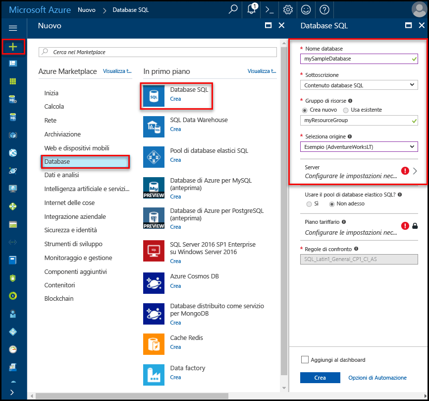
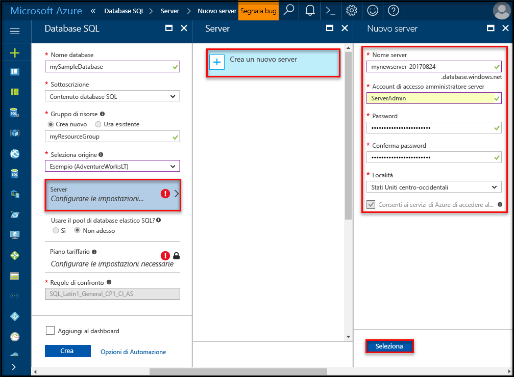
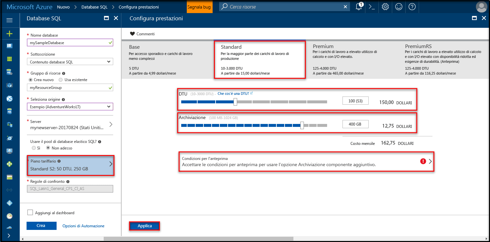
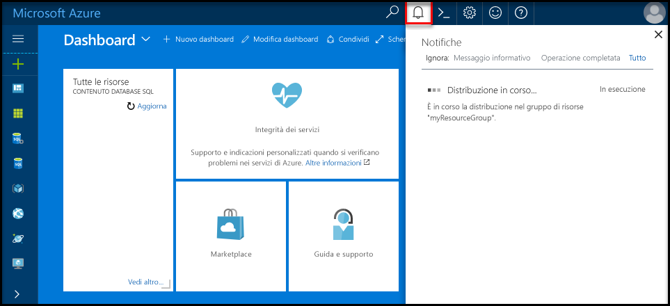
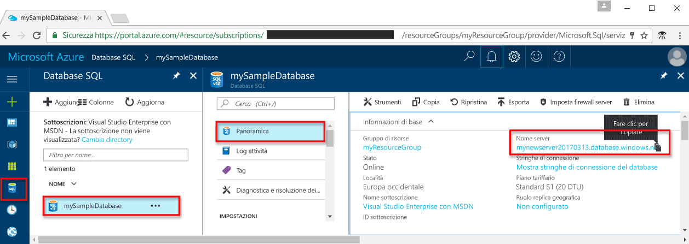
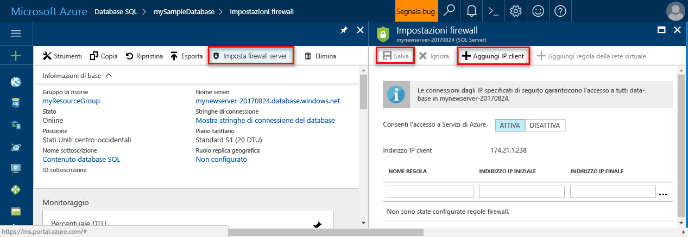

# <a name="create-an-azure-sql-database-in-hello-azure-portal"></a><span data-ttu-id="7a22d-105">Creare un database SQL di Azure nel portale di Azure hello</span><span class="sxs-lookup"><span data-stu-id="7a22d-105">Create an Azure SQL database in hello Azure portal</span></span>

<span data-ttu-id="7a22d-106">In questa esercitazione introduttiva illustra come toocreate un SQL database in Azure.</span><span class="sxs-lookup"><span data-stu-id="7a22d-106">This quick start tutorial walks through how toocreate a SQL database in Azure.</span></span> <span data-ttu-id="7a22d-107">Database SQL di Azure è un "Database-as-a-Service" offerta che consente di scala e toorun database di SQL Server a disponibilità elevata nel cloud hello.</span><span class="sxs-lookup"><span data-stu-id="7a22d-107">Azure SQL Database is a “Database-as-a-Service” offering that enables you toorun and scale highly available SQL Server databases in hello cloud.</span></span> <span data-ttu-id="7a22d-108">Questa Guida introduttiva illustra la modalità di avvio tooget mediante la creazione di un database SQL tramite hello portale di Azure.</span><span class="sxs-lookup"><span data-stu-id="7a22d-108">This quick start shows you how tooget started by creating a SQL database using hello Azure portal.</span></span>

<span data-ttu-id="7a22d-109">Se non si ha una sottoscrizione di Azure, creare un account [gratuito](https://azure.microsoft.com/free/) prima di iniziare.</span><span class="sxs-lookup"><span data-stu-id="7a22d-109">If you don't have an Azure subscription, create a [free](https://azure.microsoft.com/free/) account before you begin.</span></span>

## <a name="log-in-toohello-azure-portal"></a><span data-ttu-id="7a22d-110">Accedi toohello portale di Azure</span><span class="sxs-lookup"><span data-stu-id="7a22d-110">Log in toohello Azure portal</span></span>

<span data-ttu-id="7a22d-111">Accedi toohello [portale di Azure](https://portal.azure.com/).</span><span class="sxs-lookup"><span data-stu-id="7a22d-111">Log in toohello [Azure portal](https://portal.azure.com/).</span></span>

## <a name="create-a-sql-database"></a><span data-ttu-id="7a22d-112">Creazione di un database SQL</span><span class="sxs-lookup"><span data-stu-id="7a22d-112">Create a SQL database</span></span>

<span data-ttu-id="7a22d-113">Un database SQL di Azure viene creato con un set definito di [risorse di calcolo e di archiviazione](sql-database-service-tiers.md).</span><span class="sxs-lookup"><span data-stu-id="7a22d-113">An Azure SQL database is created with a defined set of [compute and storage resources](sql-database-service-tiers.md).</span></span> <span data-ttu-id="7a22d-114">Hello database viene creato all'interno di un [gruppo di risorse](../azure-resource-manager/resource-group-overview.md) e in un [server logico di Database SQL di Azure](sql-database-features.md).</span><span class="sxs-lookup"><span data-stu-id="7a22d-114">hello database is created within an [Azure resource group](../azure-resource-manager/resource-group-overview.md) and in an [Azure SQL Database logical server](sql-database-features.md).</span></span> 

<span data-ttu-id="7a22d-115">Seguire questi passaggi toocreate un database SQL contenente dati di esempio Adventure Works LT hello.</span><span class="sxs-lookup"><span data-stu-id="7a22d-115">Follow these steps toocreate a SQL database containing hello Adventure Works LT sample data.</span></span> 

1. <span data-ttu-id="7a22d-116">Fare clic su hello **New** pulsante disponibile nella hello angolo superiore sinistro del portale di Azure hello.</span><span class="sxs-lookup"><span data-stu-id="7a22d-116">Click hello **New** button found on hello upper left-hand corner of hello Azure portal.</span></span>

2. <span data-ttu-id="7a22d-117">Selezionare **database** da hello **New** pagina e selezionare **Database SQL** da hello **database** pagina.</span><span class="sxs-lookup"><span data-stu-id="7a22d-117">Select **Databases** from hello **New** page, and select **SQL Database** from hello **Databases** page.</span></span>

   

3. <span data-ttu-id="7a22d-119">Compilare il modulo di Database SQL hello con hello le seguenti informazioni, come mostrato nella precedente immagine hello:</span><span class="sxs-lookup"><span data-stu-id="7a22d-119">Fill out hello SQL Database form with hello following information, as shown on hello preceding image:</span></span>   

   | <span data-ttu-id="7a22d-120">Impostazione</span><span class="sxs-lookup"><span data-stu-id="7a22d-120">Setting</span></span>       | <span data-ttu-id="7a22d-121">Valore consigliato</span><span class="sxs-lookup"><span data-stu-id="7a22d-121">Suggested value</span></span> | <span data-ttu-id="7a22d-122">Descrizione</span><span class="sxs-lookup"><span data-stu-id="7a22d-122">Description</span></span> | 
   | ------------ | ------------------ | ------------------------------------------------- | 
   | <span data-ttu-id="7a22d-123">**Database name** (Nome database)</span><span class="sxs-lookup"><span data-stu-id="7a22d-123">**Database name**</span></span> | <span data-ttu-id="7a22d-124">mySampleDatabase</span><span class="sxs-lookup"><span data-stu-id="7a22d-124">mySampleDatabase</span></span> | <span data-ttu-id="7a22d-125">Per i nomi di database validi, vedere [Database Identifiers](https://docs.microsoft.com/en-us/sql/relational-databases/databases/database-identifiers) (Identificatori di database).</span><span class="sxs-lookup"><span data-stu-id="7a22d-125">For valid database names, see [Database Identifiers](https://docs.microsoft.com/en-us/sql/relational-databases/databases/database-identifiers).</span></span> | 
   | <span data-ttu-id="7a22d-126">**Sottoscrizione**</span><span class="sxs-lookup"><span data-stu-id="7a22d-126">**Subscription**</span></span> | <span data-ttu-id="7a22d-127">Sottoscrizione in uso</span><span class="sxs-lookup"><span data-stu-id="7a22d-127">Your subscription</span></span>  | <span data-ttu-id="7a22d-128">Per informazioni dettagliate sulle sottoscrizioni, vedere [Subscriptions](https://account.windowsazure.com/Subscriptions) (Sottoscrizioni).</span><span class="sxs-lookup"><span data-stu-id="7a22d-128">For details about your subscriptions, see [Subscriptions](https://account.windowsazure.com/Subscriptions).</span></span> |
   | <span data-ttu-id="7a22d-129">**Gruppo di risorse**</span><span class="sxs-lookup"><span data-stu-id="7a22d-129">**Resource group**</span></span>  | <span data-ttu-id="7a22d-130">myResourceGroup</span><span class="sxs-lookup"><span data-stu-id="7a22d-130">myResourceGroup</span></span> | <span data-ttu-id="7a22d-131">Per i nomi di gruppi di risorse validi, vedere [Naming rules and restrictions](https://docs.microsoft.com/azure/architecture/best-practices/naming-conventions) (Regole di denominazione e restrizioni).</span><span class="sxs-lookup"><span data-stu-id="7a22d-131">For valid resource group names, see [Naming rules and restrictions](https://docs.microsoft.com/azure/architecture/best-practices/naming-conventions).</span></span> |
   | <span data-ttu-id="7a22d-132">**Seleziona origine**</span><span class="sxs-lookup"><span data-stu-id="7a22d-132">**Source source**</span></span> | <span data-ttu-id="7a22d-133">Sample (AdventureWorksLT) (Esempio - AdventureWorksLT)</span><span class="sxs-lookup"><span data-stu-id="7a22d-133">Sample (AdventureWorksLT)</span></span> | <span data-ttu-id="7a22d-134">Carica i dati e schema AdventureWorksLT hello nel nuovo database</span><span class="sxs-lookup"><span data-stu-id="7a22d-134">Loads hello AdventureWorksLT schema and data into your new database</span></span> |

   > [!IMPORTANT]
   > <span data-ttu-id="7a22d-135">Perché viene utilizzato nel resto di hello di questa Guida introduttiva, è necessario selezionare il database di esempio hello in questo modulo.</span><span class="sxs-lookup"><span data-stu-id="7a22d-135">You must select hello sample database on this form because it is used in hello remainder of this quick start.</span></span>
   > 

4. <span data-ttu-id="7a22d-136">In **Server**, fare clic su **Configura le impostazioni obbligatorie** e compilare hello formato SQL server (server logico) con hello le seguenti informazioni, come illustrato nella seguente immagine hello:</span><span class="sxs-lookup"><span data-stu-id="7a22d-136">Under **Server**, click **Configure required settings** and fill out hello SQL server (logical server) form with hello following information, as shown on hello following image:</span></span>   

   | <span data-ttu-id="7a22d-137">Impostazione</span><span class="sxs-lookup"><span data-stu-id="7a22d-137">Setting</span></span>       | <span data-ttu-id="7a22d-138">Valore consigliato</span><span class="sxs-lookup"><span data-stu-id="7a22d-138">Suggested value</span></span> | <span data-ttu-id="7a22d-139">Descrizione</span><span class="sxs-lookup"><span data-stu-id="7a22d-139">Description</span></span> | 
   | ------------ | ------------------ | ------------------------------------------------- | 
   | <span data-ttu-id="7a22d-140">**Server name** (Nome server)</span><span class="sxs-lookup"><span data-stu-id="7a22d-140">**Server name**</span></span> | <span data-ttu-id="7a22d-141">Qualsiasi nome globalmente univoco</span><span class="sxs-lookup"><span data-stu-id="7a22d-141">Any globally unique name</span></span> | <span data-ttu-id="7a22d-142">Per i nomi di server validi, vedere [Naming rules and restrictions](https://docs.microsoft.com/azure/architecture/best-practices/naming-conventions) (Regole di denominazione e restrizioni).</span><span class="sxs-lookup"><span data-stu-id="7a22d-142">For valid server names, see [Naming rules and restrictions](https://docs.microsoft.com/azure/architecture/best-practices/naming-conventions).</span></span> | 
   | <span data-ttu-id="7a22d-143">**Nome di accesso amministratore server**</span><span class="sxs-lookup"><span data-stu-id="7a22d-143">**Server admin login**</span></span> | <span data-ttu-id="7a22d-144">Qualsiasi nome valido</span><span class="sxs-lookup"><span data-stu-id="7a22d-144">Any valid name</span></span> | <span data-ttu-id="7a22d-145">Per i nomi di accesso validi, vedere [Database Identifiers](https://docs.microsoft.com/en-us/sql/relational-databases/databases/database-identifiers) (Identificatori di database).</span><span class="sxs-lookup"><span data-stu-id="7a22d-145">For valid login names, see [Database Identifiers](https://docs.microsoft.com/en-us/sql/relational-databases/databases/database-identifiers).</span></span> |
   | <span data-ttu-id="7a22d-146">**Password**</span><span class="sxs-lookup"><span data-stu-id="7a22d-146">**Password**</span></span> | <span data-ttu-id="7a22d-147">Qualsiasi password valida</span><span class="sxs-lookup"><span data-stu-id="7a22d-147">Any valid password</span></span> | <span data-ttu-id="7a22d-148">La password deve contenere almeno 8 caratteri e deve contenere caratteri di tre delle seguenti categorie di hello: lettere maiuscole, lettere minuscole, numeri e caratteri non alfanumerici e.</span><span class="sxs-lookup"><span data-stu-id="7a22d-148">Your password must have at least 8 characters and must contain characters from three of hello following categories: upper case characters, lower case characters, numbers, and and non-alphanumeric characters.</span></span> |
   | <span data-ttu-id="7a22d-149">**Sottoscrizione**</span><span class="sxs-lookup"><span data-stu-id="7a22d-149">**Subscription**</span></span> | <span data-ttu-id="7a22d-150">Sottoscrizione in uso</span><span class="sxs-lookup"><span data-stu-id="7a22d-150">Your subscription</span></span> | <span data-ttu-id="7a22d-151">Per informazioni dettagliate sulle sottoscrizioni, vedere [Subscriptions](https://account.windowsazure.com/Subscriptions) (Sottoscrizioni).</span><span class="sxs-lookup"><span data-stu-id="7a22d-151">For details about your subscriptions, see [Subscriptions](https://account.windowsazure.com/Subscriptions).</span></span> |
   | <span data-ttu-id="7a22d-152">**Gruppo di risorse**</span><span class="sxs-lookup"><span data-stu-id="7a22d-152">**Resource group**</span></span> | <span data-ttu-id="7a22d-153">myResourceGroup</span><span class="sxs-lookup"><span data-stu-id="7a22d-153">myResourceGroup</span></span> | <span data-ttu-id="7a22d-154">Per i nomi di gruppi di risorse validi, vedere [Naming rules and restrictions](https://docs.microsoft.com/azure/architecture/best-practices/naming-conventions) (Regole di denominazione e restrizioni).</span><span class="sxs-lookup"><span data-stu-id="7a22d-154">For valid resource group names, see [Naming rules and restrictions](https://docs.microsoft.com/azure/architecture/best-practices/naming-conventions).</span></span> |
   | <span data-ttu-id="7a22d-155">**Posizione**</span><span class="sxs-lookup"><span data-stu-id="7a22d-155">**Location**</span></span> | <span data-ttu-id="7a22d-156">Qualsiasi località valida</span><span class="sxs-lookup"><span data-stu-id="7a22d-156">Any valid location</span></span> | <span data-ttu-id="7a22d-157">Per informazioni sulle aree, vedere [Aree di Azure](https://azure.microsoft.com/regions/).</span><span class="sxs-lookup"><span data-stu-id="7a22d-157">For information about regions, see [Azure Regions](https://azure.microsoft.com/regions/).</span></span> |

   > [!IMPORTANT]
   > <span data-ttu-id="7a22d-158">account di accesso amministratore server Hello e una password che è possibile specificare sono necessari toolog toohello server e i relativi database più avanti in questa Guida introduttiva.</span><span class="sxs-lookup"><span data-stu-id="7a22d-158">hello server admin login and password that you specify here are required toolog in toohello server and its databases later in this quick start.</span></span> <span data-ttu-id="7a22d-159">Prendere nota di queste informazioni per usarle in seguito.</span><span class="sxs-lookup"><span data-stu-id="7a22d-159">Remember or record this information for later use.</span></span> 
   >  

   

5. <span data-ttu-id="7a22d-161">Dopo aver completato il modulo di hello, fare clic su **selezionare**.</span><span class="sxs-lookup"><span data-stu-id="7a22d-161">When you have completed hello form, click **Select**.</span></span>

6. <span data-ttu-id="7a22d-162">Fare clic su **tariffario** toospecify hello servizio livello di prestazioni e per il nuovo database.</span><span class="sxs-lookup"><span data-stu-id="7a22d-162">Click **Pricing tier** toospecify hello service tier and performance level for your new database.</span></span> <span data-ttu-id="7a22d-163">Utilizzare hello dispositivo di scorrimento tooselect **20 Dtu** e **250** GB di spazio di archiviazione.</span><span class="sxs-lookup"><span data-stu-id="7a22d-163">Use hello slider tooselect **20 DTUs** and **250** GB of storage.</span></span> <span data-ttu-id="7a22d-164">Per altre informazioni sulle DTU, vedere il relativo [articolo](sql-database-what-is-a-dtu.md).</span><span class="sxs-lookup"><span data-stu-id="7a22d-164">For more information on DTUs, see [What is a DTU?](sql-database-what-is-a-dtu.md).</span></span>

   

7. <span data-ttu-id="7a22d-166">Dopo il periodo selezionato hello di Dtu, fare clic su **applica**.</span><span class="sxs-lookup"><span data-stu-id="7a22d-166">After selected hello amount of DTUs, click **Apply**.</span></span>  

8. <span data-ttu-id="7a22d-167">Dopo aver completato il form di Database SQL hello, fare clic su **crea** database hello tooprovision.</span><span class="sxs-lookup"><span data-stu-id="7a22d-167">Now that you have completed hello SQL Database form, click **Create** tooprovision hello database.</span></span> <span data-ttu-id="7a22d-168">Il provisioning richiede alcuni minuti.</span><span class="sxs-lookup"><span data-stu-id="7a22d-168">Provisioning takes a few minutes.</span></span> 

9. <span data-ttu-id="7a22d-169">Sulla barra degli strumenti hello, fare clic su **notifiche** toomonitor processo di distribuzione hello.</span><span class="sxs-lookup"><span data-stu-id="7a22d-169">On hello toolbar, click **Notifications** toomonitor hello deployment process.</span></span>

   

## <a name="create-a-server-level-firewall-rule"></a><span data-ttu-id="7a22d-171">Creare una regola del firewall a livello di server</span><span class="sxs-lookup"><span data-stu-id="7a22d-171">Create a server-level firewall rule</span></span>

<span data-ttu-id="7a22d-172">Hello servizio Database SQL consente di creare un firewall hello a livello server che impedisce la connessione server toohello o da qualsiasi database nel server di hello, solo una regola del firewall creata firewall hello tooopen per indirizzi IP specifici strumenti e applicazioni esterne.</span><span class="sxs-lookup"><span data-stu-id="7a22d-172">hello SQL Database service creates a firewall at hello server-level that prevents external applications and tools from connecting toohello server or any databases on hello server unless a firewall rule is created tooopen hello firewall for specific IP addresses.</span></span> <span data-ttu-id="7a22d-173">Seguire questi passaggi toocreate un [regola del firewall a livello di server SQL Database](sql-database-firewall-configure.md) per indirizzo IP del client e abilitare la connettività esterna tramite firewall del Database SQL hello per solo l'indirizzo IP.</span><span class="sxs-lookup"><span data-stu-id="7a22d-173">Follow these steps toocreate a [SQL Database server-level firewall rule](sql-database-firewall-configure.md) for your client's IP address and enable external connectivity through hello SQL Database firewall for your IP address only.</span></span> 

> [!NOTE]
> <span data-ttu-id="7a22d-174">Il database SQL comunica attraverso la porta 1433.</span><span class="sxs-lookup"><span data-stu-id="7a22d-174">SQL Database communicates over port 1433.</span></span> <span data-ttu-id="7a22d-175">Se si sta tentando di tooconnect da una rete aziendale, può non essere consentito il traffico in uscita sulla porta 1433 dal firewall della rete.</span><span class="sxs-lookup"><span data-stu-id="7a22d-175">If you are trying tooconnect from within a corporate network, outbound traffic over port 1433 may not be allowed by your network's firewall.</span></span> <span data-ttu-id="7a22d-176">In questo caso, è possibile connettersi tooyour server di Database SQL di Azure, a meno che il reparto IT consente di aprire la porta 1433.</span><span class="sxs-lookup"><span data-stu-id="7a22d-176">If so, you cannot connect tooyour Azure SQL Database server unless your IT department opens port 1433.</span></span>
>

1. <span data-ttu-id="7a22d-177">Al termine della distribuzione di hello, fare clic su **database SQL** dal menu a sinistra di hello e quindi fare clic su **mySampleDatabase** su hello **database SQL** pagina.</span><span class="sxs-lookup"><span data-stu-id="7a22d-177">After hello deployment completes, click **SQL databases** from hello left-hand menu and then click **mySampleDatabase** on hello **SQL databases** page.</span></span> <span data-ttu-id="7a22d-178">pagina di panoramica per l'apertura del database, che mostra hello completamente Hello completo del server (ad esempio **mynewserver20170313.database.windows.net**) e offre opzioni per un'ulteriore configurazione.</span><span class="sxs-lookup"><span data-stu-id="7a22d-178">hello overview page for your database opens, showing you hello fully qualified server name (such as **mynewserver20170313.database.windows.net**) and provides options for further configuration.</span></span> <span data-ttu-id="7a22d-179">Copiare il nome completo del server per usarlo in seguito.</span><span class="sxs-lookup"><span data-stu-id="7a22d-179">Copy this fully qualified server name for use later.</span></span>

   > [!IMPORTANT]
   > <span data-ttu-id="7a22d-180">È necessario il server di tooyour tooconnect nome completo del server e i relativi database nelle successive guide introduttive.</span><span class="sxs-lookup"><span data-stu-id="7a22d-180">You need this fully qualified server name tooconnect tooyour server and its databases in subsequent quick starts.</span></span>
   > 

    

2. <span data-ttu-id="7a22d-182">Fare clic su **impostare firewall server** sulla barra degli strumenti hello, come illustrato nella figura precedente hello.</span><span class="sxs-lookup"><span data-stu-id="7a22d-182">Click **Set server firewall** on hello toolbar as shown in hello previous image.</span></span> <span data-ttu-id="7a22d-183">Hello **le impostazioni del Firewall** verrà visualizzata la pagina per il server di Database SQL di hello.</span><span class="sxs-lookup"><span data-stu-id="7a22d-183">hello **Firewall settings** page for hello SQL Database server opens.</span></span> 

    

3. <span data-ttu-id="7a22d-185">Fare clic su **Aggiungi indirizzo IP del client** su hello barra degli strumenti tooadd il corrente l'indirizzo IP di tooa nuova regola del firewall.</span><span class="sxs-lookup"><span data-stu-id="7a22d-185">Click **Add client IP** on hello toolbar tooadd your current IP address tooa new firewall rule.</span></span> <span data-ttu-id="7a22d-186">Una regola del firewall può aprire la porta 1433 per un indirizzo IP singolo o un intervallo di indirizzi IP.</span><span class="sxs-lookup"><span data-stu-id="7a22d-186">A firewall rule can open port 1433 for a single IP address or a range of IP addresses.</span></span>

4. <span data-ttu-id="7a22d-187">Fare clic su **Salva**.</span><span class="sxs-lookup"><span data-stu-id="7a22d-187">Click **Save**.</span></span> <span data-ttu-id="7a22d-188">Una regola del firewall a livello di server viene creata per l'indirizzo IP corrente, aprire la porta 1433 sul server logico hello.</span><span class="sxs-lookup"><span data-stu-id="7a22d-188">A server-level firewall rule is created for your current IP address opening port 1433 on hello logical server.</span></span>

    

4. <span data-ttu-id="7a22d-190">Fare clic su **OK** e quindi chiudere hello **le impostazioni del Firewall** pagina.</span><span class="sxs-lookup"><span data-stu-id="7a22d-190">Click **OK** and then close hello **Firewall settings** page.</span></span>

<span data-ttu-id="7a22d-191">È ora possibile connettersi a server di Database SQL toohello e i relativi database tramite SQL Server Management Studio o un altro strumento di propria scelta da questo indirizzo IP utilizzando l'account amministratore di server hello creato in precedenza.</span><span class="sxs-lookup"><span data-stu-id="7a22d-191">You can now connect toohello SQL Database server and its databases using SQL Server Management Studio or another tool of your choice from this IP address using hello server admin account created previously.</span></span>

> [!IMPORTANT]
> <span data-ttu-id="7a22d-192">Per impostazione predefinita, l'accesso attraverso il firewall di Database SQL hello è abilitato per tutti i servizi di Azure.</span><span class="sxs-lookup"><span data-stu-id="7a22d-192">By default, access through hello SQL Database firewall is enabled for all Azure services.</span></span> <span data-ttu-id="7a22d-193">Fare clic su **OFF** su toodisable questa pagina per tutti i servizi di Azure.</span><span class="sxs-lookup"><span data-stu-id="7a22d-193">Click **OFF** on this page toodisable for all Azure services.</span></span>
>

## <a name="query-hello-sql-database"></a><span data-ttu-id="7a22d-194">Database SQL di hello query</span><span class="sxs-lookup"><span data-stu-id="7a22d-194">Query hello SQL database</span></span>

<span data-ttu-id="7a22d-195">Ora che è stato creato un database di esempio in Azure, si strumento hello query incorporata all'interno di hello Azure tooconfirm portale è possibile collegare dati di hello toohello database e query.</span><span class="sxs-lookup"><span data-stu-id="7a22d-195">Now that you have created a sample database in Azure, let’s use hello built-in query tool within hello Azure portal tooconfirm that you can connect toohello database and query hello data.</span></span> 

1. <span data-ttu-id="7a22d-196">Nella pagina Database SQL di hello per il database, fare clic su **strumenti** sulla barra degli strumenti hello.</span><span class="sxs-lookup"><span data-stu-id="7a22d-196">On hello SQL Database page for your database, click **Tools** on hello toolbar.</span></span> <span data-ttu-id="7a22d-197">Hello **strumenti** verrà visualizzata la pagina.</span><span class="sxs-lookup"><span data-stu-id="7a22d-197">hello **Tools** page opens.</span></span>

    

2. <span data-ttu-id="7a22d-199">Fare clic su **editor di Query (anteprima)**, fare clic su hello **anteprima termini** casella di controllo, quindi fare clic su **OK**.</span><span class="sxs-lookup"><span data-stu-id="7a22d-199">Click **Query editor (preview)**, click hello **Preview terms** checkbox, and then click **OK**.</span></span> <span data-ttu-id="7a22d-200">verrà visualizzata la pagina dell'editor di Query Hello.</span><span class="sxs-lookup"><span data-stu-id="7a22d-200">hello Query editor page opens.</span></span>

3. <span data-ttu-id="7a22d-201">Fare clic su **accesso** e quindi, quando richiesto, selezionare **autenticazione di SQL server** e quindi specificare l'account di accesso amministratore server hello e la password creata in precedenza.</span><span class="sxs-lookup"><span data-stu-id="7a22d-201">Click **Login** and then, when prompted, select **SQL server authentication** and then provide hello server admin login and password that you created earlier.</span></span>

    

4. <span data-ttu-id="7a22d-203">Fare clic su **OK** toolog in.</span><span class="sxs-lookup"><span data-stu-id="7a22d-203">Click **OK** toolog in.</span></span>

5. <span data-ttu-id="7a22d-204">Dopo l'autenticazione, digitare quanto segue di hello eseguire una query nel riquadro dell'editor di query hello.</span><span class="sxs-lookup"><span data-stu-id="7a22d-204">After you are authenticated, type hello following query in hello query editor pane.</span></span>

   ```sql
   SELECT TOP 20 pc.Name as CategoryName, p.name as ProductName
   FROM SalesLT.ProductCategory pc
   JOIN SalesLT.Product p
   ON pc.productcategoryid = p.productcategoryid;
   ```

6. <span data-ttu-id="7a22d-205">Fare clic su **eseguire** ed esaminarne i risultati della query hello in hello **risultati** riquadro.</span><span class="sxs-lookup"><span data-stu-id="7a22d-205">Click **Run** and then review hello query results in hello **Results** pane.</span></span>

   

7. <span data-ttu-id="7a22d-207">Chiude hello **editor di Query** pagina e hello **strumenti** pagina.</span><span class="sxs-lookup"><span data-stu-id="7a22d-207">Close hello **Query editor** page and hello **Tools** page.</span></span>

## <a name="clean-up-resources"></a><span data-ttu-id="7a22d-208">Pulire le risorse</span><span class="sxs-lookup"><span data-stu-id="7a22d-208">Clean up resources</span></span>

<span data-ttu-id="7a22d-209">Se non è necessario queste risorse per un altro conosca (vedere [passaggi successivi](#next-steps)), è possibile eliminarle eseguendo hello seguenti:</span><span class="sxs-lookup"><span data-stu-id="7a22d-209">If you don't need these resources for another quickstart/tutorial (see [Next steps](#next-steps)), you can delete them by doing hello following:</span></span>


1. <span data-ttu-id="7a22d-210">Dal menu a sinistra di hello in hello portale di Azure, fare clic su **gruppi di risorse** e quindi fare clic su **myResourceGroup**.</span><span class="sxs-lookup"><span data-stu-id="7a22d-210">From hello left-hand menu in hello Azure portal, click **Resource groups** and then click **myResourceGroup**.</span></span> 
2. <span data-ttu-id="7a22d-211">Nella pagina di gruppo di risorse, fare clic su **eliminare**, tipo **myResourceGroup** in hello casella di testo e quindi fare clic su **eliminare**.</span><span class="sxs-lookup"><span data-stu-id="7a22d-211">On your resource group page, click **Delete**, type **myResourceGroup** in hello text box, and then click **Delete**.</span></span>

## <a name="next-steps"></a><span data-ttu-id="7a22d-212">Passaggi successivi</span><span class="sxs-lookup"><span data-stu-id="7a22d-212">Next steps</span></span>

<span data-ttu-id="7a22d-213">Dopo aver creato un database, è possibile connettersi ed eseguire query usando gli strumenti preferiti.</span><span class="sxs-lookup"><span data-stu-id="7a22d-213">Now that you have a database, you can connect and query using your favorite tools.</span></span> <span data-ttu-id="7a22d-214">Per altre informazioni, scegliere uno strumento di seguito:</span><span class="sxs-lookup"><span data-stu-id="7a22d-214">Learn more by choosing your tool below:</span></span>

- [<span data-ttu-id="7a22d-215">SQL Server Management Studio</span><span class="sxs-lookup"><span data-stu-id="7a22d-215">SQL Server Management Studio</span></span>](sql-database-connect-query-ssms.md)
- [<span data-ttu-id="7a22d-216">Visual Studio Code</span><span class="sxs-lookup"><span data-stu-id="7a22d-216">Visual Studio Code</span></span>](sql-database-connect-query-vscode.md)
- [<span data-ttu-id="7a22d-217">.NET</span><span class="sxs-lookup"><span data-stu-id="7a22d-217">.NET</span></span>](sql-database-connect-query-dotnet.md)
- [<span data-ttu-id="7a22d-218">PHP</span><span class="sxs-lookup"><span data-stu-id="7a22d-218">PHP</span></span>](sql-database-connect-query-php.md)
- [<span data-ttu-id="7a22d-219">Node.JS</span><span class="sxs-lookup"><span data-stu-id="7a22d-219">Node.js</span></span>](sql-database-connect-query-nodejs.md)
- [<span data-ttu-id="7a22d-220">Java</span><span class="sxs-lookup"><span data-stu-id="7a22d-220">Java</span></span>](sql-database-connect-query-java.md)
- [<span data-ttu-id="7a22d-221">Python</span><span class="sxs-lookup"><span data-stu-id="7a22d-221">Python</span></span>](sql-database-connect-query-python.md)
- [<span data-ttu-id="7a22d-222">Ruby</span><span class="sxs-lookup"><span data-stu-id="7a22d-222">Ruby</span></span>](sql-database-connect-query-ruby.md)
