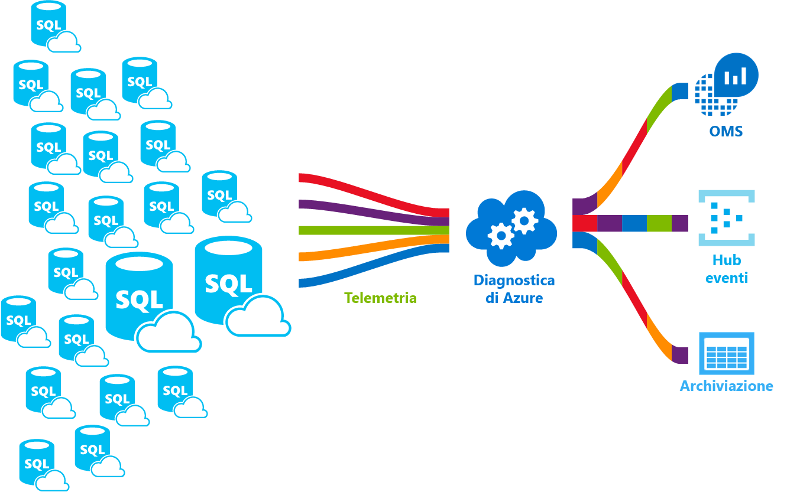

# <a name="azure-sql-database-metrics-and-diagnostics-logging"></a><span data-ttu-id="92280-103">Metriche del database SQL di Azure e registrazione diagnostica</span><span class="sxs-lookup"><span data-stu-id="92280-103">Azure SQL Database metrics and diagnostics logging</span></span> 
<span data-ttu-id="92280-104">Il database SQL di Azure può generare metriche e log di diagnostica per facilitare il monitoraggio.</span><span class="sxs-lookup"><span data-stu-id="92280-104">Azure SQL Database can emit metrics and diagnostic logs for easier monitoring.</span></span> <span data-ttu-id="92280-105">È possibile configurare l'utilizzo delle risorse di Database SQL di Azure toostore, thread di lavoro e le sessioni e connettività in una di queste risorse di Azure:</span><span class="sxs-lookup"><span data-stu-id="92280-105">You can configure Azure SQL Database toostore resource usage, workers and sessions, and connectivity into one of these Azure resources:</span></span>
- <span data-ttu-id="92280-106">**Archiviazione di Azure**: per l'archiviazione di enormi quantità di dati di telemetria a un costo conveniente</span><span class="sxs-lookup"><span data-stu-id="92280-106">**Azure Storage**: For archiving vast amounts of telemetry for a small price</span></span>
- <span data-ttu-id="92280-107">**Hub eventi di Azure**: per l'integrazione dei dati di telemetria del database SQL di Azure con soluzioni di monitoraggio personalizzate o pipeline attive</span><span class="sxs-lookup"><span data-stu-id="92280-107">**Azure Event Hub**: For integrating Azure SQL Database telemetry with your custom monitoring solution or hot pipelines</span></span>
- <span data-ttu-id="92280-108">**Azure Log Analitica**: per predefinito hello soluzione con reporting, avvisi e riduzione delle funzionalità di monitoraggio</span><span class="sxs-lookup"><span data-stu-id="92280-108">**Azure Log Analytics**: For out of hello box monitoring solution with reporting, alerting, and mitigating capabilities</span></span> 

    

## <a name="enable-logging"></a><span data-ttu-id="92280-110">Abilitazione della registrazione</span><span class="sxs-lookup"><span data-stu-id="92280-110">Enable logging</span></span>

<span data-ttu-id="92280-111">Le metriche e la registrazione diagnostica non sono abilitate per impostazione predefinita.</span><span class="sxs-lookup"><span data-stu-id="92280-111">Metrics and diagnostics logging is not enabled by default.</span></span> <span data-ttu-id="92280-112">È possibile abilitare e gestire le metriche e registrazione di diagnostica utilizzando uno dei seguenti metodi hello:</span><span class="sxs-lookup"><span data-stu-id="92280-112">You can enable and manage metrics and diagnostics logging using one of hello following methods:</span></span>
- <span data-ttu-id="92280-113">Portale di Azure</span><span class="sxs-lookup"><span data-stu-id="92280-113">Azure portal</span></span>
- <span data-ttu-id="92280-114">PowerShell</span><span class="sxs-lookup"><span data-stu-id="92280-114">PowerShell</span></span>
- <span data-ttu-id="92280-115">Interfaccia della riga di comando di Azure</span><span class="sxs-lookup"><span data-stu-id="92280-115">Azure CLI</span></span>
- <span data-ttu-id="92280-116">API REST</span><span class="sxs-lookup"><span data-stu-id="92280-116">REST API</span></span> 
- <span data-ttu-id="92280-117">Modello di Resource Manager</span><span class="sxs-lookup"><span data-stu-id="92280-117">Resource Manager template</span></span>

<span data-ttu-id="92280-118">Quando si abilita metriche e registrazione diagnostica, è necessario toospecify hello risorse di Azure in cui vengono raccolti i dati selezionati.</span><span class="sxs-lookup"><span data-stu-id="92280-118">When you enable metrics and diagnostics logging, you need toospecify hello Azure resource where selected data is collected.</span></span> <span data-ttu-id="92280-119">Opzioni disponibili:</span><span class="sxs-lookup"><span data-stu-id="92280-119">Options available:</span></span>
- <span data-ttu-id="92280-120">Log Analytics</span><span class="sxs-lookup"><span data-stu-id="92280-120">Log analytics</span></span>
- <span data-ttu-id="92280-121">Hub eventi</span><span class="sxs-lookup"><span data-stu-id="92280-121">Event Hub</span></span>
- <span data-ttu-id="92280-122">Archiviazione di Azure</span><span class="sxs-lookup"><span data-stu-id="92280-122">Azure Storage</span></span> 

<span data-ttu-id="92280-123">È possibile eseguire il provisioning di una nuova risorsa di Azure o selezionare una risorsa esistente.</span><span class="sxs-lookup"><span data-stu-id="92280-123">You can provision a new Azure resource or select an existing resource.</span></span> <span data-ttu-id="92280-124">Dopo aver selezionato la risorsa di archiviazione hello, è necessario toospecify toocollect quali dati.</span><span class="sxs-lookup"><span data-stu-id="92280-124">After selecting hello storage resource, you need toospecify which data toocollect.</span></span> <span data-ttu-id="92280-125">Le opzioni disponibili includono:</span><span class="sxs-lookup"><span data-stu-id="92280-125">Options available include:</span></span>

- <span data-ttu-id="92280-126">**[Metriche 1 minuto](sql-database-metrics-diag-logging.md#1-minute-metrics)**: contiene percentuale DTU, limite DTU, percentuale CPU, percentuale lettura dati fisici, percentuale scrittura log, riuscito/non riuscito/bloccato dalle connessioni firewall, percentuale sessioni, percentuale ruoli di lavoro, risorsa di archiviazione, percentuale di archiviazione, percentuale di archiviazione XTP</span><span class="sxs-lookup"><span data-stu-id="92280-126">**[1-minute metrics](sql-database-metrics-diag-logging.md#1-minute-metrics)** - contains DTU percentage, DTU limit, CPU percentage, Physical data read percentage, Log write percentage, Successful/Failed/Blocked by firewall connections, sessions percentage, workers percentage, storage, storage percentage, XTP storage percentage</span></span>

<span data-ttu-id="92280-127">Se si specifica l'Hub eventi o un account di sottoscrizione di Azure, è possibile specificare un toospecify di criteri di conservazione dei dati precedenti a un determinato periodo di tempo viene eliminato.</span><span class="sxs-lookup"><span data-stu-id="92280-127">If you specify Event Hub or an AzureStorage account, you can specify a retention policy toospecify that data that is older than a selected time period is deleted.</span></span> <span data-ttu-id="92280-128">Se si specifica Log Analitica, criteri di conservazione hello dipendono dal piano tariffario selezionato hello.</span><span class="sxs-lookup"><span data-stu-id="92280-128">If you specify Log Analytics, hello retention policy depends on hello selected pricing tier.</span></span> <span data-ttu-id="92280-129">Per altre informazioni, vedere [Prezzi di Log Analytics](https://azure.microsoft.com/pricing/details/log-analytics/).</span><span class="sxs-lookup"><span data-stu-id="92280-129">Read more about [Log Analytics pricing](https://azure.microsoft.com/pricing/details/log-analytics/).</span></span> 

<span data-ttu-id="92280-130">È consigliabile leggere entrambi hello [panoramica delle metriche in Microsoft Azure](../monitoring-and-diagnostics/monitoring-overview-metrics.md) e [Panoramica di Azure i log di diagnostica](../monitoring-and-diagnostics/monitoring-overview-of-diagnostic-logs.md) articoli toogain comprendere non solo la modalità registrazione tooenable, ma hello categorie di metriche e di log supportati da hello diversi servizi di Azure.</span><span class="sxs-lookup"><span data-stu-id="92280-130">We recommend that you read both hello [Overview of metrics in Microsoft Azure](../monitoring-and-diagnostics/monitoring-overview-metrics.md) and [Overview of Azure Diagnostic Logs](../monitoring-and-diagnostics/monitoring-overview-of-diagnostic-logs.md) articles toogain an understanding of not only how tooenable logging, but hello metrics and log categories supported by hello various Azure services.</span></span>

### <a name="azure-portal"></a><span data-ttu-id="92280-131">Portale di Azure</span><span class="sxs-lookup"><span data-stu-id="92280-131">Azure portal</span></span>

<span data-ttu-id="92280-132">metriche tooenable raccolta di log di diagnostica nel portale di Azure hello esplorare database SQL di Azure tooyour o pagina pool elastico e quindi fare clic su **le impostazioni di diagnostica**.</span><span class="sxs-lookup"><span data-stu-id="92280-132">tooenable metrics and diagnostic logs collection in hello Azure portal, navigate tooyour Azure SQL database or elastic pool page, and then click **Diagnostic settings**.</span></span>

   

### <a name="powershell"></a><span data-ttu-id="92280-134">PowerShell</span><span class="sxs-lookup"><span data-stu-id="92280-134">PowerShell</span></span>

<span data-ttu-id="92280-135">tooenable metrica e registrazione di diagnostica tramite PowerShell, Usa hello seguenti comandi:</span><span class="sxs-lookup"><span data-stu-id="92280-135">tooenable metrics and diagnostics logging using PowerShell, use hello following commands:</span></span>

- <span data-ttu-id="92280-136">tooenable archiviazione dei log di diagnostica in un Account di archiviazione, usare questo comando:</span><span class="sxs-lookup"><span data-stu-id="92280-136">tooenable storage of Diagnostic Logs in a Storage Account, use this command:</span></span>

   ```powershell
   Set-AzureRmDiagnosticSetting -ResourceId [your resource id] -StorageAccountId [your storage account id] -Enabled $true
   ```

   <span data-ttu-id="92280-137">ID dell'Account di archiviazione Hello è l'id di risorsa di hello per i registri hello toowhich di account di archiviazione desiderato toosend hello.</span><span class="sxs-lookup"><span data-stu-id="92280-137">hello Storage Account ID is hello resource id for hello storage account toowhich you want toosend hello logs.</span></span>

- <span data-ttu-id="92280-138">tooenable il flusso di log di diagnostica tooan Hub eventi, usare questo comando:</span><span class="sxs-lookup"><span data-stu-id="92280-138">tooenable streaming of Diagnostic Logs tooan Event Hub, use this command:</span></span>

   ```powershell
   Set-AzureRmDiagnosticSetting -ResourceId [your resource id] -ServiceBusRuleId [your service bus rule id] -Enabled $true
   ```

   <span data-ttu-id="92280-139">Hello ID regola Bus di servizio è una stringa con questo formato:</span><span class="sxs-lookup"><span data-stu-id="92280-139">hello Service Bus Rule ID is a string with this format:</span></span>

   ```powershell
   {service bus resource ID}/authorizationrules/{key name}
   ``` 

- <span data-ttu-id="92280-140">tooenable l'invio di log di diagnostica tooa Log Analitica dell'area di lavoro, usare questo comando:</span><span class="sxs-lookup"><span data-stu-id="92280-140">tooenable sending of Diagnostic Logs tooa Log Analytics workspace, use this command:</span></span>

   ```powershell
   Set-AzureRmDiagnosticSetting -ResourceId [your resource id] -WorkspaceId [resource id of hello log analytics workspace] -Enabled $true
   ```

- <span data-ttu-id="92280-141">È possibile ottenere l'id di risorsa hello dell'area di lavoro Log Analitica utilizzando hello comando seguente:</span><span class="sxs-lookup"><span data-stu-id="92280-141">You can obtain hello resource id of your Log Analytics workspace using hello following command:</span></span>

   ```powershell
   (Get-AzureRmOperationalInsightsWorkspace).ResourceId
   ```

<span data-ttu-id="92280-142">È possibile combinare queste tooenable parametri più opzioni di output.</span><span class="sxs-lookup"><span data-stu-id="92280-142">You can combine these parameters tooenable multiple output options.</span></span>

### <a name="cli"></a><span data-ttu-id="92280-143">CLI</span><span class="sxs-lookup"><span data-stu-id="92280-143">CLI</span></span>

<span data-ttu-id="92280-144">tooenable metrica e registrazione di diagnostica utilizzando hello CLI di Azure, hello di utilizzare i comandi seguenti:</span><span class="sxs-lookup"><span data-stu-id="92280-144">tooenable metrics and diagnostics logging using hello Azure CLI, use hello following commands:</span></span>

- <span data-ttu-id="92280-145">tooenable archiviazione dei log di diagnostica in un Account di archiviazione, usare questo comando:</span><span class="sxs-lookup"><span data-stu-id="92280-145">tooenable storage of Diagnostic Logs in a Storage Account, use this command:</span></span>

   ```azurecli-interactive
   azure insights diagnostic set --resourceId <resourceId> --storageId <storageAccountId> --enabled true
   ```

   <span data-ttu-id="92280-146">ID dell'Account di archiviazione Hello è l'id di risorsa di hello per i registri hello toowhich di account di archiviazione desiderato toosend hello.</span><span class="sxs-lookup"><span data-stu-id="92280-146">hello Storage Account ID is hello resource id for hello storage account toowhich you want toosend hello logs.</span></span>

- <span data-ttu-id="92280-147">tooenable il flusso di log di diagnostica tooan Hub eventi, usare questo comando:</span><span class="sxs-lookup"><span data-stu-id="92280-147">tooenable streaming of Diagnostic Logs tooan Event Hub, use this command:</span></span>

   ```azurecli-interactive
   azure insights diagnostic set --resourceId <resourceId> --serviceBusRuleId <serviceBusRuleId> --enabled true
   ```

   <span data-ttu-id="92280-148">Hello ID regola Bus di servizio è una stringa con questo formato:</span><span class="sxs-lookup"><span data-stu-id="92280-148">hello Service Bus Rule ID is a string with this format:</span></span>

   ```azurecli-interactive
   {service bus resource ID}/authorizationrules/{key name}
   ```

- <span data-ttu-id="92280-149">tooenable l'invio di log di diagnostica tooa Log Analitica dell'area di lavoro, usare questo comando:</span><span class="sxs-lookup"><span data-stu-id="92280-149">tooenable sending of Diagnostic Logs tooa Log Analytics workspace, use this command:</span></span>

   ```azurecli-interactive
   azure insights diagnostic set --resourceId <resourceId> --workspaceId <resource id of hello log analytics workspace> --enabled true
   ```

<span data-ttu-id="92280-150">È possibile combinare queste tooenable parametri più opzioni di output.</span><span class="sxs-lookup"><span data-stu-id="92280-150">You can combine these parameters tooenable multiple output options.</span></span>

### <a name="rest-api"></a><span data-ttu-id="92280-151">API REST</span><span class="sxs-lookup"><span data-stu-id="92280-151">REST API</span></span>

<span data-ttu-id="92280-152">Ottenere informazioni su come troppo[modificare le impostazioni di diagnostica utilizzando l'API REST di Azure Monitor hello](https://msdn.microsoft.com/library/azure/dn931931.aspx).</span><span class="sxs-lookup"><span data-stu-id="92280-152">Read about how too[change Diagnostic settings using hello Azure Monitor REST API](https://msdn.microsoft.com/library/azure/dn931931.aspx).</span></span> 

### <a name="resource-manager-template"></a><span data-ttu-id="92280-153">Modello di Resource Manager</span><span class="sxs-lookup"><span data-stu-id="92280-153">Resource Manager template</span></span>

<span data-ttu-id="92280-154">Ottenere informazioni su come troppo[abilitare le impostazioni di diagnostica al momento della creazione di risorse utilizzando il modello di gestione risorse](../monitoring-and-diagnostics/monitoring-enable-diagnostic-logs-using-template.md).</span><span class="sxs-lookup"><span data-stu-id="92280-154">Read about how too[enable Diagnostic settings at resource creation using Resource Manager template](../monitoring-and-diagnostics/monitoring-enable-diagnostic-logs-using-template.md).</span></span> 

## <a name="stream-into-log-analytics"></a><span data-ttu-id="92280-155">Eseguire lo streaming in Log Analytics</span><span class="sxs-lookup"><span data-stu-id="92280-155">Stream into Log Analytics</span></span> 
<span data-ttu-id="92280-156">Le metriche di Database SQL Azure e i log di diagnostica possono essere trasmesso in Log Analitica opzione hello incorporati "Invia tooLog Analitica" nel portale di hello o abilitando Log Analitica in un'impostazione di diagnostica tramite i cmdlet PowerShell di Azure, CLI di Azure o Azure monitoraggio REST API.</span><span class="sxs-lookup"><span data-stu-id="92280-156">Azure SQL Database metrics and diagnostic logs can be streamed into Log Analytics using hello built-in “Send tooLog Analytics” option in hello portal, or by enabling Log Analytics in a diagnostic setting via Azure PowerShell cmdlets, Azure CLI, or Azure Monitor REST API.</span></span>

### <a name="installation-overview"></a><span data-ttu-id="92280-157">Panoramica dell'installazione</span><span class="sxs-lookup"><span data-stu-id="92280-157">Installation overview</span></span>

<span data-ttu-id="92280-158">Monitorare la flotta del database SQL di Azure è semplice con Log Analytics.</span><span class="sxs-lookup"><span data-stu-id="92280-158">Monitoring Azure SQL Database fleet is simple with Log Analytics.</span></span> <span data-ttu-id="92280-159">Sono necessari tre passaggi:</span><span class="sxs-lookup"><span data-stu-id="92280-159">Three steps are required:</span></span>

1.  <span data-ttu-id="92280-160">Creare la risorsa Log Analytics</span><span class="sxs-lookup"><span data-stu-id="92280-160">Create Log Analytics resource</span></span>
2.  <span data-ttu-id="92280-161">Configurare le metriche toorecord database e log di diagnostica in hello creato Log Analitica</span><span class="sxs-lookup"><span data-stu-id="92280-161">Configure databases toorecord metrics and diagnostic logs into hello created Log Analytics</span></span>
3.  <span data-ttu-id="92280-162">Installare la soluzione **Analisi SQL di Azure** dalla raccolta in Log Analytics</span><span class="sxs-lookup"><span data-stu-id="92280-162">Install **Azure SQL Analytics** solution from gallery in Log Analytics</span></span>

### <a name="create-log-analytics-resource"></a><span data-ttu-id="92280-163">Creare la risorsa Log Analytics</span><span class="sxs-lookup"><span data-stu-id="92280-163">Create Log Analytics resource</span></span>

1. <span data-ttu-id="92280-164">Fare clic su **New** nel menu a sinistra di hello.</span><span class="sxs-lookup"><span data-stu-id="92280-164">Click **New** in hello left-hand menu.</span></span>
2. <span data-ttu-id="92280-165">Fare clic su **Monitoraggio e gestione**</span><span class="sxs-lookup"><span data-stu-id="92280-165">Click **Monitoring + Management**</span></span>
3. <span data-ttu-id="92280-166">Fare clic su **Log Analytics**</span><span class="sxs-lookup"><span data-stu-id="92280-166">Click **Log Analytics**</span></span>
4. <span data-ttu-id="92280-167">Compilare il modulo di Log Analitica hello con informazioni aggiuntive di hello necessarie: nome dell'area di lavoro, sottoscrizione, gruppo di risorse, posizione e livello di prezzo.</span><span class="sxs-lookup"><span data-stu-id="92280-167">Fill in hello Log Analytics form with hello additional information required: workspace name, subscription, resource group, location, and pricing tier.</span></span>

   

### <a name="configure-databases-toorecord-metrics-and-diagnostic-logs"></a><span data-ttu-id="92280-169">Configurare le metriche toorecord database e log di diagnostica</span><span class="sxs-lookup"><span data-stu-id="92280-169">Configure databases toorecord metrics and diagnostic logs</span></span>

<span data-ttu-id="92280-170">tooconfigure modo più semplice Hello in database registrano le metriche viene eseguita tramite hello portale di Azure.</span><span class="sxs-lookup"><span data-stu-id="92280-170">hello easiest way tooconfigure where databases record their metrics is through hello Azure portal.</span></span> <span data-ttu-id="92280-171">In hello portale di Azure, passare tooyour risorse di Database SQL di Azure e fare clic su **le impostazioni di diagnostica**.</span><span class="sxs-lookup"><span data-stu-id="92280-171">In hello Azure portal, navigate tooyour Azure SQL Database resource and click **Diagnostics settings**.</span></span> 

### <a name="install-hello-azure-sql-analytics-solution-from-gallery"></a><span data-ttu-id="92280-172">Installare una soluzione Analitica SQL Azure hello dalla raccolta</span><span class="sxs-lookup"><span data-stu-id="92280-172">Install hello Azure SQL Analytics solution from gallery</span></span>  

1. <span data-ttu-id="92280-173">Una volta hello risorse Analitica di Log viene creato e i dati vengono trasmessi al suo interno, installare la soluzione Analitica SQL Azure.</span><span class="sxs-lookup"><span data-stu-id="92280-173">Once hello Log Analytics resource is created and your data is flowing into it, install Azure SQL Analytics solution.</span></span> <span data-ttu-id="92280-174">Questa operazione può essere eseguita tramite hello **Solutions Gallery** che è possibile trovare nella home page OMS hello e nel menu laterale hello.</span><span class="sxs-lookup"><span data-stu-id="92280-174">This can be done through hello **Solutions Gallery** that you can find on hello OMS homepage and in hello side menu.</span></span> <span data-ttu-id="92280-175">Nella raccolta di hello, trovare e fare clic su **Analitica SQL Azure** soluzione e fare clic su **Aggiungi**.</span><span class="sxs-lookup"><span data-stu-id="92280-175">In hello gallery, find and click **Azure SQL Analytics** solution and click **Add**.</span></span>

   

2. <span data-ttu-id="92280-177">Nella home page di OMS viene visualizzato un nuovo riquadro chiamato **Analisi SQL di Azure**.</span><span class="sxs-lookup"><span data-stu-id="92280-177">On your OMS homepage, a new tile called **Azure SQL Analytics** appears.</span></span> <span data-ttu-id="92280-178">Selezionare questo riquadro per aprire il dashboard di Azure SQL Analitica hello.</span><span class="sxs-lookup"><span data-stu-id="92280-178">Selecting this tile opens hello Azure SQL Analytics dashboard.</span></span>

### <a name="using-azure-sql-analytics-solution"></a><span data-ttu-id="92280-179">Uso della soluzione Analisi SQL di Azure</span><span class="sxs-lookup"><span data-stu-id="92280-179">Using Azure SQL Analytics Solution</span></span>

<span data-ttu-id="92280-180">Analitica SQL Azure è un dashboard gerarchico che consente di toonavigate tramite gerarchia hello di risorse di Database SQL di Azure.</span><span class="sxs-lookup"><span data-stu-id="92280-180">Azure SQL Analytics is a hierarchical dashboard that allows you toonavigate through hello hierarchy of Azure SQL Database resources.</span></span> <span data-ttu-id="92280-181">In questo modo la funzionalità tooscope consente toodo di alto livello monitoraggio ma anche il monitoraggio hello toojust destra imposta delle risorse.</span><span class="sxs-lookup"><span data-stu-id="92280-181">This capability enables you toodo high-level monitoring but it also enables you tooscope your monitoring toojust hello right set of resources.</span></span>
<span data-ttu-id="92280-182">Dashboard contiene elenchi di hello di diverse risorse nella risorsa hello selezionato.</span><span class="sxs-lookup"><span data-stu-id="92280-182">Dashboard contains hello lists of different resources under hello selected resource.</span></span> <span data-ttu-id="92280-183">Ad esempio, per una sottoscrizione selezionata è possibile vedere hello tutti i server, il pool elastico e i database appartenenti toohello selezionato una sottoscrizione.</span><span class="sxs-lookup"><span data-stu-id="92280-183">For example, for a selected subscription you can see hello all servers, elastic pools and databases that belong toohello selected subscription.</span></span> <span data-ttu-id="92280-184">Inoltre, per il pool elastico e i database, è possibile visualizzare metriche di utilizzo di risorse hello di tale risorsa.</span><span class="sxs-lookup"><span data-stu-id="92280-184">Additionally, for Elastic Pools and databases, you can see hello resource usage metrics of that resource.</span></span> <span data-ttu-id="92280-185">Sono inclusi grafici per DTU, CPU, IO, LOG, sessioni, processi di lavoro, connessioni e archiviazione in GB.</span><span class="sxs-lookup"><span data-stu-id="92280-185">This includes charts for DTU, CPU, IO, LOG, sessions, workers, connections, and storage in GB.</span></span>

## <a name="stream-into-azure-event-hub"></a><span data-ttu-id="92280-186">Eseguire lo streaming nell'hub eventi di Azure</span><span class="sxs-lookup"><span data-stu-id="92280-186">Stream into Azure Event Hub</span></span>

<span data-ttu-id="92280-187">Le metriche di Database SQL Azure e i log di diagnostica possono essere trasmesso in Hub eventi utilizzando l'opzione predefinita "hub eventi tooan flusso" hello nel portale di hello o abilitando l'Id regola Bus di servizio in un'impostazione di diagnostica tramite i cmdlet PowerShell di Azure, Azure CLI o REST di monitoraggio di Azure API.</span><span class="sxs-lookup"><span data-stu-id="92280-187">Azure SQL Database metrics and diagnostic logs can be streamed into Event Hub using hello built-in “Stream tooan event hub” option in hello portal, or by enabling Service Bus Rule Id in a diagnostic setting via Azure PowerShell Cmdlets, Azure CLI, or Azure Monitor REST API.</span></span> 

### <a name="what-toodo-with-metrics-and-diagnostic-logs-in-event-hub"></a><span data-ttu-id="92280-188">Quali toodo con metriche e i log di diagnostica in Hub eventi?</span><span class="sxs-lookup"><span data-stu-id="92280-188">What toodo with metrics and diagnostic logs in Event Hub?</span></span>
<span data-ttu-id="92280-189">Una volta dati hello selezionato viene trasmessa in Hub eventi, sono tooenabling più vicino di un passaggio avanzate scenari di monitoraggio.</span><span class="sxs-lookup"><span data-stu-id="92280-189">Once hello selected data is streamed into Event Hub, you are one step closer tooenabling advanced monitoring scenarios.</span></span> <span data-ttu-id="92280-190">Hub eventi funge da hello "porta principale" per una pipeline di eventi e una volta in un Hub eventi vengono raccolti i dati possono essere trasformato e archiviate utilizzando qualsiasi provider analitica in tempo reale o schede dell'invio in batch o dell'archiviazione.</span><span class="sxs-lookup"><span data-stu-id="92280-190">Event Hubs acts as hello "front door" for an event pipeline, and once data is collected into an Event Hub, it can be transformed and stored using any real-time analytics provider or batching/storage adapters.</span></span> <span data-ttu-id="92280-191">Hub eventi separa produzione hello di un flusso di eventi dal consumo hello di tali eventi, in modo che i consumer di eventi può accedere agli eventi di hello in una pianificazione personalizzata.</span><span class="sxs-lookup"><span data-stu-id="92280-191">Event Hubs decouples hello production of a stream of events from hello consumption of those events, so that event consumers can access hello events on their own schedule.</span></span> <span data-ttu-id="92280-192">Per altre informazioni sull'hub eventi, vedere:</span><span class="sxs-lookup"><span data-stu-id="92280-192">For more information on Event Hub, see:</span></span>

- <span data-ttu-id="92280-193">[Cosa sono gli hub eventi di Azure](../event-hubs/event-hubs-what-is-event-hubs.md)?</span><span class="sxs-lookup"><span data-stu-id="92280-193">[What are Azure Event Hubs](../event-hubs/event-hubs-what-is-event-hubs.md)?</span></span>
- [<span data-ttu-id="92280-194">Introduzione all'Hub eventi</span><span class="sxs-lookup"><span data-stu-id="92280-194">Get started with Event Hubs</span></span>](../event-hubs/event-hubs-csharp-ephcs-getstarted.md)


<span data-ttu-id="92280-195">Ecco alcune modalità è possibile utilizzare funzionalità di streaming hello:</span><span class="sxs-lookup"><span data-stu-id="92280-195">Here are just a few ways you might use hello streaming capability:</span></span>

-   <span data-ttu-id="92280-196">Visualizzare l'integrità del servizio dal flusso "percorso critico" dati tooPowerBI - tramite hub di eventi, flusso Analitica e Power BI, è possibile trasformare facilmente i dati di metrica e diagnostica in prossimità di informazioni in tempo reale in servizi di Azure.</span><span class="sxs-lookup"><span data-stu-id="92280-196">View service health by streaming “hot path” data tooPowerBI - Using Event Hubs, Stream Analytics, and PowerBI, you can easily transform your metrics and diagnostics data into near real-time insights on your Azure services.</span></span> <span data-ttu-id="92280-197">Per una panoramica delle modalità tooset di un hub di eventi, elaborano i dati con flusso Analitica, usare Power BI come output, vedere [flusso Analitica e Power BI](../stream-analytics/stream-analytics-power-bi-dashboard.md).</span><span class="sxs-lookup"><span data-stu-id="92280-197">For an overview of how tooset up an Event Hubs, process data with Stream Analytics, and use PowerBI as an output, see [Stream Analytics and Power BI](../stream-analytics/stream-analytics-power-bi-dashboard.md).</span></span>
-   <span data-ttu-id="92280-198">Flusso registri toothird parti registrazione e i dati di telemetria flussi – hub di eventi tramite il flusso è possono ottenere le metriche e i log di diagnostica in toodifferent soluzioni analitica di monitoraggio e di log di terze parti.</span><span class="sxs-lookup"><span data-stu-id="92280-198">Stream logs toothird-party logging and telemetry streams – Using Event Hubs streaming you can get your metrics and diagnostic logs in toodifferent third-party monitoring and log analytics solutions.</span></span> 
-   <span data-ttu-id="92280-199">Compilare una telemetria personalizzata e una piattaforma di registrazione: se si dispone già di una piattaforma dati di telemetria personalizzati o sono solo le compilazione uno, hello altamente scalabile di pubblicazione-sottoscrizione natura degli hub di eventi consente tooflexibly acquisire i log di diagnostica.</span><span class="sxs-lookup"><span data-stu-id="92280-199">Build a custom telemetry and logging platform – If you already have a custom-built telemetry platform or are just thinking about building one, hello highly scalable publish-subscribe nature of Event Hubs allows you tooflexibly ingest diagnostic logs.</span></span> <span data-ttu-id="92280-200">Vedere [toousing di Guida di Dan Rosanova hub eventi in una piattaforma dati di telemetria su scala globale](https://azure.microsoft.com/documentation/videos/build-2015-designing-and-sizing-a-global-scale-telemetry-platform-on-azure-event-Hubs/).</span><span class="sxs-lookup"><span data-stu-id="92280-200">See [Dan Rosanova’s guide toousing Event Hubs in a global scale telemetry platform](https://azure.microsoft.com/documentation/videos/build-2015-designing-and-sizing-a-global-scale-telemetry-platform-on-azure-event-Hubs/).</span></span>

## <a name="stream-into-azure-storage"></a><span data-ttu-id="92280-201">Eseguire lo streaming in Archiviazione di Azure</span><span class="sxs-lookup"><span data-stu-id="92280-201">Stream into Azure Storage</span></span>

<span data-ttu-id="92280-202">Le metriche di Database SQL Azure e i log di diagnostica possono essere archiviati in archiviazione di Azure usando l'opzione "Archivia l'account di archiviazione tooa" incorporati hello nel portale di Azure hello o abilitando l'archiviazione di Azure in un'impostazione di diagnostica tramite i cmdlet PowerShell di Azure, CLI di Azure o Azure API REST del monitoraggio.</span><span class="sxs-lookup"><span data-stu-id="92280-202">Azure SQL Database metrics and diagnostic logs can be stored into Azure Storage using hello built-in "Archive tooa storage account” option in hello Azure portal, or by enabling Azure Storage in a diagnostic setting via Azure PowerShell Cmdlets, Azure CLI, or Azure Monitor REST API.</span></span>

### <a name="schema-of-metrics-and-diagnostic-logs-in-hello-storage-account"></a><span data-ttu-id="92280-203">Schema delle metriche e i log di diagnostica nell'account di archiviazione hello</span><span class="sxs-lookup"><span data-stu-id="92280-203">Schema of metrics and diagnostic logs in hello storage account</span></span>

<span data-ttu-id="92280-204">Dopo aver configurato le metriche e la raccolta di log di diagnostica, viene creato un contenitore di archiviazione nell'account di archiviazione hello selezionato quando sono disponibili righe prima di hello dei dati.</span><span class="sxs-lookup"><span data-stu-id="92280-204">Once you have set up metrics and diagnostic logs collection, a storage container is created in hello storage account you selected when hello first rows of data are available.</span></span> <span data-ttu-id="92280-205">struttura Hello di tali BLOB è:</span><span class="sxs-lookup"><span data-stu-id="92280-205">hello structure of these blobs is:</span></span>

```powershell
insights-{metrics|logs}-{category name}/resourceId=/SUBSCRIPTIONS/{subscription ID}/ RESOURCEGROUPS/{resource group name}/PROVIDERS/Microsoft.SQL/servers/{resource_server}/ databases/{database_name}/y={four-digit numeric year}/m={two-digit numeric month}/d={two-digit numeric day}/h={two-digit 24-hour clock hour}/m=00/PT1H.json
```
    
<span data-ttu-id="92280-206">O, più semplicemente:</span><span class="sxs-lookup"><span data-stu-id="92280-206">Or, more simply:</span></span>

```powershell
insights-{metrics|logs}-{category name}/resourceId=/{resource Id}/y={four-digit numeric year}/m={two-digit numeric month}/d={two-digit numeric day}/h={two-digit 24-hour clock hour}/m=00/PT1H.json
```

<span data-ttu-id="92280-207">Ad esempio, un nome del BLOB per la metrica 1 minuto potrebbe essere:</span><span class="sxs-lookup"><span data-stu-id="92280-207">For example, a blob name for 1-minute metrics might be:</span></span>

```powershell
insights-metrics-minute/resourceId=/SUBSCRIPTIONS/s1id1234-5679-0123-4567-890123456789/RESOURCEGROUPS/TESTRESOURCEGROUP/PROVIDERS/MICROSOFT.SQL/ servers/Server1/databases/database1/y=2016/m=08/d=22/h=18/m=00/PT1H.json
```

<span data-ttu-id="92280-208">Nel caso in cui si desiderano dati hello toorecord dal Pool elastico hello, nome del blob è leggermente diverso:</span><span class="sxs-lookup"><span data-stu-id="92280-208">In case you want toorecord hello data from hello Elastic Pool, blob name is a bit different:</span></span>

```powershell
insights-{metrics|logs}-{category name}/resourceId=/SUBSCRIPTIONS/{subscription ID}/ RESOURCEGROUPS/{resource group name}/PROVIDERS/Microsoft.SQL/servers/{resource_server}/ elasticPools/{elastic_pool_name}/y={four-digit numeric year}/m={two-digit numeric month}/d={two-digit numeric day}/h={two-digit 24-hour clock hour}/m=00/PT1H.json
```

### <a name="download-metrics-and-logs-from-azure-storage"></a><span data-ttu-id="92280-209">Scaricare le metriche e i log da Archiviazione di Azure</span><span class="sxs-lookup"><span data-stu-id="92280-209">Download metrics and logs from Azure storage</span></span>

<span data-ttu-id="92280-210">Vedere [Scaricare le metriche e i log di diagnostica da Archiviazione di Azure](../storage/blobs/storage-dotnet-how-to-use-blobs.md#download-blobs)</span><span class="sxs-lookup"><span data-stu-id="92280-210">See [Download metrics and diagnostic logs from Azure Storage](../storage/blobs/storage-dotnet-how-to-use-blobs.md#download-blobs)</span></span>

## <a name="1-minute-metrics"></a><span data-ttu-id="92280-211">metriche 1 minuto</span><span class="sxs-lookup"><span data-stu-id="92280-211">1-minute metrics</span></span>

| |  |
|---|---|
|<span data-ttu-id="92280-212">**Risorsa**</span><span class="sxs-lookup"><span data-stu-id="92280-212">**Resource**</span></span>|<span data-ttu-id="92280-213">**Metriche**</span><span class="sxs-lookup"><span data-stu-id="92280-213">**Metrics**</span></span>|
|<span data-ttu-id="92280-214">Database</span><span class="sxs-lookup"><span data-stu-id="92280-214">Database</span></span>|<span data-ttu-id="92280-215">Percentuale DTU, DTU utilizzata, limite DTU, percentuale CPU, percentuale lettura dati fisici, percentuale scrittura log, riuscito/non riuscito/bloccato dalle connessioni firewall, percentuale sessioni, percentuale ruoli di lavoro, risorsa di archiviazione, percentuale di archiviazione, percentuale di archiviazione XTP, deadlock</span><span class="sxs-lookup"><span data-stu-id="92280-215">DTU percentage, DTU used, DTU limit, CPU percentage, Physical data read percentage, Log write percentage, Successful/Failed/Blocked by firewall connections, sessions percentage, workers percentage, storage, storage percentage, XTP storage percentage, deadlocks</span></span> |
|<span data-ttu-id="92280-216">Pool elastico</span><span class="sxs-lookup"><span data-stu-id="92280-216">Elastic pool</span></span>|<span data-ttu-id="92280-217">Percentuale eDTU, eDTU utilizzata, limite eDTU, percentuale CPU, percentuale lettura dati fisici, percentuale scrittura log, percentuale sessioni, percentuale ruoli di lavoro, risorsa di archiviazione, percentuale di archiviazione, limite di archiviazione, percentuale di archiviazione XTP</span><span class="sxs-lookup"><span data-stu-id="92280-217">eDTU percentage, eDTU used, eDTU limit, CPU percentage, Physical data read percentage, Log write percentage, sessions percentage, workers percentage, storage, storage percentage, storage limit, XTP storage percentage</span></span> |
|||

## <a name="next-steps"></a><span data-ttu-id="92280-218">Passaggi successivi</span><span class="sxs-lookup"><span data-stu-id="92280-218">Next steps</span></span>

- <span data-ttu-id="92280-219">Leggere entrambi hello [panoramica delle metriche in Microsoft Azure](../monitoring-and-diagnostics/monitoring-overview-metrics.md) e [Panoramica di Azure i log di diagnostica](../monitoring-and-diagnostics/monitoring-overview-of-diagnostic-logs.md) articoli toogain comprendere non solo del tooenable registrazione, ma hello metriche e categorie di log è supportato da hello diversi servizi di Azure.</span><span class="sxs-lookup"><span data-stu-id="92280-219">Read both hello [Overview of metrics in Microsoft Azure](../monitoring-and-diagnostics/monitoring-overview-metrics.md) and [Overview of Azure Diagnostic Logs](../monitoring-and-diagnostics/monitoring-overview-of-diagnostic-logs.md) articles toogain an understanding of not only how tooenable logging, but hello metrics and log categories supported by hello various Azure services.</span></span>
- <span data-ttu-id="92280-220">Leggere queste toolearn articoli sugli hub di eventi:</span><span class="sxs-lookup"><span data-stu-id="92280-220">Read these articles toolearn about event hubs:</span></span>
   - <span data-ttu-id="92280-221">[Cosa sono gli hub eventi di Azure](../event-hubs/event-hubs-what-is-event-hubs.md)?</span><span class="sxs-lookup"><span data-stu-id="92280-221">[What are Azure Event Hubs](../event-hubs/event-hubs-what-is-event-hubs.md)?</span></span>
   - [<span data-ttu-id="92280-222">Introduzione all'Hub eventi</span><span class="sxs-lookup"><span data-stu-id="92280-222">Get started with Event Hubs</span></span>](../event-hubs/event-hubs-csharp-ephcs-getstarted.md)
- <span data-ttu-id="92280-223">Vedere [Scaricare le metriche e i log di diagnostica da Archiviazione di Azure](../storage/blobs/storage-dotnet-how-to-use-blobs.md#download-blobs)</span><span class="sxs-lookup"><span data-stu-id="92280-223">See [Download metrics and diagnostic logs from Azure Storage](../storage/blobs/storage-dotnet-how-to-use-blobs.md#download-blobs)</span></span>
