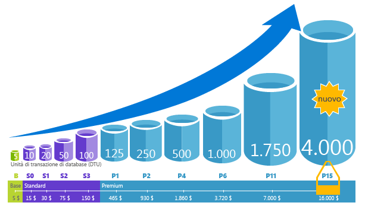
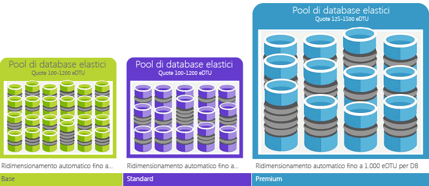

# Unità di transazione di database (DTU) e unità di transazione di database elastico (eDTU)
In questo articolo viene illustrato l'unità transazione Database (Dtu) e unità di transazione di Database elastico (Edtu) e ciò che accade quando si raggiunge hello Dtu o il numero di Edtu massimo.  

## Informazioni sulle unità di transazione di database (DTU)
Per un singolo database SQL di Azure a un livello di prestazioni specifici all'interno di un [livello di servizio](sql-database-service-tiers.md#single-database-service-tiers-and-performance-levels), Microsoft garantisce un certo livello di risorse per il database (indipendente da qualsiasi altro database in hello cloud di Azure) e fornendo un stimabile livello di prestazioni. Questa quantità di risorse viene calcolata come numero di unità di transazione di database o DTU ed è una misura combinata di CPU, memoria, I/O (I/O di dati e log delle transazioni). rapporto Hello tra queste risorse è stato originariamente stabilito da un [carico di lavoro OLTP benchmark](sql-database-benchmark-overview.md) progettato toobe tipico di carichi di lavoro OLTP reali. Quando il carico di lavoro supera hello di uno qualsiasi di queste risorse, la velocità effettiva è limitata: risultante in più lenti i timeout e le prestazioni. risorse Hello usate dal carico di lavoro non influiscono sull'hello risorse tooother disponibili i database SQL di hello cloud di Azure e risorse hello utilizzata da altri carichi di lavoro non influiscono sul database SQL di hello risorse tooyour disponibili.

Dtu sono estremamente utili per la relativa quantità hello conoscenza delle risorse tra i livelli di servizio e il database SQL di Azure in diversi livelli di prestazioni. Ad esempio, raddoppiando hello Dtu per aumentare il livello di prestazioni hello di un database equivale set hello toodoubling del database delle risorse toothat disponibili. Ad esempio, un database Premium P11 con 1750 DTU fornisce 350 volte più potenza di calcolo DTU di un database Basic con 5 DTU.  

toogain approfondita il consumo di risorse (DTU) hello del carico di lavoro, utilizzare [informazioni dettagliate prestazioni Query del Database SQL Azure](sql-database-query-performance.md) per:

- Identificare le query top hello dal conteggio di durata/CPU/esecuzione che potenzialmente può essere ottimizzato per migliorare le prestazioni. Ad esempio, una query con utilizzo intensivo dei / o può risultare vantaggioso utilizzare hello di [tecniche di ottimizzazione in memoria](sql-database-in-memory.md) toomake un migliore utilizzo della memoria disponibile di hello in un determinato livello e le prestazioni livello di servizio.
- Drill-down nei dettagli hello di una query, visualizzare il testo e la cronologia di utilizzo delle risorse.
- Accedere alle raccomandazioni relative all'ottimizzazione delle prestazioni che descrivono le azioni eseguite da [Advisor per database SQL](sql-database-advisor.md).

È possibile [modificare i livelli di servizio](sql-database-service-tiers.md) in qualsiasi momento con applicazione tooyour tempi di inattività minimi (in genere una media di meno di quattro secondi). Per molte aziende e applicazioni, da toocreate in grado di database e comporre prestazioni verso l'alto o verso il basso su richiesta, è sufficiente, specialmente se i modelli di utilizzo sono relativamente prevedibili. Ma se si dispone di modelli di utilizzo imprevisti, può risultare toomanage rigido costi e il modello aziendale. Per questo scenario, si utilizza un pool elastico con un determinato numero di Edtu che vengono condivisi tra più database nel pool di hello.

## Informazioni sulle unità di transazione di database elastico (eDTU)
Invece di fornire un set dedicato di risorse (Dtu) tooa Database SQL che è sempre disponibile indipendentemente se non necessario, è possibile posizionare i database in un [pool elastico](sql-database-elastic-pool.md) in un server di Database SQL che condivide un pool di risorse tra tali database. risorse di Hello condiviso in un pool elastico misurato dall'unità di transazione di Database elastico o di Edtu. Pool elastici forniscono una semplice soluzione economicamente vantaggiosa obiettivi di prestazioni hello toomanage per più database con ampiamente diversi e modelli di utilizzo imprevisti. In un pool elastico, è possibile garantire che nessun uno database utilizza tutte le risorse di hello in pool hello e che una quantità minima di risorse è sempre disponibile tooa database in un pool elastico. Per altre informazioni, vedere [Pool elastici](sql-database-elastic-pool.md).

A un pool viene assegnato un numero definito di eDTU per un prezzo prestabilito. All'interno di pool elastico hello, singoli database figurano hello flessibilità tooauto scala all'interno dei limiti di hello configurato. Sovraccarico, un database può utilizzare più Edtu toomeet richiesta Sebbene database carichi chiaro utilizzano minore toohello punto che i database in condizioni di carico non utilizzano alcun Edtu. Eseguendo il provisioning di risorse per l'intero pool hello, anziché per ogni database, le attività di gestione sono state semplificate e si dispone di un budget prevedibile per il pool di hello.

È possibile aggiungere ulteriori Edtu tooan pool esistente senza tempi di inattività del database e senza alcun impatto database hello in pool hello. Analogamente, se le eDTU aggiuntive non sono più necessarie, è possibile rimuoverle da un pool esistente in qualsiasi momento. È possibile aggiungere o sottrarre pool toohello database o l'importo di hello del limite della finestra di edtu che un database è possibile utilizzare in sovraccarico tooreserve Edtu per gli altri database. Se un database è prevedibile utilizzi risorse, è possibile spostarlo fuori pool hello e configurarlo come un unico database con una certa quantità di risorse necessarie.

## Come è possibile determinare il numero di hello di Dtu necessari per il carico di lavoro?
Se si vuole toomigrate una locale esistente o tooAzure del carico di lavoro di macchina virtuale SQL Server Database SQL, è possibile utilizzare hello [DTU Calcolatrice](http://dtucalculator.azurewebsites.net/) numero hello tooapproximate di Dtu necessita. Carico di lavoro un Database SQL di Azure esistente, è possibile utilizzare [informazioni dettagliate prestazioni Query di Database SQL](sql-database-query-performance.md) toounderstand il database resource consumo (Dtu) tooget approfondita come toooptimize il carico di lavoro. È inoltre possibile utilizzare hello [statistiche sulle risorse sys.dm_db_](https://msdn.microsoft.com/library/dn800981.aspx) DMV tooget hello consumo informazioni sulle risorse per hello ultima ora. In alternativa, hello vista del catalogo [resource_stats](http://msdn.microsoft.com/library/dn269979.aspx) può anche essere sottoposti a query tooget hello stessi dati per hello ultimi 14 giorni, sebbene con una fedeltà inferiore dei valori medi di cinque minuti.

## Come è possibile sapere se un pool elastico di risorse può essere utile?
I pool sono adatti per un numero elevato di database con modelli di utilizzo specifici. Per un determinato database, questo modello è caratterizzato da un utilizzo medio ridotto con picchi di utilizzo relativamente poco frequenti. Database SQL viene valutata sull'utilizzo delle risorse cronologico hello dei database in un server di Database SQL esistente automaticamente e consiglia configurazione pool appropriato hello in hello portale di Azure. Per altre informazioni, vedere [Quando usare un pool elastico](sql-database-elastic-pool.md)

## Cosa succede se si raggiunge il numero massimo di DTU
Livelli di prestazioni sono calibrati e hello tooprovide gestita necessarie risorse toorun il carico di lavoro database i limiti di toohello max consentito per il livello/prestazioni a livello di servizio selezionato. Se il carico di lavoro sta superando i limiti di hello in uno dei limiti CPU/dati IO/Log IO, continuare risorse hello tooreceive livello hello massimo consentito, ma si è probabilmente toosee aumentato latenze per le query. Questi limiti non generano errori, ma piuttosto un rallentamento del carico di lavoro di hello, a meno che il rallentamento hello più grave in modo che le query inizia temporizzazione. Se si raggiungono i limiti relativi al numero massimo di richieste o di sessioni utente simultanee (thread di lavoro), verranno visualizzati errori espliciti. Vedere [Limiti delle risorse del database SQL di Azure](sql-database-resource-limits.md) per informazioni sui limiti di risorse diverse da CPU, memoria, I/O di dati e I/O del log delle transazioni.

## Passaggi successivi
* Vedere [livello di servizio](sql-database-service-tiers.md) per informazioni su Dtu hello e di Edtu disponibile per singoli database e per il pool elastico.
* Vedere [Limiti delle risorse del database SQL di Azure](sql-database-resource-limits.md) per informazioni sui limiti di risorse diverse da CPU, memoria, I/O di dati e I/O del log delle transazioni.
* Vedere [informazioni dettagliate prestazioni Query di Database SQL](sql-database-query-performance.md) toounderstand il consumo di (Dtu).
* Vedere [Panoramica di SQL Database benchmark](sql-database-benchmark-overview.md) metodologia hello toounderstand dietro il carico di lavoro di hello OLTP benchmark utilizzato hello toodetermine DTU blend.
